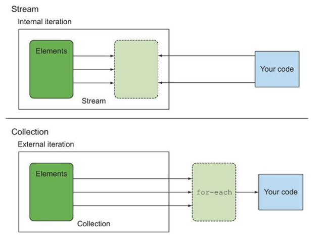

스트림을 활용하면 많은 요소를 포함하는 커다란 컬렉션을 처리하는 경우, 성능을 높이기 위해 병렬로 처리하려 할 때 스트림을 활용함으로써 간결하게 구현할 수 있다.또한 SQL에서의 필터링, 그룹화 등을 간편하게 구현할 수 있다.
## 스트림이란?
자바 API에 새로 추가된 기능으로, 선언형(데이터를 처리하는 임시 구현 코드 대신 질의로 표현 가능한)으로 컬렉션 데이터를 처리할 수 있다. filter나 sorted, map, collect와 같은 연산은 고수준 빌딩 블록(high-level building block)으로 이루어져있어, 자유롭게 사용이 가능해진다. 결과적으로 데이터 처리 과정을 병렬화 하면서 thread와 lock을 걱정할 필요가 없다.

### 스트림의 특징
* 선언형
더 간결하고 가독성이 좋아진다.
* 조립할 수 있음
유연성이 좋아진다.
* 병렬화
성능이 좋아진다.

### 스트림 시작
스트림의 정의는 `데이터 처리 연산을 지원하도록 소스에서 추출된 연속된 요소` 로 정의할 수 있다.
* 연속된 요소
컬렉션과 마찬가지로 스트림은 특정 요소 형식으로 이루어진 연속된 값 집합의 인터페이스를 제공한다. 컬렉션은 자료구조이므로 시간/공간의 복잡성과 관련된 요소 저장 및 접근 연산이 주를 이루지만, 스트림은 filter, sorted, map과 같은 표현 계산식이 주를 이룬다. 즉 `컬렉션의 주제는 데이터이고 스트림의 주제는 계산`이다.

* 소스
스트림은 컬렉션, 배열, I/O 자원 등의 데이터 제공 소스로부터 데이터를 소비한다.

* 데이터 처리 연산
스트림은 함수형 프로그래밍 언어에서 일반적으로 지원하는 연산과 데이터베이스와 비슷한 연산을 지원한다.(ex. filter, map, reduce, find, match, sort 등)

* 파이프라이닝
스트림 연산끼리 연결해서 커다란 파이프라인을 구성할 수 있다. 연산 파이프라이닝은 데이터 소스에 적용하는 데이터베이스 질의와 비슷하다.

* 내부 반복
반복자 없이 내부 반복 구현이 가능하다.
```java
import static java.util.stream.Collectors.toList;
List<String> threeHighCaloricDishNames = menu.stream()                              //  메뉴에서 스트림을 얻는다.
                                             .filter(d -> d.getCalories() > 300)    //  파이프라인 연산의 첫 번째. 300칼로리 초과되는 요리 필터링
                                             .map(Dish::getName)                    //  요리명 추출
                                             .limit(3)                              //  선착순 3개만 선택
                                             .collect(toList());                    //  결과를 다른 형식(여기에선 리스트)로 저장
```

## 스트림과 컬렉션
### 컬렉션
* 컬렉션은 `모든 요소가 계산이 완료된 상태로 저장된 자료구조` 이다. 
* 컬렉션에 요소를 추가/삭제가 가능하다.
* 적극적으로 생성된다. 즉, 모든 값의 계산이 완료될 떄까지 기다린다.
* `외부 반복`이 적용된다. 즉, 사용자가 직접 for-each 등을 활용하여 요소를 반복해야 한다.
> 외부 반복은 for-each를 활용하여 병렬성을 스스로 관리해야 한다.

### 스트림
* 스트림은 `요청할 때만 요소를 계산하는 고정된 자료구조` 이다. 
* 스트림에 요소를 추가/삭제가 불가하다.
* 사용자가 데이터를 요청할 때만 값을 계산한다.
* 단 한번만 탐색할 수 있다. 탐색했던 요소를 재탐색하려면 새로운 스트림을 생성해야 한다.
* `내부 반복`이 적용된다. 즉, 알아서 반복이 처리되고 결과 스트림 값을 어딘가에 저장해준다. 어떤 작업을 수행할 건지만 지정하면 모든 것이 알아서 처리된다.
> 컬렉션과 달리 별도의 반복자 없이 `알아서` 반복 처리 된다.

> 내부 반복은 `투명한 병렬 처리`와 `최적화된 다양한 순서`로 처리가 가능해진다. 또한 데이터 표현과 HW를 활용한 병렬성 구현을 `자동으로 선택`한다.



## 스트림 연산
스트림 연산은 다음과 같이 크게 두 가지로 구분할 수 있다. 연결할 수 있는 스트림 연산인 `중간 연산`과, 스트림을 닫는 연산인 `최종 연산`이다.

### 중간 연산
중간 연산은 최종 연산을 스트림 파이프라인에 실행하기 전까지 아무 연산도 수행하지 않는다. 중간 연산을 모두 합친 후, 합쳐진 중간 연산을 최종 연산으로 한 번에 처리한다.

### 최종 연산
최종 연산은 스트림 파이프라인에서 결과를 도출한다.(ex. forEach)

### 스트림 이용 과정
* 질의를 수행할 (컬렉션 같은) `데이터 소스`
* 스트림 파이프라인을 구성할 `중간 연산` 연결
* 스트림 파이프라인을 실행하고 결과를 만들 `최종 연산`

스트림 파이프라인 개념은 빌더 패턴과 비슷하다.