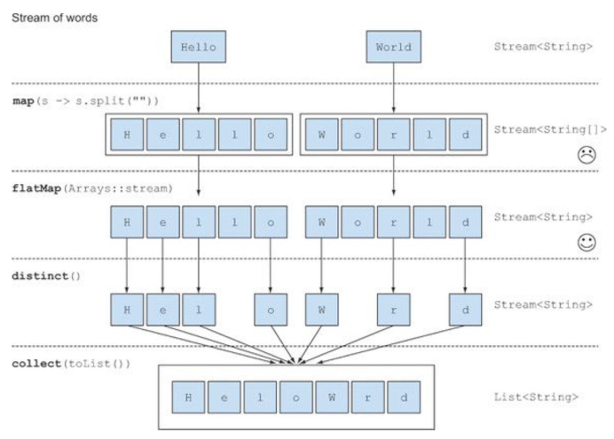
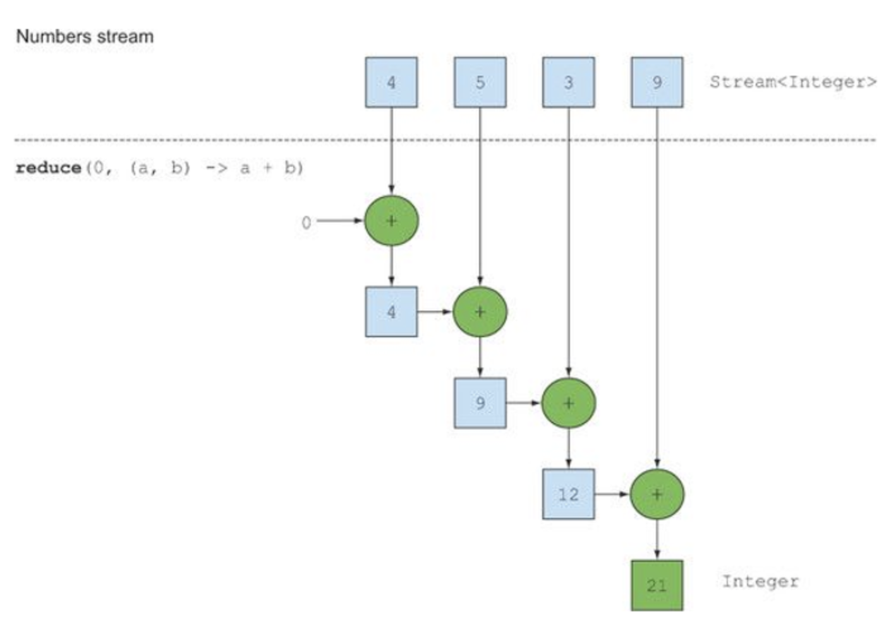

## 필터링과 슬라이싱
프레디케이트 필터링, 고유 요소 필터링, 스트림의 일부 요소를 무시하거나 스트림을 주어진 크기로 축소하는 방법을 설명한다.
### filter(Predicate<? super T> predicate) - Predicate로 필터링
```java
List<Dish> vegetarianMenu = menu.stream()
                               `.filter(Dish::isVegetarian)`
                                .collect(toList());
```
스트림 인터페이스가 지원하는 `filter 메서드는 프레디케이트(boolean 반환)`를 인수로 받아서 프레디케이트와 일치하는 모든 요소를 포함하는 스트림을 반환한다.

### disticnt() - 고유 요소 필터링
스트림은 고유 요소로 이루어진 스트림을 반환하는 distinct라는 메서드도 지원한다. `중복된 요소는 걸러지고 고유 요소만 처리`된다.
> 고유 여부는 스트림에서 만든 객체의 hashCode, equals로 결정된다.

```java
List<Integer> numbers = Arrays.asList(1, 2, 1, 3, 3, 2, 4);
numbers.stream()
       .filter(i -> i % 2 == 0)
       .distinct()
       .forEach(System.out.println);
```

### limit(long maxSize) - 스트림 축소
스트림은 `주어진 사이즈 이하의 크기를 갖는 새로운 스트림을 반환`하는 limit(n) 메서드를 지원한다. 스트림이 정렬되어 있으면 최대 n개의 요소를 반환할 수 있다.
```java
List<Dish> dishes = menu.stream()
                        .filter(d -> d.getCaloreis() > 300)
                        .collect(toList());
```
정렬되지 않은 스트림(ex. Set)에도 limit를 사용할 수 있다. 소스가 정렬되어 있지 않았다면 limit의 결과도 정렬되지 않은 상태로 반환된다.

### skip(long n) - 요소 건너뛰기
스트림은 `처음 n개 요소를 제외한 스트림을 반환`하는 skip(n) 메서드를 지원한다.
> n개 이하의 요소를 포함하는 스트림에 skip(n)을 호출하면 빈 스트림이 반환된다.

limit(n)과 skip(n)은 상호 보완적인 연산을 수행한다.
```java
List<Dish> dishes = menu.stream()
                        .filter(d -> d.getCalories() > 300)
                        .skip(2)
                        .collect(toList());
```

## 매핑
특정 객체에서 특정 데이터를 선택하는 작업은 데이터 처리 과정에서 자주 수행되는 연산이다. 스트림 API는 map과 flatMap 메서드를 통해 특정 데이터를 선택하는 기능을 제공한다.

### map(Function<? super T, ? extends R> mapper) - 스트림 각 요소에 함수 적용하기
스트림은 함수를 인수로 받는 map()를 지원한다. 인수로 제공된 함수는 각 요소에 적용되며 함수를 적용한 결과가 새로운 요소로 매핑된다.
```java
List<String> dishNames = menu.stream()
                             .map(Dish::getName)
                             .collect(toList());
```
> map()은 modify라는 개념보다는 새로운 버전을 만든다 라는 개념에 가까우므로 transforming에 가까운 mapping이라는 단어를 사용한다.

### flatMap() - 스트림 평면화
input으로 ["Hello", "World"]라면 output으로 ["H", "e", "l", "o", "W", "r", "d"]가 나오려면 `map()`과 `Arrays.stream`과 `flatMap()`을 활용해야 한다.
```java
List<String> uniqueCharacters = 
    words.stream()
         .map(w -> w.split(""))         //  각 단어를 개별 문자를 포함하는 배열로 반환
         .flatMap(Arrays::stream)       //  각 배열을 별도의 스트림으로 생성하고, 생성된 스트림을 하나의 스트림으로 평면화
         .distinct()
         .collect(Collectors.toList());
```

flatMap은 각 배열을 스트림이 아니라 스트림의 컨텐츠로 매핑한다. 즉, map(Arrays::stream)과 달리 flatMap은 하나의 평면화된 스트림을 반환한다.


> flatMap()는 스트림의 각 값을 다른 스트림으로 만든 다음 모든 스트림을 하나의 스트림으로 연결하는 기능이다.

## 검색과 매칭
특정 속성이 데이터 집합에 있는지 여부를 검색하는 데이터 처리도 자주 사용한다. 스트림 API는 allMatch, anyMatch, noneMatch, findFirst, findAny 등 다양한 유틸리티 메서드를 제공한다.

### anyMatch(Predicate<? super T> predicate) - 프레디케이트가 적어도 한 요소와 일치하는지 확인
`프레디케이트가 주어진 스트림에서 적어도 한 요소와 일치하는지 확인`할 때 anyMatch()를 이용한다.
```java
if(menu.stream().anyMatch(Dish::isVegetarian)) {
    System.out.println("anyMatch");
}
```
> anyMatch는 boolean을 반환하므로 `최종 연산`이다.

### allMatch(Predicate<? super T> predicate) - 프레디케이트가 모든 요소와 일치하는지 검사
스트림의 모든 요소가 주어진 프레디케이트와 일치하는지 검사한다.
```java
boolean isHealthy = menu.stream()
                        .allMatch(d -> d.getCalories() < 1000);
```

### noneMatch(Predicate<? super T> predicate)
noneMatch는 allMatch와 반대 연산을 수행한다.

> anyMatch, allMatch, noneMatch 세 가지 메서드는 스트림 쇼트서킷 기법, 즉 자바의 &&, ||와 같은 연산을 활용한다.

* 쇼트서킷 평가

전체 스트림을 처리하지 않았더라도 결과를 반환할 수 있는 상황을 말한다. 예를 들면 and 연산으로 연결된 커다란 boolean 표현식을 평가한다할 때 하나라도 거짓이라는 결과가 나오면 나머지 표현식의 결과는 상관없이 전체 결과가 거짓일 나타내게 되는 상황을 말한다.<br>
allMatch, noneMatch, findFirst, findAny, limit 등의 연산은 쇼트서킷이 적용된다.

### findAny() - 요소 검색
현재 스트림에서 임의의 요소를 반환하는 메소드이다.
```java
Optional<Dish> dish = menu.stream()
                          .filter(Dish::isVegetarian)
                          .findAny();
```
스트림 파이프라인은 내부적으로 단일 과정으로 실행할 수 있도록 최적화된다. 즉, 쇼트서킷을 이용해서 결과를 찾는 즉시 실행을 종료한다.

* Optional이란?

Optional<T> 클래스(java.util.Optional)는 `값의 존재나 부재 여부를 표현하는 컨테이너 클래스`다. findAny는 null을 반환할 수도 있는데, 그렇게 되면 에러를 일으키게 되므로 이를 방지하기 위해 만들어진 기능이다.<br>
Optional은 값이 존재하는지 확인하고, 값이 없을 때 어떻게 처리할 것인지 강제하는 기능을 제공한다.
> - ifPresent() : Optional이 값을 포함하면 true을 반환하고, 값을 포함하지 않으면 false를 반환한다.
> - ifPresent(Consumer<T> block) : 값이 있으면 주어진 블록을 실행한다.
> - T get() : 값이 존재하면 값을 반환하고, 값이 없으면 NoSuchElementException을 일으킨다.
> - T orElse(T order)는 값이 있으면 값을 반환하고, 없으면 기본 값을 반환한다.
```java
menu.stream()
    .filter(Dish::isVegetarian)
    .findAny()                                          //  Optional<Dish> 반환
    .ifPresent(d -> System.out.println(d.getName());    //  값이 있으면 출력, 없으면 아무일도 일어나지 않음.
```
### findFirst() - 첫 번째 요소 찾기
리스트 또는 정렬된 연속 데이터로부터 생성된 스트림처럼 일부 스트림에는 논리적인 아이템 순서가 정해져 있을 수 있다.
```java
List<Integer> someNumbers = Arrays.asList(1, 2, 3, 4, 5);
Optional<Integer> firstSquareDivisibleByThree 
        = someNumbers.stream()
                     .map(x -> x * x)
                     .filter(x -> x % 3 == 0)
                     .findFirst();  //  9 
```
> findFirst와 findAny가 필요한 이유는 병렬성 때문이다. 병렬 스트림에서는 첫 번째 요소를 찾기 어렵다. 따라서 요소의 반환 순서가 상관없다면 병렬 스트림에서는 제약이 적은 findAny를 사용한다.

## 리듀싱
리듀스(reduce) 연산은 스트림 요소를 조합하여 더 복잡한 질의를 표현하기 위해 `결과가 나올 때 까지 스트림의 모든 요소를 반복적으로 처리하는 연산 방식`을 말한다. 즉, 모든 스트림 요소를 처리하여 값을 도출하는 과정을 말한다.
> 함수형 프로그래밍 언어 용어로는 `폴드(fold)`라고 부른다.

### reduce(T identity, BinaryOperator<T> accumulator) - 요소의 합
```java
int sum = 0;
for (int x : numbers) {
    sum += x;
}

int sum = numbers.stream().reduce(0, (a, b) -> a + b);
```
a는 초기값, (a, b) -> a + b는 두 요소를 조합해서 새로운 값을 만드는 BinaryOperator<T>를 사용했다.

정적 메서드 sum을 활용하면 더 간결하게 구현이 가능하다.
```java
int sum = numbers.stream().reduce(0, Integer::sum);
```
* 초기값이 없는 경우
```java
Optional<Integer> sum = numbers.stream().reduce((a, b) -> (a + b));
```
초기값을 받지 않는 경우, reduce는 Optional 객체를 반환한다.<br> 
Optional<Integer>를 반환하는 이유는 스트림에 아무 요소도 없는 경우, 초기값도 없으므로 reduce는 합계를 반환할 수 없기 때문에 Optional 객체로 감싼 결과를 반환한다.

### 최대값과 최소값
역시 reduce를 활용하여 최대값과 최소값을 찾을 수 있다.
```java
Optional<Integer> max = numbers.steam().reduce(Integer::max);
```
> 맵 리듀스 패턴이란, map과 reduce를 연결하는 기법으로 쉽게 병렬화가 가능한 특징이 있다.

* reduce 메서드의 장점과 병렬화

기존 단계적 반복으로 합계를 구하는 방법(가변 누적자 패턴 - mutable accumulator pattern)과 reduce를 활용하여 합계를 구하는 것의 차이는 무엇일까.<br>
reduce를 활용하면 내부 반복이 추상화되면서 내부 구현에서 병렬로 reduce를 실행할 수 있게 된다. 반복적인 합계는 `sum 변수를 공유해야 하므로` 쉽게 병렬화가 어렵다. 강제적으로 동기화시킨다 하더라도 결국 병렬화로 얻어야 할 이득이 thread 간의 소모적인 경쟁 때문에 상쇄되어 버린다.

* 스트림 연산 - 상태 없음과 상태 있음

    * map, filter - stateless operation(내부 상태 없음)
    
        입력 스트림에서 각 요소를 받아 0 또는 결과를 출력 스트림으로 보낸다. 따라서 이들은 보통 상태가 없는, 즉 내부 상태를 갖지 않는 연산(stateless operation)이다.
        
    * reduce, sum, max - stateful operation(상태 있음), bound
    
        결과를 누적할 내부 상태가 필요하다. 스트림에서 처리하는 요소 수와 관계없이 내부 상태의 크기는 한정(bounded)되어 있다.
        
    * sorted, distinct - stateful operation, unbound
    
        filter, map 처럼 스트림을 입력으로 받아 다른 스트림을 출력하는 형태긴 하지만, 정렬이나 중복을 제거하려면 과거의 이력을 알고 있어야 한다. 따라서 이러한 연산은 내부 상태를 갖는 연산이라고 간주할 수 있다.
        
        
<table>
  <thead>
    <tr>
      <th>연산</th>
      <th>형식</th>
      <th>반환 형식</th>
      <th>사용된 함수형 인터페이스 형식</th>
      <th>함수 디스크립터</th>
    </tr>
  </thead>
  <tbody>
    <tr>
      <td>filter</td>
      <td>중간 연산</td>
      <td>Stream< T ></td>
      <td>Predicate< T ></td>
      <td>T -> boolean</td>
    </tr>
    <tr>
      <td>distinct</td>
      <td>중간 연산(상태 있는 언바운드)</td>
      <td>Stream< T ></td>
      <td></td>
      <td></td>
    </tr>
    <tr>
      <td>skip</td>
      <td>중간 연산(상태 있는 바운드)</td>
      <td>Stream< T ></td>
      <td>Long</td>
      <td></td>
    </tr>
    <tr>
      <td>limit</td>
      <td>중간 연산(상태 있는 바운드)</td>
      <td>Stream< T ></td>
      <td>Long</td>
      <td></td>
    </tr>
    <tr>
      <td>map</td>
      <td>중간 연산</td>
      <td>Stream< T ></td>
      <td>Function< T, R ></td>
      <td>T -> R</td>
    </tr>
    <tr>
      <td>flatMap</td>
      <td>중간 연산</td>
      <td>Stream< T ></td>
      <td>Function< T, Stream< R > ></td>
      <td>T -> Stream< R ></td>
    </tr>
    <tr>
      <td>sorted</td>
      <td>중간 연산(상태 있는 언바운드)</td>
      <td>Stream< T ></td>
      <td>Function< T, Stream< R > ></td>
      <td>T -> Stream< R ></td>
    </tr>
    <tr>
      <td>anyMatch</td>
      <td>최종 연산</td>
      <td>boolean</td>
      <td>Predicate< T ></td>
      <td>T -> boolean</td>
    </tr>
    <tr>
      <td>noneMatch</td>
      <td>최종 연산</td>
      <td>boolean</td>
      <td>Predicate< T ></td>
      <td>T -> boolean</td>
    </tr>
    <tr>
      <td>allMatch</td>
      <td>최종 연산</td>
      <td>boolean</td>
      <td>Predicate< T ></td>
      <td>T -> boolean</td>
    </tr>
    <tr>
      <td>findAny</td>
      <td>최종 연산</td>
      <td>Optional< T ></td>
      <td></td>
      <td></td>
    </tr>
    <tr>
      <td>findFirst</td>
      <td>최종 연산</td>
      <td>Optional< T ></td>
      <td></td>
      <td></td>
    </tr>
    <tr>
      <td>forEach</td>
      <td>최종 연산</td>
      <td>void</td>
      <td>Consumer< T ></td>
      <td>T -> void</td>
    </tr>
    <tr>
      <td>Collect</td>
      <td>최종 연산</td>
      <td>R</td>
      <td>Collect< T, A, R ></td>
      <td></td>
    </tr>
    <tr>
      <td>Reduce</td>
      <td>최종 연산(상태 있는 언바운드)</td>
      <td>Optional< T ></td>
      <td>BinaryOperator< T ></td>
      <td>(T, T) -> T</td>
    </tr>
    <tr>
      <td>count</td>
      <td>최종 연산</td>
      <td>long</td>
      <td></td>
      <td></td>
    </tr>
  </tbody>
</table>