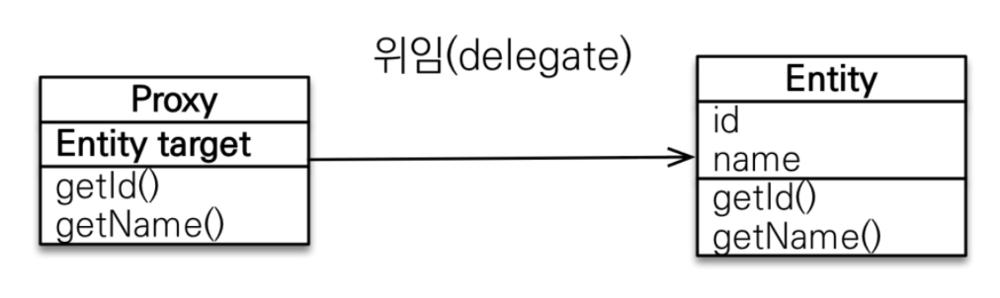
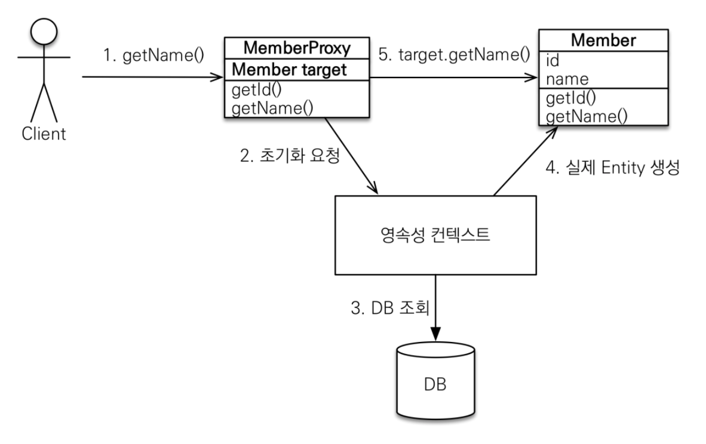

* 프록시와 즉시/지연로딩
객체가 데이터베이스에 저장되면서 객체 그래프로 연관된 객체를 마음껏 탐색이 어려워졌다. 이 때 프록시를 사용함으로써 연관된 객체를 처음부터 데이터베이스에서 조회하는 것이 아닌, 실제 사용하는 시점에 데이터베이스에서 조회할 수 있다. 하지만 자주 함께 사용하는 객체들은 조인을 사용해서 함께 조회하는 것이 효과적이다.<br>
> JPA는 즉시/지연 로딩을 지원한다.

* 영속성 전이와 고아 객체
JPA는 연관된 객체를 함께 저장하거나 함께 삭제할 수 있는 영속성 전이와 고아 객체 제거라는 편리한 기능을 제공한다.

## 프록시
엔티티를 조회할 때 연관된 엔티티들은 비즈니스 로직에 따라 함께 사용되거나 사용되지 않을 수도 있다.

```java
@Entity
public class Member {
    
    private String username;

    @ManyToOne
    private Team team;

    public Team getTeam() {
        return team;
    }

    public String getUsername() {
        return username;
    }

    ...

}

@Entity
public class Team {
    
    private String name;

    public String getName() {
        return name;
    }

    ...
    
}
```
```java
public void printUserAndTeam(String memberId) {
    Member member = em.find(Member.class, memberId);
    Team team = member.getTeam();
    System.out.println("회원 이름: " + member.getUsername());
    System.out.println("소속팀: " + team.getName());
}

public String printUser(String memberId) {
    Member member = em.find(Member.class, memberId);
    System.out.println("회원 이름: " + member.getUsername());
}
```
여기서 printUser() 메소드는 회원 엔티티만 사용하므로 em.find()로 회원 엔티티를 조회할 때 연관된 팀 엔티티까지 데이터베이스에서 함께 조회되면 비효율적이게 된다.<br>
JPA는 이러한 문제를 `지연 로딩`이라는 기술을 활용하여 해결한다.
> 지연 로딩이란, 위 team.getName() 처럼 실제 팀 엔티티의 값을 사용하게 될 때 데이터베이스에서 조회하도록 하는 기술을 말한다.

그런데, 지연 로딩 기능을 사용하려면 `실제 엔티티 객체 대신에 데이터베이스 조회를 지연할 수 있는 가짜 객체`, 즉 `프록시 객체`가 사용 된다.

> 지연 로딩을 지원하기 위한 방법으로 `프록시를 사용`하는 방법과 `바이트 코드를 수정`하는 방법, 두 가지 방법이 있다.

### 프록시 기초
`EntityManager.find()`를 사용하면 영속성 컨텍스트에 엔티티가 없을 때, 데이터베이스를 직접 조회하게 된다.<br>
`EntityManager.getReference()`를 사용하면 엔티티가 실제 사용되는 시점에 데이터베이스를 조회해오게 된다. 이 메소드를 호출하게 되면 JPA는 데이터베이스를 조회하지 않고 실제 엔티티 객체도 생성하지 않는다. 대신 **데이터베이스 접근을 위임한 프록시 객체를 반환**한다.

* 프록시의 특징
프록시 클래스는 `실제 클래스를 상속 받아서 만들어지므로` 실제 클래스와 겉모양이 같다. 따라서 사용자 입장에서는 실제 객체와 프록시 객체 구분없이 사용하면 된다.<br>
프록시 객체는 실제 객체에 대한 참조(target)을 보관한다. 그리고 프록시 객체의 메소드를 호출하면 프록시 객체는 실제 객체의 메소드를 호출한다.


* 프록시 객체의 초기화
프록시 객체의 초기화란, member.getName() 처럼 실제 사용될 때 데이터베이스를 조회해서 `실제 엔티티 객체를 생성하는 행위`를 말한다.
```java
//MemberProxy 반환
Member member = em.getReference(Member.class, "id1");
member.getName();   //  1. getName();

class MemberProxy extends Member {
    
    Member target = null;   //  실제 엔티티 참조

    public String getName() {
        if (target == null) {
            //  2. 초기화 요청
            //  3. DB 조회
            //  4. 실제 엔티티 생성 및 참조 보관
            
            this.target = ...;
        }

        //  5. target.getName();
        return target.getName();
    }

}
```

1. member.getName() 호출을 통해 실제 데이터를 조회
2. 실제 엔티티가 생성되어있지 않으면 영속성 컨텍스트에 실제 엔티티 생성을 요청하게 되는데 이를 `프록시 초기화`라 한다.
3. 영속성 컨텍스트는 데이터베이스를 조회하여 실제 엔티티 객체를 생성한다.
4. 프록시 객체는 생성된 실제 엔티티 객체의 참조를 Member target 멤버변수에 보관한다.
5. 프록시 객체는 실제 엔티티 객체의 getName() 을 호출해서 결과를 반환한다.

* 프록시의 특징
1. 프록시 객체는 처음 사용할 때 한 번만 초기화된다.
2. 프록시 객체를 초기화한다고 프록시 객체가 실제 엔티티로 바뀌는 것은 아니다. `프록시 객체가 초기화 되면 프록시 객체를 통해서 실제 엔티티에 접근할 수 있다.`
3. 프록시 객체는 원본 엔티티를 상속받은 객체이므로 타입 체크 시, 주의해서 사용해야 한다.
4. 영속성 컨텍스트에 찾는 엔티티가 이미 있으면 데이터베이스 조회가 필요 없으므로 em.getReference()를 호출해도 프록시가 아닌 실제 엔티티를 반환한다.
5. 초기화는 영속성 컨텍스트의 도움을 받아야 가능하다. 따라서 영속성 컨텍스트의 도움을 받을 수 없는 준영속 상태의 프록시를 초기화하면 문제가 발생한다, 하이버네이트는 org.hibernate.LazyInitializationException 예외를 발생시킨다.

> 프록시 객체 타입 체크 시 주의해야 하는 이유는?

* 준영속 상태와 초기화
```java
//  MemberProxy 반환
Member member = em.getReference(Member.class, "id1");
transaction.commit();
em.close();         //  영속성 컨텍스트 종료

member.getName();   //  준영속 상태 초기화 시도, 
                    //  org.hibernate.LazyInitializationException 예외 발생
```
em.close() 메소드로 영속성 컨텍스트가 종료됬으므로, member는 준영속 상태이다.

### 프록시와 식별자
엔티티를 프록시로 조회할 때 식별자(PK) 값을 파라미터로 전달하는데 프록시 객체는 이 식별자 값을 보관한다.
```java
Team team = em.getReference(Team.class, "team1");   //  식별자 보관
team.getId();   //  초기화되지 않음.
```
프록시 객체는 식별자 값을 가지고 있으므로 식별자 값을 조회하는 team.getId()를 호출해도 프록시를 초기화하지 않는다.<br>
단, 엔티티 접근 방식을 프로퍼티(@Access(AccessType.PROPERTY))로 설정한 경우에만 초기화하지 않는다.<br>
엔티티 접근 방식을 필드(@Access(AccessType.FIELD))로 설정하면 JPA는 getId()메소드가 id만 조회하는 메소드인지, 다른 필드까지 활용해서 어떤 일을 하는 메소드인지 알지 못하므로 프록시 객체를 초기화 한다.
> 단, `엔티티 접근 방식을 필드`로 설정했을 때 `연관관계를 설정할 때는 프록시를 초기화하지 않는다.`

### 프록시 확인
JPA가 제공하는 `PersistenceUnitUtil.isLoaded(Object entity)` 메소드로 프록시 객체의 초기화 여부를 확인할 수 있다. 이미 초기화 된 프록시 객체는 true, 아직 초기화되지 않았다면 false를 반환한다.
```java
boolean isLoaded = em.getEntityManagerFactory()
                     .getPersistenceUnitUtil().isLoaded(entity);
//  또는 boolean isLoad = emf.getPersistenceUnitUtil.isLoaded(entity);

System.out.println("isLoad = " + isLoad);   //  초기화 여부 확인
```
또 다른 방법으로 클래스명을 직접 출력해봄으로써 조회한 엔티티가 실제 엔티티인지, 프록시로 조회한 것인지 확인할 수 있다.
```java
System.out.println("memberProxy = " + member.getClass().getName());
//  결과 : memberProxy = jpabook.domain.Member_$$_javassist_0
```

* 프록시 강제 초기화
하이버네이트의 initialize() 메소드를 사용하여 프록시를 강제로 초기화할 수 있다.
```java
org.hibernate.Hibernate.initialize(order.getMember());  //  프록시 초기화
```
JPA의 표준에는 프록시 강제 초기화 메소드가 없기 때문에 member.getName()처럼 프록시의 메소드를 직접 호출함으로써 강제로 초기화할 수 있다.<br>
JPA의 표준은 단지 초기화 여부만 확인 할 수 있다.

## 즉시 로딩과 지연 로딩
주로 연관된 엔티티를 지연 로딩할 때 프록시 객체가 사용된다.<br>
JPA는 개발자가 연관된 엔티티의 조회 시점을 선택할 수 있도록 두 가지 방법을 제공한다.
* 즉시 로딩 : 엔티티를 조회할 때 연관된 엔티티도 함께 조회
ex. em.find(Member.class, "member1")를 호출할 때 회원 엔티티와 연관된 팀 엔티티도 함께 조회
> 설정 방법 : @ManyToOne(fetch = FetchType.EAGER)

* 지연 로딩 : 연관된 엔티티를 실제 사용할 때 조회
ex. member.getTeam().getName() 처럼 조회한 팀 엔티티를 실제 사용하는 시점에 JPA가 SQL을 호출해서 팀 엔티티를 조회
> 설정 방법 : @ManyToOne(fetch = FetchType.LAZY)

### 즉시 로딩
```java
@Entity
public class Member {
    //  ...
    @ManyToOne(fetch = FetchType.EAGER)
    @JoinColumn(name = "TEAM_ID")
    private Team team;
    //  ...
    
}

Member member = em.find(Member.class, "member1");
Team team = member.getTeam();   //  객체 그래프 탐색
```
em.find(Member.class, "member1") 로 회원을 조회하는 순간 팀도 함께 조회한다. 이 때 회원, 팀 두 테이블을 모두 조회해야 하므로 쿼리를 2번 실행할 것 같지만, 대부분의 JPA 구현체는 `즉시 로딩을 최적화하기 위해 가능하면 조인 쿼리를 사용`한다.
```sql
SELECT
    M.MEMBER_ID AS MEMBER_ID,
    M.TEAM_ID AS TEAM_ID,
    M.USERNAME AS USERNAME,
    T.TEAM_ID AS TEAM_ID,
    T.NAME AS NAME
FROM
    MEMBER M LEFT OUTER JOIN TEAM T
        ON M.TEAM_ID = T.TEAM_ID
WHERE
    M.MEMBER_ID = 'member1'
```
sql상으로 회원과 팀을 조인하여 쿼리 한 번으로 조회한다. 이후 member.getTeam() 을 호출하면 이미 로딩된 팀1 엔티티를 반환한다.
* NULL 제약 조건과 JPA 조인 전략
즉시 로딩 실행 시, 외부 조인(LEFT OUTER JOIN)이 사용되고 있다. 회원 테이블에 TEAM_ID 외래 키는 NULL 값을 허용하고 있다. 따라서 팀에 소속되지 않은 회원이 있을 가능성이 있다. 팀에 소속하지 않은 회원과 팀을 내부 조인하면 팀은 물론이고 회원 데이터도 조회할 수 없다.<br>
JPA는 이런 상황을 고려하여 외부 조인을 사용한다. 하지만 성능과 최적화 면에서 내부 조인이 유리하다. 내부 조인을 사용하려면 선행 조건으로 `외래 키에 NOT NULL 조건을 설정`함으로써 내부 조인만 사용해도 문제가 없다.<br>
JPA에게는 `@JoinColumn(nullable = false)`를 설정하여 NOT NULL 조건을 설정했음을 먼저 알려주게 되면, JPA는 외부 조인 대신 내부 조인을 사용하게 된다.
```java
@Entity
public class Member {
    //  ...
    @ManyToOne(fetch = FetchType.EAGER)
    @JoinColumn(name = "TEAM_ID", nullable = false)
    private Team team;
    //  ...
}
```


> nullable 설정에 따른 조인 전략
> * @JoinColumn(nullable = true) : NULL 허용(기본 값). 외부 조인 사용
> * @JoinColumn(nullable = false) : NULL 허용하지 않음. 내부 조인 사용<br>
>또는 `@ManyToOne.optional = false`로 설정해도 내부 조인을 사용할 수 있다.
>```java
>@Entity
>public class Member {
>   //  ...
>   @ManyToOne(fetch = FetchType.EAGER, optional = false)
>   @JoinColumn(name = "TEAM_ID")
>   private Team team;
>   //  ...
>}
>```

### 지연 로딩
```java
@Entity
public class Member {
    //  ...
    @ManyToOne(fetch = FetchType.LAZY)
    @JoinColumn(name = "TEAM_ID")
    private Team team;
    //  ...
}

Member member = em.find(Member.class, "member1");
Team team = member.getTeam();   //  객체 그래프 탐색(프록시 객체)
team.getName();                 //  팀 객체 실제 사용
```
em.find(Member.class, "member1")를 호출하면 회원만 조회하고 팀은 조회하지 않는다. 대신, `조회한 회원의 team 멤버변수에 프록시 객체를 넣어둔다.`<br>
반환된 팀 객체는 프록시 객체이다. 이 프록시 객체는 실제 사용될 때 까지 데이터 로딩을 미룬다. 그래서 지연 로딩이라 한다.
이처럼 실제 데이터가 필요한 순간이 되어서야 데이터베이스를 조회해서 프록시 객체를 초기화한다.
em.find(Member.class, "member1") 호출 시 아래와 같은 sql이 실행된다.
```sql
SELECT * FROM MEMBER
WHERE MEMBER_ID = 'member1'
```
team.getName() 호출로 프록시 객체가 초기화 되면서 아래와 같은 sql이 실행된다.
```sql
SELECT * FROM TEAM
WHERE TEAM_ID = 'team1'
```

> 그렇다면 지연 로딩은 쿼리가 2번 실행되는것인가?

* 지연 로딩
연관된 엔티티를 프록시로 조회한다. 프록시를 실제 사용할 때 초기화하면서 데이터베이스를 조회한다.
* 즉시 로딩
연관된 엔티티를 즉시 조회한다. 하이버네이트는 가능하면 sql 조인을 통해 한 번 조회한다.

## 지연로딩 활용
* 회원과 팀(N:1)
    * 회원과 팀은 자주 함께 사용 -> 즉시 로딩
* 회원과 주문(1:N)
    * 회원과 주문은 가끔 사용 -> 지연 로딩
* 주문과 상품정보(N:1)
    * 주문과 상품은 자주 함께 사용 -> 즉시 로딩
```java
@Entity
@Getter
@Setter
public class Member {
    
    @Id
    private String id;
    private String username;
    private Integer age;

    @ManyToOne(fetch = FetcyType.EAGER) //  즉시 조회
    private Team team;

    @OneToMany(mappedBy = "member", fetch = FetchType.LAZY) //  프록시로 조
    private List<Order> order;

}
```    
* 회원을 조회할 때 실행되는 SQL

```sql
SELECT
    MEMBER.ID AS MEMBERID,
    MEMBER.AGE AS AGE,
    MEMBER.TEAM_ID AS TEAM_ID,
    MEMBER.USERNAME AS USERNAME,
    TEAM.ID AS TEAMID,
    TEAM.NAME AS NAME
FROM
    MEMBER MEMBER
LEFT OUTER JOIM
    TEAM TEAM ON MEMBER.TEAM_ID=TEAM1_.ID
WHERE
    MEMBER0_.ID='member1'
```
회원과 팀은 즉시 로딩이므로 조인 쿼리를 통해 회원과 팀이 한꺼번에 조회된다.<br>
회원과 주문은 지연 로딩이므로 결과를 프록시로 조회한다. 따라서 sql에 나타나지 않는다.<br>
회원을 조회한 후 member.getTeam()을 호출하면 이미 로딩된 팀 엔티티를 반환한다.

### 프록시와 컬렉션 래퍼
> 프록시 객체는 실제 자신이 사용될 때 까지 데이터베이스를 조회하지 않는다.

* 컬렉션 래퍼
엔티티를 영속 상태로 마들 때 엔티티에 컬렉션이 있으면 `컬렉션을 추적/관리할 목적`으로 원본 컬렉션을 하이버네이트가 제공하는 내장 컬렉션으로 변경된 것을 말한다. 컬랙션 래퍼도 프록시 역할을 수행한다.<br>

엔티티를 지연 로딩하면 프록시 객체가 지연 로딩을 수행하지만 `컬렉션은 컬렉션 래퍼가 지연 로딩을 처리`해준다. 다만, 차이가 있다면 컬렉션 래퍼는 컬랙션이기 때문에 엔티티를 조회하듯이 member.getOrder()를 호출해도 컬렉션은 초기화되지 않는다. `member.getOrder().get(0)`처럼 컬렉션에서 실제 데이터를 조회하게 될 때 데이터베이스를 조회해서 초기화한다.

### JPA 기본 fetch 전략
* @ManyToOne, @OneToOne : 즉시 로딩(FetchType.EAGER)
* @OneToMany, @ManyToMany : 지연 로딩(FetchType.LAZY)
연관된 엔티티가 하나면 즉시 로딩, 컬렉션이면 지연 로딩을 사용한다. 컬렉션을 로딩하는 것은 비용이 많이 들고 잘못하면 너무 많은 데이터를 로딩할 수 있기 때문이다.

### 컬렉션에 FetchType.EAGER 사용 시 주의점
* 컬렉션을 하나 이상 즉시 로딩하는 것은 좋지 않다.

컬렉션과 조인한다는 것은 일대다를 의미하므로 너무 많은 데이터를 반환하게되어 애플리케이션 성능이 저하될 수 있기 때문에 2개 이상의 컬렉션을 즉시 로딩으로 설정하는 것은 권장되지 않는다.
* 컬렉션 즉시 로딩은 항상 외부 조인을 사용한다.

일대다 관계인 팀 테이블에서 회원 테이블로 조인할 때 회원이 한 명도 없는 팀을 내부 조인하게 되면 팀까지 조회되지 않는 문제가 발생하기 때문에 JPA는 일대다 관계를 즉시 로딩할 때 항상 외부 조인을 사용한다.

> * @ManyToOne, @OneToOne
>   * (optional = false): 내부 조인
>   * (optional = true) : 외부 조인
> * @OneToMany, @ManyToMany
>   * (optional = false): 외부 조인
>   * (optional = true) : 외부 조인\

## 영속성 전이: CASCADE
특정 엔티티를 영속 상태로 만들 때 연관된 엔티티도 함께 영속 상태로 만들고 싶으면 영속성 전이(transitive persistence) 기능을 사용하면 된다.<br>
JPA는 CASCADE 옵션으로 영속성 전이를 제공한다.
> 즉, 영속성 전이를 통해 부모 엔티티와 자식 엔티티가 함께 영속성 관리를 받게 된다.

JPA에서 엔티티를 저장할 때 연관된 모든 엔티티는 영속 상태여야 한다. CASCADE 옵션을 사용하면 별도로 부모 엔티티를 영속 상태로 만들고 또 자식 엔티티를 영속 상태를 만드는 번거로움 없이 부모만 영속 상태로 만들면 연관된 자식까지 한 번에 영속 상태로 만들 수 있다.

### 영속성 전이: 저장
```java
@Entity
public class Parent {
    ...
    @OneToMany(mappedBy = "parent", cascade = CascadeType.PERSIST)
    private List<Child> children = new ArrayList<Child>(); 
}
```
위 코드처럼 casecade = CascadeType.PERSIST 옵션을 설정하면 부모와 자식 엔티티를 한 번에 영속화 할 수 있다.

```java
private static void saveWithCascade(EntityManager em) {
    Child child1 = new Child();
    Child child2 = new Child();

    Parent parent = new Parent();
    child1.setParent(parent);    //  연관관계 추가
    child2.setParent(parent);    //  연관관계 추가
    parent.getChildren().add(child1);
    parent.getChildren().add(child2);

    //  부모 저장, 연관된 자식들 저장
    em.persist(parent);
}
```
영속성 전이는 연관관계를 매핑하는 것과는 아무 관련이 없다. 단지 엔티티를 영속화할 때 연관된 엔티티도 같이 영속화하는 편리함을 제공할 뿐이다. 그래서 위 소스도 양방향 연관관계를 추가한 후 영속 상태로 만든 것을 확인할 수 있다.

> cascade를 통한 영속성 전이와 manytoone 연관관계에서 many쪽 엔티티에 저장할 때 one쪽도 저장되는 것의 차이는?

### 영속성 전이: 삭제
`CascadeType.REMOVE`를 설정하여 부모 엔티티만 삭제해도 연관된 자식 엔티티도 함께 삭제 가능하다.
```java
Parent findParent = em.find(Parent.class, 1L);
em.remove(findParent);
```
코드를 실행하면 DELETE SQL 3번 실행하고 부모는 물론 연관된 자식도 모두 삭제한다. 삭제 순서는 외래 키 제약조건을 고려하여 자식을 먼저 삭제한 후 부모를 삭제한다.<br>
만약, CascadeType.REMOVE를 설정하지 않고 코드를 실행하게 되면 부모 엔티티만 삭제되나, 데이터베이스에서 부모 로우를 삭제하는 순간 자식 테이블에 걸려있는 외래 키 제약조건에 의해 데이터베이스에서 외래키 무결성 예외가 발생한다.

### CASCADE 종류
```java
public enum CascadeType {

    /** Cascade all operations */
    ALL,

    /** Cascade persist operation */
    PERSIST,

    /** Cascade merge operation */
    MERGE,

    /** Cascade remove operation */
    REMOVE,

    /** Cascade refresh operation */
    REFRESH,

    /**
     * Cascade detach operation
     *
     * @since Java Persistence 2.0
     *
     */
    DETACH
}
```
`casecade = {CascadeType.PERSIST, CascadeType.REMOVE}` 와 같은 형식으로 여러 속성을 같이 사용할 수도 있다.

> CascadeType.PERSIST, CascadeType.REMOVE는 em.persist(), em.remove() 실행 시 바로 전이가 발생되지 않고 `flush를 호출할 때 전이가 발생`한다.

## 고아 객체
부모 엔티티와 연관관계가 끊어진 자식 엔티티를 자동으로 삭제하는 기능을 `고아 객체(ORPHAN) 제거`라 한다. 이 기능을 통해 부모 엔티티의 컬렉션에서 자식 엔티티의 참조만 제거하면 자식 엔티티가 자동으로 삭제될 수 있다.

```java
@Entity
public class Parent {

    @Id @GeneratedValue
    private Long id;

    @OneToMany(mappedBy = "parent", orphanRemoval = true)
    private List<Child> childrent = new ArrayList<Child>();
    ...
}

Parent parent1 = em.find(Parent.class, id);
parent1.getChildren().remove(0);    //  자식 엔티티를 컬렉션에서 제거
```
위와 같이 실행하게 되면 `DELETE FROM CHILD WHERE ID=?` 와 같은 sql이 실행된다.<br>
`orphanRemoval = true` 옵션으로 인해 `컬렉션에서 엔티티를 제거하면 데이터베이스의 데이터도 삭제`된다. 고아 객체 제거 기능은 영속성 컨텍스트를 flush할 때 적용되므로 flush 시점에 DELETE sql이 실행된다.<br>
모든 자식 엔티티 제거는 아래와 같이 모든 컬렉션을 비우면 된다.
```java
parent1.getChildrent().clear();
```

고아 객체 제거는 `참조가 제거된 엔티티는 다른 곳에서 참조하지 않는 고아 객체로 보고 삭제하는 기능`이다. 따라서 이 기능은 참조되는 곳이 하나일 때만 사용해야 한다. 만약 삭제한 엔티티가 다른 곳에서도 참조한다면 문제가 발생할 수 있다.
> orphanRemoval은 @OneToOne, @OneToMany에만 사용할 수 있다.

개념적으로 부모를 제거할때도 자식은 고아가 되기 때문에 부모를 제거하면 자식도 제거된다. 이는 CascadeType.REMOVE를 설정한 것 과 같다.

## 영속성 전이 + 고아 객체, 생명주기
`CascadeType.ALL + orphanRemovall = true`를 동시에 사용하게 되면, 부모 엔티티를 통해 자식의 생명 주기를 관리할 수 있다.

> 영속성 전이는 DDD의 Aggregate Root 개념 구현에 용이하다.

## 정리
* JPA 구현체들은 객체 그래프를 마음껏 탐색할 수 있도록 지원하는데 이 때 `proxy`기술을 사용한다.
* 객체 조회 시, 연관된 객체를 즉시 조회해오는 방법을 `즉시 로딩`이라 하고 연관된 객체를 지연해서 조회해오는 방법을 `지연 로딩`이라고 한다.
* 객체를 저장하거나 삭제할 때, 연관된 객체도 함께 저장하거나 삭제할 수 있는데 이를 `영속성 전이`라 한다.
* 부모 엔티티와 연관관계가 끊어진 자식 엔티티를 자동으로 삭제하려면 `고아 객체 제거 기능`을 사용한다.