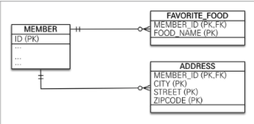

* 엔티티 타입
    * @Entity로 정의하는 객체
    * 식별자를 통해 지속해서 추적할 수 있다.
    
* 값 타입
    * int, Integer, String 처럼 단순히 값으로 사용하는 자바 기본 타입
    * 식별자가 없고 숫자나 문자같은 속성만 있으므로 추적할 수 없다.
    
* 값 타입 3가지 종류
    * 기본값 타입(Basic Value Type)
        * 자바 기본 타입(ex. int, double)
        * 래퍼 클래스(ex. Integer)
        * String
    * 임베디드 타입(Embedded Type - 복합 값 타입)
    * 컬렉션 값 타입(Collection Value Type)
    
## 기본 값 타입
```java
@Entity
public class Member {
    
    @Id @GeneratedValue
    private Long id;

    private String name;    //  값 타입

    private int age;        //  값 타입
    ...
}
```

member 엔티티는 id라는 식별자 값도 갖고 생명주기도 있지만, 값 타입인 name, age 속성은 식별자 값도 없고 생명주기도 member 엔티티에 의존한다. 따라서 회원 엔티티 인스턴스를 제거하면 name, age 값도 제거된다.<br>
그리고 값 타입은 공유하면 안된다.

## 임베디드 타입(복합 값 타입)
직접 정의한 새로운 값 타입을 말한다.
```java
@Entity
public class Member {
    
    @Id @GeneratedValue
    private Long id;
    private String name;

    //  근무 기간
    @Temporal(TemporalType.DATE)    java.util.Date startDate;
    @Temporal(TemporalType.DATE)    java.util.Date endDate;

    //  집 주소 표현
    private String city;
    private String street;
    private String zipcode;

    //...
}
```

위 처럼 회원이 상세한 데이터를 그대고 갖고 있는 것은 객체지향적이지 않으며 응집력만 떨어진다. 대신에 근무 기간, 주소 같은 타입이 있다면 코드가 더 명확해질 것이다.

```java
@Entity
public class Member {
    
    @Id @GeneratedValue
    private Long id;
    private String name;

    @Embedded Period wordPeriod;    //  근무 기간
    @Embedded Address homeAddress;  //  집 주소
    ...
}

@Embeddable
public class Period {
    
    @Temporal(TemporalType.DATE)    java.util.Date startDate;
    @Temporal(TemporalType.DATE)    java.util.Date endDate;
    //..

    public boolean isWork(Date date) {
        //.. 값 타입을 위한 메소드를 정의할 수 있다.
    }
}

@Embeddable
public class Address {
    
    @Column(name="city")    //  매핑할 컬럼 정의 가능
    private String city;
    private String street;
    private String zipcode;
}
```

위와 같이 소스를 짜게되면서 회원 엔티티가 더욱 의미있고 응집력 있게 되었다. 새로 정의한 값 타입들은 재사용도 가능하고 응집도도 높다.<br>
임베디드 타입을 사용하기 위해 다음과 같은 2가지 어노테이션을 사용해야 한다.
* @Embeddable : 값 타입을 `정의`하는 곳에 표시
* @Embedded : 값 타입을 사용하는 곳에 표시

> 임베디드 타입은 기본 생성자가 필수다.

임베디드 타입을 포함한 모든 값 타입은 엔티티의 생명주기에 의존하므로 엔티티와 임베디드 타입의 관계를 UML로 표현하면 컴포지션(Composition) 관계가 된다.

> 하이버네이트에서는 임베디드 타입을 `컴포넌트(Component)`라 한다.

### 임베디드 타입과 테이블 매핑

임베디드 타입 덕분에 객체와 테이블을 세밀하게 매핑하는 것이 가능하다. 잘 설계한 ORM 애플리케이션은 매핑한 테이블의 수보다 클래스의 수가 더 많다.<br>
ORM을 사용하지 않고 개발하면 테이블 컬럼과 객체 필드를 대부분 1:1 로 매핑한다. 이제 테이블 하나에 여러 클래스를 매핑하는 반복적인 작업은 JPA에 맡기고 더 세밀한 객체지향 모델을 설계하는데 집중할 수 있다.

### 임베디드 타입과 연관관계
임베디드 타입은 값 타입을 포함하거나 엔티티를 참조할 수 있다.
> 엔티티는 공유될 수 있으므로 `참조`한다고 표현하고, 값 타입은 특정 주인에 소속되고 논리적인 개념상 공유되지 않으므로 `포함`한다고 표현했다.

```java
@Entity
public class Member {

    @Embedded Address address;          //  임베디드 타입 포함
    @Embedded PhoneNumber phoneNumber;  //  임베디드 타입 포함
    //...
}

@Embeddable
public class Address {
    
    String street;
    String city;
    String state;
    @Embedde Zipcode zipcode;   //  임베디드 타입 포함
}

@Embeddable
public class Zipcode {
    
    String zip;
    String plusFour;

    @ManyToOne
    PhoneServiceProvider provider;  //  엔티티 참조
    ...
}

@Entity
public class PhoneServiceProvider {
    
    @Id
    String name;
    ...
}
```

값 타입인 Address가 값 타입인 Zipcode를 포함하고, 값 타입인 PhoneNumber가 엔티티 타입인 PhoneServiceProvider를 참조한다.

### @AttributeOverride: 속성 재정의
임베디드 타입에 정의한 매핑정보를 재정의하기 위해 사용되는 어노테이션이다.

```java
@Entity
public class Member {
    
    @Id @GeneratedValue
    private Long id;
    private String name;

    @Embedded Address homeAddress;
    @Embedded Address companyAddress;

}
```
위와 같이 같은 Address 타입을 갖고 있게되면서 테이블에 매핑하는 컬럼명이 중복되게 될 때 @AttributeOverride를 사용하여 재정의 해줄 수 있다.

```java
@Entity
public class Member {
    
    @Id @GeneratedValue
    private Long id;
    private String name;

    @Embedded Address homeAddress;

    @Embedded
    @AttributeOverride({
        @AttributeOverride(name="city", column="@Column(name = "COMPANY_CITY")),
        @AttributeOverride(name="street", column="@Column(name = "COMPANY_STREET")),
        @AttributeOverride(name="zipcode", column="@Column(name = "COMPANY_ZIPCODE"))
    })
    Address companyAddress;
}
```
```sql
CREATE TABLE MEMBER (
    COMPANY_CITY varchar (255),
    COMPANY_STREET varchar (255),
    COMPANY_ZIPCODE varchar (255),
    city varchar(255),
    street varchar(255),
    zipcode varchar(255).
    ...
)
```
> @AttributeOverride를 너무 많이 사용하면 엔티티 코드가 지저분해진다.
> @AttributeOverride는 엔티티에 설정해야 한다. 임베디드 타입을 가지고 있어도 엔티티에 설정해야 한다.

### 임베디드 타입과 null
임베디드 타입이 null이면 매핑한 컬럼 값은 모두 null이 된다.

## 값 타입과 불변 객체
### 값 타입 공유 참조
임베디드 타입 같은 값 타입을 여러 엔티티에서 공유하면 위험하다. 때문에 값을 복사하여 사용해야 한다.
### 값 타입 복사
```java
member1.setHomeAddress(new Address("OldCity"));
Address address = member1.getHomeAddress();

//  회원1의 address 값을 복사해서 새로운 newAddress 값을 생성
Address newAddress = address.clone();

newAddress.setCity("NewCity");
member2.setHomeAddress(newAddress);
```

회원1의 주소 인스턴스를 복사해 사용하므로써 의도된대로 영속성 컨텍스트는 회원2의 주소만 변경된 것으로 판단하여 회원2에 대해서만 UPDATE SQL을 실행한다.<br>
이렇게 항상 값을 복사해서 사용하면 공유 참조로 인해 발생하는 부작용을 피할 수 있다.

> 문제는 객체 타입이다. 임베디드 타입처럼 직접 정의한 값 타입은 `자바의 기본 타입이 아니라 객체 타입`이다.

객체 타입은 객체에 값을 대입하면 항상 참조 값을 전달한다. 따라서 `참조 값을 넘겨 받은 두 객체는 같은 인스턴스를 공유하게 된다.`

> 객체의 공유 참조는 피할 수 없다.

근본적인 해결책은 단순한 방법으로, 객체의 값을 수정하지 못하게 막으면 된다. (ex. Address객체의 setCity() 같은 수정자 메소드를 모두 제거)

### 불변 객체
값 타입은 부작용이 발생하면 안된다. 객체를 불변하게 만들면 값을 수정할 수 없으므로 부작용을 원천 차단할 수 있다. 따라서 값 타입은 될 수 있으면 불변 객체(Immutable Object)로 설계해야 한다.<br>
불변 객체의 값은 조회할 수 있지만 수정할 수 없다. 불변 객체도 결국 객체이기 때문에 인스턴스의 참조 값 공유를 피할 수는 없지만, 참조 값을 공유해도 수정할 수 없기 때문에 부작용이 발생할 수 없다.

> 생성자로만 값을 설정하고 수정자를 만들지 않음으로써 불변 객체를 생성할 수 있다.

```java
@Embeddable
public class Address {
    
    private String city;

    protected Address();    //  JPA에서 기본 생성자는 필수다.

    //  생성자로 초기 값을 설정한다.
    public Address(String city) {
        this.city = city;
    }

    //  접근자(Getter)는 노출한다.
    public String getCity() {
        return city;
    }

    //  수정자(Setter)는 만들지 않는다.
}
``` 

즉, 불변 객체를 활용함으로써 객체 타입의 부작용을 해결할 수 있다.

## 값 타입의 비교
* 동일성(Identity) 비교 : 인스턴스의 참조 값을 비교. == 사용
* 동등성(Equality) 비교 : 인스턴스의 값을 비교. equals() 사용

Address 값 타입을 a == b로 동일성 비교하면 둘은 서로 다른 인스턴스이므로 결과는 거짓이 나오지만, 값 타입은 인스턴스가 달라도 그 안에 값이 같으면 같은 것으로 봐야하기 때문에 a.equals(b)를 사용해서 동등성 비교를 해야 한다.
> Address의 equals() 재정의는 필요하다.

> 자바에서 equals()를 재정의하면 hashCode()도 재정의하는 것이 안전하다. 그렇지 않으면 해시를 사용하는 컬렉션(HashSet, HashMap)이 정상 동작하지 않는다.


## 값 타입 컬렉션
값 타입을 하나 이상 저장하려면 컬렉션에 보관하고 @ElementCollection, @CollectionTable 어노테이션을 사용한다.
```java
@Entity
public clss Member {
    
    @Id @GeneratedValue
    private Long id;

    @Embedded
    private Address homeAddress;

    @ElementCollection
    @CollectionTable(name = "FABORITE_FOODS",
        joinColumns = @JoinColumn(name = "MEMBER_ID"))
    @Column(namem = "FOOD_NAME")
    private Set<String> faboriteFoods = new HashSet<String>():

    @ElementCollection
    @CollectionTable(name = "ADDRESS", j
        joinColumns = @JoinColumn(name = "MEMBER_ID"))
    private List<Address> addressHistory = new ArrayList<Address>();
    /...
}

@Embeddable
public class Address {
    
    @Column
    private String city;
    private String street;
    private String zipcode;
    //.../
}
```

Member 엔티티에서 값 타입 컬렉션으로 favoriteFoods, addressHistory에 @ElementCollection을 지정했다.<br>
favoriteFoods는 기본 값 타입인 String을 컬렉션으로 갖게 되는데, 관계형 데이터베이스의 테이블은 컬럼안에 컬렉션을 포함할 수 없기 떄문에 `별도의 테이블로써 추가하고 @CollectionTable을 사용하여 추가한 테이블을 매핑`해야 한다.<br>
그리고 favoriteFoods처럼 값으로 사용되는 컬럼이 하나면 @Column을 사용하여 컬럼명을 지정할 수 있다.


addressHistory는 임베디드 타입인 Address를 컬렉션으로 가지는데, 이 것도 별도의 테이블을 사용해야 하며 테이블 매핑정본는 @AttributeOverride로 재정의가 가능하다.

> @CollectionTable을 생략하면 기본값을 사용해서 매핑된다.
> 기본 값: {엔티티 이름}_{컬렉션 속성 이름}
> ex) Member 엔티티의 addressHisotry -> Member_addressHistory 테이블과 매핑된다.

### 값 타입 컬렉션 사용
```java
Member member = new Member();

//  임베디드 값 타입
member.setHomeAddress(new Address("통영", "몽돌해수욕장", "660-123"));

//  기본 값 타입 컬렉션
member.getFavoriteFoods().add("짬뽕");
member.getFavoriteFoods().add("짜장");
member.getFavoriteFoods().add("탕수육");

//  임베디드 값 타입 컬렉션
member.getAddressHistory().add(new Address("서울", "강남", "123-123"));
member.getAddressHistory().add(new Address("서울", "강북", "000-000"));

em.persist(member);
```

소스를 실행하게 되면 실제 데이터베이스에 실행되는 INSERT SQL은 다음과 같다.

member : INSERT SQL 1번
member.homeAddress : 컬렉션이 아닌 임베디드 값 타입이므로 회원 테이블을 저장하는 SQL에 포함됨.
member.favoriteFoods : INSERT SQL 3번
member.addressHistory : INSERT SQL 2번

따라서 em.persist(member) 한 번 호출로 총 6번의 INSERT SQL을 실행하게 된다.

> 값 타입 컬렉션은 영속성 전이(Cascade) + 고아 객체 제거(ORPHAN REMOVE) 기능을 필수로 가진다고 볼 수 있다.
> 또한, 값 타입 컬렉션도 조회할 때 LAZY를 기본 fetch 전략으로 사용한다.

```java
//  SQL : SELECT ID, CITY, STREET, ZIPCODE FROM MEMBER WHERE ID = 1;
Member member = em.find(Member.class, 1L);  //  1. member

//  2. member.homeAddress
Address homeAddress - member.getHomeAddress();

//  3. member.favoriteFoods
Set<String> favoriteFoods = member.getFavoriteFoods();  //  LAZY

//  SQL : SELECT MEMBER_ID, FOOD_NAME FROM FAVORITE_FOODS WHERE MEMBER_ID = 1;
for (String favoriteFood : favoriteFoods) {
    System.out.println("favoriteFood = " + favoriteFood);
}

//  4. member.addressHistory
List<Address> addressHistory = member.getAddressHistory();  //  LAZY

//  SQL : SELECT MEMBER_ID, CITY, STREET, ZIPCODE FROM ADDRESS WHERE MEMBER_ID = 1;
addressHistory.get(0);
```
member : 회원만 조회한다. 이 때 임베디드 값 타입인 homeAddress도 함께 조회한다. SELECT SQL은 1번 호출한다.
member.homeAddress : 1번에서 회원을 조회할 때 같이 조회해둔다.
member.favoriteFoods : LAZY로 설정해서 `실제 컬렉션을 사용할 때` SELECT SQL을 1번 호출한다.
member.addressHistory : LAZY로 설정해서 `실제 컬렉션을 사용할 때` SELECT SQL을 1번 호출한다.

* 값 타입 컬렉션을 수정할 경우
```java
Member member = em.find(Member.class, 1L);

//  1. 임베디드 값 타입 수정
member.setHomeAddress(new Address("새로운 도시", "신도시1", "123456"));

//  2.  기본 값 타입 컬렉션 수정
Set<String> favoriteFoods = member.getFavoriteFoods();
favoriteFoods.remove("탕수육");
favoriteFoods.add("치킨");

//  3. 임베디드 값 타입 컬렉션 수정
List<Address> addressHistory = member.getAddressHistory();
addressHistory.remove(new Address("서울", "기존 주소", "123-123"));
addressHistory.add(new Address("새로운 도시", "새로운 주소", "123-456")); 
```

임베디드 값 타입 수정 : homeAddress 임베디드 값 타입은 MEMBER 테이블과 매핑했으므로 MEMBER 테이블만 UPDATE됨. 즉, Member 엔티티만 수정하는 것과 같다.
기본 값 타입 컬렉션 수정 : 탕수육을 치킨으로 변경하려면 기존 탕수육은 제거하고 치킨을 추가해야 한다.(String 타입은 수정할 수 없기 때문)
임베디드 값 타입 컬렉션 수정 : 값 타입은 불변해야 한다. 따라서 컬렉션에서 기존 주소를 삭제하고 새로운 주소를 등록한다. 참고로 값 타입은 equals, hashcode를 꼭 구현해야 한다.

### 값 타입 컬렉션의 제약사항
엔티티는 식별자가 있기 때문에 값 변경 시, 데이터베이스에 저장된 원본을 쉽게 찾아 변경이 가능하지만 값 타입은 식별자가 없기 때문에 값을 변경해버리면 데이터베이스에서 원본을 찾기 어렵게 된다.<br>
특정 엔티티 하나에 소속된 값 타입은 값이 변경되어도 자신이 소속된 엔티티를 데이터베이스에서 찾은 후, 값을 변경할 수 있다. 하지만 값 타입 컬렉션은 별도의 테이블에 보관되기 때문에 여기에 보관돼있던 값 타입이 변경되면 원본 데이터를 찾기 어렵다.<br>
이런 문제로 JPA 구현체들은 `값 타입 컬렉션에 변경 사항이 발생하면 값 타입 컬렉션이 매핑된 테이블의 연관된 모든 데이터를 삭제하고, 현재 값 타입 컬렉션 객체에 있는 모든 값을 데이터베이스에 다시 저장`한다.
따라서, 실무에서 `값 타입 컬렉션이 매핑된 테이블에 데이터가 많다면` 값 타입 컬렉션 대신 `일대다 관계를 고려`해야 한다.
추가로, `값 타입 컬렉션을 매핑하는 테이블은 모든 컬럼을 묶어서 기본 키를 구성`해야 한다. 따라서, `데이터베이스 기본 키 제약 조건`으로 인해 `컬럼에 null을 입력할 수 없고 같은 값을 중복해서 저장할 수 없는 제약`도 있다.

> 위와 같은 제약을 해결하기 위해 `새로운 엔티티를 만들어 일대다 관계로 설정`하면 된다. 여기에 추가로 영속성 전이(Cascade) + 고아 객체 제거(ORPHAN REMOVE)기능을 적용하면 값 타입 컬렉션처럼 사용할 수 있다.

> Set은 예외?

* 값 타입 컬렉션 대신 일대다 관계 사용
```java
@Entity
public classs AddressEntity {

    @Id @GeneratedValue
    private Long id;

    @Embedded Address address;
    ...
}

@OneToMany(cascade = CascadeType.ALL, orphanRemoval = true)
@JoinColumn(name = "MEMBER_ID")
private List<AddressEntity> addressHistory = new ArrayList<AddressEntity>();
```

> 값 타입 컬렉션을 변경할 때, JPA 구현체들은 테이블의 기본 키를 식별하여 변경된 내용만 반영하려고 노력은 하지만 최악의 경우 기본 키를 식별하지 못하게 되어 모두 삭제하고 다시 저장하는 경우의 수를 고려해서 값 타입 컬렉션을 사용해야 한다.

## 정리
### 엔티티 타입 특징
* 식별자(@id)가 있다 
    - 엔티티 타입은 식별자가 있고 식별자로 구별할 수 있다.
* 생명 주기가 있다 
    - 생성하고, 영속화하고, 소멸하는 생명 주기가 있다.
    - em.persist(entity) 로 영속화한다.
    - em.remove(entity) 로 제거한다.
* 공유할 수 있다.
    - 참조 값을 공유할 수 있다. 이를 공유 참조라 한다.
    - 예를 들어 회원 엔티티가 있다면 다른 엔티티에서 얼마든지 회원 엔티티를 참조할 수 있다.
    
### 값 타입 특징
* 식별자가 없다.
* 생명 주기를 엔티티에 의존한다.
    - 스스로 생명주기를 갖지 않고 엔티티에 의존한다. 엔티티가 제거되면 같이 제거된다.
* 공유하지 않는 것이 안전하다.
    - 엔티티 타입과는 다르게 공유하지 않는 것이 안전하다. 대신에 값을 복사해서 사용해야 한다.
    - 오직 하나의 주인만이 관리해야 한다.
    - 불변(Immutable) 객체로 만드는 것이 안전하다.

값 타입은 정말 값 타입이라고 판단될 때만 사용해야 한다. 특히 엔티티와 값 타입을 혼동해서 엔티티를 값 타입으로 만들면 안된다. `식별자가 필요하고 지속해서 값을 추적하고 구분하고 변경해야 한다면 그 것은 엔티티`이다.

> 값 타입은 Value Object이다.

