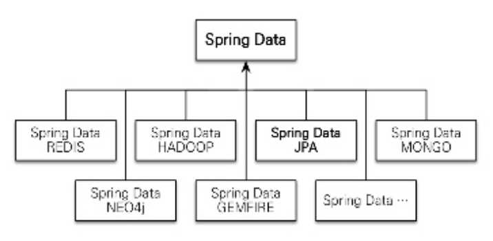
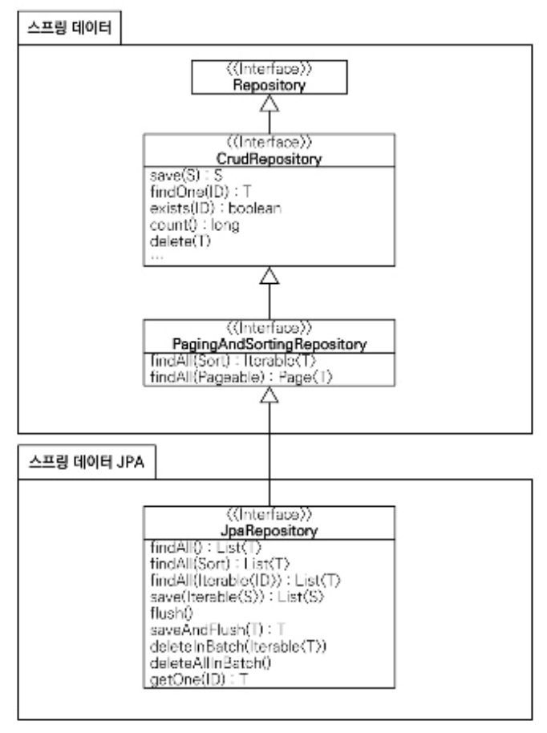

## 스프링 데이터 JPA 소개
스프링 데이터 JPA는 스프링 프레임워크에서 JPA를 편리하게 사용할 수 있도록 지원하는 프로젝트다. 데이터 접근 계층을 개발할 때 지루하게 반복되는 CRUD 문제를 해결해준다.<br>
1. CRUD를 처리하기 위한 공통 인터페이스 제공
2. repository 개발 시 인터페이스만 작성
3. 실행 시점에 스프링 데이터 JPA가 구현 객체를 동적으로 생성하여 주입.

> 데이터 접근 계층 개발 시 구현 클래스 없이 인터페이스만 작성해도 개발을 완료할 수 있다.

CRUD를 처리하기 위한 공통 메소드(ex. save, findOne, findAll 등)는 스프링 데이터 JPA가 제공하는 org.springframework.data.jpa.repository.JpaRepository 인터페이스에 있다.<br>
인터페이스 구현체는 애플리케이션 실행 시점에 스프링 데이터 JPA가 생성해 주입하기 때문에 개발자가 직접 구현체를 개발하지 않아도 된다.

```java
public interface MemberRepository extends JpaRepository<Member, Long>{
    Member fineByUsername(String username);
}
```


직접 작성한 메소드는 스프링 데이터 JPA가 메소드이름을 분석하여 `JPQL`을 실행한다.

### 스프링 데이터 프로젝트

스프링 데이터는 위와 같은 다양한 데이터 저장소에 대한 접근을 추상화해서 개발자 편의를 제공하고 반복적인 접근 코드를 줄여준다.

## 스프링 데이터 JPA 설정
설정 파일에 @EnableJpaRepositories 어노테이션을 추가하고 basePackages에 repository를 검색할 패키지 위치를 적는다.
```java
@Configuration
@EnableJpaRepositories(basePackages = "jpabook.jpashop.repository")
public class Config () {...}
```

스프링 데이터 JPA는 애플리케이션을 실행할 때 basePackage에 있는 repository interface들을 찾아서 해당 인터페이스를 구현한ㄴ 클래스를 동적으로 생성한 후, 스프링 빈으로 등록한다. 따라서 개발자가 직접 구현 클래스를 만들지 않아도 된다.

## 공통 인터페이스 기능
스프링 데이터 JPA를 사용하는 가장 단순한 방법은 JpaRepository 인터페이스를 상속받고 제네릭에 엔티티 클래스와 엔티티 클래스가 사용하는 식별자 타입을 지정한다.
* JpaRepository 공통 기능 인터페이스

```java
public interface JpaRepository<T, ID extends Serializable> extends PagingAndSortingRepository<T, ID> {
    ...
}
```

* JpaRepository를 사용하는 인터페이스

```java
public interface MemberRepository extends JpaRepository<Member, Long> {
    ...
}
```

### JpaRepository 인터페이스 계층 구조

Repository, CrudRepository, PagingAndSortingRepository는 스프링 데이터 프로젝트가 공통으로 사용하는 인터페이스이다.<br>
JpaRepository는 여기에 추가로 JPA에 특화된 기능을 제공한다.

* JpaRepository 인터페이스 주요 메소드
    * save(S) : 새로운 엔티티는 저장하고 이미 있는 엔티티는 수정
    * delete(D) : 엔티티 하나를 삭제. 내부에서 EntityManager.remove()를 호출
    * findOne(ID) : 엔티티 하나를 조회. 내부에서 EntityManager.find()를 호출
    * getOne(ID) : 엔티티를 프록시로 조회. 내부에서 EntityManager.gerReference()를 호출
    * findAll(...) : 모든 엔티티를 조회. 정렬(Sort)이나 페이징(Pageable) 조건을 파라미터로 제공
    
> JPA 2.0 부터 findOne return 타입이 Optional로 변 -> findById로 변
    
> findOne vs findById vs getOne
> 참조
> [https://granger.tistory.com/50](https://granger.tistory.com/50)
> [https://developpaper.com/getone-findone-and-findbyid-in-spring-data-jpa](https://developpaper.com/getone-findone-and-findbyid-in-spring-data-jpa)

save(S) 메소드는 엔티티에 식별자 값이 없으면(null이면) 새로운 엔티티로 판단하여 EntityManager.persist() 를 호출하고 식별자 값이 있으면 이미 있는 엔티티로 판단해서 EntityManager.merge()를 호출한다.

### 쿼리 메소드 기능
메소드 이름만으로 JPQL 쿼리를 생성할 수 있다.

* 스프링 데이터 JPA가 제공하는 쿼리 메소드 기능
    * 메소드 이름으로 쿼리 생성
    * 메소드 이름으로 JPA NamedQuery 호출
    * @Query 어노테이션을 사용해서 repository interface 에 쿼리 직접 정의
    
### 메소드 이름으로 쿼리 생성
```java
public interface MemberRepository extedns Resptory<Member, Long> {
    List<Member> findByEmailAndName(String email, String name);
}
```
```sql
select m from Member m where m.email = ?1 and m.name = ?2
```

> 참조 : [https://docs.spring.io/spring-data/jpa/docs/2.3.0.RELEASE/reference/html/#reference](https://docs.spring.io/spring-data/jpa/docs/2.3.0.RELEASE/reference/html/#reference)

### JPA NamedQuery
스프링 데이터 JPA는 메소드 이름으로 JPA Named 쿼리를 호출한다.

```java
@Entity
@NamedQuery(
    name="Member.findByUsername",
    query="select m from Member m where m.username = :username"
)
public class Member {...}
```
* JPA에서 직접 호출하는 방법

```java
public class MemberRepository {
    public List<Member> findByUsername(String username) {
        ...
        List<Member> resultList = em.createNamedQuery("Member.findByUsername", Member.class)
                                    .setParameter("username", "회원1")
                                    .getResultList();
    }
}
```

* 스프링 데이터 JPA로 호출

```java
public interface MemberRepository extends JpaRepository<Member, Long> {//여기 선언한 Member 도메인 클래스
    List<Member> findByUsername(@Param("username") String username);
}
```
스프링 데이터 JPA는 `도메인클래스명.메소드이름`으로 NamedQuery를 찾아 실행한다.(ex. Member.findByUsername)

### @Query, repository 메소드에 쿼리 정의
org.springframework.data.jpa.repository.Query 어노테이션을 활용하여 repository에 직접 쿼리를 정의할 수 있다.<br>
실행할 메소드에 정적 쿼리를 직접 작성하므로 이름 없는 Named 쿼리라 할 수 있다. 또한 JPA Named 쿼리처럼 런타임 에러 체크가 가능하다.

```java
public interface MemberRepository extends JpaRepository<Member, Long> {
    @Query("select m from Member m where m.username = ?1")
    Member findByUsername(String username);
}
```

@Query 어노테이션 옵션으로 `nativeQuery = true`를 설정하면 네이티브 SQL 사용가능하다.

### 파라미터 바인딩
스프링 데이터 JPA는 위치 기반 파라미터 바인딩과 이름 기반 파라미터 바인딩을 모두 지원한다.<br>
기본 값은 위치 기반으로, 파라미터 순서로 바인딩 한다. 이름 기반 파라미터 바인딩은 org.springframework.data.repository.query.Param(파라미터 이름) 어노테이션을 사용한다.

> 코드 가독성과 유지보수를 위해 이름 기반 파라미터 바인딩을 사용하자.

```java
import org.springframework.data.repository.query.Param

public interface MemberRepository extends JpaRepository<Member, Long> {
    @Query("select m from Member m where m.username = :name")
    Member findbyUsername(@Param("name") String username);
}
```

### 벌크성 수정 쿼리
* JPA를 사용한 벌크성 수정 쿼리

```java
int bulkPriceUp(String stockAmout) {
    ...
    String qlString = "update Product p set p.price = p.price * 1.1 where p.stockAmout < :stockAmout";

    int resultCount = em.createQuery(qlString)
                        .setParameter("stockAmount", stockAmount)
                        .executeUpdate();
}
```

* 스프링 데이터 JPA를 사용한 벌크성 수정 쿼리

```java
@Modifying
@Query("update Product p set p.price = p.price * 1.1 where p.stockAmount < :stockAmount")
int bulkPriceUp(@Param("stockAmount") String stockAmount);
```
@Modifying 어노테이션을 활용하여 벌크성 수정, 삭제 쿼리를 한다.<br>
벌크성 쿼리를 실행하고 나서 영속성 컨텍스트를 초기화하려면 `@Modifying(clearAutomatically = true)` 처럼 clearAutomatically 옵션을 설정한다.(기본 값은 false)

### 반환 타입
한 건 이상이면 컬렉션 인터페이스를 사용하고 단 건이면 반환 타입을 지정한다.

```java
List<Member> findByName(String name);   //  컬렉션
Member findByEmail(String email);   //  단건
``` 
조회 결과가 없으면 컬렉션은 빈 컬렉션, 단건은 null을 반환한다. 그리고 단건을 기대하고 반환 타입을 지정했는데 2건 이상 조회되면 `javax.persistence.NonUniqueResultException` 예외가 발생한다.<br>
단건으로 지정한 메소드를 호출하면 스프링 데이터 JPA는 내부에서 JPQL의 Query.getSingleResult() 메소드를 호출한다. 이 때 조회결과가 없으면 `javax.persistence.NoResultException`예외가 발생하는데 이는 개발자 입장에서 굉장히 불편하다.<br>
스프링 데이터 JPA는 단건을 조회할 때 이 예외가 발생하면 예외를 무시하고 대신에 null을 반환한다.

### 페이징과 정렬
쿼리 메소드에 페이징과 정렬 기능을 사용할 수 있도록 2가지 파라미터를 제공한다.

* org.springframework.data.domain.Sort : 정렬 기능
* org.springframework.data.domain.Pageable : 페이징 기능(내부에 Sort 포함)

* 페이징과 정렬 사용

```java
// count 쿼리 사용
Page<Member> findByUsername(String name, Pageable pageable);

// count 쿼리 사용 안함
List<Member> findByName(String name, Pageable pageable);

List<Member> findByName(String name, Sort sort);
```
파라미터에 Pageable을 사용하면 반환타입으로 List나 org.springframework.data.domain.Page를 사용할 수 있다.<br>
반환 타입으로 Page를 사용하면 스프링 데이터 JPA는 페이징 기능을 제공하기 위해 검색된 전체 데이터 건수를 조회하는 count 쿼리를 추가로 호출한다.

* Page 사용 예제 코드

```java
public interface MemberRepository extends Repository<Member, Long> {
    Page<Member> findByNameStartingWith(String name, Pageable pageable);
}
```
위에 pageable은 인터페이스이다. 아래와 같이 실제 사용할 때는 PageRequest 객체를 사용하여 pageable 인터페이스를 구현한다. 

* Page 사용 예제 실행 코드

```java
// 페이징 조건과 정렬 조건 설정
PageRequest pageRequest = new PageRequest(0, 10, new Sort(Direction.DESC, "name")); //  현재 페이지, 조회할 데이터 수, 추가 정렬 정

Page<Member> result = memberResptory.findByNameStartingWith("김", pageRequest);

List<Member> members = result.getContent(); //  조회된 데이터
int totalPages = result.getTotalPages();    //  전체 페이지 수
boolean hasNextPage = result.hasNextPage(); //  다음 페이지 존재 여부
```

* Page 인터페이스가 제공하는 메소드

```java
public interface Page<T> extends Iterable<T> {
    int getNumber();                //  현재 페이지
    int getSize();                  //  페이지 크기
    int getTotalPages();            //  전체 페이지 수
    int getNumberOfElements();      //  현재 페이지에 나올 데이터 수
    long getTotalElements();        //  전체 데이터 수
    boolean hasPreviousPage();      //  이전 페이지 여부
    boolean isFirstPage();          //  현재 페이지가 첫 페이지 인지 여부
    boolean hasNextPage();          //  다음 페이지 여부
    boolean isLastPage();           //  현재 페이지가 마지막 페이지 인지 여부
    Pageable nextPageable();        //  다음 페이지 객체, 다음 페이지가 없으면 null
    Pageable previousPageable();    //  다음 페이지 객체, 이전 페이지가 없으면 null
    List<T> getContent();           //  조회된 페이지
    boolean hasContent();           //  조회된 데이터 존재 여부
    Sort getSort();                 //  정렬 정보
}
```

### 힌트
org.springframework.data.jpa.repository.QueryHints 어노테이션을 활용하여 JPA 쿼리 힌트를 사용할 수 있다.
```java
@QueryHints(value = {
    @QueryHint(name = "org.hibernate.readOnly", value = "true'), forCounting = true)
})
Page<Member> findByName(String name, Pageable pageable);
```

### Lock
쿼리 시 락을 걸려면 org.springframework.data.jpa.repository.Lock 어노테이션을 사용한다.

```java
@Lock(LockModeType.PESSIMISTIC_WRITE)
List<Member> findByName(String name);
```

## 명세
도메인 주도 설계에서 사용되는 개념인 명세는 스프링 데이터 JPA의 JPA Criteria로 이 개념을 사용할 수 있다.

## 사용자 정의 repository 구현
보통 스프링 데이터 JPA로 repository를 개발하게 되면 인터페이스만 정의하고 구현체는 만들지 않는다. 하지만 메소드를 직접 구현해야 하는 경우가 있을 수 있다. 그렇다고 repository를 직접 구현하면 공통 인터페이스가 제공하는 기능 까지 모두 구현해야 하는 번거로움이 있는데, 스프링 데이터 JPA는 이런 문제를 우회하여 필요한 메소드만 구현할 수 있는 방법을 제공한다.

* 사용자 정의 인터페이스

```java
public interface MemberRepositoryCustom {
    publid List<Member> findMemberCustom();
}
```

* 사용자 정의 구현 클래스

```java
public class MemberRepositoryImpl implements MemberRepositoryCustom {
    @Override
    public List<Member> findMemberCustom() {
        ... //  사용자 정의 구현
    }
}
```

> 사용자 정의 인터페이스를 구현한 클래스를 작성할 때는 `repository 인터페이스 명 + Impl`로 지어야 한다. 그래야 스프링 데이터 JPA가 사용자 정의 구현 클래스로 인식힌다.

* 사용자 정의 인터페이스 상속

```java
public interface MemberRepository extends JpaReposotiry<Member, Long>, MemberRepositoryCustom {}
```

## Web 확장
스프링 MVC에서 사용할 수 있는 편리한 기능도 제공한다. 식별자로 도메인 클래스를 바로 바인딩해주는 `도메인 클래스 컨버터 기능`과 `페이징과 정렬`기능도 제공한다.

### 설정
org.springframework.data.web.config.EnableSpringDataWebSupport 어노테이션을 사용한다.

```java
@Configuration
@EnableWebMvc
@EnableSpringDataWebSupport
public class WebAppConfig {...}
```
설정을 완료하면 도메인 클래스 컨버터와 페이징과 정렬을 위한 `HandlerMethodArgumentResolver`가 스프링 빈으로 등록된다.

### 도메인 클래스 컨버터 기능
도메인 클래스 컨버터는 HTTP 파라미터로 넘어온 엔티티의 id로 엔티티 객체를 찾아 바인딩해준다.

* 회원 id로 회원 엔티티 조회

```java
@RestController
public clas MemberController {
    @Autowired
    MemberRepository memberRepository;
    
    @GetMapping("/member/memberUpdateForm");
    public String memberUpdateForm(@RequestParam("id") Long id, Model model) {
        Member member = memberRepository.findOne(id);   //  회원을 갖는다.
        model.addAttribute("member", member);
        return "member/memberSavrForm";
    }
}
```
```java
@RestController
public class MemberController {
    @GetMapping("member/memberUpdateForm")
    public String memberUpdateForm(@RequestParam("id") Member member, Model model) {
        model.addAttribute("member", member);
        return "member/memberSaveForm";
    }
}
```
HTTP 요청으로 회원 id를 받지만 도메인 클래스 컨버터가 중간에 동작해서 id를 회원 엔티티 객체로 변환해 넘겨준다. 따라서 컨트롤러를 단순하게 사용할 수 있다.<br>
도메인 클래스 컨버터를 통해 넘어온 회원 엔티티를 컨트롤러에서 직접 수정해도 데이터베이스에 반영되진 않는다. 이는 영속성 컨텍스트 동작방식과 OSIV와 관련있다.

* OSIV를 사용하지 않으면
    * 조회한 엔티티는 준영속 상태다. 따라서 변경 감지 기능이 동작하지 않게 되고 데이터베이스에 반영하려면 merge를 사용해야 한다.
* OSIV를 사용하면
    * 조회한 엔티티는 영속 상태다. 하지만 OSIV 특성 상 컨트롤러와 뷰에서는 영속성 컨텍스트를 flush하지 않는다. 따라서 데이터베이스에 수정 내역이 반영되지 않는다. 수정하려면 트랜잭션을 시작하는 서비스 계층을 호출해야 한다. 해당 서비스 계층이 종료될 때 flush와 트랜잭션 커밋이 일어나 영속성 컨텍스트의 변경 내용을 데이터베이스에 반영해 준다.     

### 페이징과 정렬 기능
스프링 데이터 JPA가 제공하는 페이징과 정렬 기능을 스프링 MVC에서 편리하게 사용할 수 있도록 HandlerMethodArgumentResolver를 제공한다.

* 페이징 기능 : PageableHandlerMethodArgumentResolver
* 정렬 기능 : SortHandlerMethodArgumentResolver

```java
@GetMapping(value = "/members")
public String list(Pageable pageable, Model model) {
    Page<Member> page = memberService.findMembers(pageable);
    model.addAttribute("members", page.getContent());
    return "members/memberList";
}
```

파라미터로 Pageable을 받는다. Pageable 요청 파라미터 정보는 다음과 같다.

* page : 현재 페이지, 0부터 시작
* size : 한 페이지에 노출할 데이터 건 수
* sort : 정렬 조건을 정의.

> 페이지를 1부터 시작하려면 PageableHandlerMethodArgumentResolver를 스프링 빈으로 직접 등록하고 setOneIndexedParameter를 false로 설정한다.

#### 접두사
사용해야 할 페이징 정보가 둘 이상이면 접두사를 사용하여 구분할 수 있다. 접두사는 @Qualifier 어노테이션을 사용하고 "{접두사명}_"로 구분한다.

```java
public String list(
    @Qualifier("member") Pageable memberPageable,
    @Qualifier("order") Pageable orderPageable, ...
)

ex) /members?member_page=0&order_page=1
```

#### 기본 값
Pageable의 기본 값은 page=0, size=20이다. 기본 값을 변경하려면 @PageableDefault 어노테이션을 사용한다.
```java
@GetMapping(value = "/members_page")
public String list(@PageableDefault(size = 12, sort = "name", direction = Sort.Direction.DESC) Pageable pageable) {...}
```

## 스프링 데이터 JPA가 사용하는 구현체
스프링 데이터 JPA가 제공하는 공통 인터페이스는 org.springframework.data.jpa.repository.support.SimpleJpaRepository 클래스가 구현하나.

```java
@Repository
@Transactional(readOnly = true)
public class SimpleJpaRepository<T, ID extends Serializable> implements JpaRepository<T, ID>, JpaSpecificationExecutor<T> {
    @Transactional
    public <S extends T> S save(S entity) {
        if (entityInformation.isNew(entity) {
            em.persist(entity);
            return entity;
        } else {
            return em.merge(entity);
        }
    }
}
```

* @Repository 적용: JPA 예외를 스프링이 추상화한 예외로 변환한다.
* @Transactional 트랜잭션 적용 : JPA의 모든 변경은 트랜잭션 안에서 이뤄져야 한다. 스프링 데이터 JPA가 제공하는 공통 인터페이스를 사용하면 데이터를 변경(CRUD)하는 메소드에 @Transactional로 트랜잭션 처리가 되어 있다. 따라서 서비스 계층에서 트랜잭션을 시작하지 않으면 repository에서 트랜잭션을 시작한다. 물론, 서비스 계층에서 시작됐으면 그대로 repository까지 이어진다.
* @Transactional(readOnly = true) : 데이터를 조회하는 메소드에는 readOnly = true옵션이 적용되어 있다. 데이터를 변경하지 않는 트랜잭션에서 readOnly = true 옵션을 사용하면 flush를 생략해서 약간의 성능 향상을 얻을 수 있다.
* save() 메소드 : 저장할 엔티티가 새로운 엔티티면 저장(persist)하고 이미 있는 엔티티면 병합(merge)한다.

## 스프링 데이터 JPA와 QueryDSL 통합
스프링 데이터 JPA는 아래 두 가지 방법으로 QueryDSL을 지원한다.
* org.springframework.data.querydsl.QueryDslPredicateExecutor
* org.springframework.data.querydsl.QueryDslRepositorySupport

### QueryDslPredicateExecutor 사용
repository에 QueryDslPredicateExecutor를 상속받아 사용한다.

```java
public interface ItemRepository extends JpaRepository<Item, Long>, QueryDslPredicateExecutor<Item> {...}
```

QueryDslPredicateExecutor 인터페이스를 보면 QueryDSL을 검색조건으로 사용하면서 스프링 데이터 JPA가 제공하는 페이징과 정렬 기능도 함께 사용할 수 있다.<br>
하지만, `join, fetch를 사용할 수 없다.` 따라서 QueryDSL이 제공하는 다양한 기능을 사용하려면 JPAQuery를 직접 사용하거나 스프링 데이터 JPA가 제공하는 QueryDslRepositorySupport를 사용해야 한다.

### QueryDslRepositorySupport 사용
QueryDSL의 모든 기능을 사용하려면 JPAQuery 객체를 직접 생성해서 사용한다. 이때 스프링 데이터 JPA가 제공하는 QueryDslRepositorySupport를 상속받아 사용하면 조금 더 편리하게 QueryDSL을 사용할 수 있다.

## 정리
스프링 데이터 JPA를 사용함으로써 데이터 접근 계층의 코드를 상당히 줄일 수 있다. 
