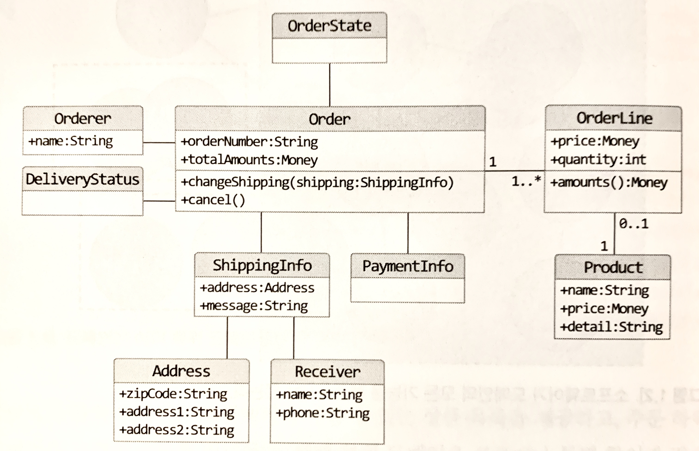

# 도메인
개발자 입장에서 온라인 서점은 구현해야 할 소프트웨어의 대상이 된다. 온라인 서점 소프트웨어는 온라인으로 책을 판매하는 데 필요한 상품조회, 구매, 결제, 배송 추적 등의 기능을 제공해야 한다. 이떄, '온라인 서점'은 소프트웨어로 해결하고자 하는 문제 영역, 즉 도메인(domain)에 해당한다.

한 도메인은 다시 하위 도메인(주문, 회원, 결제, 배송, 정산, 카탈로그 등)으로 나눌 수 있다. 카탈로그 하위 도메인은 고객에게 구매할 수 있는 상품 목록을 제공하고, 주문 하위 도메인은 고객의 주문을 처리한다.<br>
이렇게 하위 도메인은 다른 하위 도메인과 연동하여 완전한 기능을 제공한다. 고객이 물건을 구매한다면 주문, 결제, 배송, 쿠폰 하위 도메인의 기능이 엮이게 된다.

하지만 배송 도메인같은 경우, 일부 기능은 자체 시스템으로 구현하고 일부 기능은 외부 업체의 시스템을 사용한다. 
# 도메인 모델
기본적으로 도메인 모델은 특정 도메인을 개념적으로 표현한 것이다. 아래와 같은 도메인 모델을 사용하면 여러 관계자들이 동일한 모습으로 도메인을 이해하고 도메인 지식을 공유하는데 도움이 된다.

위 사진은 객체를 이용한 도메인이다. 도메인을 이용하려면 도메인이 제공하는 기능과 도메인의 주요 데이터 구성을 파악해야 하는데, 이런 면에서 기능과 데이터를 함께 보여주는 객체 모델은 도메인을 모델링하기에 적합하다.

도메인 모델은 객체 기반 뿐 아니라ㅏ 상태 다이어그램으로 모델링도 가능하다. 뿐만 아니라 관계가 중요한 도메인이라면 그래프를 이용하기도 한다.

도메인 모델은 기본적으로 도메인 자체를 이해하기 위한 개념 모델이다. 개념 모델을 이용해서 바로 코드를 작성할 수 있는 것은 아니기에 구현 기술에 맞는 구현 모델이 따로 필요하다. 개념 모델과 구현 모델은 서로 다르지만 구현 모델이 개념 모델을 최대한 따르도록 할 수는 있다.

도메인에 따라 용어의 의미가 결정되므로, 여러 하위 도메인을 하나의 다이어그램에 모델링하면 안된다.(ex. 카테고리 도메인의 상품과 배송 도메인의 상품은 다른 성격이지만 같이 두면 혼란을 준다.) 모델의 각 구성요소는 특정 도메인을 한정할 때 비로소 의미가 완전해지기 때문에, `각 하위 도메인마다 별도로 모델을 만들어야 한다.`
# 도메인 모델 패턴
일반적인 애플리케이션의 아키텍처는 네 개의 계층으로 구성된다.

<table>
  <thead>
    <tr>
      <th>계층(Layer)</th>
      <th>설명</th>
    </tr>
  </thead>
  <tbody>
    <tr>
      <td>사용자인터페이스(UI) 또는 표현(Presentation)</td>
      <td>사용자의 요청을 처리하고 사용자에게 정보를 보여준다. 여기서 사용자는 소프트웨어를 사용하는 사람뿐만 아니라 외부 시스템도 사용자가 될 수 있다.</td>
    </tr>
    <tr>
      <td>응용(Application)</td>
      <td>사용자가 요청한 기능을 실행한다. 업무 로직을 직접 구현하지 않으며 도메인 계층을 조합해서 기능을 실행한다.</td>
    </tr>
    <tr>
      <td>도메인(domain)</td>
      <td>시스템이 제공할 도메인의 규칙을 구현한다.</td>
    </tr>
    <tr>
      <td>인프라스트럭쳐(infrastructure)</td>
      <td>데이터베이스나 메시징 시스템과 같은 외부 시스템과의 연동을 처리한다.</td>
    </tr>
  </tbody>
</table>

도메인 계층은 도메인의 핵심 규칙을 구현한다. 주문 도메인을 예로 들면, '출고 전에 배송지를 변경할 수 없다.', '주문 취소는 배송 전에만 할 수 있다.'는 규칙을 구현한 코드가 도메인 계층에 위치하게 된다. 이런 도메인 규칙을 객체 지향 기법으로 구현하는 도메인 모델 패턴이다.<br>
배송지 변경 가능 여부를 판단하는 기능이 Order나 OrderStatus에 있든 중요한 것은 주문과 관련된 중요 업무 규칙을 주문 도메인 모델인 Order나 OrderStatus에서 구현한다는 점이다. 핵심 규칙을 구현한 코드는 도메인 모델에만 위치하기 때문에 규칙이 바뀌거나 규칙을 확장해야 할 때 다른 코드에 영향을 덜 주고 변경 내역을 모델에 반영할 수 있게 된다.

> ### 개념 모델과 구현 모델
> **개념 모델**은 순수하게 문제를 분석한 결과물이다. 개념 모델은 데이터베이스, 트랜잭션 처리, 성능, 구현 기술과 같은 것들은 고려하지 않고 있기 때문에 실제 코드를 구현할 때 개념 모델 그대로 사용할 수는 없다. 그래서 개념 모델을 구현 가능한 모델 형태로 전환하는 과정을 거친다.
> 처음부터 완벽한 개념 모델을 만들면 좋지만 현실적으로 불가능하다. 따라서 프로젝트 초기에는 개요 수준의 개념 모델로 도메인에 대한 전체 윤곽을 이해하는데 초점을 맞추고, 구현 과정에서 개념 모델을 구현 모델로 점진적으로 개선해 나가야 한다.
 
# 도메인 모델 도출
도메인을 모델링하는데 있어서 기본이 되는 작업은 모델을 구성하는 핵심 요소, 규칙, 기능을 파악하는 것이다. 이는 요구사항에서 시작된다. 이렇게 만든 모델은 요구사항 정련을 위해 다른 개발자들과 논의하는 과정에서 공유하기도 한다. 모델을 공유할 때는 화이트보드나 위키와 같은 도구를 사용해서 누구나 쉽게 접근할 수 있도록 하면 좋다.

> ### 문서화
> 전반적인 기능 목록이나 모듈 구조, 빌드 과정은 코드를 보고 직접 이해하는 것보다 상위 수준에서 정리한 문서를 참조하는 것이 소프트웨어 전반을 빠르게 이해하는데 도움이 된다. 전체 구조를 이해하고 더 깊게 이해할 필요가 있는 부분을 코드로 분석해 나가면 된다.<br>
> 코드를 보면서 도메인을 깊게 이해하게 되므로 코드 자체도 문서화의 대상이 된다. 따라서 도메인 지식이 잘 묻어나도록 코드를 작성하지 않으면 코드의 동작 과정은 해석할 수는 있어도 도메인 관점에서 왜 코드를 그렇게 작성했는지 이해하는 데는 도움이 되지 않는다. 단순히 코드를 가독성 좋게 작성하는 것 뿐만 아니라 도메인 관점에서 코드가 도메인을 잘 표현해야 비로소 코드의 가독성이 높아지며 문서로서 코드가 의미를 갖는다.

# 엔티티와 밸류
도출한 모델은 엔티티(Entity)와 밸류(Value)로 구분할 수 있다.<br>
엔티티와 밸류를 제대로 구분해야 도메인을 올바르게 설계하고 구현할 수 있다.
## 엔티티
`엔티티의 가장 큰 특징은 식별자를 갖는다는 것`이다. 엔티티의 식별자는 바뀌지 않고 고유하기 때문에 두 엔티티의 객체의 식별자가 같으면 두 엔티티는 같다고 판단할 수 있다. 엔티티를 구현할 클래스는 식별자(ex. 주문 엔티티의 주문 번호)를 이용해서 equals() 메서드와 hashCode() 메서드를 구현할 수 있다.
## 엔티티의 식별자 생성
엔티티의 식별자를 생성하는 시점은 도메인의 특징과 사용하는 기술에 따라 달라진다. 흔히 식별자는 다음 중 한 가지 방식으로 생성한다.
* 특정 규칙에 따라 생성
* UUID 사용

```java
UUID uuid = UUID.randomUUID();

String stuUuid = uuid.toString();
```

* 값을 직접 입력
* 일련번호 사용(시퀀스나 DB의 자동 증가 컬럼 사용)

## 밸류 타입
밸류 타입은 **ShippingInfo 클래스**를 예로 들 수 있다. 밸류 타입은 개념적으로 완전한 하나를 표현할 때 사용한다.<br>
밸류 객체의 데이터를 변경할 때는 `기존 데이터를 변경하기보다는 변경한 데이터를 갖는 새로운 밸류 객체를 생성하는 방식을 선호`한다.

* ex.

```java
public class Money {
    private int value;
    
    public Money add(Money money) {
        return new Money(this.value + money.value);
    }

    // add로 생성만 가능하지 변경할 수 있는 메서드가 없다면
}
```

위 Money 클래스 처럼 데이터 변경 기능을 제공하지 않는 타입을 불변(immutable)이라고 표현한다. 밸류 타입을 불변으로 구현하는 가장 큰 이유는 `불변 타입을 사용하면 보다 안전한 코드를 작성할 수 있다`는 것이다.<br>
만약, Money가 setValue()와 같은 메서드를 제공해서 값을 변경할 수 있다면 문제가 발생할 여지가 있다. 따라서 이러한 경우 새로운 Money 객체를 생성하도록 코드를 작성해야 한다.

* ex.

```java
public class OrderLine {
    //...
    private Money price;
    private int quantity;
    private int amounts;
    
    public OrderLine(Product product, Money price, int quantity) {
        this.product = product;
        this.price = new Money(price.getValue());
        this.quantity = quantity;
        this.amounts = calculateAmounts();
    }
}
```

Money가 불변이면 이런 코드를 작성할 필요가 없다. Money의 데이터를 바꿀 수 없기 때문에 파라미터로 전달받은 price를 안전하게 사용할 수 있다.

> 또한 불변 객체는 참조 투명성과 스레드에 안전한 특징을 갖고 있다.

그리고, 엔티티 타입의 두 객체가 같은 지 비교할 때 주로 식별자를 사용한다면 두 밸류 객체가 같은 지 비교할 때는 `모든 속성이 같은지 비교해야 한다.`

## 엔티티 식별자와 밸류 타입
엔티티 식별자의 실제 데이터는 String과 같은 문자열로 구성된 경우가 많다. Money가 단순 숫자가 아닌 도메인의 '돈'을 의미하는 것처럼 이런 식별자는 단순한 문자열이 아니라 도메인에서 특별한 의미를 지니는 경우가 많기 때문에 식별자를 위한 밸류 타입을 사용해서 의미가 잘 드러나도록 할 수 있다.<br>
예를 들면, 주문번호를 표현하기 위해 Order 엔티티의 식별자 타입으로 String이 아닌 OrderNo 밸류 타입을 사용하면 타입을 통해 해당 필드가 주문번호라는 것을 알 수 있다.

* ex.

```java
public class Order {
    //  OrderNo 타입 자체로 id가 주문번호임을 알 수 있다.
    private OrderNo id;

    ...

    public OrderNo getId() {
        return id;
    }
}
``` 
## 도메인 모델에 set 메서드 넣지 않기
우리는 get/set 메서드를 습관적으로 추가하는데 이는 좋지 않다. 특히 set 메서드는 `도메인의 핵심 개념이나 의도를 코드에서 사라지게 한다.`

* ex.

```java
public class Order {
    //...
    public void setShippingInfo(ShippingInfo newShipping){/*...*/}
    public void setOrderState(OrderState state){/*...*/}
}
```

위 예시 코드에서 보는 것처럼 setShippingInfo() 메서드는 단순히 배송지 정보를 설정한다는 의미를 뜻하는데 배송지 정보를 새로 변경한다는 것인지 의미가 모호하다. setOrderState() 메서드 같은 경우도 단순히 상태 값만 변경할지 아니면 상태 값에 따라 다른 처리를 위한 코드를 함께 구현할지 애매하다.

set 메서드의 또 다른 문제는 `도메인 객체를 생성할 때 완전한 상태가 아닐 수도 있다는 것이다.`

* ex.

```java
// set 메서드로 데이터를 전달하도록 구현하면
// 처음 Order를 생성하는 시점에 order는 완전하지 않다.
Order order = new Order();

// set 메서드로 필요한 모든 값을 전달해야 함
order.setOrderLine(lines);
order.setShippingInfo(shippingInfo);

// 주문자(Orderer)를 설정하지 않은 상태에서 주문 완료 처리
order.setState(OrderState.PREPARING);
```

위 코드는 주문자를 설정하는 것을 누락하고 있다. orderer가 null임에도 order.setState() 메서드로 상품 준비 중 상태로 변경이 가능해진다.

이처럼 도메인 객체가 불완전 상태로 사용되는 상황을 막기 위해선 생성 시점에 필요한 것을 전달해 주어야 한다. 즉, `생성자를 통해 필요한 데이터를 모두 받아야 한다.`

* ex.

```java
Order order = new Order(orderer, lines, shippingInfo, OrderState.PREPARING);
```

위처럼 생성자 생성 시점에 필요한 것을 모두 설정해두면 아래와 같이 생성자 호출 시점에 필요한 데이터가 올바른지 바로 검사가 가능하다.

* ex.

```java
public class Order {
    public Order(Orderer orderer, List<OrderLine> orderLines, ShippingInfo shippingInfo, OrderState state) {
        setOrderer(orderer);
        setOrderLines(orderLines);
        // ... 다른 값 설정
    }

    private void setOrderer(Orderer orderer) {
        if (orderer == null)    throw new IllegalArgumentException("no orderer");
        this.orderer = orderer;
    }
    
    private void setOrderLines(List<OrderLine> orderLines) {
        verifyAtLeastOneOrMoreOrderLines(orderLines);
        this.orderLines = orderLines;
        calculateTotalAmounts();
    }

    private void setShippingInfo(ShippingInfo shippingInfo) {
        if (shippingInfo == null) {         //  배송지 정보 필수 규칙 구현
           throw new IllegalArgumentException("no ShippingInfo");
        }
        this.shippingInfo = shippingInfo;
    }

    private void verifyAtLeastOneOrMoreOrderLines(List<OrderLine> orderLines) {
        if (orderLines == null || orderLines.isEmpty()) {
            throw new IllegalArgumentException("no OrderLine");
        }
    }

    private void calculateTotalAmounts() {
        this.totalAmounts = new Money(orderLines.stream().mapToInt(x -> x.getAmounts().getValue()).sum());
    }
}
```

위 코드의 set 메서드는 앞서 set 메서드와 중요한 차이점이 있는데 그것은 바로 접근 범위가 private라는 점이다. 여기서 set 메서드는 `클래스 내부에서 데이터를 변경할 목적으로 사용`된다. private이기 때문에 외부에서 데이터를 변경할 목적으로 set 메서드를 사용할 수 없다.

불변 밸류 타입을 사용하면 자연스럽게 밸류 타입에는 set 메서드를 구현하지 않는다. set 메서드를 구현해야 할 특별한 이유가 없다면 불변 타입의 장점을 살릴 수 있도록 밸류 타입은 불변으로 구현한다.

> ### DTO의 get/set 메서드
> 기존 프레임워크에서 사용되는 DTO에서는 요청 파라미터나 DB 컬럼의 값을 설정할 때 set 메서드를 필요로 했기 때문에 어쩔 수 없이 get/set 메서드를 구현해야 했다. 하지만 최근 프레임워크에서는 set 메서드가 아닌 private 필드에 직접 값을 할당할 수 있는 기능을 제공하고 있다. 따라서 set 메서드를 제공하지 않아도 된다면 최대한 구현하지 않는 것이 좋다. 이렇게 하면 DTO도 불변 객체가 되어 불변의 장점을 DTO까지 확장할 수 있게 된다.
 
# 도메인 용어
코드 작성 시, 도메인에서 사용하는 용어는 매우 중요하다. 그렇지 않으면 개발자에게 코드의 의미를 해석해야하는 부담을 준다.

* 바람직하지 않은 코드 명

```java
public OrderState {
    STEP1, STEP2, STEP3, STEP4, STEP5, STEP6 
}
```

* 바람직한 코드 명

```java
public OrderState {
    PAYMENT_WAITING, PREPARING, SHIPPED, DELIVERING, DELIVERY_COMPLETED;
}
```

도메인에서 사용하는 용어의 의미를 명확하게 전달하는 영어 단어 찾기가 굉장히 어려운 경우가 있다. 알맞은 영어 단어를 찾기 어렵더라도 시간을 들여 찾는 노력을 해야 한다. 그렇지 않으면 코드는 도메인과 점점 멀어지게 된다. 그러니, 도메인 용어에 알맞은 단어를 찾는 시간을 아까워하지 말자.
