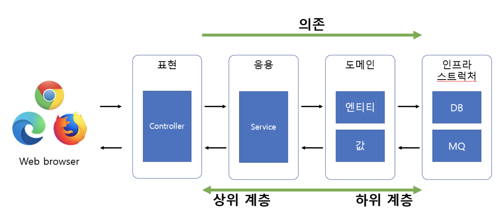
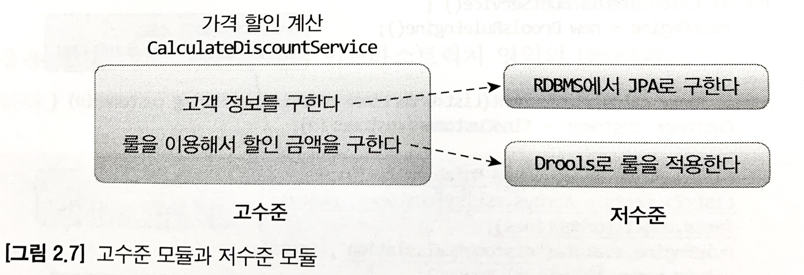
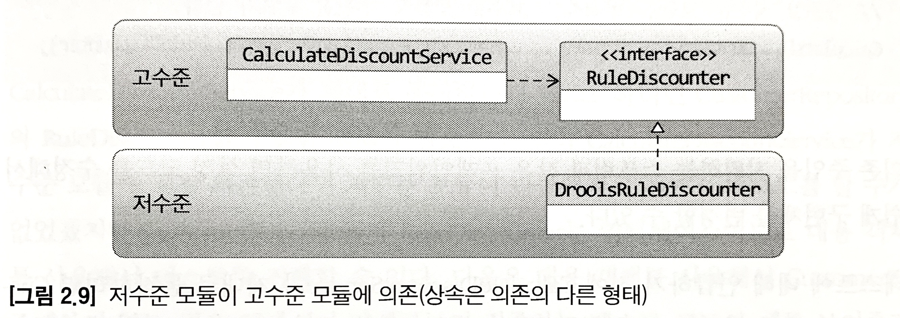
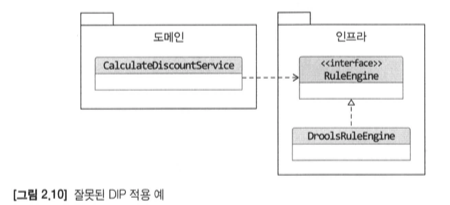
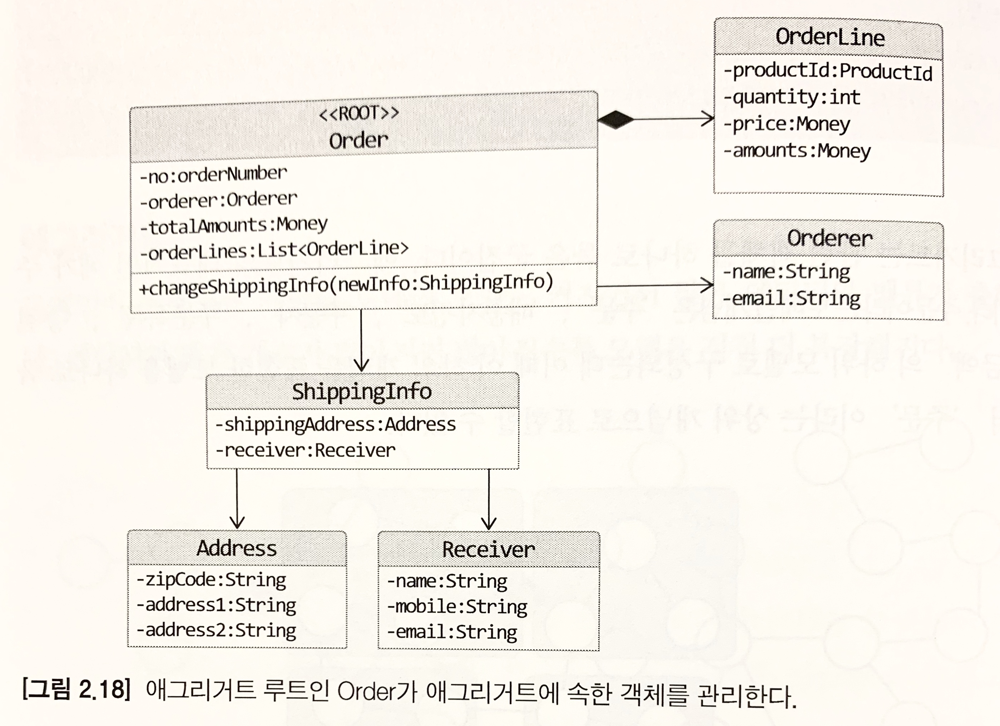
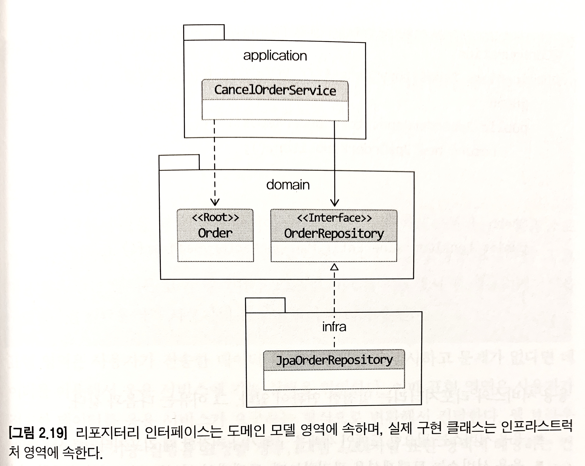
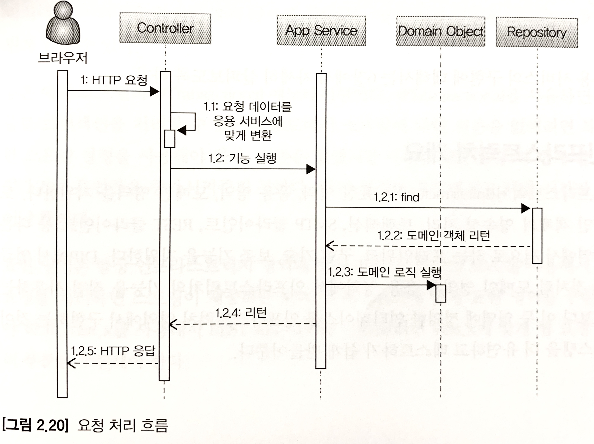

# 네 개의 영역
## Presentation 영역
* `사용자의 요청을 받아 Application 영역에 전달하고 Application 영역의 처리 결과를 다시 사용자에게 보여주는 역할`을 한다.<br>
* HTTP 요청을 Application 영역이 필요로 하는 형식으로 변환해서 Application 영역에 전달하고, Application 영역의 응답을 HTTP 응답으로 변환해서 전송한다.

## Application 영역
* Presentation 영역을 통해 사용자의 요청을 전달받아 시스템이 사용자에게 제공해야 할 기능(ex. 주문 등록/취소)을 구현한다.
* 기능을 구현하기 위해 도메인 영역의 도메인 모델을 사용한다.

주문 취소 기능을 제공하는 Application 서비스를 예로 들면 아래와 같이 주문 도메일 모델을 사용해서 기능을 구현한다.

```java
public class CancelOrderService {
    @Transactional
    public void cancelOrder(String orderId) {
        Order order = findOrderById(orderId);
        if (order == null) throw new OrderNotFoundException(orderId);
        order.cancel(); 
    }
}
```  

* Application 서비스 로직을 직접 수행하기 보다는 도메인 모델에 로직 수행을 위임한다. 위 코드도 주문 취소 로직을 직접 구현하지 않고 Order 객체에 취소 처리를 위임하고 있다.

> Application 영역은 도메인 모델을 이용해서 제공할 기능을 구현한다. 실제 도메인 로직 구현은 도메인 모델에 위임한다.

## InfraStructure 영역
* 구현 기술에 대한 것을 다룬다. RDBMS 연동, 메시징 큐에 메시지 전송/수신, MongoDB나 HBase를 사용한 DB 연동, HTTP 클라이언트를 이용해서 REST API를 호출하는 부분을 처리한다. 
* 논리적인 개념 표현보다 실제 구현을 다루는 영역이다.

Domain, Application, Presentation 영역은 구현 기술을 사용한 코드를 직접 구현하진 않는다. InfraStruture 영역에서 제공하는 기능을 사용해서 필요한 기능을 개발한다.
# 계층 구조 아키텍처
Presentation 영역과 Application 영역은 Domain 영역을 사용하고 Domain 영역은 InfraStructure 영역을 사용하므로 계층 구조를 적용하기에 적당하다. Domain의 복잡도에 따라 Application과 Domain을 분리하기도 하고 한 계층으로 합치기도 한다.

* 계층 구조는 특성상 상위에서 하위 계층으로만 의존하고 하위에서 상위 계층에 의존하지 않는다.
* 엄격하게 적용하면 상위 계층은 바로 아래의 계층에만 의존을 가져야 하지만 일반적으로 구현의 편리함을 위해 타협한다.(ex. Application -> InfraStructure 영역에 의존하기도 한다.)
* Presentation, Application, Domain 계층이 상세한 구현 기술을 다루는 InfraStructure 계층에 종속되게된다.
    * InfraStructure에 의존하게 되면 **테스트 어려움**과 **기능 확장의 어려움**이라는 두 가지 문제가 발생할 수 있다. -> `DIP`를 적용함으로써 해결할 수 있다.

* infrastructure에 의존하면서 발생되는 문제점 예시

```java
public class DroolsRuleEngine {
    private KieContainer kContainer;

    public DroolsRuleEngine() {
        KieServices ks = KieServices.Factory.get();
        KContainer = ks.getKieClasspathContainer();
    }

    public void evaluate(String sessionName, List<?> facts) {
        KieSession kSession = KContainer.newKieSession(sessionName);
        try {
            facts.forEach(x -> kSession.insert(x));
            kSession.fireAllRules();
        } finally {
            kSession.dispose();
        }
    }
}

public class CalculateDiscountService {
    private DroolsRuleEngine ruleEngine;

    public CalculateDiscountService(DroolsRuleEngine ruleEngine) {
        this.ruleEngine = new DroolsRuleEngine();
    }
    
    public Money calculateDiscount(List<OrderLine> orderLines, String customerId) {
        Customer customer = findCustomer(customerId);
        
        MutableMoney money = new MutableMoney(0);                       // Drools에
        List<?> facts = Arrays.asList(customer, money);                 // 특화된
        facts.addAll(orderLines);                                       // 코드가
        ruleEngine.evaluate("discountCalculation", facts); // 남게
        return money.toImmutableMoney();                                // 된다.
    }
}
```
"discountCalculation" 문자열은 Drools 세션 이름을 의미하는데 Drools 세션 이름 변경이 필요하게 되면 CalculateDiscountService의 코드 변경이 필요하게 된다. 

# DIP(Dependency Inversion Principle)
객체지향 5대 원칙 중 하나로, 요약 하자면 추상화에 의존해야 한다는 의미다.



> 고수준 - 의미 있는 기능을 제공하는 모듈
> 
> 저수준 - 고수준의 기능을 구현하는 하위 기능의 실제 구현

* 고수준 -> 저수준 모듈을 사용하는 것이 아닌 저수준 -> 고수준 모듈을 사용하도록 해야 한다.
* 저수준 -> 고수준 모듈에 의존하기 위해 추상화한 인터페이스를 활용한다.

* ex. 

```java
public interface RuleDiscounter {
    public Money applyRules(Customer customer, List<OrderLine> orderLines);
}

public class CalculateDiscountService {
    private RuleDiscounter ruleDiscounter;

    public CalculateDiscountService(RuleDiscounter ruleDiscounter) {
        this.ruleDiscounter = ruleDiscounter;
    }

    public Money calculateDiscount(List<OrderLine> orderLines, String customerId) {
        Customer customer = findCustomer(customerId);
        return ruleDiscounter.applyRules(customer, orderLines);
    }
}

public class DroolsRuleDiscounter implements RuleDiscounter {

    private KieContainer kContainer;

    public DroolsRuleDiscounter() {
        KieContainer ks = KieServices.Factory.get();
        kContainer = ks.getKieClasspathContainer();
    }

    @Override
    public Money applyRules(Customer customer, List<OrderLine> orderLines) {
        KieSession kSession = kContainer.newKieSession("discountSession");
        try {
            //...
            kSession.fireAllRules();
        } finally {
            kSession.dispose();
        }
        return money.toImmutableMoney();
    }
}
```



DIP를 적용한 예제 코드이다. 이제 더 이상 CalculateDiscountService는 구현 기술인 Drools에 의존하지 않는다. '룰을 이용한 할인 금액 계산'을 추상화한 RuleDiscounter 인터페이스에 의존한다.<br>
이렇게 DIP를 적용하게 되면 저수준 모듈인 DroolsRuleDiscounter는 고수준 모듈인 RuleDiscounter에 의존하게 된다. 고수준 모듈이 저수준 모듈을 사용하려면 고수준 모듈이 저수준 모듈에 의존해야 하는데, 반대로 저수준 모듈이 고수준 모듈에 의존하게 되고 이를 DIP라고 부른다.

DIP를 적용하면 앞서 다른 영역이 InfraStructure 영역에 의존할 때 발생했던 **구현 교체가 어렵다**는 점과 **테스트가 어렵다**라는 문제를 해소할 수 있다.

고수준 모듈은 구현을 추상화한 인터페이스에 의존한다. 저수준 구현 객체는 아래처럼 DI을 이용해 전달받을 수 있다.

```java
// 1.
RuleDiscounter ruleDiscounter = new DroolsRuleDiscounter(); //  사용할 저수준 객체 생성

CalculateDiscounterService disService = new CalculateDiscountService(ruleDiscounter);   //  생성자 방식으로 주입

// 2.
RuleDiscounter ruleDiscounter = new SimpleRuleDiscounter(); //  다른 방식의 저수준 객체 생성

CalculateDiscounterService disService = new CalculateDiscountService(ruleDiscounter);   //   저수준 구현 객체 변경하여 주입
```

만약 CalculateDiscounterService가 저수준 모듈에 직접 의존했다면 저수준 모듈이 만들어지기 전까지는 테스트를 할 수가 없었을텐데 CustomerRepository와 RuleDiscounter는 인터페이스와 같은 고수준 모듈을 의존함으로써 인터페이스는 대용 객체(Mock 객체)를 사용하여 테스트를 진행할 수 있다.
## DIP 주의사항
DIP를 잘못 생각하면 단순히 인터페이스와 구현 클래스를 분리하는 정도로 받아들일 수 있다. DIP의 핵심은 `고수준 모듈이 저수준 모듈에 의존하지 않도록 하기 위함`인데 DIP를 적용한 결과 구조만 보고 저수준 모듈에서 인터페이스를 추출하는 경우가 있다. 이는 잘못된 구조다.

* ex. 



위 사진을 보면 Domain 영역에서 구현 기술을 다루는 InfraStructure 영역에 의존하고 있다. RuleEngine 인터페이스는 사용할 룰 엔진을 지정해버리므로 Domain 관점이 아닌 InfraStructure 관점의 저수준 모듈이라고 봐야한다.<br>
즉, 여전히 고수준 모듈에서 저수준 모듈에 의존하고 있다.<br>

DIP를 적용할 때 하위 기능을 추상화한 인터페이스는 고수준 모듈 관점에서 도출해야 한다. CalculateDiscountService 입장에서 봤을 때 할인 금액을 구하기 위해 룰 엔진을 사용하는지, 직접 연산하는지 여부는 중요하지 않다. 단지 규칙에 따라 할인 금액을 계산한다는 것이 중요할 뿐이다.<br>
즉, '할인 금액 계산'을 추상화한 인터페이스는 저수준 모듈이 아닌 고수준 모듈에 위치해야 한다.

> 하위 기능(저수준 모듈)을 추상화한 인터페이스는 고수준 모듈에 위치해야 한다.

> ### DIP 위반을 고려해볼 수 있는 경우
> DIP는 코드에 내재된 문제를 해결해주는 좋은 전략이다. 그러나 DIP가 항상 정답인 것은 아니다. 한 예로 @Transactional 어노테이션을 들 수 있다.
> @Transactional 은 Spring에서 트랜잭션 처리를 도와주는 어노테이션으로, 단 한 줄 써놓기만 하면 복잡한 설정을 일정 영역 내에 전부 적용할 수 있다.
> 그러나, @Transaction의 사용은 Spring에 대한 의존도가 굉장히 높아질 수밖에 없다.
> 두 가지 선택지를 고려해보자.
> 1. DIP에 어긋나더라도 @Transactional 어노테이션을 사용한다.
> 2. DIP를 위해 트랜잭션 설정하는 과정을 직접 구현한다. 단, 구현 과정은 매우 복잡하다.    
> 
> 무엇이 나은지는 개발자가 선택할 일이다.(대부분의 경우 2번의 경우가 더 낫다..?)
>
> 참고 - [https://private-space.tistory.com/92](https://private-space.tistory.com/92)

### DIP와 계층 구조
* DIP를 적용하게 되면 하위 계층인 InfraStructure 영역이 Application 영역과 Domain 영역에 의존(상속)하는 구조가 된다.
* Application 영역과 Domain 영역에 영향을 최소화하면서 구현체를 변경하거나 추가할 수 있다.

> DDD의 기본 계층 구조가 상위에서 하위 영역에만 의존하는 구조인데 DIP를 적용하게 되면 반대로 하위에서 상위 영역에 의존하게 되는 경우가 발생한다. 기본적으로 상위에서 하위 영역에 의존해야 하지만 위에서 살펴본 것과 같은 특수한 경우에만 DIP를 적용하는 예외 케이스라고 생각하면 될까? 
 
# 도메인 영역의 주요 구성 요소

<table>
  <thead>
    <tr>
      <th>요소</th>
      <th>설명</th>
    </tr>
  </thead>
  <tbody>
    <tr>
      <td>엔티티(ENTITY)</td>
      <td>
      * 고유의 식별자를 갖는 객체로 자신의 LifeCycle을 갖는다.<br>
      * 주문, 상품, 회원과 같이 도메인의 고유한 개념을 표현한다.<br>
      * 도메인 모델의 데이터를 포함하여 해당 데이터와 관련된 기능을 함께 제공한다.
      </td>
    </tr>
    <tr>
      <td>밸류(VALUE)</td>
      <td>
      * 고유의 식별자를 갖지 않는 객체로 주로 개념적으로 하나인 도메인 객체의 속성을 표현할 때 사용된다.<br>
      * 배송지 주소 표현을 위한 주소(Address), 구매 금액을 위한 금액(Money)과 같은 타입을 지칭한다.<br>
      * 엔티티의 속성으로 사용될 뿐만 아니라 다른 밸류 타입의 속성으로도 사용될 수 있다.
      </td>
    </tr>
    <tr>
      <td>애그리거트(AGGREGATE)</td>
      <td>
      * 관련된 엔티티와 밸류 객체를 개념적으로 하나로 묶은 것을 말한다. 예를 들면 주문 엔티티 + 주문자(Orderer) 밸류 + 주문자 주소(Address) 밸류 객체를 '주문' 애그리거트로 묶을 수 있다.
      </td>
    </tr>
    <tr>
      <td>리포지터리(REPOSITORY)</td>
      <td>
      * 도메인 모델의 영속성을 처리한다. 예를 들면 DBMS 테이블에서 엔티티 객체를 로딩하거나 저장하는 기능을 제공한다.
      </td>
    </tr>
    <tr>
      <td>도메인 서비스(DOMAIN SERVICE)</td>
      <td>
      * 특정 엔티티에 속하지 않은 도메인 로직을 제공한다. 예를 들면 '할인 금액 계산'은 상품, 쿠폰, 회원 등급, 구매 금액 등 다양한 조건을 이용해서 구현하게 되는데, 이렇게 도메인 로직이 여러 엔티티와 밸류를 필요로 할 경우 도메인 서비스에 로직을 구현한다.
      </td>
    </tr>
  </tbody>
</table>

## 엔티티와 밸류
### DB 테이블의 엔티티와 도메인 모델의 엔티티의 차이점
* 도메인 모델의 엔티티는 데이터와 함께 도메인 기능을 함께 제공한다
    * 주문 엔티티는 주문과 관련된 데이터 뿐만 아니라 배송지 주소 변경을 위한 기능을 함께 제공한다.
* 도메인 모델의 엔티티는 두 개 이상의 데이터가 개념적으로 하나인 경우 밸류 타입을 이용해서 표현할 수 있다.
    * RDBMS와 같은 관계형 데이터베이스는 밸류 타입을 제대로 표현하기 어렵다.

> 도메인 모델 엔티티는 데이터는 물론이고 데이터를 다루는 기능을 제공하는 객체이다.

### 밸류
밸류는 불변으로 구현하는 것이 좋다. 이는 즉, 엔티티의 밸류 타입 데이터를 변경할 때 객체 자체를 완전히 교체한다는 것을 의미한다.

* 주문 엔티티 내 배송지 정보를 변경하는 예시

```java
public class Order {
    private ShippingInfo shippingInfo;
    //...
    // 도메인 모델 엔티티는 도메인 기능도 함께 제공
    public void changeShippingInfo(ShippingInfo newShippingInfo) {
        checkShippingInfoChangeable();
        setShippingInfo(newShippingInfo);
    }
    
    private void setShippingInfo(ShippingInfo newShippingInfo) {
        if (newShippingInfo == null)    throw new IllegalArgumentException();
        //  밸류 타입의 데이터를 변경할 때는 새로운 객체로 교체한다.
        this.shippingInfo = newShippingInfo; 
    }
}
``` 

## 애그리거트
도메인 모델의 규모가 커지게 되면 전체 구조 파악이 어려워지게 되는데 이 때 애그리거트를 활용하면 방대해진 전체 도메인 구조를 이해하는데 도움이 될 수 있다.

애그리거트는 관련 객체를 하나로 묶은 군집을 지칭한다. 예를 들면, 주문 도메인 개념 내에는 '주문', '배송지 정보', '주문자', '주문 목록' 등의 하위 모델로 구성되고 이 하위 개념들을 묶어 '주문'이라는 상위 개념으로 표현할 수 있다.

애그리러트는 군집에 속한 객체들을 관리하는 `루트 엔티티`를 갖는다. 루트 엔티티는 `애그리거트에 속해 있는 엔티티와 밸류 객체를 이용해서 애그리거트가 구현해야 할 기능을 제공`한다. 애그리거트 루트가 제공하는 기능을 실행하고 애그리거트 루트를 통해서 간접적으로 애그리거트 내의 다른 엔티티나 밸류 객체에 접근하게 된다. 이는 애그리거트의 내부 구현을 숨겨 `애그리거트 단위로 구현을 캡슐화`할 수 있게 돕는다.



## 리포지터리
도메인 객체를 지속적으로 사용하려면 물리적인 저장소에 도메인 객체를 보관해야 하는데 이를 위한 도메인 모델을 리포지터리라 한다.

리포지터리는 애그리거트 단위로 도메인 객체를 저장하고 조회한다.

* 주문 애그리거트를 위한 리포지터리

```java
public interface OrderRepository {
    public Order findByNumber(OrderNumber number);
    public void save(Order order);
    public void delete(Order order);
}
``` 

도메인 모델 관점에서 OrderRepository는 도메인 객체를 영속화하는 데 필요한 기능을 추상화한 것으로 고수준 모듈에 속한다. 기반 기술을 이용해서 OrderRepository를 구현한 클래스는 저수준 모듈로 InfraStructure 영역에 속한다.<br>
즉, 전체 모듈 구조는 아래와 같다.


* Application 서비스 예제

```java
@Configuration
public class OrderServiceConfig {   //  응용 서비스 영역 설정
    @Autowired
    private OrderRepository orderRepository;

    @Bean
    public CancelOrderService cancelOrderServide() {
        return new CancelOrderService(orderRepository);
    }
}
```

* InfraStructure 예제

```java
@Configuration
public class RepositoryConfig { //  인프라스트럭쳐 영역 설정
    @Bean
    public JpaOrderRepository orderRepository() {
        return new JpaOrderRepository();
    }
    @Bean
    public LocalContainerEntityManagerFactoryBean emf() {
        //...
    }
}
```

Application 서비스와 리포지터리는 밀접한 연관이 있다. 그 이유는 아래와 같아.
* Application 서비스는 필요한 도메인 객체를 구하거나 저장할 때 리포지터리를 사용한다.
* `Application 서비스는 트랜잭션을 관리`하는데, 트랜잭션 처리는 리포지터리 구현 기술에 영향을 받는다.

리포지터리의 사용 주체가 Application 서비스이기 때문에 리포지터리는 Application 서비스가 필요로 하는 메서드를 제공한다. 가장 기본이 되는 메서드는 다음의 두 메서드다.
* 애그리거트를 `저장`하는 메서드
* 애그리거트 루트 식별자로 애그리거트를 `조회`하는 메서드

# 요청 처리 흐름

**Presentation 영역**은 사용자가 전송한 데이터 형식을 검사하고 문제가 없다면 데이터를 이용해서 Application 영역에 기능 실행을 위임(delegate)한다. 이 때 전달되는 데이터는 Application 서비스가 요구하는 형식으로 변환해서 전달한다.

**Application 서비스**는 기능 구현에 필요한 도메인 객체를 리포지터리에서 가져와 실행하거나 신규 도메인 객체를 생성하여 리포지터리에 저장한다. 
# 인프라스트럭처 개요
InfraStructure는 Presentation, Application, Domain 영역을 지원한다.<br>
Domain 영역과 Application 영역에서 InfraStructure의 기능을 직접 사용하는 것보다 이 두 영역에 정의한 인터페이스를 InfraStructure 영역에서 구현하는 것이 시스템을 더 유연하고 테스트하기 쉽게 만들어준다.(DIP)

하지만, 무조건 InfraStructure에 대한 의존을 없애는 것이 좋은 것은 아니다.(ex. @Transactional) 구현의 편리함은 DIP가 주는 다른 장점만큼 중요하기 때문에 DIP의 장점을 해치지 않는 범위에서 Application 영역과 Domain 영역에서 구현 기술에 대한 의존을 가져가는 것이 현명하다.
# 모듈 구조
Domain 모듈은 도메인에 속한 애그리거트를 기준으로 다시 패키지를 구성한다. 예를 들면, Order, Orderer, OrderRepository 등은 같은 패키지인 com.myshop.order.domain에 위치시킨다.

각 애그리거트와 모델과 리포지터리는 같은 패키지에 위치시킨다.

도메인이 복잡하면 도메인 모델과 도메인 서비스를 별도 패키지에 위치시킬 수도 있다.
* com.myshop.order.domain.order : 애그리거트 위치
* com.myshop.order.domain.service : 도메인 서비스 위치

Application 서비스도 도메인 별로 패키지를 구분할 수 있다.
* com.myshop.catalog.application.product
* com.myshop.catalog.application.category

모듈 구조를 어떻게 얼마나 세분화해야하는지 정해진 규칙은 없지만 `한 패키지에 너무 많은 타입이 몰려서 코드를 찾을 때 불편한 정도만 아니면 된다`

> 저자는 한 패키지 내에 10개 미만의 타입 개수를 지향한다고 한다.

# 참고
* https://private-space.tistory.com/92
