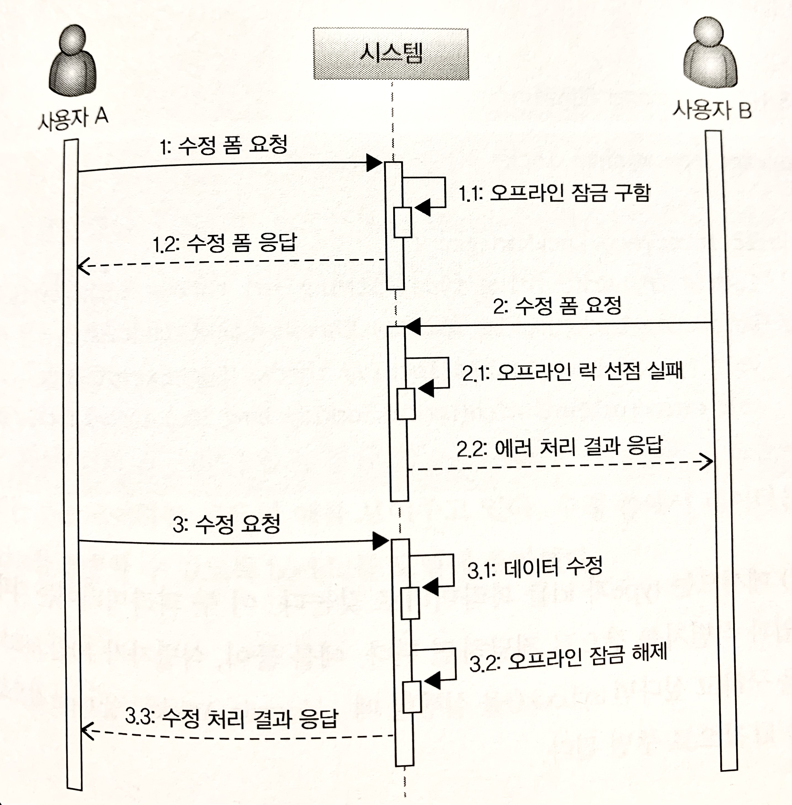

# 애그리거트와 트랜잭션
한 애그리거트 내에서도 운영자와 고객이 같은 처리를 하게되면 별도의 트랜잭션 처리가 필요해진다.

# 선점 잠금(Pessimistic Lock - 비관적 락)
선점 잠금은 먼저 애그리거트를 구한 스레드가 애그리거트 사용이 끝날 때 까지(`커밋될 때 까지`) 다른 스레드가 해당 애그리거트를 수정하는 것을 막는 방식이다.<br>

한 스레드가 애그리거트를 구하고 수정하는 동안 다른 스레드가 수정할 수 없으므로 `동시에 애그리거트를 수정할 때 발생하는 데이터 충돌 문제를 해소`할 수 있다.

선점 잠금 방식은 먼저 수행되는 스레드의 트랜잭션이 아직 끝나지 않게 되면 다음 스레드는 먼저 수행중인 스레드의 락이 풀릴 때까지 대기 상태가 된다.

선점 잠금은 보통 DBMS가 제공하는 행 단위 잠금을 사용해서 구현한다. 오라클을 비롯한 다수 DBMS가 for update와 같은 쿼리를 사용해서 특정 레코드에 한 사용자만 접근할 수 있는 잠금 장치를 제공한다.

JPA의 EntityManager는 LockModeType을 인자로 받는 find() 메서드를 제공하는데, LockModeType.PESSIMISTIC_WRITE를 값으로 전달하면 해당 엔티티와 매핑된 테이블을 이용해서 선점 잠금 방식을 적용할 수 있다. 그렇게 되면 쿼리에 `for update`가 붙어 선점 잠금을 구현할 수 있다.

## 선점 잠금과 교착 상태
  
선점 잠금 기능을 사용할 때는 잠금 순서에 따른 교착 상태(deadlock)가 발생하지 않도록 주의해야 한다. 아래와 같은 경우 deadlock이 발생할 수 있다.

1. thread 1 : A 애그리거트에 대한 선점 잠금 구함
2. thread 2 : B 애그리거트에 대한 선점 잠금 구함
3. thread 1 : B 애그리거트에 대한 선점 잠금 시도
4. thread 2 : A 애그리거트에 대한 선점 잠금 시도

이 순서에 따르면 thread 1은 thread 2가 B 애그리거트에 대한 잠금을 이미 선점하고 있기 때문에 대기 상태가 되고, thread 2도 thread 1이 A 애그리거트에 대한 잠금을 이미 선점하고 있기 때문에 서로 락이 풀릴 때 까지 영원히 대기 상태에 빠지게 된다. 즉, 교착 상태에 빠지게 된다.

선점 잠금에 대한 교착 상태는 상대적으로 사용자 수가 많을 때 발생할 가능성이 높고, 사용자 수가 많아지면 교착 상태에 빠지는 thread가 더 빠르게 증가한다. 더 많은 thread가 교착 상태에 빠질 수록, 시스템은 점점 아무것도 할 수 없는 상황에 이르게 된다.

이런 문제를 예방하기 위해서는 잠금을 구할 때 최대 대기 시간을 지정해야 한다. JPA에서는 최대 대기 시간을 아래와 같이 힌트를 사용하여 설정할 수 있다.

* JPA 힌트를 활용한 최대 대기 시간 설정 예제

```java
Map<String, Object> hints = new HashMap<>();
hints.put("javax.persistence.lock.timeout", 2000);
Order order = entityManger.find(
    Order.class, orderNo, LockModeType.PESSIMISTIC_WRITE, hints
);
```

> DBMS 종류에 따라 deadlock에 빠진 커넥션 처리 방식이 다르다. 쿼리별이거나 커넥션 단위로 대기 시간을 처리할 수 있다. 따라서 종류 별 DBMS에 대해 JPA가 어떤 방식으로 대기 시간을 처리할 수 있는지 확인이 필요하다.

# 비선점 잠금(Optimistic Lock - 낙관적 락)
선점 잠금이 강력해보일 수 있지만 모든 트랜잭션 충돌을 해결할 수 있는 것은 아니다. 아래와 같은 경우를 예로 들 수 있다.

1. 운영자는 배송을 위해 주문 정보를 조회. 시스템에서 정보 제공.
2. 고객은 배송지 변경을 위해 변경 폼을 요청. 시스템은 역시 변경 폼 제공.
3. 고객이 새로운 배송지를 입력하고 폼을 전송해서 배송지를 변경.
4. 운영자가 1번에서 조회한 주문 정보를 기준으로 배송지를 정하고 배송 상태 변경 요청.

이렇게 되면 운영자는 고객이 변경한 최신 배송지 정보는 알지 못하고, 이전 배송지 주소를 갖고 있는 상품에 대한 배송 상태를 변경하게 되버린다. 이 때, 비선점 잠금 방식으로 문제를 해결할 수 있다.

비선점 잠금 방식을 하면 동시에 접근하는 것 자체를 막는 것이 아닌, 얼마든지 동시에 접근은 가능하되 대신 변경한 데이터를 실제 DBMS에 반영하는 시점에 변경 가능 여부를 확인하는 방식이다.

비선점 잠금 방식을 구현하려면 애그리거트에 버전으로 사용할 숫자 타입의 프로퍼티를 추가해야 한다. 애그리거트를 수정할 때마다 버전으로 사용할 프로퍼티의 값이 이 1씩 증가하는데, 아래와 같은 쿼리를 사용하게 된다.

```sql
UPDATE aggtable SET version = version + 1, colx = ?, coly = ?
WHERE aggid = ? and version = 현재 버전
```

수정할 애그리거트와 매핑되는 테이블의 버전 값이 현재 애그리거트의 버전과 동일한 경우에만 데이터 수정이 가능하다. 그리고 수정에 성공하면 버전 값을 1 증가시킨다. 따라서, 다른 트랜잭션이 먼저 데이터를 수정해서 버전 값이 바뀌면 데이터 수정에 실패하게 된다.

JPA에서는 @Version 어노테이션을 활용하여 비선점 잠금을 처리할 수 있다.

이렇게 비선점 잠금 방식으로 트랜잭션을 관리하다가 트랜잭션 충돌이 발생하게 되면 `OptimistidLockingFailureException`이 발생하게 된다.

비선점 잠금을 위에서 든 예시에 적용해본다면, 시스템은 사용자에게 수정 폼을 제공할 때 애그리거트 버전을 함께 제공하고  사용자가 폼을 전송할 때와 폼을 생성할 때 사용한 애그리거트 버전을 함께 전송하도록 한다.<br>
그러면 애그리거트를 수정하려할 때, 사용자가 전송한 버전과 애그리거트 버전이 동일한 경우에만 수정 기능을 수행하도록 함으로써 트랜잭션 충돌 문제를 해소할 수 있다.

* 비선점 잠금 처리 코드 예제

```java
public class StartShippingService {
    
    @PreAuthorize("hasRole('ADMIN')")
    @Transactional
    public void startShipping(StartShippingRequest req) {
        Order order = orderRepository.findById(new OrderNo(req.getOrderNumber()));
        checkOrder(order);
        if (!order.matchVersion(req.getVersion)) {  //  matchVersion은 현재 애그리거트 버전과 인자의 버전이 일치하면 true 반환하도록 구현한다.
            throw new VersionConflictException();
        }
        order.startShipping();
    }
    
    //...
}

@Controller
public class OrderAdminController {
    private StartShippingService startShippingService;
    
    @RequestMapping(value = "/startShipping", method = RequestMethod.POST)
    public String startShipping(StartShippingRequest startReq) {
        try {
            startShippingService.startShipping(startReq);
            return "shippingStarted";
        } catch (OptimisticLockingFailureException | VersionConflictException ex) {
            //  트랜잭션 충돌
            return "startShippingTxConflict";
        }
    }
}
```
위에서는 스프링 프레임워크에서 발생시키는 OptimisticLockingFailureException과 응용 서비스 코드에서 발생시키는 VersionConflictException, 두 개의 익셉션으로 처리하고 있다.

## 강제 버전 증가
애그리거트에서 루트 애그리거트 외에 다른 엔티티의 값을 처리하게 될 때, 이 경우에는 JPA는 루트 엔티티의 버전 값을 증가시키지 않는다. 연관된 엔티티의 값이 변경된다고 해도 루트 엔티티 자체의 값이 바뀌지 않는다면 버전 값은 갱신되지 않는다.ㄷ

이러한 JPA의 특징은 논리적 관점에서 보면, 비록 루트 엔티티의 값이 변경되지 않았더라도 애그리거트의 구성요소 중 일부 값이 바뀐다면 논리적으로 해당 애그리거트는 바뀐 것이기 때문에 문제가 될 수 있다.

JPA는 이러한 문제를 처리할 수 있도록 EntityManager#find() 메서드로 엔티티를 구할 때 강제로 버전 값을 증가시키는 잠금 모드를 지원한다.

* 강제 버전 값 증가 코드 예제

```java
@Repository
public class JpaOrderRepository implements OrderRepository {
    @PersistenceContext
    private EntityManager entityManager;
    
    @Override
    public Order findByIdOptimisticLockMode(OrderNo id) {
        return entityManager.find(Order.class, id, LockModeType.OPTIMISTIC_FORCE_INCREMENT);
    }
}
```

`LockModeType.OPTIMISTIC_FORCE_INCREMENT`를 활용하면 루트 엔티티의 값을 변경한 게 아니더라도 버전 값을 증가시킬 수 있다.

# 오프라인 선점 잠금
사실 엄격하게 데이터 충돌을 막으려면, 누군가 수정 화면을 보고 있을 때 수정 화면 자체를 실행하지 못하도록 해야 한다.

하지만 이는 한 트랜잭션 범위에서만 적용되는 선점/비선점 잠금 방식으로는 구현할 수 없다. 이 때 필요한 것이 오프라인 선점 잠금 방식(Offline Pessimistic Lock)이다.

단일 트랜잭션에서 동시 변경을 막는 선점 잠금 방식과 달리 오프라인 선점 잠금 방식은 여러 트랜잭션에 걸쳐 동시 변경을 막는다.<br>
첫 번째 트랜잭션을 시작할 때  오프라인 잠금을 선점하고, 마지막 트랜잭션에서 잠금을 해제한다. 잠금을 해제하기 전까지 다른 사용자는 잠금을 구할 수 없다.


