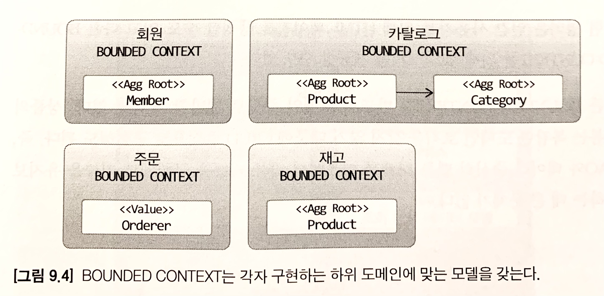
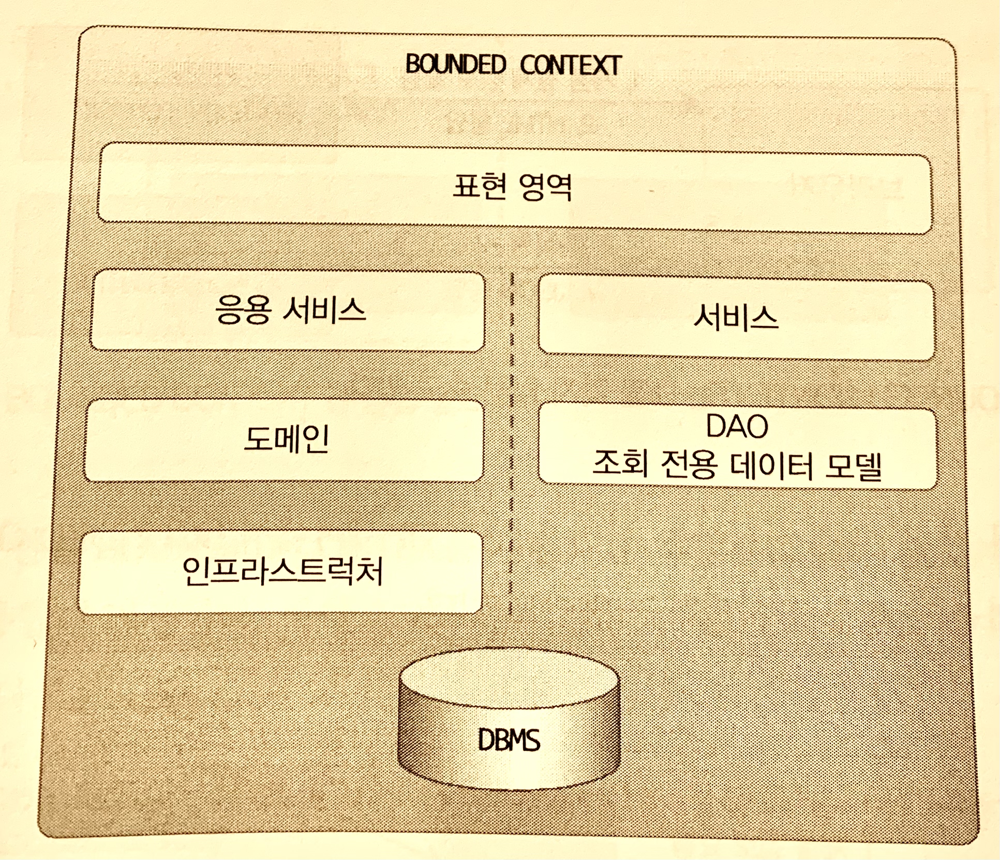
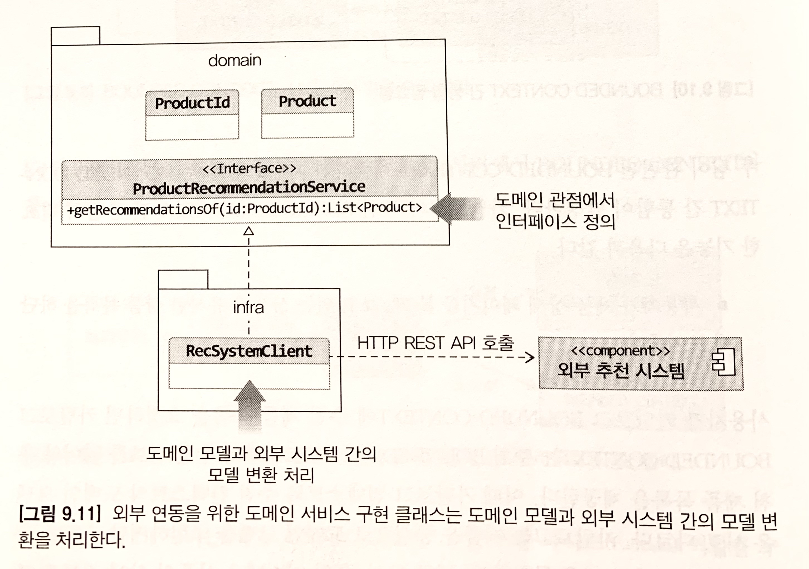
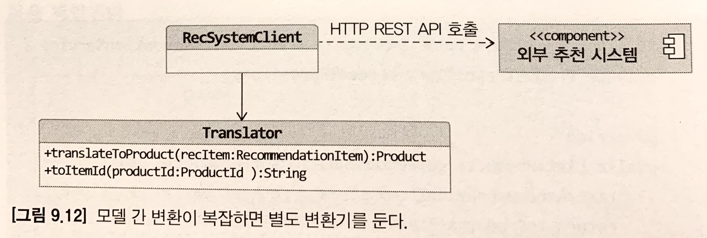
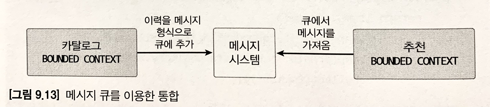
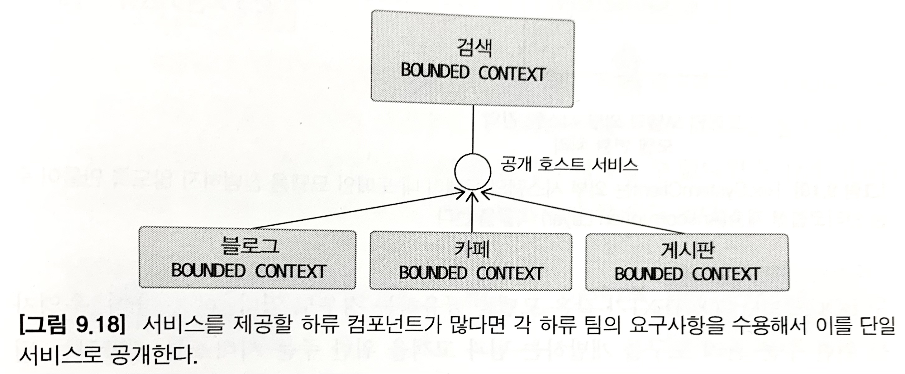
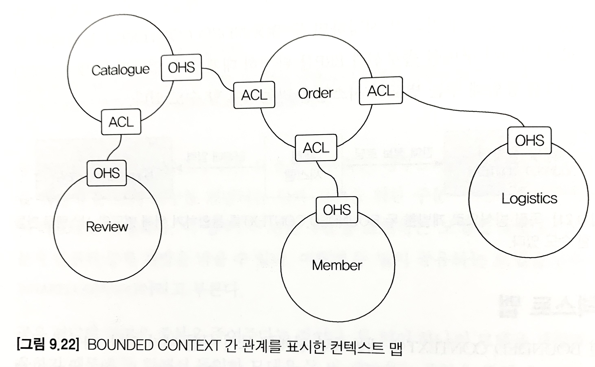

# 도메인 모델과 경계
시스템을 사용하는 사람을 회원 도메인에서는 회원, 주문 도메인에서는 주문자, 배송 도메인에서는 보내는 사람 이렇게 명칭이 각각 다를 수 밖에 없다.<br>
따라서 이렇게 하위 도메인마다 같은 용어라도 다르게 지칭될 수 있기 때문에 `한 개의 모델로 모든 하위 도메인을 표현하려 해서는 안된다.`

올바른 도메인 모델을 개발하려면 하위 도메인마다 모델을 만들어야 한다. 각 모델은 `명시적으로 구분되는 경계`를 가져서 섞이지 않도록 해야 한다.<br>
여러 하위 도메인의 모델이 섞이기 시작하면 모델의 의미가 약해질 뿐만 아니라 여러 도메인의 모델이 서로 얽혀 있기 때문에 각 하위 도메인 별로 다르게 발전하는 요구사항을 모델에 반영하기 어려워진다.

모델은 특정한 컨텍스트(문맥)하에서 완전한 의미를 갖는다. 위에서 얘기했다시피 같은 제품이라도 카탈로그 컨텍스트와 재고 컨텍스트에서 의미가 서로 다르다.<br>
이렇게 구분되는 경계를 갖는 컨텍스트를 DDD에서는 BOUNDED CONTEXT라고 부른다.

# BOUNDED CONTEXT
BOUNDED CONTEXT는 모델의 경계를 결정하며 한 개의 BOUNDED CONTEXT는 논리적으로 한 개의 모델을 갖는다.

BOUNDED CONTEXT는 용어를 기준으로 구분한다.

BOUNDED CONTEXT는 실제로 사용자에게 기능을 제공하는 물리적 시스템으로, 도메인 모델은 이 BOUNDED CONTEXT 안에서 도메인을 구현한다.

하위 도메인과 BOUNDED CONTEXT가 1:1 관계를 가지면 좋겠지만 현실적으로는 어려울 수밖에 없다.(기업의 팀 조직 구조에 따라 결정되기도 한다.)

> 주문 하위 도메인에서 주문/결제 금액 계산 BOUNDED CONTEXT로 명확한 용어를 통해 나눌 수도 있고, 카탈로그/재고 관리 하위 도메인이 명확환 용어 구분이 되지 않을 경우 두 하위 도메인을 한 BOUNDED CONTEXT에서 구현할 수도 있다.

규모가 작은 기업이라면 전체 시스템을 즉, 여러 하위 도메인을 한 개의 BOUNDED CONTEXT에서 구현할 수도 있다.

> 다만, 이럴 경우 하위 도메인들이 뒤섞이지 않도록 주의해야 한다.

여러 하위 도메인들을 하나의 단일 모델로 만들게 된다면 결과적으로 도메인 모델이 개별 하위 도메인을 제대로 반영하지 못하게 되면서 하위 도메인 별 기능 확장이 어렵게 되고 이는 서비스 경쟁력을 떨어뜨릴 수 있다.

한 개의 BOUNDED CONTEXT에서 여러 하위 도메인들을 포함하여 하위 도메인 마다 구분되는 패키지를 갖도록 구현해야 하위 도메인을 위한 모델이 서로 뒤섞이지 않게 됨으로써 하위 도메인마다 BOUNDED CONTEXT를 갖는 효과를 낼 수 있다.

BOUNDED CONTEXT는 도메인 모델을 구분하는 경계가 되기 때문에 같은 사용자를 지칭한다 하더라도 BOUNDED CONTEXT가 다르다면 갖는 모델도 달라진다.

> 회원의 Member는 애그리거트 루트이지만 주문의 Ordrerer는 밸류가 되고, 카탈로그의 Product는 상품이 속할 Category와 연관을 갖지만 재고의 Product는 카탈로그의 Catetory와 연관을 맺지 않는다.



# BOUNDED CONTEXT의 구현
BOUNDED CONTEXT는 도메인 모델 뿐 아니라 도메인 기능을 사용자에게 제공하는 데 필요한 표현 영역, 응용 서비스, 인프라 영역 등을 모두 포함한다. 

도메인 모델의 데이터 구조가 바뀌면 DB 테이블 스키마도 함께 변경해야 하므로 해당 테이블도 BOUNDED CONTEXT에 포함된다.

모든 BOUNDED CONTEXT를 반드시 DDD 구조로 개발할 필요는 없다. `복잡한 로직이 없다면` DAO와 VO만을 이용한 CRUD 방식으로 구현해도 된다.<br>
서비스-DAO 구조를 사용하면 도메인 기능이 서비스에 흩어지게 되지만, 도메인 기능 자체가 단순하다면 서비스-DAO로 구성된 CRUD 방식을 사용해도 유지보수에 문제가 되지 않는다.

> 각 BOUNDED CONTEXT는 도메인 구조에 알맞는 아키텍처를 사용한다.

한 BOUNDED CONTEXT에서 두 방식을 혼합하여 사용할 수도 있는데 대표적인 예가 `CQRS 패턴`이다.

> CQRS(Command Query Responsibility Segregation) 패턴 : 상태를 변경하는 명령 기능과 내용을 조회하는 쿼리 기능을 위한 모델을 구분하는 패턴을 말한다.

CQRS 패턴을 단일 BOUNDED CONTEXT에 적용한다면 아래와 같이 상태 변경 기능은 도메인 모델 기반, 조회 기능은 서비스-DAO 구조로 구현할 수도 있다. 



BOUNDED CONTEXT는 서로 다른 구현 기술을 사용할 수 있다.
- 웹 MVC는 스프링 MVC, 리포지터리 구현 기술은 JPA라거나, Netty를 이용해 REST API를 제공하고 MyBatis를 리포지터리 구현 기술로 사용할 수도 있다.

# BOUNDED CONTEXT 간 통합
서로 다른 두 팀이 관련된 BOUNDED CONTEXT를 개발하게 되면 자연히 두 BOUNDED CONTEXT 간 통합이 발생하게 된다.(ex. 카탈로그 시스템과 추천 시스템 - 해당 카탈로그에 추천하는 기능 추가 시)

* 카탈로그 컨텍스트와 추천 컨텍스트 간의 통합 예시

사용자가 카탈로그 BOUNDED CONTEXT에 추천 제품 목록을 요청하면 카탈로그 BOUNDED CONTEXT는 추천 BOUNDED CONTEXT로부터 추천 정보를 읽어와 추천 제품 목록을 제공하는 방식이라 가정한다.

카탈로그 컨텍스트와 추천 컨텍스트의 도메인 모델은 서로 다르기 때문에 카탈로그 컨텍스트에서 추천 컨텍스트로 데이터를 받아올 때 추천 데이터이지만 카탈로그 도메인 데이터 형태로 추천 데이터를 표현해야 한다.

## BOUNDED CONTEXT 간 직접 통합 방식

두 BOUNDED CONTEXT를 직접적으로 통합하는 방식으로 주로 `두 BOUNDED CONTEXT 간에 REST API를 호출`하는 방식이 있다.

### 도메인 형태의 interface 선언 및 구현 방식 

```java
// 상품 추천 기능을 표현하는 카탈로그 도메인 서비스
public interface ProductRecommendationService {
    public List<Product> getRecommendationsOf(ProductId id);
}
```
따라서, 위 예시 처럼 카탈로그 도메인 모델을 기반으로 하는 도메인 서비스를 이용하여 상품 추천 기능을 표현해야 한다.

도메인 서비스를 구현한 클래스는 infraStructure 영역에 위치한다.



위 그림처럼 외부 추천 시스템으로 rest api를 호출하여 받아온 데이터는 추천 컨텍스트 기반 모델 형태이기 때문에 아래 코드와 같이 카탈로그 도메인 형태의 모델로 변환이 필요하다.

```java
public class RecSystemClient implements ProductRecommendationService {
    private ProductRepository productRepository;
    
    @Override
    public List<Product> getRecommendationOf(ProductId id) {
        List<RecommendationItem> items = getRecItems(id.getValue());
        return toProducts(items);
    }

    private List<RecommendationItem> getRecItems(String itemId) {
        // externalRecClient는 외부 추천 시스템을 위한 클라이언트라고 가정
        return externalRecClient.getRecs(itemId);
    }

    private List<Product> toProducts(List<RecommendationItem> items) {
        return items.stream()
                    .map(item -> toProductId(item.getItemId()))
                    .map(prodId -> productRepository.findById(prodId))
                    .collect(toList());
    }

    private ProductId toProductId(String itemId) {
        return new ProductId(itemId);
    }
    //...
}
```

> 위 RecSystemClient와 같은 역할을 하는 계층을 안티코럽션 계층(Anticorruption Layer)라고 부른다. 

### 변환 처리 전용 별도 클래스 구현 방식

위 처리가 복잡하다면 별도 변환 처리만을 위한 클래스를 구현하여 사용하는 구조도 가능하다.



## BOUNDED CONTEXT 간 간접 통합 방식

대표적인 간접 통합 방식으로 `메시지 큐를 활용`하는 방법이 있다.



이 방식도 마찬가지로 두 BOUNDED CONTEXT 간 사용할 메시지의 데이터 구조를 협의해야 한다. 보통 큐를 누가 제공하는가에 따라 데이터 구조가 결정된다.

# BOUNDED CONTEXT 간 관계

BOUNDED CONTEXT 간에는 어떻게든 연결될 수 밖에 없고 의존 관계에 따라 상류/하류 컴포넌트로 구분한다. 하류 컴포넌트는 상류 컴포넌트가 제공하는 데이터와 기능에 의존하게 된다.

* 상류 컴포넌트 : 서비스 공급자 역할
* 하류 컴포넌트 : 공급받은 서비스를 사용하는 고객 역할

상류/하류 컴포넌트는 일반적으로 REST API 형태로 관계를 맺기 때문에 연관되고 있는 API 변경 작업이 필요할 때 마다 서로 공유하고 일정을 협의해서 개발해야 한다.

## 공개 호스트 서비스(Open Host Service)

공개 호스트 서비스란, 상류 팀의 고객인 하류 팀이 다수 존재할 때 상류 팀에서 하류 팀의 요구사항을 수용할 수 있는 API를 만들고 이를 서비스 형태로 공개하여 일관성을 유지할 수 있게 하는 서비스를 말한다.



> 서비스를 제공할 하류 컴포넌트가 많다면 각 하류 팀의 요구사항을 수용해서 이를 단일 서비스로 공개한다.

앞서 본 거 처럼 하류 컴포넌트는 상류 서비스의 모델이 자신의 도메인 모델에 영향을 주지 않도록 `안티코럽션 계층(Anticorruption Layer)`을 활용할 수 있다.

안티코럽션 계층에서 두 BOUNDED CONTEXT 간의 모델 변환을 처리해주기 때문에 다른 BOUNDED CONTEXT 의 모델에 영향을 받지 않고 내 도메인 모델을 유지할 수 있다.

* 공유 커널(Shared Kernel)

공유 커널이란, 두 BOUNDED CONTEXT 간 공유하는 모델을 일컫는다. 공유 커널을 활용함으로써 중복 개발을 줄일 수 있지만 두 팀이 한 모델을 공유하기 때문에 의존성이 부여되어 한 팀에서 공유 커널을 임의로 변경할 수 없게 된다.

따라서, 두 팀이 밀접한 관계를 형성할 수 없다면 공유 커널을 활용하지 않는 것이 좋다.

* 독립 방식(Separate Way) 관계

독립 방식 관계란, 서로 통합하지 않는 방식을 말한다. 즉, 두 BOUNDED CONTEXT 간에 통합하지 않으므로 서로 독립적으로 모델을 발전시킨다.

독립 방식은 두 BOUNDED CONTEXT 간의 통합이 수동으로 이뤄진다.(ex. 쇼핑몰 솔루션 <-> 외부 ERP `판매 정보를 ERP시스템에 직접 입력`)

다만, 규모가 커질 수록 수동 통합에는 한계가 있으므로 그 떄는 두 BOUNDED CONTEXT 간에 통합이 필요하다.

# 컨텍스트 맵

컨텍스트 맵이랑 나무가 아닌 숲을 보기 위한 전체 비즈니스를 조망하는 지도를 말한다.

컨텍스트 맵은 시스템의 전체 구조를 보여준다.

> 컨텍스트 맵은 전체 시스템의 이해 수준을 보여준다. 즉, 시스템을 더 잘 이해하거나 시간이 지나면서 컨텍스트 간 관계가 바뀌면 컨텍스트 맵도 바뀐다.



* OHS : 공개 호스트 서비스
* ACL : 안티코럽션 계층
