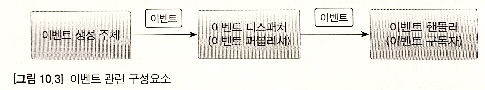
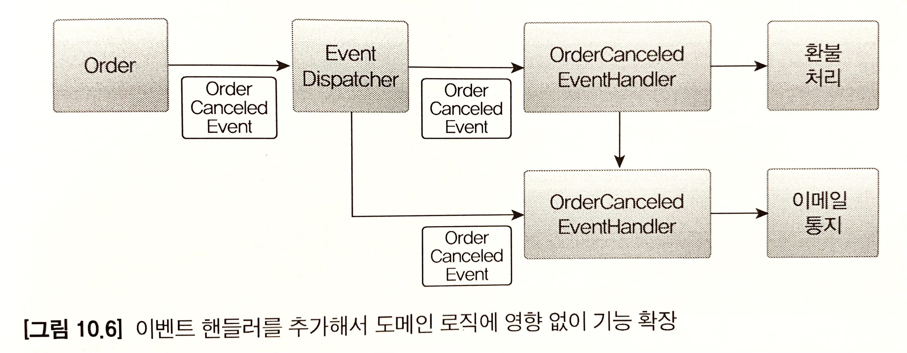
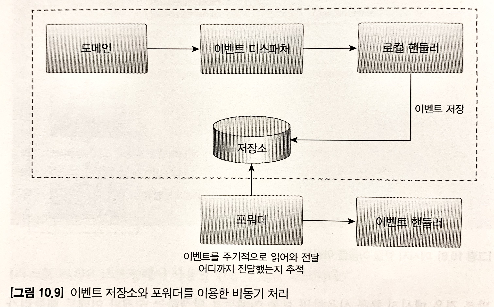
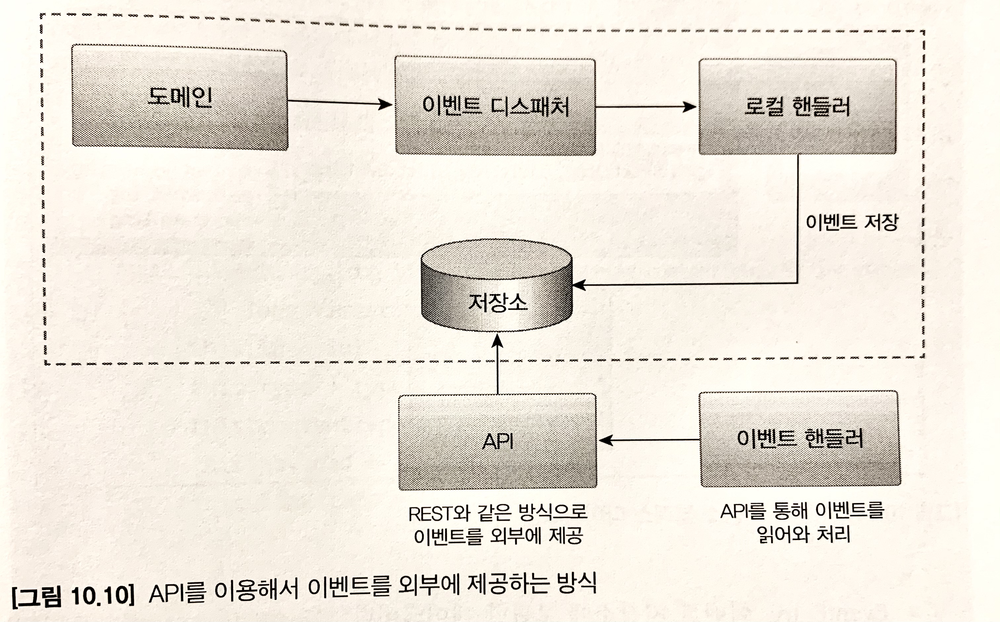

# 시스템 간 강결합의 문제

주문과 결제 BOUNDED CONTEXT 간에 강결합에 따른 문제점들로 아래와 같은 이슈가 있을 수 있다.

## 외부 서비스 통신 문제
### 트랜잭션 처리
주문 취소에 따른 환불 처리 기능 실행 시, 주문 취소를 위해서는 외부 서비스와 통신을 해야하는데 외부 서비스에 문제가 발생하고 있는 상황이라면 이에 대한 트랜잭션 처리가 애매하다.

게다가 환불 기능 실행 도중 exception이 발생하게 된다면 트랜잭션을 롤백해야 할지 이 또한 애매하다. 

### 성능
만일 외부 시스템 통신 응답 시간이 30초가 소요된다면, 그 다음 처리가 실행되기 까지 대기시간도 늘어나게 된다. 

## 설계상 이슈
주문과 결제 로직이 한 메소드 내에 섞이게 되면서, 즉 도메인 객체에 서로 다른 도메인 로직이 섞이면서 한 도메인 로직에 수정이 필요하게 되면 그에 따른 다른 도메인 로직도 수정이 불가피해지는 현상이 발생할 수 있다.

또한, 새로운 기능을 추가하게 될 때도 점점 로직이 섞이는 문제가 발생하고 트랜잭션 처리는 복잡해질 수 있다.

이러한 문제들을 해겷하기 위한 방법으로 `이벤트`를 사용하여 모든 연동을 비동기 처리함으로써 해결할 수 있다. 

# 이벤트 개요
## 이벤트 관련 구성요소
도메인 모델에서 이벤트의 주체는 엔티티, 밸류, 도메인 서비스와 같은 도메인 객체이다. 도메인 객체는 도메인 로직을 실행해서 상태가 바뀌면 관련 이벤트를 발생한다. 


* 이벤트 핸들러 : 이벤트 생성 주체가 발생한 이벤트에 반응하여 이벤트에 담긴 데이터를 전달받아 원하는 기능을 실행한다.
* 이벤트 디스패처 : 이벤트 생성 주체와 이벤트 핸들러를 연결해주는 개체로써 이벤트 생성 주체로부터 이벤트를 전달받아 해당 이벤트를 처리할 수 있는 핸들러에 이벤트를 전달한다. 이벤트 구현 방식에 따라 이벤트 생성과 처리를 동기 / 비동기로 실행하게 된다.

## 이벤트의 구성
발생한 이벤트는 보통 아래와 같은 정보를 담고 있다.

* 이벤트 종류 : 클래스 이름으로 이벤트 종류를 표현
* 이벤트 발생 시간
* 추가 데이터 : 주문번호, 신규 배송지 정보 등 이벤트와 관련된 정보

이벤트는 일반적으로 과거에 벌어진 것을 표현하기 때문에 이벤트 이름에는 `과거 시제`를 사용한다.

* 이벤트 발생 예제

```java
// 이벤트 클래스
public class ShippingInfoChangedEvent {
    private String orderNumber;
    private long timestamp;
    private ShippingInfo newShippingInfo;
    
    //  생성자, getter
}

// 이벤트 생성 주체
public class Order {
    public void changeShippingInfo(ShippingInfo newShippingInfo) {
        verifyNotYetShipped();
        setShippingInfo(newShippingInfo);
        Events.raise(new ShippingInfoChangedEvent(number, newShippingInfo));    //Events.raise() 디스패처 활용
    }
    //...
}

// 이벤트 핸들러
public class ShippingInfoChangedHandler implements EventHandler<ShippingInfoChangedEvent> {
    @Override
    public void handle(ShippingInfoChangedEvent evt) {
        shippingInfoSynchronizer.sync(evt.getOrderNumber(), evt.getNewShippingInfo());
    }
}
```
이벤트는 이벤트 핸들러가 작업을 수행하는데 `필요한 최소한의 데이터를 담아야 한다.` 만약 데이터가 부족할 경우, 관련 API를 추가 호출하거나 DB에 추가 조회를 해야 한다.

## 이벤트 용도
이벤트는 크게 두 가지 용도로 쓰인다.
* 트리거
* 서로 다른 시스템 간 동기화

`트리거`는 도메인의 상태가 바뀔 때, 다른 후처리가 추가적으로 필요하게 될 때 이벤트를 활용할 수 있다.
`시스템 간 동기화`는 배송지 변경 후 외부 배송 서비스와 등기화가 필요한 경우, 혹은 CQRS 패턴에서 RDB와 nosql간 동기화가 필요할 때 활용되는 케이스이다.

## 이벤트 장점
* 도메인 로직의 분리
* 간편한 기능 확장



위와 같은 구조로 기능 확장을 하여도 도메인 로직은 수정할 필요가 없게 된다.

# 이벤트, 핸들러, 디스패처 구현
이벤트 관련 코드 구성은 다음과 같다

* 이벤트 클래스
* 이벤트 핸들러(EventHandler) : 이벤트 핸들러를 위한 상위 타입으로 모든 핸들러는 이 인터페이스를 구현한다.
* 이벤트(Events) : 이벤트 디스패처. 이벤트 발행, 이벤트 핸들러 등록, 이벤트를 핸들러에 등록하는 등의 기능을 제공한다.

## 이벤트 클래스
상위 클래스 없이 해당 클래스 자체가 이벤트에 활용된다. 클래스 명은 과거 시제를 사용해야 한다. 또한 이벤트 클래스는 이벤트에 필요한 최소한의 데이터를 포함해야 한다.

* 이벤트 클레스 예제

```java
public class OrderCanceledEvent {
    //  이벤트는 핸들러에서 이벤트를 처리하는 데 필요한 데이터를 포함한다.
    private String orderNumber;
    public OrderCanceledEvent(String number) {
        this.orderNumber = number;
    }
    
    public String getOrderNumber() { return orderNumber; }
}
```

* 모든 이벤트가 공통으로 갖는 프로퍼티가 존재할 경우

```java
public abstract class Event {
    private long timestamp;
    
    public Event() {
        this.timestamp = System.currentTimeMillis();
    }
    
    public long getTimestamp() { return timestamp; }
}

// 발생 시간이 필요한 각 이벤트 클래스는 Event를 상속받아 구현한다.
public class OrderCanceledEvent extends Event {
    private String orderNumber;
    public OrderCanceledEvent(String number) {
        super();
        this.orderNumber = number;
    }
}
```

## EventHandler 인터페이스

EventHandler 인터페이스는 이벤트 핸들러를 위한 상위 인터페이스다.

```java
public interface EventHandler<T> {
    void handle(T event);           //  handle 메서드를 구현하여 필요한 이벤트 기능을 구현한다.
    
    default boolean canHandle(Object event) {       // 핸들러가 이벤트 처리 가능한 지 여부를 체크
        Class<?>[] typeArgs = TypeResolver.resolveRawArguments(EventHandler.class, this.getClass());
        return typeArgs[0].isAssignableFrom(event.getClass());
    }
}
```

> TypeResolver는 EventHandler의 파라미터화 타입을 구하는 기능을 제공한다.

* canHandle 적용 예제

```java
EventHandler<T> handler = new EventHandler<PasswordChangedEvent>() {
    @Override
    public void handle(PasswordChangedEvent event) { System.out.println("생략") }
   
}
boolean result = handler.canHandle(new PasswordChangedEvent(someId, newPw));
```

canHandle 메서드는 파라미터로 받은 event 타입이 T의 파라미터화 타입에 할당 가능하면 true를 리턴한다.

## 이벤트 디스패처인 Events 구현
도메인을 사용하는 응용 서비스는 이벤트를 받아 처리할 핸들러를 Events.handle()로 등록하고, 도메인 기능을 실행한다.

* 이벤트 디스패처 구현 예제

```java
public class CancelOrderService {
    private OrderRepository orderRepository;
    private RefundService refundService;

    @Transactional
    public void cancel(OrderNo orderNo) {
        Events.handle(  //  OrderCanceledEvent 발생 시, refund() 이벤트 처리
            (OrderCanceledEvent evt) -> refundService.refund(evt.getOrderNumber())
        );

        Order order = findOrder(orderNo);
        order.cancel();
    
        Events.reset();
    }
    //...
}
```

> Events는 내부적으로 핸들러 목록 유지를 위해 ThreadLocal을 사용하는 구조로 처리된다. Events.handle() 메서드는 인자로 전달받은 EventHandler를 List에 보관한다.

* 이벤트 발생 예제

```java
public class Order {
    public void cancel() {
        verifyNotYetShipped();
        this.state = OrderState.CANCELED;
        Events.raise(new OrderCanceledEvent(number.getNumber()));   //  이벤트 발생
    }
}
```

Events.raise()는 이벤트를 처리할 핸들러를 찾아 handle() 메서드를 실행한다.

Events는 핸들러 list를 유지하기 위해 ThreadLocal 변수를 사용한다. 톰캣과 같은 웹 애플리케이션 서버는 thread를 재사용하므로 ThreadLocal에 보관한 값을 제거하지 않으면 기대대로 동작하지 않을 수 있다. 따라서 `Events.reset()`을 실행하여 ThreadLocal변수를 초기화해야 한다.

> Events.reset()을 해주지 않으면 핸들러 객체가 List에 쌓이고 쌓여 OOM이 발생할 수 있다. 

# 동기 이벤트 처리 문제
외부 시스템과의 연동을 동기로 처리하게 되면 성능 저하 및 트랜잭션 범위 문제가 발생할 수 있게 된다. 이를 비동기 처리를 통해 해결할 수 있다.

# 비동기 이벤트 처리
이벤트를 비동기로 구현할 수 있는 방법은 아래와 같이 다양하다.
* 로컬 핸들러를 비동기로 실행
* 메시지 큐 활용
* 이벤트 저장소와 이벤트 포워더 사용
* 이벤트 저장소와 이벤트 제공 API 사용

## 로컬 핸들러의 비동기 실행
별도 로컬 스레드를 통해 이벤트 핸들러를 실행할 수 있다.

* 로컬 핸들러의 비동기 구현 예제

```java
@Transactional
public void cancel(OrderNo orderNo) {
    Events.handleAsync((OrderCanceledEvent evt) -> refundService.refund(evt.getOrderNumber()));

    Order order = findOrder(orderNo);
    order.cancel(); // Events.raise(new OrderCanceledEvent()) 실행
}
```

order.cancel()내에서 이벤트를 발생시키는 Events.raise()는 동일 스레드에서 실행되므로 같은 트랜잭션 범위에 묶인다. 하지만 Events.handleAsync()로 등록한 이벤트 핸들러는 별도 스레드로 실행되므로 refundService.refund()는 cancel() 메서드와 관련된 트랜잭션 범위에 묶이지 않게 된다.

> 스프링 트랜잭션 관리자는 보통 스레드를 이용하여 트랜잭션을 전파한다. 때문에 다른 스레드에서 실행된다면 서로 다른 트랜잭션을 사용하게 된다.

별도 스레드를 이용하여 이벤트 핸들러를 실행한다면 같은 트랜잭션 범위에 묶일 수 없기 때문에, 한 트랜잭션으로 실행해야 하는 이벤트라면 비동기로 처리해서는 안된다.

## 메시징 시스템을 활용한 비동기 구현
RabbitMQ와 같은 메시징 큐를 활용한 비동기 이벤트 처리 방법도 있다.

* 메시지 큐를 활용한 이벤트 처리 순서

1. 이벤트가 발생하면 이벤트 디스패처는 이벤트를 메시지 큐에 보낸다.
2. 메시지 큐는 받은 이벤트를 메시지 리스너에 전달한다.
3. 메시지 리스너는 알맞은 이벤트 핸들러를 이용하여 이벤트를 처리한다.

이 때, `이벤트를 메시지 큐에 저장하는 과정`과 `메시지 큐에서 이벤트를 읽어와 처리하는 과정`은 `별도 스레드나 프로세스로 처리`된다.

만일, 도메인 기능을 실행한 결과를 DB에 반영하고 이 과정에서 발생한 이벤트를 메시지 큐에 저장하는 과정까지 모두 같은 트랜잭션으로 처리가 돼야 한다면, `글로벌 트랜잭션`이 필요하다.

* 글로벌 트랜잭션

장점 : 이벤트를 메시지 큐에 안전하게 전달할 수 있다.<br>
단점 : 전체 성능이 떨어질 수 있다.

* RabbitMQ

글로벌 트랜잭션 지원<br>
클러스터와 고가용성을 지원하므로써 안정적으로 메시지 전달<br>
다양한 개발 언어와 통신 프로토콜 지원

* Kafka

글로벌 트랜잭션 미지원<br>
다른 메시징 시스템과 비교했을 때 높은 성능을 보임

## 이벤트 저장소를 활용한 비동기 처리
비동기로 이벤트를 처리하기 위한 또 다른 방법으로, 이벤트를 DB(저장소)에 저장 후 별도 프로그램을 이용하여 이벤트 핸들러에 전달하는 방법도 있다.

* 이벤트 저장소와 포워더를 활용한 비동기 처리



포워더는 별도 스레드를 이용하기 때문에 이벤트 발행과 처리가 비동기로 처리된다.

이벤트를 물리적 저장소에 저장하는 구조이기 때문에 핸들러가 이벤트 처리에 실패할 경우, 포워더는 다시 이벤트 저장소에서 이벤트를 읽어와 핸들러를 실행하면 된다. 

* 이벤트 저장소와 API를 활용한 비동기 처리



* 포워더와 API 방식의 차이점

포워더 방식 : 포워더를 통해 외부로 이벤트를 전달하는 방식. 따라서 이벤트를 어디까지 처리했는지 추적하는 역할을 포워더가 갖고 있다.<br>
API 방식 : 외부 핸들러가 API 서버를 통해 이벤트 목록을 가져오는 방식. 따라서 이벤트 목록을 요구하는 외부 핸들러가 이벤트 처리 내역을 알고 있어야 한다.

# 이벤트 적용 시 추가 고려사항

* 전송 실패 처리(포워더 구현 시)
* 이벤트 손실 처리 : 비동기로 처리할 경우 별도의 트랜잭션을 타기 때문에 이벤트 처리 실패 시에 대한 방안이 필요하다.
* 이벤트 순서 : 메시징 시스템을 사용하게 되면 이벤트 발생 순서와 처리 순서가 다를 수 있다.
* 이벤트 재처리 : 시스템 장애로 중복된 이벤트가 발생하는 경우에 대한 처리가 필요하다. 
