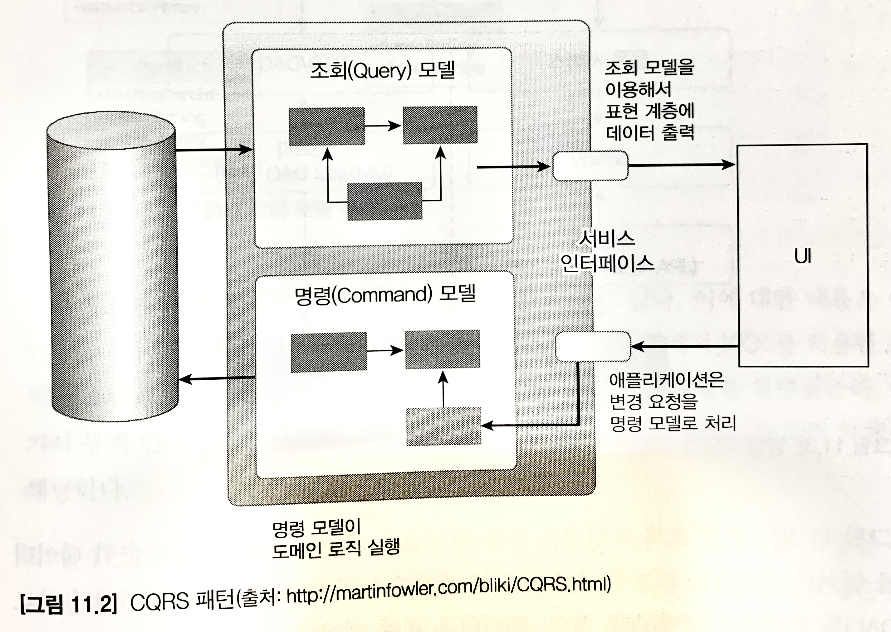
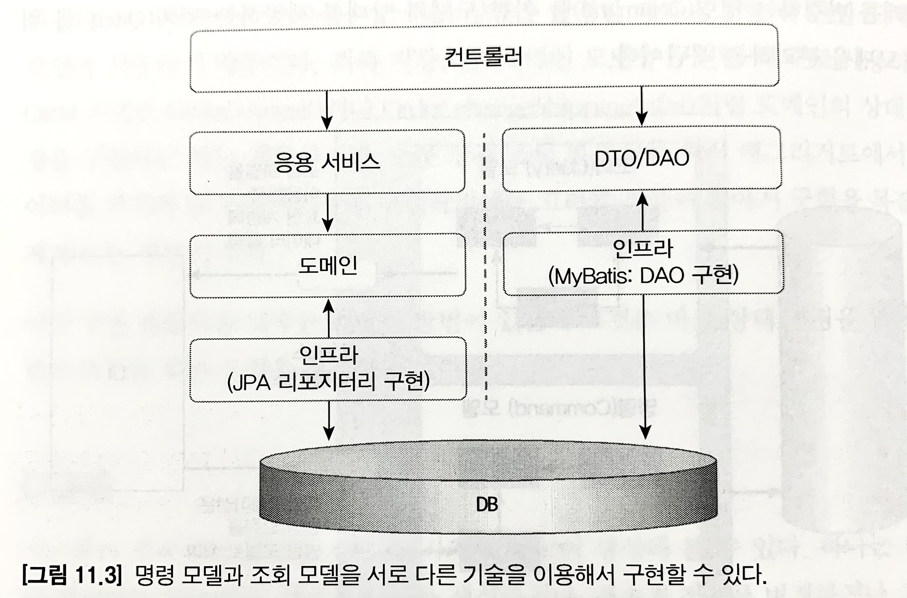
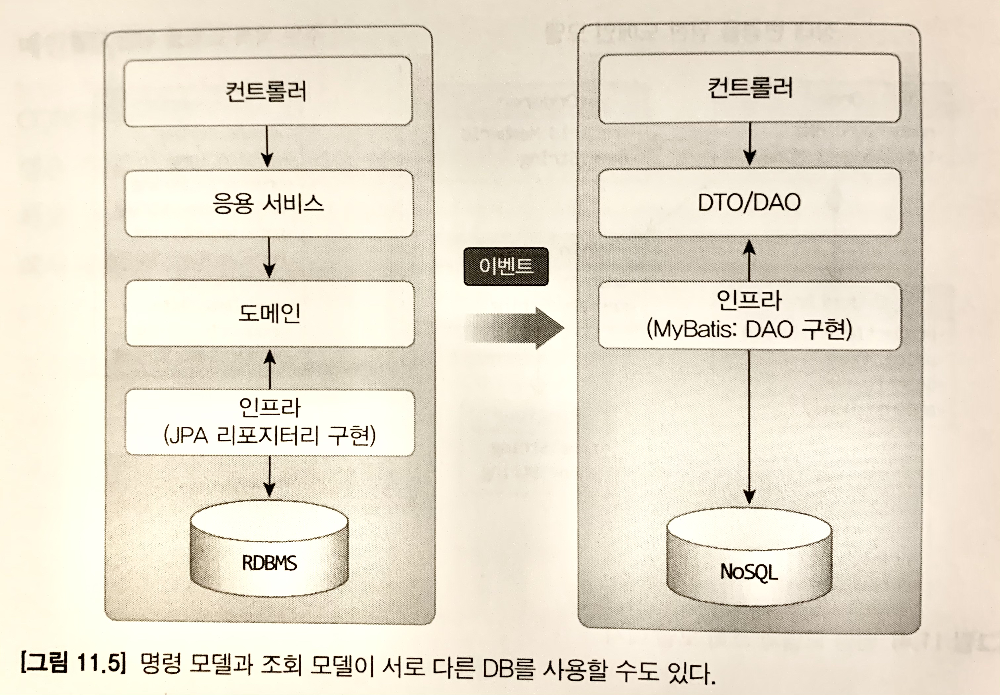

# 단일 모델의 단점
애그리거트 간 연관 관계에 따라 데이터를 가져오는 방식은 크게 두 가지가 있다.
* ID를 이용한 참조
* 직접 참조

하지만 두 가지 방식 모두 문제점을 갖고 있다. 
`ID를 이용한 참조` 방식은 JPA의 즉시 로딩 방식을 활용할 수 없어 상황에 따른 유연한 성능 최적화가 어렵다. 
`직접 참조` 방식은 조회 화면의 특성에 따라 같은 연관도 즉시/지연 로딩 방식으로 처리해야 할 수 밖에 없게 된다. 경우에 따라서는 JPA의 네이티브 쿼리를 활용해야 한다.

이런 한계가 있는 이유는 단일 도메인 모델을 사용하기 떄문이다.

객체 지향으로 도메인 모델을 구현할 때 주로 사용하는 ORM 기법은 Order.cancel()이나 Order.changeShippingInfo() 처럼 도메인의 상태 변경에는 적합하지만, 주문 상세 조회 화면 처럼 여러 애그리거트의 데이터를 조회해야 할 경우에는 구현을 복잡하게 만든다.

이런 복잡한 구조를 해결할 수 있는 방법으로 `상태 변경을 위한 모델과 조회 모델을 분리하는 방법`이 있다.

# CQRS
CQRS 패턴이 제공하는 기능은 크게 두 가지로 나뉜다.

* 상태를 변경하는 기능
* 사용자 입장에서 상태 정보를 조회하는 기능

상태를 변경하는 범위와 상태를 조회하는 기능은 일반적으로 범위가 일치하지 않기 때문에 단일 모델로 두 종류의 기능을 구현하게 되면 모델이 복잡해진다.

이를 CQRS 패턴으로 해결한다.

CQRS 패턴은 복잡한 도메인에 적합하다.

CQRS 패턴은 각 모델에 맞는 구현 기술을 선택할 수 있다. 예를 들어, 명령 모델은 객체 지향에 기반하여 도메인 모델을 구현하기에 적합한 JPA를 사용해서 구현하고, 조회 모델은 MyBatis나 JooQ를 활용하여 구현할 수 있다.

조회 모델은 응용 로직이 복잡하지 않기 때문에 컨트롤러에서 바로 DAO를 실행해도 무방하다.

또는 아래 그림처럼 명령 모델과 조회 모델이 서로 다른 데이터 저장소를 사용할 수도 있다.

명령 모델은 트랜잭션을 지원해주는 RDBMS를 사용하고, 조회 모델은 조회 성능이 좋은 NoSQL을 사용할 수 있다.

두 저장소 간의 동기화는 이벤트를 활용해서 처리한다. 명령 모델에서 상태를 변경하면 이에 해당하는 이벤트를 발생시켜 조회 모델에 이벤트 데이터를 전달하여 변경 내역을 반영한다.

* 동기화 구현 방식

1. 명령 모델 데이터 변경 시점에 바로 조회 모델에 반영해야 하는 경우 : 글로벌 트랜잭션 활용
- 하지만, 글로벌 트랜잭션을 활용하면 전반적인 성능(응답 속도와 처리량)이 떨어지는 단점이 있다.

2. 특정 시간 안에만 동기화하면 되는 경우 : 비동기 처리

## 웹과 CQRS
대형 포털이나 온라인 쇼핑몰에서는 조회 성능을 높이기 위한 다양한 방법들을 활용한다.

* 쿼리 최적화를 통한 쿼리 실행 속도 향상
* 메모리에 조회 데이터 캐시
* 조회 전용 저장소 활용

이러한 기법들은 결과적으로 CQRS를 적용하는 것과 같은 효과를 만든다. 단지, 명시적으로 명령 모델과 조회 모델을 구분하지 않을 뿐이다.

조회 속도를 높이기 위해 별도 처리를 하고 있다면, `명시적으로 명령 모델과 조회 모델을 구분하는 것이 복잡해지는 것을 방지하고, 명령 모델에 의존하지 않고 조회 기능에 특화된 구현 기법을 쉽게 적용할 수 있다.`

## CQRS 장단점

* 장점

명령 모델 구현할 때,(조회 관련 로직이 없으므로 복잡도가 낮아짐으로써) 도메인 로직 자체에 집중할 수 있다.

조회 성능 향상에 유리하다. 조회 전용 모델을 사용하기 때문에 명령 모델에 영향을 주지 않는다.

* 단점

구현해야 할 코드의 양이 많아진다. 도메인이 단순하거나 트래픽이 많지 않다면, 조회 전용 모델을 만들 이유가 없다.

더 많은 구현 기술이 필요하다. 경우에 따라 다른 저장소를 활용하거나 데이터 동기화를 위해 메시징 시스템을 도입해야 할 수 있다.

정리하자면, 도메인이 복잡하지 않은데 CQRS를 도입하면 두 모델을 유지하는 비용만 높아지고 얻을 수 있는 이점이 없다. 반면, 트래픽이 높은 서비스인데 단일 모델이라면 유지보수 비용이 오히려 높아질 수 있다.
