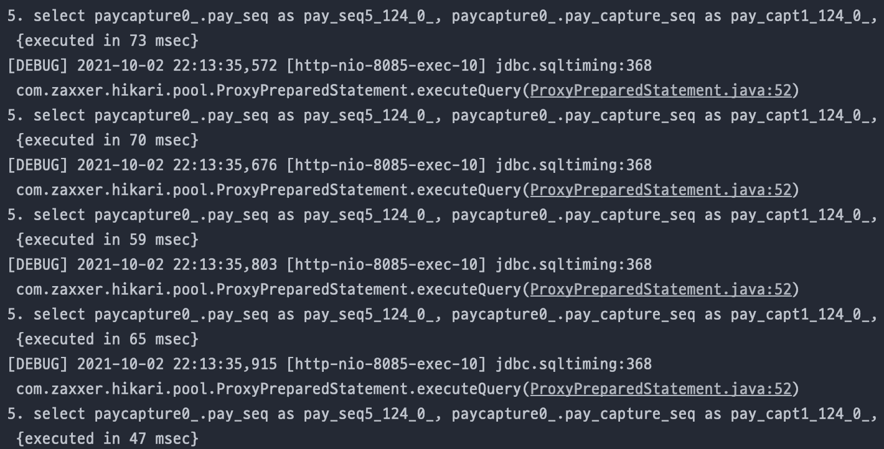

# 개요
BI 조회 API를 개발하는 과정에서 결제 정보가 담긴 Pay 테이블과 결제 요청 후 매출 확정 요청까지 처리된 정보가 담긴 PayCapture 테이블을 조회하는 과정에서 N + 1 이슈를 해결했던 과정을 기록해두려고 한다.

# 테이블 구조
Pay 테이블과 PayCapture 테이블 간에는 일대다 단방향 관계고 최초 결제 요청 시 Pay 테이블과 PayCatpure테이블에 결제 정보가 담긴 후, 배송 처리 요청 시에 PayCapture 테이블에 한번 더 결제 정보가 담기는 구조였다.

* pay 테이블
```java
@Entity
@Table(name = "pay")
@Data
@NoArgsConstructor
public class Pay implements Serializable {
    //...

    // 주문번호
    @Column(nullable = false)
    private String orderNo;
  
    @OneToMany(mappedBy = "paySeq", fetch = FetchType.EAGER)
    @OrderBy("payCaptureSeq ASC")
    private List<PayCapture> payCaptures;
  
    //...
}
```

* payCapture 테이블
```java
@Entity
@Table(name = "od_pay_capture")
@Data
public class PayCapture {
    //...
    @Column(nullable = false, length = 11)
    private int paySeq;
    //...
}
```

FetchType이 EAGER이기 때문에 PayRepository.findByOrderNoIn() 으로 OrderNo List를 통해 여러 개의 주문 정보를 한꺼번에 조회하는 시점에 아래 사진과 같이 N + 1이 발생하게 된다.


# 해결
N + 1을 해결하기 위한 방법은 아래와 같이 여러 가지 방법이 있다.
1. 두 테이블 간에 FetchType.LAZY 활용
2. JOIN FETCH 활용
3. EntityGraph 활용
4. BatchSize 적용

하지만 1번과 같이 LAZY로 처리하게 되면 PayRepository.findByOrderNoIn()가 조회되는 시점에는 N + 1이 발생하지 않지만 API 성격 상 loop를 돌면서 Pay 테이블 내 다른 정보를 get 처리해올 때 N + 1 이 발생하게 된다.<br>
여기선 2번으로 처리해야 한다.

* JOIN FETCH 적용

```java
public interface PayRepository extends JpaRepository<Pay, Integer> {
    
    @Query(value = "SELECT DISTINCT p from Pay p JOIN FETCH p.payCaptures WHERE p.orderNo IN :orderNos")
    List<Pay> findPayInOrderNosJoinCapture(@Param("orderNos") Collection<String> orderNos);
  
}
```

3, 4번은 추후 알아보자.


