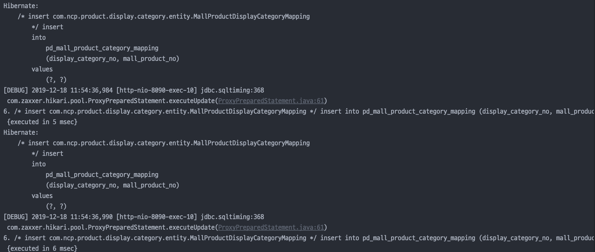
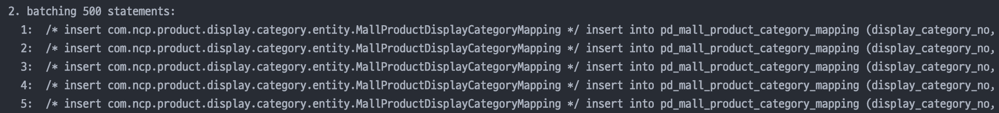
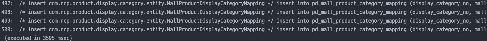
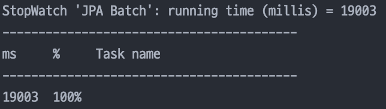

# 개요
상품리스트 페이지에서 각 상품별로 최대 20개의 상품카테고리를 등록시키는 기능을 개발하였다.
상품리스트 페이지에서는 최대 200개까지 상품을 리스트형태로 노출시켜주고 있었다.
즉, 최대 4000개의 data row가 insert 될 수 있는 구조였다.

# 테이블 구조

* MallProduct 테이블

```java
@Entity
@Table(name = "pd_mall_product")
@EntityListeners(AuditingEntityListener.class)
@Getter
@Setter
@ToString
@EqualsAndHashCode(callSuper = false)
@NoArgsConstructor
public class MallProduct {
    
  //...

  @ManyToMany(fetch = FetchType.EAGER)
  @JoinTable(name = "pd_mall_product_category_mapping", joinColumns = @JoinColumn(name = "mall_product_no"), inverseJoinColumns = @JoinColumn(name = "display_category_no"))
  @Fetch(FetchMode.SUBSELECT)
  private List<DisplayCategory> displayCategories;

  //...
}
```

* MallProductDisplayCategoryMapping 테이블

```java
@Immutable
@Entity
@Table(name = "pd_mall_product_category_mapping")
@Getter
@Setter
public class MallProductDisplayCategoryMapping {

    @Column(name = "mall_product_no")
    private int mallProductNo;
    
    @Id
    @Column(name = "display_category_no")
    private int displayCategoryNo;
    
    //...
}
```
> 코드는 displayCategoryNo에만 @Id가 설정돼있지만 사실상 mallProductNo와 displayCategoryNo가 복합키 형태를 가져야 하기 때문에 아래와 같이 @IdClass를 활용한 복합키 설정을 해줬어야 한다.(복합키 설정 없이 매핑 테이블에 bulk insert 적용 시 에러가 발생한다.)

```java
@Immutable
@Entity
@Table(name = "pd_mall_product_category_mapping")
@Getter
@Setter
@IdClass(MallProductDisplayCategoryMapping.MallProductDisplayCategoryMappingPK.class)
public class MallProductDisplayCategoryMapping {

    @Id
    @Column(name = "mall_product_no")
    private int mallProductNo;
    @Id
    @Column(name = "display_category_no")
    private int displayCategoryNo;
    
}

@Getter
@Setter
public static class MallProductDisplayCategoryMappingPK implements Serializable {
  private int mallProductNo;
  private int displayCategoryNo;
}
```

> 이외에 @EmbeddedId, @Embeddeable를 활용하여 복합키를 설정하는 방법도 있다.

* DisplayCategory 테이블

```java
@Entity
@Table(name = "pd_display_category")
@Data
@NoArgsConstructor
public class DisplayCategory {

    @Id
    @GeneratedValue(strategy = GenerationType.AUTO)
    @Column(name = "display_category_no", nullable = false)
    private int displayCategoryNo;
    
    @JsonIgnore
    @ManyToMany(mappedBy = "displayCategories", fetch = FetchType.LAZY)
    private List<MallProduct> mallProducts;
    
    //...
}
```

현재 테이블 설계는 상품 테이블인 MallProduct와 카테고리 테이블인 DisplayCategory 사이에 다대다 관계로 매핑돼있고,
MallProduct에서 @JoinTable을 통해 상품과 카테고리 테이블을 서로 매핑해주는 MallProductDisplayCategoryMapping 테이블을 통해 연관관계를 관리한다.<br>
mallProductNo는 MallProduct 테이블의 외래키, displayCategoryNo는 DisplayCategory의 외래키 구조를 갖게 된다.

# 이슈
MallProductDisplayCategoryMapping 테이블에 1개의 상품당 최대 20개의 displayCategoryNo가 insert되게 된다. 따라서 위에서 말했던것과 같이 한번에 이벤트에 최대 4000개의 row data가 저장되게 된다.<br>
여기서 일반적인 형태로 `MallProductDisplayCategoryMappingRepository.save();` 형태로 data를 저장하게 되면 아래와 같이 row 별로 일일히 persist(), flush() 과정을 거치게 되면서 처리 시간이 40초 가량 소요되었다.(해당 데이터 뿐만이 아닌 History 테이블 등등에도 insert작업이 있었다.)<br>



그리하여, 성능을 개선할 수 있는 방법으로 `JPA bulk insert` 방법을 먼저 적용해보았다.

## JPA bulk insert

* yml 설정

```yml
  jpa:
    hibernate:
      ddl-auto: none
    properties:
      hibernate:
        dialect: org.hibernate.dialect.MySQL5InnoDBDialect
        format_sql: true
        physical_naming_strategy: com.***.CamelCaseColumnStrategy
        implicit_naming_strategy: org.hibernate.boot.model.naming.ImplicitNamingStrategyLegacyHbmImpl
        use_sql_comments: true
        show_seq: true
        jdbc:
         batch_size: 500 *
           batch_versioned_data: true
         order_inserts: true *
         order_updates: true *
         enable_lazy_load_no_trans: true
```
위와 같이 설정 후 save처리를 하게 되면 아래와 같이 500개씩의 row data가 한꺼번 table에 insert되게 된다.




하지만 소요시간을 재보니 19초가 소요된다. 뭔가 이상하다.


그 이유를 알아본 결과 jpa bulk insert를 사용하기 위해서 몇가지 제약 조건이 있었다.

* 해당 테이블의 GenerationType이 IDENTITY가 아녀야 한다.
- 왜냐하면 IDENTITY는 해당 테이블의 id값을 얻으려면 우선 row data가 insert가 된 후에 얻을 수 있기 때문에 bulk insert가 제대로 동작할 수 없다.(bulk insert를 적용하려면 미리 id값을 설정할 수 있어야 하기 때문)
- GenerationType은 IDENTITY, SEQUENCE, TABLE 총 3가지 이지만 MySql에서는 SEQUENCE는 지원하지 않기 때문에 TABLE로 설정을 해야 jpa bulk insert를 적용해 볼 수 있지만 별도의 키 테이블을 생성하여 조회해오는 cost가 발생하기 때문에 성능 상 이점이 줄어들게 된다.

# 결론
MySql에서 JPA bulk insert를 활용해보려면 auto increment(IDENTITY)타입으로 id를 관리하는 것이 아닌 TABLE 타입을 활용해야 한다.<br>
아니면 spring JDBC, MyBatis, JOOQ를 활용하는 것도 방법이다.


# 알아둘 점
1. 다대다 매핑은 @ManyToMany보다는 중간에 매핑테이블과 서로 @OneToMany, @ManyToOne으로 연관관계를 매핑해주는 형태가 되게 된다.
2. @ManyToMany를 사용하게 된다면 List보다는 Set을 사용하는 것이 성능상 이점이 있다.
