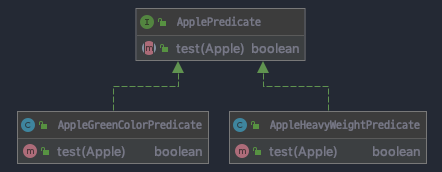

동작 파라미터화를 사용함으로써 자주 바뀌는 요구사항에 효과적으로 대응이 가능하다.
`동작 파라미터화란 아직 어떻게 실행할 지 결정하지 않은 코드 블록`을 의미 한다. 즉, 코드 블록에 따라 메서드의 동작이 파라미터화 될 수 있다. 예를 들면 아래와 같은 처리가 가능해 진다.
* 리스트의 모든 요소에 '어떤 동작'을 수행할 수 있음.
* 리스트 관련 작업을 끝낸 다음에 '어떤 다른 동작'을 수행할 수 있음.
* 에러가 발생하면 '정해진 어떤 다른 동작'을 수행할 수 있음.
기존의 자바 API에 포함된 클래스와 인터페이스를 이용해서 List를 `정렬`하거나, 파일 이름을 `필터링` 하거나, `thread로 코드 블록을 실행`하거나, GUI 이벤트를 처리하면서 동작 파라미터화 패턴을 사용해 볼 수 있게 된다.
이러한 동작 파라미터화를 구현하려면 쓸데 없는 코드가 추가되는데 이는 `람다 표현식`으로 깔끔하게 해결할 수 있다.

## 프레디케이트(Predicate) 활용 -> 전략패턴(Strategy Pattern)
```java
    public interface ApplePredicate {
        boolean test (Apple apple);
    }

    public class AppleHeavyWeightPredicate implements ApplePredicate {
        public boolean test(Apple apple) {
            return apple.getWeight() > 150;
        }
    }

    public class AppleGreenColorPredicate implements ApplePredicate {
        public boolean test(Apple apple) {
            return "green".equals(apple.getColor());
        }
    }
```

ApplePredicate는 사과 선택 전략을 캡슐화 하였다.
여기서 ApplePrediate가 다양한 동작을 할 수 있도록 구현하려면 filterApples메소드를 생성하고 ApplePredicate 객체를 받아 apple의 조건을 검사하도록 메소드를 수정해야 한다. 이렇게 해야 filterApples 메소드가 다양한 동작(전략)을 받아 내부적으로 다양한 동작을 수행할 수 있게 된다.

```java
    public static List<Apple> fileterApples(List<Apple> inventory, ApplePredicate p) {
        List<Apple> result = new ArrayList<>();
        for (Apple apple : inventory) {
            if (p.test(apple)) {
                result.add(apple);
            }
        }
        return result;
    }
```
위 처럼 filterApples메소드가 ApplePredicate 객체를 파라미터로 받게 되면서 filterApples 메소드 내 반복적인 컬렉션 로직과 컬렉션 각 요소에 적용할 동작을 분리할 수 있게 되었다. 이제 적절한 조건의 메소드만 생성하여 filterApples 메소드의 predicate 파라미터로 추가만 되면 Apple 속성과 관련한 모든 조건 변화에 대응 가능한 유연한 코드를 만들 수 있다.
```java

    pubic class AppleRedAndHeavyPredicate implements ApplePredicate {
        public boolean test (Apple apple) {
            return "red".equals(apple.getColor()) && apple.getHeavy() > 100;
        }
    }

    List<Apple> heavyApples = filterApples(inventory, new AppleHeavyWeightPredicate());
    List<Apple> greenApples = filterApples(inventory, new AppleGreenColorPredicate());
    List<Apple> redAndHeavyApples = filterApples(inventory, new AppleRedHeavyPredicate());
```
이렇게 ApplePredicate 객체에 의해 filterApples 메소드의 동작을 파라미터화 할 수 있게 되었다.
이 같은 처리를 람다 표현식을 활용하게 되면 여러 개의 ApplePredicate 클래스 정의 없이 filterApples() 메소드로의 동작 파라미터화가 가능하다.

> 동작 파라미터화의 강점 -> 컬렉션 탐색 로직과 각 항목에 적용할 동작의 분리가 가능.

## 복잡한 코드를 간소화 하는 방법
기존에 일일히 `인터페이스를 구현하는 클래스를 인스턴스화` 하여 사용하는 상당히 번거로운 작업을 `익명 클래스`를 활용함으로써 해결하였으나, 여전히 코드의 수가 많고 익명 클래스의 불편함을 `람다 표현식`을 통해 깔끔하게 해결한다.   
### 익명 클래스
위에서 본 것 처럼 동작 파라미터화를 통해 코드가 간결해졌다. 하지만 각각의 동작을 인스턴스화하는 로직을 일일히 생성해야 하는 번거로움이 남아있다. 이를 `익명 클래스를 통해 클래스의 선언과 인스턴스화를 동시에 수행`함으로써 해결 할 수 있다.

> 람다 표현식을 활용하면 더 가독성 좋은 코드 구현이 가능하다.

```java

    public interface ApplePredicate {
        boolean test (Apple apple);
    }

    List<Apple> redAndHeavyApples = filterApples(inventory, new ApplePredicate() {
        public boolean test (Apple apple) {
            return "red".equals(apple.getColor()) && apple.getWeight() > 100;
        }
    });

    List<Apple> greenColorPredicate = filterApples(inventory, new ApplePredicate() {
        public boolean test (Apple apple) {
            return "green".equals(apple.getColor());
        }
    });

    private static List<Apple> filterApples(List<Apple> inventory, ApplePredicate p) {
        List<Apple> result = new ArrayList<>();
        for (Apple apple : inventory) {
            if (p.test(apple)) {
                result.add(apple);
            }
        }
        return result;
    }
```
익명 클래스로 `인터페이스를 구현하는 여러 클래스를 선언하는 과정`은 줄일 수 있게 됐다.<br>
하지만, 여전히 인스턴스화를 구현하는 과정에서 많은 공간을 차지하게 되고 익명 클래스의 사용에 익숙치 않게 되면 예기치 못한 이슈가 발생 할 수 있다. 그리고 여전히 객체를 만들고(ex. new 객체 선언) 명시적으로 새로운 동작을 정의하는 메서드(ex. Predicate의 test)를 구현해야 하는 번거로움은 남아있다. 
### 람다 표현식
```java
    List<Apple> result = filterApples(inventory, (Apple apple) -> "red".equals(apple.getColor()));

// List<Apple> result = filterApples(inventory, a -> "red".equals(a.getColor()));  같다.
```
익명 클래스보다 더욱 간결해진 것을 알 수 있다.

### 리스트의 추상화
```java
    public static <T> List<T> filter(List<T> list, Predicate<T> p) {
        List<T> result = new ArrayList<>();
        for(T e : list) {
            if(p.test(e)) {
                result.add(e);
            }   
        }
        return result;
    }

    List<String> evenNumers = filter(numbers, (Integer i) -> i % 2 == 0);
    List<Apple> result = filter(inventory, (Apple apple) -> "red".equals(apple.getColor()));
```
이로써 Apple 객체 뿐만이 아니라 문자열과 같이 다양한 타입에 대한 필터링이 가능해 진다.

> 제네릭이란? -> 다양한 타입의 객체들을 다루는 메서드나 클래스에 컴파일 시 타입체크를 해주는 기능으로, 객체의 타입 안정성을 높이고 형변환의 번거로움을 줄여준다. 
> [https://youtu.be/n28M8iryFPw](https://youtu.be/n28M8iryFPw)

## 동작 파라미터화 실전 예제
### Comparator로 정렬
```java
    inventory.sort(new Comparator<Apple>() {        // 익명 클래스 활용
        @Override
        public int compare(Apple a1, Apple a2) {
            return a1.getWeight().compareTo(a2.getWeight());
        }
    });

    // 람다 표현식 활용
    inventory.sort((Apple a1, Apple a2) -> a1.getWeight().compareTo(a2.getWeight()));
```

### Runnable로 코드 블록 실행
```java
    Thread t = new Thread(new Runnable() {      // 익명 클래스 활용
        @Override
        pubic void run() {
            System.out.println("Hello World");
        }
    });

    // 람다 표현식 활용
    Thread t = new Thread(() -> System.out.println("Hello World"));
```
### GUI 이벤트 처리
```java
    Button button = new Button("전송한다!");
    button.setOnAction(new EventHandler<ActionEvent>() {    // 익명 클래스
        @Override
        public void handle(ActionEvent event) {
            label.setText("전송했다.");
        }
    });

    // 람다 표현식
    button.setOnAction((ActionEvent event) -> label.setText("전송했다."));
```

# 정리
* 동작 파라미터화 란, 메서드 내부적으로 다양한 동작을 수행할 수 있도록 코드를 메소드 파라미터화 할 수 있다.
* 동작 파라미터화를 적용함으로써, 변화하는 요구사항에 유연하게 대처가 가능해진다.
* 코드 전달 기법 적용 시, java 8 이전에는 코드가 깔끔하지 못했던 부분을 `익명 클래스`를 활용함으로써 어느 정도 개선되었고 java 8이후 부터 `람다 표현식`을 통해 일일히 클래스를 구현해야 하는 수고도 줄어들게 되었다.
* java API의 많은 메소드를 활용함으로써 sort, thread, GUI 이벤트 처리 등의 다양한 동작 파라미터화가 가능해졌다. 
