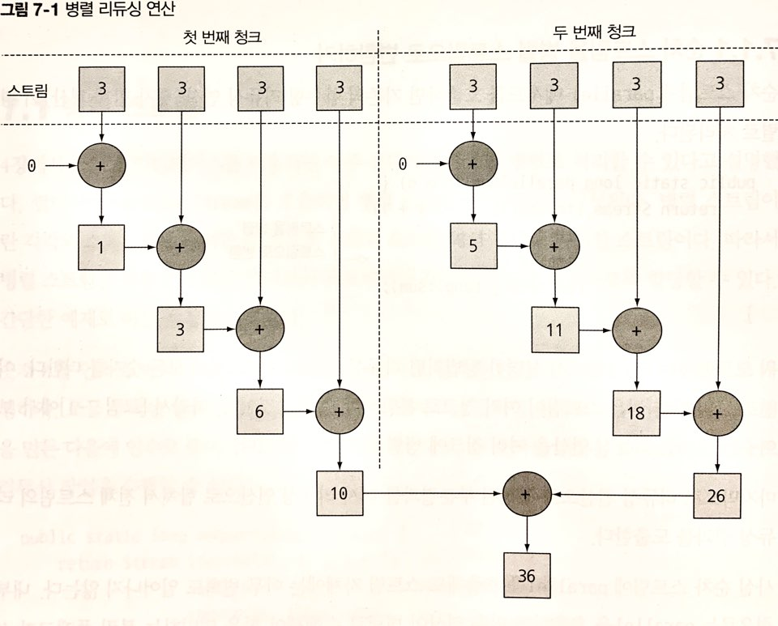
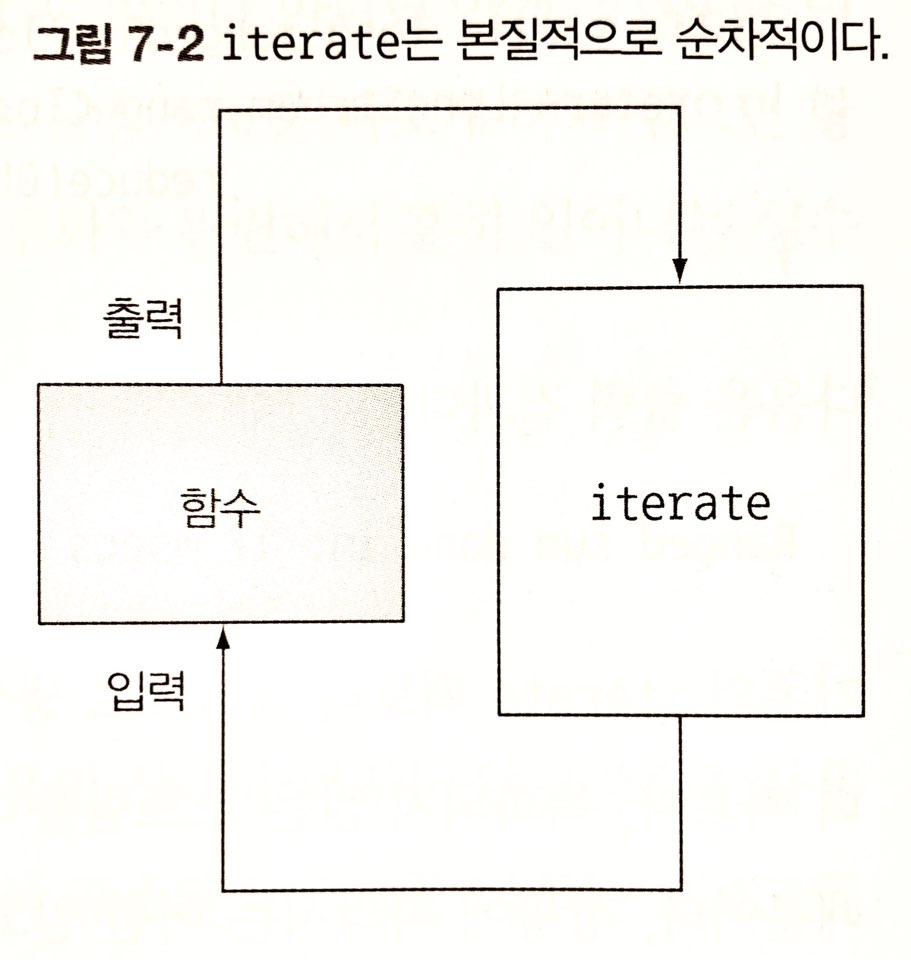
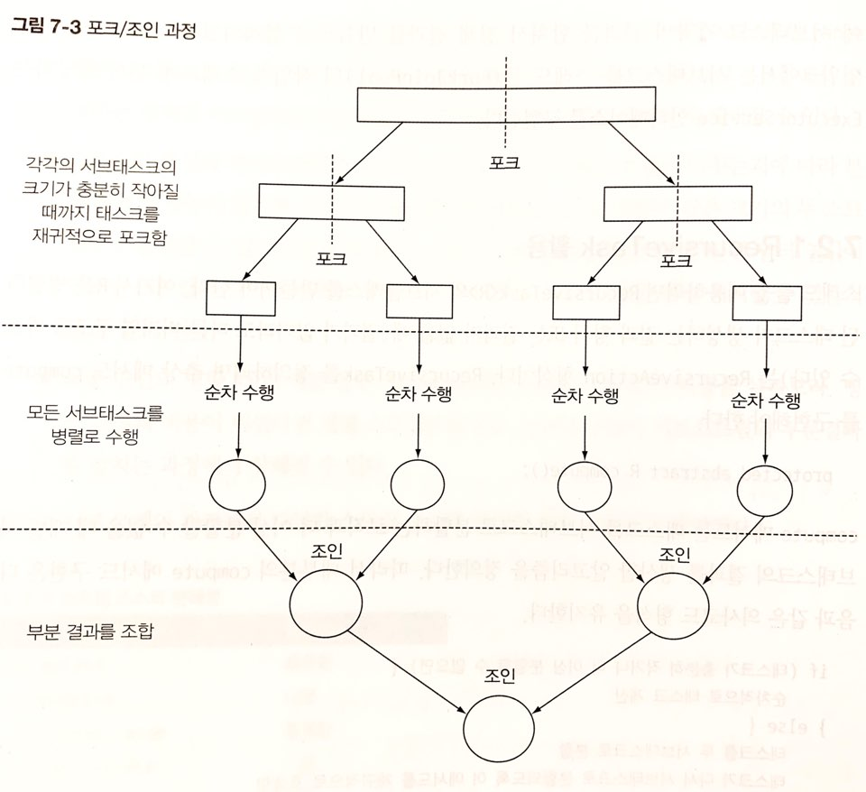
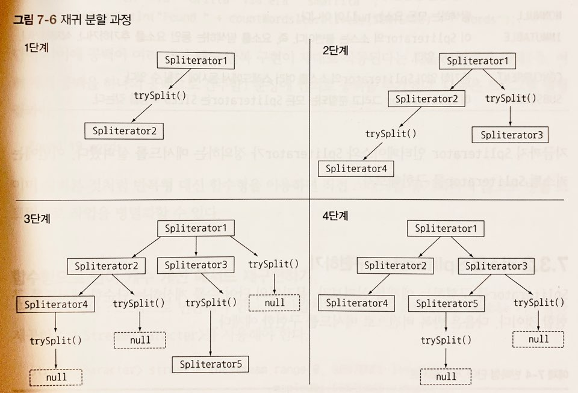

## 병렬 스트림
컬렉션에 parallelStream을 호출하면 `병렬 스트림`이 생성된다. 병렬 스트림이란, `각각의 스레드에서 처리할 수 있도록 스트림 요소를 여러 청크로 분할한 스트림`이다.<br>
따라서 병렬 스트림을 이용하면 모든 멀티코어 프로세서가 각각의 청크를 처리하도록 할당할 수 있다.
* 1부터 n부터까지의 합을 구하는 코드 : 일반 스트림

```java
public static long sequentialSum(long n) {
    return Stream.iterate(1L, i -> i + 1)   //  무한 자연수 스트림 생성
                 .limit(n)                  //  n개 이하로 제한
                 .reduce(0L, Long::sum);    //  모든 숫자를 더하는 스트림 리듀싱 연산
}
```

* 1부터 n부터까지의 합을 구하는 코드 : 전통적인 자바 코드

```java
public static long iterativeSum(long n) {
    long result = 0;
    for (long i = 1L; i<= n; i++) {
        result += i;
    }
    return result;
}
```
### 순차 스트림을 병렬 스트림으로 변환하기
```java
public static long parallelSum(long n) {
    return Stream.iterate(1L, i -> i + 1)
                 .limit(n)
                 .parallel()                //  스트림을 병렬 스트림으로 변환
                 .reduce(0L, Long::sum);
}
```
parallel 메서드를 통해 스트림이 여러 청크로 분할되게 되고, 마지막 리듀싱 연산을 통해 생성된 부분 결과를 다시 리듀싱 연산으로 합쳐 전체 스트림의 리듀싱 결과를 도출한다.

parallel과 sequential 메서드를 통해 어떤 연산을 병렬로 실행할지, 순차로 실행할지 제어할 수 있다.
```java
stream.parallel()
      .filter(...)
      .sequential()
      .map(...)
      .parallel()
      .reduce();  
```
parallel과 sequential 두 메서드 중 `최종적으로 호출된 메서드가 전체 파이프라인에 영향을 미친다.` 위 코드는 parallel이 마지막 호출되었으므로 위 파이프라인은 병렬로 실행된다.


* 병렬 스트림에서 사용하는 thread pool 설정

병렬 스트림은 내부적으로 `ForkJoinPool`을 사용한다. 기본적으로 ForkJoinPool은 프로세서 수, 즉 Runtime.getRuntime().availableProcessors()가 반환하는 값에 상응하는 thread를 갖는다.

### 스트림 성능 측정
자신의 기기에서 지원하는 코어 수 등에 따라서 성능 속도는 달라질 수 있다.<br>
고전적인 for 루프는 저수준으로 동작하며 기본 값을 박싱하거나 언박싱할 필요가 없으므로 수행속도가 빠를 수 있다. 따라서 병렬 버전이 순차 버전보다 느리게 동작할 수 있다. 이유가 뭘까?
* iterate가 박싱된 객체를 생성하므로 이를 다시 언박싱하는 과정이 필요했다.
* iterate는 병렬로 실행될 수 있도록 독립적인 청크로 분할하기 어렵다.
    * iterate 연산은 이전 연산의 결과에 따라 다음 함수의 입력이 달라지기 때문에 청크로 분할이 어렵다. 

위와 같은 상황에서는 리듀싱 연산이 수행되지 않는다. 리듀싱 과정을 시작하는 시점에 전체 숫자 리스트가 준비되지 않았으므로 스트림을 병렬로 처리할 수 있도록 청크로 분할할 수가 없기 때문이다.<br>
iterate같은 경우는 스트림이 병렬로 처리되도록 지시했고 각각의 합계가 다른 thread에서 수행되었음에도 불구하고 순차처리 방식으로 처리되기 때문에 thread를 할당하는 오버헤드만 증가하게 될 뿐이다.<br>
따라서 iterate와 같은 병렬과는 거리가 먼 방식을 사용하면 오히려 프로그램의 성능이 더 나빠질 수도 있다.
#### 더 특화된 메서드 사용
LongStream.rangeClosed라는 메서드를 활용할 수 있다. 이는 iterate에 비해 아래와 같은 장점이 있다.
* 기본형 long을 직접 사용하므로 박싱과 언박싱 오버헤드가 사라진다.
    * 특화되지 않은 스트림을 처리할 때는 오토박싱/언박싱 등의 오버헤드를 수반하기 때문에 iterate 보다 처리 속도가 빠르다.
* 쉽게 청크로 분할할 수 있는 숫자 범위를 생산한다. 예를 들어, 1 ~ 20의 숫자 범위를 각각 1 ~ 5, 6 ~ 10, 11 ~ 15, 16 ~ 20 범위의 숫자로 분할할 수 있다.

LongStream.rangeClosed를 활용하면 실질적으로 리듀싱 연산이 병렬로 수행된다. 올바른 자료구조를 선택해야 병렬 실행도 최적의 성능을 발휘할 수 있다.
    
### 병렬 스트림의 올바른 사용법
공유된 상태를 바꾸는 알고리즘을 사용할 때 병렬 스트림을 사용하면 문제가 발생한다.
```java
public static long sideEffectSum(long n) {
    Accumulator accumulator = new Accumulator();
    LongStream.rangeClosed(1, n).forEach(accumulator::add);
    return accumulator.total;
}

public class Accumulator {
    public long total = 0;
    public void add(long value) { total += value; }
}
```
위 같은 코드는 본질적으로 순차 실행할 수 있도록 구현되어 있으므로 병렬로 실행하게 되면 올바른 값을 얻을 수 없게 된다. 여러 스레드에서 동시에 total += value 를 실행하면서 문제가 발생되기 때문이다.<br>
따라서 병렬 스트림과 병렬 계산에는 공유된 가변 상태를 피해야 한다.
### 병렬 스트림 효과적으로 사용하기
* 확신이 서지 않을 때는 직접 측정해서 사용하라.
    * 병렬 스트림이 순차 스트림보다 항상 성능이 좋은 것이 아니기 때문에 모를 때는 직접 성능 체크해보는 것이 정확하다.
* 박싱을 주의해서 사용하라.
    * 오토박싱/언박싱은 성능을 크게 저하시킬 수 있는 요소다. 기본형 특화 스트림(ex. IntStream, LongStream, DoubleStream)을 활용하여 박싱 동작을 피할 수 있다.
* 순차 스트림보다 병렬 스트림에서 성능이 떨어지는 연산이 있음을 주의하라.
    * limit이나 findFirst같이 요소의 순서에 의존하는 연산을 병렬 스트림에 활용하게 되면 비싼 비용을 치뤄야 한다.
* 스트림에서 수행하는 전체 파이프라인 연산 비용을 고려하라.
* 소량의 데이터에서는 병렬 스트림이 도움 되지 않는다.
    * 소량의 데이터를 처리하는 상황에서는 병렬화 과정에서 생기는 부가 비용을 상쇄할 수 있을 만큼의 이득을 얻지 못한다.
* 스트림을 구성하는 자료구조가 올바른지 확인하라.
    * 예를 들면, ArrayList가 LinkedList보다 효율적으로 분할할 수 있다. LinkedList는 분할하려면 모든 요소를 탐색해야 하지만 ArrayList는 요소를 탐색하지 않고도 리스트를 분할할 수 있다.
* 스트림의 특성과 파이프라인의 중간 연산이 스트림의 특성을 어떻게 바꾸는지에 따라 분해 과정의 성능이 달라질 수 있다.
    * 예를 들어, SIZED 스트림은 정확히 같은 크기의 두 스트림으로 분할되므로 효과적으로 스트림을 병렬처리 할 수 있으나 필터 연산은 스트림의 길이를 예측할 수 없으므로 효과적으로 병렬 처리 할 수 있을지 알 수 없게 된다.
* 최종 연산의 병합 과정(ex. Collector의 combiner 메서드) 비용을 살펴봐라.
    * 병합 과정의 비용이 비싸다면, 병렬 스트림으로 얻은 성능의 이익이 서브스트림의 부분 결과를 합치는 과정에서 상쇄될 수 있다.

* 스트림 소스와 분해성

<table>
  <thead>
    <tr>
      <th>소스</th>
      <th>분해성</th>
    </tr>
  </thead>
  <tbody>
    <tr>
      <td>ArrayList</td>
      <td>훌륭함</td>
    </tr>
    <tr>
      <td>LinkedList</td>
      <td>나쁨</td>
    </tr>
    <tr>
      <td>IntStream.range</td>
      <td>훌륭함</td>
    </tr>
    <tr>
      <td>Stream.iterate</td>
      <td>나쁨</td>
    </tr>
    <tr>
      <td>HashSet</td>
      <td>좋음</td>
    </tr>
    <tr>
      <td>TreeSet</td>
      <td>좋음</td>
    </tr>
  </tbody>
</table>

## 포크/조인 프레임워크
포크/조인 프레임워크는 병렬화할 수 있는 작업을 재귀적으로 작은 작업으로 분할한 다음에 서브태스크 각각의 결과를 합쳐서 전체 결과를 만들도록 설계되었다.<br>
포크/조인 프레임워크에서는 서브태스크를 스레드 풀(ForkJoinPool)의 작업자 스레드에 분산 할당하는 ExecutorService 인터페이스를 구현한다.
### RecursiveTask 활용
스레드 풀을 이용하려면 RecursiveTask<R>의 서브클래스를 만들어야 한다. 여기서 R은 병렬화된 태스크가 생성하는 결과 형식 또는 결과가 없을 때(결과가 없더라도 다른 비지역 구조를 바꿀수 있다)는 RecursiveAction 형식이다.<br>
RecursiveTask를 정의하려면 추상 메서드 compute를 구현해야 한다.
```java
protected abstract R compute();
```
compute 메서드는 태스크를 서브태스크로 분할하는 로직과 더 이상 분할할 수 없을 때 개별 서브태스크의 결과를 생산할 알고리즘을 정의한다.
* compute 메서드 의사코드

```java
if (태스크가 충분히 작거나 더 이상 분할할 수 없으면) {
    순차적으로 태스크 계산
} else {
    태스크를 두 서브태스크로 분할
    태스크가 다시 서브태스크로 분할되도록 이 메서드를 재귀적으로 호출함
    모든 서브태스크의 연산이 완료될 때까지 기다림
    각 서브태스크의 결과를 합침
}
```

이 알고리즘은 divide-and-conquer 알고리즘의 병렬화 버전이다.


### 포크/조인 프레임워크를 제대로 사용하는 방법
* join 메서드를 태스크에 호출하면 태스크가 생산하는 결과가 준비될 때 까지 호출자를 블록시킨다. 따라서 두 서브태스크가 모두 시작된 다음에 join을 호출해야 한다. 그렇지 않으면 각각의 서브태스크가 다른 태스크가 끝나길 기다리게 되면서 순차 알고리즘보다 느리고 복잡한 프로그램이 될 수 있다.
* RecursiveTask 내에서는 ForkJoinPool의 invoke 메서드 대신 compute나 fork 메서드를 호출한다. 순차 코드에서 병렬 계산을 시작할 때만 invoke를 사용한다.
* 두 서브태스크에서 메서드를 호출할 때는 fork와 compute를 각각 호출하는 것이 효율적이다. 그러면 두 서브태스크의 한 태스크에는 같은 스레드를 재사용할 수 있으므로 풀에서 불필요한 태스크를 할당하는 오버헤드를 피할 수 있다.
* 포크/조인 프레임워크를 이용하는 병렬 계산은 디버깅이 어렵다.
* 멀티코어에서 포크/조인 프레임워크를 사용하는 것이 순차처리보다 무조건 빠른 것은 아니다. `병렬 처리로 성능을 개선하려면 태스크를 여러 독립적인 서브태스크로 분할할 수 있어야 한다.`
### 작업 훔치기
생략
## Spliterator
Spliterator는 `분할할 수 있는 반복자`라는 의미다. Iterator 처럼 소스의 요소 탐색 기능을 제공하지만 병렬 작업에 특화돼있다.<br>
자바 8은 컬렉션 프레임워크에 포함된 모든 자료구조에 사용할 수 있는 디폴트 Spliterator 구현을 제공한다. 컬렉션은 spliterator라는 메서드를 제공하는 Spliterator 인터페이스를 구현한다.

```java
public interface Spliterator<T> {
    boolean tryAdvance(Consumer<? super T> action); //  Spliterator 의 요소를 하나씩 순차적으로 소비하면서 탐색해야 할 요소가 남아있으면 true를 반환(iterator 동작과 같다)
    Spliterator<T> trySplit();  //  Spliterator 의 일부 요소(자신이 반환한 요소)를 분할해서 두 번째 Spliterator를 생성하는 메서드
    long estimateSize();    //  탐색해야 할 요소 수 정보 제공 메서드
    int characteristics();
}
```
### 분할 과정

1단계 첫 번째 Spliterator에 trySplit을 호출하면 두 번째 Spliterator가 생성되고, trySplit의 결과가 null이 될 때 까지 이 과정을 반복한다. 4단계처럼 모든 trySplit의 결과가 null이면 재귀 분할 과정이 종료된다.
#### Spliterator의 특성
Spliterator의 characteristics 메서드는 Spliterator 자체의 특성 집합을 int 타입으로 반환한다.
* Spliterator 특성

<table>
  <thead>
    <tr>
      <th>특성</th>
      <th>의미</th>
    </tr>
  </thead>
  <tbody>
    <tr>
      <td>ORDERED</td>
      <td>리스트처럼 요소에 정해진 순서가 있으므로 Spliterator는 요소를 탐색하고 분할할 때 이 순서에 유의해야 한다.</td>
    </tr>
    <tr>
      <td>DISTINCT</td>
      <td>x, y 두 요소를 방문했을 때 x.equals(y)는 항상 false를 반환한다.</td>
    </tr>
    <tr>
      <td>SORTED</td>
      <td>탐색된 요소는 미리 정의된 정렬 순서를 따른다.</td>
    </tr>
    <tr>
      <td>SIZED</td>
      <td>크기가 알려진 소스(ex. Set)로 Spliterator를 생성했으므로 estimatedSize()는 정확한 값을 반환한다.</td>
    </tr>
    <tr>
      <td>NONNULL</td>
      <td>탐색하는 모든 요소는 null이 아니다</td>
    </tr>
    <tr>
      <td>IMMUTABLE</td>
      <td>이 Spliterator의 소스는 불변이다. 즉, 요소를 탐색하는 동안 요소를 추가, 삭제할 수 없다.</td>
    </tr>
    <tr>
      <td>CONCURRENT</td>
      <td>동기화 없이 Spliterator의 소스를 여러 스레드에서 동시에 고칠 수 있다.</td>
    </tr>
    <tr>
      <td>SUBSIZED</td>
      <td>이 Spliterator 그리고 분할되는 모든 Spliterator는 SIZED 특성을 갖는다.</td>
    </tr>
  </tbody>
</table>

### 커스텀 Spliterator 구현하기
생략
## 정리
* 내부 반복을 이용하여 다른 스레드를 이용하지 않고도 스트림을 병렬로 처리할 수 있다.
* 병렬 처리 성능이 무조건 빠른 것이 아니기 때문에 성능 측정을 해보는 것이 좋다.
* 병렬 스트림은 처리해야할 데이터가 아주 많거나 각 요소를 처리하는데 오랜 시간이 걸릴 때 성능을 높일 수 있다.
* 기본형 특화 스트림을 이용하는 것이 병렬 처리보다 더욱 성능을 높일 수 있는 방법이다.
* 포크/조인 프레임워크는 병렬화할 수 있는 태스크를 작은 태스크로 분할한 후, 분할된 태스크를 각각의 스레드로 실행하며 서브태스크 각각의 결과를 합쳐서 최종 결과를 생산한다.
* Spliterator는 탐색하려는 데이터를 포함하는 스트림을 어떻게 병렬화 할 것인지를 정의한다.

