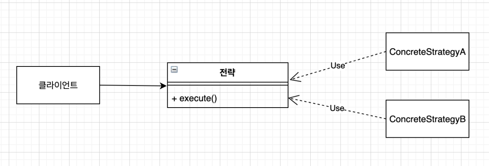
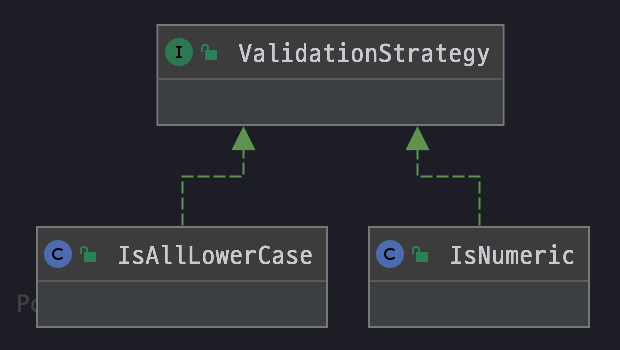
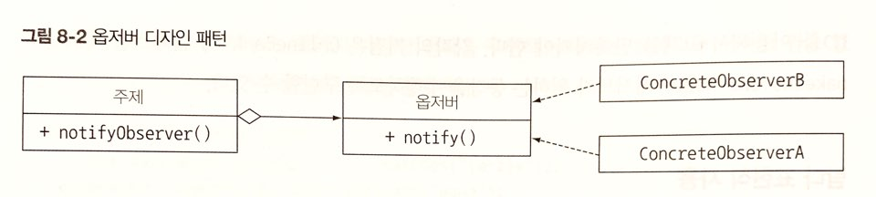
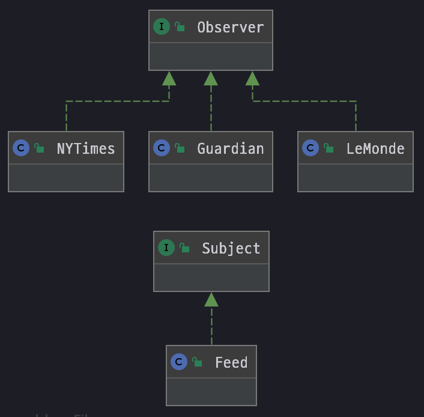
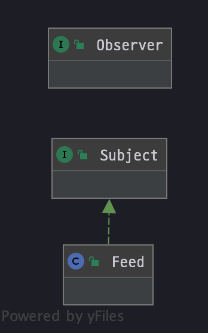
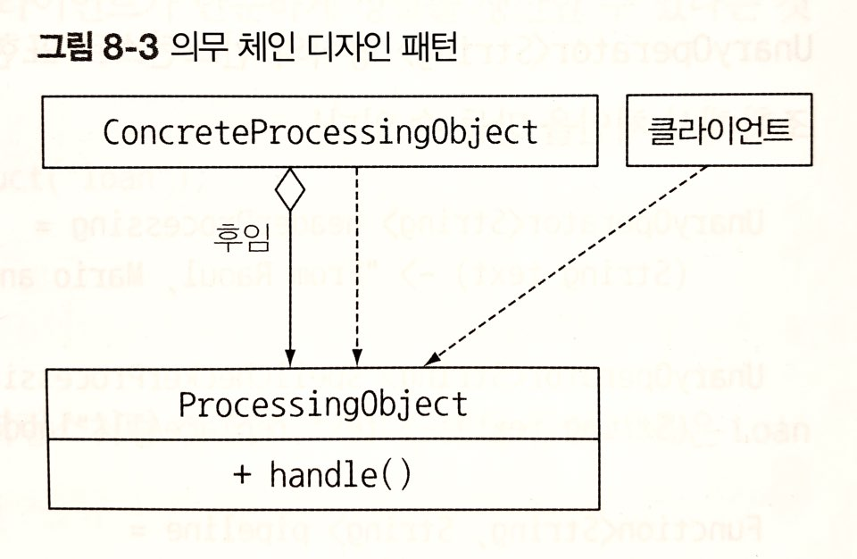
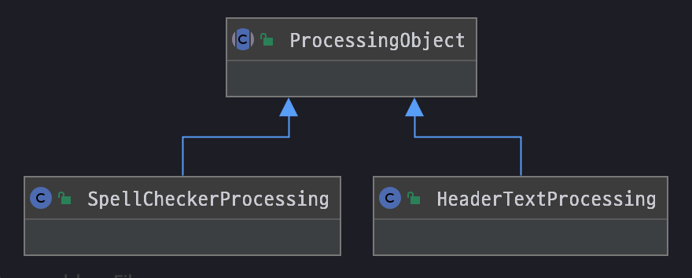

# 가독성과 유연성을 개선하는 리팩토링
람다, 메서드 레퍼런스  스트림 등의 기능을 활용하여 가독성 좋고 유연한 코드로 리팩토링하는 방법을 설명한다.
## 코드 가독성 개선
자바8에서는 다음과 같은 기능을 통해 코드 가독성을 높일 수 있다.
* 코드의 장황함을 줄여 쉽게 이해할 수 있는 코드를 구현한다.
* 메서드 레퍼런스와 스트림 API를 이용해서 코드의 의도(코드가 무엇을 수행하려는 것인지)를 쉽게 표현할 수 있다.

## 익명 클래스를 람다 표현식으로 리팩토링하기
익명 클래스는 코드를 장황하게 만들고 쉽게 에러를 일으킬 수 있기 때문에 람다 표현식을 사용하여 간결하고 가독성을 높인다.<br>
하지만 익명 클래스를 람다 표현식으로 변환하기 위한 조건이 몇 가지 있다.
### 익명 클래스에서 사용한 this와 super는 람다 표현식에서 다른 의미를 갖는다.
익명 클래스에서 this는 익명 클래스 자신을 가라키지만 람다에서 this는 람다를 감싸는 클래스를 가리킨다.
### 익명 클래스는 감싸고 있는 클래스의 변수를 가릴 수 있다.: shadow variable
하지만 람다 표현식으로는 변수를 가릴 수 없다.
 * ex.
 
```java
int a = 10;
Runnable r1 = () -> {
    int a = 2;          //  Variable 'a' is already defined in the scope(컴파일 에러 발생)
    System.out.println(a);
};
        
Runnable r2 = new Runnable() {
    @Override
    public void run() {
        int a = 2;      //  정상 동작!
        System.out.println(a);
    }
};
```
### 익명 클래스를 람다 표현식으로 바꾸면 컨텍스트 오버로딩에 따른 모호함이 초래될 수 있다.
익명 클래스는 인스턴스화할 때 명시적으로 형식이 정해지는 반면, 람다의 형식은 컨텍스트에 따라 달라지기 때문이다.

* ex.

```java
    public interface Task {
        public void execute();
    }

    private static void doSomething(Runnable r) {
        r.run();
    }

    private static void doSomething(Task a) {
        a.execute();
    }

    doSomething(new Task() {    //  익명 클래스 : 아무런 문제 없음
        @Override
        public void execute() {
            System.out.println("Danger danger!!");
        }
    });

    /* Ambiguous method call. Both doSomething (Runnable) in Main and doSomething (Task) in Main match
       아래와 같이 람다 표현식을 구현하면 위 두 함수 중 어느것을 구현한 것인지 알 수 없게 된다. 
    */
    doSomething(() -> System.out.println("Danger danger!!"));

    //  명시적 형변환 (Task)를 이용해 모호함을 제거할 수 있다.
    doSomething((Task) () -> System.out.println("Danger danger!!"));
```
## 람다 표현식을 메서드 레퍼런스로 리팩토링하기
람다 표현식도 간결한 코드지만 대신 메서드 레퍼런스를 활용하면 좀 더 가독성을 높일 수 있다.

* 람다 표현식

```java
Map<CaloricLevel, List<Dish>> dishesByCaloricLevel = 
    menu.stream()
        .collect(
            groupingBy(dish -> {
                if (dish.getCalories() <= 400)  return CaloricLevel.DIET;
                else if (dish.getCalories() <= 700) return CaloricLevel.NORMAL;
                else    return CaloricLevel.FAT;
            })
        );
```

* 메서드 레퍼런스

```java
Map<CaloricLevel, List<Dish>> dishesByCaloricLevel = 
    menu.stream().collect(groupingBy(Dish::getCaloricLevel));

//  Dish 클래스에 getCaloricLevel 메서드를 구현해야 한다.
public class Dish {
    ...
    public CaloricLevel getCaloricLevel() {
        if (dish.getCalories() <= 400)  return CaloricLevel.DIET;
        else if (dish.getCalories() <= 700) return CaloricLevel.NORMAL;
        else    return CaloricLevel.FAT;
    }
}
```
## 명령형 데이터 처리를 스트림으로 리팩토링하기
이론적으로는 반복자를 이용한 기존의 모든 컬렉션 처리 코드를 스트림 API로 바꿔야 한다. 스트림 API는 데이터 처리 파이프라인의 의도를 명확히 보여주기 때문이다. 또한 강력한 최적화와 멀티코어 아키텍처를 활용할 수 있게 해준다.<br>

* 기존 명령형 코드

```java
List<String> dishNames = new ArrayList<>();
for(Dish dish : menu) {
    if(dish.getCalories() > 300) {
        dishNames.add(dish.getName());
    }
}
```

* 스트림 API 활용

```java
menu.parallelStream()
    .filter(d -> d.getCalories() > 300)
    .map(Dish::getName)
    .collect(toList());
```

스트림 API를 이용하면 문제를 더 직접적으로 기술할 수 있을 뿐만 아니라, 쉽게 병렬화 할 수 있다.
## 코드 유연성 개선
동작 파라미터화 구현을 위해 람다 표현식을 이용한다.
### 함수형 인터페이스 적용
람다 표현식을 이용하기 위해서는 함수형 인터페이스가 필요하다. 조건부 연기 실행과 실행 어라운드 패턴으로 람다 표현식 리팩토링을 살펴본다.
### 조건부 연기 실행

* 개선 전 코드

```java
if (logger.isLoggable(Log.FINER)) {
    logger.finer("Problem: " + generateDiagnostic());
}
```

위 코드는 아래와 같은 문제가 있다.

* logger의 상태가 isLoggable이라는 메서드에 의해 클라이언트 코드로 노출된다.
* 메시지를 로깅할 때마다 logger 객체의 상태를 매번 확인하게 되면서 코드가 난잡해진다.

* 개선 중 코드

```java
logger.log(Level.FINER, "Problem: " + generateDiagnostic());
```
한층 개선하긴 했지만 인수로 전달된 메시지 수준에서 logger가 활성화되어 있지 않더라도 항상 로깅 메시지를 평가하게 된다.

* 람다를 활용하여 개선된 코드

```java
logger.log(Level.FINER, () -> "Problem: " + generateDiagnostic());
```
특정 조건(logger 수준을 FINER로 설정)에서만 메시지가 생성될 수 있도록 메시지 생성 과정을 연기해야 한다. Supplier를 인수로 갖는 오버로드된 log메소드를 제공함으로써 logger 문제를 해결한다.<br>
logger의 수준이 적절하게 설정되어 있을 때만 인수로 넘겨진 람다를 내부적으로 실행하는 코드다.

* log 메서드의 내부 구현 코드

```java
public void log(Level level, Supplier<String> msgSupplier) {
    if (logger.isLoggable(level)) {
        log(level, msgSupplier.get());  //  람다 실행
    } 
}
```

이 기법으로 아래와 같은 문제를 해결해볼 수 있다.

* 클라이언트 코드에서 객체 상태를 자주 확인하는 경우
* 객체의 일부 메서드를 호출하는 상황
    * 내부적으로 객체의 상태를 확인한 후 메서드를 호출(람다나 메서드 레퍼런스를 인수로 사용)하도록 새로운 메서드를 구현

### 실행 어라운드
매번 같은 준비, 종료 과정을 반복적으로 수행하는 코드는 실행 어라운드 패턴을 통해 람다로 변환할 수 있다.

```java
        String oneLine = processFile((BufferedReader b) -> b.readLine());
        String twoLine = processFile((BufferedReader b) -> b.readLine() + b.readLine());

    public static String processFile(BufferedReaderProcessor p) throws IOException {
        try (BufferedReader br = new BufferedReader(new FileReader("java8inaction/chan8/data.txt"))) {
            return p.process(br);
        }
    }

    public interface BufferedReaderProcessor {
        String process(BufferedReader b) throws IOException;
    }
```
람다로 BufferedReader 객체의 동작을 결정할 수 있는 것은 함수형 인터페이스 BufferedReaderProcessor 덕분이다.
# 람다로 객체지향 디자인 패턴 리팩토링하기
디자인패턴에 람다 표현식이 더해지면 색다른 기능을 발휘할 수 있다.
## 전략
전략 패턴은 한 유형의 알고리즘을 보유한 상태에서 런타임에 적절한 알고리즘을 선택하는 기법이다.<br>
전략 패턴은 세 부분으로 구성된다.

* 알고리즘을 나타내는 인터페이스(Strategry 인터페이스)
* 다양한 알고리즘을 나타내는 한 개 이상의 인터페이스 구현(ConcreteStrategyA, ConcreteStrategyB 같은 구체적인 구현 클래스)
* 전략 객체를 사용하는 한 개 이상의 클라이언트



* ex.



```java
public interface ValidationStrategy {
    boolean execute(String s);
}

public class IsAllLowerCase implements ValidationStrategy {
    @Override
    public boolean execute(String s) {
        return s.matches("[a-z]+");
    }
}

public class IsNumeric implements ValidationStrategy {
    @Override
    public boolean execute(String s) {
        return s.matches("\\d+");
    }
}

public class Validator {
    private final ValidationStrategy strategy;

    public Validator(ValidationStrategy strategy) {
        this.strategy = strategy;
    }

    public boolean validate(String s) {
        return strategy.execute(s);
    }
}

    public static void main(String[] args) {
        Validator numericValidator = new Validator(new IsNumeric());
        boolean b1 = numericValidator.validate("aaaa");
        System.out.println(b1);

        Validator lowerCaseValidator = new Validator(new IsAllLowerCase());
        boolean b2 = lowerCaseValidator.validate("bbbb");
        System.out.println(b2);
    }
```

* result

```text
false
true
```

위 코드는 소문자 or 숫자로 이뤄져야 하는 등 텍스트 입력이 다양한 조건에 맞게 포맷되어 있는지 검증하는 코드다.

### 람다 표현식 사용

```java
    public static void main(String[] args) {
//        Validator numericValidator = new Validator(new IsNumeric());
        Validator numericValidator = new Validator((String s) -> s.matches("[a-z]+"));
        boolean b1 = numericValidator.validate("aaaa");
        System.out.println(b1);

//        Validator lowerCaseValidator = new Validator(new IsAllLowerCase());
        Validator lowerCaseValidator = new Validator((String s) -> s.matches("\\d+"));
        boolean b2 = lowerCaseValidator.validate("bbbb");
        System.out.println(b2);
    }
```
람다 표현식을 활용하여 전략 패턴에서 발생하는 자잘한 코드를 제거할 수 있다.<br>
람다 표현식은 코드 조각(또는 전략)을 캡슐화한다. 즉, 람다 표현식으로 전략 패턴을 대신할 수 있다.
### 템플릿 메서드
템플릿 메서드는 알고리즘의 개요를 제시한 다음에 `알고리즘의 일부를 고칠 수 있는 유연함을 제공해야 할 때` 사용된다. 즉, `이 알고리즘을 사용하고 싶은데 그대로는 안되고 조금 수정해야 하는 상황에 적합`하다.<br>

* ex.

```java
public abstract class OnlineBanking {
    public void processCustomer(int id) {
        Customer c = Database.getCustomerWithId(id);
        makeCustomerHappy(c);
    }

    abstract void makerCustomerHappy(Customer c);
}
```
### 람다 표현식 사용
```java
public void processCustomer(int id, Consumer<Customer> makeCustomerHappy) {
    Customer c = Database.getCustomerWithId(id);
    makeCustomerHappy.accept(c);
}

new OnlineBankingLambda().processCustomer(1337, (Customer c) -> System.out.println("Hello " + c.getName()));
```
## 옵저버
옵저버 패턴은 어떤 이벤트가 발생했을 때, 한 객체(subject)가 다른 객체 리스트(observer)에 자동으로 알림을 보내야 하는 상황에 사용된다.


* ex.



```java
public interface Observer {
    void notify(String tweet);
}

public class NYTimes implements Observer {
    @Override
    public void notify(String tweet) {
        if (tweet != null && tweet.contains("money")) {
            System.out.println("Breaking new in NY! " + tweet);
        }
    }
}

public class Guardian implements Observer {
    @Override
    public void notify(String tweet) {
        if (tweet != null && tweet.contains("queen")) {
            System.out.println("Yet another news in London... " + tweet);
        }
    }
}

public class LeMonde implements Observer {
    @Override
    public void notify(String tweet) {
        if (tweet != null && tweet.contains("wine")) {
            System.out.println("Today cheese, wine and news! " + tweet);
        }
    }
}

public interface Subject {
    void registerObserver(Observer o);
    void notifyObservers(String tweet);
}

public class Feed implements Subject {
    private final List<Observer> observers = new ArrayList<>();

    @Override
    public void registerObserver(Observer o) {
        this.observers.add(o);
    }

    @Override
    public void notifyObservers(String tweet) {
        observers.forEach(o -> o.notify(tweet));
    }
}

    public static void main(String[] args) {

        Feed f = new Feed();
        f.registerObserver(new NYTimes());
        f.registerObserver(new Guardian());
        f.registerObserver(new LeMonde());

        f.notifyObservers("The queen said her favourite book is Java 8 in Action!");
    }
```

* result

```text
Yet another news in London... The queen said her favourite book is Java 8 in Action!
```
### 람다 표현식 사용하기

```java
    public static void main(String[] args) {

        Feed f = new Feed();
        f.registerObserver((String tweet) -> {
            if (tweet != null && tweet.contains("money")) {
                System.out.println("Breaking new in NY! " + tweet);
            }
        });
        f.registerObserver((String tweet) -> {
            if (tweet != null && tweet.contains("queen")) {
                System.out.println("Yet another news in London... " + tweet);
            }
        });
        f.registerObserver((String tweet) -> {
            if (tweet != null && tweet.contains("wine")) {
                System.out.println("Today cheese, wine and news! " + tweet);
            }
        });

        f.notifyObservers("The queen said her favourite book is Java 8 in Action!");
    }
```

기존 3개의 옵저버를 명시적으로 인스턴스화 하지 않고 람다 표현식을 직접 전달해서 실행할 동작을 지정한다.
## 의무 체인
의무 체인 패턴은 작업처리 객체의 체인(동작 체인 등)을 만들 때는 의무 체인 패턴을 사용한다.<br>
한 객체가 어떤 작업을 처리한 다음에 다른 객체로 결과를 전달하고, 다른 객체도 해야 할 작업을 처리한 다음에 또 다른 객체로 전달하는 방식이다.<br>
일반적으로 다음으로 처리할 객체 정보를 유지하는 필드를 포함하는 작업 처리 추상 클래스로 의무 체인 패턴을 구성한다. 작업 처리 객체가 자신의 작업을 끝냈으면 다음 작업처리 객체로 결과를 전달한다.



* ex.



```java
public abstract class ProcessingObject<T> {
    protected ProcessingObject<T> successor;

    public void setSuccessor(ProcessingObject<T> successor) {
        this.successor = successor;
    }

    public T handle(T input) {
        T r = handleWork(input);
        if (successor != null) {
            return successor.handle(r);
        }
        return r;
    }

    abstract protected T handleWork(T input);
}

public class HeaderTextProcessing extends ProcessingObject<String> {
    @Override
    protected String handleWork(String input) {
        return "From Raoul, Mario and Alan: " + input;
    }
}

public class SpellCheckerProcessing extends ProcessingObject<String> {
    @Override
    protected String handleWork(String input) {
        return input.replaceAll("labda", "lambda");
    }
}

    public static void main(String[] args) {

        ProcessingObject<String> p1 = new HeaderTextProcessing();
        ProcessingObject<String> p2 = new SpellCheckerProcessing();

        p1.setSuccessor(p2);

        String result = p1.handle("Aren't labdas really sexy?!!!");
        System.out.println(result);
    }
```

* result

```text
From Raoul, Mario and Alan: Aren't lambdas really sexy?!!!
```
### 람다 표현식 사용
작업처리 객체는 Function<String, String>, 즉 UnaryOperator<String> 형식의 인스턴스로 표현할 수 있다. `andThen 메서드로 이들 함수를 조합해서 체인을 만들 수 있다.`
```java
    public static void main(String[] args) {

        UnaryOperator<String> headerTextProcessing = (String input) -> "From Raoul, Mario and Alan: " + input;
        UnaryOperator<String> spellCheckerProcessing = (String input) -> input.replaceAll("labda", "lambda");

        Function<String, String> pipeline = headerTextProcessing.andThen(spellCheckerProcessing);

        String result = pipeline.apply("Aren't labdas really sexy?!!!");
        System.out.println(result);
    }
```

> 위처럼 람다 표현식을 활용함으로써 처음에 구현했던 ProcessingObject, HeaderTextProcessing, SpellCheckerProcessing 클래스는 생성할 필요가 없어진다.

## 팩토리
팩토리 패턴은 인스턴스화 로직을 클라이언트에 노출하지 않고 객체를 만들 때 사용한다.

* ex.

```java
public class ProductFactory {
    public static Product createProduct(String name) {
        switch (name) {
            case "loan":
                return new Loan();
            case "stock":
                return new Stock();
            case "bond":
                return new Bond();
            default:
                throw new RuntimeException("No such product " + name);
        }
    }
}
```

### 람다 표현식

* 생성자도 메서드 레퍼런스처럼 접근할 수 있다.

```java
Supplier<Product> loanSupplier = Loan::new;
Loan loan = loanSupplier.get();
```

* 상품명을 생성자로 연결하는 Map을 만들어서 코드를 재구현할 수 있다.

```java
final static Map<String, Supplier<Product>> map = new HashMap<>();
static {
    map.put("loan", Loan::new);
    map.put("stock", Stock::new);
    map.put("bond", Bond::new);
}
```

* Map을 이용해서 팩토리 패턴에서 했던 것처럼 다양한 상품을 인스턴스화할 수 있다.

```java
public static Product createProduct(String name) {
    Supplier<Product> p = map.get(name);
    if(p != null) return p.get();
    throw new IllegalArgumentException("No such product " + name);
}
```

하지만, 팩토리 메서드 createProduct가 상품 생성자로 여러 인수를 전달하는 상황에서는 이 기법을 적용하기 어렵다. 단순한 Supplier 함수형 인터페이스로는 이 문제를 해결할 수 없다.<br>
아래와 같이 3개의 인수를 받는 상품 생성자가 있다고 가정하면, TriFunction이라는 특별한 함수형 인터페이스를 만들어야 한다.
```java
public interface TriFunction<T, U, V, R> {
    R apply(T t, U u, V v);
}
Map<String, TriFunction<Integer, Integer, String, Product>> map = new HashMap<>();
```

결국 위 처럼 Map의 시그니처가 복잡해진다.
# 람다 테스팅
## 람다를 사용하는 메서드의 동작에 집중하라
람다의 목표는 `정해진 동작을 다른 메서드에서 사용할 수 있도록 하나의 조각으로 캡슐화하는 것`이다. 그러기 위해서는 세부 구현을 포함하는 람다 표현식을 공개하지 말아야 한다. 람다 표현식을 사용하는 메서드의 동작을 테스트함으로써 람다를 공개하지 않으면서도 람다 표현식을 검증할 수 있다.
## 복잡한 람다를 개별 메서드로 분할하기
테스트 코드에서는 람다 표현식을 참조할 수 없다. 이 때 해결책으로는 `람다 표현식을 메서드 레퍼런스로 변경`하는 것이다.
## 고차원 함수 테스팅
함수를 인수로 받거나 다른 함수를 반환하는 메서드(이를 고차원 함수라고 한다)는 좀 더 사용하기 어렵다. 메서드가 람다를 인수로 받는다면 다른 람다로 메서드의 동작을 테스트할 수 있다.
# 디버깅
람다 표현식과 스트림은 기존의 디버깅 기법을 무력화한다.
## 스택 트레이스 확인

### 람다와 스택 트레이스
## 정보 로깅
# 요약