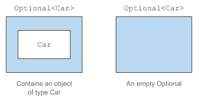

# 값이 없는 상황을 어떻게 처리할까?
* Person/Car/Insurance 데이터 모델

```java
public class Person {
    private Car car;

    public Car getCar() {
        return car;
    }
}

public class Car {
    private Insurance insurance;

    public Insurance getInsurance() {
        return insurance;
    }
}

public class Insurance {
    private String name;

    public String getName() {
        return name;
    }
}
```
## 보수적인 자세로 NullPointerException 줄이기
일반적으로 개발자는 NPE를 피하기 위해 아래 코드와 같이 다양한 null 확인 코드를 추가해서 NPE 문제를 해결하려할 것이다.

* null 안전 시도 1: 깊은 의심

```java
    private static String getCarInsuranceName(Person person) {
        if (person != null) {
            Car car = person.getCar();
            if (car != null) {
                Insurance insurance = car.getInsurance();
                if (insurance != null) {
                    return insurance.getName();
                }
            }
        }
        return "Unknown";
    }
``` 

모든 변수가 null인지 의심하게 되므로 변수를 접근할 때 마다 중첩된 if가 추가되면서 코드 들여쓰기 수준이 증가한다.<br>
이와 같은 반복 패턴(recurring pattern) 코드를 `깊은 의심(deep doubt)`이라고 부른다. 이렇게 반복되는 코드가 늘어나게 되면 코드의 구조도 엉망이 되고 가독성도 떨어지게 된다.

* null 안전 시도 2: 너무 많은 출구

```java
    private static String getCarInsuranceName1(Person person) {
        if (person == null) {
            return "Unknown";
        }
        Car car = person.getCar();
        if (car == null) {
            return "Unknown";
        }
        Insurance insurance = car.getInsurance();
        if (insurance == null) {
            return "Unknown";
        }
        return insurance.getName();
    }
```

null 확인 코드마다 출구가 생기면서 유지보수가 어려워진다. 게다가 null일 때 반환되는 기본값 "Unknown"이 반복되면서 오타 등의 실수가 발생될 여지도 있다.<br>

null로 값이 없다는 사실을 표현하는 것은 좋은 방법이 아니다.
## null 때문에 발생하는 문제
자바에서 null 레퍼런스를 사용하면서 발생할 수 있는 이론적, 실용적 문제를 확인해보자.
### 에러의 근원이다.
NullPointerException은 자바에서 가장 흔히 발생하는 에러다.
### 코드를 어지럽힌다.
때로는 중첩된 null 확인 코드를 추가해야 하므로 null 때문에 코드 가독성이 떨어진다.
### 아무 의미가 없다.
null은 아무 의미도 표헌하지 않는다. 특히 정적인 형식 언어에서 값이 없음을 표현하는 방법으로는 적절하지 않다.
### 자바 철학에 위배된다.
자바는 개발자로부터 모든 포인터를 숨겼다. 하지만 예외가 있는게 그것이 바로 null 포인터다.
### 형식 시스템에 구멍을 만든다.
null은 무형식이며 정보를 포함하고 있지 않으므로 모든 레퍼런스 형식에 null을 할당할 수 있다. 이런 식으로 null이 할당되기 시작하면서 시스템의 다른 부분으로 null이 퍼졌을 때 애초에 null이 어떤 의미로 사용되었는지 알 수 없게 된다.
## 다른 언어는 null 대신 무얼 사용하나?
### Groovy
안전 내비게이션 연산자(safe navigation operator) ?. 를 도입해서 null 문제를 해결한다.

```java
def carInsuanceName = person?.car?.insurance?.name
```

### 하스켈
선택형값(optional value)을 저장할 수 있는 Maybe라는 형식을 제공한다. Maybe는 주어진 형식의 값을 갖거나 아니면 아무 값도 갖지 않을 수 있다. 따라서 null 레퍼런스 개념은 자연스럽게 사라진다.
### 스칼라
Option[T]라는 구조를 제공하여 T 형식의 값을 갖거나 아무 값도 갖지 않을 수 있다.

자바 8에서는 다른 언어에서 사용되던 `선택형값`개념의 영향을 받아 `java.util.Optional<T>`라는 새로운 클래스를 제공한다.
# Optional 클래스 소개
Optional은 선택형값을 캡슐화하는 클래스다. 

값이 있으면 Optional 클래스는 값을 감싼다. 반면 값이 없으면 Optional.empty 메서드로 Optional을 반환한다. Optional.empty는 Optional의 특별한 싱글 인스턴스를 반환하는 정적 팩토리메서드다.

> #### null 레퍼런스 vs Optional.empty()
> null 레퍼런스는 참조할 때 NullPointerException이 발생하지만 Optional.empty()는 Optional 객체이므로 이를 다양한 방식으로 활용이 가능하다.

* Optional로 Person/Car/Insurance 데이터 모델 재정의

```java
public class Person {
    private Optional<Car> car;  //  사람이 차를 소유했을 수도, 소유하지 않았을 수도 있으므로    
                                //  Optional로 정의한다.
    public Optional<Car> getCar() {
        return car;
    }
}

public class Car {
    private Optional<Insurance> insurance;

    public Optional<Insurance> getInsurance() {
        return insurance;
    }
}

public class Insurance {
    private String name;

    public String getName() {
        return name;
    }
}
```

Optional 클래스를 사용하면서 모델의 의미가 더 명확해졌음을 확인할 수 있다. 사람이 차를 소유했을 수도, 안했을 수도 있고 자동차는 보험에 가입되어 있을 수도, 아닐 수도 있음을 명확히 드러내게 된다.<br>
반면에 보험회사는 Optional<String>이 아닌 String 형식으로 선언돼있는데 이는 반드시 이름을 가져야 함을 나타낸다. 그렇다고 보험회사 이름이 null인지 확인하는 코드를 추가할 필요는 없다. 오히려 고쳐야 할 문제를 감추는 꼴이기 때문이다.<br>
`보험회사는 반드시 이름을 가져야 하며, 이름이 없는 보험회사가 있다면 예외를 처리하는 코드를 추가하는 것이 아닌, 보험회사 이름이 없는 이유를 밝혀 문제를 해결해야 한다.`

또한 모든 null 레퍼런스를 Optional로 대치하는 것은 바람직하지 않다. Optional의 역할은 더 이해하기 쉬운 API를 설계하도록 돕는 것이다. 즉, 메서드의 시그니처만 보고도 선택형값인지 여부를 구별할 수 있어야 하는데 Optional이 등장하면 이를 언랩해서 값이 없을 수도 있는 상황에 적절하게 대응하도록 강제하는 효과가 있다.

# Optional 적용 패턴
실제 Optional 활용 방법을 알아보자.
## Optional 객체 만들기
### 빈 Optional
```java
Optional<Car> optCar = Optional.empty();
```
### null이 아닌 값으로 Optional 만들기
다른 정적 메서드인 Optional.of로 null이 아닌 값을 포함하는 Optional을 만들 수 있다.
```java
Optional<Car> optCar = Optional.of(car);
```
이렇게 되면, 이제 car가 null일떄 NPE가 발생한다. Optional을 사용하지 않았더라면 car의 프로퍼티에 접근하려 할 때 에러가 발생할 것이다.
### null값으로 Optional 만들기
Optional.ofNullable로 null값을 저장할 수 있는 Optional을 만들 수 있다.
```java
Optional<Car> optCar = Optional.ofNullable(car);
```
car가 null이면 빈 Optional 객체가 반환된다.<br>
그런데, get 메서드를 통해 Optional의 값을 가져올 수 있는데 Optional이 비어있으면 get을 호출했을 때 null을 사용했을 때와 같은 예외가 발생하게 된다. 따라서 먼저 Optional로 명시적인 검사를 제거할 수 있는 방법을 살펴봐야 한다.
## 맵으로 Optional의 값을 추출하고 변환하기
일반적으로 에러를 피하기 위해 정보에 접근하기 전에 null 체크를 통해 해당 값이 null인지 확인해야 한다.
```java
String name = null;
if (insurance != null) {
    name = insurance.getName();
}
```

이런 유형을 Optional은 map 메서드를 통해 체크할 수 있다.
```java
Optional<Insurance> optInsurance = Optional.ofNullable(insurance);
Optional<String> name = optInsurance.map(Insurance::getName);
```
Optional의 map 메서드는 스트림의 map 메서드와 개념이 비슷하다. 

stream의 map처럼 optional에서는 최대 요소의 개수를 1개 이하인 데이터 컬렉션으로 생각하여 Optinal이 값을 포함하면 map의 인수로 제공된 함수가 값을 바꾼다. Optional이 비어있으면 아무 일도 일어나지 않는다.
## flatMap으로 Optional 객체 연결
flatMap은 여러 메서드를 안전하게 호출할 수 있게 해준다. 

* Optional 적용 전 코드

```java
public String getCarInsuranceName(Person person) {
    return person.getCar().getInsurance().getName();
}
```

* Optional 적용 후 코드

```java
Optional<Person> optPerson = Optional.of(person);
Optional<String> name = optPerson.map(Person::getCar)
                                 .map(Car::getInsurance)
                                 .map(Insurance::getName);
```
기존 map이라면 위와 같이 구현하면 될까 싶지만 컴파일 되지 않는다. map 연산의 결과는 Optional<Optional<Car>> 형식의 객체인데 getInsurance는 또 다른 Optional 객체를 반환하므로 getInsurance 메서드를 지원하지 않기 때문이다. 중첩된 Optional 객체 구조를 보여준다.<br>
이 문제를 해결하기 위해서는 `flatMap`메서드를 활용하면 된다. 

* Optional.flatMap 적용

```java
public String getCarInsuranceName(Optional<Person> person) {
    return person.flatMap(Person::getCar)
                 .flatMap(Car::getInsurance)
                 .map(Insurance::getName)
                 .orElse("Unknown");
}
```

위에서 본 바와 같이 중첩된 Optional이 생성되는 것을 flatMap 연산으로 Optional을 평준화한다.<br>

> 평준화 과정이란, 이론적으로 두 Optional을 합치는 기능을 수행하면서 둘 중 하나라도 null이면 빈 Optional을 생성하는 연산이다.

평준화 과정을 통해 flatMap을 빈 Optional에 호출하면 아무 일도 일어나지 않고 그대로 반환된다. 반면 Optional이 Person을 감싸고 있다면 flatMap에 전달된 Function이 Person에 적용된다. Function을 적용한 결과가 이미 Optional이므로 flatMap 메서드는 결과를 그대로 반환할 수 있다.<br>
호출 체인 중 어떤 메서드가 빈 Optional을 반환한다면 전체 결과로 빈 Optional을 반환하고 아니면 보험회사의 이름을 포함하는 Optional을 반환한다.<br>
이제 반환된 Optional을 읽을 때는 호출 체인의 결과로 Optional<String> 이 반환되는데 여기에 값이 비어 있다면 orElse메서드를 사용하여 디폴트 값을 제공하거나 Optional을 언랩하는 다양한 메서드를 사용하면 된다.

> ### 도메인 모델에서 Optional 사응 시 직렬화할 수 없는 이유
> Optional 클래스는 필드 형식으로 사용할 것을 가정하지 않았으므로 Serializable 인터페이스를 구현하지 않는다. 따라서 도메인 모델에 Optional을 사용한다면 직렬화에 문제가 생길 수 있다.<br>
> 도메인 모델에서 Optional을 사용하려면 아래 처럼 Optional로 값을 반환받을 수 있는 get 메서드를 추가하는 방식이 좋다.
> ```java
> public class Person {
>   private Car car;
>   public Optional<Car> getCarAsOptional() {
>       return Optional.ofNullable(car);
>   }
> }  
> ```
 
## 디폴트 액션과 Optional 언랩
Optional 클래스는 Optional 인스턴스에서 값을 읽을 수 있는 다양한 인스턴스 메서드를 제공한다.

<table>
  <thead>
    <tr>
      <th>Optional 인스턴스 메서드</th>
      <th>설명</th>
      <th>예제 코드</th>
    </tr>
  </thead>
  <tbody>
    <tr>
      <td>get()</td>
      <td>값을 읽는 가장 간단하면서 가장 안전하지 않은 메서드<br>get은 래핑된 값이 있으면 반환하지만 없으면 NoSuchElementException을 발생시킨다.</td>
      <td>godoMallKeyOptional.get().isPersonalMall()</td>
    </tr>
    <tr>
      <td>orElse(T other)</td>
      <td>Optional이 값을 포함하지 않을 때 디폴트 값을 제공할 수 있다.</td>
      <td>Optional.ofNullable(stockNosMap.get(option.getMallOptionNo())).orElse(0)</td>
    </tr>
    <tr>
      <td>orElseGet(Supplier< ? extends T > other</td>
      <td>orElse 메서드에 대응하는 게으른 버전의 메서드<br>Optional에 값이 없을 때만 Supplier가 실행되기 때문.<br>디폴트 메서드를 만드는데 시간이 걸리거나 Optional이 비어있을 때만 디폴트 값을 생성하고 싶을 때 사용해야 한다.</td>
      <td>Optional.ofNullable(field.getAnnotation(XssFilterTarget.class))
                  .orElseGet(() -> field.getDeclaringClass().getAnnotation(XssFilterTarget.class));</td>
    </tr>
    <tr>
      <td>orElseThrow(Supplier< ? extends X > exceptionSupplier)</td>
      <td>Optional이 비어있을 때 예외를 발생시킨다는 점에서 get메서드와 비슷하지만, 발생시킬 예외를 선택할 수 있다.</td>
      <td>Optional.ofNullable(mallConfigurationService.getMallConfiguration(mallNo,ReadyshopConfig.class)).orElseThrow(NCPNotFoundException::new);</td>
     </tr>
     <tr>
      <td>ifPresent(Consumer< ? super T > consumer)</td>
      <td>값이 존재할 때 인수로 넘겨준 동작을 실행할 수 있다. 값이 없으면 아무 일도 일어나지 않는다.</td>
      <td>Optional.ofNullable(changeReason).ifPresent(standingPointContract::setChangeReason);</td>
     </tr>
  </tbody>
</table>

## 두 Optional 합치기

* isPresent 활용

```java
public Optional<Insurance> nullSafeFindCheapestInsurace(Optional<Person> person, Optional<Car> car){
    if (person.isPresent() && car.isPresent()){
        return Optional.of(findCheapestInsurance(person.get(), car.get()));
    }else{
        return Optional.empty();
    }
}
```
person과 car의 시그니처만으로 둘 다 아무 값도 반환하지 않을 수 있다는 정보를 명시적으로 보여주는 장점이 있지만, 구현 코드자체는 null 확인 코드와 크게 다를 바가 없다.

* flatMap 활용하여 Optional 언랩하지 않고 한 줄로 재구현

```java
public Optional<Insurance> nullSafeFindCheapestInsurance(Optional<Person> person, Optional<Car> car) {
    return person.flatMap(p -> car.map(c -> findCheapestInsurance(p, c)));
```

## 필터로 특정값 거르기

* Optional 적용 전

```java
Insurance insurance = ...;
if (insurance != null && "CambridgeInsurance".equals(insurance.getName()) {
    System.out.println("ok");
}
```

* Optional 적용 후

```java
Optional<Insurance> optInsurance = ...;
optInsurance.filter(insurance -> "CambridgeInsurance".equals(insurance.getName()))
            .ifPresent(x -> System.out.println("ok"));
```
Optional이 비어있다면 filter 연산은 아무 동작도 하지 않는다. Optional에 값이 있으면 그 값에 predicate를 적용한다.<br>
predicate 적용 결과가 true면 Optional에는 아무 변화도 없지만, false면 값ㅇ느 사라져버리고 Optional은 빈 상태가 된다.

* Optional 클래스이 메서드

<table>
  <thead>
    <tr>
      <th>Optional 인스턴스 메서드</th>
      <th>설명</th>
      <th>예제 코드</th>
    </tr>
  </thead>
  <tbody>
    <tr>
      <td>empty()</td>
      <td>빈 인스턴스를 반환</td>
      <td>Optional.empty()</td>
    </tr>
    <tr>
      <td>filter()</td>
      <td>값이 존재하며 predicate와 일치하면 값을 포함하는 Optional을 반환하고, 값이 없거나 predicate와 일치하지 않으면 빈 Optional을 반환함.</td>
      <td></td>
    </tr>
    <tr>
      <td>flatMap()</td>
      <td>값이 존재하면 인수로 제공된 함수를 적용한 결과 Optional을 반환하고, 값이 없으면 빈 Optional을 반환함.</td>
      <td></td>
    </tr>
    <tr>
      <td>get()</td>
      <td>값이 존재하면 `Optional이 감싸고 있는 값`을 반환하고, 값이 없으면 NoSuchElementException이 발생함.</td>
      <td></td>
     </tr>
     <tr>
      <td>ifPresent()</td>
      <td>값이 존재하면 지정된 Consumer를 실행하고, 값이 없으면 아무 일도 일어나지 않음.</td>
      <td></td>
     </tr>
     <tr>
      <td>isPresent()</td>
      <td>값이 존재하면 true를 반환하고, 값이 없으면 false를 반환함.</td>
      <td>Optional< String > merchantId = naverpayOrderService.getMerchantId(mallNo);<br>
          if (!merchantId.isPresent()) { return; }<br>
      </td>
     </tr>
     <tr>
      <td>map()</td>
      <td>값이 존재하면 제공된 매핑 함수를 적용함.</td>
      <td></td>
     </tr>
     <tr>
      <td>of()</td>
      <td>값이 존재하면 값을 감싸는 Optional을 반환하고, 값이 null이면 NullPointerException을 발생함.</td>
      <td></td>
     </tr>
     <tr>
      <td>ofNullable()</td>
      <td>값이 존재하면 값을 감싸는 Optional을 반환하고, 값이 null이면 빈 Optional을 반환함.</td>
      <td></td>
     </tr>
     <tr>
      <td>orElse()</td>
      <td>값이 존재하면 값을 반환하고, 값이 없으면 디폴트 값을 반환함.</td>
      <td></td>
     </tr>
     <tr>
      <td>orElseGet()</td>
      <td>값이 존재하면 값을 반환하고, 값이 없으면 Supplier에서 제공하는 값을 반환함.</td>
      <td></td>
     </tr>
     <tr>
      <td>orElseThrow()</td>
      <td>값이 존재하면 값을 반환하고, 값이 없으면 Supplier에서 생성한 예외를 발생함.</td>
      <td></td>
     </tr>
  </tbody>
</table>

# Optional을 사용한 실용 예제
## 잠재적으로 null이 될 수 있는 대상을 Optional로 감싸기
잠재적으로 null일 수 있는 값은 Optional로 감싸거나 Optional.ofNullable을 이용하여 개선할 수 있다.
## 예외와 Optional
### 기본형 Optional과 이를 사용하지 말아야 하는 이유
스트림처럼 Optional도 기본형으로 특화된 `OptionalInt/Long/Double` 등의 클래스를 제공한다. 이전 장에서 설명했다시피 보통 기본형 특화 스트림을 이용하면 성능을 향상시킬 수 있으나, `Optional의 최대 요소 수는 한 개이므로 Optional에서는 기본형 특화 클래스로 성능을 개선할 수 없다.`<br>
또한 기본형 특화 Optional은 map, flatMap, filter 등을 지원하지 않으므로 기본형 특화 Optional을 사용하는 것을 권장하지 않는다. 뿐만 아니라, 기본형 특화 Optional로 생성한 결과와 일반 Optional과 혼용할 수도 없다.
# 요약
* 역사적으로 프로그래밍 언어에서는 null 레퍼런스로 값이 없는 상황을 표현해왔다.
* 자바 8에서는 값이 있거나 없음을 표현할 수 있는 클래스 java.util.Optional<T> 를 제공한다.
* 팩토리 메서드 Optional.empty, Optional.of, Optional.ofNullable 등을 이용해서 Optional 객체를 만들 수 있다.
* Optional 클래스는 스트림과 비슷한 연산을 수행하는 map, flatMap, filter 등의 메서드를 제공한다.
* Optional로 값이 없는 상황을 적절하게 처리하도록 강제할 수 있다. 즉, Optional로 예상치 못한 null 예외를 방지할 수 있다.
* Optional을 활용하면 더 좋은 API를 설계할 수 있다. 즉, 사용자는 메서드의 시그니처만 보고도 Optional값이 사용되거나 반환되는지 예측할 수 있다.