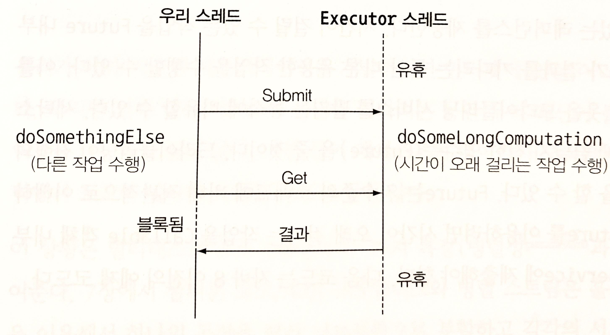
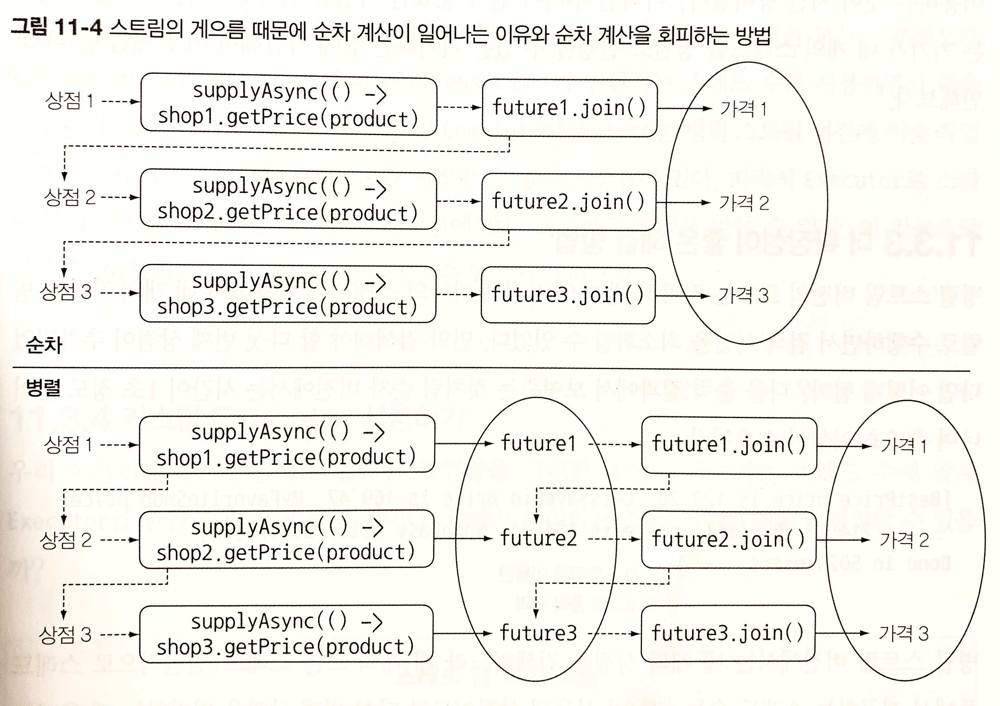
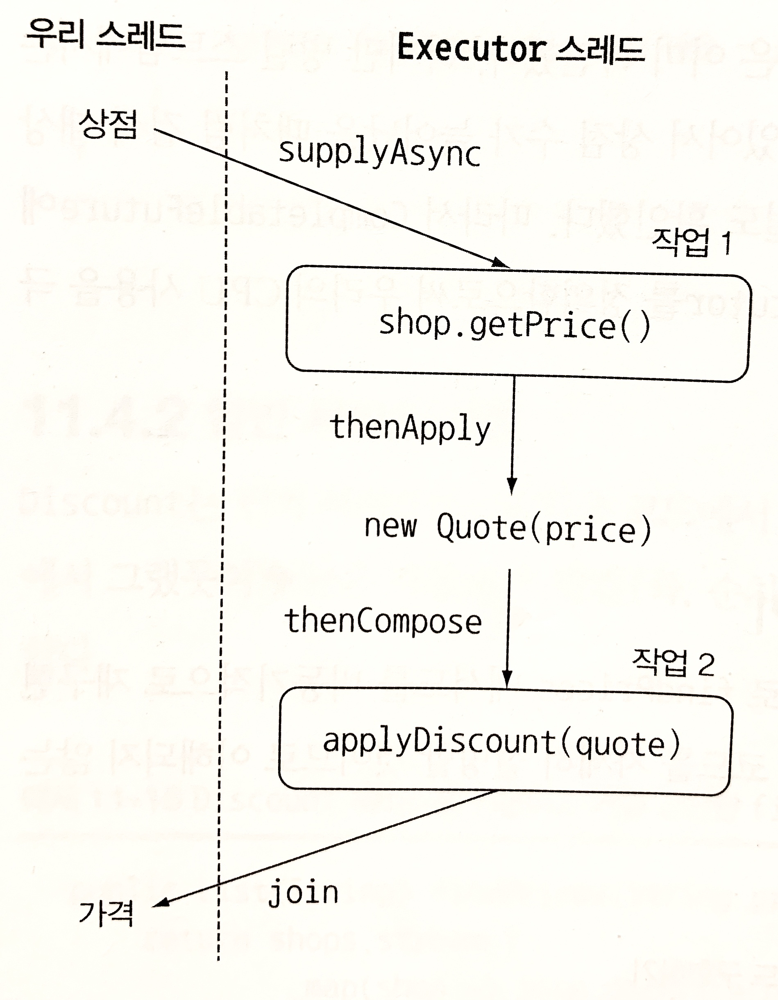
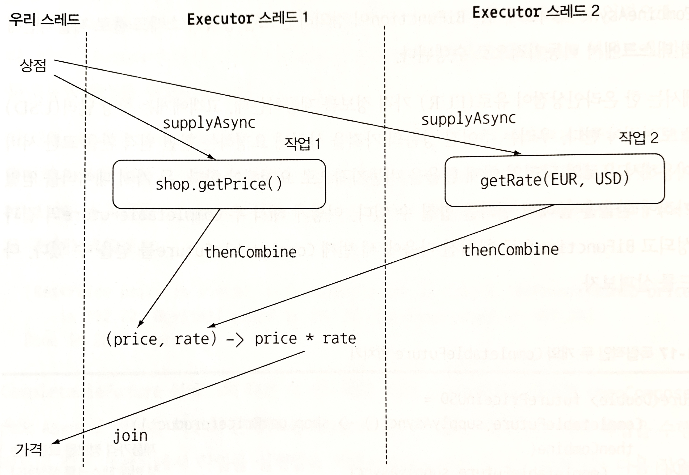

Future 인터페이스와 Future를 구현하는 새로운 클래스 CompletableFuture를 이용해서 병렬성이 아닌 동시성을 이용해야 하는 상황, 즉 하나의 CPU 사용을 가장 극대화할 수 있도록 느슨하게 연관된 여러 작업을 수행해야 하는 상황이라면 원격 서비스 결과를 기다리거나, 데이터베이스 결과를 기다리면서 스레드를 블록하는 상황을 해결할 수 있다.
# Future
Future 인터페이스는 자바 5부터 제공되어 미래의 어느 시점에 결과를 얻는 모델에 활용할 수 있는 기능이다.<br>
비동기 계산을 모델링하는 데 Future를 이용할 수 있으며, Future는 계산이 끝났을 때 결과에 접근할 수 있는 레퍼런스를 제공한다.<br>
시간이 걸릴 수 있는 작업을 Future 내부로 설정하면 호출자 스레드가 결과를 기다리는 동안 다른 유용한 작업을 수행할 수 있다.<br>
Future는 저수준의 스레드에 비해 직관적으로 이해하기 쉽다는 장점이 있다.<br>
Future를 이용하려면 시간이 오래 걸리는 작업을 Callable 객체 내부로 감싼 다음에 ExecutorService에 제출해야 한다.

* Future로 오래 걸리는 작업을 비동기적으로 실행하기

```java
ExecutorService executor = Executor.newCachedThreadPool();  //  스레드 풀에 태스크를 제출하려면 ExecutorService를 만들어야 한다.
Future<Double> future = executor.submit(new Callable<Double>() {    //  Callable을 ExecutorService로 제출한다.
    public Double call() {
        return doSomeLongComputation(); //  시간이 오래 걸리는 작업은 다른 스레드에서 비동기적으로 실행한다.
    }
});

doSomethingElse();  //  비동기 작업을 수행하는 동안 다른 작업을 한다.

try {
    Double result = future.get(1, TimeUnit.SECONDS);    //  비동기 작업의 결과를 가져온다. 결과가 준비되어 있지 않으면 호출 스레드가 블록된다. 하지만 최대 1초까지만 기다린다.
} catch (ExecutionException ee) {
    //  계산 중 예외 발생
} catch (InterruptedException ie) {
    //  현재 스레드에서 대기 중 인터럽트 발생
} catch (TimeoutException te) {
    //  Future가 완료되기 전에 타임아웃 발생
}
```

ExecutorService에서 제공하는 스레드가 시간이 오래 걸리는 작업을 처리하는 동안 우리 스레드로 다른 작업을 동시에 실행할 수 있다.<br>
다른 작업을 처리하다가 시간이 오래 걸리는 작업의 결과가 필요한 시점이 되었을 때 Future의 get 메서드로 결과를 가져올 수 있다. get 메서드를 호출했을 때 이미 계산이 완료되어 결과가 준비되었다면 즉시 결과를 반환하지만 결과가 준비되지 않았다면 작업이 완료될 때까지 우리 스레드를 블록시킨다.

이같은 방식의 문제점은 `오래 걸리는 작업이 영원히 끝나지 않는다면` 문제가 발생할 수 있다. 작업이 끝나지 않는 문제가 있을 수 있으므로, get 메서드를 오버로드해서 우리 스레드가 대기할 최대 타임아웃 시간을 설정하는 것이 좋다.
## Future 제한
Future 인터페이스가 갖고 있는 메서드들 만으로는 간결한 동시 실행 코드를 구현하기 충분치 않다. 따라서 아래와 같은 선언형 기능이 필요하다.

* 두 개의 비동기 계산 결과를 하나로 합친다. 두 가지 계산 결과는 서로 독립적일 수 있으며 또는 두 번째 결과가 첫 번째 결과에 의존하는 상황일 수 있다.
* Future 집합이 실행하는 모든 태스크의 완료를 기다린다.
* Future 집합에서 가장 빨리 완료되는 태스크를 기다렸다가 결과를 얻는다.(ex. 여러 태스크가 다양한 방식으로 같은 결과를 구하는 상황)
* 프로그램적으로 Future를 완료시킨다.(즉, 비동기 동작에 수동으로 결과 제공)
* Future 완료 동작에 반응한다.(즉, 결과를 기다리면서 블록되지 않고 결과가 준비되었다는 알림을 받은 다음에 Future의 결과로 원하는 추가 동작을 수행할 수 있음.)

따라서 자바 8에서 제공하는 CompletableFuture 클래스(Future 인터페이스를 구현한 클래스)를 활용하면 위에서 설명한 기능을 선언형으로 이용할 수 있게 해준다.<br>
Stream과 CompletableFuture는 비슷한 패턴, 즉 람다 표현식과 파이프라이닝을 활용한다. 따라서 Future와 CompletableFuture의 관계를 Collection과 Stream의 관계에 비유할 수 있다.  
## CompletableFuture로 비동기 애플리케이션 만들기

* 고객에게 비동기 API를 제공하는 방법을 배운다(온라인상점을 운영하고 있는 독자에게 유용한 기술)
* 동기 API를 사용해야 할 때 코드를 비블록으로 만드는 방법을 배운다. 두 개의 비동기 동작을 파이프라인으로 만드는 방법과 두 개의 동작 결과를 하나의 비동기 계산으로 합치는 방법을 살펴본다.
* 비동기 동작의 완료에 대응하는 방법을 배운다.(ex. 모든 상점에서 가격 정보를 얻을 때까지 기다리는 것이 아닌 각 상점에서 가격 정보를 얻을 때마다 즉시 최저가격을 찾는 애플리케이션을 갱신하는 방법을 설명한다. 그렇지 않으면 서버가 다운되는 등 문제가 발생했을 때 사용자에게 검은 화면만 보여주게 될 수 있다.)

> #### 동기 API와 비동기 API
> `동기 API`에서는 메서드를 호출한 다음에 메서드가 계산을 완료할 때까지 기다렸다가 메서드가 반환되면 호출자는 반환된 값으로 계속 다른 동작을 수행한다. 호출자와 피호출자가 각각 다른 스레드에서 실행되는 상황이었더라도 호출자는 피호출자의 동작 완료를 기다렸을 것이다. 이처럼 동기 API를 사용하는 상황을 `블록 호출(blocking call)`이라고 한다.<br>
> 반면 `비동기 API`에서는 메서드가 즉시 반환되며 끝내지 못한 나머지 작업을 호출자 스레드와 동기적으로 실행될 수 있도록 다른 스레드에 할당한다. 이와 같은 상황은 `비블록 호출(non-blocking call)`이라고 한다. 다른 스레드에 할당된 나머지 계산 결과는 콜백 메서드를 호출해서 전달하거나 호출자가 '계산 결과가 끝날 때까지 기다림' 메서드를 추가로 호출하면서 전달된다. 주로 I/O 시스템 프로그래밍에서 이와 같은 방식으로 동작을 수행한다. 즉, 계산 동작을 수행하는 동안 비동기적으로 디스크 접근을 수행한다. 그리고 더 이상 수행할 동작이 없으면 디스크 블록이 메모리로 로딩될 때까지 기다린다.

# 비동기 API 구현
## 동기 메서드를 비동기 메서드로 변환

* 비동기 메서드 getPriceAsync 구현

```java
    public Future<Double> getPriceAsync(String product) {
        CompletableFuture<Double> futurePrice = new CompletableFuture<>();  //  계산 결과를 포함할 CompletableFuture를 생성
        new Thread(() -> {
            double price = calculatePrice(product); //  다른 스레드에서 비동기적으로 계산을 수행
            futurePrice.complete(price);    //  오랜 시간이 걸리는 계산이 완료되면 Future에 값을 설정
        }).start();
        return futurePrice; //  계산 결과가 완료되길 기다리지 않고 Future를 반환
    }
```

* 비동기 API 사용

```java
	    Shop shop = new Shop("BestShop");
	    long start = System.nanoTime();
        Future<Double> futurePrice = shop.getPriceAsync("my favorite product"); //  상점에 제품가격 정보 요청
        long invocationTime = ((System.nanoTime() - start) / 1_000_000);
        System.out.println("Invocation returned after " + invocationTime);

        doSomethingElse();
        try {
            double price = futurePrice.get();   //  가격 정보가 있으면 Future에서 가격 정보를 읽고, 가격 정보가 없으면 가격 정보를 받을 때까지 블록한다.
            System.out.printf("Price is %.2f%n", price);
        } catch (Exception e) {
            throw new RuntimeException(e);
        }

        long retrievalTime = ((System.nanoTime() - start) / 1_000_000);
        System.out.println("Price returned after " + retrievalTime + " msecs");
```

클라이언트는 특정 제품의 가격 정보를 상점에 요청 한다.<br>
상점은 비동기 API를 제공하므로 즉시 Future(영수증)를 반환한다. 클라이언트는 반환된 Future를 이용해서 `나중에 결과를 얻을 수 있다.`<br>
그 사이 클라이언트는 다른 상점에 가격 정보를 요청하는 등 첫 번째 상점의 결과를 기다리면서 대기하지 않고 다른 작업을 처리할 수 있다.<br>
나중에 클라이언트가 특별히 할 일이 없으면 Future의 get 메서드를 호출한다. 이 때 Future가 결과 값을 갖고 있다면 Future에 포함된 값을 읽거나 아니라면 `값이 계산될 때까지 블록`한다.

* 결과

```text
Invocation returned after 7
Price is 126.81
Price returned after 1057 msecs
```

가격 계산이 끝나기 전에 getPriceAsync가 반환된다.

## 에러 처리 방법
위에서 본 코드에는 문제가 없지만 가격을 계산하는 동안 에러가 발생할 수 있다.<br>
가격 계산에 에러가 발생한다면 해당 스레드에만 영향을 미치게 되고 즉, 에러가 발생해도 가격 계산은 계속 진행되기 때문에 일의 순서가 꼬이게 된다. 결과적으로 클라이언트는 get 메서드가 반환될 때까지 영원히 기다리게 될 수도 있다.<br>

클라이언트는 타임아웃값을 받는 get 메서드의 오버로드 버전을 만들어 이 문제를 해결할 수 있다. 이와 같이 블록 문제는 타임아웃을 활용하여 타임아웃 시간이 지나면 `TimeoutException`을 받을 수 있다.<br>
하지만, 이때 제품가격 계산에 왜 에러가 발생했는지 알 수 있는 방법이 없다. 따라서 completeExceptionally 메서드를 이용해서 CompletableFuture 내부에서 발생한 예외를 클라잉언트로 전달해야 한다.

* CompletableFuture 내부에서 발생한 에러 전파

```java
    public Future<Double> getPriceAsync(String product) {
        CompletableFuture<Double> futurePrice = new CompletableFuture<>();
        new Thread(() -> {
            try {
                double price = calculatePrice(product);
                futurePrice.complete(price);    //  계산이 정상적으로 종료되면 Future에 가격 정보를 저장한 채로 Future를 종료
            } catch (Exception ex) {
                futurePrice.completeExceptionally(ex);  //  도중에 문제가 발생하면 발생한 에러를 포함시켜 Future를 종료
            }
        }).start();
        return futurePrice;
    }
```

이제 클라이언트는 가격 계산 메서드에서 발생한 예외 파라미터를 포함하는 ExecutionException을 받게 된다.
### 팩토리 메서드 supplyAsync로 CompletableFuture 만들기
지금까지는 CompletableFuture를 직접 구현했지만 더 간단히 구현할 수 있다.

* 팩토리 메서드 supplyAsync로 CompletableFuture 만들기

```java
public Future<Double> getPriceAsync(String product) {
    return CompletableFuture.supplyAsync(() -> calculatePrice(product));
}
```

supplyAsync 메서드는 Supplier를 인수로 받아서 CompletableFuture를 반환한다.

* CompletableFuture 클래스 내 일반 supplyAsync 메서드와 오버로드 버전의 supplyAsync 메서드

```java
public class CompletableFuture<T> implements Future<T>, CompletionStage<T> {

    private static final Executor ASYNC_POOL;

    public static <U> CompletableFuture<U> supplyAsync(Supplier<U> supplier) {
        return asyncSupplyStage(ASYNC_POOL, supplier);
    }

    public static <U> CompletableFuture<U> supplyAsync(Supplier<U> supplier, Executor executor) {
        return asyncSupplyStage(screenExecutor(executor), supplier);
    }
}
```

CompletableFuture는 Supplier를 실행해서 비동기적으로 결과를 생성한다. ForkJoinPool의 Executor 중 하나가 Supplier를 실행한다.<br>
하지만 두 번째 인수를 받는 오버로드 버전의 supplyAsync 메서드를 이용해서 다른 Executor를 지정할 수도 있다.<br>
결국, 모든 다른 CompletableFuture의 팩토리 메서드에 Executor를 선택적으로 전달할 수 있다.

# 비블록 코드 만들기

* 순차적으로 정보를 요청하는 findPrices 메서드 구현

```java
    private static List<Shop> shops = Arrays.asList(new Shop("BestPrice"),
                                     new Shop("LetsSaveBig"),
                                     new Shop("MyFavoriteShop"),
                                     new Shop("BuyItAll"));

    public static List<String> findPrices(String product) {
        return shops.stream()
                    .map(shop -> String.format("%s price is %.2f", shop.getName(), shop.getPrice(product)))
                    .collect(Collectors.toList());
    }
```

* 결과

```text
[BestPrice price is 180.14, LetsSaveBig price is 208.68, MyFavoriteShop price is 193.84, BuyItAll price is 176.47]
Done in 4042 msecs
```

4개의 shops에서 가격을 검색할 동안 각각 1초의 delay()가 있기 때문에 전체 가격 검색 결과는 4초를 살짝 넘게된다.<br>
이제 이를 병렬 스트림을 통해 개선해본다.

## 병렬 스트림으로 요청 병렬화하기

* findPrices 메서드 병렬화

```java
    public static List<String> findPrices(String product) {
        return shops.parallelStream()
                    .map(shop -> String.format("%s price is %.2f", shop.getName(), shop.getPrice(product)))
                    .collect(Collectors.toList());
    }
```

* 결과

```text
[BestPrice price is 216.54, LetsSaveBig price is 212.58, MyFavoriteShop price is 172.98, BuyItAll price is 127.70]
Done in 1028 msecs
```
4개의 상점이 병렬로 검색되면서 1번의 delay()가 소요된 것처럼 1초가 살짝 넘는 결과가 나오게 된다.<br>
이를 CompletableFuture 기능을 활용하여 **findPrices 메서드의 동기 호출을 비동기 호출로 개선**해본다.

## CompletableFuture로 비동기 호출 구현하기

* CompletableFuture로 findPrices 구현

```java
    public static List<CompletableFuture<String>> completableFuturefindPrices(String product) {
        List<CompletableFuture<String>> priceFutures
            = shops.stream()
                   .map(shop -> CompletableFuture.supplyAsync(
                       () -> String.format("%s price is %.2f", shop.getName(), shop.getPrice(product))))
                   .collect(Collectors.toList());
        return priceFutures;
    }
```

* 결과

```text
[java.util.concurrent.CompletableFuture@b684286[Not completed], java.util.concurrent.CompletableFuture@880ec60[Not completed], java.util.concurrent.CompletableFuture@3f3afe78[Not completed], java.util.concurrent.CompletableFuture@7f63425a[Not completed]]
Done in 12 msecs
```

리스트의 CompletableFuture는 각각 계산 결과가 끝난 상점의 이름 문자열을 포함한다. 하지만 우리가 재구현하는 findPrices 메서드의 반환 형식은 List<String>이므로 모든 CompletableFuture의 동작이 완료되고 결과를 추출한 다음 리스트를 반환해야 한다.<br>
두 번째 map 연산을 List<CompletableFuture<String>>에 적용할 수 있다. CompletableFuture클래스에 join 메서드는 Future 인터페이스의 get 메서드와 같은 의미로, join을 호출하여 모든 동작이 끝나길 기다린다.<br>
다만 join은 아무 예외도 발생시키지 않는다. 따라서 try/catch로 감쌀 필요가 없다.

* CompletableFuture로 findPrices 재구현

```java
    public static List<String> completableFuturefindPrices(String product) {
        List<CompletableFuture<String>> priceFutures
            = shops.stream()
                   .map(shop -> CompletableFuture.supplyAsync(
                       () -> shop.getName() + " price is " + shop.getPrice(product)))
                   .collect(Collectors.toList());

        return priceFutures.stream()
            .map(CompletableFuture::join)
            .collect(Collectors.toList());
    }
```

* 결과

```text
[BestPrice price is 139.55682959276808, LetsSaveBig price is 159.9332914058537, MyFavoriteShop price is 135.62605596893522, BuyItAll price is 132.06995934518]
Done in 1059 msecs
```

두 map 연산을 하나의 스트림 처리 파이프라인으로 처리하지 않고, 두 개의 스트림 파이프라인으로 처리했다. 왜냐하면 스트림 연산은 게으른 특성이 있으므로 하나의 파이프라인으로 연산을 처리했다면 모든 가격 정보 요청 동작이 동기적, 순차적으로 이뤄지기 때문이다.<br>
즉, CompletableFuture로 각 상점의 정보를 요청할 때, 기존 요청 작업이 완료되어야 join이 결과를 반환하면서 다음 상점으로 정보를 요청할 수 있기 때문이다.


윗 부분은 순차 계산인 단일 파이프라인 스트림 처리과정이고, 아래는 CompletableFuture를 리스트로 모은 후 다른 작업과 독립적으로 각자의 작업을 수행하는 모습이다.<br>
결과는 만족할 수 없는 성능을 보여주고 있다.<br>
이러한 결과가 나오게 된 이유는 기기가 4개의 스레드를 병렬로 실행할 수 있는 기기라는 점이라는 것을 먼저 생각해 봐야 한다.

## 더 확장성이 좋은 해결 방법
위 병렬 스트림 버전에서는 4개의 상점을 검색하느라 4개의 모든 스레드가 사용된 상황이므로 **다섯 번째 상점을 처리하게 될 때** 추가로 1초 이상이 소요되게 된다. 즉, 4개의 스레드 중 어떠한 스레드가 먼저 작업이 완료되어야 다섯 번째 스레드가 동작될 수 있다.<br>
CompletableFuture 버전에서는 이러한 상황에서 성능의 효과를 볼 수 있다. CompletableFuture는 병렬 스트림 버전에 비해 작업에 이용할 수 있는 다양한 Executor를 지정할 수 있다는 장점이 있다.<br>
따라서 Executor로 스레드 풀의 크기를 조절하는 등 애플리케이션에 맞는 최적화된 설정을 만들 수 있다.  
## 커스텀 Executor 사용하기
우리가 작업하는 애플리케이션에 필요한 작업량을 고려한 풀에서 관리하는 스레드 수에 맞게 Executor를 만들 수 있다.

> #### 스레드 풀 크기 조절
> 스레드 풀이 너무 크면, CPU와 메모리 자원을 서로 경쟁하느라 시간을 낭비할 수 있다.<br>
> 스레드 풀이 너무 작다면, CPU의 일부 코어는 활용되지 않을 수 있다. 이 때, 다음과 같은 공식을 통해 대략적인 CPU 활용 비율을 계산할 수 있다.<br>
> `N(threads) = N(cpu) * U(cpu) * (1 + W/C)`<br>
> N(cpu) : Runtime.getRuntime().availableProcesstors()가 반환하는 코어 수
> U(cpu) : 0과 1 사이의 값을 갖는 CPU 활용 비율
> W/C : 대기시간과 계산시간의 비율

* 우리 애플리케이션에 맞는 커스텀 Executor

```java
    private final Executor executor = Executors.newFixedThreadPool(Math.min(shops.size(), 100), //  상점 수만큼의 스레드를 갖는 풀을 생성.(스레드 수의 범위는 0 ~ 100)
                                                                   new ThreadFactory() {

        @Override
        public Thread newThread(Runnable runnable) {
            Thread t = new Thread(runnable);
            t.setDaemon(true);      //  프로그램 종료를 방해하지 않는 데몬 스레드를 사용
            return t;
        }
    });
```

우리가 만드는 풀은 `데몬 스레드(daemon thread)`를 포함한다.<br>
자바에서 일반 스레드가 실행 중이면 자바 프로그램은 종료되지 않는다. 따라서 어떤 이벤트가 한없이 기다리면서 종료되지 않는 일반 스레드가 있다면 문제가 될 수 있다.<br>
반면 데몬 스레드는 자바 프로그램이 종료될 때 강제로 함께 종료될 수 있다.<br>
두 스레드의 성능은 같다. 이제 새로운 Executor를 팩토리 메서드 supplyAsync의 두 번째 인수로 전달할 수 있다.

* 위 CompletableFuture로 findPrices 재구현한 메서드에 커스텀 executor 적용 예시

```java
    public static List<String> completableFuturefindPrices(String product) {
        List<CompletableFuture<String>> priceFutures
            = shops.stream()
                   .map(shop -> CompletableFuture.supplyAsync(
                       () -> shop.getName() + " price is " + shop.getPrice(product), executor))
                   .collect(Collectors.toList());

        return priceFutures.stream()
            .map(CompletableFuture::join)
            .collect(Collectors.toList());
    }
```

4 ~ 5개 상점이 아닌 4~500개 되는 상점에서 비동기 동작을 많이 사용하는 상황이라면 위와 같이 CompletableFuture에 커스텀한 executor를 활용하는 방법이 가장 효과적인 방법이 될 수 있다.

> #### 스트림 병렬화와 CompletableFuture 병렬화
> 지금까지 컬렉션을 병렬화하는 방법 두 가지를 알아보았다.
> * 병렬 스트림으로 변환해서 컬렉션을 처리하는 방법
> * 컬렉션을 반복하면서 CompletableFuture 내부의 연산으로 만드는 방법
>
> 여기서 CompletableFuture를 이용하면 전체적인 계산이 블록되지 않도록 스레드 풀의 크기르 조절할 수 있다.<br>
> 다음을 참고하면 어떤 병렬화 기법을 사용해야할지 선택해야 할때 도움이 된다.
> * `I/O가 포함되지 않은 계산 중심의 동작`을 실행할 때는 `스트림 인터페이스`가 가장 구현하기 간단하며 효율적일 수 있다.(모든 스레드가 계산 작업을 수행하는 상황에서는 프로세서 코어 수 이상의 스레드를 가질 필요가 없다.)
> * 반면, 작업이 `I/O를 기다리는 작업을 병렬`로 실행할 때는 `CompletableFuture`가 더 많은 유연성을 제공하며 대기/계산(W/C)의 비율에 적합한 스레드 수를 설정할 수 있다. 특히, 스트림의 게으른 특성 때문에 스트림에서 I/O를 실제로 언제 처리할 지 예측하기 어려운 문제도 있다.

# 비동기 작업 파이프라인 만들기

* enum으로 할인 코드 정의

```java
package com.company;

import static com.company.Shop.delay;
import static java.lang.String.format;

public class Discount {
    public enum Code {
        NONE(0), SILVER(5), GOLD(10), PLATINUM(15), DIAMOND(20);

        private final int percentage;

        Code(int percentage) {
            this.percentage = percentage;
        }
    }

    public static String applyDiscount(Quote quote) {
        return quote.getShopName() + " price is " +
               Discount.apply(quote.getPrice(), //  기존 가격에 할인 코드를 적용
                              quote.getDiscountCode());
    }

    private static String apply(double price, Code code) {
        delay();    //  위에서 구현했던 응답 지연을 흉내냄
        return format(String.valueOf(price * (100 - code.percentage) / 100));
    }

}
```

## 할인 서비스 구현

* 문자열 파싱 구현

```java
package com.company;

public class Quote {
    private final String shopName;
    private final double price;
    private final Discount.Code discountCode;

    public Quote(String shopName, double price, Discount.Code discountCode) {
        this.shopName = shopName;
        this.price = price;
        this.discountCode = discountCode;
    }

    public static Quote parse(String s) {
        String [] split = s.split(":");
        String shopName = split[0];
        double price = Double.parseDouble(split[1]);
        Discount.Code discountCode = Discount.Code.valueOf(split[2]);
        return new Quote(shopName, price, discountCode);
    }

    public String getShopName() {
        return shopName;
    }

    public double getPrice() {
        return price;
    }

    public Discount.Code getDiscountCode() {
        return discountCode;
    }
}
```

## 할인 서비스 사용

* 순차적 동기 방식으로 findPrices 메서드 구현

```java
    public static List<String> findPrices(String product) {
        return shops.stream()
                    .map(shop -> shop.getPrice(product))    //  각 상점에서 할인 전 가격 얻기
                    .map(Quote::parse)                      //  상점에서 반환된 문자열을 Quote 객체로 변환
                    .map(Discount::applyDiscount)           //  Discount 서비스를 이용해서 각 Quote에 할인을 적용
                    .collect(Collectors.toList());
    }
```

* 결과

```text
[BestPrice price is 204.642, LetsSaveBig price is 189.7, MyFavoriteShop price is 115.13599999999998, BuyItAll price is 131.309, ShopEasy price is 166.472]
Done in 10078 msecs
```
역시 가격 정보 요청에 5초, 할인 서비스 적용에 5초 약 10초가 소요된다.<br>
병렬 스트림을 적용하면 성능은 쉽게 개선되겠지만, 스트림이 사용하는 스레드 풀의 크기가 고정되어 있어 상점 수가 늘어났을 때처럼 검색 대상이 확장되었을 때 유연하게 대응할 수 없다.<br>
따라서 다시한번 얘기하지만 CompletableFuture에서 수행하는 태스크를 설정할 수 있는 커스텀 Executor를 정의함으로써 CPU 사용을 극대화 할 수 있다.

## 동기 작업과 비동기 작업 조합하기

* CompletableFuture을 활용하여 비동기적으로 findPrices 재구현

```java
    public static List<String> completableFuturefindPrices(String product) {
        List<CompletableFuture<String>> priceFutures
            = shops.stream()
                   .map(shop -> CompletableFuture.supplyAsync(  //  각 상점에서 할인 전 가격을 비동기적으로 얻는다.
                       () -> shop.getPrice(product), executor))
                   .map(future -> future.thenApply(Quote::parse))   // 상점에서 반환한 문자열을 Quote 객체로 변환
                   .map(future -> future.thenCompose(quote ->   //  결과 Future를 다른 비동기 작업과 조합해서 할인 코드를 적용
                       CompletableFuture.supplyAsync(
                           () -> Discount.applyDiscount(quote), executor)))
                   .collect(Collectors.toList());

        return priceFutures.stream()
                           .map(CompletableFuture::join)    //  스트림의 모든 Future가 종료되길 기다렸다가 각각의 결과를 추출
                           .collect(Collectors.toList());
    }
```

* 결과

```text
[BestPrice price is 165.41400000000002, LetsSaveBig price is 127.8, MyFavoriteShop price is 172.9855, BuyItAll price is 196.95399999999998, ShopEasy price is 148.014]
Done in 2091 msecs
```



3개의 map연산을 적용하여 3개의 연산을 비동기로 실행한다.
### 가격 정보 얻기
첫 번째 연산은 팩토리 메서드 supplyAsync에 람다 표현식을 전달하여 비동기적으로 상점에서 가격 정보를 조회해온다.<br>
첫 번째 변환 결과는 `Stream<CompletableFuture<String>>`이다. 각 CompletableFuture는 작업이 끝났을 때 해당 상점에서 반환하는 문자열 정보를 포함한다. 그리고 커스텀 Executor로 CompletableFuture를 설정한다.
### Quote 파싱하기
두 번째 변환 과정에서는 첫 번째 결과 문자열을 Quote로 변환한다.<br>
파싱 과정에서는 원격 서비스나 I/O처리가 없으므로 원하는 즉시 지연없이 동작을 수행할 수 있다. 따라서 첫 번째 과정에서 생성된 CompletableFuture에 `thenApply 메서드`를 호출한 다음에 문자열을 Quote 인스턴스로 변환하는 `Function`으로 전달한다.<br>
thenApply 메서드는 CompletableFuture가 끝날 때까지 블록하지 않는다는 점을 주의해야 한다. 즉, CompletableFuture가 동작을 완전히 완료한 다음에 thenApply 메서드로 전달된 람다 표현식을 적용할 수 있다.<br>
따라서 CompletableFuture<String>을 CompletableFuture<Quote>로 변환할 것이다.
### CompletableFuture 조합하여 할인된 가격 계산하기
세 번째 연산에서는 원격 실행이 포함되므로 이전 두 변환과 다르며 동기적으로 작업을 수행해야 한다.(여기서는 1초의 지연(delay())으로 원격 실행을 흉내낸다.)<br>
람다 표현식으로 이 동작을 팩토리 메서드 supplyAsync에 전달할 수 있다. 그러면 다른 CompletableFuture가 반환된다. 결국 두 가지 CompletableFuture로 이뤄진 연쇄적으로 수행되는 두 개의 비동기 동작을 만들 수 있다.
* 문자열 Quote 변환 작업
* 변환된 Quote를 Discount 서비스로 전달하여 할인된 최종가격 획득 작업

자바 8의 CompletableFuture API는 이 두 비동기 연산을 하나의 파이프라인으로 만들 수 있도록 `thenCompose 메서드`를 제공한다. `thenCompose 메서드는 첫 번째 연산의 결과를 두 번째 연산으로 전달`한다.<br>
즉, 첫 번째 CompletableFuture에 thenCompose 메서드를 호출하고 Function에 넘겨주는 식으로 두 CompletableFuture를 조합할 수 있다. Function은 첫 번째 CompletableFuture 반환 결과를 인수로 받고 두 번째 CompletableFuture를 반환하는데, 두 번째 CompletableFuture는 첫 번째 CompletableFuture의 결과를 계산의 입력으로 사용한다.<br>
따라서 Future가 여러 상점에서 Quote를 얻는 동안 메인 스레드는 UI 이벤트에 반응하는 등 유용한 작업을 수행할 수 있다.<br>

3개의 map 연산 결과 스트림의 요소를 리스트로 수집하면 List<CompletableFuture<String>> 형식의 자료를 얻을 수 있다.<br>
마지막으로 CompletableFuture가 완료되기를 기다렸다가 join으로 값을 추출할 수 있다.<br>

thenCompose 메서드도 다른 CompletableFuture 클래스의 메서드들과 같이 Aysnc로 끝나는 버전이 존재하는데, `Async로 끝나지 않는 메서드`는 `이전 작업을 수행한 스레드와 같은 스레드에서 작업을 실행함`을 의미하며(동기) `Async로 끝나는 메서드`는 `다음 작업이 다른 스레드에서 실행되도록 스레드 풀로 작업을 제출`한다.<br>
위에서는 두 번째 CompletableFuture의 결과는 첫 번째 CompletableFuture에 의존하므로 두 CompletableFuture를 하나로 조합하든 Async버전으로 분리하든 최종 결과나 성능에 영향을 미치지 않는다. 따라서 스레드 전환 오버헤드가 적고 효율성이 더 좋은 thenCompose를 사용하였다. 
## 독립 CompletableFuture와 비독립 CompletableFuture 합치기
위에서 봤던 것 처럼 첫 번째 CompletableFuture에 thenCompose 메서드를 실행하여 첫 번째 실행 결과 값을 받은 후 두 번째 CompletableFuture로 전달해야 하는 상황이 아닌, 첫 번째 CompletableFuture의 동작 완료와 관계없이 두 번째 CompletableFuture를 실행해야 할 때 `thenCombine 메서드`를 사용한다.<br>
`thenCombine 메서드`는 BiFunction을 두 번째 인수로 받는다. BiFunction은 두 개의 CompletableFuture 결과를 어떻게 합칠지 정의한다. thenCompose와 마찬가지로 thenCombine도 Async 버전이 존재한다. thenCombineAsync 메서드에서는 BiFunction이 정의하는 조합 동작이 스레드 풀로 제출되면서 별도의 태스크에서 비동기적으로 수행된다.<br>

* 독립적인 두 개의 CompletableFuture 합치기

```java
        Future<Double> futurePriceInUSD = 
            CompletableFuture.supplyAsync(() -> shop.getPrice(product)) //  제품가격 정보를 요청하는 첫 번째 태스크를 생성
            .thenCombine(
                CompletableFuture.supplyAsync(
                    () -> exchangeService.getRate(Money.EUR, Money.USD)),   //  USD, EUR의 환율 정보를 요청하는 독립적인 두 번째 태스크를 생성
                (price, rate) -> price * rate   //  두 결과를 곱해서 가격과 환율 정보를 합친다.
            );
``` 

여기서 합치는 연산은 단순한 곱셈이므로 별도의 태스크에서 수행하여 자원을 낭비할 필요가 없다. 따라서 thenCombineAsync 대신 thenCombine 메서드를 사용한다.
## Future의 리플렉션과 CompletableFuture의 리플렉션
자바 8의 CompletableFuture는 이전 Future와 비교했을 때, 람다 표현식을 사용함으로써 다양한 동기/비동기 태스크를 활용하여 복잡한 연산 수행 방법을 효과적으로 쉽게 정의할 수 있는 선언형 API를 만들 수 있다. 또한 코드 가독성도 좋아졌다.<br>

* 자바 7으로 두 Future 합치기

```java
ExecutorService executor = Executor.newCachedThreadPool();  //  태스크를 스레드 풀에 제출할 수 있도록 ExecutorService를 생성
final Future<Double> futureRate = executor.submit(new Callable<Double>() {
    public Double call() {
        return exchangeService.getRate(Money.EUR, Money.USD);   //  EUR, USD 환율 정보를 가져올 Future를 생성
    }
});
Future<Double> futurePriceInUSD = executor.submit({
    public Double call() {
        double priceInEUR = shop.getPrice(product); //  두 번째 future로 상점에서 요청 제품의 가격을 검색
        return priceInEUR * futureRate.get();       //  가격을 검색한 Future를 이용해서 가격과 환율을 곱한다.
    }
});
```
먼저 Executor에 EUR과 USD 간 환율 검색 외부 서비스를 이용하는 Callable을 submit의 인수로 전달해서 첫 번째 Future를 만든다. 그리고 상점에서 해당 제품의 가격을 EUR로 반환하는 두 번째 Future를 만든다. 마지막으로 EUR 가격 정보에 환율을 곱한다.<br>
위 CompletableFuture를 활용해 합친 코드에서 thenCombine 대신 thenCombineAsync를 사용하게 된다면 이는 위 자바 7로 구현한 코드에 가격과 환율을 곱하는 세 번째 Future를 추가로 만드는 것과 같다.<br>

# CompletableFuture의 종료에 대응하는 방법
위에서 구현했던 findPrices 메서드는 모든 상점에서 가격 정보를 가져온 다음에 그것을 사용할 수 있다. 이번에는 모든 상점에서 가격 정보를 제공할 때까지 기다리지 않고 각 상점에서 가격 정보를 제공할 때마다 즉시 보여줄 수 있는 최저가격 검색 애플리케이션을 만들어본다.
## 최저가격 검색 애플리케이션 리팩토링
그러기 위해서는 먼저 모든 가격 정보를 포함할 때까지 리스트 생성을 기다리지 않도록 구현해야 한다. 그러기 위해선 상점에 필요한 일련의 연산 실행 정보를 포함하는 CompletableFuture의 스트림을 직접 제어해야 한다.

* Future 스트림을 반환하도록 findPrices 메서드 리팩토링

```java
    public static Stream<CompletableFuture<String>> findPricesStream(String product) {
        return shops.stream()
                    .map(shop -> CompletableFuture.supplyAsync(
                        () -> shop.getPrice(product), executor
                    ))
                    .map(future -> future.thenApply(Quote::parse))
                    .map(future -> future.thenCompose(quote -> CompletableFuture.supplyAsync(
                        () -> Discount.applyDiscount(quote), executor)));
    }
```

이제 findPricesStream 메서드 내부에서 3가지 map 연산을 적용하고 반환하는 스트림에 4번째 map 연산을 적용한다.<br>
1. 새로 추가한 연산은 단순히 각 CompletableFuture에 동작을 등록한다. 
2. CompletableFuture에 등록된 동작은 CompletableFuture의 계산이 끝나면 thenAccept 메서드를 통해 값을 소비한다. thenAccept 메서드는 연산 결과를 소비하는 Consumer를 인수로 받는다.

```java
findPricesStream("myPhone").map(f -> f.thenAccept(System.out::println));
```

thenConmpose, thenCombine 메서드와 마찬가지로 thenAccept도 Async 버전이 있다. thenAcceptAsync 메서드는 CompletabeFuture가 완료된 스레드가 아니라 새로운 스레드를 이용해 Consumer를 실행한다. 이 예시에서는 thenAcceptAsync를 사용하게 될 경우 새로운 스레드를 이용할 수 있을 때 까지 기다려야 하는 상황이 일어날 수 있기 때문에 사용하지 않았다.<br>
thenAccept 메서드는 CompletableFuture가 생성한 결과를 어떻게 소비할 지 미리 지정했으므로 CompletableFuture<Void>를 반환한다. 따라서 4번째 map 연산은 CompletableFuture<Void>를 반환한다.<br>

가장 느린 상점에서 응답을 받아서 반환된 가격을 출력해야 된다면, 아래 코드 처럼 스트림의 모든 CompletableFuture<Void>를 배열로 추가하고 실행 결과를 기다려야 한다.

* CompletableFuture 종료에 반응하기

```java
        CompletableFuture[] futures = findPricesStream("myPhone25s")
            .map(f -> f.thenAccept(System.out::println))
            .toArray(size -> new CompletableFuture[size]);
        CompletableFuture.allOf(futures).join();
```
팩토리 메서드 `allOf`는 CompletableFuture 배열을 입력으로 받아 CompletableFuture<Void>를 반환한다. 전달된 모든 CompletableFuture가 완료되어야 CompletableFuture<Void>가 완료된다. 따라서 allOf 메서드가 반환하는 CompletableFuture에 join을 호출하면 원래 스트림의 모든 CompletableFuture의 실행 완료를 기다릴 수 있다.<br>
반면, CompletableFuture 중 하나의 작업만이라도 끝나길 기다리는 상황이라면 이 때는 `anyOf` 메서드를 사용한다. anyOf 메서드는 CompletableFuture 배열을 입력으로 받아서 CompletableFuture<Object>를 반환한다. CompletableFuture<Object>는 처음으로 완료한 CompletableFuture의 값으로 동작을 완료한다. 

## 응용

이제 위에서 적용한 코드를 살펴보면 이전 예제 코드와 달리 가격 정보가 지정된 시간에 나타나지 않을 뿐 아니라 `상점 가격 정보가 들어오는 대로 결과가 출력`된다.

```java

    public static Stream<CompletableFuture<String>> findPricesStream(String product) {
        return shops.stream()
                    .map(shop -> CompletableFuture.supplyAsync(
                        () -> shop.getPrice(product), executor
                    ))
                    .map(future -> future.thenApply(Quote::parse))
                    .map(future -> future.thenCompose(quote -> CompletableFuture.supplyAsync(
                        () -> Discount.applyDiscount(quote), executor)));
    }

	    long start = System.nanoTime();
        CompletableFuture[] futures = findPricesStream("myPhone25s")
            .map(f -> f.thenAccept(s -> System.out.println(s + " (done in " + ((System.nanoTime() - start) / 1_000_000) + " msecs)")))
            .toArray(size -> new CompletableFuture[size]);
        CompletableFuture.allOf(futures).join();
        System.out.println("All shops have now responded in " + ((System.nanoTime() - start) / 1_000_000) + " msecs");
```

* 결과

```text
LetsSaveBig price is 97.2 (done in 2108 msecs)
BestPrice price is 126.8625 (done in 2137 msecs)
BuyItAll price is 158.726 (done in 2819 msecs)
MyFavoriteShop price is 138.376 (done in 2872 msecs)
ShopEasy price is 178.695 (done in 3012 msecs)
All shops have now responded in 3013 msecs
```

* anyOf 의 결과

```text
BuyItAll price is 144.71 (done in 1659 msecs)
All shops have now responded in 1674 msecs
```

임의의 지연이 추가되면 마지막 가격 정보를 늦게 응답 받더라도 처음 응답받은 가격 정보를 먼저 얻을 수 있다. 즉, 결과로 출력된 상품의 순서를 봐도 결과가 먼저 나온 상품 정보부터 출력된다.
# 요약
* 한 개 이상의 원격 외부 서비스를 사용하는 긴 동작을 실행할 때는 `비동기 방식`으로 애플리케이션의 성능과 반응성을 향상시킬 수 있다.
* `CompletableFuture`의 기능을 이용하면 쉽게 비동기 API를 구현할 수 있다.
* CompletableFuture를 이용할 때 비동기 태스크에서 발생한 에러를 관리하고 전달할 수 있다. - completeExceptionally 활용
* 동기 API를 CompletableFuture로 감싸서 비동기적으로 소비할 수 있다.
* 서로 독립적인 비동기 동작이든 아니면 하나의 비동기 동작이 다른 비동기 동작의 결과에 의존하는 상황이든 여러 비동기 동작을 조립하고 조합할 수 있다. - thenCompose, thenCombine, thenApply, thenAccept
* CompletableFuture에 콜백을 등록해서 Future가 동작을 끝내고 결과를 생산했을 때 어떤 코드를 실행하도록 지정할 수 있다. - thenApply
* CompletableFuture 리스트의 모든 값이 완료될 때 까지 기다릴지 아니면 하나의 값만 완료되길 기다릴지 선택할 수 있다. - allOf, anyOf

> #### thenCompose, thenCombine, thenApply, thenAccept
> * thenCompose - 첫 번째 연산의 결과를 두 번째 연산으로 전달
> * thenCombine - 첫 번째 CompletableFuture의 동작 완료와 관계없이 두 번째 CompletableFuture를 실행
> * thenApply - CompletableFuture가 끝날 때까지 블록하지 않고 CompletableFuture를 콜백으로 반환하기 때문에 또다른 콜백함수 연결할 수 있다.
> 참조 : [https://devidea.tistory.com/34](https://devidea.tistory.com/34)
