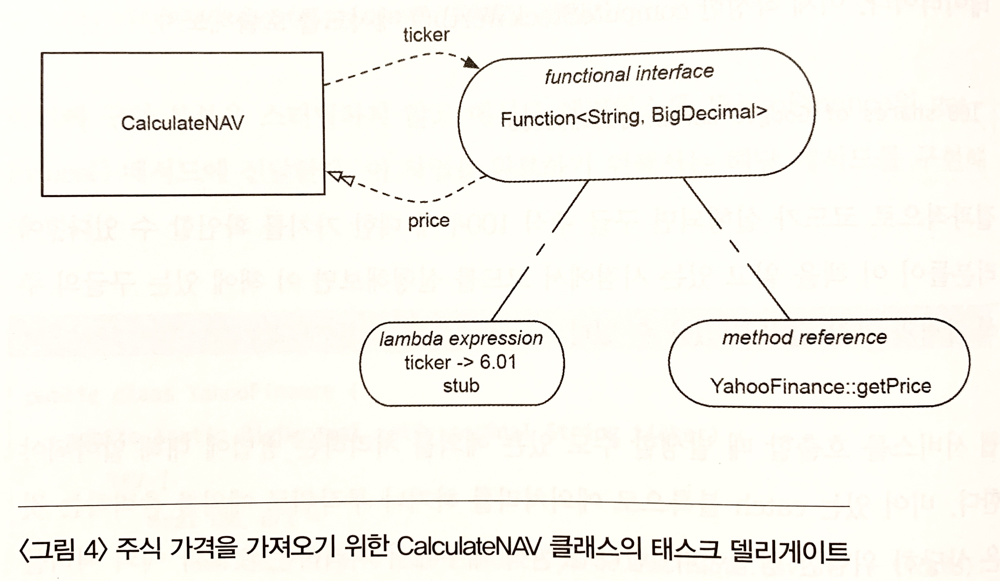
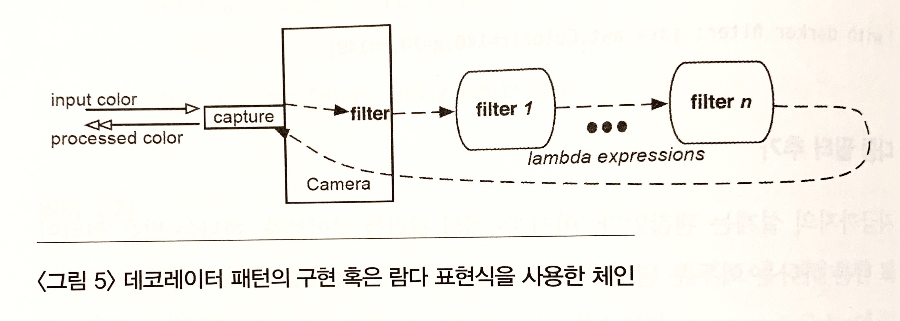

람다 표현식을 사용해서 로직과 함수를 쉽게 분리하고 쉽게 확장할 수 있다. 또한 평범한 인터페이스를 좀 더 활용성이 뛰어나고 직관적인 인터페이스로 변화시킬 수 있다.

# 람다를 사용한 문제의 분리
클래스를 사용하는 이유는 코드를 재사용하기 위해서이다. 좋은 방법이긴 하지만 항상 옳은 것은 아니다. 고차 함수를 사용하면 클래스의 복잡한 구조 없이도 같은 목적을 달성할 수 있다.

* stream을 활용한 람다 예제

```java
public class Asset {
    public enum AssertType {BOND, STOCK};
    private final AssertType type;
    private final int value;

    public Asset(AssertType type, int value) {
        this.type = type;
        this.value = value;
    }

    public AssertType getType() {
        return type;
    }

    public int getValue() {
        return value;
    }
}

public class AssetUtil {

    final List<Asset> assets = Arrays.asList(
        new Asset(Asset.AssertType.BOND, 1000),
        new Asset(Asset.AssertType.BOND, 2000),
        new Asset(Asset.AssertType.STOCK, 3000),
        new Asset(Asset.AssertType.STOCK, 4000)
    );

    public static int totalAssetValues(final List<Asset> assets) {
        return assets.stream()
                     .mapToInt(Asset::getValue)
                     .sum();
    }
}
```
totalAssetValues() 메서드와 같이 이터레이터(stream)를 사용한 람다 표현식을 활용할 수 있다.<br>
하지만 여기서 3가지 문제가 있다.

* 이터레이션을 어떻게 활용할지
* 어떤 값에 대한 합계를 계산할지
* 그 합계를 어떻게 구할지

이렇게 뭐가 복합적으로 뒤엉켜 있는 로직은 재사용성이 떨어진다.

* 항목에 따른 분리

```java
public static int totalBondValues(final List<Asset> assets) {
    return assets.stream()
                 .mapToInt(asset -> asset.getType() == Asset.AssertType.BOND ? asset.getValue() : 0)
                 .sum();   
}

public static int totalBondValues(final List<Asset> assets) {
    return assets.stream()
                 .mapToInt(asset -> asset.getType() == Asset.AssertType.STOCK ? asset.getValue() : 0)
                 .sum();   
}
```
분리는 했지만 반복적인 코드가 보인다. 리팩토링을 통해 개선할 여지가 충분하다.

* 리팩토링

위에서 본 코드와 같이 중복되는 함수를 보통 활용되는 인터페이스나 클래스가 아닌 람다 표현식을 활용한 strategy pattern으로 해결할 수 있다.

```java
public static int totalAssetValues(final List<Asset> assets, final Predicate<Asset> assetSelector) {
    return assets.stream()
                 .filter(assetSelector)
                 .mapToInt(Asset::getValue)
                 .sum();
}
```
함수형 인터페이스를 파라미터로 갖는 하나의 메서드로 리팩토링이 가능하다.<br>
별도로 인터페이스를 직접 생성하지 않고, java.util.function.Predicate 인터페이스를 재사용하였다. 클래스나 익명 클래스도 사용하지 않고 람다 표현식을 totalAssetValue() 메서드의 리팩토링 버전에 전달한다.

* asset의 값을 계산하는 코드

```java
System.out.println(totalAssetValues(assets, asset -> true));
System.out.println(totalAssetValues(assets, asset -> asset.getType() == Asset.AssertType.BOND));
System.out.println(totalAssetValues(assets, asset -> asset.getType() == Asset.AssertType.STOCK));
```

OCP(개방-폐쇄 원칙)를 적용하여 리팩토링 하였다. 메서드의 변경 없이 원하는 항목만 변경이 가능하게 되었다.<br>
즉, totalAssetValues() 메서드 변경 없이 원하는 항목으로 설전된 Predicate 인터페이스만 주입해주면 원하는 항목에 대한 합계를 얻을 수 있다.

# 람다 표현식을 사용하여 delegate 하기

> delegate란? -[https://wiserloner.tistory.com/461](https://wiserloner.tistory.com/461)

```java
import java.math.BigDecimal;
import java.util.function.Function;

public class CalculateNAV {
    
    private Function<String, BigDecimal> priceFinder;

    public CalculateNAV(Function<String, BigDecimal> priceFinder) {
        this.priceFinder = priceFinder;
    }

    public BigDecimal computeStockWorth(final String ticker, final int shares) {
        return priceFinder.apply(ticker).multiply(BigDecimal.valueOf(shares));
    }
}
```
computeStockWorth() 메서드에서 printFinder에 대한 주식시세표(ticker)의 가격을 요청하고 시세에 따라 가치를 결정한다. princeFinder를 통해 어떤 종류의 객체가 될지 결정한다. ticker를 전송하여 ticker에 대한 가격을 받아야 한다.<br>
여기서 java.util.function.Function<T, R> 함수형 인터페이스를 활용한다. 생성자를 통해 princeFinder를 주입받는 형식은 **DI**와 **DIP(dependency inversion principle)**가 사용되었다.

> DIP란? - [https://ktko.tistory.com/entry/%EC%9E%90%EB%B0%94-%EA%B0%9D%EC%B2%B4-%EC%A7%80%ED%96%A5%EC%9D%98-%EC%9B%90%EB%A6%AC-SOLID-DIP-%EC%9D%98%EC%A1%B4-%EC%97%AD%EC%A0%84-%EC%9B%90%EC%B9%99](https://ktko.tistory.com/entry/%EC%9E%90%EB%B0%94-%EA%B0%9D%EC%B2%B4-%EC%A7%80%ED%96%A5%EC%9D%98-%EC%9B%90%EB%A6%AC-SOLID-DIP-%EC%9D%98%EC%A1%B4-%EC%97%AD%EC%A0%84-%EC%9B%90%EC%B9%99)

* 비교 예제

```java
final CalculateNAV calculateNAV = new CalculateNAV(ticker -> new BigDecimal("6.01"));
BigDecimal expected = new BigDecimal("6010.00");

System.out.println(calculateNAV.computeStockWorth("GOOG", 1000).compareTo(expected)); // 0
```


# 람다 표현식을 활용한 decorating
delegation은 뛰어난 기능이지만 여기에 delegation을 chain으로 묶어 behavior(동작)를 추가한다면 더 유용하게 사용할 수 있다. behavior에 대한 개별적인 기능을 작성하고 그 기능들을 클래스에 이용할 수 있다.

decorator pattern은 강력하지만 클래스와 인터페이스 생성에 대한 부담이 있다. 하지만 람다 표현식에 delegate를 조합을 통해 decorator 패턴을 활용하는 법을 알면 유연하고 확장 가능한 경량화된 설계가 가능하다.

## 필터 설계

```java
import java.awt.Color;
import java.util.function.Function;
import java.util.stream.Stream;

@SuppressWarnings("unchecked")
public class Camera {
    private Function<Color, Color> filter;

    public Camera() { setFilters(); }

    public Color capture(final Color inputColor) {
        final Color processedColor = filter.apply(inputColor);
        // ...
        return processedColor;
    }
    
    public void setFilters(Function<Color, Color>... filters) {
        filter 
            = Stream.of(filters)
                    .reduce((filter, next) -> filter.compose(next)) //  디폴트 메서드 compose() 활용한 chain 처리
                    .orElse(color -> color);
    }
}

```

자 8에서는 유연성을 얻기 위한 방법으로 디폴트 메서드를 제공한다. 추상 메서드를 덧붙여서 인터페이스는 구현 부분이 있는 메서드를 갖게 되며 default로 마크된다. 이 메서드는 인터페이스를 구현하는 클래스에 자동으로 추가된다. 이 작업은 새로운 메서드를 갖는 기존 클래스의 추가 작업 없이 기능을 사용할 수 있다. 또한, 인터페이스는 정적 메서드다.

**apply() 추상 메서드**의 추가와 함께 Function 인터페이스는 디폴트 메서드인 compose()메서드를 활용하여 여러 Function을 조합하거나 연결한다. Function 파라미터를 람다 표현식으로 대채하면, 이 메서드를 쉽게 사용할 수 있다.

**compose() 메서드**는 두 개의 Function을 조합하거나 연결한다. 한 번만 조합하면, 연결된 Function을 따라 apply() 호출이 실행된다.

**setFilters() 메서드**에서 각 필터를 이터레이션하고 compose() 메서드를 사용하여 각 필터들을 하나로 연결한다.

* 결과 확인 예제

```java
final Camera camera = new Camera();
final Consumer<String> printCaptured
    = (filterInfo) -> System.out.println(String.format("with %s: %s", filterInfo,
                                         camera.capture(new Color(200, 100, 200))));

printCaptured.accept("no filter");  //  with no filter: java.awt.Color[r=200,g=100,b=200]
```  

카메라가 동작하는지를 확인하기 위해 capture() 메서드의 결과를 출력하는 convenience 함수가 필요하다. 독자적인 정적 메서드보다는 람다 표현식을 활용하여 Consumer 함수형 인터페이스의 인스턴스를 대체했다.<br>
주이전 칼라를 카메라에 요청하기 위해 accept() 메서드를 사용한다.

## 필터 추가

```java
camera.setFilters(Color::brighter);
printCaptured.accept("brigher filter"); //  with brigher filter: java.awt.Color[r=255,g=142,b=255]
```

필터 추가는 setFilters() 메서드로 간단하게 전달할 수 있다.

## 다중 필터 추가

```java
camera.setFilters(Color::brigher, Color::darker);
printCaptured.accept("brighter & darker filter");   //  with brighter & darker filter: java.awt.Color[r=200,g=100,b=200]
```

두 메서드 레퍼런스를 setFilter() 메서드에 넘긴다. 두 개의 필터는 연결되고 Camera 인스턴스에 있는 filter 레퍼런스는 체인의 헤드를 참조한다. capture() 메서드를 호출하면 각 필터들을 사용하여 Color를 처리한다.

이 필터들의 조합을 통해 입력 Color는 연속해서 변경되고 필터링된다.



클래스 구조 설계 없이 객체 체인을 설계했고 데코레이터 패턴을 구현했다.
# 디폴트 메서드
디폴트 메서드는 람다 표현식이나 함수형 스타일의 프로그래밍과 밀접한 관계는 없지만 컬렉션에 존재하는 많은 메서드가 디폴트 메서드 없이는 불가능하다.

자바 컴파일러는 디폴트 메서드를 사용하기 위해 아래와 같은 규칙을 따른다.

1. 서브 타입은 슈퍼 타입으로부터 자동으로 디폴트 메서드를 넘겨받는다.
2. 디폴트 메서드를 사용하는 인터페이스에서 서브 타입에서 구현된 디폴트 메서드는 슈퍼 타입에 있는 것보다 우선한다.
3. 추상 선언을 포함하여 클래스에 있는 구현은 모든 인터페이스의 디폴트보다 우선한다.
4. 두 개 이상의 디폴트 메서드의 구현이 충돌하는 경우 혹은 두 개의 인터페이스에서 디폴트 추상 충돌(default-abstract conflict)이 발생하는 경우, 상속하는 클래스가 명확해야 한다.

```java
public interface Fly {
    default void takeOff() {System.out.println("Fly::takeOff");}
    default void land() {System.out.println("Fly::land");}
    default void turn() {System.out.println("Fly::turn");}
    default void cruise() {System.out.println("Fly::cruise");}
}

public interface FastFly extends Fly {
    default void takeOff() {System.out.println("FastFly::takeOff");}
}

public interface Sail {
    default void cruise() {System.out.println("Sail::cruise");}
    default void turn() {System.out.println("Sail::turn");}
}

public class Vehicle {
    public void turn() {System.out.println("Vehicle::turn");}
}

public class SeaPlane extends Vehicle implements FastFly, Sail {

    private int altitude;

    @Override
    public void cruise() {  //  Fly가 아닌 FastFly의 cruise
        System.out.println("SeaPlane::cruise currently cruise like: ");
        if (altitude > 0) {
            FastFly.super.cruise();
        } else {
            Sail.super.cruise();
        }
    }
}
```

**FastFly 인터페이스**는 Fly 인터페이스에서 확장했고 takeOff() 메서드를 오버라이드한다. 이 메서드는 자신의 디폴트 구현을 갖고 있다.<br>
FastFly는 또한 Fly 인터페이스의 다른 3개(land, turn, cruise) 메서드에서도 사용한다.(1번 규칙) 그리고 FastFly로부터 상속받은 클래스와 인터페이스는 FastFly의 takeOff() 구현을 사용하며 Fly의 구현을 사용하지는 않는다.(2번 규칙)

**SeaPlane 클래스**에서 Sail 인터페이스와 Vehicle 클래스에서 turn() 메서드가 중복되지만, 여기서 부모 클래스인 Vehicle의 turn()가 더 우선시 된다.(3번 규칙) 그리하여 충돌이 발생하지 않는다.<br>
그러나, 자바 컴파일러는 SeaPlane에 있는 cruise() 메서드를 구현하도록 한다. FastFly 인터페이스와 Sail 인터페이스의 디폴트 구현에서 충돌이 발생하기 때문이다.(4번 규칙)

override한 메서드로부터 그에 맞는 디폴트 메서드를 호출할 수 있다. 예를 들면 위 코드에서 FastFly와 Sail 인터페이스의 디폴트 메서드인 cruise()를 어떻게 호출하는지 확인할 수 있다.

* 실제 메서드 동작 순서 확인 코드

```javas
SeaPlane seaPlane = new SeaPlane();

seaPlane.takeOff(); //  FastFly
seaPlane.turn();    //  Vehicle
seaPlane.cruise();  //  SeaPlane. Sail
seaPlane.land();    //  Fly
``` 

이전에는 인터페이스에서 오직 추상 메서드만 활용이 가능했었지만 디폴트 메서드가 도입되었다. 얼핏보면 인터페이스와 추상 메서드와 차이가 없는 것 같지만 차이가 있다.<br>
추상 클래스는 상태를 갖지만 인터페이스는 그렇지 못하다. 또한 다중 인터페이스에서 클래스를 상속(구현)할 수 있지만, 하나의 추상 클래스로부터 상속(확장)할 수 있다.
# 람다 표현식을 활용한 인터페이스 만들기
위에서는 메서드와 클래스의 내부에 대해 살펴봤다면 이번에는 람다 표현식으로 클래스의 외부와 인터페이스 형성에 활용하는 법을 알아본다.

* 설거지 거리

```java
public class Mailer {
    public void from(final String address) {}
    public void to(final String address) {}
    public void subject(final String line) {}
    public void body(final String message) {}
    public void send() {System.out.println("sending...");}
}

Mailer mailer = new Mailer();
mailer.from();
mailer.to();
mailer.subject();
mailer.body();
mailer.send();
```

위 코드는 반복이 너무 많 정확히 무슨 기능인지, 재사용이 가능한지 알 수가 없다.

## 메서드 체인 사용
위 문제를 개선해본다. 먼저 반복되는 mailer 레퍼런스와 명확하지 않은 객체의 lifetime을 개선한다.

레퍼런스를 반복하는 것 보다는 컨텍스트 객체의 상태를 계속 유지하는 것이 더 좋다. 간단한 `메서드 체인(method chaining)` 혹은 `캐스캐이드 메서드 패턴(cascade method pattern)`을 사용해서 구현해본다.

* 레퍼런스 반복 문제 개선(메서드 체인)

```java
public class MailBuilder {
    public MailBuilder from(final String address) {/*..*/ return this;}
    public MailBuilder to(final String address) {/*..*/ return this;}
    public MailBuilder subject(final String line) {/*..*/ return this;}
    public MailBuilder body(final String message) {/*..*/ return this;}
    public void send() {System.out.println("sending...");}
}

new MailBuilder()
    .from()
    .to()
    .subject()
    .body()
    .send();
```

위와 같이 변경하여 반복되는 변수 이름을 제거했고 호출을 연결함으로써 이전 버전에 비해 사용성이 좋아졌다.<br>
MailBuilder 인스턴스로 시작해서 이전 호출이 리턴되는 인스턴스의 순서대로 함수들의 호출을 연결한다. 메서드 연결은 연결을 통해 하나의 호출에서 다음 호출로 상태를 넘긴다. 종단(terminal) 메서드인 send()는 처리 과정을 마무리한다.

이러한 설계가 붋필요한 작업을 줄일 수는 있지만 단점도 있다. 새로운 키워드 new로 인해 API의 다양성과 가독성을 떨어뜨린다. 이러한 설계 방법은 new를 사용하여 레퍼런스를 저장하도록 허용하며 그 레퍼런스를 연결하도록 했지만 여전히 lifetime 문제는 남아있다.

좀 더 직관적이고 풍성할 필요가 있다.

* API 직관적이고 풍성하게

```java
public class FluentMailer {
    private FluentMailer() {}

    public FluentMailer from(final String address) {/*...*/; return this;}
    public FluentMailer to(final String address) {/*...*/; return this;}
    public FluentMailer subject(final String line) {/*...*/; return this;}
    public FluentMailer body(final String message) {/*...*/; return this;}
    public void send(final Consumer<FluentMailer> block ) {
        final FluentMailer mailer = new FluentMailer();
        block.accept(mailer);
        System.out.println("sending...");
    }
}

FluentMailer.send(mailer ->
     mailer.from()
           .to()
           .subject()
           .body());
```

메서드 체인 버전과 같이 모든 비종단(nonterminal) 메서드는 인스턴스를 리턴한다. 종단 메서드 send()는 정적 메서드이며 파라미터로 Consumer를 사용한다. 기존처럼 인스턴스를 생성하기 보다 send()를 호출할 때 코드 블록을 넘겨 처리하게 한다.

우회하는 방법같긴 하지만 객체 스코프는 블록 안으로 한정되고(lifetime 문제 해결) send() 메서드로부터 한번 리턴하면 레퍼런스는 종료된다. 또한 블록 안의 풍족한 메서드 체인으로부터 이점을 얻을 수도 있다. 이것은 new 키워드 없이 가능하다. 이 것을 `loan patter(론 패턴)`이라 한다. 
# 예외 처리

* 예외 처리 전

```java
Stream.of("/usr", "/tmp")
      .map(path -> {
          try {
              return new File(path).getCanonicalPath();
          } catch (IOException e) {
              return e.getMessage();
          }
      })
      .forEach(System.out::println);
```
여기에 두 가지 옵션으로 예외 처리를 할 수 있다. 
1. 람다 표현식의 적절한 위치에서 예외 처리
2. 예외를 캐치한 후 언체크 예외로 예외 재발생

체크 상태에서 언체크 상태의 예외로의 변경과 예외를 재발생하는 것은 람다 표현식의 호출이 순서대로 구성되어 있어야 제대로 동작한다. 그렇지 않다면 문제가 발생할 수 있다.

동시 실행의 경우, 람다 표현식에서 발생하는 예외는 자동적으로 주 스레드를 호출하는 쪽으로 퍼져나가게 되는데 그렇게 되면 `예외 처리가 종료되지 못하거나`, `동시에 실행하는 다른 람다 표현식의 실행을 방해`할 수 있다. 모든 예외 처리의 세부 내용이 중요하다면, 람다 표현식에서 모두 캐치 처리하고 각 예외 처리들을 결과의 한 부분으로 다시 메인 스레드로 돌려보내는 것이 좋다.

위에서 사용한 map() 메서드에 사용된 Function 인터페이스는 예외 처리에 제한이 있다. 따라서 아래와 같이 커스텀하게 함수형 인터페이스를 설계하여 예외 처리 관점에서 유연하게 활용할 수도 있다.

```java
@FunctionalInterface
public interface UseInstance<T, X extends Throwable> {
    void accept(T instance) throws X;
}
```

UseInstance 인터페이스의 파라미터를 받는 어떤 메서드라도 적절한 예외 처리를 할 준비가 되어있고 그 예외를 전파할 수 있는 준비가 되어있다.