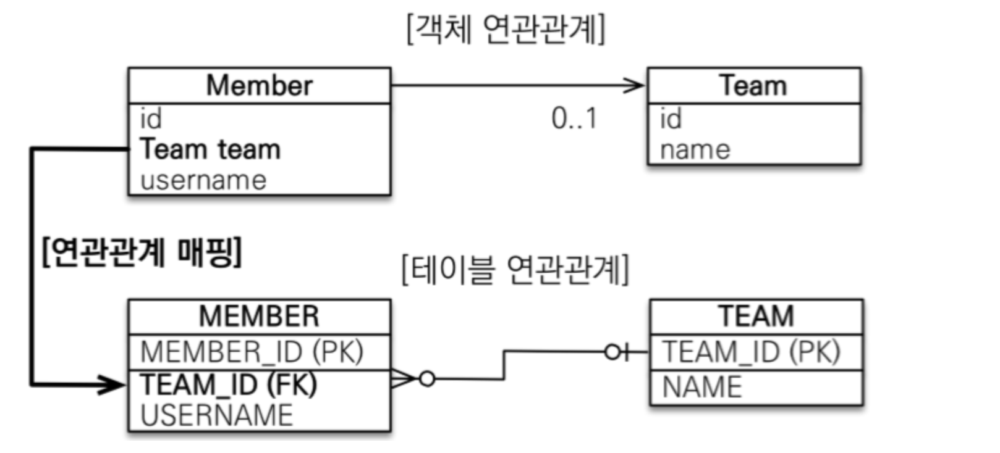
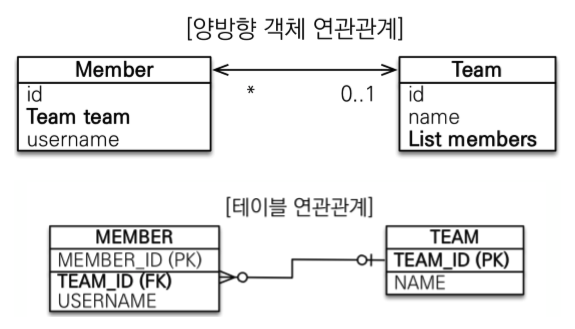

연관관계 매핑이란, `객체의 참조와 테이블의 외래 키를 매핑하는 것`이라 말할 수 있다.
* 방향(Direction)
단방향/양방향이 있다. 방향은 `객체관계에만 존재`하고 테이블 관계는 항상 양방향이다.
* 다중성(Multiplicity)
다대일/일대다/일대일/다대다 를 말한다.
* 연관관계의 주인
객체를 양방향 연관관계로 만들게 되면 연관관계의 주인을 정해야 한다.

## 단방향 연관관계
### 다대일

#### 객체 연관관계
* 회원 객체는 Member.team 필드로 팀 객체와 연관관계를 맺는다.
* 회원 객체와 팀 객체는 단방향 관계다.
* 회원은 Member.team 필드를 통해서 팀을 알 수 있지만, 반대로 팀은 회원을 알 수 없다.

#### 테이블 연관관계
* 회원 테이블을 TEAM_ID 외래 키로 팀 테이블과 연관관계를 맺는다.
* 회원 테이블과 팀 테이블은 양방향 관계다.
* 회원 테이블의 TEAM_ID 외래 키를 통해서 회원과 팀을 조인할 수 있고, 반대로 팀과 회원도 조인할 수 있다.

#### 객체/테이블 연관관계의 차이점
참조를 통한 연관관계는 언제나 단방향이다. 반대쪽에도 필드를 추가하면 양방향 연관관계가 될 수 있지만 엄밀히 보면 단방향 연관관계가 2개인 셈이다. 반면 테이블을 외래 키 하나로 양방향으로 조인할 수 있다.
* 객체는 `참조`, 테이블은 `외래 키`를 통한 조인으로 연관관계를 맺는다.

### 순수한 객체 연관관계
```java
Team findTeam = member1.getTeam();
```
객체는 참조를 사용하여 연관관계를 탐색할 수 있는데 이를 `객체 그래프 탐색`이라 한다.

### 테이블 연관관계
데이터베이스는 외래 키를 사용하여 연관관계를 탐색할 수 있는 데 이것을 조인이라 한다.
### 객체 관계 매핑
JPA를 활용하여 객체와 테이블을 매핑해본다.
```java
@Entity
public class Member {

    @Id @Column(name = "MEMBER_ID")
    private String id;

    private String username;

    // 연관관계 매핑
    @ManyToOne
    @JoinColumn(name="TEAM_ID")
    private Team team;

    //  연관관계 설정
    public void setTeam(Team team) {
        this.team = team;
    }

    //  Getter, Setter...
}
```
Member.team과 MEMBER.TEAM_ID를 매핑하는 것이 연관관계 매핑이다. 위 코드에서 사용된 어노테이션은 다음과 같다.
* @ManyToOne
다대일 관계를 나타내는 매핑해준다.
* @JoinColumn(name="TEAM_ID")
외래 키를 매핑할 때 사용한다. name 속성에는 매핑할 외래 키 이름을 지정한다.

### @JoinColumn
<table>
  <thead>
    <tr>
      <th>속성</th>
      <th>기능</th>
      <th>기본 값</th>
    </tr>
  </thead>
  <tbody>
    <tr>
      <td>name</td>
      <td>매핑할 외래 키 이름</td>
      <td>필드명 + ㅡ + 참조하는 테이블의 기본 키 컬럼명</td>
    </tr>
    <tr>
      <td>referencedColumnName</td>
      <td>외래 키가 참조하는 대상 테이블의 컬럼명</td>
      <td>참조하는 테이블의 기본 키 컬럼명</td>
    </tr>
    <tr>
      <td>foreignKey(DDL)</td>
      <td>외래 키 제약조건을 직접 지정할 수 있다. 이 속성은 테이블을 생성할 때만 사용한다.</td>
      <td></td>
    </tr>
    <tr>
      <td>unique<br>nullable<br>insertable<br>updatable<br>columnDefinition<br>table</td>
      <td>@Column의 속성과 같다.</td>
      <td></td>
    </tr>
  </tbody>
</table>

> @JoinColumn 은 생략하게 되면 기본 전략`(필드명 + ㅡ + 참조하는 테이블의 기본 키 컬럼명)`으로 적용된다.

### @ManyToOne
다대일 관계에서 사용한다.
<table>
  <thead>
    <tr>
      <th>속성</th>
      <th>기능</th>
      <th>기본 값</th>
    </tr>
  </thead>
  <tbody>
    <tr>
      <td>optional</td>
      <td>false로 설정하면 연관된 엔티티가 항상 있어야 한다.</td>
      <td>true</td>
    </tr>
    <tr>
      <td>fetch</td>
      <td>글로벌 페치 전략을 설정한다.</td>
      <td>@ManyToOne=FetchType.EAGER<br>@OneToMany=FetchType.LAZY</td>
    </tr>
    <tr>
      <td>cascade</td>
      <td>영속성 전이 기능을 사용한다.</td>
      <td></td>
    </tr>
    <tr>
      <td>targetEntity</td>
      <td>연관된 엔티티의 타입 정보를 설정한다.</td>
      <td></td>
    </tr>
  </tbody>
</table>

## 연관관계 사용

### 저장
```java
public void save() {

//  팀1 저장
Team team1 = new Team("team1", "팀1");
em.persist(team1);

//  회원1 저장
Member member1 = new Member("member1", "회원1");
member1.setTeam(team1);     //  연관관계 설정 member1 -> team1

//  회원2 저장
Member member2 = new Member("member2", "회원2");
member2.setTeam(team1);     //  연관관계 설정 member2 -> team1
em.persist(member2);

}
```

### 조회
* 객체 그래프 탐색(객체 연관관계를 사용한 조회)
member.getTeam()을 사용해서 member와 연관된 team 엔티티를 조회할 수 있다.
```java
Member member = em.find(Member.class, "member1");
Team team = member.getTeam();   //  객체 그래프 탐색
System.out.println(team.getTeam());
```
* 객체지향 쿼리 사용(JPQL)

```java
String jpql = "select m from Member m join m.team t where " + "t.name=:teamName";

List<Member> resultList = em.createQuery(jpql, Member.class)
                            .setParameter("teamName", "팀1")
                            .getResultList();

for (Member member : resultList) {
    System.out.println(member.getUsername());
}
```

### 수정
```java
//  새로운 팀2
Team team2 = new Team("team2", "팀2");
em.persist(team2);

//  회원1에 새로운 팀2 설정
Member member = em.find(Member.class, "member1");
member.setTeam(team2);
```
불러온 엔티티 값만 변경해두면 트랜잭션을 커밋할 때 플러시가 일어나면서 변경 감지 기능이 작동한다. 참조하는 대상만 변경하면 나머지는 JPA가 자동으로 처리해준다.

### 연관관계 제거
```java
Member member1 = em.find(Member.class, "member1");
member1.setTeam(null);
```
```sql
UPDATE MEMBER SET TEAM_ID=null, ... WHERE ID='member1';
```

### 연관된 엔티티 삭제
연관된 엔티티 삭제를 위해선 기존 연관관계를 먼저 제거 후 삭제해야 한다. 그렇지 않으면 외래 키 제약조건으로 인해, 데이터베이스 오류가 발생한다.
```java
member1.setTeam(null):  //  회원1 연관관계 제거
member2.setTeam(null);  //  회원2 연관관계 제거
em.remove(team):        //  팀 삭제
```
## 양방향 연관관계
기존 단반향 연관관계는 회원에서 팀으로만 접근하는 매핑이었다면 양방향 연관관계는 물론 회원에서 팀으로 접근이 가능할 뿐만 아니라 반대 방향인 팀에서도 회원으로 접근이 가능한 매핑이다.

### 객체 연관관계
회원에서 팀은 단방향과 같은 다대일 관계지만 양방향 연관관계가 추가되면서 팀에서 회원 간에 일대다 관계가 추가되었다. 일대다 관계는 여러 건과 연관관계를 맺을 수 있으므로 컬렉션을 사용해야 한다.

```java
@Entity
public class Team {
    
    @Id @Column(name = "TEAM_ID")
    private String id;

    private String name;

    // 추가
    @OneToMany(mappedBy = "team")
    private List<Member> members = new ArraysList<Member>();

}
```
팀 엔티티에 List<Member> members 컬렉션이 추가되었고, @OneToMany 어노테이션과 양방향 매핑일 떄 사용되는 mappedBy 속성이 추가 적용되었다. 그러면 이제 팀에서 회원 컬렉션으로 객체 그래프 탐색이 가능하다.
> mappedBy 속성은 양방향 매핑에서 반대쪽 매핑의 필드 이름(회원 엔티티의 Team 필드 명)을 값으로 적용한다.

### 테이블 연관관계
데이터베이스 테이블을 외래 키 하나로 양방향으로 조회가 가능하다. 따라서 처음부터 양방향 관계가 성립할 수 있다. 즉, 별도로 데이터베이스에 추가해야 될 부분은 없다.

## 연관관계의 주인
객체에는 양방향 연관관계가 없다. 서로 다른 단방향 연관관계 2개를 로직으로 묶어준 것일 뿐이다. 반면, 데이터베이스 테이블을 외래 키 하나로 테이블 간 양방향 연관관계 관리가 가능하다. 따라서 객체에서 양방향 연관관계를 설정하려면 2개의 참조가 필요하지만 테이블에서는 1개일 뿐이기 떄문에 차이가 발생한다.`이러한 차이를 JPA에서는 두 객체 연관관계 중 하나를 정해 테이블의 외래 키를 관리하도록 한다.` 이 한 곳이 `연관관계의 주인`이 된다.

### 연관관계의 주인: 매핑 규칙
`연관관계의 주인만이 데이터베이스 연관관계와 매핑되어 외래 키 관리(등록, 수정, 삭제)가 가능`하다. 반면 `주인이 아닌 쪽(mappedBy 속성이 적용된 곳)은 읽기만 가능`하다.
>연관관계의 주인이란 즉, 외래키 관리자를 선택하는 것이다.

`연관관계의 주인은 테이블에 외래 키가 있는 곳으로 정해야 한다.` 실제 외래 키는 회원 테이블에 있는데 팀 테이블에서 설정하게 되면 물리적으로 다른 테이블에 있는 외래 키를 관리하는 형태가 된다.
>데이터베이스 테이블의 다대일/일대다 관계에서는 항상 `다` 쪽이 외래 키를 갖게 된다. 따라서 @ManyToOne은 항상 연관관계의 주인이 되므로, mappedBy 속성이 없다.

## 양방향 연관관계 주의점
>연관관계의 주인만이 외래 키의 값을 변경할 수 있다.

### 순수한 객체를 고려한 양방향 연관관계 설정
하지만, 객체 관점에서는 양쪽 방향 모두 값을 입력해주는 것이 가장 안전하다. 그렇지 않으면 `JPA를 사용하지 않는 순수한 객체 상태에서는 문제가 발생할 수 있다.`
> 순수한 객체까지 고려해서 연관관계 주인이 아닌 곳에도 값을 입력해주는 것이 안전하다.

```java
Team team1 = new Team("team1", "팀1");
Member member1 = new Member("member1", "회원1");
Member member2 = new Member("member2", "회원2");

member1.setTeam(team1);             //  연관관계 설정 member1 -> team1
team1.getMembers().add(member1);    //  연관관계 설정 team1 -> member1

member2.setTeam(team1);             //  연관관계 설정 member2 -> team1
team1.getMembers().add(member2);    //  연관관계 설정 team1 -> member2
```

### 메서드를 활용한 양방향 연관관계
```java
public class Member {
    
    private Team team;

    // 추가된 부분
    public void setTeam(Team team) {
        this.team = team;
        team.getMembers().add(this);
    }

}
```
회원 엔티티에 위와 같이 setTeam() 메서드를 추가하여 양방향 관계를 모두 설정하게 할 수 있다.

```java
Team team1 = new Team("team1", "팀1");
em.persist(team1);

Member member1 = new Member("member1", "회원1");
member1.setTeam(team1);     //  양방향 설정
em.persist(member1);

Member member2 = new Member("member2", "회원2");
member2.setTeam(team1);     //  양방향 설정
em.persist(member2);
```
이렇게 한 번에 양방향 관계를 설정하는 메서드를 `연관관계 편의 메소드`라 한다.

#### 주의점
```java
member1.setTeam(teamA);
member1.setTeam(teamB);
Member findMeber = teamA.getMembers();  //  기존 member1과 teamA간의 관계가 아직 남아있기 때문에 teamA에서 여전히 member1이 조회가 되버린다.
```
연관관계 편의 메소드를 활용하여 teamB로 변경하기 위해서는 아래와 같이 연관관계 편의 메소드에 기존 teamA -> member1 관계를 제거 후 변경하는 코드를 적용해야 한다.
```java
public void setTeam() {
    
    // 기존 팀과 관계를 제거
    if (this.team != null) {
        this.team.getMembers().remove(this);
    }
    this.team = team;
    team.getMembers().add(this);
}
```
> 기존 teamA -> member1 관계를 제거하지 않아도 데이터베이스의 외래 키 참조를 teamA에서 teamB로 변경하는 것에는 문제가 없다. 다만 기존 관계가 끊어진 상태가 아니기 때문에 teamA의 getMembers() 적용 시 여전히 member1이 조회된다는 것이 문제일 뿐이다.

## 정리
양방향 매핑은 단방향 매핑에서 연관관계의 주인이 아닌 연관관계를 하나 추가한 매핑이다. 따라서 `반대방향에서 객체 그래프 탐색(만)이 가능`해졌다. 라는 차이가 있을 뿐이다. 
