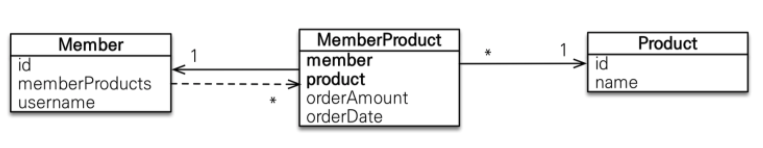
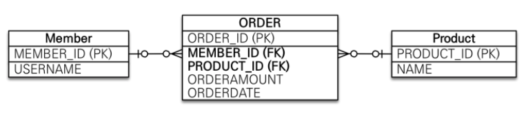

## 다대일
외래 키는 항상 다 쪽에 있다. 따라서 객체 양방향 관계에서 연관관계의 주인은 항상 다 쪽이다.
### 다대일 단방향[N:1]
```java
@Entity
public class Member {
    
    @Id @GeneratedValue
    @Column(name = "MEMBER_ID")
    private Long id;

    private String username;

    @ManyToOne
    @JoinColumn(name = "TEAM_ID") 
    private Team team;      //  TEAM_ID 외래 키를 관리한다.

    ...

}

@Entity
public class Team {
    
    @Id @GeneratedValue
    @Column(name = "TEAM_ID")
    private Long id;

    private String name;

    ... 
    
}
```
회원에서는 Member.team으로 팀 엔티티를 참조할 수 있지만 팀에서는 회원을 참조하는 필드가 없다. 따라서 회원과 팀은 다대일 연관관계이다.

### 다대일 양방향[N:1, 1:N]
```java
@Entity
public class Member {
    
    @Id @GeneratedValue
    @Column(name = "MEMBER_ID")
    private Long id;

    private String username;

    @ManyToOne
    @JoinColumn(name = "TEAM_ID")
    private Team team;

    public void setTeam(Team team) {
        this.team = team;

        //  무한루프에 빠지지 않도록 체크
        if (!team.getMembers().contains(this)) {
            team.getMembers.add(this);
        }
    } 

    
}
@Entity
public class Team {
    
    @Id @GeneratedValue
    @Column(name = "TEAM_ID")
    private Long id;

    private String name;

    @OneToMany(mappedBy = "team")
    private List<Member> members = new ArrayList<>();

    public void addMember(Member member) {
        this.members.add(member);
        if (member.getTeam() != this) { //  무한루프에 빠지지 않도록 체크
            members.setTeam(this);
        }
    }
    ...
}
```
JPA는 외래 키를 관리할 때 연관관계의 주인만 사용한다. 양방향 연관관계는 항상 서로를 참조해야 한다. 항상 서로를 참조하려면 `연관관계 편의 메소드`([5. 연관관계 매핑 편 참조](https://leejaedoo.github.io/relationship_mapping/)) 를 작성하는 것이 좋다.
> 연관관계 편의 메소드 작성 시, 무한루프에 빠지지 않도록 주의해야 한다.

## 일대다
다대일의 반대방향으로(팀 -> 회원) 엔티티를 하나 이상 참조하게 됨으로써 자바 컬렉션을 사용해야 한다.
### 일대다 단방향[1:N]
> 일대다 단방향 관계는 JPA 2.0 부터 지원한다.

일반적으로 자신이 매핑한 테이블의 외래 키를 관리하는데, 외래키는 다 쪽에 있는 테이블에서 관리되기 때문에 일대다 단방향은 자신의 테이블이 아닌 반대쪽 테이블에 있는 외래 키를 관리한다.
```java

@Entity
public class Team {
    @Id @GeneratedValue
    @Column(name = "TEAM_ID")
    private Long id;

    private String name;

    @OneToMany
    @JoinColumn(name = "TEAM_ID")   //  MEMBER 테이블의 TEAM_ID(FK)
    private List<Member> members = new ArrayList<>():

    ...
}
@Entity
public class Member {
    @Id @GeneratedValue
    @Column(name = "MEMBER_ID")
    private Long id;

    private String username;

    ...
}
```
>일대다 단방향 관계에서는 @JoinColumn을 명시하지 않으면 연결 테이블을 중간에 두고 연관관계를 관리하는 조인 테이블 전략을 기본으로 사용해서 매핑하게 된다.

일대다 단방향 관계는 매핑한 객체가 관리하는 외래 키가 다른 테이블에 있기 때문에 INSERT SQL에서 추가적으로 UPDATE SQL을 한번 더 실행돼야 하는 단점이 있다.
```java

Member member1 = new Member("member1");
Member member2 = new Member("member2");

Team team1 = new Team("team1");
team1.getMembers().add(memeber1);
team1.getMembers().add(memeber2);

em.persist(member1);    //  INSERT-member1
em.persist(member2);    //  INSERT-member1
em.persist(team1);    //  INSERT-team1, UPDATE-member1.fk, UPDATE-member2.fk

```
Member 엔티티는 Team 엔티티를 모르기 때문에 Member 엔티티가 저장될 때는 TEAM_ID 외래 키만 저장될 뿐이다. 따라서 Team 엔티티를 저장할 때, Team.members의 참조 값을 확인하여 회원 테이블에 있는 TEAM_ID 외래 키를 UPDATE 하게 된다.

> 일대다 단방향 매핑은 UPDATE SQL이 한번 더 실행된다는 성능적인 문제 뿐만 아니라 관리에 대한 부담도 있기 때문에 `다대일 양방향 매핑`을 사용하는 것이 바람직하다.

### 일대다 양방향[1:N, N:1]
일대다 양방향 매핑은 존재하지 않는다. 다대일 양방향 매핑과 같은 매핑일 뿐이다. 일대다 단방향 매핑과 다대일 단방향 매핑(`읽기 전용`)을 양쪽으로 추가하면 된다.
> @ManyToOne에는 mappedBy 속성이 없다.

```java
@Entity
public class Team {
    
    @Id @GeneratedValue
    @Column(name = "TEAM_ID")
    private Long id;

    private String name;

    @OneToMany
    @JoinColumn(name = "TEAM_ID")
    private List<Member> members = new ArrayList<>();
    ...
}
@Entity
public class Member {
    
    @Id @GeneratedValue
    @Column(name = "TEAM_ID")
    private Long id;

    private String name;

    @ManyToOne(name = "TEAM_ID", insertable = false, updatable = false) //  읽기만 가능하도록 설정
    private Team team;

    ...
}

```
일대다 단방향과 다대일 단방향(읽기 전용) 매핑을 동시에 적용함으로써 일대다 양방향처럼 보이도록 구현할 수 있다. 따라서 일대다 단방향 매핑의 단점을 그대로 따르게 된다.
> 되도록 다대일 양방향 매핑을 사용하자.

## 일대일[1:N]
일대일 관계는 반대도 일대일 관계다. 일대다, 다대일과 달리 일대일은 어느 곳에서나 외래 키를 가진다. 따라서 상황에 따라 주 테이블과 대상 테이블 중 어디에 외래 키를 설정할지 선택해야 한다.

### 주 테이블에 외래 키
외래 키를 객체 참조와 비슷하게 사용할 수 있어 객체지향 개발자들이 선호한다. 주 테이블이 외래 키를 갖고있기 때문에 주 테이블만 확인해도 대상 테이블과 연관관계를 알 수 있다.
#### 단방향
```java
@Entity
public class Member {
    
    @Id @GeneratedValue
    @Column(name = "MEMBER_ID")
    private Long id;

    private String username;

    @OneToOne
    @JoinColumn(name = "TEAM_ID")
    private Locker locker;
    ...
}

@Entity
public class Locker {
    
    @Id @GeneratedValue
    @Column(name = "LOCKER_ID")
    private Long id;

    private String name;
    ...
}

```
#### 양방향
```java
@Entity
public class Member {

    @Id @GeneratedValue
    @Column(name = "MEMBER_ID")
    private Long id;

    private String username;

    @OneToOne
    @JoinColumn(name = "LOCKER_ID)
    private Locker locker;
    ...

}

@Entity
public class Locker {

    @Id @GeneratedValue
    @Column(name = "LOCKER_ID")
    private Long id;

    private String name;

    @OneToOne(mappedBy = "locker")
    private Member member;
    ...

}
```
양방향이므로 연관관계의 주인을 설정해야 한다. Locker.member에 mappedBy를 설정함으로써 연관관계의 주인이 아님을 설정했다.

### 대상 테이블에 외래 키
DBA 입장에서는 대상 테이블에 외래 키를 두는 것을 선호한다. 테이블 관계에서 일대일에서 일대다로 변경할 때 테이블 구조를 그대로 유지할 수 있다.

#### 단방향
일대일 관계 중 대상 테이블에 외래 키가 있는 단방향 관계는 JPA에서 지원하지 않는다. 단방향 관계는 주 테이블에 외래 키가 있는 경우 아니면 양방향 관계에서 대상 테이블에 외래 키를 설정하는 방법으로 수정해야 한다.
> JPA 2.0 부터 대상 테이블에 외래 키가 있는 일대다 단방향 관계는 지원하게 되었지만 일대일 단방향 관계는 지원하지 않는다.
 
#### 양방향
```java
@Entity
public class Member {

    @Id @GeneratedValue
    @Column(name = "MEMBER_ID")
    private Long id;
   
    private String username;
   
    @OneToOne(mappedBy = "member")
    private Locker locker;
    ...
}
   
@Entity
public class Locker {
    
    @Id @GeneratedValue
    @Column(name = "LOCKER_ID")
    private Long id;
   
    private String name;
   
    @OneToOne
    @JoinColumn(name = "MEMBER_ID")
    private Member member;
    ...
}
```

## 다대다[N:N]
관계형 데이터베이스에서는 정규화된 테이블 2개로 다대다 관계를 표현할 수는 없다. 그래서 일반적으로 일대다, 다대일 관계로 풀어내는 연결 테이블을 사용한다. 하지만 객체는 테이블과 달리 객체 2개로 다대다 관계를 만들 수 있다.

### 단방향
```java
@Entity
public class Member {
    
    @Id @GenratedValue
    @Column(name = "MEMBER_ID")
    private Long id;

    private String username;

    @ManyToMany
    @JoinTable(name = "MEMBER_PRODUCT_MAPPING", joinColumns = @JoinColumn(name = "MEMBER_ID"),
                inverseJoinColumns = @JoinColumn(name = "PRODUCT_ID"))
    private List<Product> products = new ArraysList<>();
    ...
}

@Entity
public class Product {
    
    @Id @GenratedValue
    @Column(name = "PRODUCT_ID")
    private Long id;

    private String name;
    ...
}

```
회원 엔티티와 상품 엔티티를 @ManyToMany로 매핑했다. @ManyToMany와 @JoinTable을 사용하여 연결 테이블을 바로 매핑했기 때문에 회원과 상품을 연결하는 회원_상품 엔티티가 필요없이 매핑을 완료할 수 있다.
* @JoinTable 속성
    * @JoinTable.name : 연결테이블을 지정한다.
    * @JoinTable.joinColumns : 현재 방향인 회원과 매핑할 조인 컬럼 정보를 지정한다.
    * @JoinTable.inverseJoinColumns : 반대 방향인 상품과 매핑할 조인 컬럼 정보를 지정한다.

```java
Product productA = new Product();
productA.setId("productA");
productA.setName("상품A");

Member member1 = new Member();
member1.setId("member1");
member1.setUsername("회원1");
member1.getProducts().add(productA);    //  연관관계 설정
em.persist(member1);
``` 
위와 같이 코드를 실행하면 아래와 같이 SQL이 실행된다.
```sql
INSERT INTO PRODUCT ...
INSERT INTO MEMBER ...
INSERT INTO MEMBER_PRODUCT ...
```
```java
Member member = em.find(Member.class, "member1");
List<Product> products = member.getProducts();  //  객체 그래프 탐색
for (Product product : products) {
    System.out.println("product.name = " + products.getName());
}
```
위에서 member.getProducts()를 호출해보면 아래와 같은 SQL이 실행된다.
```sql
SELECT * FROM MEMBER_PRODUCT_MAPPING MP
INNER JOIN PRODUCT P ON MP.PRODUCT_ID = P.PRODUCT_ID
WHERE MP.MEMBER_ID=?
```
연결 테이블인 MEMBER_PRODUCT_MAPPING과 상품 테이블을 조인해서 연관된 상품을 조회한다.

### 양방향
역방향도 @ManyToMany를 사용하고 mappedBy로 연관관계 주인을 지정한다.
```java
@Entity
public class Product {
    @Id
    private String id;

    @ManyToMany(mappedBy = "products")  //  역방향 추가
    private List<Member> members;
    ...
}
```
양방향 연관관계는 아래와 같이 연관관계 편의 메소드를 추가해서 관리하는 것이 편리하다.
```java
public void addProduct(Product product) {
    ...
    products.add(product);
    product.getMembers().add(this);
}
```
위와 같이 추가하게 되면 `product.addProduct(product);`로 간단히 양방향 연관관계를 설정할 수 있다.
```java
public void findInverse() {
    
    Product product = em.find(Product.class, "productA");
    List<Member> members = product.getMembers();
    for (Member membr : members) {
        System.out.println("member = " + member.getUsername());
    }
}
```
양방향 연관관계를 만들었으므로 `product.getMembers();`를 사용해서 위와 같이 역방향으로 객체 그래프 탐색이 가능해진다.

### 매핑의 한계와 극복: 연결 엔티티
@ManyToMany를 사용하면 연결 테이블을 자동으로 처리해주므로 도메인 모델이 단순해지고 편리하지만, 일반적으로 만약 회원잇 상품을 주문하면 연결 테이블에 단순히 memberId와 productId만 담기는 것이 아닌 다른 컬럼(ex. 상품 주문 날짜..)이 더 필요할 수 있다. 따라서 실무에서 사용하기에는 한계가 있다. 이렇게 다른 컬럼이 추가되게 되면 추가된 컬럼에 대한 매핑이 불가하기 때문에 더 이상 @ManyToMany를 사용할 수 없게 된다. 따라서 연결 테이블과 매핑 되는 `연결 엔티티`를 만들어 다대다에서 엔티티 간에 다대일과 일대다 관계로 풀어야 한다. 

```java
@Entity
public class Member {
    
    @Id @GeneratedValue
    @Columns(name = "MEMBER_ID")
    private String id;

    @OneToMany(mappedBy = "member")
    private List<MemberProductMapping> memberProducts;
}
```
회원과 회원상품을 양방향 관계로 만들었다. 회원 상품 엔티티 쪽이 외래 키를 가지고 있기 때문에 연관관계의 주인이고 회원의 Member.memberProducts는 mappedBy가 적용된다.
```java
public class MemberProductId implements Serialize {
    
    private String member;  //  MemberProductMapping.member와 연결
    private String product; //  MemberProductMapping.product와 연결

    //  hashCode and equals
    
    @Override
    public boolean equals(Object o) {...}

    @Override
    public int hashCode() {...}
}

@Entity
@IdClass(MemberProductId.class)
public class MemberProductMapping {
    
    @Id
    @ManyToOne
    @JoinColumn(name = "MEMBER_ID")
    private Member member;  //  MemberProductId.member와 연결

    @Id
    @ManyToOne
    @JoinColumn(name = "PRODUCT_ID")
    private Product product;    //  MemberProductId.product와 연결

    private int orderAmount;
}
``` 
@Id와 @JoinColumn을 동시에 사용함으로써 기본 키 + 외래 키를 한번에 매핑하였다. 그리고 `@IdClass`를 사용하여 복합 기본 키를 매핑했다.

* 복합 기본 키
회원상품 엔티티는 기본 키가 MEMBER_ID와 PRODUCT_ID로 이루어진 복합 기본 키이다. JPA에서 복합 키를 사용하려면 위와 같이 @IdClass를 선언한 별도의 식별자 클래스를 생성해야 한다.
> * 복합키 특징
>   * 별도의 식별자 클래스를 생성해야 한다.
>   * Serializable을 구현해야 한다.
>   * equals와 hashCode 메소드를 구현해야 한다.
>   * 기본 생성자가 있어야 한다.
>   * 식별자 클래스는 public 이어야 한다.
>   * @IdClass외에 @EmbeddedId를 사용하는 방법도 있다.

* 식별 관계
MemberProductMapping은 회원과 상품의 기본 키를 받아서 자신의 기본 키로 사용한다.(복합 키) 이렇게 부모 테이블의 기본 키를 받아서 기본 키 + 외래 키로 사용하는 것을 `식별 관계(Identifying Relationship)`라 한다.<br>
종합해보면, 회원상품은 회원의 기본 키를 자신의 기본 키로 사용함과 동시에 회원과의 관계를 위한 외래 키로도 사용한다.(상품도 마찬가지) 또한, MemberProductId 식별자 클래스로 두 기본 키를 묶어서 `복합 기본 키`로 사용한다.

```java
//  회원 저장
Member member1 = new Member();
member1.setId("member1");
member1.setUsername("회원1");
em.persist(member1);

//  상품 저장
Product productA = new Product();
productA.setId("productA");
productA.setName("상품1");
em.persist(productA);

//  회원상품 저장
MemberProduct memberProduct = new MemberProduct();
memberProduct.setMember(member1);   //  주문 회원 - 연관관계 설정
memberProduct.setProduct(productA); //  주문 상품 - 연관관계 설정
memberProduct.setOrderAmount(2);    //  주문 수량

em.persist(memberProduct);
``` 
```java
//  기본 키 값 생성
MemberProductId memberProductId = new MemberProductId();
memberProductId.setMember("member1");
memberProductId.setProduct("productA");

MemberProduct memberProduct = em.find(MemberProduct.class, memberProductId);

Member member = memberProduct.getMember();
Product product = memberProduct.getProdut();

System.out.println("member = " + member.getUsername());
System.out.println("product = " + product.getName());
System.out.println("orderAmount = " + memberProduct.getOrderAmount());
```
복합 키를 사용하게 되면 ORM 매핑에서 처리할 일이 상당히 많아진다. 따라서 복합 키 사용하지 않도 다대다 관계를 구성하는 방법이 있다.

### 다대다: 새로운 기본 키 사용
데이터베이스에서 자동으로 생성해주는 대리 키를 Long 값으로 사용하는 것이다. 장점으로는 간편하고 영구히 쓸 수 있으며 비즈니스에 의존하지 않는다. 그리고 ORM 매핑 시, 복합 키를 만들지 않아도 되므로 간단히 매핑이 가능하다.

```java
@Entity
public class Order {    //  MemberProductMapping에서 Order로 명칭 변경

    @Id @GeneratedValue
    @Column(name = "ORDER_ID")
    private Long id;

    @ManyToOne
    @JoinColumn(name = "MEMBER_ID")
    private Member member;

    @ManyToOne
    @JoinColumn(name = "PRODUCT_ID")
    private Product product;

    private int orderAmount;
}
```
ORDER_ID라는 새로운 기본 키를 생성하고 MEMBER_ID, PRODUCT_ID 컬럼은 외래 키로만 사용한다. ORDER_ID라는 대리 키를 사용함으로써 복합 키를 사용하는 것보다 매핑이 단순하고 이해하기 쉬워졌다. 뿐만 아니라, 회원/상품 엔티티에 변경해줘야 할 부분도 없다.<br>
식별자 클래스를 사용하지 않게 되면서 저장/조회 코드도 간결해진다. 이처럼 새로운 기본 키(대리 키)를 사용함으로써 다대다 관계를 풀어낼 수도 있다.

### 다대다 연관관계 정리
다대다 관계를 일대다/다대일 관계로 풀어내기 위해서는 연결 테이블을 만들 때의 식별자를 어떻게 구성할지 선택해야 한다.
* 식별 관계 : 받아온 식별자를 `기본 키 + 외래 키`로 사용
복합 키 사용
* 비식별 관계 : 받아온 식별자는 외래 키로만 사용하고 새로운 식별자를 추가.
새로운 기본 키(대리 키) 사용

객체 입장에서는 비식별 관계가 단순하고 편리하게 ORM 매핑이 가능하다.

