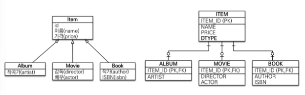
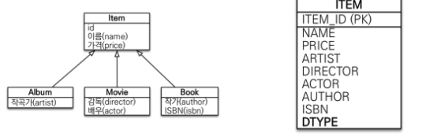
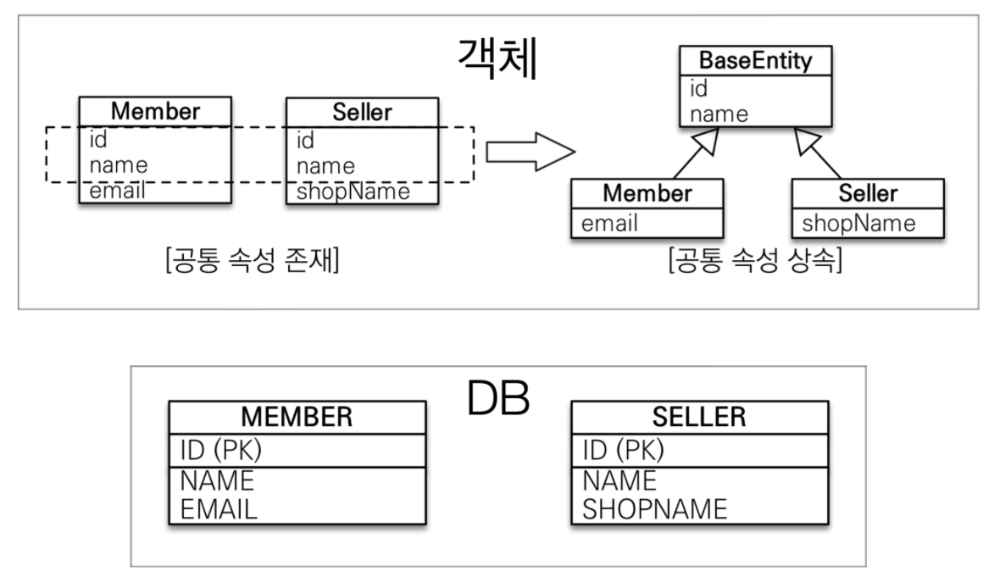
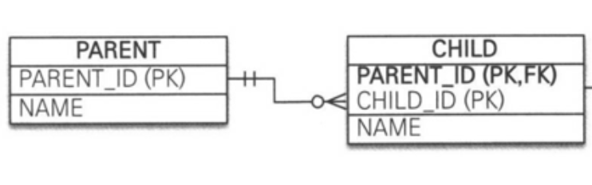
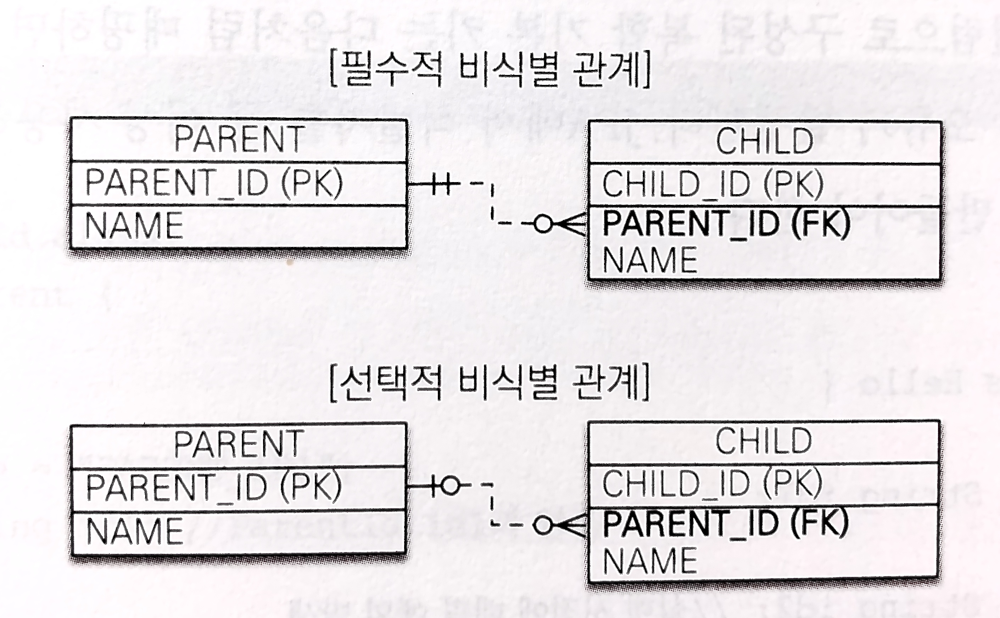
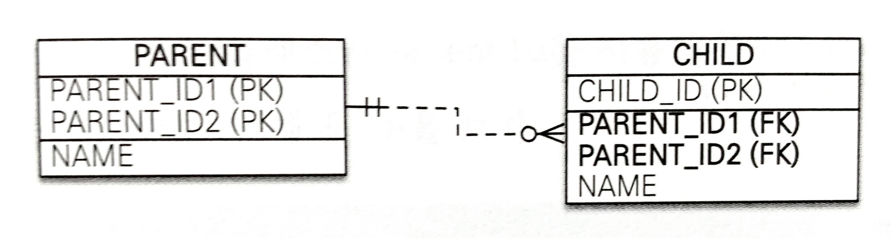
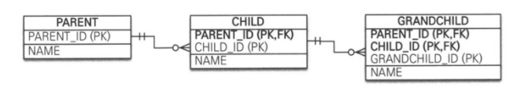
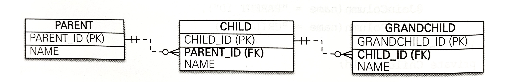
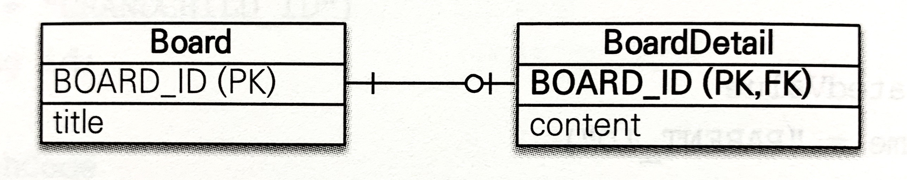

## 상속 관계 매핑
ORM에서 이야기하는 상속 관계 매핑은 객체의 상속 구조와 데이터베이스의 슈퍼/서브 타입 관계를 매핑하는 것이다.<br>
슈퍼/서브 타입 논리 모델을 실제 물리 모델인 테이블로 구현할 때는 3가지 방법을 선택할 수 있다.
* 각각의 테이블로 변환 - 조인 전략
* 통합 테이블로 변환 - 단일 테이블 전략
* 서브타입 테이블로 변환 - 구현 클래스마다 테이블 전략

### 조인 전략(Joined Strategy)
엔티티를 각각 모두 테이블로 만들고 자식 테이블이 부모 테이블의 기본 키를 받아서 기본 키 + 외래 키로 사용하는 전략이다.

```java
@Entity
@Inheritance(strategy = InheritanceType.JOINED)
@DiscriminatorColumn(name = "DTYPE")
public abstract class Item {
        
    @Id @GeneratedValue
    @Column(name = "ITEM_ID")
    private Long id;

    private String name;    //  이름 
    private int price;      //  가격

    ...
}

@Entity
@DiscriminatorValue("A")
public class Album extends Item {
    
    private String artist;
    
    ...
}

@Entity
@DiscriminatorValue("M")
public class Movie extends Item {
    
    private String director;    //  감독  
    private String actor;       //  배우
}

@Entity
@DiscriminatorValue("B")
@PrimaryKeyJoinColumn(name = "BOOK_ID") //  ID 재정의
public class Book extends Item {

    private String author;  //  작가
    private String isbn;    //  ISBN
    ...
}
```
<table>
  <thead>
    <tr>
      <th>어노테이션</th>
      <th>기능</th>
      <th>기본 값</th>
    </tr>
  </thead>
  <tbody>
    <tr>
      <td>@Inheritance(strategy = InheritanceType.JOINED)</td>
      <td>상속 매핑은 부모 클래스에 @Inheritance를 사용해야 한다. 그리고 strategy로 매핑 전략을 지정한다.</td>
      <td>SINGLE_TABLE</td>
    </tr>
    <tr>
      <td>@DiscriminatorColumns(name = "DTYPE")</td>
      <td>부모 클래스에 구분 컬럼명(DTYPE)을 지정한다. @DiscriminatorColumns로 줄여도 된다.</td>
      <td>DTYPE</td>
    </tr>
    <tr>
      <td>@DiscriminatorValue("M")</td>
      <td>엔티티 저장할 때 구분 컬럼에 입력할 값을 지정한다. 영화 엔티티 저장 시 구분 컬럼인 DTYPE값으로 M이 저장된다.</td>
      <td>엔티티 이름</td>
    </tr>
    <tr>
      <td>@PrimaryKeyJoinColumn(name = "BOOK_ID")</td>
      <td>기본 값으로 자식 테이블은 부모 테이블의 ID 컬럼명을 그대로 사용하는데, 자식 테이블의 기본 키 컬럼명을 변경하고 사용한다.</td>
      <td></td>
    </tr>
  </tbody>
</table>

### 특징
JPA 표준 명세는 구분 컬럼을 사용하도록 하지만 하이버네이크를 포함한 몇 구현체는 구분 컬럼(@DiscriminatorColumn)없이도 동작한다.
#### 장점
* 테이블이 정규화된다.
* 외래 키 참조 무결성 제약조건을 활용할 수 있다.
* 저장공간을 효율적으로 사용한다.

#### 단점
* 조회할 때 조인이 많이 사용되므로 성능이 저하될 수 있다.
* 조회 쿼리가 복잡하다.
* 데이터를 등록할 INSERT SQL을 두 번 실행한다.

### 단일 테이블 전략
테이블을 하나만 사용하고 구분 컬럼(DTYPE)으로 어떤 자식 데이터가 저장되었는지 구분한다. 조회할 때 조인을 사용하지 않으므로 일반적으로 가장 빠르다.<br>
주의할 점은 `자식 엔티티가 매핑할 컬럼은 모두 null을 허용해야 한다.` 예를 들어 Book 엔티티를 저장하면 ITEM 테이블의 AUTHOR, ISBN 컬럼만 사용하고 다른 엔티티와 매핑된 ARTIST, DIRECTOR, ACTOR 컬럼은 사용하지 않으므로 null이 입력되기 떄문이다. 

```java
@Entity
@Inheritance(strategy = InheritanceType.SINGLE_TABLE)   //  default가 SINGLE_TABLE이므로 strategy 생략 가능
@DiscriminatorColumn(name = "DTYPE")
public abstract class Item {

    @Id @GeneratedValue
    @Column(name = "ITEM_ID")
    private Long id;

    private String name;    //  이름 
    private int price;      //  가격

    ...
}

@Entity
@DiscriminatorValue("A")
public class Album extends Item {...}

@Entity
@DiscriminatorValue("M")
public class Movie extends Item {...}

@Entity
@DiscriminatorValue("B")
public class Book extends Item {...}

```

### 특징
구분 컬럼을 꼭 사용해야 한다. 따라서 @DiscriminatorColumn을 꼭 설정해야 한다.<br>
@DiscriminatorValue를 지정하지 않으면 기본으로 엔티티 이름을 사용한다.(ex. Movie, Album, Book)
#### 장점
* 조인이 필요 없으므로 일반적으로 조회 성능이 빠르다.
* 조회 쿼리가 단순하다.
#### 단점
* 자식 엔티티가 매핑한 컬럼은 모두 null을 허용해야 한다.
* 단일 테이블에 모든 것을 저장하므로 테이블이 커질 수 있다. 그러므로 상황에 따라서는 조회 성능이 오히려 느려질 수 있다.

### 구현 클래스마다 테이블 전략
자식 엔티티마다 테이블을 만들고 각각의 자식 테이블마다 필요한 컬럼이 모두 있다. 일반적으로 추천되지 않는 전략이다.

```java
@Entity
@Inheritance(strategy = InheritanceType.TABLE_PER_CLASS)
public abstract class Item {
    
    @Id @GeneratedValue
    @Column(name = "ITEM_ID")
    private Long id;

    private String name;    //  이름 
    private int price;      //  가격
    ...
}

@Entity
public class Album extends Item {...}

@Entity
public class Movie extends Item {...}

@Entity
public class Book extends Item {...}

```

### 특징
구분 컬럼이 사용되지 않는다. DBA나 ORM 전문가 모두 추천하지 않는 전략으로 조인이나 단일 테이블 전략을 고려하자.
#### 장점
* 서브 타입을 구분해서 처리할 때 효과적이다.
* not null 제약조건을 사용할 수 있다.
#### 단점
* 여러 자식 테이블을 함께 조회할 때 성능이 느리다.(SQL에 UNION을 사용해야 한다.)
* 자식 테이블을 통합해서 쿼리하기 어렵다.

## @MappedSuperclass
`@MappedSuperclass`는 부모 클래스와 자식 클래스 모두 데이터베이스 테이블과 매핑하는 것이 아닌 `부모 클래스는 테이블과 매핑하지 않고 부모 클래스를 상속 받는 자식 클래스에게 매핑 정보만 제공할 때` 사용 된다.<br>
추상 클래스와 비슷한 개념으로, @Entity와 달리 실제 테이블과 매핑되지 않는다. 단순히 매핑 정보를 상속할 목적으로만 사용된다.

id, name 두 공통 속성을 부모 클래스로 모으고 객체 상속 관계로 만든다.
```java
@MappedSuperclass
public abstract class BaseEntity {

    @Id @GeneratedValue
    private Long id;
    private String name;
    ...
}

@Entity
public class Member extends BaseEntity {

    // ID 상속
    // NAME 상속
    private String email;
    ...
}

@Entity
public class Seller extends BaseEntity {

    // ID 상속
    // NAME 상속
    private String shopName;
    ...
}
```
* @AttributeOverrides/@AttributeOverride
부모로 부터 물려받은 매핑 정보를 재정의 한다.
```java
@Entity
@AttributeOverride(name = "id", column = @Column(name = "MEMBER_ID"))
public class Member extends BaseEntity { ... }
```
상속 받은 id 속성의 컬럼명을 MEMBER_ID로 재정의했다. 둘 이상을 재정의 할 때는 @AttributeOverrides를 사용한다.
```java
@Entity
@AttributeOverrides({
    @AttributeOverride(name = "id", column = @Column(name = "MEMBER_ID"))
    @AttributeOverride(name = "name", column = @Column(name = "MEMBER_NAME"))
})
public class Member extends BaseEntity { ... }
```
### 특징
* 테이블과 매핑되지 않고 자식 클래스에 엔티티의 매핑 정보를 상속하기 위해 사용한다.
* @MappedSuperclass로 지정한 클래스는 엔티티가 아니므로 em.find()나 JPQL에서 사용할 수 없다.
* 이 클래스를 직접 생성해서 사용할 일은 거의 없으므로 추상 킅래스로 만드는 것을 권장한다.
> 엔티티(@Entity)는 엔티티(@Entity)이거나 @MappedSuperclass로 지정한 클래스만 상속받을 수 있다.

## 복합 키와 식별 관계 매핑
### 식별 관계 vs 비식별 관계
데이터베이스 테이블 사이에 관계는 외래 키가 기본 키에 포함되는지 여부에 따라 식별 관계와 비식별 관계로 구분한다.
#### 식별 관계
부모 테이블의 기본 키를 내려받아서 `자식 테이블의 기본 키 + 외래 키`로 사용하는 관계다.


#### 비식별 관계
부모 테이블의 기본 키를 받아서 `자식 테이블의 외래 키`로만 사용하는 관계다.

비식별 관계는 외래 키에 NULL을 허용하는지에 따라 필수적/선택적 비식별 관계로 나뉜다.
* 필수적 비식별 관계(Mandatory)<br>
외래 키에 NULL을 허용하지 않는다. 연관관계를 필수적으로 맺어야 한다.
* 선택적 비식별 관계(Optional)<br>
외래 키에 NULL을 허용한다. 연관관계를 맺을지 말지 선택할 수 있다.

### 복합 키를 활용한 비식별 관계 매핑
JPA에서 식별자를 둘 이상 사용하려면 별도의 식별자 클래스를 만들어야 한다.<br>
JPA는 영속성 컨텍스트에 엔티티를 보관할 때 엔티티의 식별자를 키로 사용한다. 그리고 식별자를 구분하기 위해 equals와 hashCode를 사용하여 동등성 비교를 한다. 그런데 식별자 필드가 하나일 때는 보통 자바의 기본 타입을 사용하므로 문제가 없지만, 식별자 필드가 2개 이상이면 별도의 식별자 클래스를 만ㄷ르고 그 곳에 equals와 hashCode를 구현해야 한다.<br>
JPA는 복합 키를 지원하기 위해 `@IdClass`와 `@EmbeddedId` 2가지 방법을 제공한다.

#### @IdClass
`관계형 데이터베이스에 더 가까운 방법`으로 아래와 같이 사용된다.

```java
@Entity
@IdClass(ParentId.class)
public class Parent {

    @Id
    @Column(name = "PARENT_ID1")
    private String id1; //  ParentId.id1과 연결

    @Id
    @Column(name = "PARENT_ID2")
    private String id2; //  ParentId.id2과 연결

    private String name;
    ...
}
```
```java
public class ParentId implements Serializable {

    private String id1; //  Parent.id1 매핑
    private String id2; //  Parent.id2 매핑

    public ParentId() {}
    
    public ParentId(String id1, String id2) {
        this.id1 = id1;
        this.id2 = id2;
    }

    @Override
    public boolean equals(Object o) {...}

    @Override
    public int hashCode() {...}
}
```
@IdClass를 사용하기 위한 식별자 클래스는 다음 조건을 만족해야 한다.
* 식별자 클래스의 속성명과 엔티티에서 사용하는 식별자의 속성명이 같아야 한다.(ex. Parent.id1과 ParentId.id1)
* Serializable 인터페이스를 구현해야 한다.
* equals, hashCode를 구현해야 한다.
* 식별자 클래스는 public 이어야 한다.

```java
Parent parent = new Parent();
parent.setId1("myId1"); //  식별자
parent.setId2("myId2"); //  식별자
parent.setName("parentName");
em.persist(parent);
```
복합 키를 사용한 엔티티를 저장하는 코드로, ParentId 식별자 클래스가 보이지 않는데 이는 em.persist()를 호출하면 영속성 컨텍스트에 엔티티를 등록하기 직전에 내부에서 Parent.id1, Parent.id2 값을 사용해서 식별자 클래스인 ParentId를 생성하고 영속성 컨텍스트의 키로 사용한다.

```java
ParentId parentId = new ParentId("myId1", "myId2");
Parent parent = em.find(Parent.class, parentId);
```
복합 키로 parent 엔티티를 조회해오는 코드다.

```java
@Entity
public class Child {
    
    @Id
    private String id;

    @ManyToOne
    @JoinColumns({
        @JoinColumn(name = "PARENT_ID1",
            referencedColumnName = "PARENT_ID1"),
        @JoinColumn(name = "PARENT_ID2",
            referencedColumnName = "PARENT_ID2"),
    })
    private Parent parent;
}
```
부모 테이블의 기본 키 컬럼이 복합 키이므로 자식 테이블의 외래 키도 복합 키다. 따라서 외래 키 매핑 시, 여러 컬럼을 매핑해야 하므로 @JoinColumns 어노테이션을 사용하고 각각의 외래 키 컬럼을 @JoinColumn으로 매핑한다.
> 예제와 같이 @JoinColumn의 name 속성과 referencedColumnName 속성의 값이 같으면 referencedColumnName은 생략해도 된다.

#### @EmbeddedId
`객체지향적인 방법`으로 아래와 같이 사용된다.
```java
@Entity
public class Parent {
    @EmbeddedId
    private ParentIdPK id;

    private String name;
    ...
}
```
```java
@Embeddable
public class ParentIdPK implements Serializable {
    
    @Column(name = "PARENT_ID1")
    private String id1;

    @Column(name = "PARENT_ID2")
    private String id2;

    //  equals and hashCode 구현
    ...
}
```
@EmbeddedId를 적용한 식별자 클래스는 식별자 클래스에 기본 키를 직접 매핑한다.<br>
@EmbeddedId를 적용한 식별자 클래스는 다음 조건을 만족해야 한다.
* @Embeddable 어노테이션을 붙여 줘야한다.
* Serializable 인터페이스를 구현해야 한다.
* equals, hashCode를 구현해야 한다.
* 기본 생성자가 있어야 한다.
* 식별자 클래스는 public 이어야 한다.

```java
Parent parent = new Parent();
ParentIdPK parentId = new ParentIdPK("myId1", "myId2");
parent.setId(parentId);
parent.setName("parentName");
em.persist(parent);
```
위와 같이 저장하는 코드를 보면 식별자 클래스 parentId를 직접 생성해서 사용한다.

```java
ParentIdPK parentId = new ParentIdPK("myId1", "myId2");
Parent parent = em.find(Parent.class, parentId);
```
조회 코드도 식별자 클래스 parentId를 직접 사용한다.

#### 복합 키와 equals(), hashCode()
> 복합 키는 equals()와 hashCode()를 필수로 구현해야 한다.

Object 클래스에 구현된 equals()는 기본적으로 인스턴스 참조 값 비교인 == 비교(동일성 비교)를 하기 때문에 오버라이딩을 통해 동등성 비교가 가능하도록 구현이 필요하다.<br>
영속성 컨텍스트는 기본적으로 엔티티의 식별자를 키로 사용해서 엔티티를 관리하고, 식별자를 비교할 때 equals()와 hashCode()를 사용하기 때문에 동등성이 지켜지지 않으면 예상과 다른 엔티티가 조회되거나 엔티티를 찾을 수 없는 등의 문제가 발생한다. 따라서 복합 키는 equals()와 hashCode()를 필수로 구현해야 한다.

#### @IdClass vs @EmbeddedId
특정 상황에 따라 @EmbeddedId를 사용했을 때 JPQL이 더 길어질 수 있다.
```java
em.createQuery("select p.id.id1, p.id.id2 from Parent p");  //  @EmbeddedId
em.createQuery("select p.id1, p.id2 from Parent p");        //  @IdClass
``` 
> 복합 키에는 @GenerateValue를 사용할 수 없다. 복합 키를 구성하는 여러 컬럼 중 하나에도 사용할 수 없다.

### 복합 키를 활용한 식별 관계 매핑

부모, 자식, 손자까지 계속 기본 키를 전달하는 식별 관계다. 식별 관계에서 자식 테이블은 부모 테이블의 기본 키를 포함해서 복합 키를 구성해야 하므로 @IdClass나 @EmbeddedId를 사용해서 식별자를 매핑해야 한다.

#### @IdClass를 활용한 식별 관계
```java
//  부모
@Entity
public class Parent {

    @Id @Column(name = "PARENT_ID")
    private String id;
    private String name;
    ...
}

//  자식
@Entity
@IdClass(ChildId.class)
public class Child {

    @Id
    @ManyToOne
    @JoinColumn(name = "PARENT_ID")
    public Parent parent;

    @Id @Column(name = "CHILD_ID")
    private String childId;

    private String name;
    ...
}

//  자식 ID
public class ChildId implements Serializable {

    private String parent;  //  Child.parent 매핑
    private String childId; //  Child.childId 매핑

    //  equals, hashCode 구현
    ...
}

@Entity
@IdClass(GrandChildId.class)
public class GrandChild {
    
    @Id
    @ManyToOne
    @JoinColumns({
        @JoinColumn(name = "PARENT_ID"),
        @JoinColumn(name = "CHILD_ID")
    })
    private Child child;

    @Id @Column(name = "GRANDCHILD_ID")
    private String id;

    private String name;
    ...
}

//  손자 ID
public class GrandChildId implements Serializable {
    
    private ChildId child;  //  GrandChild.child 매핑 
    private String id;      //  GrandChild.id 매핑

    //  equals, hashCode
    ...
}
```
식별 관계는 기본 키 + 외래 키 여야 하므로 `@Id`와 `@ManyToOne`을 같이 사용하여 매핑한다.

#### @EmbeddedId를 활용한 식별 관계
@EmbeddedId를 활용하여 식별 관계를 구성할 때는 `@MapsId`를 사용해야 한다.
```java
//  부모
@Entity
public class Parent {

    @Id @Column(name = "PARENT_ID")
    private String id;

    private String name;
    ...
}

//  자식
@Entity
public class Child {

    @EmbeddedId
    private ChildIdPK id;

    @MapsId("parentId") //  ChildIdPK.parentId 매핑
    @ManyToOne
    @JoinColumn(name = "PARENT_ID")
    public Parent parent;

    private String name;
    ...
}

//  자식 ID
@Embeddable
public class ChildIdPK implements Serailizable {
    
    private String parentId;    //  @MapsId("parentId")로 매핑

    @Column(name = "CHILD_ID")
    private String id;

    //  equals, hashCode 구현
    ...
}

@Entity
public class GrandChild {

    @EmbeddedId
    private GrandChildId id;

    @MapsId("childId")  //  GrandChildIdPK.childId 매핑
    @ManyToOne
    @JoinColumns({
        @JoinColumn(name = "PARENT_ID"),
        @JoinColumn(name = "CHILD_ID")
    })
    private Child child;

    private String name;
    
    ...
}

// 손자 ID
@Embeddable
public class GrandChildPK implements Serializable {
    
    private ChildId chlidId;    //  @MapsId("childId")로 매핑

    @Column(name = "GRANDCHILD_ID")
    private String id;

    //  equals, hashCode 구현
    ...
}
```
@IdClass와 달리 @Id가 아닌 @MapsId로 외래 키와 기본 키를 매핑하였다. @MapsId의 속성 값은 @EmbeddedId를 사용한 식별자 클래스의 기본 키 필드를 지정한다.

### 비식별 관계로 구현

```java
//  부모
@Entity
public class Parent {

    @Id @GeneratedValue
    @Column(name = "PARENT_ID")
    private Long id;

    private String name;

    ... 
}

//  자식
@Entity
public class Child {

    @Id @GeneratedValue
    @Column(name = "CHILD_ID")
    private Long id;

    private String name;

    @ManyToOne
    @JoinColumn(name = "PARENT_ID") //  생략하게 되면 parent_PARENT_ID 로 컬럼명 생성
    private Parent parent;
    
    ...
}

//  손자
@Entity
public class GrandChild {
    
    @Id @GeneratedValue
    @Column(name = "GRANDCHILD_ID")
    private Long id;

    private String name;

    @ManyToOne
    @JoinColumn(name = "CHILD_ID") //   생략하게 되면 child_CHILD_ID 로 컬럼명 생성
    private Child child;

    ...
}
```
식별 관계와 비교하면 복합 키가 없으므로 복합 키 클래스를 생성하지 않아도 돼서 매핑도 쉽고 코드도 단순하다.

### 일대일 식별 관계

```java
//  부모
@Entity
public class Board {
    
    @Id @GeneratedValue
    @Column(name = "BOARD_ID")
    private Long id;

    private String title;

    @OneToOne(mappedBy = "board")
    private BoardDetail boardDetail;

    ...
}

//  자식
@Entity
public class BoardDetail {

    @Id
    private Long boardId;

    @MapsId //  BoardDetail.boardId 매핑
    @OneToOne
    @Column(name = "BOARD_ID")
    private Board board;

    private String content;

    ...
}
```
BoardDetail처럼 식별자가 단순히 컬럼 하나면 @MapsId를 사용하고 속성 값은 비워두면 @MapsId는 @Id를 사용해서 식별자로 지정한 BoardDetail.boardId와 매핑된다.

### 식별 vs 비식별 관계
#### 데이터베이스 설계 관점에서 비식별 관계를 선호하는 이유
* 부모 테이블의 기본 키를 자식 테이블로 전파하면서 자식 테이블의 기본 키 컬럼이 점점 늘어난다. 따라서 `조인 할 때 SQL이 복잡해지고 기본 키 인덱스가 불필요하게 커질 수 있다.`<br>
* 2개 이상의 컬럼을 합해서 복합 기본 키를 만들어야 하는 경우가 많다.<br>
* 식별 관계 사용 시, 기본 키로 비즈니스 의미가 있는 자연 키 컬럼을 조합하는 경우가 많다. 반면에 비식별 관계의 기본 키는 비즈니스와 전혀 관계없는 대리 키를 주로 사용한다. 비즈니스 요구사항은 언젠가는 변하기 마련이기 때문에 식별 관계의 자연 키 컬럼들이 자식에 손자까지 전파되면 변경이 어렵다.<br>
* 식별 관계는 부모 테이블의 기본 키를 자식 테이블의 기본 키로 사용하므로 비식별 관계보다 테이블 구조가 유연하지 못하다.
#### 객체 관계 매핑의 관점에서 비식별 관계를 선호하는 이유
* 일대일 관계를 제외하고 식별 관계는 2개 이상의 컬럼을 묶은 복합 기본 키를 사용한다. JPA에서는 복합 키 사용 시 별도의 클래스를 만들어야 하므로 더 번거롭다.
* 비식별 관계의 기본 키는 주로 대리 키를 사용하는데 JPA는 @GeneratedValue처럼 대리 키를 생성하기 위한 편리한 방법이 제공된다.
#### 식별 관계가 갖는 장점
* 기본 키 인덱스 활용이 좋다.
* 상위 테이블들의 기본 키 컬럼을 자식, 손자 테이블들이 가지고 있어 특정 상황에 조인 없이 하위 테이블만으로 검색이 가능하다.

> 비식별 관계를 주로 사용하고 기본 키는 Long 타입의 대리 키를 사용하는 것이 좋다. 대리 키는 비즈니스와 연관이 없기 때문에 비즈니스가 변경되어도 유연한 대처가 가능하기 때문이다.

> 선택적 비식별 관계는 NULL을 허용되어 연관관계를 맺을지 선택할 수 있기 때문에 조인할 때 반드시 외부 조인을 사용해야 하는 반면, 필수적 비식별 관계는 NOT NULL로 항상 연관 관계가 있다는 것을 보장하므로 내부 조인만 사용해도 된다.

## 조인 테이블
데이터베이스 테이블의 연관관계를 설계하는 방법은 크게 2가지이다.
* 조인 컬럼 사용(외래 키)
테이블 간의 관계는 외래 키 컬럼을 사용하여 관리된다.<br>
선택적 비식별 관계가 적용될 경우, 외래 키에 null을 허용해야 하기 떄문에 반드시 외부 조인이 적용돼야 한다. 내부 조인이 적용된다면 조회되지 않는 경우가 발생한다.<br>
관계 빈도가 낮다면 외래 키 대부분이 null로 저장되는 단점도 있다.

* 조인 테이블 사용(테이블 사용)
테이블 하나를 새로 추가해야 한다는 단점이 있다. 따라서 관리해야 하는 테이블이 늘고 그 만큼 조인해야 하는 테이블 수도 늘어난다.

> 기본으로는 조인 컬럼을 사용하고, 필요할 때 조인 테이블을 적용하는 것이 좋다.

### 일대일 조인 테이블
일대일 관계를 만드려면 조인 테이블의 외래 키 컬럼 각각에 총 2개의 유니크 제약조건을 걸어야 한다.

```java
//  부모
@Entity
public class Parent {
    
    @Id @GeneratedValue
    @Column(name = "PARENT_ID")
    private Long id;
    private String name;

    @OneToOne
    @JoinTable(name = "PARENT_CHILD",
                joinColumns = @JoinColumn(name = "PARENT_ID"),
                inverseJoinColumns = @JoinColumn(name = "CHILD_ID")
    )
    private Child child;
    ...
}

//  자식
@Entity
public class Child {

    @Id @GeneratedValue
    @Column(name = "CHILD_ID")
    private Long id;
    private String name;
    ...
}
```
* @JoinTable
<table>
  <thead>
    <tr>
      <th>속성</th>
      <th>기능</th>
      <th>기본 값</th>
    </tr>
  </thead>
  <tbody>
    <tr>
      <td>name</td>
      <td>매핑할 조인 테이블 이름</td>
      <td></td>
    </tr>
    <tr>
      <td>joinColumns</td>
      <td>현재 엔티티를 참조하는 외래 키</td>
      <td></td>
    </tr>
    <tr>
      <td>inverseJoinColumns</td>
      <td>반대방향 엔티티를 참조하는 외래 키</td>
      <td></td>
    </tr>
  </tbody>
</table>

양방향 매핑은 아래를 추가해야 한다.

```java
public class Child {
    ...
    @OneToOne(mappedBy = "child")
    private Parent parent;
}
```

### 일대다 조인 테이블
일대다 관계를 만드려면 조인 테이블의 컬럼 중 다(N)와 관련된 컬럼인 CHILD_ID에 유니크 제약조건을 걸어야 한다.

일대다 단방향 매핑 예시 코드이다.
```java
//  부모
@Entity
public class Parent {
   
    @Id @GeneratedValue
    @Column(name = "PARENT_ID")
    private Long id;
    private String name;

    @OneToMany
    @JoinTable(name = "PARENT_CHILD",
                joinColumns = @JoinColumns(name = "PARENT_ID"),
                inverseJoinColumns = @JoinColumn(name = "CHILD_ID")
    )
    private List<Child> child = new ArrayList<Child>();
    ...
}

//  자식
@Entity
public class Child {
    
    @Id @GeneratedValue
    @Column(name = "CHILD_ID")
    private Long id;
    private String name;
    ...
}
```

### 다대일 조인 테이블
다대일 양방향 매핑 예시 코드이다.
```java
//  부모
@Entity
public class Parent {
   
    @Id @GeneratedValue
    @Column(name = "PARENT_ID")
    private Long id;
    private String name;

    @OneToMany(mappedBy = "parent")
    private List<Child> child = new ArrayList<Child>();
    ...
}

//  자식
public class Child {
    
    @Id @GeneratedValue
    @Column(name = "CHILD_ID")
    private Long id;
    private String name;

    @ManyToOne(optional = false)
    @JoinTable(name = "PARENT_CHILD",
                joinColumns = @JoinColumns(name = "PARENT_ID"),
                inverseJoinColumns = @JoinColumn(name = "CHILD_ID")
    )
    private Parent parent;
    
}
```

### 다대다 조인 테이블
다대다 관계를 만드려면 조인 테이블의 두 컬럼을 합해서 하나의 복합 유니크 제약조건을 걸어야 한다.(PARENT_ID, CHILD_ID는 복합 기본 키이므로 유니크 제약조건이 걸려있다.)

```java
//  부모
public class Parent {

    @Id @GeneratedValue
    @Column(name = "PARENT_ID")
    private Long id;
    private String name;

    @ManyToMany
    @JoinTable(name = "PARENT_CHILD",
            joinColumns = @joinColumn(name = "PARENT_ID"),
            inverseJoinColumns = @JoinColumn(name = "CHILD_ID")
    )
    private List<Child> child = new ArrayList<>();
    ...
}

//  자식
@Entity
public class Child {

    @Id @GeneratedValue
    @Column(name = "CHILD_ID")
    private Long id;
    private String name;
    ...
}
```

> 조인 테이블에 컬럼을 추가하면 @JoinTable 전략을 사용할 수 없다. 대신에 새로운 엔티티를 만들어서 조인 테이블과 매핑해야 한다.

## 엔티티 하나에 여러 테이블 매핑
@SecondaryTable을 사용하면 한 엔티티에 여러 테이블을 매핑할 수 있다.
```java
@Entity
@Table(name = "BOARD")
@SecondaryTable(name = "BOARD_DETAIL",
    pkJoinColumns = @PrimaryKeyJoinColumn(name = "BOARD_DETAIL_ID"))
public class Board {
    
    @Id @GeneratedValue
    @Column(name = "BOARD_ID")
    private Long id;

    private String title;

    @Column(table = "BOARD_DETAIL")
    private String content;
    ...
}   
```
Board 엔티티는 @Table을 사용해서 BOARD 테이블과 매핑했다. 그리고 @SecondaryTable을 사용해서 BOARD_DETAIL 테이블을 추가 매핑하였다. content 필드는 @Column(table = "BOARD_DETAIL")을 사용해서 BOARD_DETAIL 테이블의 컬럼에 매핑하였다. title 필드처럼 테이블을 지정하지 않으면 기본 테이블인 BOARD에 매핑된다.
* @SecondaryTable
<table>
  <thead>
    <tr>
      <th>속성</th>
      <th>기능</th>
      <th>기본 값</th>
    </tr>
  </thead>
  <tbody>
    <tr>
      <td>name</td>
      <td>매핑할 다른 테이블 이름</td>
      <td></td>
    </tr>
    <tr>
      <td>pkJoinColumns</td>
      <td>매핑할 다른 테이블의 기본 키 컬럼 속성</td>
      <td></td>
    </tr>
  </tbody>
</table>

> 더 많은 테이블을 매핑하려면 @SecondaryTables를 사용한다.

## 참조
https://cyr9210.github.io/2019/11/18/JPA/ORM-JPA07/ 