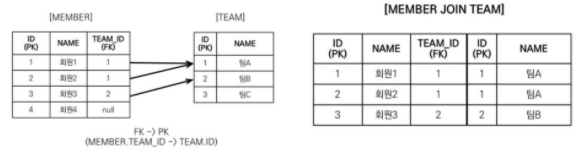
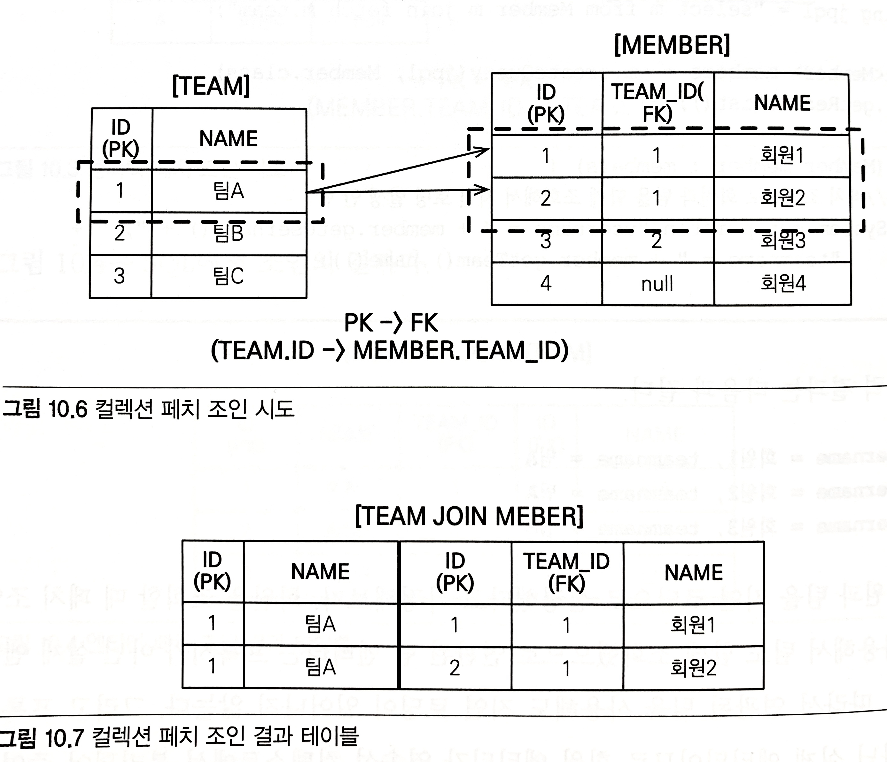
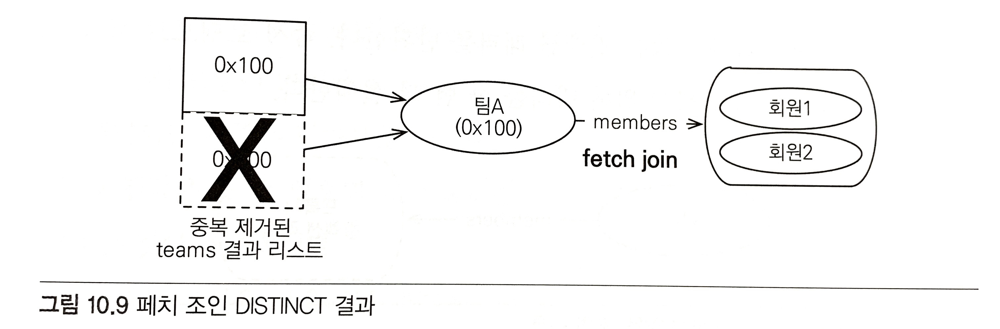

JPQL은 가장 중요한 객체지향 쿼리 언어이다.

## 객체지향 쿼리 소개
EntityManager.find() 메소드를 사용하면 식별자로 엔티티를 조회할 수 있고, 그래프 탐색을 통해 연관된 엔티티까지 조회할 수 있다. 하지만 좀 더 복잡한 검색 방법이 필요하게 되면 SQL로 필요한 내용을 최대한 걸러내어 사용해야 한다.<br>
결과적으로, ORM을 사용하게 되면 데이터베이스 테이블이 아닌 엔티티 객체를 대상으로 개발하게 되므로 검색도 테이블이 아닌 엔티티 객체를 대상으로 할 수 있어야 한다. 이 때 JPQL을 사용할 수 있다.
* JPQL의 특징
    * 테이블이 아닌 객체를 대상으로 검색하는 객체지향 쿼리다.
    * SQL을 추상화해서 특정 데이터베이스 SQL에 의존하지 않는다.

JPQL을 사용하게 되면 JPA는 JPQL을 분석하여 적절한 SQL로 만들어 데이터베이스를 조회한다. 그리고 조회한 결과로 엔티티 객체를 생성해서 반환한다.

> JPQL은 한마디로 객체지향 SQL이다.

JPA는 JPQL뿐만 아니라 다양한 검색 방법을 제공한다.
* JPA가 공식 지원하는 기능
    * JPQL(Java Persistence Query Language)
    * Criteria Query : JPQL을 편하게 작성하도록 도와주는 API, 빌더 클래스 모음
    * Native SQL : JPA에서 JPQL 대신 직접 SQL을 사용할 수 있다.

* JPA가 공식 지원하진 않지만 알아둬야 할 기능
    * QueryDSL : Criteria Query처럼 JPQL을 편하게 작성하도록 도와주는 빌더 클래스 모음. 비표준 오픈소스 프레임워크.
    * JDBC, MyBatis

> Criteria, QueryDSL은 JPQL을 편하게 작성하도록 도와주는 빌더 클래스일 뿐이다. 따라서 JPQL을 이해해야한다.

### JPQL 소개
데이터베이스 방언만 변경하면 JPQL을 수정하지 않아도 자연스럽게 데이터베이스를 변경할 수 있다. 예로, 같은 SQL함수라도 데이터베이스 마다 사용 문법이 다른 데 JPQL을 사용하면 제공하는 표준화된 함수를 사용하면 선택한 방언에 따라 해당 데이터베이스에 맞춘 적절한 SQL 함수가 실행된다.

> JPQL은 SQL 보다 간결하다. 엔티티 직접 조회, 묵시적 조인, 다형성 지원으로 SQL보다 코드가 간결하다.

```java
@Entity(name="Member")
public class Member {
    
    @Column(name = "name")
    private String username;
    //...
}

// 쿼리 생성
String jpql = "select m from Member as m where m.username = 'kim'";
List<Member> resultList = em.createQuery(jpql, Member.class).getResultList();
```
em.createQuery() 메소드를 통해 실행할 JPQL과 반환할 엔티티의 클래스 타입인 Member.class 를 넘겨주고 getResultList() 메소드를 통해 JPA는 JPQL을 SQL로 변환하여 데이터베이스를 조회한다.

* 실행된 JPQL

```sql
select m
from Member as m
where m.username = 'kim'
```

* 실제 실행된 SQL

```sql
SELECT
    member.id AS id,
    member.age AS age,
    member.team_id AS team,
    member.name AS name
FROM
    Member member
WHERE
    member.name = 'kim'
```
### Criteria 쿼리 소개

> JPQL을 생성하는 빌더 클래스

* 장점

문자가 아닌 query.select(m).where(...) 처럼 프로그래밍 코드로 JPQL을 작성할 수 있다.<br>
코드로 JPQL을 작성하기 때문에 런타임이 아닌 `컴파일 시점에 오류를 발견`할 수 있다.
    * 컴파일 시점에 오류를 발견할 수 있다.
    * IDE를 사용하면 코드 자동완성을 지원한다.
    * 동적 쿼리를 작성하기 편하다.

```java
// JPQL
select m from Member as m where m.username = 'kim'

// Criteria 사용 준비
CriteriaBuilder cb = em.getCriteriaBuilder();
CriteriaQuery<Member> query = cb.createQuery(Member.class);

// 루트 클래스(조회를 시작할 클래스)
Root<Member> m = query.from(Member.class);

// 쿼리 생성
CriteriaQuery<Member> cq = query.select(m).where(cb.equal(m.get("username"), "kim"));
List<Member> resultList = em.createQuery(cq).getResultList();
```
위와 같이 Criteria를 활용하여 쿼리를 문자가 아닌 코드로 작성할 수 있다.<br>
아쉬운 점은 m.get("username") 처럼 필드 명을 코드가 아닌 문자로 작성한 것인데 `메타 모델(MetaModel)`을 활용하면 해결할 수 있다.<br>

```java
//  메타 모델 사용 전 -> 사용 후
m.get("username") -> m.get(Member_.username)
```
"username"대신 Member_.username이라는 코드로 활용할 수 있다. 하지만 복잡하고 장황해진다. 가독성도 떨어진다.

### QueryDSL 소개

> Criteria와 마찬가지로 JPQL 빌더 역할을 한다.

* 장점
코드 기반이면서 단순하고 사용하기 쉽다. 작성한 코드도 JPQL과 비슷해서 한눈에 들어온다.

> QueryDSL은 JPA 표준은 아니고 오픈소스 프로젝트이다.

```java
// 준비
JPAQuery query = new JPAQuery(em);
QMember member = QMember.member;

// 쿼리, 결과조회
List<Member> members = query.from(member).where(member.username.eq("kim")).list(member);
```

queryDSL도 어노테이션 프로세서를 사용하여 쿼리 전용 클래스(Qclass)를 만들어야 한다.

### 네이티브 SQL 소개
JPA에서 SQL을 직접 사용할 수 있는 기능을 제공하는데 이를 네이티브 SQL이라고 한다.<br>
JPQL을 사용해도 가끔 특정 데이터베이스에 의존하는 기능을 사용해야 할 때가 있는데, (ex. Oracle CONNECT BY 기능이나 특정 데이터베이스에서만 동작하는 SQL 힌트) 이런 기능들은 JPQL로 구현할 수 없다.<br>
이처럼 SQL만 지원되고 JPQL에서는 지원되지 않는 기능을 사용해야 할 때 네이티브 SQL을 사용하면 된다.

> 단점 : 특정 데이터베이스에 의존하는 SQL을 작성해야 한다. 따라서 SQL 의존성이 높은 코딩을 할 수 밖에 없다.

```java
String sql = "SELECT ID, AGE, TEAM_ID, NAME FROM MEMBER WHERE NAME = 'kim'";
List<Member> resultList = em.createNativeQuery(sql, Member.class).getResultList();
```

네이티브 SQL은 em.createNativeQuery() 를 사용하면 된다.

### JDBC 직접 사용, MyBatis 같은 SQL Mapper 프레임워크 사용
JDBC나 MyBatis를 JPA와 함께 사용하면 `영속성 컨텍스트를 적절한 시점에 강제로 flush`해야 한다. 둘 모두 JPA를 우회해서 데이터베이스에 접근하기 때문에 JDBC나 MyBatis를 활용한 SQL은 JPA에서 인식하지 못하게 된다. 결과적으로 최악의 경우에는 `영속성 컨텍스트와 데이터베이스의 불일치 상태가 발생하여 데이터 무결성이 훼손`될 수 있다.<br>
> 이런 이슈를 해결하기 위해 `JPA를 우회해서 SQL을 실행하기 직전에 영속성 컨텍스트를 수동으로 flush`하여 `데이터베이스와 영속성 컨텍스트를 동기화`하면 된다.
> 스프링 AOP를 활용하여 JPA를 우회하여 데이터베이스에 접근하는 메소드를 실행할 때 마다 영속성 컨텍스트를 flush하면 위 이슈를 해결할 수 있다.
 

## JPQL
* JPQL 특징
    * JPQL은 객체지향 쿼리 언어로써, 테이블을 대상으로 쿼리하는 것이 아닌 엔티티 객체를 대상으로 쿼리한다.
    * JPQL은 SQL을 추상화하여 특정 데이터베이스 SQL에 의존하지 않는다.
    * JPQL은 결국 SQL로 변환된다.
    
### 기본 문법과 쿼리 API
SQL과 비슷하게 SELECT, UPDATE, DELETE 문을 사용할 수 있고 엔티티 저장시에는 EntityManager.persist() 메소드를 활용하면 되므로 INSERT문은 없다.

```java
select_문 :: =
    select_절
    from_절
    [where_절]
    [groupby_절]
    [having_절]
    [orderby_절]

update_문 :: = update_절 [where_절]
delete_문 :: = delete_절 [where_절]
```

#### SELECT 문
```java
SELECT m FROM Member AS m WHERE m.username = 'Hello';
```
* 대소문자 구분

엔티티와 속성은 대소문자를 구분한다. Member, username은 대소문자를 구분하나, SELECT, FROM 같은 JPQL 키워드는 대소문자를 구분하지 않는다.

* 엔티티 이름

JPQL에서 사용한 Member는 클래스 명이 아니라 엔티티 명이다. 엔티티 명을 지정하지 않으면 `클래스 명을 기본 값으로 사용`한다.

* 별칭은 필수

`JPQL은 별칭이 필수`로, 별칭 없이 작성하게 되면 잘못된 문법이라는 오류가 발생한다. AS는 생략이 가능하여 Member m 과 같은 형식으로 사용 가능하다.

#### TypeQuery, Query
작성한 JPQL을 실행하려면 쿼리 객체가 필요한데, 쿼리 객체는 TypeQuery와 Query가 있다. 반환할 타입이 명확하면 TypeQuery, 명확하지 않으면 Query 객체를 사용하면 된다.

```java
TypeQuery<Member> query = em.createQuery("SELECT m FROM Member m", Member.class);

List<Member> resultList = query.getResultList();
for (Member member : resultList) {
    System.out.println("member = " + member);
}

Query query = em.createQuery("SELECT m.username, m.age, FROM Member m");

List resultList = query.getResultList();

for (Object o : resultList) {
    Object[] result = (Object[]) o; //  결과가 둘 이상이면 Object[] 반환
    System.out.println("username = " + result[0]);
    System.out.println("age = " + result[1]);
}
```

em.createQuery() 의 두 번째 파라미터에 반환할 타입 지정 유무에 따라 TypeQuery or Query으로 반환된다.<br>
Query 객체는 SELECT 절의 조회 대상이 예제처럼 둘 이상이면 Object[] 를 반환하고 SELECT 절의 조회 대상이 하나면 Object를 반환한다.

> 타입 변환이 필요 없는 TypeQuery를 사용하는 것이 더 편리하다.

#### 결과 조회
아래 메소드들을 호출함으로써 실제 쿼리를 실행하여 데이터베이스를 조회한다.

* query.getResultList() : 결과를 예제로 반환한다. 만약 결과가 없으면 빈 컬렉션을 반환한다.
* query.getSingleResult() : 결과가 정확히 하나일 때 사용한다.
    * 결과가 없으면 javax.persistence.NoResultException 예외가 발생한다.
    * 결과가 1개보다 많으면 javax.persistence.NonUniqueResultException 예외가 발생한다.

> getSingleResult() 는 결과가 정확히 1개가 아니면 예외가 발생한다는 점을 주의해야 한다.

### 파라미터 바인딩
위치 기준 파라미터만 제공하는 JDBC와 달리 JPQL은 이름 기준 파라미터 바인딩도 지원한다.

* 파라미터 바인딩의 이점
    * JPQL을 수정하여 파라미터 바인딩을 사용하지 않으면 SQL Injection 공격을 당할 수 있다.
    * 파라미터 바인딩을 사용하면 파라미터 값은 달라도 같은 쿼리로 인식하기 때문에 JPA는 JPQL을 SQL로 파싱한 결과를 재사용하게 됨으로써 성능 상 이점이 있다.
    * 데이터베이스 내부에서 실행한 SQL을 파싱해서 사용하는데 같은 쿼리는 파싱한 결과를 재사용할 수 있다.
    
> 파라미터 바인딩은 선택이 아닌 필수다.

### 프로젝션
프로젝션(Projection)이란 SELECT 절에 조회할 대상을 지정하는 것을 말한다. [SELECT {프로젝션 대상} FROM]으로 대상을 선택한다.<br>
프로젝션 대상은 엔티티, 임베디드 타입, 스칼라 타입(문자, 숫자 등의 기본 데이터 타입)이 있다.

* 엔티티 프로젝션

SELECT m FROM Member m      //  회원
SELECT m.team FROM Member m //  팀

조회할 컬럼을 하나하나 나열해서 조회하는 것이 아닌 원하는 객체를 바로 조회할 수 있다. 이렇게 조회한 엔티티는 영속성 컨텍스트에서 관리된다.

* 임베디드 타입 프로젝션

JPQL에서 임베디드 타입은 엔티티와 거의 비슷하게 사용된다. 다만, 임베디드 타입은 조회의 시작점이 될 수 없다. `String query = "SELECT a FROM Address a";`는 임베디드 타입인 Address를 조희의 시작점으로 잘못 사용한 예시다.<br>

```java
String query = "SELECT o.address FROM Order o";
List<Address> addresses = em.createQuery(query, Address.class).getResultList();
```

Order 엔티티를 시작점으로 하여 임베디드 타입인 Address 엔티티를 조회해 올 수 있다.

> 임베디드 타입은 엔티티 타입이 아닌 값 타입이므로, 영속성 컨텍스트에서 관리되지 않는다.

* 스칼라 타입 프로젝션

숫자, 문자, 날짜와 같은 기본 데이터 타입들을 스칼라 타입이라고 한다. 예를 들어 전체 회원의 이름을 조회하려면 아래와 같이 쿼리하면 된다.
```java
List<String> username = em.createQuery("SELECT username FROM Member m", String.class).getResultList();
```

* 여러 값 조회

엔티티를 대상으로 조회하면 편리하겠지만, 꼭 필요한 데이터들만 선택해서 조회해야 할 때는 Query 객체를 사용해야 한다.

```java
List<Object[]> resultList = em.createQuery("SELECT m.username, m.age FROM Member m").getResultList();

for (Object[] row : resultList) {
    String username = (String) row[0];
    Integer age = (Integer) row[1];
}
```
스칼라 타입 뿐만 아니라 엔티티 타입도 여러 값을 함께 조회할 수 있다.

```java
List<Object[]> resultList = em.createQuery("SELECT o.member, o.product, o.orderAmount FROM Order o").getResultList();

for (Object[] row : resultList) {
    Member member = (Member) row[0];    //  엔티티
    Product product = (Product) row[1]; //  엔티티
    int orderAmount = (Integer) row[2]; //  스칼라
}
```

물론 함께 영속성 컨텍스트에서 관리된다.

* NEW 명령어

실무에서는 위 처럼 프로젝션 사용 시, Object[] 를 직접 사용하지 않고 DTO와 같은 객체로 변환하여 사용하게 된다. 허나 일일히 조회해올 때 마다 객체 변환 작업은 번거롭기 때문에 new 명령어를 사용한다. 

```java
TypedQuery<UserDTO> query = em.createQuery("SELECT new jpabook.jpql.UserDTO(m.username, m.age) FROM Member m", UserDTO.class);

List<UserDTO> resultList = query.getResultList();
```
SELECT 다음에 NEW 명령어를 사용하여 반환받을 클래스를 지정할 수 있는데 이 클래스의 생성자에 JPQL 조회 결과를 넘겨줄 수 있다. 그리고 NEW 명령어를 사용한 클래스로 TypeQuery 사용할 수 있어, 객체 변환 작업도 줄일 수 있다.<br>

> NEW 명령어 사용 시 아래 2가지를 주의해야 한다.
>   * 패키지 명을 포함한 전체 클래스 명을 입력해야 한다.
>   * `순서`와 `타입`이 일치하는 `생성자가 필요`하다.

### 페이징 API
페이징 처리용 SQL 작성은 번거롭고 또한 데이터베이스마다 페이징을 처리하는 SQL 문법이 다른 문제를 JPA는 두 API로 추상화하였다.

* setFirstResult(int startPosition) : 조회 시작 위치(0부터 시작)
* setMaxResults(int maxResult) : 조회할 데이터 수

```java
TypedQuery<Member> query = em.createQuery("SELECT m FROM Member m ORDER BY m.username DESC", Member.class);

query.setFirstResult(10);   //  11부터 시작
query.setMaxResults(20);    //  11 ~ 30번 데이터를 조회
query.getResultList();
```

> 페이징 SQL을 더욱 최적화하고 싶다면 JPA가 제공하는 페이징 API가 아닌 네이티브 SQL을 직접 사용해야 한다.

### 집합과 정렬
일반적으로 통계 정보를 구할 때 사용한다.

* 집합 함수

<table>
  <thead>
    <tr>
      <th>함수</th>
      <th>설명</th>
      <th>반환 타입</th>
    </tr>
  </thead>
  <tbody>
    <tr>
      <td>COUNT</td>
      <td>결과 수를 구한다.</td>
      <td>Long</td>
    </tr>
    <tr>
      <td>MAX, MIN</td>
      <td>최대, 최소 값을 구한다. 문자, 숫자, 날짜 등에 사용한다.</td>
      <td></td>
    </tr>
    <tr>
      <td>AVG</td>
      <td>평균 값을 구한다. 숫자 타입만 사용할 수 있다.</td>
      <td>Double</td>
    </tr>
    <tr>
      <td>SUM</td>
      <td>합을 구한다. 숫자 타입만 사용할 수 있다.</td>
      <td>정수 합: Long, 소수 합: Double, BigInteger 합: BigInteger, BigDecimal 합: BigDecimal</td>
    </tr>
  </tbody>
</table>

* 집합 함수 사용 시 참고사항
    * NULL 값은 무시하므로 통계에 잡히지 않는다.(DISTINCT가 정의되어있어도 무시된다.)
    * 값이 없는데 SUM, AVG, MAX, MIN 함수를 사용하면 NULL 값이 된다. 단 COUNT는 0이 된다.
    * DISTINCT를 집합 함수 안에 사용해서 중복된 값을 제거하고 나서 집합을 구할 수 있다. (ex. select COUNT(DISTINCT m.age) from Member m)
    * DISTINCT를 COUNT에서 사용할 때 임베디드 타입은 지원하지 않는다.
    
* GROUP BY, HAVING
    * GROUP BY
    
    통계 데이터를 구할 때 특정 그룹끼리 묶어준다.
    
    * HAVING
    
    HAVING은 GROUP BY 와 함께 사용하는데 GROUP BY로 그룹화한 통계 데이터를 기준으로 필터링한다.
    
```sql
select t.name, COUNT(m.age), SUM(m.age), AVG(m.age), MAX(m.age), MIN(m.age)
from Member m LEFT JOIN m.team t
GROUP BY t.name
HAVING AVG(m.age) >= 10
```

문법은 다음과 같다.

groupby_절 ::= GROUP BY {단일값 경로 | 별칭}+
having_절 ::= HAVING 조건식

* 정렬(ORDER BY)

결과를 정렬할 때 사용한다.

orderby_절 ::= ORDER BY {상태필드 경로 | 결과 변수 [ASC | DESC]}+

### JPQL 조인
* 내부 조인

INNER JOIN을 사용한다.

> INNER 는 생략 가능하다.

```sql
SELECT m
FROM Member m INNER JOIN m.team t
where t.name = :teamName
```

JPQL 조인의 가장 큰 특징은 연관 필드를 사용한다는 것이다.

> 연관 필드 란, 위 소스에 m.team을 말하는데 다른 엔티티와 연관관계를 갖기 위해 사용하는 필드를 말한다. `FROM Member m JOIN Team t`과 같이 연관필드를 sql처럼 조인할 경우 오류가 발생한다.

* 외부 조인

```sql
SELECT m
FROM Member m LEFT [OUTER] JOIN m.team t
```

> OUTER 는 생략 가능하다. 보통 LEFT JOIN으로 사용한다.

* 컬렉션 조인

일대다/다대다 관계처럼 컬렉션을 사용하는 곳에 조인하는 것을 컬렉션 조인이라 한다.

> [회원 -> 팀]으로의 조인은 다대일 조인이면서 `단일 값 연관 필드(m.team)`를 사용한다.
> [팀 -> 회원]은 반대로 일대다 조인이면서 `컬렉션 값 연관 필드(m.members)`를 사용한다.

```sql
SELECT t, m
FROM Team t LEFT JOIN t.members m
```

여기서 t LEFT JOIN t.members 는 팀과 팀이 보유한 회원목록을 컬렉션 값 연관 필드로 외부 조인했다.

> 컬렉션 조인 시, JOIN 대신 IN을 사용할 수 있는데, 기능 상 JOIN과 같지만 컬렉션 일 때만 사용할 수 있다. 특별한 장점은 없다.

* 세타 조인

WHERE절을 사용하여 세타 조인이 가능하다. 세타 조인은 내부 조인만 지원한다. 세타 조인을 활용하면 전혀 관계 없는 엔티티도 조인이 가능해진다.

* JOIN ON 절(JPA 2.1 이상 부터 지원)

ON 절을 사용하면 `조인 대상을 필터링하고 조인`할 수 있다. 참고로 내부 조인의 ON 절은 WHERE 절을 사용할 때와 결과가 같으므로 보통 ON 절은 외부 조인에서만 사용한다.

```sql
//  JPQL
select m, t from Member m
left join m.team t on t.name = 'A'

//  SQL
SELECT m.*, t.* FROM Member m
LEFT JOIN Team t ON m.TEAM_ID=t.id and t.name='A'
```

SQL 결과를 보면 and t.name='A' 로 조인 시점에 조인 대상을 필터링한다.

> 조인 종류 참조 [https://dlucky.tistory.com/33](https://dlucky.tistory.com/33)

### 페치 조인
SQL에는 없는, JPQL에서 성능의 최적화를 위해 제공하는 기능이다. 연관된 엔티티나 컬렉션을 한 번에 같이 조회하는 기능인데, join fetch 명령어로 사용할 수 있다.

페치 조인 ::= [ LEFT [OUTER] | INNER | JOIN FETCH 조인 경로]

* 엔티티 페치 조인

```sql
// JPQL
select m
from Member m join fetch m.team

// 실제 실행된 SQL
SELECT M.*, T.*
FROM MEMBER T
INNER JOIN TEAM T ON M.TEAM_ID=T.ID
```

> 페치 조인에서는 별칭을 사용할 수 없다.(하이버네이트는 허용)



select m으로 회원엔티티만 선택했지만 SQL은 회원과 연관된 팀도 함께 조회된다.<br>
```java
String jpql = "select m from Member m join fetch m.team";

List<Member> members = em.createQuery(jpql, Member.class).getResultList();

for (Member member : members) { //  페치 조인으로 회원과 팀을 함께 조회하여 지연 로딩 발생 안함
    System.out.println("username = " + member.getUsername() + ", teamname = " + member.getTeam().name());
}

// 출력결과
username = 회원1, teamname = 팀A
username = 회원2, teamname = 팀A
username = 회원3, teamname = 팀B
```

회원과 팀을 지연 로딩으로 설정했다고 가정했을 때, 회원을 조회할 때 `페치 조인을 사용해서 팀도 함께 조회되므로 연관된 팀 엔티티는 프록시가 아닌 실제 엔티티`다. 따라서 연관된 팀을 사용해도 지연 로딩이 일어나지 않는다.<br>
그리고 프록시가 아닌 실제 엔티티이므로 회원 엔티티가 영속성 컨텍스트에서 분리되어 준영속 상태가 되어도 연관된 팀을 조회할 수 있다.

* 컬렉션 페치 조인

일대다 관계인 컬렉션 페치 조인을 실행하면 아래와 같다.

```sql
// JPQL
select t
from Team t join fetch t.members
where t.name = '팀A'

// 실행된 SQL
SELECT T.*, M.*
FROM TEAM t
INNER JOIN MEMBER M ON T.ID=M=TEAM_ID
WHERE T.NAME = '팀A'
```


팀 테이블의 `팀A`는 하나지만, MEMBER 테이블과 조인하면서 결과가 증가하여 `회원1`과 `회원2`를 갖는 `팀A`가 2건 조회되게 된다.
> 일대다 조인은 결과가 증가할 수 있지만, 일대일/다대일 조인은 결과가 증가하지 않는다.

> fetch join 원리 참조 [https://www.inflearn.com/questions/34797](https://www.inflearn.com/questions/34797)

* 페치 조인과 DISTINCT

JPQL의 DISTINCT 명령어는 SQL의 DISTINCT에 더하여 애플리케이션에서 한 번 더 중복을 제거한다.<br>
바로 직전에 컬렉션 페치 조인은 팀A가 중복으로 조회된다.
```sql
select distinct t
from Team t join fetch t.members
where t.name = '팀A'
```
먼저 SQL에 distinct가 추가되지만 sql에 의한 결과 데이터는 아래와 같이 중복이 없기 때문에 중복 제거가 되지 않는다.
<table>
  <thead>
    <tr>
      <th>로우 번호</th>
      <th>팀</th>
      <th>회원</th>
    </tr>
  </thead>
  <tbody>
    <tr>
      <td>1</td>
      <td>팀A</td>
      <td>회원1</td>
    </tr>
    <tr>
      <td>2</td>
      <td>팀A</td>
      <td>회원2</td>
    </tr>
  </tbody>
</table>

그 후, 애플리케이션에서 distinct 명령어가 적용되는데 `select distinct t`의 의미는 `팀 엔티티의 중복을 제거`하라는 것이다. 따라서 중복인 팀A는 아래 처럼 하나만 조회되게 된다.



* 페치 조인 vs 일반 조인

```sql
// JPQL 내부 조인
select t
from Team t join t.members m
where t.name = '팀A'

// SQL
SELECT T.*
FROM TEAM T
INNER JOIN MEMBER M ON T.ID=M.TEAM_ID
WHERE T.NAME = '팀A'
```

팀과 회원 컬렉션을 일반 조인으로 조회 시, 회원 컬렉션도 함께 조회할 것으로 기대해선 안된다. 

> JPQL은 결과를 반환할 때, 연관관계까지 고려하지 않는다. 단지 SELECT 절에 지정한 엔티티만 조회할 뿐이다.

따라서 결과적으로, `팀 엔티티만 조회하고 연관된 회원 컬렉션은 조회되지 않는다.` 만약 회원 컬렉션을 `지연 로딩으로 설정하면 프록시 혹은 아직 초기화하지 않은 컬렉션 래퍼를 반환`한다.<br>
`즉시 로딩으로 설정하면 회원 컬렉션을 즉시 로딩하기 위해 쿼리를 한 번 더 실행`한다.<br>

반면에, 페치 조인을 사용하면 연관된 엔티티도 함께 조회한다.

```sql
// 컬렉션 페치 조인 JPQL
select t
from Team t join fetch t.members
where t.name = '팀A'

// 실행된 SQL
SELECT T.*, M.*
FROM TEAM T INNER JOIN MEMBER M ON T.ID=M.TEAM_ID
WHERE T.NAME = '팀A'
``` 

* 페치 조인의 특징과 한계
    * 특징
        * SQL 한 번으로 연관된 엔티티들을 함께 조회할 수 있어, `SQL 호출 횟수를 줄여 성능을 최적화`할 수 있다.
        * 페치 조인은 글로벌 로딩 전략(ex. @OneToMany(fetch = FetchType.LAZY))보다 우선순위가 높다.
        * 페치 조인은 연관된 엔티티를 쿼리 시점에 조회하므로 지연 로딩이 발생하지 않는다. 따라서 준영속 상태에서도 객체 그래프를 탐색할 수 있다.
        
        > 최적화 방안으로 글로벌 로딩 전략을 사용하게 되면 애플리케이션 전체에서 항상 즉시 로딩이 일어나게 되면서 오히려 성능에 악영향을 끼칠 수 있다. 따라서 되도록 글로벌 로딩 전략은 지연 로딩을 사용하고 최적화가 필요할 때 페치 조인을 적용하는 것이 효과적이다.

    * 한계
        * 페치 조인 대상에는 별칭을 줄 수 없다.
        
        따라서, SELECT/WHERE 절, 서브 쿼리에서 페치 조인 대상을 사용할 수 없다.<br>
        하이버네이트에서는 사용할 수는 있지만, 잘못 사용하면 데이터 무결성이 깨질 수 있으므로 주의해야 한다.(ex. 2차캐시 -> 16장 참조)
        * 둘 이상의 컬렉션을 페치할 수 없다.
        
        구현체에 따라 되기도 하지만 컬렉션 * 컬렉션의 카테시안 곱이 만들어지므로 주의해야 한다.
        * 컬렉션을 페치 조인하면 페이징 API를 사용할 수 없다.
        
        컬렉션(일대다)이 아닌 단일 값 연관 필드(일대일, 다대일)들은 페치 조인을 사용해도 페이징 API를 사용할 수 있다.<br>
        
        > 하이버네이트에서 컬렉션을 페치 조인하고 페이징 API를 사용하면 경고 로그가 뜨면서 메모리에서 페이징 처리를 하게 된다. 따라서 데이터가 많으면 성능 이슈나 메모리 초과 예외가 발생할 수 있어 위험하다.

* 정리

페치 조인은 SQL 한 번으로 여러 연관된 엔티티를 조회할 수 있어, 성능 최적화에 상당히 유용하다. 또한 객체 그래프를 유지할 때 효과적이다.<br>
반면, 여러 테이블을 조인해서 엔티티가 가진 모양이 아닌 전혀 다른 결과가 나오는 경우, 페치 조인 보다는 DTO로 반환하는 것이 더 효과적일 수 있다.

### 경로 표현식
.(점)을 찍어 객체 그래프를 탐색하는 것을 경로 표현식이라 한다.

```sql
select m.username
from Member m
    join m.team t
    join m.orders o
where t.name = '팀A'
```
여기서 m.username, m.team, m.orders, t.name이 모두 경로 표현식을 사용한 예다.

* 상태 필드(state field) : 단순 값을 저장하기 위한 필드(필드 or 프로퍼티)
* 연관 필드(association field) : 연관관계를 위한 필드, 임베디드 타입 포함(필드 or 프로퍼티)
    * 단일 값 연관 필드: @ManyToOne, @OneToOne, 대상이 엔티티
    * 컬렉션 값 연관 필드 : @OneToMany, @ManyToMany, 대상이 컬렉션
    
```java
@Entity
public class Member {
    
    @Id @GeneratedValue
    private Long id;

    @Column(name = "name")
    private String username;    //  상태 필드
    private Integer age;        //  상태 필드

    @ManyToOne(..)
    private Team team;          //  연관 필드(단일 값 연관 필드)

    @OneToMany(..)
    private List<Order> orders; //  연관 필드(컬렉션 값 연관 필드)
}
```

* 경로 표현식의 특징
    * 상태 필드 : 경로 탐색의 끝. 더는 탐색 할 수 없다.
    * 단일 값 연관 경로 : 묵시적으로 내부 조인(묵시적 조인)이 일어난다. 단일 값 연관 경로는 계속 탐색할 수 있다.
    > 참고로 묵시적 조인은 모두 내부 조인이다. 외부 조인은 명시적으로 JOIN 키워드를 사용해야 한다.

    * 컬렉션 값 연관 경로 : 묵시적으로 내부 조인이 일어난다. 더는 탐색할 수 없다. 단 FROM 절에서 조인을 통해 별칭을 얻으면 별칭으로 탐색할 수 있다.
```sql
select m.username from Team t join t.members m
```
join t.members m으로 컬렉션에 새로운 별칭을 줌으로써 별칭 m부터 다시 경로 탐색이 가능해진다.

> 컬렉션의 크기를 구할 수 있는 size라는 기능을 사용하게 되면 COUNT 함수를 사용하는 SQL로 적절히 변환된다. (ex. select t.members.size from Team t)

* 경로 탐색을 사용한 묵시적 조인 시 주의사항
    * 항상 내부 조인이다.
    * 컬렉션은 경로 탐색의 끝이다. 컬렉션에서 경로 탐색을 하려면 명시적으로 조인해서 별칭을 얻어야 한다.
    * 경로 탐색은 주로 SELECT, WHERE 절에서 사용하지만 묵시적 조인으로 인해 SQL의 FROM 절에 영향을 준다.
    
    > 묵시적 조인은 조인이 일어나는 상황을 한눈에 파악하기 어렵기 때문에 `성능이 중요하면 분석하기 쉽도록,` 묵시적 조인보다는 명시적 조인을 사용하는 것이 좋다.

### 서브 쿼리
서브 쿼리는 WHERE, HAVING 절에서만 사용할 수 있고 SELECT, FROM 절에서는 사용할 수 없다.

* 서브 쿼리 함수
    * EXISTS : 서브쿼리에 결과가 존재하면 참. NOT은 반대
        * 문법 : [NOT] EXISTS (subquery)
    * {ALL | ANY | SOME}
        * 문법 : {ALL | ANY | SOME} (subquery)
        * ALL : 조건을 모두 만족하면 참
        * ANY or SOME : 조건을 하나라도 만족하면 참
    * IN : 서브쿼리의 결과 중 하나라도 같은 것이 있으면 참.(서브쿼리가 아닌 곳에서도 사용가능)
        * 문법 : [NOT] IN (subquery)
            
### 조건식
#### 타입 표현
대소문자는 구분하지 않는다.
<table>
  <thead>
    <tr>
      <th>종류</th>
      <th>설명</th>
      <th>예제</th>
    </tr>
  </thead>
  <tbody>
    <tr>
      <td>문자</td>
      <td>작은 따옴표 사이에 표현<br>작은 따옴표를 표현할 때는 연속 두 개 사용</td>
      <td>'HELLO'<br>'She''s'</td>
    </tr>
    <tr>
      <td>숫자</td>
      <td>L(Long 타입 지정)<br>D(Double 타입 지정)<br>F(Float 타입 지정)</td>
      <td>10L<br>10D<br>10F</td>
    </tr>
    <tr>
      <td>날짜</td>
      <td>DATE {d 'yyyy-mm-dd'}<br>TIME {t 'hh-mm-ss'}<br>DATETIMES {ts 'yyyy-mm-dd hh:mm:ss.f'}</td>
      <td>{d '2012-03-23'}<br>{t '10-11-11'}<br>{ts '2012-02-12 10-11-11.123'}<br>m.createDate = {d '2012-12-12'}</td>
    </tr>
    <tr>
      <td>Boolean</td>
      <td>TRUE, FALSE</td>
      <td></td>
    </tr>
    <tr>
      <td>Enum</td>
      <td>패키지명을 포함한 전체 이름을 사용해야 한다.</td>
      <td>jpabook.MemberType.Admin</td>
    </tr>
    <tr>
      <td>엔티티 타입</td>
      <td>엔티티의 타입을 표현한다. 주로 상속과 관련해서 사용한다.</td>
      <td>TYPE(m) = Member</td>
    </tr>
  </tbody>
</table>

#### 연산자 우선 순위
우선순위는 아래와 같다.
1. 경로 탐색 연산(.)
2. 수학 연산: +, -(단항 연산자), *, /, +, -
3. 비교 연산: =, >, >=, <=, <>(다름), [NOT] BETWEEN, [NOT] LIKE, [NOT] IN, IS [NOT] NULL, IS [NOT] EMPTY, [NOT] MEMBER [OF], [NOT] EXISTS
4. 논리 연산: NOT, AND, OR

#### 컬렉션 식
컬렉션 식은 컬렉션에서만 사용하는 특별한 기능이다. 컬렉션에서는 `컬렉션 식 이외에 다른 식은 사용할 수 없다.`
##### 빈 컬렉션 비교 식 
컬렉션에 값이 비었으면 참<br>
문법 : { 컬렉션 값 연관 경로 } IS [NOT] EMPTY(is null은 사용할 수 없음)
##### 컬렉션의 멤버 식 
엔티티나 값이 컬렉션에 포함되어 있으면 참<br>
문법 : {엔티티나 값} [NOT] MEMBER [OF] {컬렉션 값 연관 경로}
##### 스칼라 식
숫자, 문자, 날짜, case, 엔티티 타입(엔티티의 타입 정보) 같은 가장 기본적인 타입들을 말한다.<br>
* 문자함수
<table>
  <thead>
    <tr>
      <th>함수</th>
      <th>설명</th>
      <th>예제</th>
    </tr>
  </thead>
  <tbody>
    <tr>
      <td>CONCAT(문자1, 문자2, ...)</td>
      <td>문자를 합한다.</td>
      <td>CONCAT('A', 'B') = AB</td>
    </tr>
    <tr>
      <td>SUBSTRING(문자, 위치, [길이])</td>
      <td>위치부터 시작해 길이만큼 문자를 구한다. 길이 값이 없으면 나머지 전체 길이를 뜻한다.</td>
      <td>SUBSTRING('ABCDEF', 2, 3) = BCD</td>
    </tr>
    <tr>
      <td>TRIM([[LEADING | TRAILING | BOTH] [트림 문자] FROM ] 문자)</td>
      <td>LEADING: 왼쪽만, TRAILING: 오른쪽만, BOTH: 양쪽 다 트림 문자를 제거한다. 기본 값은 BOTH. 트림 문자의 기본 값은 공백이다.</td>
      <td>TRIM(' ABC  ') = 'ABC'</td>
    </tr>
    <tr>
      <td>LOWER(문자)</td>
      <td>소문자로 변경</td>
      <td>LOWER('ABC') = 'abc'</td>
    </tr>
    <tr>
      <td>UPPER(문자)</td>
      <td>대문자로 변경</td>
      <td>UPPER('abc') = 'ABC'</td>
    </tr>
    <tr>
      <td>LENGTH(문자)</td>
      <td>문자 길이</td>
      <td>LENGTH('ABC') = 3</td>
    </tr>
    <tr>
      <td>LOCATE(찾을 문자, 원본 문자, [검색시작위치])</td>
      <td>검색위치부터 문자를 검색한다. 1부터 시작, 못 찾으면 0 반환</td>
      <td>LOCATE('DE', 'ABCDEFG') = 4</td>
    </tr>
  </tbody>
</table>

* 수학함수
<table>
  <thead>
    <tr>
      <th>함수</th>
      <th>설명</th>
      <th>예제</th>
    </tr>
  </thead>
  <tbody>
    <tr>
      <td>ABS(수학식)</td>
      <td>절대값</td>
      <td>ABS(-10) = 10</td>
    </tr>
    <tr>
      <td>SQRT(수학식)</td>
      <td>제곱근</td>
      <td>SQRT(4) = 2.0</td>
    </tr>
    <tr>
      <td>MOD(수학식, 나눌 수)</td>
      <td>나머지</td>
      <td>MOD(4,3) = 1</td>
    </tr>
    <tr>
      <td>SIZE(컬렉션 값 연관 경로식)</td>
      <td>컬렉션의 크기</td>
      <td>SIZE(t.members)</td>
    </tr>
    <tr>
      <td>INDEX(별칭)</td>
      <td>LIST 타입 컬렉션의 위치 값을 구함. 단, 컬렉션이 @OrderColumn을 사용하는 LIST 타입일 때만 사용</td>
      <td>t.members m where INDEX(m) > 3</td>
    </tr>
  </tbody>
</table>

* 날짜 함수 - 데이터베이스의 현재 시간을 조회
    * CURRENT_DATE: 현재 날짜
    * CURRENT_TIME: 현재 시간
    * CURRENT_TIMESTAMP: 현재 날짜 시간
    
##### CASE 식
특정 조건에 따라 분기할 때 사용. 4가지 종류가 있다.
* 기본 CASE

```sql
CASE
    {WHEN <조건식> THEN <스칼라식>}+
    ELSE <스칼라식>
END
```
* 심플 CASE : 조건식을 사용할 수 없지만, 문법이 단순. java의 switch case문과 비슷.

```sql
CASE <조건대상>
    {WHEN <스칼리식1> THEN <스칼리식2>}+
    ELSE <스칼라식>
END
```
* COALESCE : 스칼라식을 차례대로 조회해서 null이 아니면 조회된 값 그대로 반환, null이면 대체 문구를 반환한다.
```sql
COALESCE(<스칼라식> {,<스칼라식>}+)
```
* NULLIF : 두 값이 같으면 null 반환. 다르면 첫 번째 값을 반환. 집합 함수는 null을 포함하지 않으므로 보통 집합 함수와 함께 사용.
```sql
NULLIF(<스칼라식>, <스칼라식>)
```

### 다형성 쿼리
JPQL로 부모 엔티티를 조회하면 그 자식 엔티티도 함께 조회한다.
```java
@Entity
@Inheritance(strategy = InheritanceType.SINGLE_TABLE)
@DiscriminatorColumn(name = "DTYPE")u
public abstract class Item {...}

@Entity
@DiscriminatorValue("B")
public class Book extends Item {
    ...
    private String author;
}

// Album, Movie 생략
```

#### TYPE
엔티티의 상속 구조에서 조회 대상을 특정 자식 타입으로 한정할 떄 주로 사용한다.

ex) Item 중에 Book, Movie를 조회하라.
```sql
//JPQL
select i from Item i
where type(i) IN (Book, Movie)

//SQL
SELECT i FROM Item i
WHERE i.DTYPE in ('B', 'M')
```

#### TREAT(JPA 2.1 부터 지원)
자바의 타입 캐스팅과 비슷한 기능으로, 상속 구조에서 부모 타입을 특정 자식 타입으로 다룰 때 사용한다.

ex) 부모인 Item과 자식 Book이 있다.
```sql
//JPQL
select i from Item i where treat(i as Book).author = 'kim'

//SQL
select i.* from Item i
where
    i.DTYPE = 'B'
    and i.author='kim'
```
JPQL을 보면 treat을 사용하여 부모 타입인 Item을 자식 타입인 Book으로 다룬다. 따라서 author 필드에 접근이 가능하다.

### 사용자 정의 함수 호출(JPA 2.1 부터 지원)
```sql
function_invocation::= FUNCTION(function_name {, function_arg}*)
```

ex)
```sql
select function('group_concat', i.name) from Item i
```
하이버네이트 구현체를 사용하려면 방언 클래스를 상속하여 구현하고 사용할 데이터베이스 함수를 미리 등록해야 한다.

### 기타 정리
* enum은 = 비교 연산만 지원한다.
* 임베디드 타입은 비교를 지원하지 않는다.

#### EMPTY STRING
JPA 표준은 ''을 길이 0인 EMPTY STRING으로 정했지만 데이터베이스에 따라 ''를 NULL로 사용하는 데이터베이스도 있으므로 확인해야 한다.
#### NULL 정의
* 조건을 만족하는 데이터가 하나도 없으면 NULL이다.
* NULL은 알 수 없는 값(Unkown Value)이다. NULL과의 모든 수학적 계산 결과는 NULL이 된다.
* Null == Null 은 알 수 없는 값이다.
* Null is Null은 참이다.

### 엔티티 직접 사용
#### 기본 키 값
객체 인스턴스는 참조 값으로 식별하고 테이블 row는 기본 키 값으로 식별한다. 따라서 JPQL에서 엔티티 객체를 직접 사용하면 SQL에서는 해당 엔티티의 기본 키값을 사용한다.
```sql
select count(m.id) from Member m    //  엔티티의 아이디를 사용
select count(m) from Member m       //  엔티티를 직접 사용

// 실행되는 실제 sql
select count(m.id) as cnt from Member m //  count(m)이 SQL에서 count(m.id)로 변환된다.
```
엔티티를 직접 사용하면 JPQL이 SQL로 변환될 때 해당 엔티티의 기본 키를 사용하게 됨으로써 실제 실행된 SQL은 같게 된다.

#### 외래 키 값
```java
Team team = em.find(Team.class, 1L);

String qlString = "select m from Member m where m.team = :team";
List resultList = em.createQuery(qlString).setParameter("team", team).getResultList();

// 실행되는 SQL
select m.*
from Member m
where m.team_id=? (팀 파라미터의 ID 값)
```
m.team은 현재 team_id라는 외래 키와 매핑되어 있다. 따라서 위와 같은 SQL이 실행된다.<br>
엔티티 대신 아래와 같이 식별자 값을 직접 사용할 수 있다.
```java
String qlString = 'select m from Member m where m.team.id = :teamId";
List resultList = em.createQuery(qlString).setParameter("teamId", 1L).getResultList();
```

m.team.id를 보면 Member와 Team 간에 묵시적 조인이 일어날 것 같지만 `MEMBER 테이블이 team_id 외래 키를 가지고 있으므로 묵시적 조인은 일어나지 않는다.`<br>
물론, m.team.name을 호출하면 묵시적 조인이 일어난다. 따라서 m.team이든 m.team.id든 생성되는 SQL은 같다.

### Named 쿼리: 정적 쿼리
JPQL 쿼리는 동적/정적 쿼리로 나눌 수 있다.
* 동적 쿼리

em.createQuery("select ..") 처럼 JPQL을 문자로 완성해서 직접 넘기는 것을 동적 쿼리라 한다.<br>
런타임에 특정 조건에 따라 JPQL을 동적으로 구성할 수 있다.
* 정적 쿼리

미리 정의한 쿼리에 이름을 부여하여 필요할 때 사용할 수 있는데 이를 `Named 쿼리`라 한다. 이 것은 한번 정의하면 변경할 수 없는 정적 쿼리다.

Named 쿼리는 애플리케이션 로딩 시점에 JPQL 문법을 미리 체크하고 미리 파싱해둔다. 따라서 오류를 빨리 확인할 수 있고, 사용하는 시점에는 파싱된 결과를 재사용하므로 성능상 이점도 있다.<br>
그리고 Named 쿼리는 변하지 않는 정적 SQL이 생성되므로 데이터베이스의 조회 성능 최적화에도 도움이 된다.<br>
Named 쿼리는 @NamedQuery 어노테이션을 사용해서 자바 코드에 작성하거나 또는 XMl 문서에 작성할 수 있다.

#### Named 쿼리 어노테이션 정의
Named 쿼리는 이름 그대로 쿼리에 이름을 부여해서 사용한다.
* Named 쿼리 정의
```java
@Entity
@NamedQuery(
    name = "Member.findByUsername",
    query = "select m from Member m where m.username = :username"
)
public class Member {...}
```

* Named 쿼리 사용
```java
List<Member> resultList = em.createNamedQuery("Member.findByUsername", Member.class).setParameter("username", "회원1").getResultList();
```

em.createNamedQuery() 메소드를 활용하여 Named 쿼리 이름을 입력하여 사용한다.<br>
하나의 엔티티에 2개 이상의 Named 쿼리를 정의하려면 `@NamedQueries 어노테이션`을 사용하면 된다.

#### Named 쿼리 XML 정의
JPA에서 어노테이션으로 작성할 수 있는 것은 XML로도 작성할 수 있다.

> XML과 어노테이션에 같은 설정이 있으면 XML이 우선권을 갖는다.


## QueryDSL
Criteria와 마찬가지로 쿼리를 문자가 아닌 코드로 JPQL을 작성하여 컴파일 단계에서 문법 오류를 발견할 수 있고 IDE 자동완성 기능의 도움을 받을 수 있으며 쉽고 간결하다.

* 환경설정

Criteria의 메타 모델처럼 엔티티 기반의 쿼리 타입이라는 쿼리용 클래스를 생성해야 한다.<br>

```
project.afterEvaluate {

    project.tasks.compileQuerydsl.options.compilerArgs = [
        "-proc:only",
        "-processor", project.querydsl.processors() +
            ',lombok.launch.AnnotationProcessorHider$AnnotationProcessor'
    ]
}

querydsl {
    jpa = true
}

sourceSets {
    main {
        java {
            srcDir "src/querydsl/java"
        }
    }
}
```
```
def querydslSrcDir = 'src/main/generated'

querydsl {
    library = "com.querydsl:querydsl-apt"
    jpa = true
    querydslSourcesDir = querydslSrcDir
}

compileQuerydsl{
    options.annotationProcessorPath = configurations.querydsl
}

configurations {
    querydsl.extendsFrom compileClasspath
}

sourceSets {
    main {
        java {
            srcDirs = [querydslSrcDir]
        }
    }
}
```

### 시작
```java
public void queryDSL() {
    
    EntityManager em = emf.createEntityManager();

    JPAQuery query = new JPAQuery(em);
    QMember qMember = new QMember("m"); //  생성되는 JPQL의 별칭이 m
    List<Member> members = query.from(qMember)
                                .where(qMember.name.eq("회원1"))
                                .orderBy(qMember.name.desc())
                                .list(qMember);

}
```
queryDSL을 사용하기 위해 com.mysema.query.jpa.impl.JPAQuery 객체를 생성해야 하는데 이때 엔티티 매니저를 생성자에 넘겨준다. 다음으로 사용할 쿼리 타입(Q)을 생성하는데 생성자에는 별칭을 주면 된다. 이 별칭을 JPQL에서 별칭으로 사용한다.

* 기본 Q 생성

쿼리 타입(Q)은 사용하기 편리하도록 기본 인스턴스를 보관하고 있다. 하지만 같은 엔티티를 조인하거나 같은 엔티티를 서브쿼리에 사용하면 같은 별칭이 사용되므로 이 때는 별칭을 직접 지정해서 사용한다.

```java
import static jpabook.jpashop.domain.QMember.member;    //  기본 인스턴스

public void basic() {

    EntityManager em = emf.createEntityManager();

    JPAQuery query = new JPAQuery(em);
    List<Member> members = query.from(member)
                                .where(member.name.eq("회원1"))
                                .orderBy(member.name.desc())
                                .list(member);

}
```
위와 같이 import static 을 활용해서 코드를 더 간결하게 작성할 수 있다.

> JPAQueryFactory 란?

### 검색 조건 쿼리
```java
JPAQuery query = new JPAQuery(em);
QItem item = QItem.item;
List<Item> list = query.from(item)
                       .where(item.name.eq("좋은상품").and(item.price.gt(20000)))
                       .list(item); //  조회할 프로젝션 지정
```
```sql
select item
from Item item
where item.name = ?1 and item.price > ?2
```

> where 절에는 and나 or을 사용할 수 있다.
> .where(item.name.eq("좋은상품"), item.price.gt(20000))
> item.price.between(10000,20000);   //  가격이 10000원 ~ 20000원 상품
> item.name.contains("상품1");        //  상품1이라는 이름을 포함한 상품,  SQL의 like '%상품%' 검색
> item.name.startsWith("고급");       //  이름이 고급으로 시작하는 상품, SQL에서 like '고급%' 검색

### 결과 조회
보통 `uniqueResult()`나 `list()`같은 결과 조회 메소드를 사용하여 데이터베이스를 조회한다.

* uniqueResult() : 조회 결과가 한 건일 때 사용. 조회 결과가 없으면 null을 반환. 하나 이상이면 com.mysema.query.NonUniqueResultException 예외 발생
* singleResult() : uniqueResult()와 같지만 결과가 하나 이상이면 처음 데이터를 반환
* list() : 결과가 하나 이상일 때 사용. 결과가 없으면 빈 컬렉션을 반환.

### 페이징과 정렬
#### 정렬
```java
QItem item = QItem.item;

query.from(item)
     .where(item.price.gt(20000))
     .orderBy(item.price.desc(), item.stockQuantity.asc())
     .offset(10).limit(20)
     .list(item);
```
orderBy를 사용하여 정렬하는데 쿼리 타입(Q)이 제공하는 asc(), desc()를 사용한다.<br>
페이징은 offset과 limit을 적절히 조합해서 사용한다.

#### 페이징
```java
QueryModifiers queryModifiers = new QueryModifiers(20L, 10L);   //  limit, offset
List<Item> list = query.from(item)
                       .restrict(queryModifiers)
                       .list(item);
```
실제 페이징 처리를 하려면 검색된 전체 데이터 수를 알아야 한다. 이 때는 list() 대신 listResults()를 사용한다.
```java
SearchResults<Item> result = query.from(item)
                                  .where(item.price.gt(10000))
                                  .offset(10).limit(20)
                                  .listResults(item);

long total = result.getTotal(); //  검색된 전체 데이터 수
long limit = result.getLimit();
long offset = result.getOffset();
List<Item> results = result.getResults();   //  조회된 데이터
```
listResults()를 사용하면 전체 데이터 조회를 위한 count 쿼리를 한번 더 실행한다.<br>
SearchResults 객체를 통해 반환받게 되면 전체 데이터 수를 조회할 수 있다.

### 그룹
```java
query.from(item)
     .groupBy(item.price)
     .having(item.price.gt(1000))
     .list(item);
```

### 조인
innerJoint(join), leftJoin, rightJoin, fullJoin을 사용할 수 있고 JPQL의 on과 성능 최적화를 위한 fetch 조인도 사용할 수 있다.

* 기본 조인

```java
QOrder order = QOrder.order;
QMember member = QMember.member;
QOrderItem orderItem = QOrderItem.orderItem;

query.from(order)
     .join(order.member, member)
     .leftJoin(order.orderItems, orderItem)
     .list(order);
```

* 조인 on 사용

```java
query.from(order)
     .leftJoin(order.orderItems, orderItem)
     `on(orderItem.count.gt(2))
     .list(order);
```

* fetch 조인 사용

```java
query.from(order)
     .innerJoin(order.member, member).fetch()
     .leftJoin(order.orderItems, orderItem).fetch()
     .list(order);
```

* 세타 조인

```java
QOrder order = QOrder.order;
QMember member = QMember.member;

query.from(order, member)
     .where(order.member.eq(member))
     .list(order);
```

### 서브 쿼리
JPASubQuery 객체를 사용한다. 서브 쿼리의 결과가 하나면 unique(), 여러 건이면 list()를 사용한다.

```java
QItem item = QItem.item;
QItem itemSub = new QItem("itemSub");

query.from(item)
     .where(item.price.eq(
        new JPASubQuery().from(itemSub).unique(itemSub.price.max())
     ))
     .list(item);
```

### 프로젝션과 결과 반환
`select 절에 조회 대상을 지정하는 것`을 프로젝션이라 한다.

* 프로젝션 대상이 하나

```java
QItem item = QItem.item;
List<String> result = query.from(item).list(item.name);

for (String name : result) {
    System.out.println("name = " + name);
}
```

* 여러 컬럼 반환과 튜플

프로젝션 대상으로 여러 필드를 선택하면 QueryDSL은 기본으로 com.mysema.query.Tuple이라는 Map과 비슷한 내부 타입을 사용한다.<br>
조회 결과는 tuple, get() 메소드에 조회한 쿼리 타입을 지정한다.
```java
QItem item = QItem.item;

List<Tuple> result = query.from(item).list(item.name, item.price);
//  List<Tuple> result = query.from(item).list(new QTuple(item.name, item.price));

for (Tuple tuple : result) {
    System.out.println("name = " + tuple.get(item.name));
    System.out.println("price = " + tuple.get(item.price));
}
```

* 빈 생성

쿼리 결과를 엔티티가 아닌 특정 객체로 받고 싶을 때 빈 생성(Bean Population) 기능을 사용한다.

> QueryDSL의 객체 생성 방법은 다양하다.
>   * 프로퍼티 접근
>   * 필드 직접 접근
>   * 생성자 사용

원하는 빈 생성 방법을 지정하기 위해 com.mysema.query.Projections를 사용한다.

```java
public class ItemDTO {
    
    private String username;
    private int price;

    public ItemDTO() {}
    public ItemDTO(String username, int price) {
        this.username = username;
        this.price = price;
    }

    // Getter, Setter
    public String getUsername() {...}
    public void setUsername(String username) {...}
    public int getPrice() {...}
    public void setPrice(int price) {...}
}
```

* 프로퍼티 접근(setter)

```java
QItem item = QItem.item;
List<ItemDTO> result = query.from(item).list(
    Projections.bean(ItemDTO.class, item.name.as("username"), item.price)
);
``` 

Projections.bean() 메소드는 setter를 사용해서 값을 채운다.<br>
쿼리 결과와 매핑할 프로퍼티가 이름이 다르면 as를 사용해서 별칭을 주면 된다.

* 필드 직접 접근

```java
QItem item = QItem.item;
List<ItemDTO> result = query.from(item).list(
    Projections.fields(ItemDTO.class, item.name.as("username"), item.price)
);
```

필드에 직접 접근해서 값을 채우려면 Projections.fields() 메소드를 사용한다. 필드는 private로 설정해도 동작한다.

* 생성자 사용

```java
QItem item = QItem.item;
List<ItemDTO> result = query.from(item).list(
    Projections.constructor(ItemDTO.class, item.name, item.price)
);
```

지정한 프로젝션과 파라미터 순서가 같은 생성자가 필요하다.

* DISTINCT

```java
query.distinct().from(item)...
```

### 수정, 삭제 배치 쿼리

JPQL과 같이 QueryDSL도 영속성 컨텍스트를 무시하고 데이터베이스를 직접 쿼리한다.

* 수정 배치 쿼리

```java
QItem item = QItem.item;
JPAUpdateClause updateClause = new JPAUpdateClause(em, item);
long count = updateClause.where(item.name.eq("시골개발자와 JPA 책"))
                         .set(item.price, item.price.add(100))
                         .execute();
```
com.mysema.query.jpa.impl.JPAUpdateClause를 사용하여 수정 배치 쿼리를 한다.

* 삭제 배치 쿼리

```java
QItem item = QItem.item;
JPADeleteClause deleteClause = new JPADeleteClause(em, item);
long count = deleteClause.where(item.name.eq("시골개발자의 JPA 책"))
                         .execute();
```

### 동적 쿼리

com.mysema.query.BooleanBuilder를 사용하여 특정 조건에 따른 동적 쿼리를 생성할 수 있다.

```java
SearchParam param = new SearchParam();
param.setName("시골개발자");
param.setPrice(10000);

QItem item = QItem.item;

BooleanBuilder builder = new BooleanBuilder();
if (StringUtils.hasText(param.getName())) {
    builder.and(item.name.contains(param.getName()));
}
if (param.getPrice() != null) {
    builder.and(item.price.gt(param.getPrice()));
}
List<Item> result = query.from(item)
                         .where(builder)
                         .list(item);
```

### 메소드 위임
쿼리 타입에 검색 조건을 직접 정의할 수 있다.

* 검색 조건 정의

```java
public class ItemExpression {
    
    @QueryDelegate(Item.class)
    public static BooleanExpression isExpensive(QItem item, Integer price) {
        return item.price.gt(price);
    }
}
```

메소드 위임 기능을 사용하려면 정적 메소드를 만들고 QueryDelete 어노테이션에 속성으로 이 기능을 적용할 엔티티를 지정한다.<br>
정적 메소드의 첫 번째 파라미터에는 대상 엔티티의 쿼리 타입(Q)을 지정하고 나머지는 필요한 파라미터를 정의한다.

* 쿼리 타입에 생성된 결과

```java
public class QItem exends EntityPathBase<Item> {
    ...
    public com.mysema.query.types.expr.BooleanExpressionisExpensive(Integer price) {
        return ItemExpression.isExpensive(this, price);
    }
}
```

* 사용

```java
query.from(item)
     .where(item.isExpensive(30000))
     .list(item);
```

## 네이티브 SQL

JPQL은 표준 SQL이 지원하는 대부분의 문법과 함수를 지원하지만 특정 데이터베이스에 종속적인 기능은 지원하지 않는다.

* 특정 데이터베이스만 사용하는 함수
    * JPQL에서 네이티브 SQL 함수를 호출할 수 있다.
    * 하이버네이트는 데이터베이스 방언에 각 데이터베이스에 종속적인 함수들을 정의해두었다. 또한 직접 호출할 함수를 정의할 수도 있다.

* 특정 데이터베이스만 지원하는 SQL 쿼리 힌트
    * 하이버네이트를 포함한 몇몇 JPA 구현체들이 지원한다.
    
* 인라인 뷰(From 절에서 사용하는 서브쿼리), UNION, INTERSECT
    * 하이버네이트는 지원하지 않지만 일부 JPA 구현체들이 지원한다.
   
* 스토어 프로시저
    * JPQL에서 스토어드 프로시저를 호출할 수 있다.
    
* 특정 데이터베이스만 지원하는 문법
    * 오라클의 CONNECT BY 처럼 특정 데이터베이스에 너무 종속적인 SQL 문법은 지원하지 않는다. 이 때 네이티브 SQL을 사용해야 한다.
    
JPQL을 사용하면 JPA가 SQL을 생성한다. 네이티브 SQL은 이 SQL을 개발자가 직접 정의하는 것이다.

* 네이티브 SQL vs JDBC API
    * 네이티브 SQL을 사용하면 엔티티를 조회할 수 있고, JPA가 지원하는 영속성 컨텍스트의 기능을 그대로 사용할 수 있다. 반면, JDBC API는 단순히 데이터의 나열을 조회할 뿐이다.

### 네이티브 SQL 사용

* 결과 타입 정의

```java
public Query createNativeQuery(String sqlString, Class resultClass);
```

* 결과 타입을 정의할 수 없을 때

```java
public Query createNativeQuery(String sqlString);
```

* 결과 매핑 사용

```java
public Query createNativeQuery(String sqlString, String resultSetMapping);
```

#### 엔티티 조회

```java
//SQL 정의
String sql = "SELECT ID, AGE, NAME, TEAM_ID " + "FROM MEMBER WHERE AGE > ?";

Query nativeQuery = em.createNativeQuery(sql,m Member.class),setParameter(1, 20);

List<Member> resultList = nativeQuery.getResultList();
```

> 네이티브 SQL로 SQL만 직접 사용할 뿐이지 나머지는 JPQL을 사용할 때와 같다. 조회한 엔티티도 영속성 컨텍스트에서 관리된다.

#### 값 조회

```java
//  SQL 정의
String sql = "SELECT ID, AGE, NAME, TEAM_ID " + "FROM MEMBER WHERE AGE > ?";

Query nativeQuery = em.createNativeQuery(sql).setParameter(1, 10);

List<Object[]> resultList = nativeQuery.getResultList();
for (Object[] row : resultList) {
    System.out.println("id = " + row[0]);
    System.out.println("age = " + row[1]);
    System.out.println("name = " + row[2]);
    System.out.println("team_id = " + row[3]);
}
```
여기서는 스칼라 값들만 조회했기 때문에 결과를 영속성 컨텍스트가 관리하지 않는다. JDBC로 데이터를 조회한 것과 비슷하다.

#### 결과 매핑 사용
위 내용처럼 특정 엔티티 혹은 나열된 스칼라 값들만 조회하는 것이 아닌 엔티티와 스칼라 값을 함께 조회하게 되면 `@SqlResultSetMapping`을 정의해서 결과 매핑을 사용해야 한다.

* 결과 매핑 사용

```java
// SQL 정의
String sql = "SELECT M.ID, AGE, NAME, TEAM_ID, I.ORDER_COUNT " + 
             "FROM MEMBER M " + 
             "LEFT JOIN " + 
             "  (SELECT IM.ID, COUNT(*) AS ORDER_COUNT " + 
             "   FROM ORDERS O, MEMBER IM " + 
             "   WHERE O.MEMBER_ID = IM.ID) I " + 
             "ON M.ID = I.ID";

//  두 번째 파라미터에 결과 매핑 정보의 이름이 사용되었다.
Query nativeQuery = em.createNativeQuery(sql, "memberWithOrderCount");

List<Object[]> resultList = nativeQuery.getResultList();
for (Obeject[] row : resultList) {
    Member member = (Member) row[0];
    BigInteger orderCount = (BigInteger)row[1];
    
    System.out.println("member = " + member);
    System.out.println("orderCount = " + orderCount);
}
```

* 결과 매핑을 정의

```java
@Entity
@SqlResultSetMapping(name = "memberWithOrderCount",
    entities = {@EntityResult(entityClass = Member.class)},
    columns = {@ColumnResult(name = "ORDER_COUNT")}
)
public class Member {...}
```
결과 매핑을 보면 회원 엔티티와 ORDER_COUNT 컬럼을 매핑했다. ID, AGE, NAME, TEAM_ID는 Member 엔티티와 매핑하고 ORDER_COUNT는 단순히 값으로 매핑한다.

* 표준 명세 예제 - 매핑 정보

```java
@SqlResultSetMapping(name = "OrderResults",
    entities={
        @EntityResult(entityClass=com.acme.Order.class, fields={
            @FieldResult(name="id", column="order_id"),
            @FieldResult(name="quantity", column="order_quantity"),
            @FieldResult(name="item", column="order_item"),
        }
    },
    columns={
        @ColumnResult(name = "item_name")
    }
)
```

@FieldResult를 사용하여 컬럼명과 필드명을 직접 매핑한다.

> @FieldResult를 한 번이라도 사용하면 전체 필드를 @FieldResult로 매핑해야 한다.

#### 결과 매핑 어노테이션

* @SqlResultSetMapping
<table>
  <thead>
    <tr>
      <th>속성</th>
      <th>기능</th>
    </tr>
  </thead>
  <tbody>
    <tr>
      <td>name</td>
      <td>결과 매핑 이름</td>
    </tr>
    <tr>
      <td>entities</td>
      <td>@EntityResult를 사용해서 엔티티를 결과로 매핑</td>
    </tr>
    <tr>
      <td>columns</td>
      <td>@ColumnResult를 사용해서 컬럼을 결과로 매핑</td>
    </tr>
  </tbody>
</table>

* @EntityResult
<table>
  <thead>
    <tr>
      <th>속성</th>
      <th>기능</th>
    </tr>
  </thead>
  <tbody>
    <tr>
      <td>entityClass</td>
      <td>결과로 사용할 엔티티 클래스를 지정</td>
    </tr>
    <tr>
      <td>fields</td>
      <td>@FieldResult을 사용해서 결과 컬럼을 필드와 매핑</td>
    </tr>
    <tr>
      <td>discriminatorColumn</td>
      <td>엔티티의 인스턴스 타입을 구분하는 필드(상속에서 사용됨)</td>
    </tr>
  </tbody>
</table>

* @FieldResult
<table>
  <thead>
    <tr>
      <th>속성</th>
      <th>기능</th>
    </tr>
  </thead>
  <tbody>
    <tr>
      <td>name</td>
      <td>결과를 받을 필드명</td>
    </tr>
    <tr>
      <td>column</td>
      <td>결과 컬럼명</td>
    </tr>
  </tbody>
</table>

* @ColumnResult
<table>
  <thead>
    <tr>
      <th>속성</th>
      <th>기능</th>
    </tr>
  </thead>
  <tbody>
    <tr>
      <td>name</td>
      <td>결과 컬럼명</td>
    </tr>
  </tbody>
</table>

### Named 네이티브 SQL
JPQL 처럼 네이티브 SQL도 Named 네이티브 SQL을 사용해서 정적 SQL을 작성할 수 있다.

```java
@Entity
@NamedNativeQuery(
    name = "Member.memberSQL",
    query = "SELECT ID, AGE, NAME, TEAM_ID " + 
            "FROM MEMBER WHERE AGE > ?",
    resultClass = Member.class
)
public class Member (...)
```
```java
TypedQuery<Member> nativeQuery = em.createNamedQuery("Member.memberSQL", Member.class).setParameter(1, 20);
```

#### @NamedNativeQuery
<table>
  <thead>
    <tr>
      <th>속성</th>
      <th>기능</th>
    </tr>
  </thead>
  <tbody>
    <tr>
      <td>name</td>
      <td>네임드 쿼리 이름(필수)</td>
    </tr>
    <tr>
      <td>query</td>
      <td>SQL 쿼리(필수)</td>
    </tr>
    <tr>
      <td>hints</td>
      <td>벤더 종속적인 힌트</td>
    </tr>
    <tr>
      <td>resultClass</td>
      <td>결과 클래스</td>
    </tr>
    <tr>
      <td>resultSetMapping</td>
      <td>결과 매핑 사용</td>
    </tr>        
  </tbody>
</table>

### 네이티브 SQL 정리
네이티브 SQL은 JPQL이 자동 생성하는 SQL을 수동으로 직접 정의하는 것이다. 따라서 JPA가 제공하는 기능 대부분을 그대로 사용할 수 있다.<br>
네이티브 SQL은 관리하기 쉽지 않고 자주 사용하면 특정 데이터베이스에 종속적인 쿼리가 증가해서 이식성이 떨어진다. 때문에 최후의 방안으로 네이티브 SQL을 사용하는 것이 좋다.<bR>
네이티브 SQL로도 부족하다면 MyBatis나 JdbcTemplate같은 SQL 매퍼와 JPA를 함께 사용하는 것도 좋다.

## 객체지향 쿼리 심화
### 벌크 연산
수백개 이상의 엔티티를 한 번에 수정하거나 삭제할 때 사용한다.

* UPDATE 벌크 연산

```java
String qlString = "update Product p " +
                  "set p.price = p.price * 1.1 " + 
                  "where p.stockAmount < :stockAmount";

int resultCount = em.createQuery(qlString)
                    .setParameter("stockAmount", 10)
                    .executeUpdate();    
```

`executeUpdate()` 메소드를 사용해 벌크 연산으로 영향을 받은 엔티티 건 수를 반환한다. 삭제도 같은 메소드를 사용한다.

> 하이버네이트는 INSERT 벌크 연산도 지원한다.
> ```java
>   String qlString = "insert into ProductTemp(id, name, price, stockAmount) " + 
>                     "select p.id, p.name, p.price, p.stockAmount from Product p " + 
>                     "where p.price < :price";
> 
>   int resultCount = em.createQuery(qlString)
>                       .setParameter("price", 100)
>                       .executeUpdate();    
> ```

#### 벌크 연산 주의점
벌크 연산은 `영속성 컨텍스트를 무시하고 데이터베이스에 직접 쿼리`하기 때문에 문제가 발생할 수 있다.

* 사례

1. 가격이 1000원인 상품을 조회. 조회된 상품 A는 영속성 컨텍스트에서 관리된다.
2. 벌크 연산으로 모든 상품의 가격을 10% 상승시키면 DB에는 1100원이 된다.
3. 벌크 연산 수행 후, 상품 A의 가격을 출력하면 영속성 컨텍스트에는 1000원으로 저장돼있기 때문에 1000원이 출력된다.

* 해결책
    * em.refresh() 사용
        * em.refresh()를 사용하여 데이터베이스에서 상품 A를 다시 조회한다.
    * 벌크 연산 먼저 실행
        * 가장 실용적인 방법
    * 벌크 연산 수행 후 영속성 컨텍스트 초기화

벌크 연산은 영속성 컨텍스트와 2차 캐시를 무시하고 데이터베이스에 직접 실행하기 때문에 영속성 컨텍스트와 데이터베이스 간의 데이터 차이가 발생할 수 있다. 따라서 가능한 벌크 연산을 가장 먼저 수행하고, 상황에 따라 영속성 컨텍스트는 초기화하는 것이 좋다.

### 영속성 컨텍스트와 JPQL
#### 쿼리 후 영속 상태
JPQL로 엔티티, 임베디드 타입, 값 타입 등 다양한 종류의 타입을 조회할 수 있지만 엔티티 만이 영속성 컨텍스트에서 관리된다.

> 임베디드 타입은 조회해서 값을 변경해도 영속성 컨텍스트가 관리하지 않으므로 변경 감지에 의한 수정이 발생하지 않는다. 즉, 조회한 엔티티만 영속성 컨텍스트가 관리한다.

#### JPQL로 조회한 엔티티와 영속성 컨텍스트
JPQL로 데이터베이스에서 조회한 엔티티가 영속성 컨텍스트에 이미 있으면 JPQL로 데이터베이스에 조회한 결과를 버리고 대신에 영속성 컨텍스트에 있던 엔티티를 반환한다. 이 때 식별자 값을 사용해서 비교한다.

1. JPQL을 사용해서 조회 요청
2. JPQL은 SQL로 변환되어 데이터베이스 조회
3. 조회한 결과(member1, member2)와 영속성 컨텍스트를 비교
4. 식별자 값을 기준으로 member1은 이미 영속성 컨텍스트에 있으면 버리고 기존에 있던 member1이 반환대상이 된다.
5. 식별자 값을 기준으로 member2는 영속성 컨텍스트에 없으면 영속성 컨텍스트에 추가한다.
6. 쿼리 결과인 member1, member2를 반환한다. 여기서 member1은 쿼리 결과가 아닌 영속성 컨텍스트에 있던 엔티티이다.

즉, JPQL로 조회한 엔티티는 `영속 상태`이고 영속성 컨텍스트에 이미 존재하는 엔티티가 있으면 기존 엔티티를 반환하게 된다.

그렇다면, 왜 데이터베이스에서 새로 조회한 member1을 버리고 영속성 컨텍스트에 있는 기존 엔티티를 반환하는 것 일까?
> 영속성 컨텍스트에 기존에 수정 중인 데이터가 있었다면 데이터가 사라질 수 있기 때문. 영속성 컨텍스트는 동일성을 보장한다.

> 그럼 벌크 연산은 왜?

#### find() vs JPQL
em.find() 메소드는 엔티티를 영속성 컨텍스트에서 먼저 찾고 없으면 데이터베이스에서 찾기 때문에 메모리에서 바로 찾으므로 성능상 이점이 있다.<br>
JPQL은 항상 데이터베이스에서 먼저 SQL을 실행해서 결과를 조회한다.

* JPQL은 항상 데이터베이스를 조회한다.
* JPQL로 조회한 엔티티는 영속 상태다.
* 영속성 컨텍스트에 이미 존재하는 엔티티가 있으면 기존 엔티티를 반환한다.

### JPQL과 flush 모드
JPA는 flush가 일어날 때 영속성 컨텍스트에 등록, 수정, 삭제한 엔티티를 찾아서 INSERT, UPDATE, DELETE SQL을 만들어 데이터베이스에 반영한다.<br>
```java
em.setFlushMode(FlushModeType.AUTO);    //  커밋 또는 쿼리 실행 시 플러시(기본값)
em.setFlushMode(FlushModeType.COMMIT);  //  커밋 시에만 플러시
```

#### 쿼리와 flush 모드
JPQL은 영속성 컨텍스트에 있는 데이터를 고려하지 않고 데이터베이스에서 데이터를 조회한다. 따라서 JPQL을 실행하기 전에 영속성 컨텍스트의 내용을 데이터베이스에 반영해야 한다.

#### flush 모드와 최적화
FlushModeType.COMMIT모드는 트랜잭션을 커밋할 때만 flush하고 쿼리를 실행할 때는 flush하지 않기 때문에 데이터 무결성에 피해가 갈 수 있다.<br>
하지만 비즈니스 로직 상, flush가 너무 자주 일어나게 된다면 COMMIT 모드를 활용하여 쿼리시 발생하는 flush 횟수를 줄여 성능을 최적화할 수 있다.
