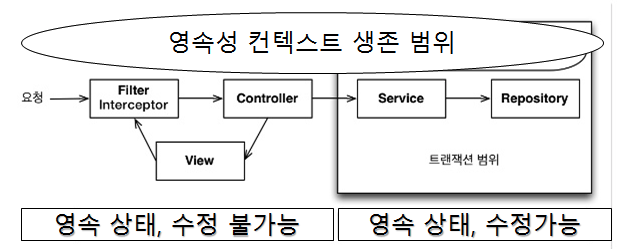

스프링이나 J2EE 컨테이너 환경에서 JPA를 사용하면 컨테이너가 트랜잭션과 영속성 컨텍스트를 관리해주므로 애플리케이션을 손쉽게 개발할 수 있다.
## 트랜잭션 범위의 영속성 컨텍스트
순수하게 J2SE 환경에서 JPA를 사용하면 개발자가 직접 엔티티 매니저를 생성하고 트랜잭션도 관리해야 하지만 스프링이나 J2EE 컨테이너 환경에서 JPA를 사용하면 컨테이너가 제공하는 전략을 따라야 한다.

### 스프링 컨테이너의 기본 전략
스프링 컨테이너는 트랜잭션 범위의 영속성 컨텍스트 전략을 기본으로 사용한다. 즉, `트랜잭션의 범위와 영속성 컨텍스트의 생존 범위가 같다`는 의미다. 이 전략은 트랜잭션을 시작할 때 영속성 컨텍스트를 생성하고 트랜잭션이 끝날 때 영속성 컨텍스트를 종료한다. 그리고 같은 트랜잭션 안에서는 항상 같은 영속성 컨텍스트에 접근한다.


스프링 프레임워크에서는 보통 비즈니스 로직을 시작하는 서비스 계층에 @Transactional 어노테이션을 선언하여 트랜잭션을 시작한다. 이 어노테이션이 호출한 메소드가 실행되기 직전에 스프링의 트랜잭션 AOP가 먼저 동작한다.<br>
대상 메소드가 종료되어 트랜잭션을 커밋하게 되면 JPA는 먼저 영속성 컨텍스트를 flush해서 변경 내용을 데이터베이스에 반영한 후에 데이터베이스 트랜젹선을 커밋한다. 따라서 영속성 컨텍스트의 변경 내용이 데이터베이스에 정상 반영된다. 만약 예외가 발생하면 트랜잭션을 롤백하고 종료하는데 이 때는 flush를 호출하지 않는다.

* 트랜잭션이 같으면 같은 영속성 컨텍스트를 사용한다.

트랜잭션 범위의 영속성 컨텍스트 전략은 다양한 위치에서 엔티티 매니저를 주입받아 사용해도 트랜잭션이 같으면 같은 영속성 컨텍스트를 사용한다.

* 트랜잭션이 다르면 다른 영속성 컨텍스트를 사용한다.

여러 스레드에서 동시에 요청이 와서 같은 엔티티 매니저를 사용해도 트랜잭션에 따라 접근하는 영속성 컨텍스트가 다르다. 즉, 스프링 컨테이너는 스레드마다 각각 다른 트랜잭션을 할당한다. 따라서 같은 엔티티 매니저를 호출해도 접근하는 영속성 컨텍스트가 다르므로 멀티스레드 상황에 안전하다.

스프링이나 J2EE 컨테이너의 가장 큰 장점은 `트랜잭션과 복잡한 멀티 스레드 상황을 컨테이너가 처리해준다는 것`이다. 따라서 개발자는 싱글 스레드 애플리케이션처럼 단순하게 개발할 수 있고 결과적으로 비즈니스 로직 개발에 집중할 수 있다.

## 준영속 상태와 지연 로딩
스프링이나 J2EE 컨테이너는 `트랜잭션 범위의 영속성 컨텍스트 전략을 기본으로 사용`한다. 그리고 트랜잭션은 보통 서비스 계층에서 시작하므로 서비스 계층이 끝나는 시점에 트랜잭션이 종료되면서 영속성 컨텍스트도 종료된다. 따라서 조회한 엔티티가 서비스와 repository 계층에서는 영속성 컨텍스트에 관리되면서 영속 상태를 유지하지만 컨트롤러나 뷰 같은 프리젠테이션 계층에서는 준영속 상태가 된다.

```java
@Entity
public class Order {
    @Id @GeneratedValue
    private Long id;

    @ManyToOne(fetch = FetchType.LAZY)  //  지연 로딩 전략
    private Member member;  //  주문 회원
    ...
}
```

트랜잭션 범위의 영속성 컨텍스트 전략을 사용하면 프리젠테이션 계층에서 엔티티는 준영속 상태다. 따라서 변경 감지와 지연 로딩이 동작하지 않는다.

```java
class OrderController {
    public String view(Long orderId) {
        Order order = orderService.findOne(orderId);
        Member member = order.getMember();
        member.getName();   //  지연 로딩 시 예외 발생
    }
}   
```

* 준영속 상태와 변경 감지

변경 감지 기능은 영속성 컨텍스트가 살아 있는 서비스 계층(트랜잭셤 범위)까지만 동작하고 영속성 컨텍스트가 종료된 프리젠테이션 계층에서는 동작하지 않는다. 변경 감지 기능이 프리젠테이션 계층에서도 동작하면 애플리케이션 계층이 가지는 책임이 모호해지고 유지보수하기도 어렵다.<br>
비즈니스 로직은 서비스 계층에서 끝내고 프리젠테이션 계층은 데이터를 보여주는데 집중해야 한다. 따라서 변경 감지 기능이 프리젠테이션 계층에서 동작하지 않는 것은 특별히 문제되지 않는다.

* 준영속 상태와 지연 로딩

뷰를 렌더링할 때 연관된 엔티티도 함께 사용해야 하는데 연관된 엔티티를 지연 로딩으로 설정해서 프록시 객체를 조회하게 된다면, 아직 초기화하지 않는 프록시 객체를 사용하면 실제 데이터를 불러오려고 초기화를 시도하게 된다. 하지만 준영속 상태는 영속성 컨텍스트가 없으므로 지연 로딩을 할 수 없게되고 이 때 `org.hibernate.LazyInitializationException`예외가 발생한다.

> 준영속 상태에서 지연 로딩을 시도하면 문제가 발생한다. 하지만 JPA 표준에 어떤 문제가 발생하는지 정의하지 않아서 구현체마다 다르게 동작한다.

준영속 상태에서 지연 로딩의 문제를 해결하는 방법으로 2가지가 있다.
* 뷰가 필요한 엔티티를 미리 로딩해두는 방법
* OSIV를 사용해서 엔티티를 영속 상태로 유지하는 방법

#### 뷰가 필요한 엔티티를 미리 로딩해두는 방법
영속성 컨텍스트가 살아 있을 때 뷰에 필요한 엔티티들을 미리 로딩하거나 초기화해서 반환하는 방법이다. 따라서 엔티티가 준영속 상태로 변해도 연관된 엔티티를 이미 다 로딩해두어서 지연 로딩이 발생하지 않는다.

* 뷰가 필요한 엔티티를 미리 로딩해두는 방법
    * 글로벌 페치 전략 수정
    * JPQL 페치 조인
    * 강제로 초기화
    
### 글로벌 페치 전략 수정
글로벌 페치 전략을 지연 로딩에서 즉시 로딩으로 변경하면 된다.
```java
@Entity
public class Order {
    @Id @GeneratedValue
    private Long id;

    @ManyToOne(fetch = FetchType.EAGER) //  즉시 로딩 전략
    private Member member;  //  주문 회원
}

Order order = orderService.findOne(orderId);
Member member = order.getMember();
member.getName();   //  이미 로딩된 엔티티
```    

엔티티에 있는 fetch 타입을 변경하면 애플리케이션 전체에서 이 엔티티를 로딩할 때 마다 해당 전략을 사용하므로 글로버 페치 전략이라 한다. 페치 전략을 EAGER로 설정하므로써 즉시 로딩된다.<br>

```java
Order order = em.find(Order.class, orderId);
List<Order> orders = em.createQuery("select o from Order o");
```
order와 orders 모두 연관된 member 엔티티를 미리 로딩해서 가진다. 따라서 준영속 상태가 되어도 member를 사용할 수 있다. 하지만, 이렇게 글로벌 페치 전략을 즉시 로딩으로 설정하는 것은 2가지 단점을 갖는다.

* 사용하지 않는 엔티티를 로딩
* N + 1 문제 발생

#### N + 1 문제
즉시 로딩 전략을 join 쿼리 시, 한 번에 연관된 엔티티까지 조회하게 된다.

```java
Order order = em.find(Order.class, 1L);
```
```sql
select o.*, m.*
from Order o
left outer join Member m on o.MEMBER_ID=m.MEMBER_ID
where o.id=1
```
실행된 sql을 보면 즉시 로딩으로 설정한 member 엔티티를 JOIN 쿼리로 함께 조회한다. 여기서 문제는 JPQL을 사용할 때 발생한다.

```java
List<Order> orders = em.createQuery("select o from Order o", Order.class).getResultList();  //  연관된 모든 엔티티를 조회
``` 
```sql
select * from Order     //  JPQL로 실행된 SQL
select * from Member where id=? //  EAGER로 실행된 SQL
select * from Member where id=? //  EAGER로 실행된 SQL
select * from Member where id=? //  EAGER로 실행된 SQL
select * from Member where id=? //  EAGER로 실행된 SQL
...
```

JPA가 JPQL을 분석해서 SQL을 생성할 때는 글로벌 페치 전략을 참고하지 않고 오직 JPQL 자체만 사용한다. 따라서 즉시 로딩이든 지연 로딩이든 구분하지ㅣ 않고 JPQL 쿼리 자체에 충실하게 SQL을 만든다.

1. select o from Order o JPQL을 분석해서 select * from Order SQL을 생성한다.
2. 데이터베이스에서 결과를 받아 order 엔티티 인스턴스들을 생성한다.
3. Order.member의 글로벌 페치 전략이 즉시 로딩이므로 order를 로딩하는 즉시 연관된 member도 로딩해야 한다.
4. 연관된 member를 영속성 컨텍스트에서 찾는다.
5. `영속성 컨텍스트에 없으면 SELECT * FROM MEMBER WHERE id=? SQL을 조회한 order 엔티티 수만큼 실행`한다.

만약 조회한 order 엔티티가 10개이면 member를 조회하는 SQL도 10번 실행한다. 이처럼 처음 조회한 데이터 수만큼 다시 SQL을 사용해서 조회하는 것을 N + 1 문제라 한다.<br>
N + 1이 발생하면 SQL이 상당히 호출되므로 조회 성능에 치명적이다. 따라서 최우선 최적화 대상이다. 이런 문제는 `JPQL 페치 조인으로 해결`할 수 있다.

### JPQL 페치 조인
글로벌 페치 전략을 즉시 로딩으로 설정하면 애플리케이션 전체에 영향을 주게되어 비효율적이다. 따라서 JPQL을 호출하는 시점에 함께 로딩할 엔티티를 선택할 수 있는 페치 조인을 활용할 수 있다.<br>
페치 조인을 사용하면 SQL JOIN을 사용해서 페치 조인 대상까지 함께 조회하기 때문에 N + 1 문제가 발생하지 않는다.

> 연관된 엔티티를 이미 로딩했으므로 글로벌 페치 전략이 무의미하다.

페치 조인은 N + 1 문제를 해결하면서 화면에 필요한 엔티티를 미리 로딩하는 현실적인 방법이다.

* JPQL 페치 조인의 단점
현실적인 대안이긴 하지만 무분별하게 사용하면 화면에 맞춘 repository 메소드가 증가할 수 있다. 결국 프리젠테이션 계층이 데이터 접근 계층을 침범하는 것이다.<br>
화면 A는 order 엔티티만, 화면 B는 order, member엔티티가 필요하다면 두 화면 모두 최적화 하기 위해 둘 모두 지연 로딩을 설정하고 repository에 2가지 메소드를 구현하게 된다. 그러면 두 메소드를 각각 만듦으로써 최적화할 수는 있지만 뷰와 repository간에 논리적인 의존관계가 발생한다.<br>
다른 대안으로는 repository.findOrder() 하나만 만들고 여기서 페치 조인으로 order와 member를 함께 로딩한다. 그리고 화면 A, B모두 같은 메소드를 사용한다. 그러면 화면 B는 약간의 로딩 시간이 증가하겠지만 페치 조인은 JOIN을 사용하여 쿼리가 한번만 나가므로 성능에 큰 차이가 없다.<br>
무분별한 최적화로 프리젠테이션 계층과 데이터 접근 계층 간에 의존관계가 급격하게 증가하는 것보다는 적절한 선에서 타협하는 방법이다.

### 강제로 초기화
영속성 컨텍스트가 살아있을 때 프리젠테이션 계층이 필요한 엔티티를 강제로 초기화하여 반환하는 방법이다.
```java
class OrderService {
    @Transactional
    public class findOrder(id) {
        Order order = orderRepository.findOrder(id);
        order.getMember().getName();    //  프록시 객체를 강제로 초기화
        return order;
    }
}
```
글로벌 페치 전략을 지연 로딩으로 설정했을 때, 프록시 객체는 member.getName() 처럼 실제 값을 사용하는 시점에 초기화 된다. 프리젠테이션 계층에서 필요한 프록시 객체를 영속성 컨텍스트가 살아 있을 때 강제로 초기화해서 반환하면 이미 초기화했으므로 준영속 상태에서도 사용할 수 있다.<br>

> 하이버네이트를 사용하면 `initialize()` 메소드를 사용해서 프록시를 강제로 초기화할 수 있다.

참고로 JPA 표준에는 프록시 초기화 메소드가 없다. JPA 표준은 단지 초기화 여부만 확인 할 수 있다. 프록시를 초기화하는 역할을 서비스 계층에서 담당하려면 위 예제처럼 뷰가 필요한 엔티티에 따라 서비스 계층의 로직을 변경해야 한다. 즉, 프리젠테이션 계층이 서비스 계층을 침범하는 상황이다. 따라서 비즈니스 로직을 담당하는 서비스 계층에서 프리젠테이션 계층을 위한 프록시 초기화 역할을 분리해야 한다. 이는 `FACADE 계층`이 그 역할을 담당한다.

### FACADE 계층 추가
프리젠테이션 계층과 서비스 계층 사이에 FACADE 계층을 하나 더 두는 방법이다. 이로써 뷰를 위한 프록시 초기화는 여기서 담당하게 된다. 결과적으로 `FACADE 계층을 도입함으로써 서비스 계층과 프리젠테이션 계층 사이에 논리적인 의존성을 분리`할 수 있다.<br>

> 프록시를 초기화하려면 영속성 컨텍스트가 필요하므로 FACADE에서 트랜잭션을 시작해야 한다.

#### FACADE 계층의 역할과 특징
* 프리젠테이션 계층과 도메인 모델 계층 간의 논리적 의존성을 분리해준다.
* 프리젠테이션 계층에서 필요한 프록시 객체를 초기화한다.
* 서비스 계층을 호출해서 비즈니스 로직을 실행한다.
* repository를 직접 호출해서 뷰가 요구하는 엔티티를 찾는다.

```java
class OrderFacade {
    @Autowired
    OrderService orderService;

    public Order findOrder(id) {
        Order order = orderService.findOrder(id);
        //  프리젠테이션 계층이 필요한 프록시 객체를 강제로 초기화한다.
        order.getMember().getName();
        return order;
    }
}

class OrderService {
    public Order findOrder(id) {
        return orderRepository.findOrder(id);
    }
}
```

OrderService에 있던 프록시 초기화 코드를 OrderFacade로 이동시켰다.<br>
FACADE 계층을 도입함으로써 서비스 계층과 프리젠테이션 계층 간에 논리적 의존관계는 제거됐다. 하지만 실용적인 관점에서 FACADE 계층의 존재로 더 많은 코드 작성이 필요해졌다. 그리고 FACADE에는 단순히 서비스 계층을 호출만 하는 위임 코드가 상당히 많아질 것이다.

### 준영속 상태와 지연 로딩의 문제점
준영속 상태에서의 지연 로딩 문제를 극복하기 위한 방법으로 아래가 있었다.
* 글로벌 페치 전략 수정 -> 지연 로딩에서 즉시 로딩
* JPQL 페치 조인 사용
* 강제로 초기화
* FACADE 계층 도입

뷰를 개발할 때, 필요한 엔티티를 미리 초기화하는 방법은 오류 발생 여지가 많다. 보통 뷰 개발 시, 엔티티 클래스만 보고 개발하지 초기화 여부를 위해 FACADE나 서비스 클래스까지 열어보는 것은 번거롭고 놓치기 쉽기 때문이다.<br>
결국, 영속성 컨텍스트가 없는 뷰에서 초기화하지 않은 프록시 엔티티를 조회하는 실수를 하게 되고 LazyInitializationException을 만나게 될 것이다.
그리고, 애플리케이션 로직과 뷰가 물리적으로는 나뉘어 있지만 논리적으로는 서로 의존한다는 문제도 있다. FACADE로 어느정도 해결은 할 수 있지만 번거롭다.

> 결국, 모든 문제는 엔티티가 프리젠테이션 계층에서 준영속 상태이기 때문에 발생하는 것이기 때문에 영속성 컨텍스트를 뷰까지 살아있게 열어둬야 해결이 될 문제다. 이를 가능케 하는 것이 OSIV이다.

## OSIV(Open Session In View)
영속성 컨텍스트를 뷰까지 열어둔다는 의미이다. 따라서 뷰에서도 지연 로딩을 사용할 수 있다.

> JPA에서는 OEIV(Open Entitymanager In View)라 한다.

### 과거 OSIV: 요청 당 트랜잭션
OSIV의 핵심은 뷰에서도 지연 로딩이 가능하도록 하는 것이다. 가장 단순한 방법은 클라이언트의 요청이 들어오자마자 서블릿 필터나 스프링 인터셉터에서 트랜잭션을 시작하고 요청이 끝날 때 트랜잭션도 종료하는 것이다. 이를 `요청 당 트랜잭션(Transaction per request)`방식의 OSIV라 한다.

#### 문제점
컨트롤러나 뷰 같은 프리젠테이션 계층이 엔티티를 변경할 수 없다. 컨트롤러 단에서 뷰에 노출할 때만 잠시 데이터를 변경하려고 했어도 트랜잭션이 종료되게 되면 변경된 데이터 내역이 데이터베이스에까지 반영되게 된다. 따라서 아래와같은 프리젠테이션 계층에서 엔티티를 수정하지 못하게 막는 방법이 필요하다.

* 엔티티를 읽기 전용 인터페이스로 제공
    
```java
interface MemberView {
    public String getName();
}

@Entity
class Member implements MemberView {
    ...
}

class MemberService {
    public MemberView getMember(id) {
        return memberRepository.findById(id);
    }
}
```
실제 회원 엔티티가 있지만 프리젠테이션 계층에는 Member 엔티티 대신 회원 엔티티의 읽기 전용 메소드만 있는 MemberView 인터페이스를 제공한다. 따라서 읽기 전용 메소드만 있기 때문에 프리젠테이션 계층에서 엔티티를 수정할 수 없다.

* 엔티티 래핑

엔티티의 읽기 전용 메소드만 가지고 있는 엔티티를 감싼 객체를 만들고 이것을 프리젠테이션 계층에 반환하는 방법이다.
```java
class MemberWrapper {
    private Member member;
    public MemberWrapper(member) {
        this.member = member;
    }
    //  읽기 전용 메소드만 제공
    public String getName() {
        member.getName();
    }
}
```

member 엔티티를 감싸고 있는 MemberWrapper 객체를 만들었다.

* DTO만 반환

프리젠테이션 계층에 엔티티 대신, 단순히 데이터만 전달하는 객체인 DTO를 생성해서 반환한다. 하지만 이 방법은 OSIV를 사용하는 장점을 살릴 수는 없고, 엔티티를 거의 복사한 듯한 DTO 클래스도 하나 더 만들어야 한다.

하지만, 위 방법들은 모두 코드량이 증가한다는 단점이 있다. 따라서 최근에는 비즈니스 계층에서만 트랜잭션을 유지하는 방식의 OSIV를 사용한다. 스프링 프레임워크가 제공하는 OSIV가 바로 이 방식을 사용한다.

### 스프링 OSIV: 비즈니스 계층 트랜잭션
#### 스프링 프레임워크가 제공하는 OSIV 라이브러리
OSIV를 서블릿 필터에서 적용할 지, 스프링 인터셉터에서 적용할지에 따라 원하는 클래스를 선택하여 사용할 수 있다.
* 하이버네이트 OSIV 서블릿 필터 : OpenSessionInViewFilter
* 하이버네이트 OSIV 스프링 인터셉터 : OpenSessionInViewInterceptor
* JPA OEIV 서블릿 필터 : OpenEntityManagerInViewFilter
* JPA OEIV 스프링 인터셉터 : OpenEntityManagerInViewInterceptor

JPA를 사용하면서 서블릿 필터에 OSIV를 적용하려면 OpenEntityManagerInViewFilter를 서블릿 필터에 등록하면 된다.

#### 스프링 OSIV 분
요청 당 트랜잭션 방식의 OSIV는 프리젠테이션 계층에서 데이터를 변경할 수 있는 문제가 있다. 스프링 프레임워크가 제공하는 OSIV는 어느정도 이러한 문제를 해결할 수 있다.


1. client의 요청이 들어오면 서블릿 필터나, 스프링 인터셉터에서 영속성 컨텍스트를 생성한다. 단, 이때 트랜잭션은 시작하지 않는다.
2. 서비스 계층에서 @Transactional로 트랜잭션을 시작할 때 1번에서 미리 생성해둔 영속성 컨텍스트를 찾아와서 트랜잭션을 시작한다.
3. 서비스 계층에서 끝나면 트랜잭션을 커밋하고 영속성 컨텍스트를 flush한다. 이 때 트랜잭션은 끝내지만 영속성 컨텍스트는 종료하지 않는다.
4. 컨트롤러와 뷰까지 영속성 컨텍스트가 유지되므로 조회한 엔티티는 영속 상태를 유지한다.
5. 서블릿 필터나, 스프링 인터셉터로 요청이 돌아오면 영속성 컨텍스트를 종료한다. 이 때 flush를 호출하지 않고 바로 종료된다.

#### 트랜잭션 없이 읽기
영속성 컨텍스트를 통한 모든 변경은 트랜잭션 안에서 이뤄져야 한다. 트랜잭션 없이 엔티티를 변경하고 영속성 컨텍스트를 flush하면 javax.persistence.TransactionRequiredException 예외가 발생한다.<br>
엔티티를 변경하지 않고 단순히 조회만 할 때는 트랜잭션이 없어도 되는데, 이 것을 트랜잭션 없이 읽기라 한다. 프록시를 초기화하는 지연 로딩도 조회 기능이므로 트랜잭션 없이 읽기가 가능하다.

* 영속성 컨텍스트는 트랜잭션 범위 안에서만 엔티티를 조회하고 수정할 수 있다.
* 영속성 컨텍스트는 트랜잭션 범위 밖에서 엔티티를 조회만 할 수 있다. 이를 트랜잭션 없이 읽기라 한다.
* 영속성 컨텍스트를 프리젠테이션 계층까지 유지한다.
* 프리젠테이션 계층에는 트랜잭션이 없으므로 엔티티를 수정할 수 없다.
* 프리젠테이션 계층에는 트랜잭션이 없지만 트랜잭션 없이 읽기를 사용해서 지연 로딩을 할 수 있다.

#### 스프링 OSIV 주의사항
한 가지 예외로, 프리젠테이션 계층에서 엔티티를 수정한 직후에 트랜잭션을 시작하는 서비스 계층을 호출하면 문제가 발생한다. 해결방법은 트랜잭션이 있는 비즈니스 로직을 모두 호출하고 나서 엔티티를 변경하면 된다.<br>
스프링 OSIV는 같은 영속성 컨텍스트를 여러 트랜잭션이 공유할 수 있으므로 이런 문제가 발생한다. OSIV를 사용하지 않는 트랜잭션 범위의 영속성 컨텍스트 전략은 트랜잭션의 생명주기와 영속성 컨텍스트의 생명주기가 같으므로 이런 문제가 발생하지 않는다.

### OSIV 정리
* 스프링 OSIV의 특징
    * OSIV는 클라이언트의 요청이 들어올 때 영속성 컨텍스트를 생성해서 요청이 끝날 때까지 같은 영속성 컨텍스트를 유지한다. 따라서 한 번 조회한 엔티티는 요청이 끝날 때 까지 영속 상태를 유지한다.
    * 엔티티 수정은 트랜잭션이 있는 계층에서만 동작한다. 트랜잭션이 없는 프리젠테이션 계층은 지연 로딩을 포함해서 조회만 할 수 있다.
* 스프링 OSIV의 단점
    * OSIV를 적용하면 여러 트랜잭션이 같은 영속성 컨텍스트를 공유할 수 있으므로 주의해야 한다.(트랜잭션 롤백 시 주의가 필요하다)
    * 프리젠테이션 계층에서 엔티티를 먼저 수정 후 비즈니스 로직을 수행하게 되면 엔티티가 수정될 수 있다.
    * 프리젠테이션 계층에서 지연 로딩에 의한 SQL이 실행된다. 따라서 성능 튜닝시에 확인해야 할 부분이 넓다.
* OSIV vs FACADE vs DTO
    * OSIV를 제외한 다른 방법들은 결국 번거로운 코딩 작업이 늘어날 수 밖에 없다.
* OSIV가 만능은 아니다.
    * 복잡한 화면구성(ex. 통계)에서는 엔티티로 조회하기 보다는 처음 부터 통계 데이터를 구상하기 위한 JPQL을 작성해서 DTO로 조회하는 것이 효과적이다.
* OSIV는 같은 JVM을 벗어난 원격 상황에서는 사용할 수 없다.
    * 외부 API는 엔티티는 자주 변경될 수 있기 떄문에 엔티티를 직접 노출하기 보다는 엔티티를 변경해도 완충 역할을 할 수 있는 DTO로 변환해서 노출하는 것이 안전하다.
    * 내부 API는 엔티티를 변경해도 클라이언트와 서버를 동시에 수정할 수 있어서 실용적인 관점에서 엔티티를 직접 호출하는 방법도 괜찮을 수 있다.
    
## 너무 엄격한 계층
단순한 엔티티 조회는 컨트롤러에서 repository를 직접 호출해도 아무런 문제가 없다. OSIV를 사용함으로써 영속성 컨텍스트가 프리젠테이션 계층까지 살아있기 때문이다.      
