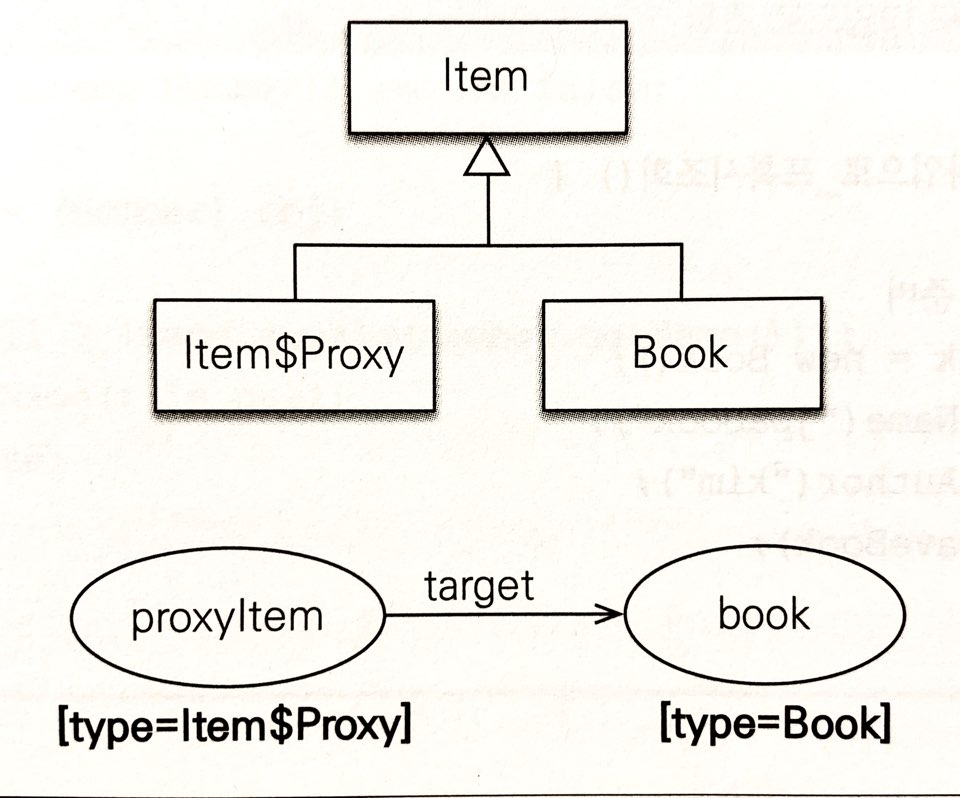
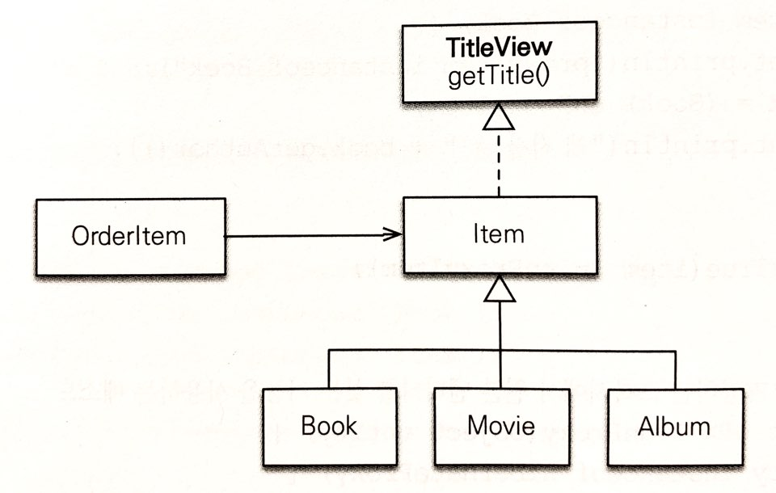
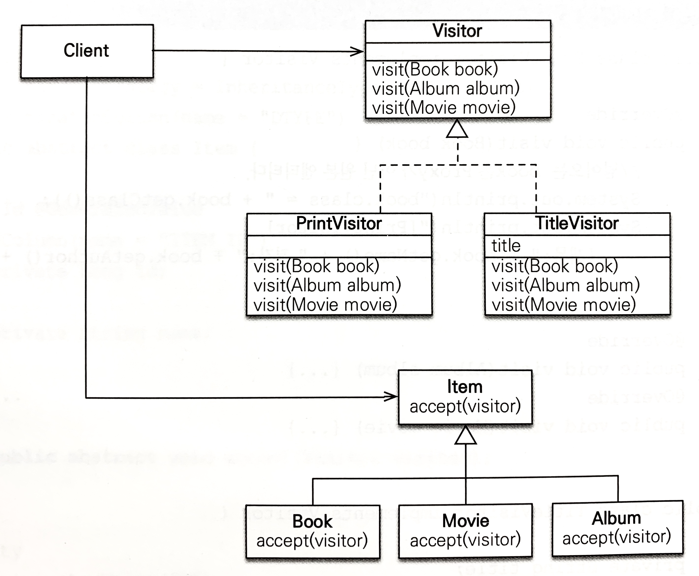

## 예외 처리
### JPA 표준 예외 정리
JPA의 표준 예외들은 javax.persistence.PersistenceException의 자식 클래스다. 그리고 이 예외 클래스는 RuntimeException의 자식이다. 따라서 JPA 예외는 모두 언체크 예외다.<br>

또한, 서비스 계층에서 데이터 접근 계층의 구현 기술에 직접 의존하는 것은 좋지 않은 설계다. 예외처리도 마찬가지다. 서비스 계층에서 JPA의 예외를 직접 사용하면 JPA에 의존하게 된다.<br>
 스프링 프레임워크는 이러한 문제를 해결하기 위해 데이터 접근 계층에 대한 예외를 추상화하여 개발자에게 제공한다.

#### JPA 표준 예외 및 스프링 변환 예외
* 트랜잭션 롤백을 표시하는 예외
    * 심각한 예외로 복구해선 안된다.
    * 예외 발생 시, 트랜잭션을 강제로 커밋해도 트랜잭션이 커밋되지 않고 javax.persistence.RollbackException 예외가 발생한다.
<table>
  <thead>
    <tr>
      <th>트랜잭션 롤백을 표시하는 예외</th>
      <th>설명</th>
      <th>스프링 변환 예외</th>
    </tr>
  </thead>
  <tbody>
    <tr>
      <td>javax.persistence.RollbackException</td>
      <td>예외 발생 시, 트랜잭션을 강제로 커밋해도 트랜잭션이 커밋되지 않는다.</td>
      <td>org.springframework.transaction.TransactionSystemException</td>
    </tr>
    <tr>
      <td>javax.persistence.EntityExistException</td>
      <td>EntityManager.persist(...) 호출 시 이미 같은 엔티티가 있으면 발생</td>
      <td>org.springframework.dao.DataIntegrityViolationException</td>
    </tr>
    <tr>
      <td>javax.persistence.EntityNotFoundException</td>
      <td>EntityManager.getReference(...)를 호출했는데 실제 사용 시 엔티티가 존재하지 않으면 발생.<br>refresh(...), lock(...)에서도 발생</td>
      <td>org.springframework.orm.jpa.JpaObjectRetrievalFailureException</td>
    </tr>
    <tr>
      <td>javax.persistence.OptimisticLockException</td>
      <td>낙관적 락 충돌 시 발생</td>
      <td>org.springframework.orm.jpa.JpaOptimisticLockingFailureException</td>
    </tr>
    <tr>
      <td>javax.persistence.PessimisticLockException</td>
      <td>EntityTransaction.commit() 실패 시 발생. 롤백이 표시되어 있는 트랜잭션 커밋 시에도 발생</td>
      <td>org.springframework.dao.PessimisticLockingFailureException</td>
    </tr>
    <tr>
      <td>javax.persistence.TransactionRequiredException</td>
      <td>트랜잭션이 필요할 때 트랜잭션이 없으면 발생. 트랜잭션 없이 엔티티를 변경할 때 주로 발생.</td>
      <td>org.springframework.ApiUsageException</td>
    </tr>    
  </tbody>
</table>
    
* 트랜잭션 롤백을 표시하지 않는 예외
    
 <table>
   <thead>
     <tr>
       <th>트랜잭션 롤백을 표시하지 않는 예외</th>
       <th>설명</th>
     </tr>
   </thead>
   <tbody>
     <tr>
       <td>javax.persistence.NoResultException</td>
       <td>Query.getSingleResult() 호출 시 결과가 하나도 없을 때 발생</td>
       <td>org.springframework.dao.EmptyResultDataAccessException</td>
     </tr>
     <tr>
       <td>javax.persistence.NonUniqueResultException</td>
       <td>Query.getSingleResult() 호출 시 결과가 둘 이상일 때 발생</td>
       <td>org.springframework.dao.IncorrectResultSizeDataAccessException</td>
     </tr>
     <tr>
       <td>javax.persistence.LockTimeoutException</td>
       <td>비관적 락에서 시간 초과 시 발생</td>
       <td>org.springframework.dao.CannotAcquireLockException</td>
     </tr>
     <tr>
       <td>javax.persistence.QueryTimeoutException</td>
       <td>쿼리 실행 시간 초과 시 발생</td>
       <td>org.springframework.dao.QueryTimeoutException</td>
     </tr>
   </tbody>
 </table>
 
* JPA 예외를 스프링 예외로 변경 추가
 <table>
    <thead>
        <tr>
          <th>JPA 예외</th>
          <th>스프링 변환 예외</th>
        </tr>
    </thead>
     <tbody>
       <tr>
         <td>java.lang.IllegalStateException</td>
         <td>org.springframework.dao.InvalidDataAccessApiUsageException</td>
       </tr>
       <tr>
         <td>java.lang.IllegalArgumentException</td>
         <td>org.springframework.dao.InvalidDataAccessApiUsageException</td>
       </tr>
     </tbody>
 </table>
 
### 스프링 프레임워크에 JPA 예외 변환기 적용
JPA 예외를 스프링 프레임워크가 제공하는 추상화된 예외로 변경하려면 `PersistenceExcetionTranslationPostProcessor`를 스프링 빈으로 등록하면 된다. 이 것은 @Repository 어노테이션을 사용한 곳에 예외 변환 AOP를 적용해서 JPA 예외를 스프링 프레임워크가 추상화한 예외로 변환해준다.
 
### 트랜잭션 롤백 시 주의사항
트랜잭션을 롤백하는 것은 데이터베이스의 반영사항만 롤백하는 것이지 수정한 자바 객체까지 원상태로 복구해주지 않는다.<br>
예를 들자면, 엔티티를 조회해 수정하는 중 문제가 발생하여 롤백처리 된다면 데이터베이스의 데이터는 원래대로 복구되지만 객체는 수정된 상태로 영속성 컨텍스트에 남아 있다. 따라서 트랜잭션이 롤백된 영속성 컨텍스트를 그대로 사용하는 것은 위험하다.
 * 새로운 영속성 컨텍스트 생성
 * EntityManager.clear() 를 호출하여 영속성 컨텍스트 초기화
 
스프링 프레임워크는 이런 문제를 해결하기 위해 영속성 컨텍스트의 범위에 따라 다른 방법을 사용한다.
* 트랜잭션 당 영속성 컨텍스트 전략
    * 기본 전략인 트랜잭션 당 영속성 컨텍스트 전략은 문제가 발생하면 트랜잭션 AOP 종료 시점에 트랜잭션을 롤백하면서 영속성 컨텍스트도 함께 종료하므로 문제가 발생하지 않는다.

하지만, OSIV처럼 영속성 컨텍스트의 범위를 트랜잭션 범위보다 넓게 사용하여 여러 트랜잭션이 하나의 영속성 컨텍스트를 사용할 때 발생한다. 트랜잭션을 롤백해도 다른 트랜잭션에서 같은 영속성 컨텍스트를 공유하기 때문에 문제가 발생한다.<br>
스프링 프레임워크는 `영속성 컨텍스트의 범위가 트랜잭션 보다 넓을 경우 트랜잭션 콜백 시 영속성 컨텍스트를 초기화(EntityManager.clear())`해서 잘못된 영속성 컨텍스트 사용을 방지한다.

## 엔티티 비교
영속성 컨텍스트 내부에는 엔티티 인스턴스를 보관하기 위한 1차 캐시가 있다. 1차 캐시는 영속성 컨텍스트와 생명주기를 같이 한다.<br>
1차 캐시의 가장 큰 장점은 `애플리케이션 수준의 반복 가능한 읽기`이다. `같은 영속성 컨텍스트에서 엔티티를 조회하면 다음 코드와 같이 항상 같은 엔티티 인스턴스를 반환`한다. 단순히 동등성 비교가 아닌 주소값이 같은 인스턴스를 반환한다.
```java
Member member1 = em.find(Member.class, "1L");
Member member2 = em.find(Member.class, "1L");

assertTrue(member1 == member2); // 둘은 같은 인스턴스
```

### 영속성 컨텍스트가 같을 때 엔티티 비교
같은 트랜잭션 범위에 같은 영속성 컨텍스트에서 조회한 엔티티는 항상 같은 인스턴스이다. 아래 3가지 조건이 모두 같다.
* 동일성 : == 비교가 같다.
* 동등성 : equals() 비교가 같다.
* 데이터베이스 동등성 : @Id인 데이터베이스 식별자가 같다.

> @Transacional 안에서 @Transactional 을 사용하게 되면 안에서 밖에 트랜잭션을 그대로 이어받게되고 없으면 새로 트랜잭션이 생성된다.

> 테스트 클래스에 @Transacional 을 적용하면 테스트 클래스가 종료될 때 커밋되지 않고 롤백된다. 하지만 롤백 시, 영속성 컨텍스트는 flush되지 않는다.

### 영속성 컨텍스트가 다를 때 엔티티 비교
영속성 컨텍스트가 다르게 되면 `동일성 비교에 실패`한다.
* 동일성 : == 비교에 실패한다.
* 동등성 : equals() 비교가 만족한다. 단, equals()를 구현해야 한다.(비즈니스 키로 구현한다.)
* 데이터베이스 동등성 : @Id인 데이터베이스 식별자는 같다.

같은 영속성 컨텍스트에서는 동일성 비교가 보장된다. 따라서 OSIV 처럼 요청의 시작부터 끝까지 같은 영속성 컨텍스트를 사용할 때는 동일성 비교가 성공한다.<br>
하지만, 영속성 컨텍스트가 달라지면 동일성 비교에 실패한다. 따라서 영속성 컨텍스트가 다를 때는 데이터베이스 동등성 비교를 해야 한다.
```java
member.getId().equals(findMember.getId());  // 데이터베이스 식별자 비교
```
하지만 데이터베이스 동등성 비교는 엔티티를 영속화해야 식별자를 얻을 수 있다는 제약이 있다. 영속화하기 전에는 식별자가 null이므로 정확한 비교가 어렵다.<br>
결국 equals()를 사용한 동등성 비교를 해야 하는데 엔티티를 비교할 때는 비즈니스 키를 활용한 동등성 비교를 하는 것이 좋다.

### 정리
같은 영속성 컨텍스트의 관리를 받는 영속 상태의 엔티티끼리만 동일성 비교가 가능하다. 다른 영속성 컨텍스트에서는 비즈니스 키를 사용한 동등성 비교를 해야 한다.

## 프록시 심화 주제
프록시는 원본 엔티티를 상속받아 만들어지므로 원본 엔티티를 사용하다가 지연 로딩을 위해 프록시로 변경해도 비즈니스 로직의 수정이 필요 없다. 하지만 이러한 프록시 방식의 기술적 한계로 예기치 못한 오류를 만날 수 있다.

### 영속성 컨텍스트와 프록시
영속성 컨텍스트는 자신이 관리하는 영속 엔티티의 동일성을 보장한다. 그렇다면 프록시는? `프록시도 조회한 엔티티도 동일성이 보장`된다.<br>
영속서 컨텍스트는 프록시로 조회된 엔티티에 대해 같은 엔티티를 찾는 요청이 오면 원본 엔티티가 아닌 처음 조회된 프록시를 반환한다.<br>

> 처음 em.getReference() 메소드를 사용해서 프록시로 엔티티를 조회한 후 em.find()로 원본 엔티티를 조회해도 처음 조회된 프록시를 반환한다.

원본 엔티티를 먼저 조회한 경우에는 당연히 처음 조회된 후 영속성 컨텍스트에 이미 원본 엔티티가 남아있으므로 em.getReference()를 호출해도 원본 엔티티가 반환된다.

### 프록시 타입 비교
프록시는 원본 엔티티를 상속 받아서 만들어진 것이므로 프록시로 조회한 엔티티의 타입 비교시 == 가 아닌 instanceof를 사용해야 한다.

### 프록시 동등성 비교
엔티티의 동등성 비교는 비즈니스 키를 사용해서 equals() 메소드를 오버라이디앟고 비교하면 된다.<br>
그런데, IDE나 외부 라이브러리를 사용하여 구현한 equals() 메소드로 엔티티를 비교할 때, 비교 대상이 원본 엔티티면 문제 없지만 프록시면 문제가 될 수 있다.

* 프록시 동등성 비교, 회원 엔티티

```java
@Entity
public class Member {
    
    @Id
    private String id;
    private String name;

    ...
    public String getName() { return name; }
    public void setName(String name) { this.name = name; }

    @Override
    public boolean equals(Object obj) {
        if (this == obj) return true;
        if (obj == null) return false;
        if (this.getClass() != obj.getCloass()) return false;   //  1.
    
        Member member = (Member) obj;
        
        if (name != null ? !name.equals(member.name) : member.name != null) //  2.
            return false;

        return true; 
    }

    @Override
    public int hashCode() {
        return name != null ? name.hashCode() : 0;
    }
}
```
회원 엔티티는 name 필드를 비즈니스 키로 사용해서 equals() 메소드를 오버라이딩 했다.

* 프록시 동등성 비교. 실행

```java
@Test
public void 프록시와_동등성비교() {

    Member saveMember = new Member("member1", "회원1");

    em.persist(saveMember);
    em.flush();
    em.clear();

    Member newMember = new Member("member1", "회원1");
    Member refMember = em.getReference(Member.class, "member1");

    Assert.assertTrue( newMember.equals(refMember) );
}
```

새로 생성한 newMember와 프록시로 조회한 회원 refMember의 name 속성은 동등성 비교를 해보면 false가 반환된다. 프록시가 아닌 원본 엔티티를 조회해서 비교해야 true가 반환된다.<br>
먼저 1번 부분에서 동등성이 아닌 동일성(==)비교를 하기 때문이다. 따라서 1번은 아래와 같이 수정돼야 한다.
```java
if (!(obj instanceof Member)) return false;
```
그 다음은 2번 부분을 보면 프록시의 멤버 변수에 직접 접근하는데, 프록시는 실제 데이터를 가지고 있지 않기 때문에 프록시의 멤버 변수에 직접 접근하면 아무 값도 얻을 수 없다. 따라서 member.name의 결과는 null이고 equals()는 false가 반환된다.<br>
`프록시의 데이터를 조회할 때는 접근자(Getter)를 사용`해야 한다. 따라서 2번은 아래와 같이 수정돼야 한다.
```java
Member member = (Member) obj;

if (name != null ? !name.equals(member.getName()) : member.getName() != null)
    return false;
```

* 프록시의 타입 비교는 == 가 대신 `instanceof`를 사용해야 한다.
* 프록시의 멤버 변수에 직접 접근하는 것이 아닌 접근자 메소드를 사용해야 한다.

### 상속관계와 프록시
프록시를 부모 타입으로 조회하면 문제가 발생한다.<br>

```java
Item proxyItem = em.getReference(Item.class, saveBook.getId());
```
em.getReference() 메소드를 사용해서 Item 엔티티를 프록시로 조회하면 실제 조회된 엔티티는 Book 이기 때문에 Book 타입을 기반으로 원본 엔티티 인스턴스가 생성된다.<br>
그런데 em.getReference() 메소드에서 Item 엔티티를 대상으로 조회했으므로 프록시인 proxyItem은 Item 타입을 기반으로 만들어진다. 따라서 proxyItem 프록시 클래스는 원본 엔티티로 Book 엔티티를 참조한다.<br>
따라서 `proxyItem instanceof Book` 연산은 `false`를 반환한다. 왜냐하면 `프록시인 proxyItem은 Item$Proxy 타입이고 이 타입은 Book 타입과 관계가 없기 때문`이다.<br>
따라서 직접 다운캐스팅을 해도 문제가 발생한다.
```java
Book book = (Book) proxyItem;   //  java.lang.ClassCastException
```
proxyItem은 Book 타입이 아닌 Item 타입은 기반으로 한 Item$Proxy 타입이다. 따라서 ClassCastException 예외가 발생한다.

> 프록시를 부모 타입으로 조회하면 부모의 타입을 기반으로 프록시가 생성되는 문제가 있다.

* instanceof 연산을 사용할 수 없다.
* 하위 타입으로 다운캐스팅을 할 수 없다.

* 다형성과 프록시 조회 정의

```java
@Entity
public class OrderItem {
    
    @Id @GeneratedValue
    private Long id;

    @ManyToOne(fetch = FetchType.LAZY)
    @JoinColumn(name = "ITEM_ID")
    private Item item;

    ...
}

```
OrderItem에서 Item을 지연 로딩으로 설정해서 Item이 프록시로 조회된다. 따라서 똑같이 item instanceof Book 은 false를 반환한다.

이에 대한 해결책은 아래와 같다.

#### JPQL 로 대상 직접 조회
처음부터 자식 타입을 직접 조회해서 필요한 연산을 하는 방법이다. 단, 다형성을 활용할 수 없다.
```java
Book jpqlBook = em.createQuery("select b from Book b where b.id=:bookId", Book.class)
                  .setParameter("bookId", item.getId())
                  .getSingleResult();
```
#### 프록시 벗기기
```java
...
Item item = orderItem.getItem();
Item unProxyItem = unProxy(item);

if (unProxyItem instanceof Book) {
    System.out.println("proxyItem instanceof Book");
    Book book = (Book) unProxyItem;
    System.out.println("책 저자 = " + book.getAuthor());
}

Assert.assertTrue(item != unProxyItem);

//  하이버네이트가 제공하는 프록시에만 원본 엔티티를 찾는 기능을 사용하는 메소드
public static <T> T unProxy(Object entity) {
    if (entity instanceof HibernateProxy) {
        entity = ((HibernateProxy) entity).getHibernateLazyInitializer()
                                          .getImplementation();  
    }
    return (T) entity;
}
```
그러나 이 방법은 프록시에서 원본 엔티티를 직접 꺼내기 때문에 `프록시와 원본 엔티티의 동일성 비교가 실패`한다는 문제점이 있다.

> 하지만, 원본 엔티티의 값을 직접 변경해도 변경 감지 기능은 동작한다.

#### 기능을 위한 별도의 인터페이스 제공

```java
public interface TitleView {
    String getTitle();
}

@Entity
@Inheritance(strategy = InheritanceType.SINGLE_TABLE)
@DiscriminatorColumn(name = "DTYPE")
public abstract class Item implements TitleView {
    
    @Id @GeneratedValue
    @Column(name = "ITEM_ID")
    private Long id;

    private String name; 
    private int price;
    private int stockQuantity;

    ...
}

@Entity
@DiscriminatorValue("B")
public class Book extends Item {
    
    private String author; 
    private String isbn;

    @Override
    public String getTitle() {
        return "[제목:" + getName() + " 저자:" + author + "]";
    }
}

@Entity
@DiscriminatorValue("M")
public class Movie extends Item {
    
    private String director;
    private String actor;

    ...

    @Override
    public String getTitle() {
        return "[제목:" + getName() + " 감독:" + director + " 배우:" + actor + "]";
    }
}
```
TitleView라는 공통 인터페이스를 만들고 자식 클래스들은 인터페이스의 getTitle() 메소드를 각각 구현한다.

```java
@Entity
public class OrderItem {
    
    @Id @GeneratedValue
    private Long id;

    @ManyToOne(fetch = FetchType.LAZY)
    @JoinColumn(name = "ITEM_ID")
    private Item item;

    ...
}

OrderItem item = em.find(OrderItem.class, saveOrderItem.getId());
orderItem.printItem();

//  결과 : TITLE:[제목:jpabook 저자:kim]
```
이처럼 인터페이스를 제공하고 각각의 클래스가 자신에 맞는 기능을 구현하는 것은 다형성을 활용하는 좋은 방법이다.<br>
이 방법을 사용할 때는 프록시의 특징 때문에 프록시의 대상이 되는 타입에 인터페이스를 적용해야 한다.

#### 비지터 패턴 사용

비지터 패턴은 Visitor와 Visitor를 받아들이는 대상 클래스로 구성된다. Item은 accept(visitor) 메소드를 사용해서 Visitor를 받아들인다. 다만 단순히 Visitor를 받아들이기만 할 뿐, 실제 로직은 Visitor가 처리한다.

* 장점
    * 프록시에 대한 걱정 없이 안전하게 원본 엔티티에 접근 가능
    * instanceof와 타입 캐스팅 없이 코드를 구현 가능
    * 알고리즘과 객체 구조를 분리해서 구조를 수정하지 않고 새로운 동작 추가가 가능

* 단점
    * 너무 복잡하고 더블 디스패치를 사용하기 때문에 이해하기 어렵다.
    * 객체 구조가 변경되면 모든 Visitor를 수정해야 한다.
    
## 성능 최적화
### N + 1 문제
```java
@Entity
public class Member {
    
    @Id @GeneratedValue
    private Long id;

    @OneToMany(mappedBy = "member", fetch = FetcyType.EAGER)
    private List<Order> orders = new ArrayList<Order>();
    ...
}

@Entity
@Table(name = "ORDERS")
public class Order {
    
    @Id @GeneratedValue
    private Long id;

    @ManyToOne
    private Member member;
    ...
}
```

#### 즉시 로딩과 N+1
특정 회원 하나를 em.find() 메소드로 조회하면 즉시 로딩으로 설정한 주문정보도 함께 조회한다.
```java
em.find(Member.class, id);
```

* 실행된 SQL

```sql
SELECT M.*, O.*
FROM
    MEMBER M
OUTER JOIN ORDERS O ON M.ID=O.MEMBER_ID
```
SQL을 두 번 실행하는 것이 아닌, 조인을 사용해서 한 번의 SQL로 회원과 주문정보를 함께 조회한다.<br>
문제는 JPQL을 사용할 때다.

```java
List<Member> members = em.createQuery("select m from Member m", Member.class).getResultList();
```

JPQL을 실행하면 JPA는 즉시/지연 로딩을 신경쓰지 않고 JPQL만 사용하여 SQL을 생성한다. 따라서 아래 SQL이 먼저 실행된다.

```sql
SELECT * FROM MEMBER
```
먼저 회원 엔티티를 로딩하지만 회원과 주문 컬렉션이 즉시 로딩 관계이므로 JPA는 주문 컬렉션을 즉시 로딩하기 위해 아래 SQL을 추가로 실행한다.

```sql
SELECT * FROM ORDERS WHERE MEMBER_ID=?
```

조회된 회원이 하나면 이렇게 총 2번의 SQL을 실행하지만 조회된 회원이 5명이면..

```sql
SELECT * FROM MEMBER    //  1번 실행으로 회원 5명 조회
SELECT * FROM ORDERS WHERE MEMBER_ID=1 //   회원과 연관된 주문
SELECT * FROM ORDERS WHERE MEMBER_ID=2 //   회원과 연관된 주문
SELECT * FROM ORDERS WHERE MEMBER_ID=3 //   회원과 연관된 주문
SELECT * FROM ORDERS WHERE MEMBER_ID=4 //   회원과 연관된 주문
SELECT * FROM ORDERS WHERE MEMBER_ID=5 //   회원과 연관된 주문
```
처음 실행한 SQL의 결과 수 만큼 추가로 SQL을 실행하게 된다.

> 즉시 로딩은 JPQL을 실행할 때 N + 1 문제가 발생할 수 있다.

#### 지연 로딩과 N+1
```java
@Entity
public class Member {
    
    @Id @GeneratedValue
    private Long id;

    @OneToMany(mappedBy = "member", fetch = FetchType.LAZY)
    private List<Order> ordres = new ArrayList<Order>();
    ...
}
```

지연 로딩으로 설정하면 JPQL에서는 N+1 문제가 발생하지 않는다. 지연 로딩이므로 데이터베이스에서 회원만 조회된다. 따라서 다음 SQL만 실행되고 연관된 주문 컬렉션은 지연 로딩 된다.

```sql
SELECT * FROM MEMBER
```
이후 비즈니스 로직에서 주문 컬렉션을 실제 사용할 때 지연 로딩이 발생한다.

```java
firstMember = member.get(0);
firstMember.getOrder().size();  //  지연 로딩 초기화
```

members.get(0)로 회원 하나만 조회해서 사용했기 때문에 firstMember.getOrder().size()를 호출하면서 실행되는 SQL은 다음과 같다.

```java
for (Member member : members) {
    //  지연 로딩 초기화
    System.out.println(member.getOrders().size());
}
```

주문 컬렉션을 초기화하는 수만큼 다음 SQL이 실행될 수 있다. 회원이 5명이면 회원에 따른 주문도 5번 조회된다.

#### 페치 조인 사용
페치 조인은 SQL 조인을 사용해서 연관된 엔티티를 함께 조회하므로 N+1 문제가 발생하지 않는다.
```sql
select m from Member m join fetch m.orders  //  JPQL

SELECT M.*, O.* FROM MEMBER M
INNER JOIN ORDERS O ON M.ID=O.MEMBER_ID     // 실행된 SQL
```

이 예제는 참고로 일대다 조인을 했기 때문에 결과가 늘어나서 중복된 결과가 나타날 수 있다. 따라서 JPQL의 DISTINCT를 사용해서 중복을 제거하는 것 이좋다.
#### 하이버네이트 @BatchSize
@BatchSize 어노테이션을 사용해서 연관된 엔티티를 조회할 때 지정한 size 만큼 SQL의 IN 절을 사용해서 조회한다. 조회한 회원이 10명인데 size=5로 지정하면 2번의 SQL만 추가로 실행한다.
```java
@Entity
public class Member {
    ...
    @BatchSize(size = 5)
    @OneToMany(mappedBy = "member", fetch = FetchType.EAGER)
    private List<Order> orders = new ArrayList<>();
    ...
}
```
* 즉시 로딩 시 : 조회 시점에 10건의 데이터를 모두 조회해야 하므로 두 번으로 나눠서 실행된다.
* 지연 로딩 시 : 지연 로딩된 엔티티를 최초 사용하는 시점에 다음 SQL을 실행해서 5건의 데이터를 미리 로딩해둔다. 그리고 6번째 데이터를 사용하면 다음 SQL을 추가로 실행한다.

```sql
SELECT * FROM ORDERS
WHERE MEMBER_ID IN (?, ?, ?, ?, ?)
```

> hibernate.default_batch_fetch_size 속성을 사용하면 애플리케이션 전체에 기본으로 @BatchSize를 적용할 수 있다.

#### 하이버네이트 @Fetch(FetchMode.SUBSELECT)
@Fetch 어노테이션에 FetchMode를 SUBSELECT로 사용하면 연관된 데이터를 조회할 때 서브 쿼리를 사용해서 N+1 문제를 해결한다.
```java
@Entity
public class Member {
    ...
    @Fetch(FetchMode.SUBSELECT)
    @OneToMany(mappedBy = "member", fetch = FetchType.EAGER)
    private List<Order> orders = new ArrayList<>();
    ...
}
```
다음과 같이 식별자 값이 10을 초과하는 회원 엔티티를 모두 조회하는 JPQL이 있다.
```sql
select m from Member m where m.id > 10;
```
* 즉시 로딩 시 : 조회 시점에 다음 SQL이 실행된다.
* 지연 로딩 시 : 지연 로딩된 엔티티를 사용하는 시점에 SQL이 실행된다.

```sql
SELECT O FROM ORDERS O
    WHERE O.MEMBER_ID IN (
        SELECT
            M.ID
        FROM
            MEMBER M
        WHERE M.ID > 10
    )
``` 

#### N+1 정리
* 즉시 로딩 전략의 문제점
    * N+1 문제
    * 비즈니스 로직에 따라 필요하지 않은 엔티티를 로딩해야 하는 상황이 발생함.
    * 성능 최적화가 어렵다. - 엔티티를 조회하다 보면 즉시 로딩이 연속으로 발생해서 예상치 못한 SQL이 실행될 수 있다.

* 대안
    * 모두 지연 로딩으로 설정
    * 성능 최적화가 꼭 필요한 곳에는 JPQL 페치 조인을 사용
    
### 읽기 전용 쿼리의 성능 최적화
엔티티가 영속성 컨텍스트에 관리되면 1차 캐시부터 변경 감지까지 얻을 수 있는 혜택이 많다. 하지만 영속성 컨텍스트는 변경 감지를 위해 스냅샷 인스턴스를 보관하므로 더 많은 메모리를 사용하는 단점이 있다.<br>
이럴 때, 즉, 조회한 엔티티를 다시 조회할 일도 없고, 수정할 일도 없는 경우, `읽기 전용`으로 엔티티를 조회하면 `메모리 사용량을 최적화`할 수 있다.
#### 읽기 전용 쿼리 사용 방법
* 스칼라 타입으로 조회
    * 스칼라 타입은 영속성 컨텍스트가 결과를 관리하지 않는다.
* 읽기 전용 쿼리 힌트 사용
    * org.hibernate.readOnly를 사용한다. 
    * 읽기 전용이므로 영속성 컨텍스트에 스냅샷을 저장하지 않기 떄문에 메모리 사용량을 최적화 할 수 있다.
    * 스냅샷이 없기 때문에 변경 감지가 동작하지 않아 데이터베이스에 수정할 수 없다.
* 읽기 전용 트랜잭션 사용
    * 스프링 프레임워크의 @Transactional(readOnly = true) 어노테이션으로 읽기 전용 모드를 설정할 수 있다.
    * 하이버네이트 세션의 flush모드를 MANUAL로 설정하게 되면서 강제로 flush를 호출하지 않는 한, flush가 일어나지 않는다. 따라서 트랜잭션을 커밋해도 영속성 컨텍스트를 flush하지 않는다.
    * 물론, 트랜잭션을 시작했으므로 트랜잭션 시작, 로직수행, 트랜잭션 커밋의 과정은 이뤄진다. 단지 영속성 컨텍스트를 flush하지 않을 뿐이다.
* 트랜잭션 밖에서 읽기
    * 스프링 프레임워크의 @Transactional(propagation = Propagation.NOT_SUPPORTED)를 활용한다.
    * 기본적으로 flush모드는 AUTO로 설정되어있기 때문에 트랜잭션을 커밋하거나 쿼리를 실행하면 flush가 작동한다. 그런데 트랜잭션 자체가 존재하지 않으므로 트랜잭션을 커밋할 일이 없다.

> JPQL 쿼리도 트랜잭션 없이 실행하면 flush를 호출하지 않는다.

### 배치 처리
수백만 건의 배치를 처리해야 할 때 일반적인 방식으로 엔티티를 계속 조회하면 영속성 컨텍스트에 아주 많은 엔티티가 쌓이면서 메모리 부족 오류가 발생한다. 따라서 이러한 경우에는 배치 처리를 적절한 단위로 영속성 컨텍스트를 초기화해야 한다.<br>
또한, 2차 캐시를 사용하고 있다면 2차 캐시에 엔티티를 보관하지 않도록 주의해야 한다.

#### JPA 등록 배치
배치를 돌릴 때는 일정 단위마다 영속성 컨텍스트의 엔티티를 데이터베이스에 플러시하고 영속성 컨텍스트를 초기화해야 한다.
```java
EntityManager em = entityManagerFactory.createEntityManager();
EntityTrasaction tx = em.getTrasaction();
tx.begin();

for (int i = 0; i < 100000; i++) {
    Product product = new Product("item" + i, 10000);
    em.persist(product);

    if (i % 100 == 0) { //  100건마다 flush와 영속성 컨텍스트 초기화
        em.flush();
        em.clear();
    }
}

tx.commit();
em.close();
```

추가로 수정 배치 처리할 때는 아래 2가지 방법을 주로 사용한다.
* 페이징 처리 : 데이터베이스 페이징 기능을 사용
* 커서(CURSOR) : 데이터베이스가 지원하는 커서 기능을 사용

#### JPA 페이징 배치 처리
.setFirstResult(), .setMaxResults(pageSize), .getResultList() 를 활용하여 100건 씩 페이징 쿼리로 조회하면서 영속성 컨텍스트를 flush하고 초기화한다.<br>
JPA는 JDBC 커서를 지원하지 않는다. 대신 하이버네이트 세션을 사용해야 한다.

#### 하이버네이크 scroll 사용
하이버네이트는 scroll이라는 이름으로 JDBC 커서를 지원한다.
```java
EntityTransaction tx = em.getTransaction();
Session session = em.unwrap(Session.class); //  하이버네이트 세션을 구함

tx.begin();
ScrollableResults scroll = session.createQuery("select p from Product p")
                                  .setCacheMode(CacheMode.IGNORE)   //  2차 캐시 기능을 끈다.
                                  .scroll(ScrollMode.FORWARD_ONLY);

int count = 0;

while(scroll.next()) {
    Product p = (Product) scroll.get(0);
    p.setPrice(p.getPrice() + 100);
    
    count++;
    if (count % 100 == 0) {
        session.flush();    //  플러시
        session.clear();    //  영속성 컨텍스트 초기화
    }
}
```

#### 하이버네이트 무상태 세션 사용
영속성 컨텍스트를 만들지 않고 심지어 2차 캐시도 사용하지 않는 기능이다. 영속성 컨텍스트가 없기 때문에 엔티티를 수정하려면 무상태 세션이 제공하는 update() 메소드를 직접 호출해야 한다.
```java
SessionFactory sessionFactory = entityManagerFactory.unwrap(SessionFactory.class);
StatelessSession session = sessionFactory.openStatelessSession();
Transaction tx = session.beginTransaction();
ScrollableResults scroll = session.createQuery("select p from Product p").scroll();

while(scroll.next()) {
    Product p = (Product) scroll.get(0);
    p.setPrice(p.getPrice() + 100);
    session.update(p);   //  직접 update를 호출해야 한다.
}

tx.commit();
session.close();
```
하이버네이트 무상태 세션은 영속성 컨텍스트가 없기 때문에 flush나 초기화하지 않아도 된다. 대신에 엔티티를 수정할 때 update() 메소드를 직접 호출해야 한다.

### SQL 쿼리 힌트 사용
JPA는 데이터베이스 SQL 힌트 기능을 제공하지 않기 때문에 하이버네이트를 직접 사용해야 힌트 기능을 사용할 수 있다.<br>
SQL힌트는 하이버네이트 쿼리가 제공하는 addQueryHint() 메소드를 사용한다.

### 트랜잭션을 지원하는 쓰기 지연과 성능 최적화
#### 트랜잭션을 지원하는 쓰기 지연과 JDBC 배치
JDBC가 제공하는 SQL 배치 기능을 사용하면 SQL을 모아서 데이터베이스에 한번에 보낼 수 있다.<br>
하지만, 코드의 많은 부분을 수정해야 하고 특히 비즈니스 로직이 복잡하게 얽혀 있는 곳에서는 사용하기 쉽지 않다. 그래서 보통 수백, 수천 건 이상의 데이터를 변경하는 특수한 상황에 SQL 배치 기능을 사용한다.

> 엔티티가 영속 상태가 되려면 식별자는 필수인데, IDENTITY 식별자 생성 전략은 엔티티를 데이터베이스에 저장해야 식별자를 구할 수 있으므로 em.persist()를 호출하는 즉시 INSERT SQL이 날아간다. 따라서 쓰기 지연을 활용한 성능 최적화를 할 수 없다.

#### 트랜잭션을 지원하는 쓰기 지연과 애플리케이션 확장성
트랜잭션을 지원하는 쓰기 지연과 변경 감지 기능 덕분에 성능과 개발의 편의성이 높아졌다. 하지만 진짜 장점은 `데이터베이스 테이블 row에 lock이 걸리는 시간을 최소화`한다는 점이다.<br>
트랜잭션을 커밋해서 영속성 컨텍스트를 flush하기 전까지는 데이터베이스에 데이터를 등록, 수정, 삭제하지 않는다. 따라서 커밋 직전까지 데이터베이스 로우에 락을 걸지 않는다.<br>
```java
update(memberA);    //  UPDATE SQL A
비즈니스로직A();        //  UPDATE SQL ...
비즈니스로직B();        //  UPDATE SQL ...
commit();  
```
JPA를 사용하지 않고 SQL을 직접 다루면 update(memberA)를 호출할 때 UPDATE SQL을 실행하면서 데이터베이스 테이블 로우에 락을 건다. 이 락은 비즈니스로직을 모두 수행하고 commit()을 호출할 떄까지 유지된다.<br>
따라서 JPA를 사용하게 되면 데이터베이스에 락이 걸리는 시간이 최소화된다.

> JPA의 쓰기 지연 기능은 데이터베이스에 락이 걸리는 시간을 최소화해서 동시에 더 많은 트랜잭션을 처리할 수 있다.

## 정리
* 트랜잭션을 롤백하는 옝외는 심각한 예외이므로 트랜잭션을 강제로 커밋해도 커밋되지 않고 롤백된다.
* 같은 영속성 컨텍스트의 엔티티를 비교할 때는 동일성 비교가 가능하지만 영속성 컨텍스트가 다르면 동일성 비교가 불가하다. 따라서 자주 변하지 않는 비즈니스 키를 통해 동등성 비교를 해야 한다.
* N+1은 페치 조인을 통해 해결할 수 있다.
* 엔티티를 읽기 전용으로 조회하면 메모리 성능을 최적화 할 수 있다.
