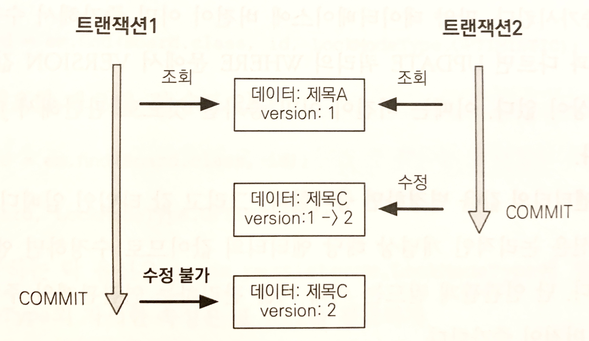

## 트랜잭션과 락
### 트랜잭션과 격리 수준
트랜잭션은 ACID(Atomicity, Consistency, Isolation, Durability)을 보장해야 한다.

* 원자성 : 트랜잭션 내 실행한 작업들은 하나의 작업처럼 모두 실패 or 성공해야 한다.
* 일관성 : 모든 트랜잭션은 일관성 있는 데이터베이스 상태를 유지해야 한다.
* 격리성 : 동시에 실행되는 트랜잭션들이 서로에게 영향을 끼치지 않도록 격리한다. 예를 들어 동시에 같은 데이터를 수정하지 못하도록 해야 한다.
* 지속성 : 트랜잭션을 성공적으로 끝내면 그 결과가 항상 기록되어야 한다. 중간에 시스템에 문제가 발생해도 데이터베이스 로그 등을 사용해서 성공한 트랜잭션 내용을 복구해야 한다.

트랜잭션은 원자성, 일관성, 지속성을 보장한다. 격리성을 보장하려면 트랜잭션을 차례대로 실행해야 하는데 이는 동시성 처리 성능을 저하시킨다. 따라서 ANSI 표준은 트랜잭션의 격리 수준을 4단계로 나눠 정의한다.

* 트랜잭션 격리 수준
    * READ UNCOMMITED(커밋되지 않은 읽기)
    * READ COMMITTED(커밋된 읽기)
    * REPEATABLE READ(반복 가능한 읽기)
    * SERIALIZABLE(직렬화 가능)
    
순서대로 READ UNCOMMITED의 격리 수준이 가장 낮고, SERIALIZABLE의 격리 수준이 높다. 격리 수준이 낮을수록 동시성은 증가하지만 격리 수준에 따른 다양한 문제가 발생한다.

* 트랜잭션 격리 수준과 문제점

<table>
  <thead>
    <tr>
      <th>격리 수준</th>
      <th>DIRTY READ</th>
      <th>NON_REPEATABLE READ</th>
      <th>PHANTOM READ</th>
    </tr>
  </thead>
  <tbody>
    <tr>
      <td>READ UNCOMMITED</td>
      <td>O</td>
      <td>O</td>
      <td>O</td>
    </tr>
    <tr>
      <td>READ COMMITTED</td>
      <td></td>
      <td>O</td>
      <td>O</td>
    </tr>
    <tr>
      <td>REPEATABLE READ</td>
      <td></td>
      <td></td>
      <td>O</td>
    </tr>
    <tr>
      <td>SERIALIZABLE</td>
      <td></td>
      <td></td>
      <td></td>
    </tr>   
  </tbody>
</table>

격리 수준에 따른 문제점은 다음과 같다.

* DIRTY READ
* NON-REPEATABLE READ(반복 불가능한 읽기)
* PHANTOM READ

격리 수준이 낮을 수록 더 많은 문제가 발생한다.

#### READ UNCOMMITED
커밋하지 않은 데이터를 읽을 수 있다. 예를 들어 트랜잭션1이 수정 중인 데이터를 커밋하지 않았어도 트랜잭션2가 수정 중인 데이터를 읽을 수 있다. 이를 `DIRTY READ`라 한다.<br>
트랜잭션2가 DIRTY READ한 데이터를 사용하는데 트랜잭션1을 롤백하면 데이터 정합성에 심각한 문제가 발생한다.<br>
DIRTY READ를 허용하는 격리 수준을 READ UNCOMMITED라 한다.

#### READ COMMITED
커밋한 데이터만 읽을 수 있다. 따라서 DIRTY READ가 발생하지 않는다. 하지만 NON-REPEATABLE READ는 발생할 수 있다.<br>
예를 들어 트랜잭션1이 회원 A를 조회 중인데 갑자기 트랜잭션2가 회원 A를 수정하고 커밋하면 트랜잭션1이 다시 회원 A를 조회했을 때 수정된 데이터가 조회된다.<br>
이처럼 반복해서 같은 데이터를 읽을 수 없는 상태를 NON-REPEATABLE READ라 한다.<br>
DIRTY READ는 허용하지 않지만, NON-REPEATABLE READ는 허용하는 격리 수준을 READ COMMITED라 한다.

#### REPEATABLE READ
한 번 조회한 데이터를 반복해서 조회해도 같은 데이터가 조회된다. 하지만 PHANTOM READ는 발생할 수 있다.<br>
예를 들어 트랜잭션1이 10살 이하의 회원을 조회했는데 트랜잭션2가 5살 회원을 추가하고 커밋하면 트랜잭션1이 다시 10살 이하의 회원을 조회했을 때 회원하나가 추가된 상태로 조회된다. 이처럼 반복 조회 시 결과 집합이 달라지는 것을 PHANTOM READ라 한다.<br>
NON-REPEATABLE READ는 허용하지 않지만 PHANTOM READ는 허용하는 격리 수준을 REPEATABLE READ라 한다.

#### SERIALIZABLE
가장 엄격한 격리 수준으로, PHANTOM READ도 발생하지 않는다. 하지만 동시성 처리 성능이 급격히 떨어질 수 있다.

애플리케이션은 대부분 동시성 처리가 중요하므로 데이터베이스들은 보통 READ COMMITED 격리 수준을 기본으로 사용한다.

> 트랜잭션 격리 수준에 따른 동작 방식은 데이터베이스마다 조금씩 다르다.

### 낙관적 락과 비관적 락 기초
JPA의 영속성 컨텍스트(1차 캐시)를 적절히 활용하면 데이터베이스 트랜잭션이 READ COMMITED 격리 수준이어도 애플리케이션 수준에서 REPEATABLE READ가 가능하다. 물론 스칼라 값을 조회하는 것은 영속성 컨텍스트의 관리를 받지 못하므로 반복 가능한 읽기를 할 수 없다.<br>
JPA는 데이터베이스 트랜잭션 격리 수준을 READ COMMITED 정도로 가정한다. 만약 일부 로직에 더 높은 격리 수준이 필요하면 낙관적 락과 비관적 락 중 하나를 사용하면 된다.

* 낙관적 락
    * 트랜잭션 대부분은 충돌이 발생하지 않는다고 가정하는 방법.
    * 데이터베이스가 제공하는 락 기능이 아닌 JPA가 제공하는 버전 관리 기능을 사용한다. 즉, 애플리케이션이 제공하는 락이다.
    * 트랜잭션을 커밋하기 전까지는 트랜잭션의 충돌을 알 수 없다.
    
* 비관적 락 
    * 트랜잭션의 충돌이 발생한다고 가정하고 우선 락을 걸고 보는 방법.
    * 데이터베이스가 제공하는 락 기능을 사용한다. 대표적으로 select for update 구문이 있다.

추가로, 데이터베이스 트랜잭션 범위를 넘어서는 문제도 있다.<br>
예를 들어 사용자 A와 B가 동시에 제목이 같은 공지사항을 수정할 때 사용자 A가 먼저 수정완료 버튼을 누르고 잠시 후 사용자 B가 수정완료 버튼을 누르면 결과적으로 사용자 A의 수정내역은 사라지고 사용자 B의 수정기록만 남게된다. 이를 `두 번의 갱신 분실 문제(second lost updates problem)`이라 한다.<br>
두 번의 갱신 분실 문제는 데이터베이스 트랜잭션의 범위를 넘어선다. 따라서 트랜잭션만으로 해결할 수 없다. 이 떄는 3가지 방법이 있다.

* 마지막 커밋만 인정하기 : 사용자 A의 내용은 무시하고 마지막에 커밋한 사용자 B의 내용만 인정
* 최초 커밋만 인정하기 : 사용자 A가 이미 수정을 완료했으므로 사용자 B가 수정을 완료할 때 오류 발생
* 충돌하는 갱신 내용 병합하기 : 사용자 A와 사용자 B의 수정사항을 병합.

기본은 마지막 커밋만 인정하기가 사용된다. 하지만 상황에 따라 최초 커밋만 인정하기가 더 합리적일 수 있다. JPA가 제공하는 버전 관리 기능을 사용하면 손쉽게 최초 커밋만 인정하기를 구현할 수 있다.<br>
충돌하는 갱신 내용 병합하기는 최초 커밋만 인정하기를 조금 더 우아하게 처리하는 방법인데 애플리케이션 개발자가 직접 사용자를 위해 병합 방법을 제공해야 한다.

### @Version
JPA가 제공하는 낙관적 락을 사용하려면 @Version 어노테이션을 사용해서 버전 관리 기능을 추가해야 한다.

* @Version 적용 가능 타입
    * Long(long)
    
    * Integer(int)
    
    * Short(short)
    
    * Timestamp
    
```java
@Entity
public class Board {
    
    @Id
    private String id;
    private String title;

    @Version
    private Integer version;
}
```
엔티티에 버전 관리용 필드를 하나 추가하고 @Version을 붙이면 엔티티를 수정할 때마다 버전이 하나씩 자동으로 증가한다. 그리고 엔티티를 수정할 때 조회 시점의 버전과 수정 시점의 버전이 다르면 예외가 발생한다.<br>
예를 들어 트랜잭션1이 조회한 엔티티를 수정하는데 트랜잭션2에서 같은 엔티티를 수정하고 커밋해서 버전이 증가해버리면 트랜잭션1이 커밋할 때 버전 정보가 다르므로 예외가 발생한다.


> 버전 정보를 사용하면 `최초 커밋만 인정하기`가 적용된다.

#### 버전 정보 비교 방법
엔티티를 수정하고 트랜잭션을 커밋하면 영속성 컨텍스트를 flush하면서 UPDATE 쿼리를 실행한다. 이 때 버전을 사용하는 엔티티면 검색 조건에 엔티티의 버전 정보를 추가한다.

```sql
UPDATE BOARD
SET
    TITLE=?,
    VERSION=?   (버전 +1 증가)
WHERE
    ID=?
    AND VERSION=?   (버전 비교)
```

데이터베이스 버전과 엔티티 버전이 같으면 데이터를 수정할 때 동시에 버전도 하나 증가시킨다. 데이터베이스 버전이 증가해서 엔티티의 버전과 다르게 되면 JPA가 예외를 발생시킨다.

> `버전은 엔티티의 값을 변경하면 증가`한다. 단, 연관관계 필드는 외래 키를 관리하는 연관관계의 주인 필드를 수정할 때만 버전이 증가한다.

@Version으로 추가한 버전 관리 필드는 JPA가 직접 관리하므로 개발자가 임의로 수정하면 안된다.(벌크 연산 제외)<br>
만약 버전 값을 강제로 증가하려면 특별한 락 옵션을 선택하면 된다.

> 벌크 연산은 버전을 무시한다. 따라서 벌크 연산에서는 버전 필드를 강제로 증가시켜줘야 한다.

### JPA 락 사용

> JPA를 사용할 때 추천하는 전략은 READ COMMITED 트랜잭션 격리 수준 + 낙관적 버전 관리다(두 번의 갱신 내역 분실 문제 예방)

락은 다음 위치에 적용할 수 있다.

* EntityManager.lock(), EntityManager.find(), EntityManager.refresh()

* Query.setLockMode() (TypeQuery 포함)

* @NamedQuery

다음처럼 조회할 때 락을 걸 수 있다.

```java
Board board = em.find(Board.class, id, LockModeType.OPTIMISTIC);
```

다음처럼 필요할 때 락을 걸 수도 있다.

```java
Board board = em.find(Board.class, id);
//...
em.lock(board, LockModeType.OPTIMISTIC);
```

#### JPA가 제공하는 LockModeType옵션

<table>
  <thead>
    <tr>
      <th>락 모드</th>
      <th>타입</th>
      <th>설명</th>
    </tr>
  </thead>
  <tbody>
    <tr>
      <td>낙관적 락</td>
      <td>OPTIMISTIC</td>
      <td>낙관적 락을 사용한다.</td>
    </tr>
    <tr>
      <td>낙관적 락</td>
      <td>OPTIMISTIC_FORCE_INCREMENT</td>
      <td>낙관적 락 + 버전정보를 강제로 증가</td>
    </tr>
    <tr>
      <td>비관적 락</td>
      <td>PESSIMISTIC_READ</td>
      <td>비관적 락, 읽기 락을 사용</td>
    </tr>
    <tr>
      <td>비관적 락/td>
      <td>PESSIMISTIC_WRITE</td>
      <td>비관적 락, 쓰기 락을 사용</td>
    </tr>
    <tr>
      <td>비관적 락</td>
      <td>PESSIMISTIC_FORCE_INCREMENT</td>
      <td>비관적 락 + 버전정보를 강제로 증가</td>
    </tr>
    <tr>
      <td>기타</td>
      <td>NONE</td>
      <td>락을 걸지 않는다.</td>
    </tr>
    <tr>
      <td>기타</td>
      <td>READ</td>
      <td>JPA 1.0 호환 기능이다. OPTIMISTIC과 같으므로 OPTIMISTIC을 사용하면 된다.</td>
    </tr>
    <tr>
      <td>기타</td>
      <td>WRITE</td>
      <td>JPA 1.0 호환 기능이다. OPTIMISTIC_FORCE_INCREMENT와 같다.</td>
    </tr>
  </tbody>
</table>

### JPA 낙관적 락
버전을 통해 트랜잭션을 커밋하는 시점에 충돌을 알 수 있다.

* 낙관적 락에서 발생하는 예외

    * javax.persistence.OptimisticLockException(JPA 예외)
    * org.hibernate.StaleObjectStateException(하이버네이트 예외)
    * org.springframework.orm.ObjectOptimisticLockingFailureException(스프링 예외 추상화)

> 락 옵션 없이 @Version만 있어도 낙관적 락이 적용된다. 락 옵션을 사용하면 락을 더 세밀하게 제어할 수 있다.

#### NONE
락 옵션을 적용하지 않아도 @Version이 적용된 필드만 있으면 낙관적 락이 적용된다.

#### OPTIMISTIC
@Version만 적용했을 때는 엔티티를 수정해야 버전을 체크하지만 OPTIMISTIC 옵션을 추가하면 엔티티를 조회만 해도 버전을 체크한다.<br>
즉, 한 번 조회한 엔티티는 트랜잭션을 종료할 때까지 다른 트랜잭션에서 변경하지 않음을 보장한다.

#### OPTIMISTIC_FORCE_INCREMENT
낙관적 락을 사용하면서 버전 정보를 강제로 증가한다.<br>
용도 : 논리적인 단위의 엔티티 묶음을 관리할 수 있다. 물리적으로는 변경되지 않았지만 논리적으로 변경된 경우에 OPTIMISTIC_FORCE_INCREMENT를 사용한다.
동작 : 엔티티를 수정하지 않았어도 UPDATE 쿼리를 사용해서 버전 정보를 강제로 증가시킨다.
이점 : 강제로 버전을 증가해서 논리적인 단위의 엔티티 묶음을 버전 관리할 수 있다.
### JPA 비관적 락
JPA가 제공하는 비관적 락은 데이터베이스 트랜잭션 락 메커니즘에 의존한다. 주로 SQL 쿼리에 select for update 구문을 사용하면서 시작하고 버전 정보는 사용하지 않는다.<br>
비관적 락은 주로 PESSIMISTIC_WRITE 모드를 사용한다.

* 비관적 락의 특징
    * 엔티티가 아닌 스칼라 타입을 조회할 때도 사용할 수 있다.
    * 데이터를 수정하는 특시 트랜잭션 충돌을 감지할 수 있다.
    
* 비관적 락에서 발생하는 예외
    * javax.persistence.PessimisticLockException(JPA 예외)
    * org.springframework.dao.PessimisticLockingFailureException(스프링 예외 추상화)

#### PESSIMISTIC_WRITE
비관적 락의 일반적인 옵션이다. 데이터베이스 쓰기 락을 걸때 사용한다.
용도 : 데이터베이스에 쓰기 락을 건다.
동작 : 데이터베이스 select for update를 사용해서 락을 건다.
이점 : NON-REPEATABLE READ를 방지한다. 락이 걸린 로우는 다른 트랜잭션이 수정할 수 없다.

#### PESSIMISTIC_READ
데이터를 반복 읽기만 하고 수정하지 않는 용도로 락을 걸 때 사용한다.

#### PESSIMISTIC_FORCE_INCREMENT
비관적 락 중 유일하게 버전 정보를 사용한다. 비관적 락이지만 버전 정보를 강제로 증가시킨다.

### 비관적 락과 타임아웃
비관적 락을 사용하면 락을 획득할 떄까지 트랜잭션이 대기한다. 무한정 기다릴 수는 없으므로 타임아웃 시간을 줄 수 있다.

## 2차 캐시
### 1차 캐시와 2차 캐시
네트워크를 통해 데이터베이스에 접근하는 시간보다 애플리케이션 내부 메모리 캐시에 접근하는 것이 성능을 획기적으로 개선할 수 있는 방법 중 하나다.<br>
일반적으로 웹 애플리케이션 환경은 트랜잭션을 시작하고 종료할 때 까지만 1차 캐시가 유효하다. 따라서 데이터베이스 접근 횟수를 획기적으로 줄이지는 못한다.<br>
하이버네이트를 포함한 대부분의 JPA 구현체들은 애플리케이션 범위의 캐시를 지원하는데 이것을 공유 캐시, 2차 캐시라 한다. 이런 2차 캐시를 활용하면 애플리케이션 조회 성능을 향상시킬 수 있다.


#### 1차 캐시
1차 캐시는 영속성 컨텍스트 내부에 있다. 트랜잭션을 커밋하거나 flush를 호출하면 1차 캐시에 있는 엔티티의 변경 내역을 데이터베이스에 동기화한다.<br>
보통 트랜잭션을 시작할 때 영속성 컨텍스트를 생성하고 트랜잭션을 종료할 때 영속성 컨텍스트도 종료한다. 물론 OSIV를 사용하면 요청의 시작부터 끝까지 같은 영속성 컨텍스트를 유지한다.
1차 캐시는 끄고 켤수 있는 옵션이 아니다. 영속성 컨텍스트 자체가 1차 캐시다.

#### 2차 캐시
애플리케이션에서 공유하는 캐시를 말한다. 따라서 애플리케이션을 종료할 때까지 캐시가 유지된다. 분산 캐시나 클러스터링 환경의 캐시는 애플리케이션보다 더 오래 유지될 수도 있다.<br>
2차 캐시를 적용하면 엔티티 매니저를 통해 데이터를 조회할 때 우선 2차 캐시에서 찾고 없으면 데이터베이스에서 찾는다. 2차 캐시를 적절히 활용하면 데이터베이스 조회 횟수를 획기적으로 줄일 수 있다.<br>
2차 캐시는 동시성을 극대화하려고 캐시한 객체를 직접 반환하지 않고 복사본을 만들어서 반환한다. 

* 2차 캐시의 특징
    * 영속성 유닛 범위의 캐시다.
    * 2차 캐시는 조회한 객체를 그대로 반환하는 것이 아닌 복사본을 만들어서 반환한다.
    * 데이터베이스 기본 키를 기준으로 캐시하지만 영속성 컨텍스트가 다르면 객체 동일성(a == b)을 보장하지 않는다.
    
### JPA 2차 캐시 기능
#### 캐시 모드 설정
@Cacheable 어노테이션을 사용하면 된다. 캐시 모드는 javax.persistence.ShareCacheMode에 정의되어 있다. 보통 `ENABLE_SELECTIVE`를 사용한다.

* SharedCacheMode 캐시 모드 설정

<table>
  <thead>
    <tr>
      <th>캐시 모드</th>
      <th>설명</th>
    </tr>
  </thead>
  <tbody>
    <tr>
      <td>ALL</td>
      <td>모든 엔티티를 캐시한다.</td>
    </tr>
    <tr>
      <td>NONE</td>
      <td>캐시를 사용하지 않는다.</td>
    </tr>
    <tr>
      <td>ENABLE_SELECTIVE</td>
      <td>Cacheable(true)로 설정된 엔티티만 캐시를 적용한다.</td>
    </tr>
    <tr>
      <td>DISABLE_SELECTIVE</td>
      <td>모든 엔티티를 캐시하는데 Cacheable(false)로 명시된 엔티티는 캐시하지 않는다.</td>
    </tr>
    <tr>
      <td>UNSPECIFIED</td>
      <td>JPA 구현체가 정의한 설정을 따른다.</td>
    </tr>  
  </tbody>
</table>

#### 캐시 조회, 저장 방식 설정
캐시를 무시하고 데이터베이스를 직접 조회하거나 캐시를 갱신하려면 캐시 조회모드와 캐시 보관 모드를 사용하면 된다.

```java
em.setProperty("javax.persistence.cache.retrieveMode", CacheRetrieveMode.BYPASS);
```

* javax.persistence.cache.retrieveMode : 캐시 조회 모드 프로퍼티 이름

* javax.persistence.cache.storeMode : 캐시 보관 모드 프로퍼티 이름

* javax.persistence.CacheRetrieveMode : 캐시 조회 모드 설정 옵션
    * USE : 캐시에서 조회한다. 기본 값
    * BYPASS : 캐시를 무시하고 데이터베이스에 직접 접근한다.
    
* javax.persistence.CacheStoreMode : 캐시 보관 모드 설정 옵션
    * USE : 조회한 데이터를 캐시에 저장한다. 조회한 데이터가 이미 캐시에 있으면 최신 데이터로 갱신하지는 않는다. 트랜잭션을 커밋할 때 엔티티도 캐시에 저장한다. 기본 값 
    * BYPASS : 캐시에 저장하지 않는다.
    * REFERSH : USE 전략에 추가로 데이터베이스에서 조회한 엔티티를 최신 상태로 다시 캐시한다.

### 하이버네이트와 EHCACHE 적용

* 하이버네이트가 지원하는 캐시
    * 엔티티 캐시 : 엔티티 단위로 캐시. 식별자로 엔티티를 조회하거나 컬렉션이 아닌 연관된 엔티티를 로딩할 때 사용
    * 컬렉션 캐시 : 엔티티와 연관된 컬렉션을 캐시. 컬렉션이 엔티티를 담고 있으면 식별자 값만 캐시.
    * 쿼리 캐시 : 쿼리와 파라미터 정보를 키로 사용해서 캐시. 결과가 엔티티면 식별자 값만 캐시.
