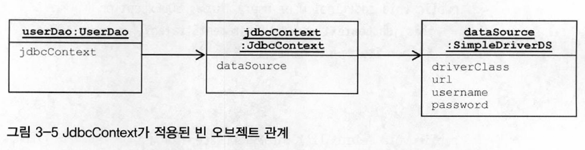
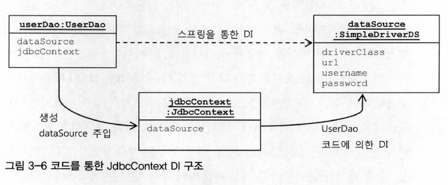
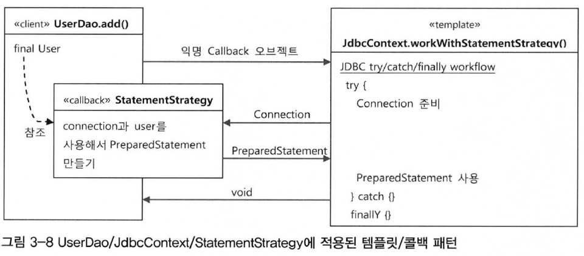
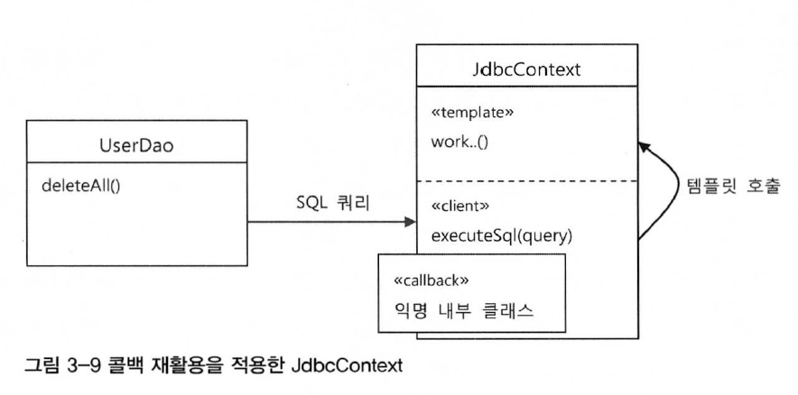

`템플릿`이란 개방 폐쇄 원칙에 따라 변경을 통해 다양해지고 확장하려는 성질을 가진 부분과 고정되고 변하지 않으려는 성질을 가진 부분을 독립시켜 효과적으로 활용하려는 방법을 말한다.
## 예외처리 기능을 갖춘 DAO
### JDBC 수정 기능의 예외처리 코드
# 다시보는 초난감 DAO
> 리소스 반환과 close()
> 미리 정해진 풀 안에 제한된 수의 리소스(Connection, PreparedStatement)를 만들어 두고 필요할 때 할당하고, 반환하면 다시 풀에 넣는 방식으로 운영된다.<br>
> 요청이 매우 많은 서버환경에서는 매번 새로운 리소스를 생성하는 대신 풀에 미리 만들어둔 리소스를 돌려가며 사용하는 편이 유리하다. 대신, 리소스는 빠르게 반환되어야 한다. 그렇지 않으면 풀에 있는 리소스가 고갈되고 문제가 발생하게 된다.<br>
> close() 메소드는 사용한 리소스를 풀로 다시 돌려주는 역할을 한다.

```java
public void deleteAll() throws SQLException {
    Connection c = dataSource.getConnection();

    PreparedStatement ps = c.preparedStatement("delete from users");
    ps.executeUpdate();     //  여기서 예외가 발생하면 바로 메소드 실행이 중단되면서 DB 커넥션이 반환되지 못한다.

    ps.close();
    c.close();
}
```
일반적으로 서버에는 제한된 개수의 DB 커넥션을 만들어 재사용 가능한 풀로 관리하게 되는데 위와 같은 코드에서는 중간에 오류가 나면 리소스가 제대로 반환되지 않아 커넥션 풀에 여유가 없어지고 리소스가 모자란다는 심각한 오류가 발생될 수 있다.<br>
이러한 경우 `try/catch/finally` 구문을 활용하여 예외상황을 처리할 수 있다.

* 예외발생 시에도 리소스를 반환하도록 수정한 deleteAll()

```java
public void deleteAll() throws SQLException {
    Connection c = null;
    PreparedStatement ps = null;
    
    try {
        c = dataSource.getConnection();
        ps = c.prepareStatement("delete from users");
        ps.executeUpdate();     //  예외가 발생할 수 있는 코드를 모두 try 블록으로 묶어준다.
    } catch (SQLException e) {
        throw e;        //  예외가 발생했을 때 부가적인 작업을 해줄 수 있도록 catch 블록을 둔다. 아직은 예외를 메소드 밖으로 던지는 것 밖에 없다.
    } finally {         //  finally이므로 try 블록에서 예외가 발생했을 떄나 안 했을 때나 모두 실행된다.
        if (ps != null) {
            try {
                ps.close();
            } catch (SQLException e) {} //  ps.close() 메소드에서도 SQLException이 밣생할 수 있기 때문에 잡아줘야한다.
        }
        if (c != null) {
            try {
                c.close();
            } catch (SQLException e) {}
        }
    }
}
``` 
이러면 예외 상황에서도 안전한 DAO가 된다.
# 변하는 것과 변하지 않는 것
## JDBC try/catch/finally 코드의 문제점
하지만, 복잡한 구조와 보기 힘든 가독, 중복되는 코드는 개선돼야할 부분이다. 이를 해결하기 위한 방법으로 1장에 나온 것 처럼 중복되는 구문을 분리해내는 방법이 있다.
## 분리와 재사용을 위한 디자인 패턴 적용
### 메서드 추출
변하는 코드는 별도 메소드로 빼는 방법이 있다.
```java
public void deleteAll() throws SQLException {
    ...
    try {
        c = dataSource.getConnectin();
        ps = makeStatement(c);      //  변하는 부분을 메소드로 추출하고 변하지 않는 부분에서 호출한다.
        ps.executeUpdate();
    } catch (SQLException e) {...}
}

private PreparedStatement makeStatement(Connection c) throws SQLException {
    PreparedStatement ps;
    ps = c.preparedStatement("delete from users");
    return ps;
}
```
하지만 자주 바뀌는 메소드를 독립시키는 방법은 비추다. 보통 메소드 추출 리팩토링은 재사용성이 보장돼야 하는데 이건 반대로 분리시키고 남은 메소드가 재사용이 필요한 부분이고, 분리된 메소드는 DAO 로직마다 새롭게 만들어서 확장돼야 하는 부분이기 때문이다.
### 템플릿 메서드 패턴의 적용
`템플릿 메소드 패턴`은 상속을 통해 기능을 확장해서 사용하는 부분이다. 변하지 않는 부분은 수퍼클래스에 두고 변하는 부분은 추상 메소드로 정의해둬서 서브클래스에서 오버라이드하여 새롭게 정의해 쓰도록 하는 것이다.

```java
abstract protected PreparedStatement makeStatement(Connection c) throws SQLException;

public class UserDaoDeleteAll extends UserDao {
    protected PreparedStatement makeStatement(Connection c) throws SQLException {
        PreparedStatement ps = c.preparedStatement("delete from users");
        return ps;
    }
}
```
추출해서 별도의 메소드로 독립시킨 makeStatement() 메소드를 추상 메소드로 선언한 후(UserDao도 추상 클래스로 선언), 이를 상속하는 서브클래스(UserDaoDeleteAll)를 만들어서 makeStatement 메서드를 구현한다.

> 템플릿 메소드 패턴이란? 
> - [https://gmlwjd9405.github.io/2018/07/13/template-method-pattern.html](https://gmlwjd9405.github.io/2018/07/13/template-method-pattern.html)
> - [https://jusungpark.tistory.com/24](https://jusungpark.tistory.com/24)

이제 UserDao 클래스의 기능을 확장하고 싶을 때 마다 상속을 통해 자유롭게 확장할 수 있고, 확장으로 인해 기존 상위 DAO 클래스에 불필요한 변화도 없으므로 개방 폐쇄 원칙도 지킬 수 있다.<br>
하지만, `템플릿 메소드 패턴으로의 접근은 제한이 많다.` 

* DAO 로직마다 상속을 통해 새로운 클래스를 만들어야 한다는 것이다.
* 확장구조가 이미 클래스를 설계하는 시점에 고정되어 버린다.

### 전략 패턴의 적용
개방 폐쇄 원칙을 잘 지키면서도 템플릿 메소드 패턴보다 유연하고 확장성이 뛰어나며 오브젝트를 아예 둘로 분리하고 클래스 레벨에서는 인터페이스를 통해서만 의존하도록 만드는 것이 `전략 패턴`이다.<br>
전략패턴은 OCP 관점에서 보면 확장에 해당하는 변하는 부분을 별도의 클래스로 만들어 추상화된 인터페이스를 통해 위임하는 방식이다.<br>

Context의 contextMethod()에서 일정한 구조를 갖고 동작하다가 특정 확장 기능을 Strategy 인터페이스를 통해 외부의 독립된 전략 클래스(ConcreteStarategyA, B)에 위임하는 것이다.<br>
즉, 변하지 않는 부분이 contextMethod() 가 된다.
```java
public interface StatementStrategy {
    PreparedStatement makePreparedStatement(Connection c) throws SQLException;
}

public class DeleteAllStatement implements StatementStrategy {
    public PreparedStatement makePreparedStatement(Connection c) throws SQLException {
        PreparedStatement ps = c.preparedStatement("delete from users");
        return ps;
    }
}
```
PreparedStatement 를 만들어주는 외부 기능을 전략 패턴화한 코드이다. StatementStrategy 인터페이스는 컨텍스트가 만들어둔 Connection을 전달받아, PreparedStatement를 만들고 만들어진 PreparedStatement 오브젝트를 돌려준다.<br>
그리고, StatementStrategy 인터페이스를 상속해서 실제 전략, 즉 바뀌는 부분인 PreparedStatement를 생성하는 클래스(DeleteAllStatement)를 만들어 deleteAll() 메소드의 기능을 구현할 수 있다.
```java
public void deleteAll() throws SQLException {
    ...
    try {
        c = dataSource.getConnection();

        StatementStrategy strategy = new DeleteAllStatement();  //  전략 클래스가 DeleteAllStatement로 고정됨으로써 OCP 개방 원칙에 맞지 않게 된다.
        ps = starategy.makePreparedStatement(c);

        ps.executeUpdate();
    } catch (SQLException e) {...}
}
```
이로써, 위와 같이 contextMethod()에 해당하는 UserDao의 deleteAll() 메소드에서 사용함으로써 전략 패턴을 그럭저럭 적용해볼 수 있다.<br>
하지만 전략 패턴은 필요에 따라 컨텍스트는 그대로 유지되면서(OCP) 전략만 바꿔 사용할 수도 있어야(OCP의 개방 원칙) 하는데 위 코드 처럼 고정된 전략 클래스가 호출된다면 OCP에 들어맞는다고 볼 수 없다.
### DI 적용을 위한 클라이언트/컨텍스트 분리
전략 패턴은 Context가 어떤 전략을 사용하게 할 것인가는 Context를 사용하는 앞단의 Client가 결정하는 것이 일반적이다. Client가 구체적인 전략의 하나를 선택하여 오브젝트화하여 Context에 전달하고 Context는 전달받은 그 Strategy 구현 클래스의 오브젝트를 사용한다.

그림을 보면 앞에서 ObjectFactory를 얘기하면서 봤던 구조와 비슷하다. 즉, DI란 전략 패턴의 장점을 일반적으로 활용할 수 있도록 만든 구조임을 알 수 있다.
```java
public void jdbcContextWithStatementStrategy(StatementStrategy stmt) throws SQLException {
    Connection c = null;
    PreparedStatement ps = null;

    try {
        c = dataSource.getConnection();
        ps = stmt.makePreparedStatement(c);
        ps.executeUpdate();
    } catch (SQLException e) {
        throw e;
    } finally {
        if (ps != null) { try { ps.close(); } catch (SQLException e) {}
        if (c != null) { try { c.close(); } catch (SQLException e) {}
    }
}
```
클라이언트로부터 StatementStrategy 타입의 전략 오브젝트를 제공받고 try/catch/finally 구조로 만들어진 컨텍스트 내에서 작업을 수행한다.

* 클라이언트 책임을 담당하는 deleteAll() 메소드

```java
public void deleteAll() throws SQLException {
    StatementStrategy st = new DeleteAllStatement();    //  선정한 전략 클래스의 오브젝트 생성
    jdbcContextWithStatementStrategy(st);               //  컨텍스트 호출. 전략 오브젝트 전
}
``` 

컨텍스트를 별도의 메소드로 분리했으니 deleteAll() 메소드가 클라이언트가 된다. deleteAll()은 전략 오브젝트를 만들고 컨텍스트를 호출하는 책임을 지고 있다.
# JDBC 전략 패턴의 최적화
## 전략 클래스의 추가 정보
## 전략과 클라이언트의 동거
위 구조를 보면 두 가지 개선할 사항을 찾을 수 있다.
* DAO 메소드마다 새로운 StatementStrategy 구현 클래스를 만들어야 한다.
    * 클래스 파일의 개수가 많아지게 된다 -> 로컬 클래스를 사용하여 해결할 수 있다.
* DAO 메소드에서 StatementStrategy에 전달할 User와 같은 부가적인 정보가 있는 경우, 이를 전달하고 저장해 둘 생성자와 인스턴스 변수를 번거롭게 만들어야 한다.
### 로컬 클래스
StatementStrategy 전략 클래스를 매번 독립된 파일로 만드는 것이 아닌, UserDao 클래스 안에 내부 클래스로 정의하는 방법이다.
```java
public void add(User user) throws SQLException {
    class AddStatement implements StatementStrategy {   //  add() 메소드 내부에 선언된 로컬 클래
        User user;

        public AddStatement(User user) {
            this.user = user;
        }

        public PreparedStatement makePreparedStatement(Connection c) throws SQLException {
            PreparedStatement ps = c.prepareStatement("insert into users(id, name, password) values(?,?,?)");
            ...
        }

        StatementStrategy st = new AddStatement(user);
        jdbcContextWithStatementStrategy(st);
    }
}
```

> 중첩 클래스의 종류
> * 중첩 클래스(nested class) : 다른 클래스 내부에 정의되는 클래스
>   * 스태틱 클래스(static class) : 독립적으로 오브젝트로 만들어질 수 있는 클래스
>   * 내부 클래스(inner class) : 자신이 정의된 클래스의 오브젝트 안에서만 만들어질 수 있는 클래스
>       * 멤버 내부 클래스(member inner class) : 멤버 필드처럼 오브젝트 레벨에 정의되는 클래스
>       * 로컬 클래스(local class) : 메소드 레벨에 정의되는 클래스
>       * 익명 내부 클래스(anonymous inner class) : 이름을 갖지 않는 클래스

로컬 클래스는 선언된 메소드 내에서만 사용할 수 있다. 로컬 클래스의 한가지 장점은 클래스가 내부 클래스이기 때문에 `자신이 선언된 곳의 정보에 접근할 수 있다`는 점이다.<br>
다만, 내부 클래스에서 외부의 변수를 사용할 때는 외부 변수는 반드시 final로 선언해줘야 한다. user 파라미터는 메소드 내부에서 변경될 일이 없으므로 final로 선언해도 무방하다.

```java
public void add(final User user) throws SQLException {  
    class AddStatement implements StatementStrategy {
        public PreparedStatement makePreparedStatement(Connection c) throws SQLException {
            PreparedStatement ps = c.prepareStatement("insert into users(id, name, password) values(?,?,?)");

            ps.setString(1, user.getId());  //  로컬 클래스의 코드에서 외부의 메소드 로컬변수(user)에 직접 접근할 수 있다.
            ps.setString(2, user.getName();
            ...
            return ps;
        }

        StatementStrategy st = new AddStatement();  //  생성자 파라미터로 user를 전달하지 않아도 된다.
        jdbcContextWithStatementStrategy(st);
    }    
}
```

> 내부 클래스에서 외부 변수 사용시 final로 선언해야 하는 이유는?
> * [https://futurecreator.github.io/2018/08/02/java-lambda-variable-scope/](https://futurecreator.github.io/2018/08/02/java-lambda-variable-scope/)

 로컬 클래스를 사용함으로써 `메소드 마다 추가해야 했던 클래스 파일을 줄일 수 있다`는 점과 `내부 클래스의 특징을 이용해 로컬 변수를 생성자 선언 없이 바로 가져다 사용할 수 있다`는 점이 장점이다.

### 익명 내부 클래스
여기서 한 가지 더 간결하게 구현할 수 있다면 클래스 이름도 제거할 수 있다.

> 익명 내부 클래스 : 클래스 선언과 오브젝트 생성이 결합된 형태로, 상속할 클래스나 구현할 인터페이스를 생성자 대신 사용하여 다음과 같은 형태로 만들어 사용한다.
> new 인터페이스명() { 클래스 본문 };

```java
public void add(final User user) throws SQLException {
    jdbcContextWithStatementStrategy(
        new StatementStrategy() {
            public PreparedStatement makePreparedStatement(Connection c) throws SQLException {
                PreparedStatement ps = c.prepareStatement("insert into users(id, name, password) values(?,?,?)");
    
                ps.setString(1, user.getId());
                ps.setString(2, user.getName();
                ...
                return ps;
            }
        }
    );
}
```
# 컨텍스트와 DI
## JdbcContext의 분리
jdbcContextWithStatementStrategy()는 다른 DAO에서도 사용 가능하므로 이를 UserDao 클래스 밖으로 독립시켜 모든 DAO가 사용가능할 수 있게 해본다.
### 클래스 분리
JdbcContext 클래스를 새로 생성하고 UserDao에 있던 컨텍스트 메소드를 workWithStatementStrategy()라는 이름으로 옮긴다. 근데 이렇게 하면 DataSource가 필요한 것은 UserDao가 아닌 JdbcContext가 돼버리므로 JdbcContext가 DataSource 타입 빈을 DI 받을 수 있게 해줘야 한다.

* JDBC 작업 흐름을 분리해서 만든 JdbcContext 클래스

```java
public class JdbcContext {
    private DataSource dataSource;

    public void setDataSource(DataSource dataSource) {  //  DataSource 타입 빈을 DI 받을 수 있게 준비
        this.dataSource = dataSource;
    }

    public void workWithStatementStrategy(StatementStrategy stmt) throws SQLException {
        Connection c = null;
        PreparedStatement ps = null;

        try {...} 
        catch (SQLException e) {...}
        finally {...}
    }
}
```

* JdbcContext를 DI 받아서 사용하도록 만든 UserDao

```java
public class UserDao {
    ...
    private JdbcContext jdbcContext;

    public void setJdbcContext(JdbcContext jdbcContext) {
        this.jdbcContext = jdbcContext;             //  jdbcContext를 Di받도록 만든다.
    }

    public void add(final User user) throws SQLException {
        this.jdbcContext.workWithStatementStrategy(     //  DI 받은 JdbcContext의 컨텍스트 메소드를 사용하도록 변경한다.
            new StatementStrategy() {...}
        );
    }
}
```
### 빈 의존관계 변경
스프링의 DI는 기본적으로 인터페이스를 사이에 두고 의존 클래스를 바꿔서 사용하도록 하는 게 목적이다. 하지만 이 경우 JdbcContext는 그 자체로 독립적인 JDBC 컨텍스트를 제공해주는 서비스 오브젝트로서 의미가 있을 뿐이고 구현 방법이 바뀔 가능성은 없다. 따라서 인터페이스를 구현하도록 만들지 않았고, UserDao와 JdbcContext는 인터페이스를 사이에 두지 않고 DI를 적용하는 특별한 구조가 된다.

스프링의 빈 설정은 클래스 레벨이 아니라 런타임 시에 만들어지는 오브젝트 레벨의 의존관계에 따라 정의된다. 빈으로 정의되는 오브젝트 사이의 관계를 그려보면 아래와 같다.

기존에는 UserDao 빈이 dataSource 빈을 직접 의존했지만, 이제는 jdbcContext 빈이 그 사이에 끼게 된다.<br>
이로써 JdbcContext를 UserDao로부터 완전히 분리하고 DI를 통해 연결될 수 있도록 설정을 마쳤다.
## JdbcContext의 특별한 DI
UserDao는 인터페이스를 거치지 않고 바로 JdbcContext 클래스를 사용하게 되면서 서로 클래스 레벨에서 의존관계가 결정된다. 런타임 시에 DI 방식으로 외부에서 오브젝트를 주입해주는 방식을 사용하긴 했지만, 의존 오브젝트의 구현 클래스를 변경할 수는 없다.
### 스프링 빈으로 DI
그렇다면 이렇게 인터페이스를 사용하지 않고 DI 를 적용하는 것은 문제가 없을까?<br>
결론부터 말하자면, DI 를 잘 따른다고 볼 수 있다. 의존관계 주입이라는 개념에 충실하자면 온전한 DI라고 볼수는 없지만, 스프링의 DI는 넓게 보자면 객체의 생성과 관계설정에 대한 제어권한을 오브젝트에서 제거하고 외부로 위임했다는 IoC라는 개념을 포괄한다. 그런의미에서 JdbcContext를 스프링을 이용해 UserDao 객체에서 사용하게 주입했다는 건 DI의 기본을 따르고 있다고 볼 수 있다.<br>
JdbcContext와 UserDao가 DI구조로 만들어진 이유는 무엇일까?<br>
* JdbcContext가 스프링 컨테이너의 싱글톤 레지스트리에서 관리되는 싱글톤 빈이 되기 때문
    * JdbcContext는 JDBC 컨텍스트 메소드를 제공해주는 일종의 서비스 오브젝트로서 의미가 있고, jdbcContext 내부에 dataSource는 읽기 전용이기 때문에 싱글톤으로 등록돼서 여러 오브젝트에서 공유해 사용되는 것이 이상적이다.
* JdbcContext가 DI를 통해 다른 빈에 의존하고 있기 때문
    * DI를 위해서는 주입되는 오브젝트와 주입받는 오브젝트 양쪽 모두 스프링 빈으로 등록돼야 한다. 따라서 JdbcContext는 다른 빈을 DI 받기 위해서라도 스프링 빈으로 등록돼야 한다.
그렇다면 이런 식으로 중간에 인터페이스 없이 직접 의존관계를 맺게 되었을까?<br>
인터페이스가 없다는 것은 UserDao와 JdbcContext가 매우 강한 응집도를 갖고 있음을 의미한다. 클래스만 구분되어 있지 한 몸이라고 볼 수 있다. 이런 경우는 굳이 인터페이스를 두지 않고 강력한 결합을 가진 관계를 허용하면서 싱글톤으로 만드는 것과 JdbcContext에 대한 DI 필요성을 위해 스프링의 빈으로 등록해서 UserDao에 DI 되도록 만들어도 좋다.<br>
단, 이런 구성을 DI에 적용하는 것은 가장 마지막 단계에서 고려해야 한다.

### 코드를 이용하는 수동 DI
JdbcContext를 스프링의 빈으로 등록해서 UserDao에 DI 하는 대신 사용할 수 있는 방법으로 UserDao 내부에서 직접 DI를 적용하는 방법이 있다.<br>
단, 이 방식은 싱글톤을 포기해야 한다.<br>
JdbcContext를 스프링 빈으로 등록하지 않았으므로 다른 누군가, 즉 UserDao가 JdbcContext의 제어권을 갖고 생성과 초기화를 책임져야 한다. 추가로 DI까지 맡겨 UserDao가 DI 컨테이너처럼 동작하게 만들어야 한다.<br>

스프링 설정 파일에 userDao와 dataSource 두 개만 빈으로 정의하고 userDao 빈에 DataSource 타입 프로퍼티를 지정해서 dataSource 빈을 주입받도록한다. UserDao는 JdbcContext 오브젝트를 만들면서 DI 받은 DataSource 오브젝트를 JdbcContext 의 수정자 메소드로 주입해준다. 만들어진 JdbcContext 오브젝트는 UserDao의 인스턴스 변수에 저장해두고 사용한다.<br>
이 방법의 장점은 굳이 인터페이스를 두지 않아도 될 만큼 긴밀한 관계를 갖는 DAO클래스와 JdbcContext를 어색하게 따로 빈으로 분리하지 않고 내부에서 직접 만들어 사용하면서도 다른 오브젝트에 대한 DI를 적용할 수 있다는 점이다. 인터페이스를 사용하지 않는 클래스와의 의존관계이지만 스프링의 DI를 이용하기 위해 빈으로 등록해서 사용하는 방법은 오브젝트 사이의 실제 의존관계가 설정파일에 명확하게 드러난다는 장점이 있다.<br>
하지만, DI의 근본적인 원칙에 부합하지 않는 구체적인 클래스와의 관계가 설정에 직접 노출된다는 단점도 있다.

* DAO의 코드를 이용해 수동으로 DI를 하는 방법의 장점
    * JdbcContext가 UserDao의 내부에서 만들어지고 사용되면서 그 관계를 외부에는 드러내지 않는다.
* DAO의 코드를 이용해 수동으로 DI를 하는 방법의 단점
    * 여러 오브젝트가 사용하더라도 싱글톤으로 만들 수 없다.
    * DI 작업을 위한 부가적인 코드가 필요하
  
# 템플릿과 콜백
복잡하지만 바뀌지 않는 일정한 패턴을 갖는 작업 흐름이 존재하고, 그 중 일부분만 자주 바꿔서 사용해야 하는 경우에 적합한 구조로 전략 패턴의 기본 구조에 익명 내부 클래스를 활용한 방식을 `템플릿/콜백 패턴`이라고 한다.<br>
`전략 패턴의 컨텍스트`를 템플릿이라 부르고, `익명 내부 클래스로 만들어지는 오브젝트`를 콜백이라고 부른다.

> * 템플릿
>   * 프로그래밍에서 고정된 틀 안에 바꿀 수 있는 부분을 넣어서 사용하는 경우에 템플릿이라고 부른다.
> * 콜백
>   * 실행되는 것을 목적으로 다른 오브젝트의 메소드에 전달되는 오브젝트를 말한다. 파라미터로 전달되지만 값을 참조하기 위함이 아닌 특정 로직을 담은 메소드를 실행시키기 위해 사용한다.

## 템플릿/콜백의 동작원리
템플릿은 고정된 작업 흐름을 가진 코드를 재사용한다는 의미에서 붙인 이름이다. 콜백은 템플릿 안에서 호출되는 것을 목적으로 만들어진 오브젝트를 말한다.
### 템플릿/콜백의 특징
여러 개의 메소드를 가진 일반적인 인터페이스를 사용할 수 있는 전략 패턴의 전략과 달리 `템플릿/콜백 패턴은 보통 단일 메소드 인터페이스를 사용`한다. 템플릿의 작업 흐름 중 특정 기능을 위해 한 번 호출되는 경우가 일반적이기 때문이다. 따라서 하나의 템플릿에서 여러 가지 종류의 전략을 사용해야 한다면 하나 이상의 콜백 오브젝트를 사용할 수도 있다.<br>

* 클라이언트의 역할은 템플릿 안에서 실행될 로직을 담은 콜백 오브젝트를 만들고, 콜백이 참조할 정보를 제공하는 것이다. 만들어진 콜백은 클라이언트가 템플릿의 메소드를 호출할 때 파라미터로 전달된다.
* 템플릿은 정해진 작업 흐름을 따라 작업을 진행하다가 내부에서 생성한 참조정보를 가지고 콜백 오브젝트의 메소드를 호출한다. 콜백은 클라이언트 메소드에 있는 정보와 템플릿이 제공한 참조정보를 이용해서 작업을 수행하고 그 결과를 다시 템플릿에 돌려준다,
* 템플릿은 콜백이 돌려준 정보를 사용해서 작업을 마저 수행한다. 경우에 따라 최종 결과를 클라이언트에 다시 돌려주기도 한다.

템플릿/콜백 패턴은 DI 방식의 전략 패턴 구조라고 보면 된다.

* 템플릿/콜백 패턴의 특징
    * 일반적인 DI라면 템플릿에 인스턴스 변수를 만들어두고 사용할 의존 오브젝트를 수정자 메소드로 받아서 사용하지만, 템플릿/콜백 패턴은 매번 메소드 단위로 사용할 오브젝트를 새롭게 전달받는다.
    * 콜백 오브젝트가 내부 클래스로서 자신을 생성한 클라이언트 메소드 내의 정보를 직접 참조한다
    * 클라이언트와 콜백이 강하게 결합된다는 면에서 일반적인 DI와는 조금 다르다.

다시 말해서, 템플릿/콜백 패턴은 전략 패턴과 DI의 장점을 익명 내부 클래스 사용 전략과 결합한 독특한 활용법이라고 볼 수 있다.
### JdbcContext에 적용된 템플릿/콜백

## 편리한 콜백의 재활용
클라이언트인 DAO의 메소드는 간결해지고 최소한의 데이터 액세스 로직만 갖고 있게 되어 편리하다. 하지만, DAO 메소드에서 매번 익명 내부 클래스를 사용하기 때문에 상대적으로 코드를 작성하고 읽기가 조금 불편하다.
### 콜백의 분리와 재활용
복잡한 익명 내부 클래스의 사용을 최소화 할 수 있는 방법으로 JDBC의 try/catch/finally 에 적용한 방법을 적용해볼 수 있다.
* 익명 내부 클래스를 사용한 클라이언트 코드

```java
public void deleteAll() throws SQLException {
    this.jdbcContext.workWithStatementStrategy(
        new StatementStrategy() {   //  변하지 않는 콜백 클래스 정의와 오브젝트 생성
            public PreparedStatement makePreparedStatement(Connection c) throws SQLException {
                return c.preparedStatement("delete from users");    //  변하는 SQL 문장
            }
        }
    );
}
```

* 변하지 않는 부분을 분리시킨 deleteAll() 메소드

```java
public void deleteAll() throws SQLException {
    executeSql("delete from users");
}
------------------------------------ 분리 ------------------------------------ 
private void executeSql(final String query) throws SQLException {
    this.jdbcContext.workWithStatementStrategy(
        new StatementStrategy() {   //  변하지 않는 콜백 클래스 정의와 오브젝트 생성
            public PreparedStatement makePreparedStatement(Connection c) throws SQLException {
                return c.preparedStatement(query);
            }
        }
    );
}
```
sql을 담은 파라미터를 final로 선언하여 익명 내부 클래스인 콜백 안에서 직접 사용할 수 있게 하는 부분만 주의하면 된다.
### 콜백과 템플릿의 결합
UserDao에서만 사용되기 아까운 재사용 가능한 콜백을 담고있는 executeSql() 메소드를 템플릿 클래스 안으로 옮길 수 있다.
```java
public class JdbcContext {
    ...
    public void executeSql(final String query) throws SQLException {
        workWithStatementStrategy(
            new StatementStrategy() {...}
        );
    }
}
``` 
이로써 모든 DAO 메소드에서 executeSql() 메소드를 사용할 수 있게 됐다.

결국 JdbcContext 안에 클라이언트와 템플릿, 콜백이 모두 함께 공존하여 동작하는 구조가 되었다.<br>
일반적으로 성격이 다른 코드들은 가능한 한 분리하는 것이 낫지만, 이 경우는 하나의 목적을 위해 서로 긴밀하게 연관되어 동작하는 응집력이 강한 코드들이기 때문에 한 군데 모여있는 것이 유리하다.
