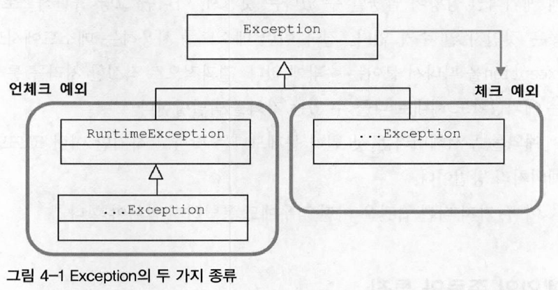
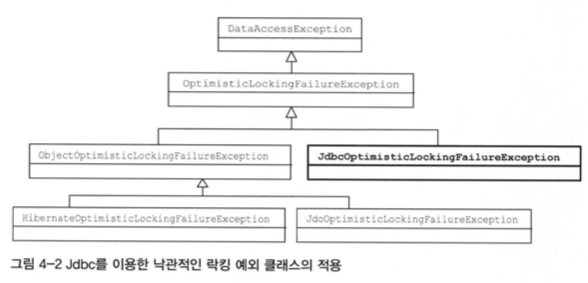

# 사라진 SQLException
## 초난감 예외처리
### 예외 블랙홀
* 초난감 예외처리 코드 1

```java
try {
    ...
} catch (SQLException e) {  //  예외를 잡고 아무것도 하지 않는다. 예외 발생을 무시해버리고 정상적인 상황인 것처럼
                            //  다음 라인으로 넘어가면 안된다.
}
```
위 처럼 예외가 발생했을 때 catch 블록을 써서 잡아내는 것은 좋지만, 잡아내놓고 아무것도 하지 않고 넘어가는 것은 매우 위험한 짓이다. 왜냐하면 프로그램 실행 중에 어디선가 오류가 있어서 예외가 발생했는데 그것을 무시하고 계속 진행해버리기 때문이다.

* 초난감 예외처리 코드 2

```java
} catch (SQLException e) {
    System.out.println(e);
}
```

* 초난감 예외처리 코드 3

```java
} catch (SQLException e) {
    e.printStackTrace();
}
```

위와 같은 처리는 개발 중에는 에러 로그를 파악하기 쉽지만, 운영서버에 올라가면 누군가 계속 모니터링 하지 않는한 폭탄으로 남아있게 된다.<br>
`예외는 처리돼야 한다.` 그런데 위 코드는 catch 블록을 이용해 메시지를 출력할 뿐 예외를 처리한 게 아니다.<br>
예외를 처리할 때 핵심 원칙은 모든 예외는 적절하게 복구되든지 아니면 작업을 중단시키고 운영자 또는 개발자에게 분명하게 통보돼야 한다.
### 무의미하고 무책임한 throws
* 초난감 예외처리 4

```java
public void method1() throws Exception {
    method2();
    ...
}
public void method2() throws Exception {
    method3();
    ...
}
public void method3() throws Exception {
    ...
}
```

위와 같이 API 등에서 발생하는 예외를 일일이 catch하기 귀찮거나 매번 정확하게 예외 이름을 적어 선언하기 귀찮은 경우 모든 예외를 던져버리는 코드이다.<br>
이렇게 예외 처리를 할 경우 결과적으로 적절한 처리를 통해 복구될 수 있는 예외 상황도 수정할 수 있는 기회를 박탈당하게 된다.
## 예외의 종류와 특징

> 체크 예외 : 명시적인 처리가 필요한 예외

자바에서 throw를 통해 발생시킬 수 있는 예외는 크게 3가지가 있다.
### Error
java.lang.Error 클래스의 서브클래스들이다. 에러는 시스템에 비정상적인 상황이 발생했을 경우에 사용된다. 그래서 주로 자바 VM에서 발생시키는 것이고 애플리케이션 코드에서 잡으려고 하면 안된다. OutOfMemoryError나 ThreadDeath 같은 에러는 catch 블록으로 잡아봤자 아무런 대응 방법이 없기 때문이다.<br>
따라서 시스템 레벨에서 특별한 작업을 하는 것이 아니면 애플리케이션에서는 이런 에러에 대한 처리는 신경 쓸 필요가 없다.
### Exception과 체크 예외
java.lang.Exception 클래스와 그 서브클래스로 정의되는 예외들은 에러와 달리 개발자들이 만든 애플리케이션 코드의 작업 중에 예외상황이 발생했을 경우에 사용된다.<br>
Exeption 클래스는 체크 예외와 언체크 예외로 구분된다.

* 체크 예외
    * Exception 클래스의 서브클래스이면서 RuntimeException 클래스를 상속하지 않는다.
* 언체크 예외
    * RuntimeException 클래스를 상속받는다.
    * RuntimeException은 Exception의 서브클래스이므로 Exception의 일종이긴 하지만 자바는 RuntimeException과 그 서브클래스는 특별하게 다룬다.

일반적으로 예외라고 하면 Exception 클래스의 서브클래스 중 RuntimeException 을 상속하지 않은 것만을 말하는 체크 예외라고 생각하면 된다. `체크 예외가 발생할 수 있는 메소드를 사용할 경우 반드시 예외를 처리하는 코드를 함께 작성`해야 한다. 그렇지 않으면 컴파일 에러가 발생한다.
    
### RuntimeException과 언체크/런타임 예외
java.lang.RuntimeException 클래스를 상속한 예외들은 명시적인 예외처리를 강제하지 않기 때문에 언체크 예외라고 불린다. 또는 대표 클래스 이름을 따서 런타임 예외라고도 한다.<br>
에러와 마찬가지로 런타임 예외는 catch 문으로 잡거나 throws로 선언하지 않아도 된다.(명시적으로 throws로 선언해줘도 상관없다.)<br>
대표적으로 `NullPointerException`이나 `IllegalArgumentException` 등이 있다. 이런 예외는 코드에서 미리 조건을 주어 피할 수 있다. 피할 수 있지만 개발자가 부주의해서 발생할 수 있는 경우에 발생하도록 만든 것이 런타임 예외다.<br>
따라서 런타임 예외는 예상하지 못했던 예외상황에서 발생하는 것이 아니기 때문에 굳이 catch나 throws 사용하지 않아도 되도록 만든 것이다.<br>
그러나, 체크 예외가 예외처리를 강제하는 것 때문에 예외 블랙홀이나 무책임한 throws 같은 코드가 남발되면서 최근에 자바 표준 스펙의 API들은 예상 가능한 예외상항을 다루는 예외는 체크 예외로 만들지 않는 경향이 있기도 하다.
  
## 예외처리 방법
### 예외 복구
예외상황을 파악하고 문제를 해결해서 정상 상태로 돌려놓는 방법이다.<br>
예외처리 코드를 강제하는 체크 예외들은 예외를 어떤 식으로든 복구할 가능성이 있는 경우 사용한다.
### 예외처리 회피
예외처리를 자신이 담당하지 않고 자신을 호출한 쪽으로 던져버리는 방법이다. throws 문으로 선언해서 예외가 발생하면 알아서 던져지게 하거나 catch 문으로 일단 예외를 잡은 후에 로그를 남기고 다시 예외를 던지는(rethrow) 방식이다.<br>
즉, 예외를 자신이 처리하지 않고 회피하는 방법이다. 예외처리를 회피하려면 반드시 다른 오브젝트나 메소드가 예외를 대신 처리할 수 있도록 아래처럼 던져줘야 한다.

```java
public void add() throws SQLException {
    //  JDBC API
}

public void add() throws SQLException {
    try {
        // JDBC API
    } catch (SQLException) {
        //  로그 출력
        throw e;
    }
}
```

하지만, 콜백과 템플릿처럼 긴밀하게 역할을 분담하고 있는 관계가 아니라면 자신의 코드에서 발생하는 예외를 그냥 던져버리는 것은 무책임한 회피가 될 수 있다.<br>
예욀르 회피하는 것은 예외를 복구하는 것처럼 의도가 분명해야 한다. 콜백/템플릿처럼 긴밀한 관계에 있는 다른 오브젝트에게 예외처리 책임을 분명히 지게 하거나, 자신을 사용하는 쪽에서 예외를 다루는 게 최선의 방법이라는 분명한 확신이 있어야 한다.
### 예외 전환
예외 회피와 비슷하게 예외를 복구해서 정상적인 상태로는 만들 수 없기 때문에 예외를 메소드 밖으로 던지는 방법이다.<br>
하지만, 예외 회피와 달리, 발생한 예외를 그대로 넘기는 것이 아닌 적절한 예외로 전환하여 던진다는 차이가 있다.
#### 예외 전환의 2가지 목적

* 내부에서 발생한 예외를 그대로 던지는 것이 그 예외상황에 대한 적절한 의미를 부여해주지 못하는 경우에, 의미를 분명하게 해줄 수 있는 예외로 바꿔주기 위해서다.

ex) 새로운 사용자를 등록할 때 같은 아이디를 사용하는 사용자가 있어 DB에러가 발생하게 되면 SQLException이 발생되지만, 그대로 밖으로 던지게 된다면 서비스 계층에서는 왜 SQLException이 발생했는지 쉽게 알 수 없기 때문에 DAO에서 SQLException의 정보를 해석하여 DuplicateUserIdException 같은 예외로 바꿔 던져주는 것이 좋다.

```java
public void add(User user) throws DuplicateUserIdException, SQLException {
    try {
        //  JDBC를 이용해 user 정보를 DB에 추가하는 코드 또는
        //  그런 기능을 가진 다른 SQLException을 던지는 메소드를 호출하는 코드
    } catch(SQLException e) {
        //  ErrorCode가 MySQL의 "Duplicate Entry(1062)"이면 예외 전환
        if (e.getErrorCode() == MysqlErrorNumbers.ER_DUP_ENTRY)
            throw DuplicateUserIdException();
        else
            throw e;    //  그 외의 경우는 SQLException 그대로
    }
}
```
보통 전환하는 예외에 발생한 예외를 담아서 `중첩 예외(nested exception)`로 만드는 것이 좋다. 중첩 예외는 getCause() 메소드를 이용해서 처음 발생한 예외가 무엇인지 확인할 수 있다. 중첩 예외는 아래와 같이 새로운 예외를 만들면서 생성자나 initCause() 메소드로 근본 원인이 되는 예외를 넣어주면 된다.

* 중첩 예외 1

```java
catch (SQLException e) {
    ...
    throw DuplicateUserIdException(e);
}
```

* 중첩 예외 2

```java
catch (SQLException e) {
    ...
    throw DuplicateUserIdException().initCause(e);
}
```
두 번째 전환 방법은 예외를 처리하기 쉽고 단순하게 만들기 위해 포장하는 것이다. 중첩 예외를 이용해 새로운 예외를 만들고 원인이되는 예외를 내부에 담아서 던지는 방식이 같다.<br>
하지만, 의미를 명확하게 하려고 다른 예외로 전환하는 것이 아니다. 주로 예외처리를 강제하는 체크 예외를 언체크 예외인 런타임 예외로 바꾸는 경우에 사용한다.<br>

일반적으로 체크 예외를 계속 throws를 사용해 넘기는 건 무의미하다. 메소드 선언은 지저분해지고 아무런 장점이 없다. DAO에서 발생한 SQLException이 웹 컨트롤러 메소드까지 명시적으로 전달된다고 해서 아무런 효율이 없다.<br>
어차피 복구가 불가능한 예외라면 가능한 한 빨리 런타임 예외로 포장해 던지게 해서 다른 계층의 메소드를 작성할 때 불필요한 throws 선언이 들어가지 않도록 해줘야 한다.

## 예외처리 전략
### 런타임 예외의 보편화
catch블록이나 throws를 사용하여 예외처리를 강제하는 것은 예외가 발생할 가능성이 있는 API 메소드를 사용하는 개발자의 실수를 방지하기 위한 배려라고 볼 수도 있지만, 귀찮기도 하다.<br>
차라리 애플리케이션 차원에서 예외상황을 미리 파악하고, 예외가 발생하지 않도록 차단하는 게 좋다. 또는 프로그램의 오류나 외부 환경으로 인해 예외가 발생하는 경우라면 빨리 해당 요청의 작업을 취소하고 서버 관리자나 개발자에게 통보해주는 편이 낫다.<br>
자바의 환경이 서버로 이동하면서 체크 예외의 활용도와 가치는 점점 떨어지고 있기 때문에 대응이 불가능한 체크 예외라면 빨리 런타임 예외로 전환해서 던지는 게 낫다.<br>
최근에는 API가 발생시키는 예외를 체크 예외보다 언체크 예외로 정의하는 것이 일반화되고 있다. 따라서 언체크 예외라도 필요에 따라서 catch 블록으로 처리할 수 있지만 애개 복구 불가능한 상황이고 결국엔 RuntimeException 등으로 포장해서 던져야할테니 아예 API 차원에서 런타임 예외를 던지도록 만드는 것이다. 
### add() 메소드의 예외처리
앞에서 봤던 DuplicateUserIdException은 굳이 체크 예외로 둘 필요는 없다. 잡을 수 있다면 런타임 예외로 만드는 게 낫다.

* 아이디 중복 시 사용하는 예외

```java
public class DuplicateUserIdException extends RuntimeException {
    public DuplicateUserIdException(Throwable cause) {
        super(cause);
    }
}
```

이로써 DuplicateUserIdException 외에 시스템 예외에 해당하는 SQLException은 언체크 예외가 됐다. 따라서 메소드 선언의 throws에 포함시킬 필요가 없다. 반면에 역시 언체크 예외로 만들어지긴 했지만 add() 메소드를 사용하는 쪽에서 아이디 중복 예외를 처리하고 싶은 경우 활용할 수 있음을 알려주도록 DuplicateUserIdException을 메소드의 throws 선언에 포함시킨다.

* 예외 처리 전략을 적용한 add()

```java
public void add() throws DuplicateUserIdException {
    try {
        //  JDBC를 이용해 user 정보를 DB에 추가하는 코드 또는
        //  그런 기능을 가진 다른 SQLException을 던지는 메소드를 호출하는 코드
    } catch (SQLException e) {
        if (e.getErrorCode() == MysqlErrorNumbers.ER_DUP_ENTRY)
            throw new DuplicateUserIdException(e);  //  예외 전환
        else
            throw new RuntimeException(e);          //  예외 포장
    }
}
```

이런 식으로 런타임 예외를 일반화하여 사용하면 주의해야할 점으로, 컴파일러가 예외처리를 강제하지 않기 때문에 예외상황을 충분히 고려해야 한다.
### 애플리케이션 예외
런타임 예외 중심의 전략은 낙관적인 예외처리 기법이라고 할 수 있다. 어차피 런타임 예외는 시스템 레벨에서 알아서 처리될 것이고, 꼭 필요한 경우는 런타임 예외라도 잡아서 복구하거나 대응해줄 수 있으니 문제될 것이 없다는 낙관적인 태도를 기반으로 한다.<br>
반면, 시스템 또는 외부의 예외상황이 원인이 아니라 애플리케이션 자체의 로직에 의해 의도적으로 발생시키고, 반드시 catch 해서 무엇인가 조치를 취하도록 요구하는 예외가 있는데 이를 `애플리케이션 예외`라고 한다.

* 애플리케이션 예외를 사용한 코드

```java
try {
    BigDecimal balance = account.withdraw(amount);
    ..
    // 정상적인 처리 결과를 출력하도록 진행
} catch (InsufficientBalanceException e) {  //  체크 예외
    //  InsufficientBalanceException에 담긴 인출 가능한 잔고금액 정보를 가져옴
    BigDecimal availFunds = e.getAvailFunds();
    ...
    //  잔고 부족 안내 메시지를 준비하고 이를 출력하도록 진행
}
```
## SQLException은 어떻게 됐나?
대부분의 SQLException은 복구가 불가능하기 때문에 예외처리 전략을 적용해야 한다. 스프링의 JdbcTemplate이 이 예외처리 전략을 따르고 있다. JdbcTemplate 템플릿과 콜백 안에서 발생하는 모든 SQLException을 런타임 예외인 DataAccessException으로 포장해 던져주게 된다.<br>
그 밖에도 스프링의 API 메소드에 정의되어 있는 대부분의 예외는 런타임 예외다. 따라서 발생 가능한 예외가 있다고 하더라도 이를 처리하도록 강제하지 않는다.
# 예외 전환

* 예외 전환의 목적
    * 런타임 예외로 포장함으로써 불필요한 catch/throws를 줄여주는 것
    * 로우레벨의 예외를 좀 더 의미있고 추상화된 예외로 바꿔 던져주는 것
    
## JDBC의 한계
표준화된 JDBC API가 DB 프로그램 개발 방법을 학습하는 부담은 확실히 줄여주지만 DB를 자유롭게 변경해서 사용할 수 있는 유연한 코드를 보장해주지는 못한다. 현실적으로 DB를 자유롭게 바꾸어 사용할 수 있는 DB 프로그램을 작성하는 데는 두 가지 걸림돌이 있다.
### 비표준 SQL
SQL은 어느 정도 표준화된 언어이고 표준 규약도 있지만, 대부분의 DB는 표준을 따르지 않는 비표준 문법과 기능도 제공한다. 이런 비표준 문법이 사용될 때(ex. 대용량 데이터 최적화 처리, 페이징 처리 등) 결국 DAO에 종속적인 코드를 짤 수 밖에 없게 된다.<br>
해결책으로, `호환 가능한 표준 SQL만 사용`하거나 `DB별 DAO를 생성`하거나 `SQL을 외부에 독립시켜 DB에 따라 변경하여 사용`하는 방법 등이 있지만 가장 좋은 방법은 `DB별 DAO를 생성`하거나 `SQL을 외부에 독립시켜 DB에 따라 변경하여 사용`하는 것이다.
### 호환성 없는 SQLException의 DB 에러정보
DB 사용 중에 발생할 수 있는 예외의 원인은 DB마다 에러의 종류와 원인이 제각각이기 때문에 JDBC는 데이터 처리 중 발생한 다양한 예외를 SQLException 하나에 모두 담아버린다. 즉, `JDBC API는 이 SQLException 한 가지만 던지도록 설계되어 있다.` 또 DB 에러 코드는 DB 별로 모두 다르다. DB 벤더가 정의한 고유 에러 코드를 사용하기 때문이다.<br>
따라서, SQLException은 예외가 발생했을 때의 DB 상태를 담은 SQL 상태정보를 부가적으로 제공하여(getSQLstate()) DB별로 달라지는 에러 코드를 대신할 수 있도록 한다.<br>
하지만 문제는, DB의 JDBC 드라이버에서 SQLException을 담을 상태코드를 정확하게 만들어 주지 않는다.(;;) 결과적으로, 이 SQL 상태 코드만 믿고 예외처리 코드를 작성하는 것은 위험하다.<br>
결국, 호환성 없는 에러 코드와 표준을 잘 따르지 않는 상태 코드를 가진 SQLException만으로 DB에 독립적인 유연한 코드를 작성하는 건 불가능에 가깝다.
## DB 에러 코드 매핑을 통한 전환
위 두가지 문제를 해결해야 DB 종류가 바뀌더라도 DAO를 수정하지 않고 코드를 작성할 수 있다. 여기서는 SQLException의 비표준 에러 코드와 SQL 상태정보에 대한 해결책을 다룬다.<br>
스프링은 `DataAccessException이라는 SQLException을 대체할 수 있는 런타임 예외를 정의`하고 있을 뿐 아니라, DataAccessException의 서브클래스로 세분화된 예외 클래스들을 정의하고 있다. `SQL 문법 때문에 발생하는 에러는 BadSqlGrammarException`, `DB 커넥션을 가져오지 못했을 때는 DataAccessResourceFailException`, `데이터의 제약조건을 위배했거나 일관성을 지키지 않는 작업을 수행했을 때는 DataIntegrityViollationException`, `그 중에서 중복 키 때문에 발생한 경우는 DuplicatedeyException`을 사용할 수 있다.<br>
문제는 DB마다 에러 코드가 제각각이다. DAO 메소드나 JdbcTemplate등의 코드에서 일일히 DB별 에러 코드 종류를 구분하는 것은 매우 어렵다. 대신 스프링은 DB별 에러 코드를 분류해서 스프링이 정의한 예외 클래스와 매핑해놓은 에러 코드 매핑정보 테이블을 만들어두고 이를 이용한다.

* MySQL 에러 코드 매핑 파일(sql-error-code.xml)

```xml
<bean id="MySQL" class="org.springframework.jdbc.support.SQLErrorCodes">
	<property name="badSqlGrammarCodes">
		<value>1054,1064,1146</value>
	</property>
	<property name="duplicateKeyCodes">
		<value>1062</value>
	</property>
	<property name="dataIntegrityViolationCodes">
		<value>630,839,840,893,1169,1215,1216,1217,1364,1451,1452,1557</value>
	</property>
	<property name="dataAccessResourceFailureCodes">
		<value>1</value>
	</property>
	<property name="cannotAcquireLockCodes">
		<value>1205</value>
	</property>
	<property name="deadlockLoserCodes">
		<value>1213</value>
	</property>
</bean>
```

> 참고 : [https://helols.tistory.com/167](https://helols.tistory.com/167)

## DAO 인터페이스와 DataAccessException 계층구조
DataAccessException은 JDBC의 SQLException을 전환하는 용도 외에도 JDBC외의 자바 데이터 액세스 기술에서 발생하는 예외처리에도 적용된다. DataAccessException은 의미가 같은 예외라면 데이터 액세스 기술의 종류와 상관없이 일관된 예외가 발생하도록 만들어준다. 데이터 액세스 기술에 독립적인 추상화된 예외를 제공하는 것이다.
### DAO 인터페이스와 구현의 분리
DAO를 굳이 따로 만들어 사용하는 이유는 무엇일까? 데이터 액세스 로직을 담은 코드를 성격이 다른 코드에서 분리해놓기 위해서다. 또한 분리된 DAO는 전략 패턴을 적용해 구현 방법을 변경해서 사용할 수 있게 만들기 위해서이다.<br>
그런데, DAO의 사용 기술과 구현 코드는 전략 패턴과 DI를 통해 DAO를 사용하는 클라이언트에게 감출 수 있지만 메소드 선언에 나타나는 예외정보가 문제가 될 수 있다.<br>
결국, 인터페이스로 메소드의 구현은 추상화했더라도 구현 기술마다 던지는 예외가 다르기 때문에 메소드의 선언이 달라진다는 문제가 발생한다. DAO 인터페이스를 기술에 완전히 독립적으로 만드려면 예외가 일치하지 않는 문제도 해결해야 한다.<br>
결국 클라이언트가 DAO의 기술에 의존적이 될 수 밖에 없다. 단지 인터페이스로 추상화하고, 일부 기술에서 발생하는 체크 예외를 런타임 예외로 전환하는 것만으로는 DAO 예외처리에 부족한 부분이 있다.
### 데이터 액세스 예외 추상화와 DataAccessException 계층구조
그래서 스프링은 자바의 다양한 데이터 액세스 기술을 사용할 때 발생하는 예외들을 추상화해서 DataAccessException 계층구조 안에 정리해놓았다.<br>
`DataAccessException은 자바의 주요 데이터 액세스 기술에서 발생할 수 있는 대부분의 예외를 추상화하고 있다.` 일부 기술에서만 발생하는 예외들은 (ex. ORM에서는 발생하지만 JDBC에는 없는 예외 처리) 계층구조로 분류해놓았다.<br>

예를 들어 낙관적인 락킹이 발생한다고 할때, JDO, JPA, 하이버네이트 모두 다른 종류의 낙관적인 락킹 예외가 발생하게 된다. 하지만 스프링은 위 사진과 같이 계층 구조를 통해 DataAccessException의 서브클래스인 ObjectOpimisticLockingFailureException으로 통일된 예외 처리를 가능하게 할 수 있다.<br>

인터페이스 사용, 런타임 예외 전환과 함께 DataAccessException 예외 추상화를 적용하면 데이터 액세스 기술과 구현 방법에 독립적인 이상적인 DAO를 만들 수 있다. 
## 기술에 독립적인 UserDao 만들기
### 인터페이스 적용
### 테스트 보완
### DataAccessException 활용 시 주의사항
DuplicateKeyException은 아직 JDBC를 이용하는 경우에만 발생한다. 하이버네이트나 JPA를 사용할 때는 다른 예외가 던져진다. 스프링이 최종적으로 DataAccessException으로 변환하긴 하지만, DB의 에러 코드와 달리 이런 예외들은 세분화되어 있지 않기 때문이다.<br>

> 하이버네이트 : ConstraintViolationException 발생 -> 스프링은 이를 좀 더 포괄적인 상위 계층의 예외인 DataIntegrityViolationException으로 변환할 수 밖에 없다. 하지만 너무 상위 계층의 예외이기 때문에 제약조건을 위반하는 예외에도 동일한 예외가 던져져, 키 값이 중복되는 예외와 구분할 수 없다.

DataAccessException이 기술에 상관없이 어느 정도 추상화된 공통 예외로 변환해주긴 하지만 근본적인 한계(ex. 위 사례)때문에 완벽하다고 볼 수는 없다. 따라서 위와 같은 경우 미리 학습 테스트를 만들어 실제 전환되는 예외의 종류를 확인해둘 필요가 있다.
# 정리
* 예외를 잡아서 아무런 조치를 취하지 않거나, 의미 없는 throws 선언을 남발하는 것은 위험하다.
* 예외는 복구하거나 예외처리 오브젝트도 의도적으로 전달하거나 적절한 예외로 전환해야 한다.
* 좀 더 의미있는 예외로 변경하거나, 불필요한 catch/throws를 피하기 위해 런타임 예외로 포장하는 두 가지 방법의 예외 전환이 있다.
* 복구할 수 없는 예외는 가능한 한 빨리 런타임 예외로 전환하는 것이 바람직하다.
* 애플리케이션의 로직을 담기 위한 예외는 체크 예외로 만든다.
* JDBC의 SQLException은 대부분 복구할 수 없는 예외이므로 런타임 예외로 포장해야 한다.
* SQLException의 에러 코드는 DB에 종속되기 떄문에 DB에 독립적인 예외로 전환될 필요가 있다.
* 스프링은 DataAccessException을 통해 DB에 독립적으로 적용 가능한 추상화된 런타임 예외 계층을 제공한다.
* DAO를 데이터 액세스 기술에서 독립시키려면 인터페이스 도입과 런타임 예외 전환, 기술에 독립적인 추상화된 예외로 전환이 필요하다.
