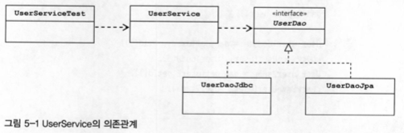

# 사용자 레벨 관리 기능 추가

* 사용자의 레벨은 BASIC, SILVER, GOLD
* 사용자가 처음 가입하면 BASIC 레벨이 되며, 이후 활동에 따라 한 단계씩 업그레이드 될 수 있다.
* 가입 후 50회 이상 로그인 시, BASIC에서 SILVER 레벨이 된다.
* SILVER 레벨이 30번 이상 추천을 받으면 GOLD 레벨이 된다.
* 사용자 레벨의 변경 작업은 일정한 주기를 갖고 일괄적으로 진행된다. 변경 작업 전에는 조건을 충족하더라도 즉각 레벨의 변경이 일어나진 않는다.

## 필드 추가
### Level Enum
User 클래스에 사용자의 레벨을 저장할 필드를 추가한다.<br>
DB에는 varchar 타입으로 선언하고 'BASIC', 'SILVER', 'GOLD'라고 문자를 넣을 수도 있지만, 코드화하여 숫자를 넣는 것이 DB 용량도 절약하고 가벼워서 좋다.

> 그렇다면 User 클래스에 프로퍼티도 숫자로? -> 의미 없는 숫자를 프로퍼티에 사용하면 타입이 안전하지 않아서 위험할 수 있다.
> ```java
>   user1.setLevel(other.getSum());
> ```
> 위와 같이 다른 종류의 정보를 넣는 실수를 하여도 컴파일러가 체크해주지 못한다. 따라서 숫자 타입보다는 자바5 이상에서 제공하는 `enum`을 활용하는 것이 안전하고 편리하다.

```java
pubic enum Level {
    BASIC(1),
    SILVER(2),
    GOLD(3);    //  3개의 enum 오브젝트 정의

    private final int value;

    Level(int value) {  //  DB에 저장할 값을 넣어줄 생성자
        this.value = value;
    }

    public int intValue() {     //  값을 가져오는 메소드
        return value;
    }

    public static Level valueOf(int value) {    //  값으로부터 Level 타입 오브젝트를 가져오도록 만든 스태틱 메소드
        switch(value) {
            case 1: return BASIC;
            case 2: return SILVER;
            case 3: return GOLD;
            default: throw new AssertionError("Unknown value: " + value);
        }
    }
}
```

enum타입을 사용하게 되면 내부에는 DB에 저장할 int 타입을 갖지만 외부로는 Level 타입의 오브젝트이기 떄문에 안전하게 사용할 수 있다.
### User 필드 추가
```java
public class User {
    ...
    Level level;
    int login;
    int recommend;

    public Level getLevel() {
        return level;
    }

    public void setLevel(Level level) {
        this.level = level;
    }
    ...
}
```
### UserDaoTest 테스트 수정
기존 코드에 새로운 기능을 추가하려면 테스트를 먼저 만드는 것이 안전하다.

* 수정된 테스트 픽스처

```java
public class UserDaoTest {
    ...
    @Before
    public void setUp() {
        this.user1 = new User("user1", "이재두", "springno1", Level.BASIC, 1, 0);
        this.user2 = new User("user2", "정인철", "springno2", Level.SILVER, 55, 10);
        this.user3 = new User("user3", "이학영", "springno3", Level.GOLD, 100, 40);
    }
}
```

* 추가된 필드를 파라미터로 포함하는 생성자

```java
class User {
    ...
    public User(String id, String name, String password, Level level, int login, int recommend) {
        this.id = id;
        this.name = name;
        this.password = password;
        this.level = level
        this.login = login;
        this.recommend = recommend;
    }
}
```

* 새로운 필드를 포함하는 User 필드 값 검증 메소드

```java
private void checkSameUser(User user1, User user2) {
    assertTrue(user1.getId(), is(user2.getId());
    assertTrue(user1.getName(), is(user2.getName());
    assertTrue(user1.getPassword(), is(user2.getPassword());
    assertTrue(user1.getLevel(), is(user2.getLevel());
    assertTrue(user1.getLogin(), is(user2.getLogin());
    assertTrue(user1.getRecommend(), is(user2.getRecommed());
}
```

두 개의 User 오브젝트 필드 값이 모두 같은지 비교하는 메소드이다.

* checkSameUser() 메소드를 사용하도록 만든 addAndGet() 메소드

```java
@Test
public void addAndGet() {
    ...
    User userget1 = dao.get(user1.getId());
    checkSameUser(userget1, user1);

    User userget2 = dao.get(user2.getId());
    checkSameUser(userget2, user2);
}
```
### UserDaoJdbc 수정

* 추가된 필드를 위한 UserDaoJdbc의 수정 코드

```java
public class UserDaoJdbc implements UserDao {
    ...
    private RowMapper<User> userMapper = new RowMapper<User>() {
        public User mapRow(ResultSet rs, int rowNum) throws SQLException {
            User user = new User();
            user.setId(rs.getString("id"));
            user.setName(rs.getString("name"));
            user.setPassword(rs.getString("password"));
            user.setLevel(Level.valueOf(rs.getInt("level"));
            user.setLogin(rs.getInt("login"));
            user.setRecommend(rs.getInt("recommend"));

            return user;
        }
    };

    public void add(User user) {
        this.jdbcTemplate.update(
            "insert into users(id, name, password, level, login, recommend) " + "values(?,?,?,?,?,?)", user.getId(), user.getName(), user.getPassword(), user.getLLevell().intValue(), user.getLogin(), user.getRecommend()
        );
    }
}
```

여기서 눈여겨 볼 부분은 Level 타입의 level 필드를 사용하는 부분이다. Level enum 은 오브젝트이므로 DB에 저장될 수 있는 SQL타입이 아니기 때문에 DB에 저장가능한 정수형 값으로 변환해줘야 한다.
## 사용자 수정 기능 추가
### 수정 기능 테스트 추가

* 사용자 정보 수정 메소드 테스트

```java
@Test
public void update() {
    dao.deleteAll();
    dao.add(user1);

    //  픽스처에 들어있는 정보를 변경하여 수정 메소드를 호출한다.
    user1.setName("이재두");
    user1.setPassword("spring04");
    user1.setLevel(Level.GOLD);
    user1.setLogin(1000);
    user1.setRecommend(999);
    dao.update(user1);

    User user1update = dao.get(user1.getId());
    checkSameUser(user1, user1update);
}
```

### UserDao와 UserDaoJdbc 수정
### 수정 테스트 보완

```java
@Test
public void update() {
    dao.deleteAll();

    dao.add(user1);     //  수정할 사용자
    dao.add(user2);     //  수정하지 않을 사용자

    user1.setName("이재두");
    user1.setPassword("springno6");
    user1.setLevel(Level.GOLD);
    user1.setLogin(1000);
    user1.setRecommend(999);

    dao.update(user1);

    User user1update = dao.get(user1.getId());
    checkSameUser(user1, user1update);
    User user2same = dao.get(user2.getId());
    checkSameUser(user2, user2same);
}
```

## UserService.upgradeLevels()
레벨 관리 기능은 UserDao의 getAll() 메소드로 사용자를 다 가져와서 사용자별로 레벨 업그레이드 작업을 진행하면서 UserDao의 update()를 호출해 DB에 결과를 넣어주면 된다.<br>
그럼 사용자 관리 로직은 어디에 추가하는 것이 좋을까? UserService 클래스를 새로 생성하여 사용자 관리 비즈니스 로직을 담는다.<br>
인터페이스 타입으로 userDao 빈을 DI 받아 사용한다. UserSerivce는 UserDao의 구현 클래스가 바뀌어도 영향받지 않도록 해야 한다. 따라서 DAO의 인터페이스를 사용하고 DI를 적용해야 한다.

### UserService 클래스와 빈 등록

```java
public class UserService {
    UserDao userDao;    //  UserDao 오브젝트를 저장해둘 인스턴스 변수 선언

    public void setUserDao(UserDao userDao) {   //  UserDao 오브젝트의 DI가 가능하도록 수정자 메소드 추가
        this.userDao = userDao;
    }
}
```

### UserServiceTest 테스트 클래스

```java
@RunWith(SpringJUnit4ClassRunner.class)
@ContextConfiguration(locations="/test-applicationContext.xml")
public class UserServiceTest {

    @Autowired
    UserService userService;    //  테스트 대상인 UserService 빈을 제공받을 수 있도록 @Autowired가 붙은 변수로 선언
                                //  UserService는 컨테이너가 관리하는 스프링 빈이므로 스프링 테스트 컨텍스트를 통해 주입받을 수 있음.

    @Test
    public void bean() {
        assertTrue(this.userService, is(notNullValue());    //  userService 빈이 생성돼어 userService 변수에 주입되는지 확인하는 테스트 메소드
    }
}
```

### upgradeLevels() 메소드
```java
public void upgradeLevels() {
    List<User> users = userDao.getAll();
    for(User user : users) {
        Boolean changed = null; //  레벨의 변화가 있는지 확인하는 flag
        if (user.getLevel() == Level.BASIC && user.getLogin() >= 50) {
            //  BASIC 레벨 업그레이드 로직   
        } else if (user.getLevel() == Level.SILVER && user.getRecommend() >= 30) {
            //  SILVER 레벨 업그레이드 로직
        } else if (user.getLevel() == Level.GOLD) {
            //  GOLD 레벨 처리 로직
        } else {...}

        if (changed) {
            userDao.update(user);   //  레벨의 변경이 있는 경우 udpate 처리 로직
        }
    }
}
```
### upgradeLevels() 테스트

```java
class UserServiceTest {
    ...
    List<User> users;   //  테스트 픽스처

    @Before
    public void setUp() {
        users = Arrays.asList(
            new User("hello", "이재두", "p1", Level.BASIC, 49, 0),
            new User("myu", "정인철", "p2", Level.BASIC, 60, 29),
            new User("naea", "이학영", "p3", Level.SILVER, 50, 0),
            new User("hello1", "김봉규", "p4", Level.SILVER, 60, 30),
            new User("todyou", "박주봉", "p5", Level.GOLD, 100, 100)
        );
    }

    @Test
    public void upgradeLevels() {
        userDao.deleteAll();
        for(User user : users)  userDao.add(user);

        userService.upgradeLevels();

        //  각 사용자별로 업그레이드 후의 예상 레벨을 검증
        checkLevel(users.get(0), Level.BASIC);
        checkLevel(users.get(1), Level.SILVER);
        checkLevel(users.get(2), Level.SILVER);
        checkLevel(users.get(3), Level.GOLD);
        checkLevel(users.get(4), Level.GOLD);
    }

    //  DB에서 사용자 정보를 가져와 레벨을 확인하는 코드가 중복되므로 헬퍼 메소드로 분리
    private void checkLevel(User user, Level expectedLevel) {
        User userUpdate = userDao.get(user.getId());
        assertThat(userUpdate.getLevel(), is(expectedLevel));
    }
}
```
적어도 가능한 모든 조건을 하나씩은 확인해봐야 하기 때문에 사용자 레벨 수 3가지, 그리고 GOLD를 제외한 나머지 레벨의 업그레이드 경우, 총 5가지의 경우의 수를 모두 테스트해봐야 하기 때문에 5개의 인스턴스를 테스트 케이스로 생성했다.

## UserService.add()
처음 가입한 사용자의 회원 레벨에 대한 로직을 추가해야 한다.
```java
@Test
public void add() {
    userDao.deleteAll();

    User userWithLevel = users.get(4);  //  GOLD 레벨

    //  레벨이 비어 있는 사용자. 로직에 따라 등록 중에 BASIC 레벨도 설정
    User userWithoutLevel = users.get(0);
    userWithoutLevel.setLevel(null);

    userService.add(userWithLevel);
    userService.add(userWithoutLevel);

    //  DB에 저장된 결과를 가져와 확인
    User userWithLevelRead = userDao.get(userWithLevel.getId());
    User userWithoutLevelRead = userDao.get(userWithoutLevel.getId());

    assertThat(userWithLevelRead.getLevel(), is(userWithLevel.getLevel()));
    assertThat(userWithoutLevelRead.getLevel(), is(Level.BASIC));
}
```
## 코드 개선
* 코드에 중복된 부분은 없는가?
* 코드가 무엇을 하는 것인지 이해하기 불편하지 않은가?
* 코드가 자신이 있어야 할 자리에 있는가?
* 앞으로 변경이 일어난다면 어떤 것이 있을 수 있고, 그 변화에 쉽게 대응할 수 있게 작성되어 있는가?
### upgradeLevels() 메소드 코드의 문제점
for 루프 속에 조건문이 복잡하다.
### upgradeLevels() 리팩토링
기존 upgradeLevels() 자주 변경될 가능성이 있는, 추상적인 로직의 흐름을 분리한다. 먼저 기본 흐름이 담긴 메소드를 구현한다.

* 기본 작업 흐름만 남겨둔 upgradeLevels()

```java
public void upgradeLevels() {
    List<User> users = userDao.getAll();
    for (User user : users) {
        if (canUpgradeLevel(user)) {
            upgradeLevel(user);
        }   
    }
}
```

그리고 나서 하나씩 구체적인 내용을 담은 메소드를 만든다.<br>
상태에 따라서 업그레이드 조건만 비교하면 되므로, 역할과 책임이 명료해진다.

* 업그레이드 가능 확인 메소드

```java
private boolean canUpgradeLevel(User user) {
    Level currentLevel = user.getLevel();
    switch(currentLevel) {
        case BASIC:     return (user.getLogin() >= 50);
        case SILVER:    return (user.getRecommend() >= 30);
        case GOLD:      return false;
        default: throw new IllegalArgumentException("Unknown Level: " + currentLevel);
    }
}
```

* 업그레이드 작업 메소드

```java
private void upgradeLevel(User user) {
    if (user.getLevel() == Level.BASIC) user.setLevel(Level.SILVER);
    else if (user.getLevel() == Level.SILVER)   user.setLevel(Level.GOLD);
    userDao.update(user);
}
```

위 처럼 업그레이드 작업용 메소드를 따로 분리함으로써 추후 추가되는 작업이 있더라도 어느 곳을 수정해야 할지 명확해진다.<br>
하지만 위 upgradeLevels() 메소드는 다음 단계가 무엇인지 알려주는 로직과 그 때 사용자 오브젝트의 level 필드를 변경해준다는 로직이 함께 있는데다 노골적으로 드러나있다. 게다가 예외상황에 대한 처리도 없다.<br>
그래서 위와 같이 레벨의 순서와 다음 단계 레벨이 무엇인지 결정하는 일은 Level이 맡도록 분리하였다.

* 업그레이드 순서를 담고 있도록 수정한 Level

```java
public enum Level {
    GOLD(3, null),
    SILVER(2, GOLD),
    BASIC(1, SILVER);

    private final int value;
    private final Level next;

    Level(int value, Level next) {
        this.value = value;
        this.next = next;
    }

    public int intValue() {
        return value;
    }

    public Level nextLevel() {
        return this.next;
    }

    public static Level valueOf(int value) {
        switch(value) {
            case 1: return BASIC;
            case 2: return SILVER;
            case 3: return GOLD;
            default: throw new AssertionError("Unknown value: " + value);
        }
    }
}
```

이렇게 구현함으로써 레벨의 업그레이드 순서는 Level enum 안에서 관리할 수 있다. 다음 단계의 레벨이 무엇인지를 일일이 if 조건식을 만들어서 비즈니스 로직에 담아둘 필요가 없다.<br>
이제 사용자 정보가 바뀌는 부분을 UserService에서 User로 이동시킨다. User의 내부 정보가 변경되는 부분은 UserService보다는 User가 스스로 다루는 게 적절하기 때문이다.

* User의 레벨 업그레이드 작업용 메소드

```java
public void upgradeLevel() {
    Level nextLevel = this.level.nextLevel();
    if (nextLevel == null) {
        throw new IllegalStateException(this.level + "은 업그레이드가 불가능합니다.");
    } else {
        this.level = nextLevel;
    }
}
```

덕분에 UserService는 User 오브젝트에게 알아서 업그레이드에 필요한 작업을 수행하라고 요청만 해주면 되기 때문에, upgradeLevel() 메소드가 아래처럼 간결해진다.

* upgradeLevel()

```java
private void upgradeLevel(User user) {
    user.upgradeLevel();
    userDao.update(user);
}
```

이로써 if 문장이 많던 이전 코드보다 간결하고 작업 내용이 명확하게 드러나면서 각 오브젝트가 해야할 책임도 깔끔하게 분리되었다.<br>

지금 개선한 코드를 보면 핵심은 각 오브젝트와 메소드가 각각 자기 몫의 책임을 맡아 일하는 구조로 만들어졌음을 알 수 있다. 각자 자기 책임에 충실한 작업만 하게되니 코드를 이해하기도 쉽다.<br>
`객체지향적인 코드는 다른 오브젝트의 데이터를 가져와서 작업하는 대신 데이터를 갖고 있는 다른 오브젝트에게 작업을 해달라고 요청한다.` 오브젝트에게 데이터를 요구하지 말고 작업을 요청하라는 것이 객체지향 프로그래밍의 가장 기본이 되는 원리이기도 하다.
### User 테스트

* User 테스트

```java
...
public class UserTest {
    User user;

    @Before
    public void setUp() {
        user = new User();
    }

    @Test()
    public void upgradeLevel() {
        Level[] levels = Level.values();
        for (Level level : levels) {
            if (level.nextLevel() == null) continue;
            user.setLevel(level);
            user.upgradeLevel();
            assertThat(user.getLevel(), is(level.nextLevel()));
        }
    }

    @Test(expected=IllegalStateException.class)
    public void cannotUpgradeLevel() {
        Level[] levels = Level.values();
        for(Level level : levels) {
            if (level.nextLevel() != null) continue;
            user.setLevel(level);
            user.upgradeLevel();
        }
    }
}
```

User 클래스에 대한 테스트는 굳이 스프링의 테스트 컨텍스트를 사용하지 않아도 된다. User 오브젝트는 스프링이 IoC로 관리해주는 오브젝트가 아니기 때문이다. 컨테이너가 생성한 오브젝트를 @Autowired로 가져오는 대신 생성자를 호출해서 테스트할 User 오브젝트를 만들면 된다.

> User 엔티티였다하더라도 스프링 IoC 컨테이너가 관리하지 않을까?
### UserServiceTest 개선
