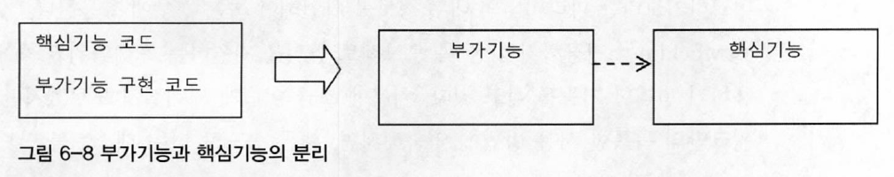
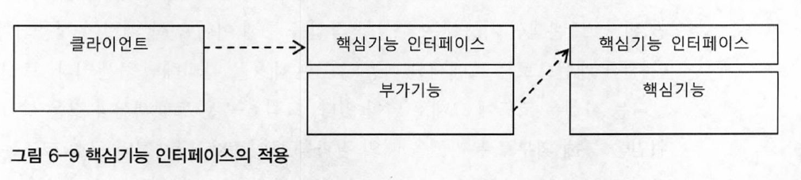
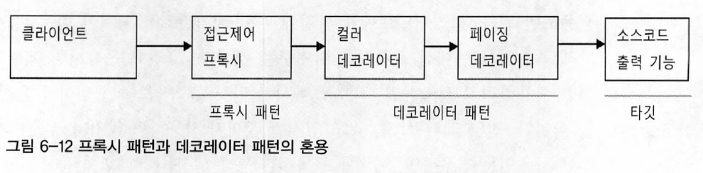
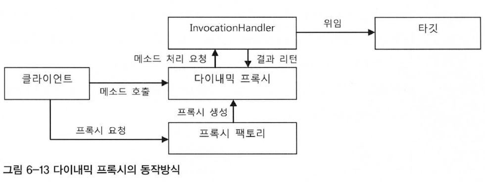
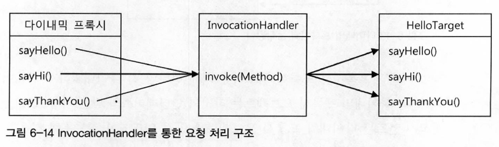
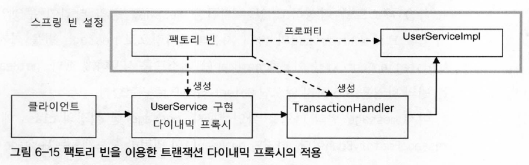

# 트랜잭션 코드의 분리
## 메소드 분리
## DI를 이용한 클래스의 분리
### DI 적용을 이용한 트랜잭션 분리
### UserService 인터페이스 도입
### 분리된 트랜잭션 기능
### 트랜잭션 적용을 위한 DI 설정
### 트랜잭션 분리에 따른 테스트 수정
### 트랜잭션 경계설정 코드 분리의 장점
# 고립된 단위 테스트
## 복잡한 의존관계 속의 테스트
## 테스트 대상 오브젝트 고립시키기
### 테스트를 위한 UserServiceImpl 고립
### 고립된 단위 테스트 활용
### UserDao 목 오브젝트
### 테스트 수행 성능의 향상
## 단위 테스트와 통합 테스트
## 목 프레임워크
### Mockito 프레임워크
# 다이내믹 프록시와 팩토리 빈
## 프록시와 프록시 패턴, 데코레이터 패턴
위에서 얘기했던 트랜잭션의 추상화 작업은 이미 전략 패턴이 적용되어있다. 하지만 전략 패턴으로는 트랜잭션 기능의 구현 내용만을 분리했을 뿐이다. 트랜잭션을 적용한다는 사실은 코드에 그대로 남아있다.

위 사진은 트랜잭션과 같은 부가적인 기능을 위임을 통해 외부로 분리했을 때의 결과를 보여준다. 구체적인 구현 코드는 제거했을지라도 위임을 통해 기능을 사용하는 코드는 핵심 코드와 함께 남아있다.<br>
트랜잭션이라는 기능은 사용자 관리 비즈니스 로직과는 성격이 다르기 때문에 아예 그 적용 사실 자체를 밖으로 분리할 수 있다.

부가기능(UserServiceTx)과 핵심기능(UserServiceImpl)을 분리함으로써 부가기능 외의 나머지 모든 기능은 원래 핵심기능을 가진 클래스로 위임해줘야 한다. 부가기능은 핵심기능을 사용하는 구조가 되는 것이다.<br>
하지만, 여기서 문제는 클라이언트가 핵심기능을 가진 클래스를 직접 사용해버리면 부가기능이 적용될 기회가 없다는 것이다. 따라서 부가기능은 마치 자신이 핵심기능을 가진 클래스인 것처럼 꾸며서, 클라이언트가 자신을 거쳐 핵심기능을 사용하도록 만들어야 한다. 그러기 위해서는 `클라이언트는 인터페이스를 통해서만 핵심기능을 사용하게 하고 부가기능 자신도 같은 인터페이스를 구현한 뒤에 자신이 그 사이에 끼어 들어야 한다.`

클라이언트는 사진처럼 인터페이스만 보고 사용하게 되기 때문에 자신은 핵심기능을 가진 클래스를 사용한다고 생각하지만 실제로는 부가기능을 통해 핵심기능을 이용하게 되는 것이다.<br>
부가기능 코드에서는 핵심기능으로 요청을 위임해주는 과정에서 자신이 가진 부가적인 기능을 적용해줄 수 있다. 비즈니스 로직 코드에 트랜잭션 기능을 부여해주는 것이 바로 그런 대표적인 경우다.<br>
이렇게 마치 자신이 클라이언트가 사용하려고 하는 실제 대상인 것처럼 위장해서 클라이언트의 요청을 받아주는 것을 대리자, 대리인과 같은 역할을 한다고 해서 `프록시(proxy)`라고 부른다. 그리고 프록시를 통해 최종적으로 요청을 위임받아 처리하는 실제 오브젝트를 타깃(target) 또는 실체(real object)라고 부른다.

프록시의 특징은 타깃과 같은 인터페이스를 구현했다는 것과 프록시가 타깃을 제어할 수 있는 위치에 있다는 것이다.<br>

* 프록시의 사용 목적
    * 클라이언트가 타깃에 접근하는 방법을 제어하기 위해서
    * 타깃에 부가적인 기능을 부여해주기 위해서
    
두 가지 목적 모두 대리 오브젝트라는 개념의 프록시를 두고 사용한다는 점은 동일하지만, 목적에 따라서 디자인 패턴에서는 다른 패턴으로 구분한다.
### 데코레이터 패턴
데코레이터 패턴은 타깃에 부가적인 기능을 런타임 시 다이내믹하게 부여해주기 위해 프록시를 사용하는 패턴을 말한다.<br>
다이내믹하게 기능을 부가한다는 의미는 컴파일 시점, 즉 코드상에서는 어떤 방법과 순서로 프록시와 타깃이 연결되어 사용되는지 정해져 있지 않다는 의미다. 마치 제품을 여러 겹으로 포장하고 그 위에 장식을 붙이는 것처럼 실제 내용물은 동일한 것 처럼 부가적인 효과를 부여해줄 수 있기 때문이다.<br>
따라서 데코레이터 패턴에서는 프록시가 여러개가 될 수 있다. 프록시가 여러 개인 만큼 순서를 정해서 단계적으로 위임하는 구조로 만들면 된다.

프록시로서 동작하는 각 데코레이터는 위임하는 대상에도 인터페이스로 접근하기 때문에 자신이 최종 타깃으로 위임하는지, 아니면 다음 단계의 데코레이터 프록시로 위임하는지 알지 못한다. 그래서 데코레이터의 다음 위임 대상은 인터페이스로 선언하고 생성자나 수정자 메소드를 통해 위임 대상을 외부에서 런타임 시에 주입받을 수 있도록 만들어야 한다.<br>
UserService 인터페이스를 구현한 타깃인 UserServiceImpl에 트랜잭션 부가기능을 제공해주는 UserServiceTx를 추가한 것도 데코레이터 패턴을 적용한 것이라고 볼 수 있다. 이 경우 수정자 메소드를 이용해 데코레이터인 UserServiceTx에 위임할 타깃인 UserServiceImpl을 주입해줬다.<br>
인터페이스를 통한 데코레이터의 정의와 런타임 시의 다이내믹한 구성 방법은 스프링의 DI를 이용하면 편리하다. 데코레이터 빈의 프로퍼티로 같은 인터페이스를 구현한 다른 데코레이터 또는 타깃 빈을 설정하면 된다.<br>
데코레이터 패턴은 인터페이스를 통해 위임하는 방식이기 때문에 어느 데코레이터에서 타깃으로 연결될지 코드 레벨에선 미리 알 수 없다. 구성하기에 따라서 여러 개의 데코레이터를 적용할 수도 있다.<br>
데코레이터 패턴은 타깃의 코드를 손대지 않고, 클라이언트가 호출하는 방법도 변경하지 않은 채로 새로운 기능을 추가할 때 유용한 방법이다. 
### 프록시 패턴
일반적으로 사용하는 프록시라는 용어와 디자인 패턴에서 말하는 프록시 패턴은 구분지어야 한다. 전자는 클라이언트와 사용 대상 사이에 대리 역할을 맡은 오브젝트를 두는 방법을 총칭한다면, 후자는 프록시를 사용하는 방법 중에서 타깃에 대한 접근 방법을 제어하려는 목적을 가진 경우를 가리킨다.<br>
프록시 패턴의 프록시는 타깃의 기능을 확장하거나 추가하지 않는다. 대신 클라이언트가 타깃에 접근하는 방식을 변경해준다. 타깃 오브젝트를 생성하기가 복잡하거나 당장 필요하지 않은 경우에는 꼭 필요한 시점까지 오브젝트를 생성하지 않는 편이 좋다. 그런데 타깃 오브젝트에 대한 레퍼런스가 미리 필요할 수 있다. 이럴 때 프록시 패턴을 적용하면 된다.<br>
클라이언트에게 타깃에 대한 레퍼런스를 넘겨야 하는데, 실제 타깃 오브젝트를 만드는 대신 프록시를 넘겨주고 프록시의 메소드를 통해 타깃을 사용하려 할 때, 프록시가 타깃 오브젝트를 생성하고 요청을 위임해주는 방식이다.<br>
만약, 레퍼런스는 갖고 있지만 끝까지 사용하지 않거나 많은 작업이 진행된 후에 사용되는 경우라면 이렇게 프록시를 통해 생성을 최대한 늦춤으로써 얻는 장점이 많다.<br>
또는 원격 오브젝트를 이용하는 경우에도 프록시를 활용할 수 있다. RMI, EJB 또는 각종 리모팅 기술을 이용해 다른 서버에 존재하는 오브젝트를 사용해야 한다면, 원격 오브젝트에 대한 프록시를 만들어두고, 클라이언트는 마치 로컬에 존재하는 오브젝트를 쓰는 것처럼 프록시를 사용하게 할 수 있다. 프록시는 클라이언트의 요청을 받으면 네트워크를 통해 원격의 오브젝트를 실행하고 결과를 받아서 클라이언트에게 돌려준다.<br>
또는 타깃에 대한 접근권한을 제어하기 위해 프록시 패턴을 사용할 수 있다. 프록시의 특정 메소드를 사용하려고 하면 접근이 불가능하다고 예외를 발생 시키면 된다.

> ex. Collections.unmodifiableList()
> 파라미터로 전달된 Collection 오브젝트의 프록시를 만들어서 add(), remove() 같은 정보를 수정하는 메소드를 호출할 경우 `java.lang.UnsupportedOperationException` 예외가 발생하게 된다.

이렇게 프록시 패턴은 타깃의 기능 자체에는 관여하지 않으면서 접근하는 방법을 제어해주는 프록시를 이용하는 것이다.<br>
구조적으로는 프록시와 데코레이터가 유사하지만 `프록시는 코드에서 자신이 만들거나 접근할 타깃 클래스 정보를 알고 있는 경우가 많다.` **생성을 지연하는 프록시라면 구체적인 생성 방법을 알아야 하기 때문에** 타깃 클래스에 대한 직접적인 정보를 만들 수도 있다. 물론 프록시 패턴이라도 인터페이스를 통해 위임하도록 만들 수도 있다. 인터페이스를 통해 다음 호출 대상으로 접근하게 하면 그 사이에 다른 프록시나 데코레이터가 계속 추가될 수 있기 때문이다.

위 사진처럼 접근 제어를 위한 프록시를 두는 프록시 패턴과 컬러, 페이징 기능을 추가하기 위한 프록시를 두는 데코레이터 패턴을 함께 적용한 예다. 두 가지 모두 프록시의 기본 원리대로 타깃과 같은 인터페이스를 구현해두고 위임하는 방식으로 만들어져 있다. 
## 다이내믹 프록시
프록시는 기존 코드에 영향을 주지 않으면서 타깃의 기능을 확장하거나 접근 방법을 제어할 수 있는 유용한 방법이다.<br>
하지만 많은 개발자들은 매번 새로운 클래스를 정의해야 하고, 인터페이스에 구현해야 할 메소드가 많으면 모든 메소드를 일일히 구현해야 하는 번거로움이 있기 때문이다.<br>
그렇다면 이러한 번거로움을 해결해 줄 방법은 없을까?<br>
자바에는 `java.lang.reflect` 패키지 안에 프록시를 손쉽게 만들 수 있도록 지원해주는 클래스들이 있다. 기본적인 아이디어는 Mock 프레임워크와 비슷하다. 일일이 프록시 클래스를 정의하지 않고도 몇 가지 API를 이용해 프록시처럼 동작하는 오브젝트를 다이내믹하게 생성하는 것이다.
### 프록시의 구성과 프록시 작성의 문제점
프록시는 다음의 두 가지 기능으로 구성된다.
* 타깃과 같은 메소드를 구현하고 있다가 메소드가 호출되면 타깃 오브젝트로 위임한다.
* 지정된 요청에 대해서는 부가기능을 수행한다.

다음 트랜잭션 부가기능을 위해 만든 UserTx는 기능 부가를 위한 프록시다.

* UserServiceTx 프록시의 기능 구분

```java
public class UserServiceTx implements UserService {
    UserService userService;    //  타깃 오브젝트
    ...
    public void add(User user) {
        this.userService.add(user);     //  메소드 구현과 위임
    }
    
    public void upgradeLevels() {       //  메소드 구현
        TransactionStatus status = this.transactionManager.getTransaction(new DefaultTransactionDefinition());  //  부가기능 수행
        
        try {
            userService.upgradeLevels();    //  위임
            this.transactionManager.commit(status);     //  부가기능 수행
        } catch (RuntimeException e) {                  //  부가기능 수행
            this.transactionManager.rollback(status);   //  부가기능 수행
            throw e;                                    //  부가기능 수행
        }
    }
}
```
UserServiceTx 코드는 UserService 인터페이스를 구현하고 타깃으로 요청을 위임하는 트랜잭션 부가기능을 수행하는 코드로 구분할 수 있다.<br>
이렇게 프록시의 역할은 위임과 부가작업이라는 두 가지로 구분할 수 있다. 그렇다면 프록시를 만들기 번거로운 이유는 무엇일까?
* 타깃의 인터페이스를 구현하고 위임하는 코드를 작성하기가 번거롭다.
    * 복잡하진 않지만 인터페이스의 메소드가 많고 다양해지면 상당히 부담스럽다. 또, 타깃 인터페이스의 메소드가 추가되거나 변경될 때마다 함께 수정해줘야 한다.
* 부가기능 코드가 중복될 가능성이 많다.
    * 트랜잭션 적용 같은 경우 대부분의 로직에 적용될 필요가 있는데, 메소드가 많아지고 트랜잭션 적용의 비율이 높아지면 트랜잭션 기능을 제공하는 유사한 코드가 여러 메소드에 중복돼서 나타날 것이다.
    
두 번째 문제인 부가기능의 웆복 문제는 어떻게든 중복되는 코드를 분리해서 해결하면 되겠지만 첫 번째 문제인 인터페이스 메소드의 구현과 위임 기능 문제는 간단한 문제가 아니다.<br>
바로 이런 문제를 해결하는 데 유용한 것이 JDK의 다이내믹 프록시다.
### 리플렉션
다이내믹 프록시는 리플렉션 기능을 이용해서 프록시를 만들어준다. 리플렉션은 자바의 코드 자체를 추상화해서 접근하도록 만든 것이다.<br>
* ex. String 클래스의 length()

스트링의 길이를 알고 싶을 때, 일반적으로 name.length() 같이 직접 메소드를 호출한다.<br>
자바의 모든 클래스는 그 클래스 자체의 구성정보를 담은 Class 타입의 오브젝트를 하나씩 갖고 있다. '클래스이름.class'라고 하거나 오브젝트의 getClass() 메소드를 호출하면 클래스 정보를 담은 Class 타입의 오브젝트를 가져올 수 있다. 클래스 오브젝트를 이용하면 클래스 코드에 대한 메타정보를 가져오거나 오브젝트를 조작할 수 있다.
#### Method 인터페이스
리플렉션 API 중에서 메소드에 대한 정의를 담은 Method라는 인터페이스를 이용해 메소드를 호출할 수 있다.<br>
String 클래스의 정보를 담은 Class 타입의 정보는 String.class라고 하면 가져올 수 있다. 또는 스트링 오브젝트가 있으면 name.getClass()라고 해도 된다. 그리고 이 클래스 정보에서 특정 이름을 가진 메소드 정보를 가져올 수 있다. String의 length() 메소드라면 다음과 같이 하면 된다.
```java
Method lenghMethod = String.class.getMethod("length");
```
스트링이 가진 메소드 중에서 "length"라는 이름을 갖고 있고, 파라미터는 없는 메소드의 정보를 가져오는 것이다. java.lang.reflect.Method 인터페이스는 메소드에 대한 자세한 정보를 담고 있을 뿐만 아니라, 이를 이용해 특정 오브젝트의 메소드를 실행시킬 수도 있다.<br>
Method 인터페이스에 정의된 invoke() 메소드를 사용하면 된다. `invoke() 메소드는 메소드를 실행시킬 대상 오브젝트(obj)와 파라미터 목록(args)을 받아서 메소드를 호출한 뒤에 그 결과를 Object 타입으로 돌려준다.`
```java
public Object invoke(Object obj, Object... args)
```
이를 이용해 length() 메소드를 다음과 같이 실행시킬 수 있다.
```java
int length = lengthMethod.invoke(name);     //  int length = name.length();
```
### 프록시 클래스
다이내믹 프록시를 이용한 프록시를 만들어보자.

* Hello 인터페이스

```java
public interface Hello {
    String sayHello(String name);
    String sayHi(String name);
    String sayThankYou(String name);
}
```

* 타깃 클래스

```java
public class HelloTarget implements Hello {

    @Override
    public String sayHello(String name) {
        return "Hello " + name;
    }

    @Override
    public String sayHi(String name) {
        return "Hi " + name;
    }

    @Override
    public String sayThankYou(String name) {
        return "Thank You " + name;
    }
}
```

* 프록시 클래스

```java
public class HelloUppercase implements Hello {
    Hello hello;        //  위임할 타깃 오브젝트. 여기서는 타깃 클래스의 오브젝트인 것을 알지만
                        //  다른 프록시를 추가할 수도 있으므로 인터페이스로 접근한다.

    public HelloUppercase(Hello hello) {
        this.hello = hello;
    }

    @Override
    public String sayHello(String name) {
        return hello.sayHello(name).toUpperCase();  //  위임과 부가기능 적용
    }

    @Override
    public String sayHi(String name) {
        return hello.sayHi(name).toUpperCase();
    }

    @Override
    public String sayThankYou(String name) {
        return hello.sayThankYou(name).toUpperCase();
    }
}
```
프록시에는 데코레이터 패턴을 적용해서 타깃인 HelloTarget에 부가기능(대문자 변환기능)을 추가하였다. 

* 클라이언트 코드

```java
public class Main {

    public static void main(String[] args) {
        Hello hello = new HelloTarget();    //  타깃은 인터페이스를 통해 접근하는 습관을 들이자.
        System.out.println(hello.sayHello("JaeDoo"));
        System.out.println(hello.sayHi("JaeDoo"));
        System.out.println(hello.sayThankYou("JaeDoo"));

        Hello helloUppercase = new HelloUppercase(hello);
        System.out.println(helloUppercase.sayHello("JaeDoo"));
        System.out.println(helloUppercase.sayHi("JaeDoo"));
        System.out.println(helloUppercase.sayThankYou("JaeDoo"));
    }
}
```

* 동작 결과

```text
Hello JaeDoo
Hi JaeDoo
Thank You JaeDoo

HELLO JAEDOO
HI JAEDOO
THANK YOU JAEDOO
```

이 프록시는 위에서 말했던 두 가지 문제점을 모두 갖고 있다.
### 다이내믹 프록시 적용
클래스로 만든 프록시인 HelloUppercase를 다이내믹 프록시를 이용해 만들어본다.

* 다이내믹 프록시 동작방식

다이내믹 프록시는 프록시 팩토리에 의해 런타임 시 다이내믹하게 만들어지는 오브젝트다. 다이내믹 프록시 오브젝트는 타깃의 인터페이스와 같은 타입으로 만들어진다. 클라이언트는 다이내믹 프록시 오브젝트를 타깃 인터페이스를 통해 사용할 수 있다.<br>
이 덕분에 프록시를 만들 때, 인터페이스를 모두 구현해가면서 클래스를 정의하는 수고를 덜 수 있다. 프록시 팩토리에게 인터페이스 정보만 제공해주면 해당 인터페이스를 구현한 클래스의 오브젝트를 자동으로 만들어주기 때문이다.<br>
다이내믹 프록시가 인터페이스 구현 클래스의 오브젝트는 만들어주지만, 프록시로서 필요한 부가기능 제공 코드는 직접 작성해야 한다. 부가기능은 프록시 오브젝트와 독립적으로 InvocationHandler를 구현한 오브젝트에 담는다. InvocationHandler 인터페이스는 다음과 같은 메소드 한 개만 가진 간단한 인터페이스다.
```java
public Object invoke(Object proxy, Method method, Object[] args)
```
invoke() 메소드는 리플렉션의 Method 인터페이스를 파라미터로 받는다. 메소드를 호출할 때 전달되는 파라미터도 args로 받는다. `다이내믹 프록시 오브젝트는 클라이언트의 모든 요청을 리플렉션 정보로 변환해서 InvocationHandler 구현 오브젝트의 invoke() 메소드로 넘기는 것`이다. 타깃 인터페이스의 모든 메소드 요청이 하나의 메소드로 집중되기 때문에 중복되는 기능을 효과적으로 제공할 수 있다.<br>
남은 것은 각 메소드 요청을 어떻게 처리하느냐이다. 리플렉션으로 메소드와 파라미터 정보를 모두 갖고 있으므로 타깃 오브젝트의 메소드를 호출하게 할 수도 있다.<br>
InvocationHandler 구현 오브젝트가 타깃 오브젝트 레퍼런스를 갖고 있다면 리플렉션을 이용해 간단히 위임 코드를 만들어 낼 수 있다.

Hello 인터페이스를 제공하면서 프록시 팩토리에게 다이내믹 프록시를 만들어달라고 요청하면 Hello 인터페이스의 모든 메소드를 구현한 오브젝트를 생성해준다.<br>
InvocationHandler 인터페이스를 구현한 오브젝트를 제공해주면 다이내믹 프록시가 받는 모든 요청을 InvocationHandler의 invoke() 메소드로 보내준다. Hello 인터페이스의 메소드가 아무리 많더라도 invoke() 메소드 하나로 처리할 수 있다.

* InvodationHandler 구현 클래스

```java
import java.lang.reflect.InvocationHandler;
import java.lang.reflect.Method;

public class UppercaseHandler implements InvocationHandler {
    Hello target;

    public UppercaseHandler(Hello target) { //  다이내믹 프록시로부터 전달받은 요청을 다시 타깃 오브젝트에 위임해야 하기 때문에
        this.target = target;               //  타깃 오브젝트를 주입받아둔다.
    }

    @Override
    public Object invoke(Object o, Method method, Object[] objects) throws Throwable {  //  objects == args
        String ret = (String)method.invoke(target, objects);   //  타깃으로 위임. 인터페이스의 메소드 호출에 모두 적용
        return ret.toUpperCase();                       //  부가기능 제공
    }
}
```
다이내믹 프록시로부터 요청을 전달받으려면 InvocationHandler를 구현해야 한다. 메소드는 invoke() 하나뿐이다. 다이내믹 프록시가 클라이언트로부터 받는 모든 요청은 invoke() 메소드로 전달된다. 다이내믹 프록시를 통해 요청이 전달되면 리플렉션 API를 이용해 타깃 오브젝트의 메소드를 호출한다. 타깃 오브젝트는 생성자를 통해 미리 전달받아 둔다.<br>
타깃 오브젝트의 메소드 호출이 끝났으면 프록시가 제공하려는 부가기능(대문자 변환 작업)을 수행하고 결과를 리턴한다.

* 프록시 생성

```java
Hello proxiedHello = (Hello) Proxy.newProxyInstance(    //  생성된 다이내믹 프록시 오브젝트는 Hello 인터페이스를 구현하고 있으므로 Hello 타입으로 캐스팅해도 안전하다.
    getClass().getClassLoader(),    //  동적으로 생성되는 다이내믹 프록시 클래스의 로딩에 사용할 클래스 로더
    new Class[]{Hello.class},       //  구현할 인터페이스, 한 번에 하나 이상의 인터페이스를 구현할 수 있기 때문에 배열을 사용
    new UppercaseHandler(new HelloTarget()) //  부가기능과 위임 코드를 담은 InvocationHandler
);

proxiedHello.setHello("JaeDoo");
```
다이내믹 프록시 생성은 Proxy 클래스의 newProxyInstance() 스태틱 팩토리 메소드를 이용하면 된다.<br>
리플렉션 API와 복잡한 다이내믹 프록시 생성 방법을 적용했지만 그다지 코드의 양이 줄어든 것 같지가 않다. 과연 다이내믹 프록시의 장점은 무엇이냔 말인가
### 다이내믹 프록시의 확장
Hello 인터페이스의 메소드가 3개가 아닌 30개라면? 그렇다면 다이내믹 프록시를 적용하는 것이 간편할 것이다.<br>
UppercaseHandler 리턴 타입이 스트링이 아니라면? 리플렉션은 매우 유연하지만 강제로 캐스팅할 경우 런타임 에러가 발생할 것이다. 그래서 Method를 이용한 타깃 오브젝트의 메소드 호출 후에는 리턴 타입을 확인해서 스트링인 경우만 대문자로 변환해주도록 수정하는 방식이 좋다.<br>
InvocationHandler 방식의 또 한가지 장점은 타깃의 종류에 구애받지 않고 적용이 가능하다.

* 확장된 InvocationHandler

```java
public class UppercaseHandler implements InvocationHandler {
    Object target;

    public UppercaseHandler(Object target) { //  어떤 종류의 인터페이스를 구현한 타깃에도
        this.target = target;                //  적용 가능하도록 Object 타입으로 수정
    }

    @Override
    public Object invoke(Object o, Method method, Object[] objects) throws Throwable {
        Object ret = method.invoke(target, objects);     //  호출한 메소드의 리턴 타입이 String인 경우만
        if (ret instanceof String) {                     //  대문자 변경 기능을 적용
            return ((String) ret).toUpperCase();
        }
        return ret;                       
    }
}
```

* 메소드를 선별해서 부가기능을 적용하는 invode()

```java
    @Override
    public Object invoke(Object o, Method method, Object[] objects) throws Throwable {
        Object ret = method.invoke(target, objects);   //  호출한 메소드의 리턴 타입이 String인 경우만
        if (ret instanceof String && method.getName().startsWith("say")) {
            return ((String) ret).toUpperCase();
        }
        return ret;
    }
```

## 다이내믹 프록시를 이용한 트랜잭션 부가기능
이제 UserServiceTx를 다이내믹 프록시 방식으로 변경해본다.
### 트랜잭션 InvocationHandler

* 다이내믹 프록시를 위한 트랜잭션 부가기능

```java
import org.springframework.transaction.PlatformTransactionManager;
import org.springframework.transaction.TransactionStatus;
import org.springframework.transaction.support.DefaultTransactionDefinition;

import java.lang.reflect.InvocationHandler;
import java.lang.reflect.InvocationTargetException;
import java.lang.reflect.Method;

public class TransactionHandler implements InvocationHandler {
    private Object target;              //  부가기능을 제공할 타깃 오브젝트. 어떤 타입의 오브젝트에도 적용 가능.
    private PlatformTransactionManager transactionManager;  //  트랜잭션 기능을 제공하는 데 필요한 트랜잭션 매니저
    private String pattern;             //  트랜잭션을 적용할 메소드 이름 패턴

    public void setTarget(Object target) {
        this.target = target;
    }

    public void setTransactionManager(PlatformTransactionManager transactionManager) {
        this.transactionManager = transactionManager;
    }

    public void setPattern(String pattern) {
        this.pattern = pattern;
    }

    @Override
    public Object invoke(Object o, Method method, Object[] objects) throws Throwable {
        if (method.getName().startsWith(pattern)) {
            return invokeInTransaction(method, objects);
        }
        return method.invoke(target, objects);
    }

    private Object invokeInTransaction(Method method, Object[] objects) throws Throwable{
        TransactionStatus status = this.transactionManager.getTransaction(new DefaultTransactionDefinition());
        
        try {
            Object ret = method.invoke(target, objects);    //  트랜잭션을 시작하고 타깃 오브젝트의 메소드를 호출한다.
            this.transactionManager.commit(status);         //  예외가 발생하지 않았다면 커밋한다.
            return ret;
        } catch (InvocationTargetException e) {             //  예외가 발생하면 트랜잭션을 롤백한다.
            this.transactionManager.rollback(status);
            throw e.getTargetException();
        }
    }
}
```
요청을 위임할 타깃은 DI로 제공받는다. 타깃을 저장할 변수는 Object로 선언하여 UserServiceImpl 외에 트랜잭션 적용이 필요한 어떤 타깃 오브젝트에도 적용할 수 있다.<br>
UserServiceTx와 마찬가지로 트랜잭션 추상화 인터페이스인 PlatformTransactionManager도 DI 받는다.<br>
타깃 오브젝트의 모든 메소드에 무조건 트랜잭션이 적용되지 않도록 DI받은 이름 패턴으로 분기처리한다.<br>
한 가지 특이점은 롤백을 적용하기 위한 예외로 RuntimeException이 아닌 InvocationTargetException 을 잡아야 한다. 리플렉션 메소드인 `Method.invoke()를 이용해 타깃 오브젝트의 메소드를 호출할 때는 타깃 오브젝트에서 발생하는 예외가 InvocationTargetException으로 한 번 포장돼서 전달`된다. 따라서 일단 InvocationTargetException로 받은 후 getTransactionException() 메소드로 중첩되어 있는 예외를 가져와야 한다.<br>
이로써 모든 트랜잭션이 필요한 오브젝트에 적용 가능한 트랜잭션 프록시 핸들러가 만들어졌다.
### TransactionHandler와 다이내믹 프록시를 이용하는 테스트
## 다이내믹 프록시를 위한 팩토리 빈
이제 TransactionHandler와 다이내믹 프록시를 스프링의 DI를 통해 사용할 수 있도록 만들어보자. 근데 문제는 DI의 대상이 되는 다이내믹 프록시 오브젝트는 일반적인 스프링의 빈으로는 등록할 방법이 없다.<br>
스프링은 내부적으로 리플렉션 API를 이용해서 빈 정의에 나오는 클래스 이름을 가지고 빈 오브젝트를 생성한다. 문제는 다이내믹 프록시 오브젝트는 이런 식으로 프록시 오브젝트가 생성되지 않는다. 사실 다이내믹 프록시 오브젝트의 클래스 자체도 내부적으로 다이내믹하게 새로 정의해서 사용하기 때문에 다이내믹 프록시 오브젝트의 클래스가 어떤 건지도 알 수가 없다.<br>
방법은 `사전에 프록시 오브젝트의 클래스 정보를 미리 알아내어 스프링의 빈에 정의`하는 방법밖에 없다.<br>
다이내믹 프록시는 Proxy 클래스의 newProxyInstance()라는 스태틱 팩토리 메소드를 통해서만 만들 수 있다.
### 팩토리 빈
스프링은 디폴트 생성자를 사용하는 방법 외에 팩토리 빈을 이용해 빈을 생성할 수 있다. `팩토리 빈이란, 스프링을 대신해서 오브젝트의 생성로직을 담당하도록 만들어진 특별한 빈`을 말한다.<br>
팩토리 빈을 만드는 방법 중 하나는 스프링의 FactoryBean이라는 인터페이스를 구현하는 것이다.

* FactoryBean 인터페이스

```java
package org.springframework.beans.factory;

public interface FactoryBean<T> {
    T getObject() throws Exception; //  빈 오브젝트를 생성해서 돌려준다.

    Class<?> getObjectType();       //  생성되는 오브젝트의 타입을 알려준다.

    boolean isSingleton();          //  getObject()가 들려주는 오브젝트가 항상 같은 싱글톤 오브젝트인지 알려준다.
}
```
FactoryBean 인터페이스를 구현한 클래스를 스프링의 빈으로 등록하면 팩토리 빈으로 동작한다.<br>

* 생성자를 제공하지 않는 클래스

```java
public class Message {
    String text;

    private Message(String text) {      //  생성자가 private으로 선언되어 외부에서 생성자를 통해
        this.text = text;               //  오브젝트를 만들 수 없다.
    }

    public String getText() {
        return text;
    }
    
    public static Message newMessage(String text) { //  생성자 대신 사용할 수 있는 스태틱 팩토리
        return new Message(text);                   //  메소드를 제공한다.
    }
}
```

사실 스프링은 private 생성자를 가진 클래스도 빈으로 등록해주면 리플렉션을 이용해 오브젝트를 만들어준다. 리플렉션은 private으로 선언된 접근 규약을 위반할 수 있는 강력한 기능이 있기 때문이다. 하지만 생성자를 private로 만들었다는 것은 스태틱 메소드를 통해 오브젝트가 만들어져야 하는 중요한 이유가 있기 때문이므로 이를 무시하고 오브젝트를 강제로 생성하면 위험하다.

* Message 의 팩토리 빈 클래스

```java
import org.springframework.beans.factory.FactoryBean;

public class MessageFactoryBean implements FactoryBean<Message> {
    String text;

    public void setText(String text) {  //  오브젝트를 생성할 때 필요한 정보를 팩토리 빈의 프로퍼티로 설정해서
        this.text = text;               //  대신 DI 받을 수 있게 한다. 주입된 정보는 오브젝트 생성 중에 사용된다.
    }

    @Override
    public Message getObject() throws Exception {    //  실제 빈으로 사용될 오브젝트를 직접 생성한다.
        return Message.newMessage(this.text);        //  코드를 이용하기 때문에 복잡한 방식의 오브젝트
    }                                                //  생성과 초기화 작업도 가능하다.   

    @Override
    public Class<? extends Message> getObjectType() {
        return Message.class;
    }

    @Override
    public boolean isSingleton() {  //  getObject() 메소드가 돌려주는 오브젝트가 싱글톤인지를 알려준다.
        return false;               //  이 팩토리 빈을 매번 요청할 때마다 새로운 오브젝트를 만들게되므로 false로 설정한다.
    }                               //  이것은 팩토리 빈의 동작방식에 관한 설정이고 만들어진 빈 오브젝트는 싱글톤으로 스프링의 관리해줄수 있다.
}
```
팩토리 빈은 전형적인 팩토리 메소드를 가진 오브젝트다. 스프링은 FactoryBean 인터페이스를 구현한 클래스가 빈의 클래스로 지정되면, 팩토리 빈 클래스의 오브젝트의 getObject() 메소드를 이용해 오브젝트를 가져오고, 이를 빈 오브젝트로 사용한다. 빈의 클래스로 등록된 팩토리 빈은 빈 오브젝트를 생성하는 과정에서만 사용될 뿐이다.
### 팩토리 빈의 설정 방법
### 다이내믹 프록시를 만들어주는 팩토리 빈
Proxy의 newProxyInstance() 메소드를 통해서만 생성이 가능한 다이내믹 프록시 오브젝트는 일반적인 방법으로는 스프링의 빈으로 등록할 수 없기 때문에 팩토리 빈을 활용한 방법으로 다이내믹 프록시 오브젝트를 스프링의 빈으로 만들어 줄 수 있다. 팩토리 빈의 getObject() 메소드에 다이내믹 프록시 오브젝트를 만들어주는 코드를 넣으면 되기 때문이다.

스프링 빈에는 팩토리 빈과 UserServiceImpl만 빈으로 등록하고 팩토리 빈으로 다이내믹 프록시가 위임할 타깃 오브젝트인 UserServiceImpl에 대한 레퍼런스를 프로퍼티를 통해 DI 받아둔다.<br>
다이내믹 프록시와 함께 생성할 TransactionHandler에게 타깃 오브젝트를 전달해줘야 하기 때문이다.<br>
TransactionHandler는 팩토리 빈의 프로퍼티로 설정해뒀다가 다이내믹 프록시를 만들 때 getObject()에서 사용된다.
### 트랜잭션 프록시 팩토리 빈
TransactionHandler를 이용하는 다이내믹 프록시를 생성하는 팩토리 빈 클래스이다.
```java
import org.springframework.beans.factory.FactoryBean;
import org.springframework.transaction.PlatformTransactionManager;

import java.lang.reflect.Proxy;

public class TxProxyFactoryBean implements FactoryBean<Object> {
    // TransactionHandler를 생성할 때 필요
    Object target;
    PlatformTransactionManager transactionManager;
    String pattern;

    //  다이내믹 프록시를 생성할 때 필요. UserService외의 인터페이스를 가진 타깃에도 적용할 수 있다.
    Class<?> serviceInterface;

    public void setTarget(Object target) {
        this.target = target;
    }

    public void setTransactionManager(PlatformTransactionManager transactionManager) {
        this.transactionManager = transactionManager;
    }

    public void setPattern(String pattern) {
        this.pattern = pattern;
    }

    public void setServiceInterface(Class<?> serviceInterface) {
        this.serviceInterface = serviceInterface;
    }

    //  FactoryBean 인터페이스 구현 메소드
    @Override
    public Object getObject() throws Exception {    //   DI 받은 정보를 이용해서 TransactionHandler를 사용하는 다이내믹 프록시를 생성
        TransactionHandler txHandler = new TransactionHandler();
        txHandler.setTarget(target);
        txHandler.setTransactionManager(transactionManager);
        txHandler.setPattern(pattern);
        return Proxy.newProxyInstance(
                getClass().getClassLoader(),
                new Class[]{serviceInterface},
                txHandler
        );
    }

    /*
        팩토리 빈이 생성하는 오브젝트의 타입은 
        DI 받은 인터페이스 타입에 따라 달라진다.
        따라서 다양한 타입의 프록시 오브젝트 생성에 재사용 할 수 있다.
     */
    @Override
    public Class<?> getObjectType() {
        return serviceInterface;
    }

    /*
        싱글톤 빈이 아니라는 뜻이 아니라 
        getObject()가 매번 같은 오브젝틀를 리턴하지 않는다는 의미다.
     */
    @Override
    public boolean isSingleton() {
        return false;
    }
}
```
팩토리 빈이 만드는 다이내믹 프록시는 구현 인터페이스나, 타깃의 종류에 제한이 없다. 따라서 UserService 외에도 트랜잭션 부가기능이 필요한 오브젝트를 위한 프록시를 만들 때 얼마든지 재사용이 가능하다.<br>
설정이 다른 여러 개의 TxProxyFactoryBean 빈을 등록하면 된다.
### 트랜잭션 프록시 팩토리 빈 테스트
## 프록시 팩토리 빈 방식의 장점과 한계
한번 부가기능을 가진 프록시를 생성하는 팩토리 빈을 만들어두면 타깃의 타입에 상관없이 재사용이 가능하다.
### 프록시 팩토리 빈의 재사용
TransactionHandler를 이용하는 다이내믹 프록시를 생성해주는 TxProxyFactoryBean은 코드의 수정 없이도 다양한 클래스에 적용할 수 있다. 타깃 오브젝트에 맞는 프로퍼티 정보를 설정해서 빈으로 등록해주기만 하면 된다. 하나 이상의 TxProxyFactoryBean을 동시에 빈으로 등록해도 상관없다.<br>

프록시 팩토리 빈을 이용하면 프록시 기법을 아주 빠르고 효과적으로 적용할 수 있다. 코드 한 줄 만들지 않고 기존 코드에 부가적인 기능을 추가해줄 수 있다.
### 프록시 팩토리 빈 방식의 장점
* 타깃의 인터페이스를 구현하고 위임하는 코드를 작성하기가 번거롭다.
* 부가기능 코드가 중복될 가능성이 많다.

다이내믹 프록시를 이용하면 앞서 말했던 위 두가지 문제를 해결할 수 있다. 팩토리 빈을 이용한 DI 활용으로 말이다.
### 프록시 팩토리 빈의 한계
* 여러 클래스에 공통적인 부가기능을 제공하는 것은 불가능하다.
    * 프록시를 통해 타깃에 부가기능을 제공하는 것은 메소드 단위로 일어나는 일이다. 하나의 클래스 안에 여러 개의 메소드에 부가기능을 한 번에 제공하는 것은 가능했지만 여러 클래스에 공통적인 부가기능을 제공하는 것은 불가능하다.<br>
* 하나의 타깃에 여러 개의 부가기능을 적용하려고 할 때도 문제가 된다.
    * 코드 수정 없이 설정의 변경만으로 수천 개 이상의 메소드에 새로운 기능을 추가할 수는 있지만 설정파일이 급격히 복잡해진다.
* TransactionHandler 오브젝트가 프록시 팩토리 빈 개수만큼 만들어진다.
    * 타깃 오브젝트가 달라질 때 마다 새로운 TransactionHandler 오브젝트를 만들어야 한다.

# 스프링의 프록시 팩토리 빈
## ProxyFactoryBean
### 어드바이스: 타깃이 필요 없는 순수한 부가기능
### 포인트컷: 부가기능 적용 대상 메소드 선정 방법
## ProxyFactoryBean 적용
### TransactionAdvice
### 스프링 XML 설정파일
### 테스트
### 어드바이스와 포인트컷의 재사용
# 스프링 AOP
## 자동 프록시 생성
### 중복 문제의 접근 방법
### 빈 후처리기를 이용한 자동 프록시 생성기
### 확장된 프인트컷
### 포인트컷 테스트
## DefaultAdvisorAutoProxyCreator의 적용
### 클래스 필터를 적용한 포인트컷 작성
### 어드바이저를 이용하는 자동 프록시 생성기 등록
### 포인트컷 등록
### 어드바이스와 어드바이저
### ProxyFactoryBean 제거와 서비스 빈의 원상복구
### 자동 프록시 생성기를 사용하는 테스트
### 자동생성 프록시 확인
## 포인트컷 표현식을 이용한 포인트컷
### 포인트컷 표현식
### 포인트컷 표현식 문법
### 포인트컷 표현식 테스트
### 포인트컷 표현식을 이용하는 포인트컷 적용
### 타입 패턴과 클래스 이름 패턴
## AOP란 무엇인가?
### 트랜잭션 서비스 추상화
### 프록시와 데코레이터 패턴
### 다이내믹 프록시와 프록시 팩토리 빈
### 자동 프록시 생성 방법과 포인트컷
### 부가기능의 모듈화
### AOP: 애스펙트 지향 프로그래밍
## AOP 적용기술
### 프록시를 이용한 AOP
### 바이트코드 생성과 조작을 통한 AOP
## AOP의 용어
## AOP 네임스페이스
### AOP 네임스페이스
### 어드바이저 내장 포인트컷
# 트랜잭션 속성
## 트랜잭션 정의
### 트랜잭션 전파
### 격리수준
### 제한시간
### 읽기전용
## 트랜잭션 인터셉터와 트랜잭션 속성
### TransactionInterceptor
### 메소드 이름 패턴을 이용한 트랜잭션 속성 지정
### tx 네임스페이스를 이용한 설정 방법
## 포인트컷과 트랜잭션 속성의 적용 전략
### 트랜잭션 포인트컷 표현식은 타입 패턴이나 빈 이름을 이용한다
### 공통된 메소드 이름 규칙을 통해 최소한의 트랜잭션 어드바이스와 속성을 정의한다
### 프록시 방식 AOP는 같은 타깃 오브젝트 내의 메소드를 호출할 때는 적용되지 않는다
## 트랜잭션 속성 적용
### 트랜잭션 경계설정의 일원화
### 서비스 빈에 적용되는 포인트컷 표현식 등록
### 트랜잭션 속성을 가진 트랜잭션 어드바이스 등록
### 트랜잭션 속성 테스트
# 어노테이션 트랜잭션 속성과 포인트컷
## 트랜잭션 어노테이션
### @Transactional
### 트랜잭션 속성을 이용하는 포인트컷
### 대체 정책
### 트랜잭션 어노테이션 사용을 위한 설정
## 트랜잭션 어노테이션 적용
# 트랜잭션 지원 테스트
## 선언적 트랜잭션과 트랜잭션 전파 속성
## 트랜잭션 동기화와 테스트
### 트랜잭션 매니저와 트랜잭션 동기화
### 트랜잭션 매니저를 이용한 테스트용 트랜잭션 제어
### 트랜잭션 동기화 검증
### 롤백 테스트
## 테스트를 위한 트랜잭션 어노테이션
### @Transactional
### @Rollback
### @TransactionConfiguration
### NotTransactonal과 Propagation.NEVER
### 효과적인 DB 테스트
# 정리