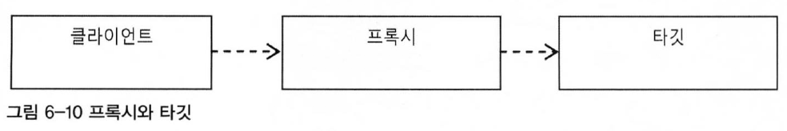
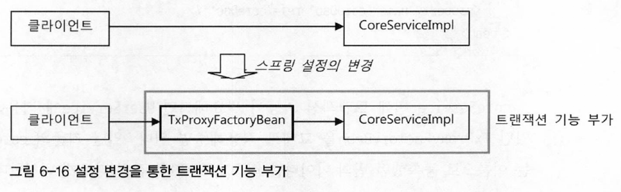
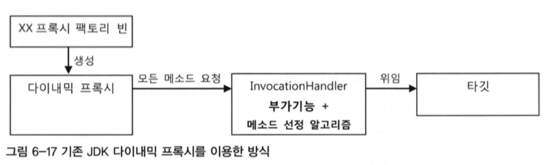
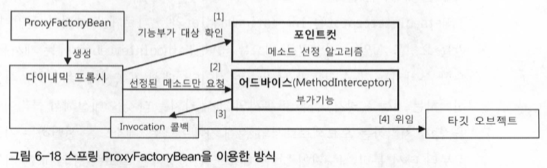
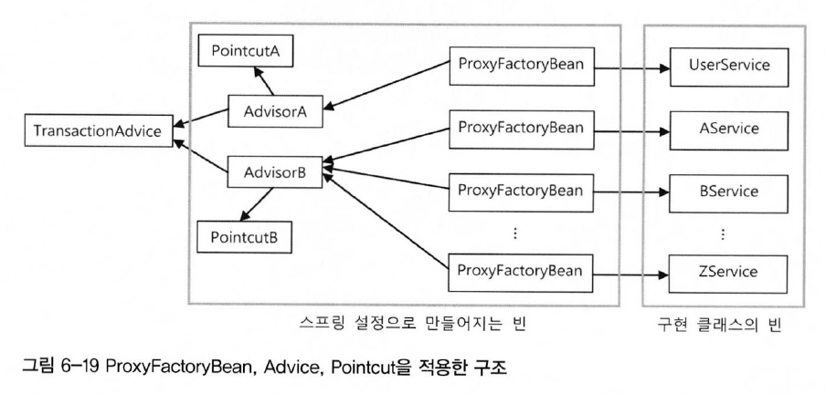
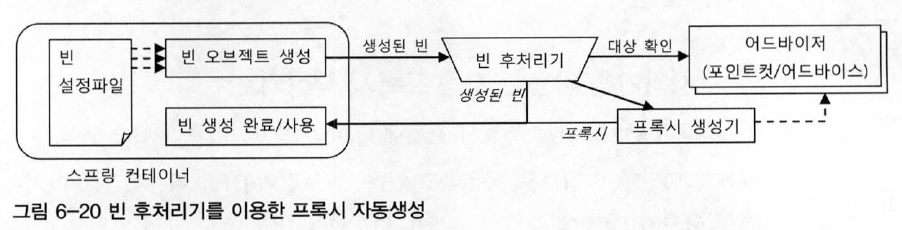
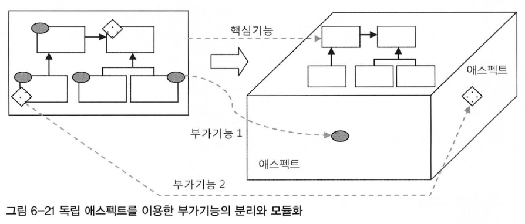

# 다이내믹 프록시와 팩토리 빈
## 프록시와 프록시 패턴, 데코레이터 패턴
위에서 얘기했던 트랜잭션의 추상화 작업은 이미 전략 패턴이 적용되어있다. 하지만 전략 패턴으로는 트랜잭션 기능의 구현 내용만을 분리했을 뿐이다. 트랜잭션을 적용한다는 사실은 코드에 그대로 남아있다.

위 사진은 트랜잭션과 같은 부가적인 기능을 위임을 통해 외부로 분리했을 때의 결과를 보여준다. 구체적인 구현 코드는 제거했을지라도 위임을 통해 기능을 사용하는 코드는 핵심 코드와 함께 남아있다.<br>
트랜잭션이라는 기능은 사용자 관리 비즈니스 로직과는 성격이 다르기 때문에 아예 그 적용 사실 자체를 밖으로 분리할 수 있다.

부가기능(UserServiceTx)과 핵심기능(UserServiceImpl)을 분리함으로써 부가기능 외의 나머지 모든 기능은 원래 핵심기능을 가진 클래스로 위임해줘야 한다. 부가기능은 핵심기능을 사용하는 구조가 되는 것이다.<br>
하지만, 여기서 문제는 클라이언트가 핵심기능을 가진 클래스를 직접 사용해버리면 부가기능이 적용될 기회가 없다는 것이다. 따라서 부가기능은 마치 자신이 핵심기능을 가진 클래스인 것처럼 꾸며서, 클라이언트가 자신을 거쳐 핵심기능을 사용하도록 만들어야 한다. 그러기 위해서는 `클라이언트는 인터페이스를 통해서만 핵심기능을 사용하게 하고 부가기능 자신도 같은 인터페이스를 구현한 뒤에 자신이 그 사이에 끼어 들어야 한다.`

클라이언트는 사진처럼 인터페이스만 보고 사용하게 되기 때문에 자신은 핵심기능을 가진 클래스를 사용한다고 생각하지만 실제로는 부가기능을 통해 핵심기능을 이용하게 되는 것이다.<br>
부가기능 코드에서는 핵심기능으로 요청을 위임해주는 과정에서 자신이 가진 부가적인 기능을 적용해줄 수 있다. 비즈니스 로직 코드에 트랜잭션 기능을 부여해주는 것이 바로 그런 대표적인 경우다.<br>
이렇게 마치 자신이 클라이언트가 사용하려고 하는 실제 대상인 것처럼 위장해서 클라이언트의 요청을 받아주는 것을 대리자, 대리인과 같은 역할을 한다고 해서 `프록시(proxy)`라고 부른다. 그리고 프록시를 통해 최종적으로 요청을 위임받아 처리하는 실제 오브젝트를 타깃(target) 또는 실체(real object)라고 부른다.

프록시의 특징은 타깃과 같은 인터페이스를 구현했다는 것과 프록시가 타깃을 제어할 수 있는 위치에 있다는 것이다.<br>

* 프록시의 사용 목적
    * 클라이언트가 타깃에 접근하는 방법을 제어하기 위해서
    * 타깃에 부가적인 기능을 부여해주기 위해서
    
두 가지 목적 모두 대리 오브젝트라는 개념의 프록시를 두고 사용한다는 점은 동일하지만, 목적에 따라서 디자인 패턴에서는 다른 패턴으로 구분한다.
### 데코레이터 패턴
데코레이터 패턴은 타깃에 부가적인 기능을 런타임 시 다이내믹하게 부여해주기 위해 프록시를 사용하는 패턴을 말한다.<br>
다이내믹하게 기능을 부가한다는 의미는 컴파일 시점, 즉 코드상에서는 어떤 방법과 순서로 프록시와 타깃이 연결되어 사용되는지 정해져 있지 않다는 의미다. 마치 제품을 여러 겹으로 포장하고 그 위에 장식을 붙이는 것처럼 실제 내용물은 동일한 것 처럼 부가적인 효과를 부여해줄 수 있기 때문이다.<br>
따라서 데코레이터 패턴에서는 프록시가 여러개가 될 수 있다. 프록시가 여러 개인 만큼 순서를 정해서 단계적으로 위임하는 구조로 만들면 된다.

프록시로서 동작하는 각 데코레이터는 위임하는 대상에도 인터페이스로 접근하기 때문에 자신이 최종 타깃으로 위임하는지, 아니면 다음 단계의 데코레이터 프록시로 위임하는지 알지 못한다. 그래서 데코레이터의 다음 위임 대상은 인터페이스로 선언하고 생성자나 수정자 메소드를 통해 위임 대상을 외부에서 런타임 시에 주입받을 수 있도록 만들어야 한다.<br>
UserService 인터페이스를 구현한 타깃인 UserServiceImpl에 트랜잭션 부가기능을 제공해주는 UserServiceTx를 추가한 것도 데코레이터 패턴을 적용한 것이라고 볼 수 있다. 이 경우 수정자 메소드를 이용해 데코레이터인 UserServiceTx에 위임할 타깃인 UserServiceImpl을 주입해줬다.<br>
인터페이스를 통한 데코레이터의 정의와 런타임 시의 다이내믹한 구성 방법은 스프링의 DI를 이용하면 편리하다. 데코레이터 빈의 프로퍼티로 같은 인터페이스를 구현한 다른 데코레이터 또는 타깃 빈을 설정하면 된다.<br>
데코레이터 패턴은 인터페이스를 통해 위임하는 방식이기 때문에 어느 데코레이터에서 타깃으로 연결될지 코드 레벨에선 미리 알 수 없다. 구성하기에 따라서 여러 개의 데코레이터를 적용할 수도 있다.<br>
데코레이터 패턴은 타깃의 코드를 손대지 않고, 클라이언트가 호출하는 방법도 변경하지 않은 채로 새로운 기능을 추가할 때 유용한 방법이다. 
### 프록시 패턴
일반적으로 사용하는 프록시라는 용어와 디자인 패턴에서 말하는 프록시 패턴은 구분지어야 한다. 전자는 클라이언트와 사용 대상 사이에 대리 역할을 맡은 오브젝트를 두는 방법을 총칭한다면, 후자는 프록시를 사용하는 방법 중에서 타깃에 대한 접근 방법을 제어하려는 목적을 가진 경우를 가리킨다.<br>
프록시 패턴의 프록시는 타깃의 기능을 확장하거나 추가하지 않는다. 대신 클라이언트가 타깃에 접근하는 방식을 변경해준다. 타깃 오브젝트를 생성하기가 복잡하거나 당장 필요하지 않은 경우에는 꼭 필요한 시점까지 오브젝트를 생성하지 않는 편이 좋다. 그런데 타깃 오브젝트에 대한 레퍼런스가 미리 필요할 수 있다. 이럴 때 프록시 패턴을 적용하면 된다.<br>
클라이언트에게 타깃에 대한 레퍼런스를 넘겨야 하는데, 실제 타깃 오브젝트를 만드는 대신 프록시를 넘겨주고 프록시의 메소드를 통해 타깃을 사용하려 할 때, 프록시가 타깃 오브젝트를 생성하고 요청을 위임해주는 방식이다.<br>
만약, 레퍼런스는 갖고 있지만 끝까지 사용하지 않거나 많은 작업이 진행된 후에 사용되는 경우라면 이렇게 프록시를 통해 생성을 최대한 늦춤으로써 얻는 장점이 많다.<br>
또는 원격 오브젝트를 이용하는 경우에도 프록시를 활용할 수 있다. RMI, EJB 또는 각종 리모팅 기술을 이용해 다른 서버에 존재하는 오브젝트를 사용해야 한다면, 원격 오브젝트에 대한 프록시를 만들어두고, 클라이언트는 마치 로컬에 존재하는 오브젝트를 쓰는 것처럼 프록시를 사용하게 할 수 있다. 프록시는 클라이언트의 요청을 받으면 네트워크를 통해 원격의 오브젝트를 실행하고 결과를 받아서 클라이언트에게 돌려준다.<br>
또는 타깃에 대한 접근권한을 제어하기 위해 프록시 패턴을 사용할 수 있다. 프록시의 특정 메소드를 사용하려고 하면 접근이 불가능하다고 예외를 발생 시키면 된다.

> ex. Collections.unmodifiableList()
> 파라미터로 전달된 Collection 오브젝트의 프록시를 만들어서 add(), remove() 같은 정보를 수정하는 메소드를 호출할 경우 `java.lang.UnsupportedOperationException` 예외가 발생하게 된다.

이렇게 프록시 패턴은 타깃의 기능 자체에는 관여하지 않으면서 접근하는 방법을 제어해주는 프록시를 이용하는 것이다.<br>
구조적으로는 프록시와 데코레이터가 유사하지만 `프록시는 코드에서 자신이 만들거나 접근할 타깃 클래스 정보를 알고 있는 경우가 많다.` **생성을 지연하는 프록시라면 구체적인 생성 방법을 알아야 하기 때문에** 타깃 클래스에 대한 직접적인 정보를 만들 수도 있다. 물론 프록시 패턴이라도 인터페이스를 통해 위임하도록 만들 수도 있다. 인터페이스를 통해 다음 호출 대상으로 접근하게 하면 그 사이에 다른 프록시나 데코레이터가 계속 추가될 수 있기 때문이다.

위 사진처럼 접근 제어를 위한 프록시를 두는 프록시 패턴과 컬러, 페이징 기능을 추가하기 위한 프록시를 두는 데코레이터 패턴을 함께 적용한 예다. 두 가지 모두 프록시의 기본 원리대로 타깃과 같은 인터페이스를 구현해두고 위임하는 방식으로 만들어져 있다. 
## 다이내믹 프록시
프록시는 기존 코드에 영향을 주지 않으면서 타깃의 기능을 확장하거나 접근 방법을 제어할 수 있는 유용한 방법이다.<br>
하지만 많은 개발자들은 매번 새로운 클래스를 정의해야 하고, 인터페이스에 구현해야 할 메소드가 많으면 모든 메소드를 일일히 구현해야 하는 번거로움이 있기 때문이다.<br>
그렇다면 이러한 번거로움을 해결해 줄 방법은 없을까?<br>
자바에는 `java.lang.reflect` 패키지 안에 프록시를 손쉽게 만들 수 있도록 지원해주는 클래스들이 있다. 기본적인 아이디어는 Mock 프레임워크와 비슷하다. 일일이 프록시 클래스를 정의하지 않고도 몇 가지 API를 이용해 프록시처럼 동작하는 오브젝트를 다이내믹하게 생성하는 것이다.
### 프록시의 구성과 프록시 작성의 문제점
프록시는 다음의 두 가지 기능으로 구성된다.
* 타깃과 같은 메소드를 구현하고 있다가 메소드가 호출되면 타깃 오브젝트로 위임한다.
* 지정된 요청에 대해서는 부가기능을 수행한다.

다음 트랜잭션 부가기능을 위해 만든 UserTx는 기능 부가를 위한 프록시다.

* UserServiceTx 프록시의 기능 구분

```java
public class UserServiceTx implements UserService {
    UserService userService;    //  타깃 오브젝트
    ...
    public void add(User user) {
        this.userService.add(user);     //  메소드 구현과 위임
    }
    
    public void upgradeLevels() {       //  메소드 구현
        TransactionStatus status = this.transactionManager.getTransaction(new DefaultTransactionDefinition());  //  부가기능 수행
        
        try {
            userService.upgradeLevels();    //  위임
            this.transactionManager.commit(status);     //  부가기능 수행
        } catch (RuntimeException e) {                  //  부가기능 수행
            this.transactionManager.rollback(status);   //  부가기능 수행
            throw e;                                    //  부가기능 수행
        }
    }
}
```
UserServiceTx 코드는 UserService 인터페이스를 구현하고 타깃으로 요청을 위임하는 트랜잭션 부가기능을 수행하는 코드로 구분할 수 있다.<br>
이렇게 프록시의 역할은 위임과 부가작업이라는 두 가지로 구분할 수 있다. 그렇다면 프록시를 만들기 번거로운 이유는 무엇일까?
* 타깃의 인터페이스를 구현하고 위임하는 코드를 작성하기가 번거롭다.
    * 복잡하진 않지만 인터페이스의 메소드가 많고 다양해지면 상당히 부담스럽다. 또, 타깃 인터페이스의 메소드가 추가되거나 변경될 때마다 함께 수정해줘야 한다.
* 부가기능 코드가 중복될 가능성이 많다.
    * 트랜잭션 적용 같은 경우 대부분의 로직에 적용될 필요가 있는데, 메소드가 많아지고 트랜잭션 적용의 비율이 높아지면 트랜잭션 기능을 제공하는 유사한 코드가 여러 메소드에 중복돼서 나타날 것이다.
    
두 번째 문제인 부가기능의 웆복 문제는 어떻게든 중복되는 코드를 분리해서 해결하면 되겠지만 첫 번째 문제인 인터페이스 메소드의 구현과 위임 기능 문제는 간단한 문제가 아니다.<br>
바로 이런 문제를 해결하는 데 유용한 것이 JDK의 다이내믹 프록시다.
### 리플렉션
다이내믹 프록시는 리플렉션 기능을 이용해서 프록시를 만들어준다. 리플렉션은 자바의 코드 자체를 추상화해서 접근하도록 만든 것이다.<br>
* ex. String 클래스의 length()

스트링의 길이를 알고 싶을 때, 일반적으로 name.length() 같이 직접 메소드를 호출한다.<br>
자바의 모든 클래스는 그 클래스 자체의 구성정보를 담은 Class 타입의 오브젝트를 하나씩 갖고 있다. '클래스이름.class'라고 하거나 오브젝트의 getClass() 메소드를 호출하면 클래스 정보를 담은 Class 타입의 오브젝트를 가져올 수 있다. 클래스 오브젝트를 이용하면 클래스 코드에 대한 메타정보를 가져오거나 오브젝트를 조작할 수 있다.
#### Method 인터페이스
리플렉션 API 중에서 메소드에 대한 정의를 담은 Method라는 인터페이스를 이용해 메소드를 호출할 수 있다.<br>
String 클래스의 정보를 담은 Class 타입의 정보는 String.class라고 하면 가져올 수 있다. 또는 스트링 오브젝트가 있으면 name.getClass()라고 해도 된다. 그리고 이 클래스 정보에서 특정 이름을 가진 메소드 정보를 가져올 수 있다. String의 length() 메소드라면 다음과 같이 하면 된다.
```java
Method lenghMethod = String.class.getMethod("length");
```
스트링이 가진 메소드 중에서 "length"라는 이름을 갖고 있고, 파라미터는 없는 메소드의 정보를 가져오는 것이다. java.lang.reflect.Method 인터페이스는 메소드에 대한 자세한 정보를 담고 있을 뿐만 아니라, 이를 이용해 특정 오브젝트의 메소드를 실행시킬 수도 있다.<br>
Method 인터페이스에 정의된 invoke() 메소드를 사용하면 된다. `invoke() 메소드는 메소드를 실행시킬 대상 오브젝트(obj)와 파라미터 목록(args)을 받아서 메소드를 호출한 뒤에 그 결과를 Object 타입으로 돌려준다.`
```java
public Object invoke(Object obj, Object... args)
```
이를 이용해 length() 메소드를 다음과 같이 실행시킬 수 있다.
```java
int length = lengthMethod.invoke(name);     //  int length = name.length();
```
### 프록시 클래스
다이내믹 프록시를 이용한 프록시를 만들어보자.

* Hello 인터페이스

```java
public interface Hello {
    String sayHello(String name);
    String sayHi(String name);
    String sayThankYou(String name);
}
```

* 타깃 클래스

```java
public class HelloTarget implements Hello {

    @Override
    public String sayHello(String name) {
        return "Hello " + name;
    }

    @Override
    public String sayHi(String name) {
        return "Hi " + name;
    }

    @Override
    public String sayThankYou(String name) {
        return "Thank You " + name;
    }
}
```

* 프록시 클래스

```java
public class HelloUppercase implements Hello {
    Hello hello;        //  위임할 타깃 오브젝트. 여기서는 타깃 클래스의 오브젝트인 것을 알지만
                        //  다른 프록시를 추가할 수도 있으므로 인터페이스로 접근한다.

    public HelloUppercase(Hello hello) {
        this.hello = hello;
    }

    @Override
    public String sayHello(String name) {
        return hello.sayHello(name).toUpperCase();  //  위임과 부가기능 적용
    }

    @Override
    public String sayHi(String name) {
        return hello.sayHi(name).toUpperCase();
    }

    @Override
    public String sayThankYou(String name) {
        return hello.sayThankYou(name).toUpperCase();
    }
}
```
프록시에는 데코레이터 패턴을 적용해서 타깃인 HelloTarget에 부가기능(대문자 변환기능)을 추가하였다. 

* 클라이언트 코드

```java
public class Main {

    public static void main(String[] args) {
        Hello hello = new HelloTarget();    //  타깃은 인터페이스를 통해 접근하는 습관을 들이자.
        System.out.println(hello.sayHello("JaeDoo"));
        System.out.println(hello.sayHi("JaeDoo"));
        System.out.println(hello.sayThankYou("JaeDoo"));

        Hello helloUppercase = new HelloUppercase(hello);
        System.out.println(helloUppercase.sayHello("JaeDoo"));
        System.out.println(helloUppercase.sayHi("JaeDoo"));
        System.out.println(helloUppercase.sayThankYou("JaeDoo"));
    }
}
```

* 동작 결과

```text
Hello JaeDoo
Hi JaeDoo
Thank You JaeDoo

HELLO JAEDOO
HI JAEDOO
THANK YOU JAEDOO
```

이 프록시는 위에서 말했던 두 가지 문제점을 모두 갖고 있다.
### 다이내믹 프록시 적용
클래스로 만든 프록시인 HelloUppercase를 다이내믹 프록시를 이용해 만들어본다.

* 다이내믹 프록시 동작방식

다이내믹 프록시는 프록시 팩토리에 의해 런타임 시 다이내믹하게 만들어지는 오브젝트다. 다이내믹 프록시 오브젝트는 타깃의 인터페이스와 같은 타입으로 만들어진다. 클라이언트는 다이내믹 프록시 오브젝트를 타깃 인터페이스를 통해 사용할 수 있다.<br>
이 덕분에 프록시를 만들 때, 인터페이스를 모두 구현해가면서 클래스를 정의하는 수고를 덜 수 있다. 프록시 팩토리에게 인터페이스 정보만 제공해주면 해당 인터페이스를 구현한 클래스의 오브젝트를 자동으로 만들어주기 때문이다.<br>
다이내믹 프록시가 인터페이스 구현 클래스의 오브젝트는 만들어주지만, 프록시로서 필요한 부가기능 제공 코드는 직접 작성해야 한다. 부가기능은 프록시 오브젝트와 독립적으로 InvocationHandler를 구현한 오브젝트에 담는다. InvocationHandler 인터페이스는 다음과 같은 메소드 한 개만 가진 간단한 인터페이스다.
```java
public Object invoke(Object proxy, Method method, Object[] args)
```
invoke() 메소드는 리플렉션의 Method 인터페이스를 파라미터로 받는다. 메소드를 호출할 때 전달되는 파라미터도 args로 받는다. `다이내믹 프록시 오브젝트는 클라이언트의 모든 요청을 리플렉션 정보로 변환해서 InvocationHandler 구현 오브젝트의 invoke() 메소드로 넘기는 것`이다. 타깃 인터페이스의 모든 메소드 요청이 하나의 메소드로 집중되기 때문에 중복되는 기능을 효과적으로 제공할 수 있다.<br>
남은 것은 각 메소드 요청을 어떻게 처리하느냐이다. 리플렉션으로 메소드와 파라미터 정보를 모두 갖고 있으므로 타깃 오브젝트의 메소드를 호출하게 할 수도 있다.<br>
InvocationHandler 구현 오브젝트가 타깃 오브젝트 레퍼런스를 갖고 있다면 리플렉션을 이용해 간단히 위임 코드를 만들어 낼 수 있다.

Hello 인터페이스를 제공하면서 프록시 팩토리에게 다이내믹 프록시를 만들어달라고 요청하면 Hello 인터페이스의 모든 메소드를 구현한 오브젝트를 생성해준다.<br>
InvocationHandler 인터페이스를 구현한 오브젝트를 제공해주면 다이내믹 프록시가 받는 모든 요청을 InvocationHandler의 invoke() 메소드로 보내준다. Hello 인터페이스의 메소드가 아무리 많더라도 invoke() 메소드 하나로 처리할 수 있다.

* InvodationHandler 구현 클래스

```java
import java.lang.reflect.InvocationHandler;
import java.lang.reflect.Method;

public class UppercaseHandler implements InvocationHandler {
    Hello target;

    public UppercaseHandler(Hello target) { //  다이내믹 프록시로부터 전달받은 요청을 다시 타깃 오브젝트에 위임해야 하기 때문에
        this.target = target;               //  타깃 오브젝트를 주입받아둔다.
    }

    @Override
    public Object invoke(Object o, Method method, Object[] objects) throws Throwable {  //  objects == args
        String ret = (String)method.invoke(target, objects);   //  타깃으로 위임. 인터페이스의 메소드 호출에 모두 적용
        return ret.toUpperCase();                       //  부가기능 제공
    }
}
```
다이내믹 프록시로부터 요청을 전달받으려면 InvocationHandler를 구현해야 한다. 메소드는 invoke() 하나뿐이다. 다이내믹 프록시가 클라이언트로부터 받는 모든 요청은 invoke() 메소드로 전달된다. 다이내믹 프록시를 통해 요청이 전달되면 리플렉션 API를 이용해 타깃 오브젝트의 메소드를 호출한다. 타깃 오브젝트는 생성자를 통해 미리 전달받아 둔다.<br>
타깃 오브젝트의 메소드 호출이 끝났으면 프록시가 제공하려는 부가기능(대문자 변환 작업)을 수행하고 결과를 리턴한다.

* 프록시 생성

```java
Hello proxiedHello = (Hello) Proxy.newProxyInstance(    //  생성된 다이내믹 프록시 오브젝트는 Hello 인터페이스를 구현하고 있으므로 Hello 타입으로 캐스팅해도 안전하다.
    getClass().getClassLoader(),    //  동적으로 생성되는 다이내믹 프록시 클래스의 로딩에 사용할 클래스 로더
    new Class[]{Hello.class},       //  구현할 인터페이스, 한 번에 하나 이상의 인터페이스를 구현할 수 있기 때문에 배열을 사용
    new UppercaseHandler(new HelloTarget()) //  부가기능과 위임 코드를 담은 InvocationHandler
);

proxiedHello.setHello("JaeDoo");
```
다이내믹 프록시 생성은 Proxy 클래스의 newProxyInstance() 스태틱 팩토리 메소드를 이용하면 된다.<br>
리플렉션 API와 복잡한 다이내믹 프록시 생성 방법을 적용했지만 그다지 코드의 양이 줄어든 것 같지가 않다. 과연 다이내믹 프록시의 장점은 무엇이냔 말인가
### 다이내믹 프록시의 확장
Hello 인터페이스의 메소드가 3개가 아닌 30개라면? 그렇다면 다이내믹 프록시를 적용하는 것이 간편할 것이다.<br>
UppercaseHandler 리턴 타입이 스트링이 아니라면? 리플렉션은 매우 유연하지만 강제로 캐스팅할 경우 런타임 에러가 발생할 것이다. 그래서 Method를 이용한 타깃 오브젝트의 메소드 호출 후에는 리턴 타입을 확인해서 스트링인 경우만 대문자로 변환해주도록 수정하는 방식이 좋다.<br>
InvocationHandler 방식의 또 한가지 장점은 타깃의 종류에 구애받지 않고 적용이 가능하다.

* 확장된 InvocationHandler

```java
public class UppercaseHandler implements InvocationHandler {
    Object target;

    public UppercaseHandler(Object target) { //  어떤 종류의 인터페이스를 구현한 타깃에도
        this.target = target;                //  적용 가능하도록 Object 타입으로 수정
    }

    @Override
    public Object invoke(Object o, Method method, Object[] objects) throws Throwable {
        Object ret = method.invoke(target, objects);     //  호출한 메소드의 리턴 타입이 String인 경우만
        if (ret instanceof String) {                     //  대문자 변경 기능을 적용
            return ((String) ret).toUpperCase();
        }
        return ret;                       
    }
}
```

* 메소드를 선별해서 부가기능을 적용하는 invoke()

```java
    @Override
    public Object invoke(Object o, Method method, Object[] objects) throws Throwable {
        Object ret = method.invoke(target, objects);   //  호출한 메소드의 리턴 타입이 String인 경우만
        if (ret instanceof String && method.getName().startsWith("say")) {
            return ((String) ret).toUpperCase();
        }
        return ret;
    }
```

## 다이내믹 프록시를 이용한 트랜잭션 부가기능
이제 UserServiceTx를 다이내믹 프록시 방식으로 변경해본다.
### 트랜잭션 InvocationHandler

* 다이내믹 프록시를 위한 트랜잭션 부가기능

```java
import org.springframework.transaction.PlatformTransactionManager;
import org.springframework.transaction.TransactionStatus;
import org.springframework.transaction.support.DefaultTransactionDefinition;

import java.lang.reflect.InvocationHandler;
import java.lang.reflect.InvocationTargetException;
import java.lang.reflect.Method;

public class TransactionHandler implements InvocationHandler {
    private Object target;              //  부가기능을 제공할 타깃 오브젝트. 어떤 타입의 오브젝트에도 적용 가능.
    private PlatformTransactionManager transactionManager;  //  트랜잭션 기능을 제공하는 데 필요한 트랜잭션 매니저
    private String pattern;             //  트랜잭션을 적용할 메소드 이름 패턴

    public void setTarget(Object target) {
        this.target = target;
    }

    public void setTransactionManager(PlatformTransactionManager transactionManager) {
        this.transactionManager = transactionManager;
    }

    public void setPattern(String pattern) {
        this.pattern = pattern;
    }

    @Override
    public Object invoke(Object o, Method method, Object[] objects) throws Throwable {
        if (method.getName().startsWith(pattern)) {
            return invokeInTransaction(method, objects);
        }
        return method.invoke(target, objects);
    }

    private Object invokeInTransaction(Method method, Object[] objects) throws Throwable{
        TransactionStatus status = this.transactionManager.getTransaction(new DefaultTransactionDefinition());
        
        try {
            Object ret = method.invoke(target, objects);    //  트랜잭션을 시작하고 타깃 오브젝트의 메소드를 호출한다.
            this.transactionManager.commit(status);         //  예외가 발생하지 않았다면 커밋한다.
            return ret;
        } catch (InvocationTargetException e) {             //  예외가 발생하면 트랜잭션을 롤백한다.
            this.transactionManager.rollback(status);
            throw e.getTargetException();
        }
    }
}
```
요청을 위임할 타깃은 DI로 제공받는다. 타깃을 저장할 변수는 Object로 선언하여 UserServiceImpl 외에 트랜잭션 적용이 필요한 어떤 타깃 오브젝트에도 적용할 수 있다.<br>
UserServiceTx와 마찬가지로 트랜잭션 추상화 인터페이스인 PlatformTransactionManager도 DI 받는다.<br>
타깃 오브젝트의 모든 메소드에 무조건 트랜잭션이 적용되지 않도록 DI받은 이름 패턴으로 분기처리한다.<br>
한 가지 특이점은 롤백을 적용하기 위한 예외로 RuntimeException이 아닌 InvocationTargetException 을 잡아야 한다. 리플렉션 메소드인 `Method.invoke()를 이용해 타깃 오브젝트의 메소드를 호출할 때는 타깃 오브젝트에서 발생하는 예외가 InvocationTargetException으로 한 번 포장돼서 전달`된다. 따라서 일단 InvocationTargetException로 받은 후 getTransactionException() 메소드로 중첩되어 있는 예외를 가져와야 한다.<br>
이로써 모든 트랜잭션이 필요한 오브젝트에 적용 가능한 트랜잭션 프록시 핸들러가 만들어졌다.
### TransactionHandler와 다이내믹 프록시를 이용하는 테스트
## 다이내믹 프록시를 위한 팩토리 빈
이제 TransactionHandler와 다이내믹 프록시를 스프링의 DI를 통해 사용할 수 있도록 만들어보자. 근데 문제는 DI의 대상이 되는 다이내믹 프록시 오브젝트는 일반적인 스프링의 빈으로는 등록할 방법이 없다.<br>
스프링은 내부적으로 리플렉션 API를 이용해서 빈 정의에 나오는 클래스 이름을 가지고 빈 오브젝트를 생성한다. 문제는 다이내믹 프록시 오브젝트는 이런 식으로 프록시 오브젝트가 생성되지 않는다. 사실 다이내믹 프록시 오브젝트의 클래스 자체도 내부적으로 다이내믹하게 새로 정의해서 사용하기 때문에 다이내믹 프록시 오브젝트의 클래스가 어떤 건지도 알 수가 없다.<br>
방법은 `사전에 프록시 오브젝트의 클래스 정보를 미리 알아내어 스프링의 빈에 정의`하는 방법밖에 없다.<br>
다이내믹 프록시는 Proxy 클래스의 newProxyInstance()라는 스태틱 팩토리 메소드를 통해서만 만들 수 있다.
### 팩토리 빈
스프링은 디폴트 생성자를 사용하는 방법 외에 팩토리 빈을 이용해 빈을 생성할 수 있다. `팩토리 빈이란, 스프링을 대신해서 오브젝트의 생성로직을 담당하도록 만들어진 특별한 빈`을 말한다.<br>
팩토리 빈을 만드는 방법 중 하나는 스프링의 FactoryBean이라는 인터페이스를 구현하는 것이다.

* FactoryBean 인터페이스

```java
package org.springframework.beans.factory;

public interface FactoryBean<T> {
    T getObject() throws Exception; //  빈 오브젝트를 생성해서 돌려준다.

    Class<?> getObjectType();       //  생성되는 오브젝트의 타입을 알려준다.

    boolean isSingleton();          //  getObject()가 들려주는 오브젝트가 항상 같은 싱글톤 오브젝트인지 알려준다.
}
```
FactoryBean 인터페이스를 구현한 클래스를 스프링의 빈으로 등록하면 팩토리 빈으로 동작한다.<br>

* 생성자를 제공하지 않는 클래스

```java
public class Message {
    String text;

    private Message(String text) {      //  생성자가 private으로 선언되어 외부에서 생성자를 통해
        this.text = text;               //  오브젝트를 만들 수 없다.
    }

    public String getText() {
        return text;
    }
    
    public static Message newMessage(String text) { //  생성자 대신 사용할 수 있는 스태틱 팩토리
        return new Message(text);                   //  메소드를 제공한다.
    }
}
```

사실 스프링은 private 생성자를 가진 클래스도 빈으로 등록해주면 리플렉션을 이용해 오브젝트를 만들어준다. 리플렉션은 private으로 선언된 접근 규약을 위반할 수 있는 강력한 기능이 있기 때문이다. 하지만 생성자를 private로 만들었다는 것은 스태틱 메소드를 통해 오브젝트가 만들어져야 하는 중요한 이유가 있기 때문이므로 이를 무시하고 오브젝트를 강제로 생성하면 위험하다.

* Message 의 팩토리 빈 클래스

```java
import org.springframework.beans.factory.FactoryBean;

public class MessageFactoryBean implements FactoryBean<Message> {
    String text;

    public void setText(String text) {  //  오브젝트를 생성할 때 필요한 정보를 팩토리 빈의 프로퍼티로 설정해서
        this.text = text;               //  대신 DI 받을 수 있게 한다. 주입된 정보는 오브젝트 생성 중에 사용된다.
    }

    @Override
    public Message getObject() throws Exception {    //  실제 빈으로 사용될 오브젝트를 직접 생성한다.
        return Message.newMessage(this.text);        //  코드를 이용하기 때문에 복잡한 방식의 오브젝트
    }                                                //  생성과 초기화 작업도 가능하다.   

    @Override
    public Class<? extends Message> getObjectType() {
        return Message.class;
    }

    @Override
    public boolean isSingleton() {  //  getObject() 메소드가 돌려주는 오브젝트가 싱글톤인지를 알려준다.
        return false;               //  이 팩토리 빈을 매번 요청할 때마다 새로운 오브젝트를 만들게되므로 false로 설정한다.
    }                               //  이것은 팩토리 빈의 동작방식에 관한 설정이고 만들어진 빈 오브젝트는 싱글톤으로 스프링의 관리해줄수 있다.
}
```
팩토리 빈은 전형적인 팩토리 메소드를 가진 오브젝트다. 스프링은 FactoryBean 인터페이스를 구현한 클래스가 빈의 클래스로 지정되면, 팩토리 빈 클래스의 오브젝트의 getObject() 메소드를 이용해 오브젝트를 가져오고, 이를 빈 오브젝트로 사용한다. 빈의 클래스로 등록된 팩토리 빈은 빈 오브젝트를 생성하는 과정에서만 사용될 뿐이다.
### 팩토리 빈의 설정 방법
### 다이내믹 프록시를 만들어주는 팩토리 빈
Proxy의 newProxyInstance() 메소드를 통해서만 생성이 가능한 다이내믹 프록시 오브젝트는 일반적인 방법으로는 스프링의 빈으로 등록할 수 없기 때문에 팩토리 빈을 활용한 방법으로 다이내믹 프록시 오브젝트를 스프링의 빈으로 만들어 줄 수 있다. 팩토리 빈의 getObject() 메소드에 다이내믹 프록시 오브젝트를 만들어주는 코드를 넣으면 되기 때문이다.

스프링 빈에는 팩토리 빈과 UserServiceImpl만 빈으로 등록하고 팩토리 빈으로 다이내믹 프록시가 위임할 타깃 오브젝트인 UserServiceImpl에 대한 레퍼런스를 프로퍼티를 통해 DI 받아둔다.<br>
다이내믹 프록시와 함께 생성할 TransactionHandler에게 타깃 오브젝트를 전달해줘야 하기 때문이다.<br>
TransactionHandler는 팩토리 빈의 프로퍼티로 설정해뒀다가 다이내믹 프록시를 만들 때 getObject()에서 사용된다.
### 트랜잭션 프록시 팩토리 빈
TransactionHandler를 이용하는 다이내믹 프록시를 생성하는 팩토리 빈 클래스이다.
```java
import org.springframework.beans.factory.FactoryBean;
import org.springframework.transaction.PlatformTransactionManager;

import java.lang.reflect.Proxy;

public class TxProxyFactoryBean implements FactoryBean<Object> {
    // TransactionHandler를 생성할 때 필요
    Object target;
    PlatformTransactionManager transactionManager;
    String pattern;

    //  다이내믹 프록시를 생성할 때 필요. UserService외의 인터페이스를 가진 타깃에도 적용할 수 있다.
    Class<?> serviceInterface;

    public void setTarget(Object target) {
        this.target = target;
    }

    public void setTransactionManager(PlatformTransactionManager transactionManager) {
        this.transactionManager = transactionManager;
    }

    public void setPattern(String pattern) {
        this.pattern = pattern;
    }

    public void setServiceInterface(Class<?> serviceInterface) {
        this.serviceInterface = serviceInterface;
    }

    //  FactoryBean 인터페이스 구현 메소드
    @Override
    public Object getObject() throws Exception {    //   DI 받은 정보를 이용해서 TransactionHandler를 사용하는 다이내믹 프록시를 생성
        TransactionHandler txHandler = new TransactionHandler();
        txHandler.setTarget(target);
        txHandler.setTransactionManager(transactionManager);
        txHandler.setPattern(pattern);
        return Proxy.newProxyInstance(
                getClass().getClassLoader(),
                new Class[]{serviceInterface},
                txHandler
        );
    }

    /*
        팩토리 빈이 생성하는 오브젝트의 타입은 
        DI 받은 인터페이스 타입에 따라 달라진다.
        따라서 다양한 타입의 프록시 오브젝트 생성에 재사용 할 수 있다.
     */
    @Override
    public Class<?> getObjectType() {
        return serviceInterface;
    }

    /*
        싱글톤 빈이 아니라는 뜻이 아니라 
        getObject()가 매번 같은 오브젝틀를 리턴하지 않는다는 의미다.
     */
    @Override
    public boolean isSingleton() {
        return false;
    }
}
```
팩토리 빈이 만드는 다이내믹 프록시는 구현 인터페이스나, 타깃의 종류에 제한이 없다. 따라서 UserService 외에도 트랜잭션 부가기능이 필요한 오브젝트를 위한 프록시를 만들 때 얼마든지 재사용이 가능하다.<br>
설정이 다른 여러 개의 TxProxyFactoryBean 빈을 등록하면 된다.
### 트랜잭션 프록시 팩토리 빈 테스트
## 프록시 팩토리 빈 방식의 장점과 한계
한번 부가기능을 가진 프록시를 생성하는 팩토리 빈을 만들어두면 타깃의 타입에 상관없이 재사용이 가능하다.
### 프록시 팩토리 빈의 재사용
TransactionHandler를 이용하는 다이내믹 프록시를 생성해주는 TxProxyFactoryBean은 코드의 수정 없이도 다양한 클래스에 적용할 수 있다. 타깃 오브젝트에 맞는 프로퍼티 정보를 설정해서 빈으로 등록해주기만 하면 된다. 하나 이상의 TxProxyFactoryBean을 동시에 빈으로 등록해도 상관없다.<br>

프록시 팩토리 빈을 이용하면 프록시 기법을 아주 빠르고 효과적으로 적용할 수 있다. 코드 한 줄 만들지 않고 기존 코드에 부가적인 기능을 추가해줄 수 있다.
### 프록시 팩토리 빈 방식의 장점
* 타깃의 인터페이스를 구현하고 위임하는 코드를 작성하기가 번거롭다.
* 부가기능 코드가 중복될 가능성이 많다.

프록시 팩토리 빈을 이용하면 앞서 말했던 위 두가지 문제를 해결할 수 있다.<br>
다이내믹 프록시를 이용하면 타깃 인터페이스를 구현하는 클래스를 일일이 만드는 번거로움을 해결할 수 있고 부가기능 코드의 중복문제도 해결된다. 여기에 프록시에 팩토리 빈을 이용한 DI까지 활용해주면 번거로운 다이내믹 프록시 생성 코드도 제거할 수 있다.
### 프록시 팩토리 빈의 한계
* 여러 클래스에 공통적인 부가기능을 제공하는 것은 불가능하다.
    * 프록시를 통해 타깃에 부가기능을 제공하는 것은 메소드 단위로 일어나는 일이다. 하나의 클래스 안에 여러 개의 메소드에 부가기능을 한 번에 제공하는 것은 가능했지만 여러 클래스에 공통적인 부가기능을 제공하는 것은 불가능하다.<br>
* 하나의 타깃에 여러 개의 부가기능을 적용하려고 할 때도 문제가 된다.
    * 코드 수정 없이 설정의 변경만으로 수천 개 이상의 메소드에 새로운 기능을 추가할 수는 있지만 설정파일이 급격히 복잡해진다.
* TransactionHandler 오브젝트가 프록시 팩토리 빈 개수만큼 만들어진다.
    * 타깃 오브젝트가 달라질 때 마다 새로운 TransactionHandler 오브젝트를 만들어야 한다.

# 스프링의 프록시 팩토리 빈
## ProxyFactoryBean
스프링은 서비스 추상화를 프록시 기술에도 동일하게 적용하고 있다. 자바에는 JDK에서 제공하는 다이내믹 프록시 외에도 편리하게 프록시를 만들 수 있도록 지원해주는 다양한 기술이 존재한다. 따라서 스프링은 일관된 방법으로 프록시를 만들 수 있게 도와주는 추상 레이어를 제공한다.<br>

> 스프링이 제공하는 ProxyFactoryBean은 기존 Proxy 오브젝트를 생성해주는 기술을 추상화한 FactoryBean이다.

생성된 프록시는 스프링의 빈으로 등록돼야 한다. 스프링은 프록시 오브젝트를 생성해주는 기술을 추상화한 팩토리 빈을 제공해준다.<br>
스프링의 ProxyFactoryBean은 `프록시를 생성해서 빈 오브젝트로 등록하게 해주는 팩토리 빈`이다. 기존에 만들었던 TxProxyFactoryBean과 달리 `ProxyFactoryBean은 순수하게 프록시를 생성하는 작업만을 담당`하고 프록시를 통해 제공해줄 부가기능은 별도의 빈에 둘 수 있다.<br>
ProxyFactoryBean이 생성하는 프록시에서 사용할 부가기능은 MethodInterceptor 인터페이스를 구현해서 만든다.<br>
MethodInterceptor는 InvocationHandler와 비슷하지만 한 가지 다른 점이 있다. 
* InvocationHandler의 invoke() 메소드 : 타깃 오브젝트에 대한 정보를 제공하지 않는다. 따라서 타깃은 InvocationHandler를 구현한 클래스가 직접 알고 있어야 한다.
* MethodInterceptor의 invoke() 메소드 : ProxyFactoryBean으로부터 타깃 오브젝트에 대한 정보까지 함께 제공받는다.

이 차이 덕분에 MethodInterceptor는 타깃 오브젝트에 상관없이 독립적으로 만들어질 수 있다. 따라서 MethodInterceptor 오브젝트는 타깃이 다른 여러 프록시에서 함께 사용할 수 있고, 싱글톤 빈으로 등록 가능하다.

```java
    public void simpleProxy() {
        Hello proxiedHello = (Hello)Proxy.newProxyInstance( //  JDK 다아내믹 프록시 생성
            getClass().getClassLoader(),
            new Class[] {Hello.class},
            new UppercaseHandler(new HelloTarget())
        );
    }

    public void proxyFactoryBean() {
        ProxyFactoryBean pfBean = new ProxyFactoryBean();
        pfBean.setTarget(new HelloTarget());    //  타깃 설정
        pfBean.addAdvice(new UppercaseAdvice());    //  부가기능을 담은 어드바이스를 추가한다. 여러 개를 추가할 수도 있다.
    
        Hello proxiedHello = (Hello) pfBean.getObject();    //  FactoryBean이므로 getObject()로 생성된 프록시를 가져온다.
        System.out.println(proxiedHello.sayHello("JaeDoo"));
        System.out.println(proxiedHello.sayHi("JaeDoo"));
        System.out.println(proxiedHello.sayThankYou("JaeDoo"));
    }

    static class UppercaseAdvice implements MethodInterceptor {

        @Override
        public Object invoke(MethodInvocation invocation) throws Throwable {
            /*
                리플렉션의 Method와 달리 MethodInvocation은 
                메소드 정보와 함께 타깃 오브젝트를 알고 있기 때문에
                메소드 실행 시 타깃 오브젝트를 전달할 필요가 없다.
            */
            String ret = (String)invocation.proceed();
            return ret.toUpperCase();   //  부가기능 적용
        }
    }

    public interface Hello {            //  타깃과 프록시가 구현할 인터페이스
        String sayHello(String name);
        String sayHi(String name);
        String sayThankYou(String name);
    }

    static class HelloTarget implements Hello { //  타깃 클래스
    
        @Override
        public String sayHello(String name) { return "Hello " + name;}
    
        @Override
        public String sayHi(String name) { return "Hi " + name;}
    
        @Override
        public String sayThankYou(String name) {return "Thank You " + name;}
    }
```

### 어드바이스: 타깃이 필요 없는 순수한 부가기능
ProxyFactoryBean을 적용한 코드를 기존의 JDK 다이내믹 프록시를 사용했던 코드와 비교해보면 몇 가지 차이점이 있다.
* MethodInterceptor를 구현한 UppercaseAdvice에는 InvocationHandler를 구현했을 와 달리 타깃 오브젝트가 등장하지 않는다.

MethodInterceptor로는 메소드 정보와 함께 타깃 오브젝트가 담긴 MethodInvocation 오브젝트가 전달된다. MethodInvocation은 타깃 오브젝트의 메소드를 실행할 수 있는 기능이 있기 때문에 MethodInterceptor는 부가기능을 제공하는 데만 집중할 수 있다.<br>

* MethodInvocation은 일종의 콜백 오브젝트로, proceed() 메소드를 실행하면 타깃 오브젝트의 메소드를 내부적으로 실행해주는 기능이 있다.

그렇다면 MethodInvocation 구현 클래스는 일종의 공유 가능한 템플릿처럼 동작하는 것이다. 바로 이 점이 JDK 다이내믹 프록시를 직접 사용하는 코드와 스프링이 제공해주는 프록시 추상화 기능인 ProxyFactoryBean을 사용하는 코드의 가장 큰 차이점이자 ProxyFactoryBean의 장점이다.<br>
`ProxyFactoryBean은 작은 단위의 템플릿/콜백 구조를 응용해서 적용했기 때문에 템플릿 역할을 하는 MethodInvocation을 싱글톤으로 두고 공유`할 수 있다. 마치 SQL 파라미터 정보에 종속되지 않는 JdbcTemplate이기 때문에 수많은 DAO 메소드가 하나의 JdbcTemplate 오브젝트를 공유할 수 있는 것과 마찬가지다.<br>

* ProxyFactoryBean 하나만으로 여러 개의 부가기능을 제공해주는 프록시를 만들 수 있다.

ProxyFactoryBean에 이 MethodInvocation을 설정해줄 때는 일반적인 DI 와 같이 수정자 메소드를 사용하는 대신 addAdvice()라는 메소드를 사용한다. 메소드 이름처럼 ProxyFactoryBean에 여러 개의 MethodInterceptor를 추가할 수 있다.<br>
즉, ProxyFactoryBean 하나만으로 여러 개의 부가기능을 제공해주는 프록시를 만들 수 있다. 이로써 새로운 부가기능을 추가할 때마다 프록시와 프록시 팩토리 빈도 추가해줘야 한다는 문제점도 해결할 수 있다.<br>
다만 MethodInterceptor 오브젝트를 추가하는 메소드 이름은 addMethodInterceptor가 아닌 addAdvice다. MethodInterceptor는 Advice 인터페이스를 상속하고 있는 서브인터페이스이기 때문이다. 스프링은 단순히 메소드 실행을 가로채는 방식 외에도 부가기능을 추가하는 여러 가지 다양한 방법을 제공하고 있다. MethodInterceptor처럼 `타깃 오브젝트에 적용하는 부가기능을 담은 오브젝트를 스프링에서는 어드바이스(Advice)`라고 부른다.<br>

* 프록시가 구현해야 하는 인터페이스를 제공받지 않고도 해당 인터페이스를 구현한 프록시를 만들어 낼 수 있다.

ProxyFactoryBean에 있는 인터페이스 자동검출 기능을 사용해 타깃 오브젝트가 구현하고 있는 인터페이스 정보를 알아낸다. 그리고 알아낸 인터페이스를 모두 구현하는 프록시를 만들어준다. 타깃 오브젝트가 구현하고 있는 모든 인터페이스를 동일하게 구현하는 프록시를 만들어주는 기능이다.<br>
타깃 오브젝트가 구현하는 인터페이스 중에서 일부만 프록시에 적용하기를 원한다면 인터페이스 정보를 직접 제공해줘도 된다.

> 어드바이스는 타깃 오브젝트에 종속되지 않는 순수한 부가기능을 담은 오브젝트다.

### 포인트컷: 부가기능 적용 대상 메소드 선정 방법
기존 InvocationHandler를 직접 구현했을 때는 부가기능 적용 외에도 메소드의 이름을 통해 부가기능 적용 대상 메소드를 선정하는 처리를 해줘야 했다. 그렇다면 스프링의 ProxyFactoryBean과 MethodInterceptor를 사용하는 방식에도 메소드 선정 기능을 넣을 수 있을까? 결론부터 이야기하면 불가능하다.<br>
MethodInterceptor 오브젝트는 여러 프록시가 공유해서 사용할 수 있기 때문에 타깃 정보를 갖고 있지 않도록 만들었다. 그 덕분에 MethodInterceptor를 스프링의 싱글톤 빈으로 등록할 수 있었던 것인데, 여기에 트랜잭션 적용 대상 메소드 이름 패턴을 넣어 주는 것은 곤란하다. 여러 프록시가 공유하는 MethodInterceptor에 특정 프록시에만 적용되는 패턴을 넣으면 문제가 된다.<br>
이 문제는 코드의 분리로 해결할 수 있다.<br>

MethodInterceptor는 InvocationHandler와는 다르게 프록시가 클라이언트로부터 받는 요청을 일일이 전달받을 필요는 없다. MethodInterceptor에는 재사용 가능한 순수한 부가기능 제공 코드만 남겨주는 것이다. 대신 프록시에 부가기능 적용 메소드를 선택하는 기능을 넣는다.<br>
물론 프록시의 핵심 가치는 타깃을 대신해서 클라이언트의 요청을 받아 처리하는 오브젝트로서의 존재 자체이므로, 메소드를 선별하는 기능은 프록시로부터 다시 분리하는 편이 낫다. 메소드를 선정하는 일도 일종의 교환 가능한 알고리즘이므로 전략 패턴을 적용할 수 있기 문이다.

* 기존 JDK 다이내믹 프록시를 이용한 방식


기존 방식도 다이내믹 프록시와 부가기능을 분리할 수 있고, 부가기능 적용 대상 메소드를 선정할 수 있게 되어있다.<br>
하지만, 문제는 부가기능을 가진 InvocationHandler가 타깃과 메소드 선정 알고리즘 코드에 의존하고 있기 때문에 만약 타깃이 다르고 메소드 선정 방식이 다르다면 InvocationHandler 오브젝트를 여러 프록시가 공유할 수 없다.<br>
타깃과 메소드 선정 알고리즘은 DI를 통해 분리할 수는 있지만 한번 빈으로 구성된 InvocationHandler 오브젝트는 오브젝트 차원에서 특정 타깃을 위한 프록시에 제한된다는 뜻이다. 그래서 InvocationHandler는 굳이 따로 빈으로 등록하는 대신 TxProxyFactoryBean 내부에서 매번 생성하도록 만든 것이다.<br>
따라서 타깃 변경과 메소드 선정 알고리즘 변경 같은 확장이 필요하면 팩토리 빈 내의 프록시 생성코드를 직접 변경해야 한다. 결국 확장에는 유연하게 열려 있지 못하고 관련 없는 코드의 변경이 필요할 수 있는, OCP 원칙을 지키지 못하게 된다.

* 스프링 ProxyFactoryBean 방식

스프링의 ProxyFactoryBean 방식은 두 가지 확장 기능인 부가기능(Advice)과 메소드 선정 알고리즘(PointCut)을 활용하는 유연한 구조를 제공한다.


> 어드바이스 : 부가기능을 제공하는 오브젝트<br>
> 포인트컷 : 메소드 선정 알고리즘을 담은 오브젝트

어드바이스와 포인트컷은 모두 프록시에 DI로 주입돼서 사용된다. 두 가지 모두 여러 프록시에서 공유가 가능하도록 만들어지기 때문에 스프링의 싱글톤 빈으로 등록이 가능하다.<br>
1. 프록시는 클라이언트로부터 요청받음.
2. 요청받으면 포인트컷에게 부가기능을 부여할 메소드인지 확인 요청
3. 포인트컷은 Pointcut 인터페이스를 구현해서 만든다.
4. 프록시는 포인트컷으로부터 부가기능을 적용할 대상 메소드인지 확인받으면, MethodInterceptor 타입의 어드바이스를 호출
5. 어드바이스는 타깃 메소드의 호출이 필요하면 프록시로부터 전달받은 MethodInvocation 타입 콜백 오브젝트의 proceed() 메소드를 호출.
    - 어드바이스는(JDK의 다이내믹 프록시의 InvocationHandler와 달리) 직접 타깃을 호출하지 않고, 자신이 공유돼야하므로 타깃 정보라는 상태를 가질수 없다. 따라서 타깃에 직접 의존하지 않도록 일종의 템플릿 구조로 설계되어 있다. 어드바이스가 부가기능을 부여하는 중에 타깃 메소드의 호출이 필요하면 프록시로부터 전달받은 MethodInvocation 타입 콜백 오브젝트의 proceed() 메소드를 호출해줌으로써 타깃 오브젝트의 메소드를 내부적으로 호출하게 된다.

실제 위임 대상인 타깃 오브젝트의 레퍼런스를 갖고 있고, 이를 이용해 타깃 메소드를 직접 호출하는 것은 프록시가 메소드 호출에 따라 만드는 Invocation 콜백의 역할이다. 재사용 가능한 기능을 만들어두고 바뀌는 부분(콜백 오브젝트와 메소드 호출정보)만 외부에서 주입해서 이를 작업 흐름(부가기능 부여)중에 사용하도록 하는 전형적인 템플릿/콜백 구조다. 어드바이스가 일종의 템플릿이 되고 타깃을 호출하는 기능을 갖고 있는 MethodInvocation 오브젝트가 콜백이 되는 것이다. 템플릿은 한 번 만들면 재사용이 가능하고 여러 빈이 공유해서 사용할 수 있듯이, 어드바이스도 독립적인 싱글톤 빈으로 등록하고 DI를 주입해서 여러 프록시가 사용하도록 만들 수 있다.<br>
프록시로부터 어드바이스와 포인트컷을 독립시키고 DI를 사용하게 한 것은 전형적인 전략 패턴 구조다. 덕분에 여러 프록시가 공유해서 사용할 수도 있고, 또 구체적인 부가기능 방식이나 메소드 선정 알고리즘이 바뀌면 구현 클래스만 바꿔서 설정에 넣어주면 된다. 프록시와 ProxyFactoryBean 등의 변경 없이도 기능을 자유롭게 확장할 수 있는 OCP를 충실히 지키는 구조가 되는 것이다.<br>

포인트컷이 필요 없을 때는 ProxyFactoryBean의 addAdvice() 메소드를 호출해서 어드바이스만 등록하면 됐다. 그런데 포인트컷을 함께 등록할 때는 어드바이스와 포인트컷을 Advisor 타입으로 묶어서 addAdvisor() 메소드를 호출해야 한다. 어드바이스를 등록하듯이 포인트컷도 그냥 추가하면 될 것을 왜 굳이 별개의 오브젝트로 묶어서 등록해야 할까?<br>
그 이유는 ProxyFactoryBean에는 여러 개의 어드바이스와 포인트컷이 추가될 수 있기 때문이다. 포인트컷과 어드바이스를 따로 등록하면 어떤 어드바이스(부가기능)에 대해 어떤 포인트컷(메소드 선정)을 적용할 지 애매해지기 때문이다. 그래서 이 둘을 Advisor 타입의 오브젝트에 담아서 조합을 만들어 등록하는 것이다.<br>
이렇게 어드바이스와 포인트컷을 묶은 오브젝트를 인터페이스 이름을 따서 `어드바이저`라고 부른다.

> 어드바이저 = 포인트컷(메소드 선정 알고리즘) + 어드바이스(부가기능)

## ProxyFactoryBean 적용
### TransactionAdvice
부가기능을 담당하는 어드바이스는 MethodInterceptor라는 Advice 서브인터페이스를 구현해서 만든다. 아래 코드처럼 JDK 다이내믹 프록시 방식으로 만든 TransactionHandler의 코드에서 타깃과 메소드 선정 부분을 제거해주면 된다.

* 트랜잭션 어드바이스

```java
import org.aopalliance.intercept.MethodInterceptor;
import org.aopalliance.intercept.MethodInvocation;
import org.springframework.transaction.PlatformTransactionManager;
import org.springframework.transaction.TransactionStatus;
import org.springframework.transaction.support.DefaultTransactionDefinition;

/*
    스프링의 어드바이스 인터페이스 구현
 */
public class TransactionAdvice implements MethodInterceptor {

    PlatformTransactionManager transactionManager;

    public void setTransactionManager(PlatformTransactionManager transactionManager) {
        this.transactionManager = transactionManager;
    }

    /*
        타깃을 호출하는 기능을 가진 콜백 오브젝트를 프록시로부터 받는다.
        덕분에 어드바이스는 특정 타깃에 의존하지 않고 재사용 가능하다.
     */
    @Override
    public Object invoke(MethodInvocation invocation) throws Throwable {
        TransactionStatus status = this.transactionManager.getTransaction(new DefaultTransactionDefinition());

        try {
            /*
                콜백을 호출해서 타깃의 메소드를 실행한다.
                타깃 메소드 호출 전후로 필요한 부가기능을 넣을 수 있다.
                경우에 따라서 타깃이 아예 호출되지 않게 하거나 재시도를 위한 반복적인 호출도 가능하다.
             */
            Object ret = invocation.proceed();
            this.transactionManager.commit(status);
            return ret;
        } catch (RuntimeException e) {
            this.transactionManager.rollback(status);   //  JDK 다이내믹 프록시가 제공하는 Method와는 달리
        }                                               //  스프링의 MethodInvocation을 통한 타깃 호출은 예외가 포장되지 않고
        return null;                                    //  타깃에서 보낸 그대로 전달된다.
    }
}
```
JDK 다이내믹 프록시의 InvocationHandler를 이용해서 만들었을 때보다 코드가 간결하다. 리플렉션을 통한 타깃 메소드 호출 작업의 번거로움은 MethodInvocation 타입의 콜백을 이용한 덕분에 대부분 제거할 수 있다.<br>
타깃 메소드가 던지는 예외도 InvocationTargetException으로 포장돼서 오는 것이 아니기 때문에 그대로 잡아서 처리하면 된다.
### 스프링 XML 설정파일
### 테스트
### 어드바이스와 포인트컷의 재사용
ProxyFactoryBean은 스프링의 DI와 템플릿/콜백 패턴, 서비스 추상화 등의 기법이 모두 적용된 것이다. 따라서 독립적이며, 여러 프록시가 공유할 수 있는 어드바이스와 포인트컷으로 확장 기능을 분리할 수 있었다. 이제 UserService 외에 새로운 비즈니스 로직을 담은 서비스 클래스가 만들어져도 이미 만들어둔 TransactionAdvice를 그대로 재사용할 수 있다. 메소드 선정을 위한 포인트컷이 필요할 때마다 이름 패턴만 지정해서 ProxyFactoryBean에 등록해주면 된다. 트랜잭션을 적용할 메소드의 이름은 일관된 명명 규칙을 정해두면 하나의 포인트컷으로 충분할 수도 있다.<br>

위 그림은 ProxyFactoryBean을 이용해서 많은 수의 서비스 빈에게 트랜잭션 부가기능을 적용했을 때의 구조다. 트랜잭션 부가기능을 담은 TransactionAdvice는 하나만 만들어서 싱글톤 빈으로 등록해주면, DI 설정을 통해 서비스에 적용이 가능하다.<br>
메소드 선정 방식이 달라지는 경우만 포인트컷의 설정을 따로 등록하고 어드바이저로 조합해서 적용해주면 된다.
# 스프링 AOP
지금까지 해왔던 작업의 목표는 반복적인 코드(ex. 트랜잭션 코드)를 깔끔하고 효과적으로 분리해내는 것이다. 이렇게 분리된 코드는 투명한 부가기능 형태로 제공되어 다른 코드에서는 보이지 않지만, 메소드가 호출되는 과정에 다이내믹하게 참여해서 부가적인 기능을 제공해주도록 만드는 것이다.<br>
따라서 언제든지 자유롭게 추가하거나 제거할 수 있고, 기존 코드는 항상 원래의 상태를 유지할 수 있다. DI의 멋진 응용 방식 중 하나다.
## 자동 프록시 생성
앞서 말했던 프록시 팩토리 빈 방식의 접근 방법의 한계로 여겼던 두 가지 문제 중 하나인 부가기능이 타깃 오브젝트마다 새로 만들어지는 문제는 스프링 ProxyFactoryBean의 어드바이스를 통해 해결했다.<br>
하지만, 남은 한가지인 부가기능의 적용이 필요한 타깃 오브젝트마다 거의 비슷한 내용의 ProxyFactoryBean 빈 설정정보를 추가해 주는 부분이다. 새로운 타깃이 등장했다고 해서 코드를 손댈 필요는 없어졌지만, 설정은 매번 복사해서 붙이고 target 프로퍼티의 내용을 수정해줘야 한다.
### 중복 문제의 접근 방법
그 동안 템플릿과 콜백, 클라이언트로 나누는 방법을 통한 전략 패턴과 DI를 적용하여 반복되는 코드의 문제를 해결했지만 다른 방법도 있다.<br>
바로 반복적인 위임 코드가 필요한 프록시 클래스 코드다. 타깃 오브젝트로의 위임 코드와 부가기능 적용을 위한 코드가 프록시가 구현해야 하는 모든 인터페이스 메소드마다 반복적으로 필요했다. 이를 `다이내믹 프록시`라는 런타임 코드 자동생성 기법을 이용하여 해결한다. 런타임 시에 만들어져 사용되기 때문에 클래스 소스가 따로 남지 않을 뿐이지 타깃 인터페이스의 모든 메소드를 구현하는 클래스가 분명히 만들어진다. 그 덕분에 개발자가 일일이 인터페이스 메소드를 구현하는 프록시 클래스를 만들어서 위임과 부가기능의 코드를 중복해서 넣어주지 않아도 되었다.<br>
변하지 않는 타깃으로의 위임과 부가기능 적용 여부 판단이라는 부분은 코드 생성 기법을 이용하는 다이내믹 프록시 기술에 맡기고, 변하는 부가기능 코드는 별도로 만들어서 다이내믹 프록시 생성 팩토리에 DI로 제공하는 방법을 사용한 것이다. 변하는 로직과 변하지 않는 기계적인 코드를 분리한 셈이다. 즉, 부가기능 로직인 트랜잭션 경계설정은 코드로 만들고, 기계적인 코드 인 타깃 인터페이스 구현과 이임, 부가기능 연동 부분은 자동생성하게 한 것이다.<br>
반복적인 프록시의 메소드 구현은 코드 자동생성 기법으로 해결했다면, 반복적인 ProxyFactoryBean 설정 문제는 어떻게 해결할까?
### 빈 후처리기를 이용한 자동 프록시 생성기
스프링은 컨테이너로서 제공하는 기능 중에서 변하지 않는 핵심적인 부분 외에는 대부분 확장할 수 있도록 확장 포인트를 제공해준다.<br>
그 중 BeanPostProcessor 인터페이스를 구현한 빈 후처리기는 이름 그대로 `스프링 빈 오브젝트로 만들어지고 난 후에 빈 오브젝트를 다시 가공할 수 있게 해준다.`<br>
빈 후처리기 중 DefaultAdvisorAutoProxyCreator는 어드바이저를 이용한 자동 프록시 생성기다. 빈 후처리기 자체를 빈으로 등록하여 스프링에 적용한다. 스프링은 빈 후처리기가 빈으로 등록되어 있으면 빈 오브젝트가 생성될 때 마다 빈 후처리기에 보내서 후처리 작업을 요청한다. 빈 후처리기는 빈 오브젝트의 프로퍼티 강제 수정이 가능하고 별도의 초기화 작업도 가능하기 때문에 스프링이 설정을 참고해서 만든 오브젝트 외의 다른 오브젝트를 빈으로 등록시키는 것이 가능하다.<br>
빈 후처리기를 이용하여 스프링이 생성하는 빈 오브젝트의 일부를 프록시로 포장하고, 프록시를 빈으로 대신 등록할 수도 있다. 이 것이 자동 프록시 생성 빈 후처리기다.<br>

1. DefaultAdvisorAutoProxyCreator 빈 후처리기가 등록돼있으면 스프링은 빈 오브젝트를 만들 때마다 후처리기에 빈을 보낸다.
2. DefaultAdvisorAutoProxyCreator는 빈으로 등록된 모든 어드바이저 내의 포인트컷을 이용해 전달받은 빈이 프록시 적용 대상인지 확인한다.
3. 프록시 적용 대상이면 내장된 프록시 생성기에게 현재 빈에 대한 프록시를 만들게 하고, 만들어진 프록시에 어드바이저를 연결해 준다.
4. 빈 후처리기는 프록시가 생성되면 원래 컨테이너가 전달해준 빈 오브젝트 대신 프록시 오브젝트를 컨테이너에게 돌려준다.
5. 컨테이너는 최종적으로 빈 후처리기가 돌려준 오브젝트를 빈으로 등록하고 사용한다.

> 적용할 빈을 선정하는 로직이 추가된 포인트컷이 담긴 어드바이저를 등록하고 빈 후처리기를 사용하면 일일이 ProxyFactoryBean 빈을 등록하지 않아도 타깃 오브젝트에 자동으로 프록시가 적용되게 할 수 있다. 
> 이로써 마지막 남은 번거로운 ProxyFactoryBean 설정 문제를 해결할 수 있다.

### 확장된 포인트컷
위에서 그 동안 포인트컷에 대한 설명은 타깃 오브젝트의 메소드들 중 부가기능에 적용할지 선별해주는 역할이라고 했었는데 빈 후처리기 활용 시에는 포인트컷이 등록된 빈 중에서 어떤 빈에 프록시를 적용할지를 선택한다고 설명했다.<br>
사실 포인트컷은 두 가지 기능을 모두 갖고 있다.
* getMethodMatcher() : 오브젝트 내의 메소드를 선택/선별

* getClassFilter() : 빈 오브젝트 자체를 선택/선별

* 두 가지 기능을 정의한 PointCut 인터페이스

```java
public interface Pointcut {

	ClassFilter getClassFilter();       //  프록시를 적용한 클래스인지 확인

	MethodMatcher getMethodMatcher();   //  어드바이스를 적용한 메소드인지 확인

	Pointcut TRUE = TruePointcut.INSTANCE;

}
```

* 메소드 선별 기능만 가진 NamedMatchMethodPointcut 포인트컷 

```java
public class NameMatchMethodPointcut extends StaticMethodMatcherPointcut implements Serializable {

	private List<String> mappedNames = new LinkedList<String>();

	public void setMappedName(String mappedName) {
		setMappedNames(mappedName);
	}

	public void setMappedNames(String... mappedNames) {
		this.mappedNames = new LinkedList<String>();
		if (mappedNames != null) {
			this.mappedNames.addAll(Arrays.asList(mappedNames));
		}
	}

	public NameMatchMethodPointcut addMethodName(String name) {
		this.mappedNames.add(name);
		return this;
	}


	@Override
	public boolean matches(Method method, Class<?> targetClass) {
		for (String mappedName : this.mappedNames) {
			if (mappedName.equals(method.getName()) || isMatch(method.getName(), mappedName)) {
				return true;
			}
		}
		return false;
	}

	protected boolean isMatch(String methodName, String mappedName) {
		return PatternMatchUtils.simpleMatch(mappedName, methodName);
	}


	@Override
	public boolean equals(Object other) {
		return (this == other || (other instanceof NameMatchMethodPointcut &&
				ObjectUtils.nullSafeEquals(this.mappedNames, ((NameMatchMethodPointcut) other).mappedNames)));
	}

	@Override
	public int hashCode() {
		return (this.mappedNames != null ? this.mappedNames.hashCode() : 0);
	}

}
```

기존에 사용한 NameMatchMethodPointcut은 메소드 선별 기능만 가진 특별한 포인트컷으로써 클래스 필터는 모든 클래스를 다 받아주도록 만들어져 있다는 뜻이다. 따라서 클래스의 종류는 상관없이 메소드만 판별한다. 어차피 ProxyFactoryBean에서 포인트컷을 사용할 때는 이미 타깃이 정해져 있기 때문에 포인트컷은 메소드 선별만 해주면 그만이었다.<br>
그러나 PointCut 선정 기능을 모두 적용한다면 
1. 먼저 프록시를 적용할 클래스인지 판단
2. 적용 대상 클래스인 경우, 어드바이스를 적용할 메소드인지 확인

위와 같은 절차로 PointCut 기능이 적용된다. 즉, 클래스 자체가 프록시 적용 대상이 아니라면 어드바이스를 통한 부가기능 부여자체가 불가능한 것이다.<br>
ProxyFactoryBean에서는 굳이 클래스 레벨의 필터는 필요 없었지만, 모든 빈에 대해 프록시 자동 적용 대상을 선별해야 하는 빈 후처리기인 DefaultAdvisorAutoProxyCreator는 클래스와 메소드 선정 알고리즘을 모두 갖고 있는 포인트컷이 필요하다. 정확히 말하면 그런 포인트컷과 어드바이스가 결합되어 있는 어드바이저가 등록되어 있어야 한다. 

### 포인트컷 테스트
```java
    public void classNamePointcutAdvisor() {
        // 포인트컷 준비
        NameMatchMethodPointcut classMethodPointcut = new NameMatchMethodPointcut() {
            @Override
            public ClassFilter getClassFilter() {
                return new ClassFilter() {
                    /*
                        클래스 이름이 HelloT로 시작하는 것만 선정.
                     */
                    @Override
                    public boolean matches(Class<?> clazz) {
                        return clazz.getSimpleName().startsWith("HelloT");
                    }
                };
            }
        };

        classMethodPointcut.setMappedName("sayH*"); //  이름이 sayH로 시작하는 메소드만 선정.

        // 테스트
        checkAdviced(new HelloTarget()/*적용 클래스다*/, classMethodPointcut, true);

        class HelloWorld extends HelloTarget {};
        checkAdviced(new HelloWorld()/*적용 클래스가 아니다*/, classMethodPointcut, false);

        class HelloJaeDoo extends HelloTarget {};
        checkAdviced(new HelloJaeDoo()/*적용 클래스다*/, classMethodPointcut, true);
    }

    private void checkAdviced(Object target, Pointcut pointcut, boolean adviced/*적용대상 여부*/) {
        ProxyFactoryBean pfBean = new ProxyFactoryBean();
        pfBean.setTarget(target);
        pfBean.addAdvisor(new DefaultPointcutAdvisor(pointcut, new UppercaseAdvice()));
        Hello proxiedHello = (Hello)pfBean.getObject();

        if (adviced) {
            System.out.println(proxiedHello.sayHello("JaeDoo"));    //  메소드 선정 방식을 통해 어드바이스 적용
            System.out.println(proxiedHello.sayHi("JaeDoo"));       //  메소드 선정 방식을 통해 어드바이스 적용
            System.out.println(proxiedHello.sayThankYou("JaeDoo")); //  메소드 선정 기준에서 탈락
        } else {   //  어드바이스 적용 대상 후보에서 아예 탈락
            System.out.println(proxiedHello.sayHello("JaeDoo"));
        }
    }

    static class UppercaseAdvice implements MethodInterceptor {

        @Override
        public Object invoke(MethodInvocation invocation) throws Throwable {
            /*
                리플렉션의 Method와 달리 MethodInvocation은 
                메소드 정보와 함께 타깃 오브젝트를 알고 있기 때문에
                메소드 실행 시 타깃 오브젝트를 전달할 필요가 없다.
            */
            String ret = (String)invocation.proceed();
            return ret.toUpperCase();   //  부가기능 적용
        }
    }
```
포인트컷은 NameMatchMethodPointcut을 내부 익명 클래스 방식으로 확장해서 만들었다. 원래 모든 클래스를 다 받아주는 클래스 필터를 리턴하던 getClassFilter()를 오버라이드해서 이름이 HelloT로 시작하는 클래스만을 선정해주는 필터로 만들었다. 메소드 이름 선정기준은 기존에 사용한 것을 유지했다.<br>
HelloTarget, HelloWorld, HelloJaeDoo 3가지 클래스에 대해 모두 동일한 포인트컷을 적용하였다.<br>
메소드 선정 기준은 두 개의 메소드에는 어드바이스를 적용하고 마지막은 적용되지 않는다. 하지만 두 번째 HelloWorld라는 클래스는 클래스 필터에서부터 탈락하기 때문에 메소드 이름과 무관하게 모든 메소드가 어드바이스 적용 대상에서 제외된다.<br>
포인트컷이 클래스 필터까지 동작하여 클래스를 걸러버리면 아무리 프록시를 적용했다고 해도 부가기능은 전혀 제공되지 않는다.(사실 클래스 필터에서 통과되지 못한 대상은 프록시를 만들 필요도 없다. 어떤 메소드에도 부가기능이 적용되지 않을 것이기 때문이다.)
## DefaultAdvisorAutoProxyCreator의 적용
### 클래스 필터를 적용한 포인트컷 작성
* 클래스 필터가 포함된 포인트컷

```java
import org.springframework.aop.ClassFilter;
import org.springframework.aop.support.NameMatchMethodPointcut;
import org.springframework.util.PatternMatchUtils;

public class NameMatchClassMethodPointcut extends NameMatchMethodPointcut {
    
    @Override
    public void setMappedName(String mappedName) {
        this.setClassFilter(new SimpleClassFilter(mappedName));
    }
    
    static class SimpleClassFilter implements ClassFilter {
        String mappedName;

        private SimpleClassFilter(String mappedName) {
            this.mappedName = mappedName;
        }

        @Override
        public boolean matches(Class<?> clazz) {
            return PatternMatchUtils.simpleMatch(mappedName, clazz.getSimpleName());
        }
    }
}
```
메소드 이름만 비교하던 포인트컷인 NameMatchMethodPointcut을 상속해서 프로퍼티로 주어진 이름 패턴을 가지고 클래스 이름을 비교하는 ClassFilter를 추가하도록 만든 것이다.
### 어드바이저를 이용하는 자동 프록시 생성기 등록
적용할 자동 프록시 생성기인 DefaultAdvisorAutoProxyCreator는 등록된 빈 중에서 Advisor 인터페이스를 구현한 것을 모두 찾는다. 그리고 생성되는 모든 빈에 대해 어드바이저의 포인트컷을 적용해보면서 프록시 적용 대상을 선정한다.<br>
빈 클래스가 프록시 선정대상이면 기존 빈 오브젝트는 삭제하고 새로 생성한 프록시로 대체한다. 원래 빈 오브젝트는 프록시 뒤에 연결돼서 프록시를 통해서만 접근 가능하게 바뀐다. 따라서 타깃 빈에 의존한다고 정의한 다른 빈들은 프록시 오브젝트를 대신 DI 받게 된다.<br>
### 어드바이스와 어드바이저
이제 ProxyFactoryBean으로 등록한 빈에서처럼 transactionAdvisor를 명시적으로 DI하는 빈은 존재하지 않는다. 대신 어드바이저를 이용하는 자동 프록시 생성기인 DefaultAdvisorAutoProxyCreator에 의해 자동수집되고, 프록시 대상 선정 과정에 참여하며 자동생성된 프록시에 다이내믹하게 DI돼서 동작하는 어드바이저가 된다.
### 자동생성 프록시 확인
어드바이스를 적용한 프록시 자동생성기를 빈 후처리기 메커니즘을 통해 적용한 후 아래와 같은 확인이 필요하다.
* 부가기능이 필요했던 빈에 잘 적용됐는가.
* 아무 빈에 다 부가기능이 적용되진 않았는가. - 프록시 자동생성기가 어드바이저 빈에 연결해둔 포인트컷의 클래스 필터를 이용해서 확인할 수 있다.
* DefaultAdvisorAutoProxyCreator에 의해 알맞게 빈이 프록시로 바꿔치기됐는가. - getBean() 메소드로 가져온 오브젝트는 JDK의 Proxy 타입일 것이다. JDK 다이내믹 프록시 방식으로 만들어지는 프록시는 Proxy 클래스의 서브클래스이기 때문이다.

## 포인트컷 표현식을 이용한 포인트컷
지금까지 알아본 포인트컷은 메소드의 이름과 클래스의 이름 패턴을 각각 클래스 필터와 메소드 매처 오브젝트로 비교해서 선정하는 방식이었다. 단순히 이름을 비교하는 방식이었으나 이보다 복잡하고 세밀한 기준을 이용해 클래스나 메소드를 선정해야 할 때가 있다.<br>
리플렉션 API를 통해 클래스와 메소드 이름, 정의된 패키지, 파라미터, 리턴 값, 어노테이션이나 구현된 인터페이스, 상속한 클래스 등의 정보까지 알아낼 수 있어 이를 활용한 선정방식도 있으나 `리플렉션 API는 코드를 작성하기 번거롭다`는 단점이 있다.<br>
반면, 스프링은 아주 간단하고 효과적인 방법으로 포인트컷의 클래스와 메소드를 선정하는 알고리즘을 작성할 수 있는 방법을 제공한다. 정규식이나 JSP의 EL과 비슷한 표현식 언어가 있다. 이를 `포인트컷 표현식(Pointcut Expression)`이라고 부른다.
### 포인트컷 표현식
AspectJExpressionPointcut 클래스를 사용하여 포인트컷을 적용한다.<br>
기존 Pointcut 인터페이스를 구현해야 하는 스프링의 포인트컷은 클래스 선정을 위해 클래스 필터, 메소드 매치 두 가지를 각각 제공해야 했다. 하지만 AspectJExpressionPointcut은 클래스와 메소드의 선정 알고리즘을 포인트컷 표현식을 이용해 한 번에 지정할 수 있게 해준다.<br>
자바의 RegEx 클래스처럼 간단한 문자열로 복잡한 선정조건을 쉽게 만들어낼 수 있는 강력한 표현식이다.<br>
스프링이 사용하는 포인트컷 표현식은 AspectJ라는 유명한 프레임워크에서 제공하는 것을 가져와 일부 문법을 확장해서 사용하는 것이다. 그래서 이를 AspectJ 포인트컷 표현식이라고도 한다. 
### 포인트컷 표현식 문법
AspectJ 포인트컷 표현식은 포인트컷 지시자를 이용해 작성한다. 포인트컷 지시자 중 가장 대표적인 것은 `execution()`이다.

* 포인트컷 표현식 문법구조


```java
@Pointcut("execution(public * com.ncp..*Controller.*(..))")
@Pointcut("@annotation(com.ncp.configurations.Login)")
```
메소드의 풀 시그니처를 문자열로 비교하는 개념이라고 보면 된다.
```text
execution([접근제한자 패턴] 타입패턴 [타입패턴.]이름패턴 (타입패턴 | “..”, …) [throws 예외 패턴])
```
[] 괄호는 옵션항목이기 때문에 생략이 가능하다.<br>
|는 OR 조건이다.<br>
접근제한자 패턴 : 생략 가능하다.<br>
타입 패턴 : 리턴 값의 타입을 나타내는 패턴이다. 포인트컷의 표현식에서 리턴 값의 타입 패턴은 필수항목이다. 따라서 반드시 하나의 타입을 지정해야 한다. *를 써서 모든 타입을 다 선택하겠다고 해도 된다.<br>
[타입패턴.] : 패키지와 타입 이름을 포함한 클래스의 타입 패턴이다. 역시 생략 가능하다. 생략하면 모든 타입을 다 허용하겠다는 뜻이다. 뒤에 이어나오는 메소드 이름 패턴과 . 으로 연결되기 때문에 작성할 때 잘 구분해야 한다. ‘..’를 사용하면 한번에 여러 개의 패키지를 선택할 수 있다.<br>
이름 패턴 : 메소드 이름 패턴이다. 필수항목이기 때문에 반드시 적어야 한다. 모든 메소드를 다 선택하겠다면 *를 넣으면 된다.<br>
(타입패턴 | “..”, …) : 메소드 파라미터의 타입 패턴이다. 메소드 파라미터의 타입을 ,로 구분하면서 순서대로 적으면 된다. 파라미터가 없는 메소드를 지정하고 싶다면 ()로 적는다. 파라미터의 타입과 개수에 상관없이 모두 다 허용하는 패턴으로 만들려면 “..”을 넣으면 된다. “…“을 이용해서 뒷부분의 파라미터 조건만 생략할 수도 있다.<br>
[throws 예외 패턴] : 예외 이름에 대한 타입 패턴이다. 생략 가능하다.<br>

* 메소드 시그니처를 이용한 포인트컷 표현식 테스트

```java
import org.springframework.aop.aspectj.AspectJExpressionPointcut;

    public void methodSignaturePointcut() throws SecurityException, NoSuchMethodException {
        AspectJExpressionPointcut pointcut = new AspectJExpressionPointcut();
        //  Target 클래스 minus() 메소드 시그니처
        pointcut.setExpression("execution(public int kr.co.readyshop.godo.Target.minus(int,int) throws java.lang.RuntimeException");
        
        // Target.minus()
        System.out.println(pointcut.getClassFilter().matches(Target.class) 
                && pointcut.getMethodMatcher().matches(
                        Target.class.getMethod("minus", int.class, int.class), null));  //  포인트컷 조건 통과
        
        // Target.plus()
        System.out.println(pointcut.getClassFilter().matches(Target.class)
                && pointcut.getMethodMatcher().matches(
                        Target.class.getMethod("plus", int.class, int.class), null));   //  메소드 매치에서 실패
        
        // Bean.method()
        System.out.println(pointcut.getClassFilter().matches(Bean.class)
                && pointcut.getMethodMatcher().matches(
                        Target.class.getMethod("method"), null));   //  클래스 필터에서 실패
    }
```
포인트컷 표현식은 메소드 시그니처를 execution() 안에 넣어서 작성한다. execution()은 메소드 실행에 대한 포인트컷이라는 의미다.<br>
### 포인트컷 표현식 테스트
필수가 아닌 항목인 접근제한자, 클래스 타입, 예외 패턴은 생략할 수 있다.

```java
execution(int minus(int,int))   //  int 타입의 리턴 값, minus라는 메소드 이름, 두 개의 int 파라미터를 가진
                                //  모든 메소드를 선정하는 포인트컷 표현식

execution(* minus(int,int))     //  리턴 타입은 상관없이 minus라는 메소드 이름, 두 개의 int 파라미터를 가진
                                //  모든 메소드를 선정하는 포인트컷 표현식

execution(* *(..))              //  리턴 타입, 파라미터, 메소드 이름에 상관없이 모든 메소드 조건을 다 허용하는 포인트컷 표현
```
### 포인트컷 표현식을 이용하는 포인트컷 적용
bean() : 스프링에서 사용될 때 빈의 이름으로 비교. 단지 클래스와 메소드라는 기준을 넘어서는 유용한 선정 방식.
```java
bean(*Service)  // 아이디가 Service로 끝나는 모든 빈을 선택.
```
@annotation : 특정 어노테이션이 타입, 메소드, 파라미터에 적용되어 있는 것을 보고 메소드를 선정하게 하는 포인트컷도 만들 수 있다.
```java
@annotation(org.springframework.transaction.annotation.Transactional)
@annotation(com.ncp.configurations.Login)
```
포인트컷 표현식을 사용하면 로직이 짧은 문자열에 담기기 때문에 클래스나 코드를 추가할 필요가 없어서 코드와 설정이 모두 단순해진다.<br>
문자열로 된 표현식이므로 런타임 시점까지 문법의 검증이나 기능 확인이 되지 않는다는 단점도 있다.
### 타입 패턴과 클래스 이름 패턴
포인트컷 표현식을 사용하기 전에는 클래스 이름의 패턴을 이용해 타깃 빈을 선정하는 포인트컷을 사용했지만 포인트컷 표현식에서는 클래스 이름에 적용되는 패턴은 클래스 이름 패턴이 아니라 타입 패턴이다. 따라서 타입패턴을 *..*Service로 했음에도 불구하고 TestUserService 클래스의 빈이 선정된다.<br>
TestUserService의 클래스 이름은 TestUserService일 뿐이지만 타입을 따져보면 TestUserService 클래스이자, 슈퍼클래스인 UserServiceImpl, 구현 인터페이스인 UserService 세 가지가 모두 적용된다. 즉, `TestUserService 클래스로 정의된 빈은 UserServiceImpl 타입이기도 하고, 그 때문에 ServiceImpl로 끝나는 타입 패턴의 조건을 충족`한다.
```java
execution (* * ..TargetInterface.*(..))
```
Targetlnterface 인터페이스를 표현식에 사용했을 때 Target 클래스의 오브젝트가 포인트컷에 의해 선정된다. Target은 Targetlnterface를 구현했기 Target 클래스의 오브젝트는 Targetlnterface타입이기도 하다.
포인트컷 표현식의 타입 패턴 항목에 인터페이스 이름을 명시하면 해당 인터페이스를 구현한 빈은 모두 선정된다.
## AOP란 무엇인가?
### 트랜잭션 서비스 추상화
트랜잭션 경계설정 코드를 비즈니스 로직을 담은 코드에 넣으면서 특정 트랜잭션 기술에 코드가 종속되는 문제가 발생한다.<br>
이를 해결하기 위해 트랜잭션 적용이라는 추상적인 작업 내용은 유지한 채로 구체적인 구현 방법을 자유롭게 바꿀 수 있도록 `서비스 추상화 기법`을 적용했다.<br>
트랜잭션 추상화란 결국 인터페이스와 DI를 통해 무엇을 하는지는 남기고, 그것을 어떻게 하는지를 분리한 것이다. 
### 프록시와 데코레이터 패턴
추상화를 통해 트랜잭션을 어떻게 다룰 것인가는 코드에서 제거했지만, 여전히 비즈니스 로직 코드에는 트랜잭션을 적용하고 있다는 사실은 드러나 있다. 게다가 트랜잭션의 경계설정 같은 성격의 코드는 대부분 비즈니스 로직을 담은 메소드에 필요하다. 따라서 단순한 추상화와 메소드 추출 방법으로는 더 이상 제거할 방법이 없게 된다.<br>
그래서 도입한 것이 DI를 이용한 `데코레이터 패턴`을 적용하는 방법이다. 클라이언트가 인터페이스와 DI를 통해 접근하도록 설계하고, 데코레이터 패턴을 적용해서 비즈니스 로직을 담은 클래스의 코드에는 전혀 영향을 주지 않으면서 트랝개션이라는 부가기능을 자유롭게 부여할 수 있는 구조를 만들었다.<br>
트랜잭션을 처리하는 코드는 데코레이터에 담겨 클라이언트와 비즈니스 로직을 담은 타깃 클래스 사이에 존재함으로써 일종의 프록시 역할을 하게된다. 이로써 클라이언트는 프록시 역할을 하는 트랜잭션 데코레이터를 거쳐서 타깃에 접근한다.<br>
결국 비즈니스 로직 코드는 트랜잭션과 같은 성격이 다른 코드로부터 자유로워졌고, 독립적으로 로직을 검증하는 고립된 단위 테스트를 만들 수도 있게된다.
### 다이내믹 프록시
프록시를 통해 비즈니스 로직 코드에서 트랜잭션 코드는 모두 제거할 수 있었지만, 비즈니스 로직 인터페이스의 모든 메소드마다 트랜잭션 기능을 부여햐는 코드를 넣어 프록시 클래스를 만드는 작업은 오히려 큰 짐이 됐다.<br>
 

그래서 프록시 클래스 없이 `JDK 다이내믹 프록시 기술`을 적용해 프록시 오브젝트를 런타임 시에 만들어 줄 수 있게 했다. 덕분에 프록시 클래스 코드 작성의 부담이 줄고 부가기능 부여 코드가 중복되는 문제도 개선할 수 있었다. 일부 메소드에만 트랜잭션을 적용해야 하는 경우 메소드 선정 패턴을 이용할 수 도 있었다. 하지만, 동일한 기능의 프록시를 여러 오브젝트에 적용할 경우 오브젝트 단위로는 중복이 일어나는 문제는 해결하지 못했다.<br>
### 프록시 팩토리 빈

JDK 다이내믹 프록시와 같은 프록시 기술을 추상화한 `스프링의 프록시 팩토리 빈`을 이용하여 다이내믹 프록시 생성 방법에 DI를 도입했다.<br>
내부적으로 템플릿/콜백 패턴을 활용하는 스프링의 프록시 팩토리 빈 덕분에 부가기능을 담은 어드바이스와 부가기능 선정 알고리즘을 담은 포인트컷은 프록시에서 분리될 수 있었고, 여러 프록시에서 공유할수 있었다.
### 자동 프록시 생성 방법과 포인트컷
아직 트랜잭션 적용 대상이 되는 빈마다 일일이 프록시 팩토리 빈을 설정해줘야 하는 부담은 남아있었다.<br>

이를 해결하기 위해 스프링 컨테이너의 빈 생성 후처리 기법을 활용해 컨테이너 초기화 시점에서 자동으로 프록시를 만들어주는 방법을 도입했다. 프록시를 적용할 대상을 일일이 지정하지 않고 패턴을 이용해 자동으로 선정할 수 있도록, 클래스를 선정하는 기능을 담은 확장된 포인트컷을 사용했다.<br>
포인트컷 표현식을 활용해 간단한 설정만으로 적용 대상을 손쉽게 선택할 수 있게 됐다.
### 부가기능의 모듈화
트랜잭션 경계설정 기능과 같이 다른 모듈의 코드에 부가적으로 부여되는 기능같은 경우는 한데 모을수도 없고 애플리케이션 전반에 여기저기 흩어져 있게 된다. 따라서 이를 독립된 모듈화를 하려면 특별한 기법이 필요했다.<br>
다이내믹 프록시라던가 빈 후처리 기술과 같은 복잡한 기술이 요구됐다.

> 다이내믹 프록시 : 클래스를 만들지 않고도 새로운 구현 기능을 가진 오브젝트를 다이내믹하게 만들어내는 것.
> 빈 후처리 기술 : IoC/DI 컨테이너의 빈 생성 작업을 가로채서 빈 오브젝트를 프록시로 대체하는 기술

이 와같은 DI, 데코레이터 패턴, 다이내믹 프록시, 오브젝트 생성 후 처리, 자동 프록시 생성, 포인트컷과 같은 기법은 위 문제를 해결하기 위한 대표적인 기법이다.

### AOP: 애스펙트 지향 프로그래밍
이처럼 독립적인 모듈화가 불가능한 트랜잭션 경계설정과 같은 부가기능을 모듈화하는 방법은 기존의 객체지향 설계 패러다임과는 구분되는 새로운 특징이 있다고 판단하여 `애스펙트(aspect)`라는 새로운 이름으로 불리게 되었다.<br>
애스펙트는 어드바이스(부가될 기능을 정의한 코드)와 포인트컷(어디에 적용할 지 결정)을 함께 갖고 있다. 어드바이저는 아주 단순한 형태의 애스펙트라고 볼 수 있다.<br>
애스펙트는 `애플리케이션을 구성하는 한 가지 측면`이라고 생각할 수 있다.

왼쪽은 애스펙트로 부가기능과 핵심기능의 모듈을 분리하기 전의 상태, 오른쪽은 핵심기능 코드 사이에 침투했던 부가기능을 독립적인 모듈인 애스펙트로 구분해닌 그림이다.<br>
2차원 평면 구조에서는 어떤 설계기법으로도 해결할 수 없었던 것을, 3차원 다면체 구조로 접근하면서 각각 성격이 다른 부가기능은 다른 면에 존재하도록 한 것이다. 이렇게 됨으로써 핵심기능은 순수하게 그 기능을 담은 코드로만 존재하고, 독립적으로 살펴볼 수 있도록 구분된 면에 존재하게 된 것이다.<br>
이렇게 애플리케이션의 핵심적인 기능에서 부가적인 기능을 분리해서 애스펙트라는 모듈로 설계하는 방법을 `애스펙트 지향 프로그래밍(Aspect Oriented Programming)`, 줄여서 AOP라고 한다. AOP는 OOP를 돕는 보조적인 기술이다.<br>
AOP를 활용함으로써 다양한 관점에서 애플리케이션을 바라보며 개발할 수 있게 도와준다.

## AOP 적용기술
### 프록시를 이용한 AOP
AOP는 스프링의 다양한 기법을 조합해 지원되고 있는데 그중 핵심은 프록시를 이용했다는 것이다.<br>
프록시로 만들어서 DI로 연결된 빈 사이에 적용해 타깃의 메소드 호출 과정에 참여해서 부가기능을 제공해주도록 만들었다. 프록시 방식을 사용했기 때문에 메소드 호출 과정에 참여해서 부가기능을 제공해줄 수 있게 되어 있다.<br>
독립적으로 개발한 부가기능 모듈을 다양한 타깃 오브젝트의 메소드에 다이내믹하게 적용해주기 위해 가장 중요한 역할을 하는 것이 프록시다. 그래서 스프링 AOP는 프록시 방식의 AOP라고 할 수 있다.
### 바이트코드 생성과 조작을 통한 AOP
그렇다는 얘기는 프록시 방식이 아닌 AOP도 있다는 것이다.<br>
AspectJ는 스프링처럼 다이내믹 프록시 방식을 사용하지 않는다. AspectJ는 프록시처럼 간접적인 방법이 아니라, 타깃 오브젝트를 뜯어 고쳐서 부가 기능을 직접 넣어주는 방법을 사용한다.<br>
즉, `컴파일된 타깃의 클래스 파일 자체를 수정`하거나 `클래스가 JVM에 로딩되는 시점을 가로채서 바이트코드를 조작하는 복잡한 방법`을 사용한다. 트랜잭션 코드가 UserService 클래스에 비즈니스 로직과 함께 있었을 때 처럼 만들어버리는 것이다.<br>
프록시와 같은 방법이 있음에도 불구하고 왜 이런 복잡한 방법을 사용할까?
* 바이트코드를 조작해 타깃 오브젝트를 직접 수정해버림으로써 자동 프록시 생성 방식을 사용하지 않아도 AOP를 적용할 수 있다.
    * 스프링과 같은 컨테이너가 사용되지 않는 환경에서도 손쉽게 AOP의 적용이 가능해진다.
* 프록시 방식보다 훨씬 강력하고 유연한 AOP가 가능하다.
    * 프록시를 AOP의 핵심 메커니즘으로 사용하면 부가기능을 부여할 대상은 클라이언트가 호출할 때 사용하는 메소드로 제한된다. 하지만 바이트 코드를 직접 조작해서 AOP를 적용하면 오브젝트의 생성, 필드 값의 조회와 조작, 스태틱 초기화 등의 다양한 작업에 부가 기능을 부여해 줄 수 있다. 타깃 오브젝트가 생성되는 순간 부가기능을 부여해주고 싶을 때도 있는데 프록시 방식에서는 불가능한 방법이다.
    
## AOP의 용어
* 타깃 : 부가기능을 부여할 대상
* 어드바이스 : 타깃에게 부가기능을 담은 모듈
* 조인 포인트 : 어드바이스가 적용될 수 있는 위치. 스프링의 프록시 AOP에서 조인포인트는 메소드의 실행 단계뿐이다.
* 포인트컷 : 어드바이스를 적용할 조인 포인트를 선별하는 작업 또는 그 기능을 정의한 모듈
* 프록시 : 클라이언트와 타깃 사이에 투명하게 존재하면서 부가기능을 제공하는 오브젝트. DI를 통해 타깃 대신 클라이언트에게 주입되며, 클라이언트의 메소드 호출을 대신 받아서 타깃에 위임해주면서, 그 과정에서 부가기능을 부여한다.
* 어드바이저 : 포인트컷과 어드바이스를 하나씩 갖고 있는 오브젝트. 어떤 부가기능(어드바이스)을 어디에(포인트컷) 전달할 것인가를 알고 있는 `AOP의 가장 기본이 되는 모듈`. 스프링 AOP에서만 사용되는 특별한 용어.
* 애스펙트 : AOP의 기본 모듈로, 한 개 또는 그 이상의 포인트컷과 어드바이스의 조합으로 만들어지며 싱글톤 형태의 오브젝트로 존재한다.

## AOP 네임스페이스
스프링 AOP를 적용하기 위해 추가했던 어드바이저, 포인트컷, 자동 프록시 생성기 같은 빈들은 일반 로직을 담은 빈과는 성격이 다르다. 이런 빈들은 스프링 컨테이너에 의해 자동으로 인식돼서 특별한 작업을 위해 사용된다.<br>
스프링의 프록시 방식 AOP를 적용하려면 최소 4가지 빈을 등록해야 한다.
* 자동 프록시 생성기
    * 스프링의 DefaultAdvisorAutoProxyCreator 클래스를 빈으로 등록한다. 
    * 어디에도 DI되지 않으며 독립적으로 존재한다. 
    * 애플리케이션 컨텍스트가 빈 오브젝트를 생성하는 과정에 빈 후처리기로 참여한다.
    * 빈으로 등록된 어드바이저를 이용해서 프록시를 자동으로 생성하는 기능을 담당한다.
* 어드바이스
    * 부가기능을 구현한 클래스를 빈으로 등록한다.
* 포인트컷
    * 스프링의 AspectExpressionPointcut을 빈으로 등록하고 expression 프로퍼티에 포인트컷 표현식을 넣어주면 된다.
* 어드바이저
    * 스프링의 DefaultPointcutAdvisor 클래스를 빈으로 등록해서 사용한다.
    * 어드바이스와 포인트컷을 프로퍼티로 참조하는 것 외에는 기능은 없다.
    
이 중 어드바이스를 제외한 나머지는 모두 스프링이 직접 제공하는 클래스를 빈으로 등록하고 프로퍼티 설정만 해준다.
### AOP 네임스페이스
### 어드바이저 내장 포인트컷
# 트랜잭션 속성
## 트랜잭션 정의
### 트랜잭션 전파
### 격리수준
### 제한시간
### 읽기전용
## 트랜잭션 인터셉터와 트랜잭션 속성
### TransactionInterceptor
### 메소드 이름 패턴을 이용한 트랜잭션 속성 지정
### tx 네임스페이스를 이용한 설정 방법
## 포인트컷과 트랜잭션 속성의 적용 전략
### 트랜잭션 포인트컷 표현식은 타입 패턴이나 빈 이름을 이용한다
### 공통된 메소드 이름 규칙을 통해 최소한의 트랜잭션 어드바이스와 속성을 정의한다
### 프록시 방식 AOP는 같은 타깃 오브젝트 내의 메소드를 호출할 때는 적용되지 않는다
## 트랜잭션 속성 적용
### 트랜잭션 경계설정의 일원화
### 서비스 빈에 적용되는 포인트컷 표현식 등록
### 트랜잭션 속성을 가진 트랜잭션 어드바이스 등록
### 트랜잭션 속성 테스트
# 어노테이션 트랜잭션 속성과 포인트컷
## 트랜잭션 어노테이션
### @Transactional
### 트랜잭션 속성을 이용하는 포인트컷
### 대체 정책
### 트랜잭션 어노테이션 사용을 위한 설정
## 트랜잭션 어노테이션 적용
# 트랜잭션 지원 테스트
## 선언적 트랜잭션과 트랜잭션 전파 속성
## 트랜잭션 동기화와 테스트
### 트랜잭션 매니저와 트랜잭션 동기화
### 트랜잭션 매니저를 이용한 테스트용 트랜잭션 제어
### 트랜잭션 동기화 검증
### 롤백 테스트
## 테스트를 위한 트랜잭션 어노테이션
### @Transactional
### @Rollback
### @TransactionConfiguration
### NotTransactonal과 Propagation.NEVER
### 효과적인 DB 테스트
# 정리