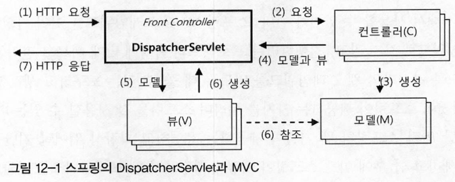
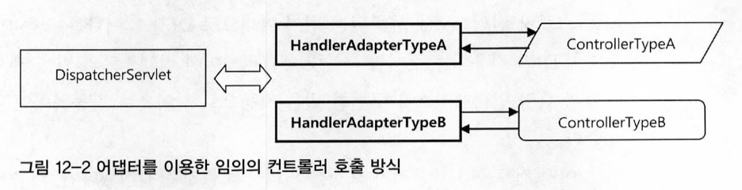

# 스프링의 웹 프레젠테이션 계층 기술
프레젠테이션 계층은 복잡하고 다양한 기술의 조합으로 구성될 수 있다. 프레젠테이션 계층의 아키텍처와 기술을 구분하는 다양한 방법이 있겠지만, 스프링 애플리케이션 입장에서는 간단히 두 가지로 구분할 수 있다.
* 스프링 웹 기술을 사용하는 프레젠테이션 계층
* 스프링 외의 웹 기술을 사용하는 프레젠테이션 계층

스프링은 의도적으로 서블릿 웹 애플리케이션의 컨텍스트를 두 가지로 분리해놓았다.
* 루트 애플리케이션 컨텍스트
    * 웹 기술에서 완전히 독립적인 비즈니스 서비스 계층과 데이터 액세스 계층을 담고 있다.
* 서블릿 애플리케이션 컨텍스트
    * 스프링 웹 기술을 기반으로 동작하는 웹 관련 빈을 담고 있다.
    
이렇게 스프링 컨텍스트를 두 가지로 분리해둔 이유는 `스프링 웹 서블릿 컨텍스트를 통째로 다른 기술로 대체할 수 있도록 하기 위해서`다.
## 스프링에서 사용되는 웹 프레임워크의 종류
스프링 엔터프라이즈 애플리케이션에 사용할 수 있는 웹 프레임워크의 종류를 살펴보자.(웹 컨텍스트 구성 방법은 10장에서)
### 스프링 웹 프레임워크
스프링이 직접 제공하는 웹 프레임워크를 살펴보자.
#### 스프링 서블릿/스프링 MVC
스프링이 직접 제공하는 서블릿 기반의 MVC 프레임워크다. 스프링 서블릿 또는 스프링 MVC라고 부른다. 프론트 컨트롤러 역할을 하는 DispatcherServlet을 핵심 엔진으로 사용한다. 
스프링 서블릿은 다양한 종류의 컨트롤러를 동시에 사용할 수 있게 설계되어 있다. 스프링답게 MVC 프레임워크의 많은 기능을 자유롭게 확장할 수 있다. 어노테이션 설정과 유연한 핸들러 메소드를 지원하는 스프링 @MVC가 가장 대표적으로 사용되는 스프링 서블릿 기반의 기술이다. 
`스프링 서블릿의 모든 컴포넌트는 스프링의 서블릿 애플리케이션 컨텍스트의 빈으로 등록되어 동작`한다. 따라서 간단히 루트 컨텍스트에 존재하는 서비스 계층의 빈을 사용할 수 있다.
#### 스프링 포틀릿
스프링이 제공하는 포틀릿 MVC 프레임워크다. 
서블릿과 유사한 포틀릿 컨테이너에서 동작하며 포틀릿이라는 자유로운 조합이 가능한 작은 단위의 프레젠테이션 컴포넌트를 포틀릿을 지원하는 포탈 서버에 배치해서 사용한다. 
스프링 포틀릿은 스프링 서블릿 MVC 프레임워크와 거의 동일한 기능을 제공한다.
### 스프링 포트폴리오 웹 프레임워크
스프링 서블릿을 기반으로 하는 고급 웹 프레임워크의 종류를 알아보자. 
스프링 스스로 확장시켜 만든 @MVC같은 전용 프레임워크 외에 스프링의 포트폴리오 프로젝트나 서드파티 업체를 통해 개발된 프레임워크를 말한다.
#### Spring Web Flow(SWF)
스프링 서블릿을 기반으로 해서 상태 유지(stateful) 스타일의 웹 애플리케이션을 작성하게 해주는 프레임워크다. 
컨트롤러를 직접 코드로 작성하지 않아도, DSL을 이용해 웹 페이지의 흐름과 규칙을 지정해주면 상태정보를 유지하는 고급 웹 애플리케이션을 손쉽게 개발할 수 있다.
#### Spring JavaScript
자바스크립트 툴킷인 Dojo를 추상화한 것으로, 스프링 서블릿과 스프링 웹 플로우에 연동해서 손쉽게 Ajax 기능을 구축할 수 있도록 만들어졌다.
#### Spring Faces
JSF를 스프링 MVC와 스프링 SWF의 뷰로 손쉽게 사용할 수 있게 해주는 프레임워크다.
#### Spring Web Service
스프링 MVC와 유사한 방식으로 SOAP 기반의 웹 서비스 개발을 가능하게 해주는 프레임워크다. 
강력한 오브젝트 매핑 기능과 XML 마샬링 기능을 제공하고 있으며 spring security를 비롯한 각종 스프링의 기능을 활용할 수 있다. 
스프링 포트폴리오 프로젝트의 하나다.
### 스프링을 기반으로 두지 않는 웹 프레임워크
스프링 서블릿/MVC 대신 사용할 수 있는 웹 기술이나 웹 프레임워크를 살펴보자.
#### JSP/Servlet
기존에 만들어뒀던 모델 1 방식의 JSP나 서블릿을 스프링 애플리케이션의 웹 프레젠테이션 계층으로 사용할 수 있다.

> 모델 1, 2 방식이란? [https://hsp1116.tistory.com/9](https://hsp1116.tistory.com/9)

#### Struts1
#### Struts2
#### Tapestry 3,4
#### JSF/Seam
## 스프링 MVC와 DispatcherServlet 전략
프레임워크 기술은 두 가지 방향으로 발전하고 있다.
1. 유연성과 확장성에 중점을 둔 범용적 프레임워크(ex. spring)
2. 자기 주장이 강하고 기술 선호도가 분명한, 제한적인 기술만을 사용하도록 강제하는 고속개발 프레임워크(ex. Ruby on Rails, Django)

1번과 같은 프레임워크는 계층과 기술이 서로의 내부를 잘 알고 강하게 결합되는 것을 극도로 꺼린다. 이런 프레임워크는 유연한 아키텍처를 가지고 장기적으로 많은 인원이 큰 규모의 시스템을 개발할 때 적합하다. 
2번과 같은 프레임워크는 전 계층이 매우 긴밀하게 연동하고 있기 때문에 계층 간의 느슨한 연결을 유지해야 하는 부담이 없고 강하게 결합된 최적화된 코드를 만들 수 있다. 그만큼 계층과 구조가 단순하고 각 기술의 장점을 극대화할 수 있으면서 미리 정해진 관례에 따라 개발만 하면 되기 때문에 많은 코드와 설정을 생략하고 빠르게 개발할 수 있다. 

스프링을 잘 사용하는 비결은 이러한 스프링의 유연한 확장성을 최대한 활용하면서 두 번째 스타일의 프레임워크를 지향하는 것이다. 즉, 스프링이 제공하는 유연하고 확장성이 뛰어난 구조를 이용하면서 각 프로젝트에 맞는 최적화된 구조를 만들어내고, 관례를 따라 빠르게 개발 가능한 스프링 기반의 프레임워크를 만들어서 사용해야 한다는 의미다. 
스프링은 특정 기술이나 방식에 매이지 않으면서 웹 프레젠테이션 계층의 각종 기술을 조합, 확장해서 사용할 수 있는 매우 유연한 웹 애플리케이션 개발의 기본 틀을 제공해준다. 이 틀이 제공하는 다양한 전략의 확장 포인트를 이용하여 스프링 스스로 기본적인 MVC 프레임워크를 만들어뒀다. 스프링을 사용하는 개발자라면 스프링이 제공해준 MVC 프레임워크 위에 필요한 전략을 추가해서 사용할 수 있어야 한다. 
즉, 스프링 MVC 프레임워크를 이미 완성된 고정적인 프레임워크로 보지 말고, 진행하려는 프로젝트의 특성에 맞게 빠르고 편리한 개발이 가능하도록 자신만의 웹 프레임워크를 만드는데 쓸 수 있는 도구라고 생각해야 한다. 이것이 스프링이 제공하는 가치를 누리며 스프링을 잘 사용할 수 있는 비결이다.
### DispatcherServlet과 MVC 아키텍처
DispatcherServlet은 스프링의 웹 기술 핵심이다. 이 서블릿은 스프링의 웹 기술을 구성하는 다양한 전략을 DI로 구성해서 확장하도록 만들어진 스프링 서블릿/MVC의 엔진과 같은 역할을 한다. 
스프링 웹 기술의 근간이 되는 MVC 아키텍처는 보통 `프론트 컨트롤러(front controller)패턴`과 함께 사용된다.

> 프론트 컨트롤러 패턴 : 중앙집중형 컨트롤러를 프레젠테이션 계층의 제일 앞에 둬서 서버로 들어오는 모든 요청을 먼저 받아서 처리한다.

프론트 컨트롤러는 클라이언트가 보낸 요청을 받아서 공통적인 작업을 먼저 수행한 후에 적절한 세부 컨트롤러로 작업을 위임해주고, 클라이언트에게 보낼 뷰를 선택해서 최종 결과를 생성하는 등의 작업을 수행한다. 
스프링 서블릿/MVC의 핵심은 DispatcherServlet이라는 프론트 컨트롤러다.

#### (1) DispatcherServlet의 HTTP 요청 접수
자바 서버의 서블릿 컨테이너는 HTTP 프로토콜을 통해 들어오는 요청이 스프링의 DispatcherServlet에 할당된 것이라면 HTTP 요청정보를 DispatcherServlet에 전달해준다. 
DispatcherServlet은 모든 요청에 대해 공통적으로 전행해야 하는 전처리 작업이 등록된 것이 있다면 이를 먼저 수행한다. 공통적으로 이용 가능한 보안이나 파라미터 조작, 한글 디코딩과 같은 작업이 적용된다.
#### (2) DispatcherServlet에서 컨트롤러로 HTTP 요청 위임
DispatcherServlet은 URL이나 파라미터 정보, HTTP 명령 등을 참고로 해서 어떤 컨트롤러에게 작업을 위임할 지 결정한다. 
컨트로러를 선정하는 것은 DispatcherServlet의 핸들러 매핑 전략을 이용한다. 이 핸들러 매핑 전략은 DispatcherServlet의 수정 없이도 DI를 통해 얼마든지 확장 가능하다. 
어떤 컨트롤러가 요청을 처리하게 할지를 결정했다면 다음은 해당 컨트롤러의 메소드를 호출해서 실제로 웹 요청을 처리하는 작업을 위임한다. 그렇다면 DispatcherServlet이 어떤 컨트롤러 오브젝트의 메소드를 호출해야하는지 어떻게 알 수 있을까? 이는 어댑터를 이용하여 해결한다. 
전형적인 `오브젝트 어댑터 패턴`을 사용해서 특정 컨트롤러를 호출해야 할 때는 해당 컨트롤러 타입을 지원하는 어댑터를 중간에 껴서 호출한다. 그러면 DispatcherServlet은 항상 일정한 방식으로 컨트롤러를 호출하고 결과를 받을 수 있다. 

> 오브젝트 어댑터 패턴 : [https://invincibletyphoon.tistory.com/20](https://invincibletyphoon.tistory.com/20)

DispatcherServlet은 컨트롤러가 어떤 메소드를 가졌고 어떤 인터페이스를 구현했는지 전혀 알지 못한다. 대신 컨트롤러의 종류에 따라 적절한 어댑터를 사용한다. 각 어댑터는 자신이 담당하는 컨트롤러에 맞는 호출 방법을 이용해서 컨트롤러에 작업 요청을 보내고 결과를 돌려받아서 DispatcherServlet에게 다시 돌려준다. 이렇게 하면 하나의 DispatcherServlet이 동시에 여러 가지 타입의 컨트롤러를 사용할 수 있다. 
DispatcherServlet이 핸들러 어댑터에 웹 요청을 전달할 때는 모든 웹 요청 정보가 담긴 HttpServletRequest 타입의 오브젝트를 전달해준다. 이를 어댑터가 적절히 변환해서 컨트롤러의 메소드가 받을 수 있는 파라미터로 변환해서 전달해주는 것이다. HttpServletResponse도 함께 전달해준다.
#### (3) 컨트롤러의 모델 생성과 정보 등록
MVC 패턴의 장점은 정보를 담고 있는 모델과 정보를 어떻게 뿌려줄지를 알고 있는 뷰가 분리된다는 점이다. 즉, 같은 모델이지만 뷰에 따라 다른 방식으로 모델의 정보가 출력되게 할 수 있다. 
컨트롤러의 작업은 먼저 사용자 요청을 해석하는 것, 그에 따라 실제 비즈니스 로직을 수행하도록 서비스 계층 오브젝트에게 작업을 위임하는 것, 결과를 받아서 모델을 생성하는 것, 마지막으로 어떤 뷰를 사용할 지 결정하는 것, 네 가지로 분류할 수 있다. 
모델을 생성하고 모델에 정보를 넣어주는 게 컨트롤러가 해야 할 마지막 중요한 두 가지 작업 중 하나다. 컨트롤러가 어떤 식으로든 다시 DispatcherServlet에 돌려줘야 할 두 가지 정보가 있는데 바로 `모델과 뷰`이다. 
모델은 보통 맵에 담긴 정보라고 보면 된다.   
#### (4) 컨트롤러의 결과 리턴: 모델과 뷰
모델이 준비됐으면 다음은 뷰를 결정할 차례다. 뷰도 하나의 오브젝트기 때문에 컨트롤러가 뷰 오브젝트를 직접 리턴할 수도 있지만, 보통은 뷰의 논리적인 이름을 리턴해주면 DispatcherServlet의 전략인 뷰 리졸버가 이를 이용해 뷰 오브젝트를 생성해준다. 대표적으로 사용되는 뷰는 JSP/JSTL 뷰다. 
결국 컨트롤러가 리턴해주는 정보는 모델과 뷰 두가지로, 스프링에는 ModelAndView라는 이름의 오브젝트가 있는데 이 ModelAndView가 DispatcherServlet이 최종적으로 어댑터를 통해 컨트롤러로부터 돌려받는 오브젝트다. 이름 그대로 모델과 뷰, 두 가지 정보를 담고 있다. 
모델과 뷰를 넘기는 것으로 컨트롤러의 책임은 끝이다.
#### (5) DispatcherServlet의 뷰 호출과 (6) 모델 참조
DispatcherServlet이 컨트롤러로부터 모델과 뷰를 받은 뒤에 진행하는 작업은 뷰 오브젝트에게 모델을 전달해주고 클라이언트에게 돌려줄 최종 결과물을 생성해달라고 요청하는 것이다. 보통 HTML을 생성하는 일이 가장 흔한 뷰의 작업이다. 
JSP를 이용해서 결과물을 만들어주는 JstlView는 컨트롤러가 돌려준 JSP 뷰 템플릿의 이름을 가져다 HTML을 생성하는데 그 중 동적으로 생성되도록 표시된 부분은 모델의 내용을 참고로 해서 채운다. 
기술적으로 보자면 뷰 작업을 통한 최종 결과물은 HttpServletResponse 오브젝트 안에 담긴다.
#### (7) HTTP 응답 돌려주기
뷰 생성까지의 모든 작업을 마쳤으면 DispatcherServlet은 등록된 후처리기가 있는지 확인하고, 있다면 후처리기에서 후속 작업을 진행한 뒤에 뷰가 만들어준 HttpServletResponse에 담긴 최종 결과를 서블릿 컨테이너에게 돌려준다. 서블릿 컨테이너는 HttpServletResponse에 담긴 정보를 HTTP 응답으로 만들어 사용자의 브라우저나 클라이언트에게 전송하고 작업을 종료한다. 
### DispatcherServlet의 DI 가능한 전략
DispatcherServlet은 다양한 방식으로 동작방식과 기능을 확장, 변경할 수 있도록 준비된 전략이 존재한다.
#### HandlerMapping
`URL과 요청 정보를 기준으로 어떤 컨트롤러 오브젝트를 사용할 것인지를 결정하는 로직을 담당`한다. HandlerMapping 인터페이스를 구현해서 만들 수 있다. 
디폴트로는 `BeanNameUrlHandlerMapping`과 `DefaultAnnotationHandlerMapping` 두 가지가 설정돼있으며 디폴트 핸들러 매핑으로 충분하다면 추가 등록하지 않아도 된다.
#### HandlerAdapter
핸들러 매핑으로 선택한 컨트롤러를 DispatcherServlet이 호출할 때 사용하는 어댑터다. 
디폴트로 등록되어 있는 어댑터는 `HttpRequestHandlerAdapter`,`SimpleControllerHandlerAdapter`,`AnnotationMethodHandlerAdapter` 3가지다. 

> ex. @RequestMapping과 @Controller 어노테이션을 통해 정의되는 컨트롤러의 경우 DefaultAnnotationHandlerMapping에 의해 컨트롤러가 결정되고 그에 대응되는 AnnotationMethodHandlerAdapter에 의해 호출이 일어난다.
 
#### HandlerExceptionResolver
예외가 발생했을 때, 이를 처리하는 로직을 갖고 있다. 예외가 발생했을 때 예외의 종류에 따라 에러 페이지를 표시한다거나, 관리자에게 통보해주는 등의 작업은 개발 컨트롤러가 아니라 프론트 컨트롤러인 DispatcherServlet을 통해 처리돼야 한다. 
DispatcherServlet은 등록된 HandlerExceptionResolver 중에서 발생한 예외에 적합한 것을 찾아서 예외처리를 위임한다. 
디폴트 전략은 `AnnotationMethodHandlerExceptionResolver`, `ResponseStatusExceptionResolver`, `DefaultHandlerExceptionResolver` 3가지다.
#### ViewResolver
컨트롤러가 리턴한 뷰 이름을 참고해서 적절한 뷰 오브젝트를 찾아주는 로직을 가진 전략 오브젝트다. 
디폴트로 등록된 `InternalResourceViewResolver`는 JSP나 서블릿 같이 RequestDispatcher에 의해 포워딩될 수 있는 리소스를 뷰로 사용하게 해준다.
#### LocaleResolver
지역(locale)정보를 결정해주는 전략이다. 
디폴트인 `AcceptHeaderLocaleResolver`는 HTTP 헤더의 정보를 보고 지역정보를 설정해준다.
#### ThemeResolver
테마를 가지고 이를 변경해서 사이트를 구성할 경우 쓸 수 있는 테마 정보를 결정해주는 전략이다.
#### RequestToViewNameTranslator
컨트롤러에서 뷰 이름이나 뷰 오브젝트를 제공해주지 않았을 경우 URL과 같은 요청정보를 참고해서 자동으로 뷰 이름을 생성해주는 전략이다. 
디폴트는 `DefaultRequestToViewNameTrannslator`다.